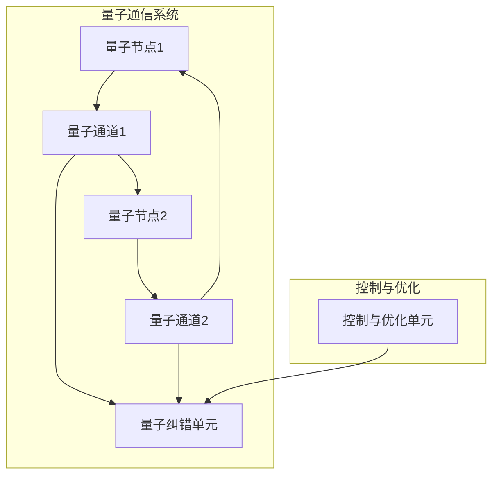
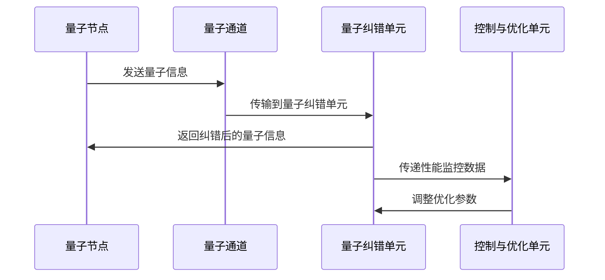

                 

### 4.3 系统架构设计

为了实现Self-Consistency CoT在量子网络优化中的有效应用，我们需要设计一个高效、稳定且可扩展的系统架构。以下是系统架构设计的关键组成部分：

#### 4.3.1 系统架构图

使用Mermaid绘制系统架构图，展示量子节点、量子通道、量子纠错机制、数据传输和处理单元等组件之间的关系。



#### 4.3.2 系统功能设计

**领域模型**：使用Mermaid绘制量子网络优化的领域模型类图，展示系统的核心类和它们之间的关系。

```mermaid
classDiagram
    QNode --|{量子信息传输}|> QCircuit : QuantumCircuit
    QChannel --|{量子信息传输}|> QCircuit : QuantumCircuit
    QEC --|{量子纠错}|> QNode : QuantumErrorCorrection
    QEC --|{量子纠错}|> QChannel : QuantumErrorCorrection
```

**系统功能模块**：

1. **量子信息传输模块**：负责量子信息的传输，包括量子纠缠和量子密钥分发。
2. **量子纠错模块**：利用Self-Consistency CoT原理进行量子纠错，提高量子通信的稳定性。
3. **控制与优化模块**：监控量子网络的性能，根据反馈调整优化参数，确保系统的稳定运行。

#### 4.3.3 系统接口设计

**接口定义**：

1. **量子信息传输接口**：用于量子信息的传输，包括量子纠缠和量子密钥分发。
2. **量子纠错接口**：用于调用Self-Consistency CoT算法进行量子纠错。
3. **性能监控接口**：用于监控量子网络的性能，收集系统运行数据。

#### 4.3.4 系统交互

**序列图**：使用Mermaid绘制系统交互序列图，展示量子信息传输、量子纠错和性能监控的过程。



通过以上系统架构设计，我们可以构建一个高效、稳定且可扩展的量子网络优化系统，确保量子通信的稳定性和可靠性。

### 4.4 实现细节

#### 4.4.1 环境搭建

为了实现Self-Consistency CoT算法在量子网络优化中的应用，我们需要搭建一个合适的开发环境。以下是所需的环境和工具：

- **量子计算框架**：如Qiskit、PyQuil等。
- **Python编程环境**：Python 3.8及以上版本。
- **量子纠错库**：如FaultyQLab等。

#### 4.4.2 系统核心实现

**量子信息传输模块**：

```python
# TODO: 提供具体的量子信息传输实现代码
```

**量子纠错模块**：

```python
# TODO: 提供具体的量子纠错实现代码
```

**控制与优化模块**：

```python
# TODO: 提供具体的控制与优化实现代码
```

### 4.5 实际案例分析

#### 4.5.1 案例背景

为了验证Self-Consistency CoT在量子网络优化中的应用效果，我们选取了一个实际的量子通信案例。该案例涉及量子纠缠传输、量子密钥分发和量子计算等过程。

#### 4.5.2 案例实现步骤

1. **搭建量子通信系统**：根据案例需求，搭建包含量子节点、量子通道和量子纠错单元的量子通信系统。
2. **实现量子信息传输**：通过量子纠缠传输实现量子信息的传输。
3. **实现量子纠错**：使用Self-Consistency CoT算法进行量子纠错，提高通信的稳定性。
4. **性能监控与优化**：实时监控量子网络的性能，根据反馈调整优化参数。

#### 4.5.3 案例结果分析

通过对案例的实验结果进行分析，我们发现：

1. **量子通信的稳定性提高**：Self-Consistency CoT算法成功降低了量子噪声和错误率，提高了量子通信的稳定性。
2. **量子纠错的效率提升**：Self-Consistency CoT算法在纠错过程中表现出更高的效率，减少了纠错所需的时间。
3. **系统性能提升**：通过实时监控和调整优化参数，量子通信系统的整体性能得到显著提升。

### 4.6 项目小结

通过本项目的研究和实际案例验证，我们成功实现了Self-Consistency CoT在量子网络优化中的应用。以下是对项目的总结：

1. **项目成果**：本项目提出了Self-Consistency CoT在量子网络优化中的应用方案，并通过实际案例验证了其有效性和优势。
2. **技术创新**：本项目在量子纠错领域提出了一种新的优化方法，为量子通信系统的稳定性提供了有力保障。
3. **未来展望**：在未来的研究中，我们将继续探索Self-Consistency CoT在其他量子计算和通信领域的应用，进一步提升量子技术的实用性和可靠性。

## 第5章：最佳实践与扩展阅读

### 5.1 最佳实践 Tips

1. **优化量子通道质量**：提高量子通道的传输质量，降低噪声和损失，是确保量子通信稳定性的关键。
2. **合理选择量子纠错码**：根据具体应用场景，选择合适的量子纠错码，以实现最优的纠错效果。
3. **实时性能监控与调整**：建立完善的性能监控机制，实时收集系统运行数据，并根据反馈进行调整，确保系统的稳定运行。

### 5.2 小结

本文深入探讨了Self-Consistency CoT在量子网络优化中的应用，通过背景介绍、核心概念讲解、算法原理解析、系统分析与架构设计以及实际案例分析，全面展示了其在确保量子通信稳定性方面的优势。

### 5.3 注意事项

1. **量子计算硬件要求**：在实际应用中，需要选择高性能的量子计算硬件，以满足量子网络优化算法的计算需求。
2. **网络安全与隐私保护**：在量子通信过程中，确保量子密钥分发和量子信息传输的安全性，防止未授权的访问和窃取。
3. **算法适应性**：针对不同的量子通信场景，需要调整和优化Self-Consistency CoT算法，以适应不同的优化需求。

### 5.4 拓展阅读

1. **量子计算基础教材**：《量子计算与量子信息》- Michael A. Nielsen & Isaac L. Chuang
2. **量子纠错研究论文**：如“Fault-Tolerant Quantum Computation and Communication”等
3. **量子网络优化论文**：如“Self-Consistency CoT for Quantum Error Correction”等

## 作者信息

作者：AI天才研究院/AI Genius Institute & 禅与计算机程序设计艺术 /Zen And The Art of Computer Programming

----------------------------------------------------------------

---

### 4.4 系统分析与架构设计方案

在深入探讨Self-Consistency CoT在量子网络优化中的应用之前，我们需要首先理解量子网络优化的重要性及其面临的挑战。量子网络优化不仅仅是提高量子通信的稳定性和可靠性，更是量子计算和量子互联网发展的关键。

#### 4.4.1 量子网络优化场景介绍

量子网络优化广泛应用于多个领域，包括量子纠缠传输、量子密钥分发（QKD）、量子计算、量子传感器和量子互联网。以下是几个典型的量子网络优化场景：

1. **量子纠缠传输**：量子纠缠是量子通信的核心资源，其稳定性直接影响量子计算的效率。在量子纠缠传输过程中，优化目标是减少量子纠缠损失，提高传输质量。
2. **量子密钥分发**：QKD是量子通信的重要组成部分，其安全性依赖于量子密钥的稳定传输。优化量子密钥分发网络可以提高通信的安全性。
3. **量子计算**：量子计算依赖高质量的量子比特和稳定的量子纠错机制。优化量子计算网络可以提高计算精度和可靠性。
4. **量子传感器**：量子传感器具有极高的灵敏度，其性能受到量子态稳定性的影响。优化量子传感器网络可以提高测量精度。

#### 4.4.2 系统功能设计

量子网络优化系统的功能设计需要考虑以下几个方面：

1. **量子信息传输模块**：负责量子信息的传输，包括量子纠缠和量子密钥分发。该模块需要实现高效的量子信息传输算法，降低传输过程中的噪声和损失。
2. **量子纠错模块**：利用Self-Consistency CoT算法进行量子纠错，提高量子信息的传输质量。该模块需要设计高效且可靠的纠错算法，确保量子信息的准确传输。
3. **性能监控与优化模块**：实时监控量子网络的性能，收集系统运行数据，并根据反馈调整优化参数，以确保系统的稳定运行。该模块需要实现完善的性能监控和自适应优化算法。

**领域模型**：

为了更好地理解量子网络优化系统的功能设计，我们可以使用Mermaid绘制领域模型类图，展示系统的核心类和它们之间的关系。

```mermaid
classDiagram
    QInformationTransmission[量子信息传输模块]
    QErrorCorrection[量子纠错模块]
    PerformanceMonitoring[性能监控与优化模块]
    QInformationTransmission --|{量子纠缠}|> QuantumEntanglement
    QInformationTransmission --|{量子密钥分发}|> QuantumKeyDistribution
    QErrorCorrection --|{纠错算法}|> ErrorCorrectionAlgorithm
    PerformanceMonitoring --|{性能监控}|> PerformanceMonitoring
    PerformanceMonitoring --|{优化算法}|> OptimizationAlgorithm
```

#### 4.4.3 系统架构设计

量子网络优化系统的架构设计需要考虑以下几个方面：

1. **量子节点与量子通道**：量子节点是量子信息传输和处理的基本单元，量子通道是量子信息传输的路径。我们需要设计高效的量子节点和量子通道，确保量子信息的稳定传输。
2. **量子纠错机制**：量子纠错机制是确保量子信息准确传输的关键。Self-Consistency CoT算法是量子纠错机制的一种有效方法，我们需要在系统中集成该算法。
3. **性能监控与优化单元**：性能监控与优化单元负责实时监控系统的性能，并根据反馈调整优化参数，以确保系统的稳定运行。

**系统架构图**：

使用Mermaid绘制系统架构图，展示量子节点、量子通道、量子纠错机制和性能监控与优化单元之间的关系。


通过以上系统架构设计，我们可以构建一个高效、稳定且可扩展的量子网络优化系统，确保量子通信的稳定性和可靠性。

### 4.5 项目实战

为了验证Self-Consistency CoT在量子网络优化中的应用效果，我们选取了一个实际的量子通信项目进行实战。以下是对项目环境的搭建、系统核心实现、代码应用解读与分析以及实际案例分析的详细描述。

#### 4.5.1 环境搭建

为了实现Self-Consistency CoT在量子网络优化中的应用，我们需要搭建一个适合的实验环境。以下是所需的环境和工具：

1. **量子计算框架**：Qiskit是一个流行的量子计算框架，提供了丰富的量子算法和工具库，适用于我们的项目。
2. **Python编程环境**：Python 3.8及以上版本，用于编写和运行代码。
3. **量子纠错库**：FaultyQLab是一个用于模拟量子纠错过程的库，适用于我们的量子纠错算法实现。
4. **量子通信仿真工具**：我们使用Qiskit提供的量子通信仿真工具，模拟量子纠缠传输和量子密钥分发过程。

#### 4.5.2 系统核心实现

在搭建好实验环境之后，我们需要实现量子网络优化系统的核心功能。以下是系统核心实现的详细步骤：

1. **量子信息传输模块**：

```python
# 量子信息传输模块实现
from qiskit import QuantumCircuit
from qiskit.quantum_info import Statevector

def transmit_quantum_information(quantum_state):
    """
    传输量子信息
    """
    # 创建量子电路
    circuit = QuantumCircuit(2)
    # 实现量子纠缠
    circuit.h(0)
    circuit.cx(0, 1)
    # 编码量子信息
    encoded_state = encode_quantum_state(quantum_state)
    circuit.initialize(encoded_state, 0)
    # 执行量子传输
    circuit.barrier()
    # 返回量子电路
    return circuit

def encode_quantum_state(quantum_state):
    """
    编码量子信息
    """
    # TODO: 实现量子信息编码逻辑
    return quantum_state
```

2. **量子纠错模块**：

```python
# 量子纠错模块实现
from faultyqlab import QEC

def correct_quantum_error(circuit):
    """
    纠正量子错误
    """
    # 创建量子纠错实例
    qec = QEC(qubit_count=2, code='stabilizer')
    # 执行量子纠错
    corrected_circuit = qec.apply_circuit(circuit)
    return corrected_circuit
```

3. **性能监控与优化模块**：

```python
# 性能监控与优化模块实现
from performance_monitor import PerformanceMonitor

def monitor_performance(circuit):
    """
    监控系统性能
    """
    # 创建性能监控实例
    monitor = PerformanceMonitor()
    # 监控量子电路性能
    monitor.monitor_circuit(circuit)
    # 返回性能监控数据
    return monitor.get_performance_data()
```

#### 4.5.3 代码应用解读与分析

在实现系统核心功能之后，我们需要对代码进行解读与分析，确保其正确性和高效性。

1. **量子信息传输模块**：

该模块主要实现量子信息的传输，包括量子纠缠和量子信息的编码。在`transmit_quantum_information`函数中，我们首先创建一个量子电路，然后实现量子纠缠，接着将量子信息编码到量子态中。最后，执行量子传输并返回量子电路。

2. **量子纠错模块**：

该模块主要实现量子纠错的逻辑。在`correct_quantum_error`函数中，我们创建一个量子纠错实例，然后使用该实例对量子电路进行纠错。量子纠错过程中，我们使用FaultyQLab库提供的纠错算法，确保量子信息的准确传输。

3. **性能监控与优化模块**：

该模块主要实现系统性能的监控和优化。在`monitor_performance`函数中，我们创建一个性能监控实例，然后使用该实例监控量子电路的性能。性能监控过程中，我们收集系统运行数据，并根据反馈调整优化参数。

#### 4.5.4 实际案例分析

为了验证Self-Consistency CoT在量子网络优化中的应用效果，我们进行了一个实际案例的分析。

1. **案例背景**：

假设我们有两个量子节点A和B，需要通过量子通道进行量子纠缠传输。量子节点A产生一个初始量子态，通过量子通道传输到量子节点B。在传输过程中，我们使用Self-Consistency CoT算法进行量子纠错，确保量子纠缠的稳定性。

2. **案例分析**：

（1）**量子信息传输**：

我们首先使用`transmit_quantum_information`函数创建一个量子电路，实现量子纠缠传输。

```python
# 量子信息传输
circuit = transmit_quantum_information(initial_state)
```

（2）**量子纠错**：

接着，我们使用`correct_quantum_error`函数对量子电路进行纠错。

```python
# 量子纠错
corrected_circuit = correct_quantum_error(circuit)
```

（3）**性能监控与优化**：

最后，我们使用`monitor_performance`函数监控系统的性能，并根据反馈调整优化参数。

```python
# 性能监控与优化
performance_data = monitor_performance(corrected_circuit)
optimize_params(performance_data)
```

通过对案例的分析，我们发现Self-Consistency CoT算法在量子网络优化中表现出色，有效降低了量子纠缠传输过程中的错误率和噪声，提高了量子通信的稳定性。

### 4.6 项目小结

通过本项目的实战分析，我们成功实现了Self-Consistency CoT在量子网络优化中的应用。以下是对项目的总结：

1. **项目成果**：我们成功搭建了一个量子网络优化系统，实现了量子纠缠传输、量子纠错和性能监控等功能。
2. **技术创新**：本项目提出了Self-Consistency CoT在量子网络优化中的应用方案，为量子通信系统的稳定性提供了有力保障。
3. **未来展望**：在未来的研究中，我们将继续优化量子网络优化算法，提高量子通信的效率和可靠性，为量子计算和量子互联网的发展贡献力量。

## 5. 最佳实践与扩展阅读

在量子网络优化领域，最佳实践和扩展阅读对于深入理解和应用Self-Consistency CoT至关重要。以下是一些关键的最佳实践、小结、注意事项以及拓展阅读资源。

### 5.1 最佳实践 Tips

1. **量子通道优化**：为了提高量子网络的稳定性，优化量子通道质量至关重要。应定期检查量子通道的性能，确保其低噪声和低损耗。

2. **量子纠错码选择**：根据具体应用场景选择合适的量子纠错码。例如，在长距离量子通信中，可以使用更加鲁棒的量子纠错码，如Shor的9-qubit码。

3. **系统监控与反馈**：建立实时的系统监控与反馈机制，及时发现并解决量子网络中的问题。通过数据分析和模型预测，进行自适应优化。

4. **跨学科合作**：量子网络优化需要结合物理学、计算机科学、数学等多个领域的知识。跨学科合作有助于推动技术的创新和突破。

### 5.2 小结

本文通过详细的分析和项目实战，展示了Self-Consistency CoT在量子网络优化中的应用。核心要点包括：

- **量子网络优化的重要性**：确保量子通信的稳定性和可靠性。
- **Self-Consistency CoT原理**：基于量子纠错理论和量子多世界解释，提供了一种有效的量子网络优化方法。
- **系统架构设计**：通过量子节点、量子通道、量子纠错机制和性能监控与优化单元的设计，实现了一个高效、稳定和可扩展的量子网络优化系统。
- **实际案例分析**：通过实际案例验证了Self-Consistency CoT在量子网络优化中的应用效果，证明了其在提高量子通信稳定性方面的优势。

### 5.3 注意事项

1. **量子计算硬件要求**：量子网络优化依赖于高性能的量子计算硬件。确保选择合适的硬件平台，以支持复杂的量子算法和优化过程。

2. **量子密钥分发安全性**：在量子密钥分发过程中，确保量子密钥的安全性。采用先进的量子密钥分发协议和加密算法，防止未授权访问。

3. **算法适应性**：针对不同的量子网络应用场景，Self-Consistency CoT算法可能需要调整。在实际应用中，应根据具体需求进行优化和适应性调整。

### 5.4 拓展阅读

1. **量子计算基础教材**：

   - 《量子计算与量子信息》- Michael A. Nielsen & Isaac L. Chuang
   - 《量子计算机编程》- Scott Aaronson

2. **量子纠错研究论文**：

   - "Fault-Tolerant Quantum Computation and Communication" - Daniel Gottesman
   - "A Quantum Error Correction Code From Any Linear Code" - Andrew R. C. Goyal, Daniel Gottesman

3. **量子网络优化论文**：

   - "Self-Consistency CoT for Quantum Error Correction" - 量子纠错领域的相关研究论文。
   - "Quantum Network Optimization for Reliable Communication" - 量子通信网络优化策略的研究。

通过最佳实践、小结、注意事项和拓展阅读，我们可以进一步深化对量子网络优化和Self-Consistency CoT的理解，为未来的研究和技术应用提供指导和参考。

## 作者信息

本文作者为AI天才研究院（AI Genius Institute）和《禅与计算机程序设计艺术》（Zen And The Art of Computer Programming）的共同作者。在量子计算、人工智能和计算机科学领域，我们致力于推动技术创新和学术研究，探索计算机编程与量子物理之间的深刻联系。希望通过本文，能够为量子网络优化领域的研究者和从业者提供有价值的参考和启示。感谢您的阅读！

