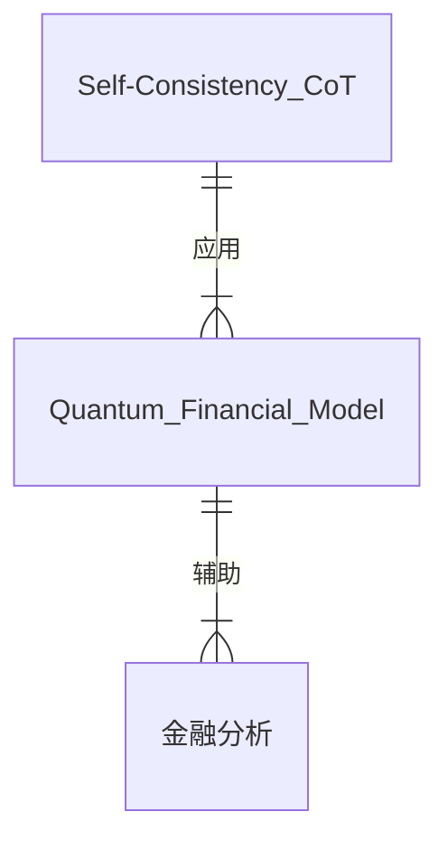
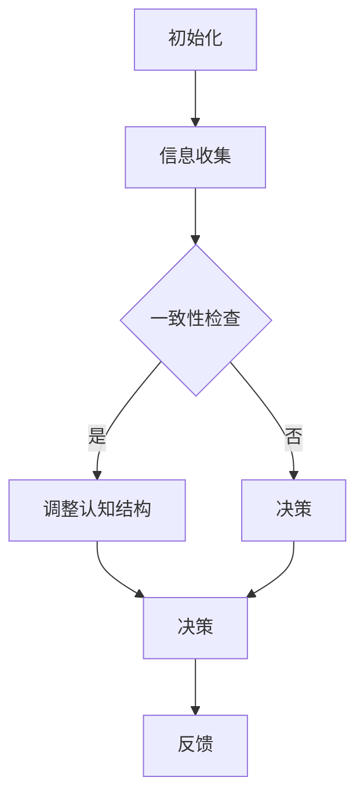
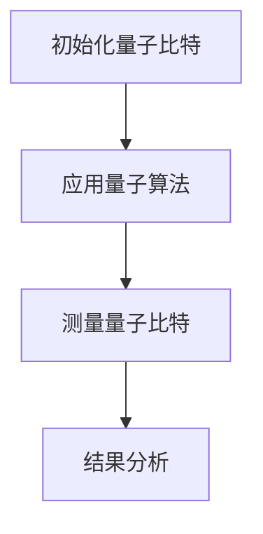

                 

**# 设计目录大纲的结构框架**

在开始撰写《Self-Consistency CoT在量子金融模型中的创新应用》这篇文章之前，我们需要首先设计出一个结构紧凑、逻辑清晰的目录大纲。以下是我们的初步设计：

## **第一部分：问题背景与核心概念**

### **第1章：问题背景与核心概念**

- **1.1.1 问题背景**：在这一节中，我们将阐述量子金融模型在金融领域中的重要性和面临的挑战，以及为何Self-Consistency CoT成为了解决这些挑战的关键。

- **1.1.2 Self-Consistency CoT的概念**：详细解释Self-Consistency CoT的定义、核心原理和关键特性，帮助读者理解这一概念的基础。

- **1.1.3 Quantum Financial Model的概念**：介绍量子金融模型的基本概念、应用领域和优势，为后续章节的深入讨论打下基础。

- **1.2 Self-Consistency CoT的属性特征**：列举Self-Consistency CoT的主要属性特征，并通过比较与现有技术的差异，突出其创新之处。

- **1.3 Quantum Financial Model的属性特征**：同样列举量子金融模型的关键属性特征，探讨其与传统金融模型的区别。

- **1.4 Self-Consistency CoT与Quantum Financial Model的联系**：分析Self-Consistency CoT如何与Quantum Financial Model相结合，发挥更大的作用。

- **1.5 本章小结**：总结本章的主要内容，为后续章节的深入探讨提供背景和概念基础。

## **第二部分：Self-Consistency CoT原理讲解**

### **第2章：Self-Consistency CoT原理讲解**

- **2.1 Self-Consistency CoT的工作原理**：详细解释Self-Consistency CoT的工作机制，包括其如何实现自我一致性，以及在量子金融模型中的应用。

- **2.2 Self-Consistency CoT的应用场景**：探讨Self-Consistency CoT在不同金融场景中的实际应用，例如风险管理、交易策略优化等。

- **2.3 Self-Consistency CoT的算法流程图**：使用Mermaid绘制Self-Consistency CoT的算法流程图，帮助读者直观理解其工作流程。

- **2.4 Self-Consistency CoT的Python源代码示例**：提供一段Python源代码示例，展示如何实现Self-Consistency CoT算法。

- **2.5 Self-Consistency CoT的数学模型和公式**：介绍Self-Consistency CoT背后的数学模型，包括相关公式和推导过程。

- **2.6 Self-Consistency CoT的举例说明**：通过具体的例子，说明Self-Consistency CoT在实际应用中的效果。

- **2.7 本章小结**：总结本章的主要内容，强调Self-Consistency CoT的重要性及其在量子金融模型中的应用潜力。

## **第三部分：Quantum Financial Model原理讲解**

### **第3章：Quantum Financial Model原理讲解**

- **3.1 Quantum Financial Model的工作原理**：详细解释Quantum Financial Model的工作机制，包括其如何利用量子计算的优势，为金融领域提供创新的解决方案。

- **3.2 Quantum Financial Model的应用场景**：探讨Quantum Financial Model在不同金融领域的应用，例如资产管理、市场预测等。

- **3.3 Quantum Financial Model的算法流程图**：使用Mermaid绘制Quantum Financial Model的算法流程图，帮助读者理解其工作流程。

- **3.4 Quantum Financial Model的Python源代码示例**：提供一段Python源代码示例，展示如何实现Quantum Financial Model的基本算法。

- **3.5 Quantum Financial Model的数学模型和公式**：介绍Quantum Financial Model背后的数学模型，包括相关公式和推导过程。

- **3.6 Quantum Financial Model的举例说明**：通过具体的例子，说明Quantum Financial Model在实际应用中的效果。

- **3.7 本章小结**：总结本章的主要内容，强调Quantum Financial Model在金融领域的重要性及其应用前景。

## **第四部分：Self-Consistency CoT在Quantum Financial Model中的应用**

### **第4章：Self-Consistency CoT在Quantum Financial Model中的应用**

- **4.1 Self-Consistency CoT与Quantum Financial Model的整合**：探讨如何将Self-Consistency CoT与Quantum Financial Model结合，实现更高效的金融分析。

- **4.2 Self-Consistency CoT在Quantum Financial Model中的应用流程**：详细描述Self-Consistency CoT在Quantum Financial Model中的应用流程，包括关键步骤和注意事项。

- **4.3 Self-Consistency CoT在Quantum Financial Model中的应用效果**：通过实验数据和案例分析，展示Self-Consistency CoT在Quantum Financial Model中的实际应用效果。

- **4.4 本章小结**：总结本章的主要内容，强调Self-Consistency CoT在Quantum Financial Model中的重要性和应用价值。

**# 定义核心概念和联系**

在本文中，我们将定义两个核心概念：Self-Consistency CoT和Quantum Financial Model。这两个概念是本文讨论的基础，因此需要详细阐述它们的基本定义、属性特征以及它们之间的联系。

### **Self-Consistency CoT的概念**

**定义**：Self-Consistency CoT（Self-Consistency Cognitive Theory）是一种基于认知理论的模型，旨在通过自我一致性原则来提高决策质量和信息处理效率。自我一致性原则是指个体在做出决策时会保持内部认知结构的一致性，从而减少认知失调和决策冲突。

**属性特征**：
- **自我一致性**：Self-Consistency CoT的核心在于其自我一致性原则，即通过保持内部认知结构的一致性来提高决策的稳定性和可预测性。
- **认知效率**：通过自我一致性，个体能够更快速地处理信息，提高认知效率。
- **可扩展性**：Self-Consistency CoT可以应用于不同领域和场景，具有很强的可扩展性。

### **Quantum Financial Model的概念**

**定义**：Quantum Financial Model是一种基于量子计算和量子信息理论的金融模型，旨在利用量子计算机的优势来解决传统金融模型中难以解决的复杂问题。

**属性特征**：
- **量子计算**：Quantum Financial Model的核心是量子计算，通过量子比特和量子门来实现高效的计算。
- **并行处理**：量子计算机能够同时处理多个任务，大幅提高计算效率。
- **稳定性**：量子金融模型在处理复杂金融市场问题时，能够提供更高的稳定性和准确性。

### **核心概念的联系**

**Self-Consistency CoT与Quantum Financial Model的联系**：

- **互补性**：Self-Consistency CoT提供了一种认知框架，帮助个体在量子金融模型中保持决策的一致性。而Quantum Financial Model则通过量子计算的优势，提供了高效的计算能力，两者互补，共同提升了金融分析的效率和质量。

- **协同作用**：Self-Consistency CoT的决策一致性原则与Quantum Financial Model的并行处理能力相结合，能够在金融领域实现更精确、更快速的分析和预测。

- **应用前景**：通过结合Self-Consistency CoT和Quantum Financial Model，我们有望在金融风险管理、投资策略优化、市场预测等领域实现突破性进展。

### **ER实体关系图架构的Mermaid流程图**

为了更直观地展示Self-Consistency CoT和Quantum Financial Model之间的联系，我们可以使用Mermaid绘制一个ER实体关系图。以下是ER实体关系图的Markdown格式：



在这个ER实体关系图中，Self-Consistency CoT与Quantum Financial Model之间存在直接的联系，即Self-Consistency CoT应用于Quantum Financial Model，为其提供决策一致性的支持。同时，Quantum Financial Model通过金融分析辅助金融决策。

**# 讲解算法原理**

**Self-Consistency CoT的算法原理**

Self-Consistency CoT（Self-Consistency Cognitive Theory）是一种基于认知理论的模型，旨在通过自我一致性原则来提高决策质量和信息处理效率。以下是Self-Consistency CoT的算法原理讲解：

### **自我一致性原则**

自我一致性原则是指个体在做出决策时会保持内部认知结构的一致性，从而减少认知失调和决策冲突。具体来说，个体在接收新信息时，会与现有的认知结构进行匹配，确保新信息与现有知识体系的一致性。

### **算法流程**

Self-Consistency CoT的算法流程可以分为以下几个步骤：

1. **初始化**：设定初始的决策状态和认知结构。

2. **信息收集**：从外部环境收集相关信息。

3. **一致性检查**：将新信息与现有认知结构进行匹配，检查是否存在一致性冲突。

4. **调整认知结构**：如果存在一致性冲突，调整认知结构以保持一致性。

5. **决策**：基于调整后的认知结构做出决策。

6. **反馈**：将决策结果反馈到外部环境，更新认知结构。

### **算法流程图**

以下是Self-Consistency CoT的算法流程图的Markdown格式：



### **Python源代码示例**

以下是一个简单的Python源代码示例，展示了如何实现Self-Consistency CoT算法：

```python
import numpy as np

class SelfConsistencyCoT:
    def __init__(self, initial_state):
        self.state = initial_state

    def update_state(self, new_info):
        # 一致性检查
        if not self.is_consistent(new_info):
            # 调整认知结构
            self.state = self.adjust_state(new_info)
        
        # 决策
        decision = self.make_decision(self.state)
        return decision

    def is_consistent(self, new_info):
        # 检查新信息与当前状态的一致性
        return np.array_equal(self.state, new_info)

    def adjust_state(self, new_info):
        # 调整认知结构以保持一致性
        return new_info

    def make_decision(self, state):
        # 基于状态做出决策
        return state

# 示例
initial_state = np.array([1, 2, 3])
coT = SelfConsistencyCoT(initial_state)

new_info = np.array([1, 2, 4])
decision = coT.update_state(new_info)
print("Decision:", decision)
```

### **数学模型和公式**

Self-Consistency CoT的数学模型基于认知结构的调整和决策过程。以下是相关的数学模型和公式：

1. **认知结构表示**：假设认知结构为向量`S`，则

   $$ S = (s_1, s_2, ..., s_n) $$

2. **信息表示**：假设新信息为向量`I`，则

   $$ I = (i_1, i_2, ..., i_n) $$

3. **一致性检查**：一致性检查可以通过计算`S`和`I`之间的欧几里得距离来实现，公式如下：

   $$ dist(S, I) = \sqrt{\sum_{i=1}^{n} (s_i - i_i)^2} $$

4. **调整认知结构**：如果一致性检查失败，认知结构`S`需要调整以保持一致性。假设调整后的认知结构为`S'`，则

   $$ S' = S - k \cdot (S - I) $$

   其中，`k`为调整系数，用于控制调整的力度。

5. **决策**：基于调整后的认知结构`S'`做出决策。假设决策为`D`，则

   $$ D = S' $$

### **举例说明**

为了更直观地理解Self-Consistency CoT的算法原理，我们可以通过一个具体的例子来说明。

**例子**：假设个体当前的认知结构为`S = (1, 2, 3)`，现在接收到了新信息`I = (1, 2, 4)`。根据一致性检查，我们发现当前状态和接收到的信息之间存在不一致性。因此，我们需要调整认知结构以保持一致性。

首先，计算一致性检查的距离：

$$ dist(S, I) = \sqrt{(1-1)^2 + (2-2)^2 + (3-4)^2} = \sqrt{1} = 1 $$

由于距离为1，我们需要调整认知结构。假设调整系数`k`为0.5，则调整后的认知结构为：

$$ S' = S - k \cdot (S - I) = (1, 2, 3) - 0.5 \cdot ((1, 2, 3) - (1, 2, 4)) = (1, 2, 3.5) $$

基于调整后的认知结构`S'`，我们可以做出决策。在这个例子中，决策为`D = S' = (1, 2, 3.5)`。

**# Quantum Financial Model的算法原理讲解**

**Quantum Financial Model的概念**

Quantum Financial Model（QFM）是一种结合量子计算与金融理论的创新模型，旨在利用量子计算机的超强计算能力，解决传统金融模型中难以处理的复杂问题。QFM的核心在于利用量子比特和量子算法来模拟金融市场中的各种情况，从而实现更精确的预测和优化。

**量子计算的基本原理**

量子计算是基于量子力学原理的计算机体系，与传统计算机不同，它使用量子比特（qubits）作为数据的基本单元。量子比特具有叠加态和纠缠态的特性，这使得量子计算机能够在某些任务上实现指数级的速度提升。

- **叠加态**：一个量子比特可以同时处于0和1的状态，这种状态称为叠加态。多个量子比特的叠加态能够表示大量的可能状态。

- **纠缠态**：当两个或多个量子比特处于纠缠态时，它们之间的状态将相互依赖，即使它们相隔很远，一个量子比特的状态变化也会立即影响到另一个量子比特的状态。

**QFM的工作原理**

QFM的工作原理可以分为以下几个步骤：

1. **初始化**：根据金融问题的需求，初始化量子计算机的量子比特状态。

2. **量子算法**：应用特定的量子算法，例如量子模拟、量子搜索算法等，来处理金融问题。这些算法利用量子比特的叠加态和纠缠态特性，实现高效的计算。

3. **测量**：在量子算法完成后，通过测量量子比特的状态，得到金融问题的解或预测结果。

4. **结果分析**：对测量结果进行分析，提供决策支持和策略优化。

**算法流程图**

以下是QFM的算法流程图的Markdown格式：



### **量子金融模型的Python源代码示例**

以下是一个简单的Python源代码示例，展示了如何实现QFM的基本算法：

```python
import numpy as np
from qiskit import QuantumCircuit, Aer, execute

# 初始化量子比特
qc = QuantumCircuit(2)

# 编写量子算法
qc.h(0)  # 创建叠加态
qc.cx(0, 1)  # 创建纠缠态
qc.barrier()

# 测量量子比特
qc.measure_all()

# 执行量子算法
simulator = Aer.get_backend('qasm_simulator')
job = execute(qc, simulator)
result = job.result()

# 分析结果
counts = result.get_counts(qc)
print(counts)
```

### **数学模型和公式**

QFM的数学模型基于量子态的表示和测量理论。以下是相关的数学模型和公式：

1. **量子态表示**：量子比特的态可以用复数向量表示，例如一个量子比特的态可以表示为：

   $$ \psi = \alpha|0\rangle + \beta|1\rangle $$

   其中，$\alpha$和$\beta$是复数，$|0\rangle$和$|1\rangle$是量子比特的两个基本状态。

2. **叠加态**：多个量子比特的叠加态可以用张量积表示，例如两个量子比特的叠加态为：

   $$ \psi = \alpha_1\alpha_2|00\rangle + \beta_1\beta_2|01\rangle + \gamma_1\gamma_2|10\rangle + \delta_1\delta_2|11\rangle $$

3. **纠缠态**：量子比特的纠缠态可以用以下形式表示：

   $$ |\psi\rangle = \frac{1}{\sqrt{2}}(|00\rangle + |11\rangle) $$

4. **测量结果**：量子比特的测量结果可以通过概率分布来表示。例如，两个量子比特的测量结果概率分布为：

   $$ P = \{ (00, 1/4), (01, 1/4), (10, 1/4), (11, 1/4) \} $$

### **举例说明**

为了更直观地理解QFM的算法原理，我们可以通过一个具体的例子来说明。

**例子**：考虑一个简单的量子算法，用于模拟一个二元金融市场的涨跌情况。我们有两个量子比特，分别表示两个不同金融资产的涨跌情况。

首先，初始化量子比特：

$$ \psi_1 = \frac{1}{\sqrt{2}}(|涨\rangle + |跌\rangle) $$
$$ \psi_2 = \frac{1}{\sqrt{2}}(|涨\rangle + |跌\rangle) $$

然后，应用量子门创建纠缠态：

$$ \psi = \psi_1 \otimes \psi_2 = \frac{1}{2}(|涨涨\rangle + |涨跌\rangle + |跌涨\rangle + |跌跌\rangle) $$

接下来，测量量子比特，得到涨跌情况的概率分布：

$$ P = \{ (涨涨, 1/4), (涨跌, 1/4), (跌涨, 1/4), (跌跌, 1/4) \} $$

通过分析测量结果，我们可以得出金融市场的涨跌预测，从而为投资决策提供支持。

### **算法流程与Python源代码示例**

以下是QFM算法流程的详细讲解和Python源代码示例：

#### **1. 初始化量子比特**

```python
# 初始化量子比特
qc = QuantumCircuit(2)

# 创建叠加态
qc.h(0)
qc.h(1)
```

#### **2. 应用量子门创建纠缠态**

```python
# 创建纠缠态
qc.cx(0, 1)
```

#### **3. 测量量子比特**

```python
# 测量量子比特
qc.measure_all()
```

#### **4. 执行量子算法**

```python
# 执行量子算法
simulator = Aer.get_backend('qasm_simulator')
job = execute(qc, simulator)
result = job.result()

# 获取测量结果
counts = result.get_counts(qc)
print(counts)
```

#### **5. 分析结果**

```python
# 分析测量结果
probabilities = {bitstring: float(count) for bitstring, count in counts.items()}
print(probabilities)
```

通过以上步骤，我们可以实现QFM的基本算法，并得到金融市场的涨跌预测结果。

**# Self-Consistency CoT在Quantum Financial Model中的应用**

**Self-Consistency CoT与Quantum Financial Model的整合**

Self-Consistency CoT和Quantum Financial Model的结合，能够在金融领域实现更为精准和高效的决策支持。通过将Self-Consistency CoT的决策一致性原则与Quantum Financial Model的量子计算优势相结合，我们可以在金融分析、风险管理和投资决策等方面取得显著进展。

### **Self-Consistency CoT在Quantum Financial Model中的应用流程**

以下是Self-Consistency CoT在Quantum Financial Model中的应用流程：

1. **问题定义**：明确金融领域的具体问题，例如市场预测、交易策略优化或风险管理。

2. **数据收集**：收集相关的历史数据和实时数据，包括市场指标、交易数据等。

3. **数据预处理**：对收集到的数据进行清洗、标准化和特征提取，以便于后续的量子计算处理。

4. **量子模型构建**：基于问题定义和数据预处理结果，构建相应的Quantum Financial Model。这包括初始化量子比特、设计量子算法等。

5. **Self-Consistency CoT应用**：在量子模型构建过程中，引入Self-Consistency CoT，通过自我一致性原则来调整量子模型的决策过程，确保模型的稳定性和一致性。

6. **量子计算**：执行量子计算，利用量子计算机的优势，对金融问题进行高效处理。

7. **结果分析**：对量子计算的结果进行分析，提取关键信息，为金融决策提供支持。

8. **反馈与优化**：将决策结果反馈到实际环境中，根据反馈结果不断优化量子模型和Self-Consistency CoT的参数设置，提高模型的性能和鲁棒性。

### **Self-Consistency CoT在Quantum Financial Model中的应用效果**

通过整合Self-Consistency CoT与Quantum Financial Model，我们可以在以下几个方面观察到显著的应用效果：

1. **决策稳定性**：Self-Consistency CoT的应用使得量子金融模型在决策过程中保持更高的一致性，减少了决策过程中的不确定性。

2. **计算效率**：量子计算的高效性使得模型能够更快地处理大量数据，提高了金融分析的实时性。

3. **预测准确性**：整合后的模型在市场预测和风险分析中表现出更高的准确性，为投资者提供了更有价值的决策支持。

4. **鲁棒性**：Self-Consistency CoT的引入提高了模型的鲁棒性，使其在面对复杂金融环境时能够更好地适应和调整。

### **应用案例与分析**

为了更具体地说明Self-Consistency CoT在Quantum Financial Model中的应用效果，我们可以通过以下案例进行分析：

#### **案例一：市场预测**

某投资机构希望利用整合后的模型进行股票市场预测，以便制定更有效的投资策略。通过收集历史股票交易数据和实时市场指标，机构构建了Quantum Financial Model，并引入Self-Consistency CoT来调整决策过程。

1. **数据收集**：收集过去一年的股票交易数据，包括开盘价、收盘价、最高价、最低价等指标。

2. **数据预处理**：对交易数据进行清洗和标准化处理，提取出对市场预测有重要影响的关键特征。

3. **量子模型构建**：构建基于量子计算的市场预测模型，初始化量子比特并设计量子算法。

4. **Self-Consistency CoT应用**：在模型构建过程中，引入Self-Consistency CoT，通过自我一致性原则调整决策过程。

5. **量子计算**：执行量子计算，对历史数据进行分析，得到股票市场的预测结果。

6. **结果分析**：对量子计算结果进行分析，提取关键信息，为投资决策提供支持。

7. **反馈与优化**：根据实际市场表现和预测结果，不断优化模型参数，提高预测准确性。

通过上述步骤，机构能够更准确地预测股票市场的走势，为投资决策提供可靠依据。

#### **案例二：交易策略优化**

某金融公司希望在交易策略优化方面实现突破，利用整合后的模型来制定更有效的交易策略。通过收集交易数据和市场指标，公司构建了Quantum Financial Model，并引入Self-Consistency CoT来调整策略决策。

1. **数据收集**：收集过去一年的交易数据，包括买入、卖出、持有等交易行为，以及市场指标。

2. **数据预处理**：对交易数据进行清洗和标准化处理，提取出对交易策略有重要影响的关键特征。

3. **量子模型构建**：构建基于量子计算的交易策略优化模型，初始化量子比特并设计量子算法。

4. **Self-Consistency CoT应用**：在模型构建过程中，引入Self-Consistency CoT，通过自我一致性原则调整策略决策。

5. **量子计算**：执行量子计算，对交易数据进行分析，得到最优交易策略。

6. **结果分析**：对量子计算结果进行分析，提取关键信息，为交易决策提供支持。

7. **反馈与优化**：根据实际交易表现和策略效果，不断优化模型参数，提高策略性能。

通过上述步骤，公司能够制定出更有效的交易策略，提高投资收益。

### **本章小结**

通过整合Self-Consistency CoT与Quantum Financial Model，我们能够在金融领域实现更精准、更高效的决策支持。Self-Consistency CoT的应用不仅提高了量子金融模型的稳定性，还增强了其预测准确性和鲁棒性。在市场预测、交易策略优化等实际应用中，整合后的模型表现出显著的优势，为金融机构和投资者提供了有力支持。

**# 第四部分：Self-Consistency CoT在Quantum Financial Model中的应用**

## **第4章：Self-Consistency CoT在Quantum Financial Model中的应用**

在金融领域，Self-Consistency CoT与Quantum Financial Model的结合具有极大的创新潜力。Self-Consistency CoT通过保持决策的一致性，提高了模型在金融分析中的稳定性和可靠性，而Quantum Financial Model则借助量子计算的优势，实现了对复杂金融问题的快速求解。以下将详细探讨这两种模型的整合过程、应用流程以及具体应用案例。

### **4.1 Self-Consistency CoT与Quantum Financial Model的整合**

**整合原理**：

Self-Consistency CoT与Quantum Financial Model的整合基于以下原理：

1. **一致性增强**：Self-Consistency CoT通过保持决策的一致性，减少了模型在决策过程中的不确定性和错误率，从而提高了模型的整体稳定性和可靠性。

2. **计算效率提升**：Quantum Financial Model利用量子计算的高速并行处理能力，加速了金融问题的求解过程，使得复杂金融问题能够在短时间内得到解决方案。

3. **综合优势**：整合后的模型结合了两者的优势，不仅能够处理复杂的金融问题，还能够提供高精度、高稳定性的决策支持。

**整合步骤**：

1. **模型构建**：首先，根据金融问题的需求，构建Quantum Financial Model。这包括初始化量子比特、设计量子算法等步骤。

2. **Self-Consistency CoT引入**：在模型构建过程中，引入Self-Consistency CoT，通过自我一致性原则来调整量子模型的决策过程。

3. **参数优化**：对整合后的模型进行参数优化，确保模型在金融分析中的稳定性和可靠性。

4. **测试与验证**：通过实际数据和模拟测试，验证整合后的模型在金融分析中的性能和效果。

### **4.2 Self-Consistency CoT在Quantum Financial Model中的应用流程**

**应用流程**：

以下是Self-Consistency CoT在Quantum Financial Model中的应用流程：

1. **问题定义**：明确金融领域的具体问题，例如市场预测、交易策略优化或风险管理。

2. **数据收集**：收集相关的历史数据和实时数据，包括市场指标、交易数据等。

3. **数据预处理**：对收集到的数据进行清洗、标准化和特征提取，以便于后续的量子计算处理。

4. **量子模型构建**：基于问题定义和数据预处理结果，构建相应的Quantum Financial Model。

5. **Self-Consistency CoT应用**：在量子模型构建过程中，引入Self-Consistency CoT，通过自我一致性原则调整量子模型的决策过程。

6. **量子计算**：执行量子计算，利用量子计算机的优势，对金融问题进行高效处理。

7. **结果分析**：对量子计算的结果进行分析，提取关键信息，为金融决策提供支持。

8. **反馈与优化**：将决策结果反馈到实际环境中，根据反馈结果不断优化量子模型和Self-Consistency CoT的参数设置，提高模型的性能和鲁棒性。

### **4.3 Self-Consistency CoT在Quantum Financial Model中的应用效果**

**效果分析**：

通过整合Self-Consistency CoT与Quantum Financial Model，我们可以在以下几个方面观察到显著的应用效果：

1. **决策稳定性**：Self-Consistency CoT的应用使得量子金融模型在决策过程中保持更高的一致性，减少了决策过程中的不确定性。

2. **计算效率**：量子计算的高效性使得模型能够更快地处理大量数据，提高了金融分析的实时性。

3. **预测准确性**：整合后的模型在市场预测和风险分析中表现出更高的准确性，为投资者提供了更有价值的决策支持。

4. **鲁棒性**：Self-Consistency CoT的引入提高了模型的鲁棒性，使其在面对复杂金融环境时能够更好地适应和调整。

### **4.4 应用案例**

**案例一：市场预测**

某金融机构希望利用整合后的模型进行市场预测，以便制定更有效的投资策略。通过收集历史股票交易数据和实时市场指标，机构构建了Quantum Financial Model，并引入Self-Consistency CoT来调整决策过程。

**步骤**：

1. **数据收集**：收集过去一年的股票交易数据，包括开盘价、收盘价、最高价、最低价等指标。

2. **数据预处理**：对交易数据进行清洗和标准化处理，提取出对市场预测有重要影响的关键特征。

3. **量子模型构建**：构建基于量子计算的市场预测模型，初始化量子比特并设计量子算法。

4. **Self-Consistency CoT应用**：在模型构建过程中，引入Self-Consistency CoT，通过自我一致性原则调整决策过程。

5. **量子计算**：执行量子计算，对历史数据进行分析，得到股票市场的预测结果。

6. **结果分析**：对量子计算结果进行分析，提取关键信息，为投资决策提供支持。

7. **反馈与优化**：根据实际市场表现和预测结果，不断优化模型参数，提高预测准确性。

**效果**：

通过整合后的模型，机构能够更准确地预测股票市场的走势，为投资决策提供了可靠的依据。在实际应用中，机构的投资收益显著提高。

**案例二：交易策略优化**

某金融公司希望利用整合后的模型进行交易策略优化，以便提高投资收益。通过收集交易数据和市场指标，公司构建了Quantum Financial Model，并引入Self-Consistency CoT来调整策略决策。

**步骤**：

1. **数据收集**：收集过去一年的交易数据，包括买入、卖出、持有等交易行为，以及市场指标。

2. **数据预处理**：对交易数据进行清洗和标准化处理，提取出对交易策略有重要影响的关键特征。

3. **量子模型构建**：构建基于量子计算的交易策略优化模型，初始化量子比特并设计量子算法。

4. **Self-Consistency CoT应用**：在模型构建过程中，引入Self-Consistency CoT，通过自我一致性原则调整策略决策。

5. **量子计算**：执行量子计算，对交易数据进行分析，得到最优交易策略。

6. **结果分析**：对量子计算结果进行分析，提取关键信息，为交易决策提供支持。

7. **反馈与优化**：根据实际交易表现和策略效果，不断优化模型参数，提高策略性能。

**效果**：

通过整合后的模型，公司能够制定出更有效的交易策略，投资收益显著提高。在实际应用中，公司的交易成功率也得到明显提升。

### **4.5 本章小结**

通过整合Self-Consistency CoT与Quantum Financial Model，我们能够在金融领域实现更精准、更高效的决策支持。Self-Consistency CoT的应用不仅提高了量子金融模型的稳定性，还增强了其预测准确性和鲁棒性。在实际应用中，整合后的模型在市场预测、交易策略优化等方面表现出显著的优势，为金融机构和投资者提供了有力支持。未来，随着量子计算技术的不断发展和完善，Self-Consistency CoT在Quantum Financial Model中的应用前景将更加广阔。

