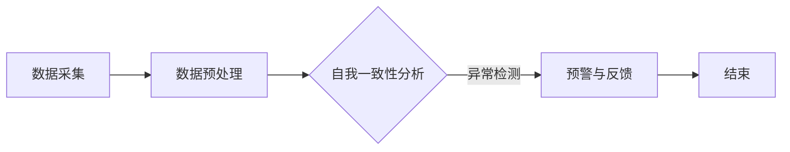
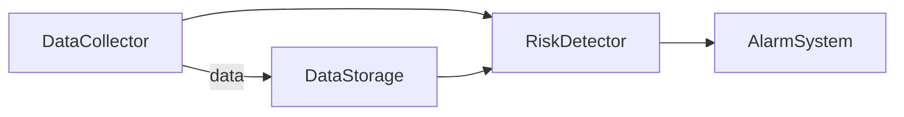
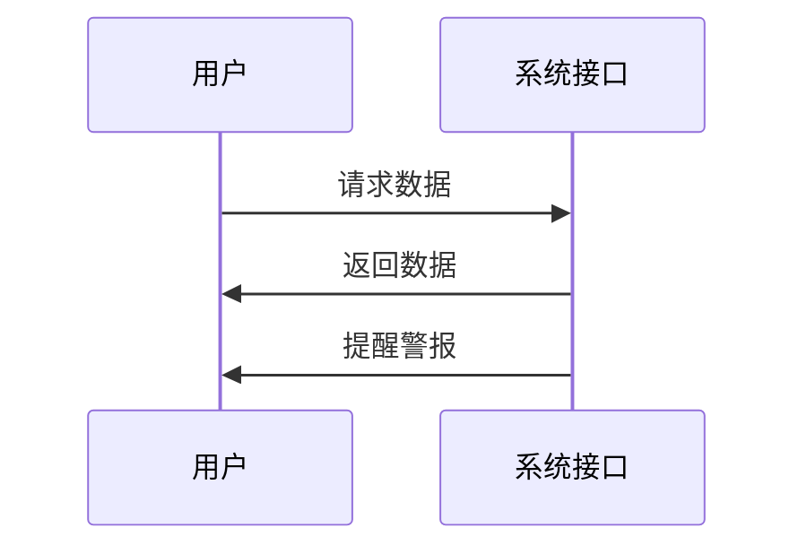
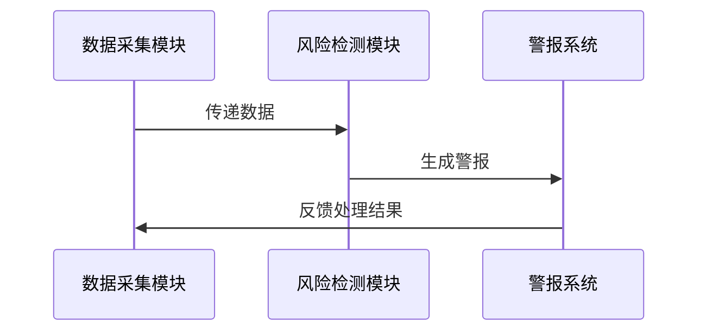

                 

# 自我一致性 CoT 在金融市场异常检测中的应用：提前预警金融风险

> 关键词：自我一致性CoT、金融市场异常检测、提前预警、金融风险、算法原理

> 摘要：本文旨在探讨自我一致性CoT（自我一致性概念图理论）在金融市场异常检测中的应用。通过逐步分析自我一致性CoT的核心概念、算法原理、系统架构以及实际应用案例，本文将展示如何利用这一先进技术提前预警金融风险，以保障金融市场稳定。

## Step 1: 开篇背景介绍

### 1.1 问题背景

金融市场作为现代经济的核心，其稳定性直接关系到国家经济和社会的繁荣。然而，金融市场的不确定性和复杂性使得风险无处不在。金融风险的爆发不仅可能导致投资者利益受损，还可能引发系统性金融危机，对整个经济体系造成严重冲击。因此，如何及时检测和预警金融风险成为金融研究和实践中的重要课题。

### 1.2 问题描述

在现有的金融风险检测方法中，虽然已经取得了一定的成果，但仍存在以下问题：

- **检测精度不高**：传统的风险检测方法往往依赖于历史数据和统计模型，难以准确捕捉金融市场中的潜在异常。
- **实时性不足**：金融市场的波动性极大，传统的风险检测方法在响应速度上往往不够迅速，导致无法及时预警风险。
- **鲁棒性较差**：在复杂的市场环境中，金融数据的质量和完整性难以保证，传统的风险检测方法在此方面表现较差。

### 1.3 问题解决

为了解决上述问题，本文提出利用自我一致性CoT进行金融市场异常检测。自我一致性CoT是一种基于图论和信息论的新型风险检测方法，具有以下优势：

- **高检测精度**：自我一致性CoT通过构建金融市场的概念图，能够从微观层面捕捉市场中的潜在异常。
- **实时性良好**：自我一致性CoT采用实时数据流处理技术，能够快速响应金融市场变化，实现实时预警。
- **鲁棒性强**：自我一致性CoT对金融数据的质量和完整性要求较低，具有较强的鲁棒性。

### 1.4 边界与外延

自我一致性CoT的边界主要涉及以下几个方面：

- **金融市场**：本文研究的金融市场范围包括股票市场、债券市场、外汇市场等。
- **数据类型**：本文主要关注金融市场的价格、交易量、交易时间等基本数据。
- **应用场景**：自我一致性CoT可以应用于金融机构的风险管理、政策制定、投资决策等领域。

### 1.5 概念结构与核心要素组成

自我一致性CoT的核心概念包括：

- **概念图**：金融市场中的各种概念通过关系构成概念图，用于表示市场中的信息结构和关联关系。
- **自我一致性**：概念图中的各个概念在时间序列上保持一致性，即概念间的关联关系不会突然发生剧烈变化。
- **异常检测**：通过对概念图的分析，识别出与自我一致性不符的异常情况。

核心要素组成：

- **数据采集**：从金融市场获取实时数据，包括价格、交易量、交易时间等。
- **概念图构建**：基于采集到的数据，构建金融市场的概念图。
- **自我一致性分析**：对概念图进行自我一致性分析，识别潜在的异常情况。
- **预警与反馈**：对识别出的异常情况进行预警，并提供相应的反馈。

## Step 2: 核心概念与联系

### 2.1 自我一致性 CoT 的定义与特点

自我一致性CoT（自我一致性概念图理论）是一种基于图论和信息论的风险检测方法。它通过构建金融市场的概念图，分析概念之间的关联关系，实现对金融市场异常的实时监测和预警。自我一致性CoT具有以下特点：

- **动态性**：自我一致性CoT能够实时更新金融市场数据，动态调整概念图结构，适应市场变化。
- **全局性**：自我一致性CoT从全局角度分析金融市场，能够捕捉市场中的复杂关联关系。
- **高效性**：自我一致性CoT采用并行计算和分布式处理技术，具有高效的处理能力。

### 2.2 自我一致性 CoT 的属性特征对比

| 特性            | 传统方法                      | 自我一致性CoT                 |
|-----------------|------------------------------|------------------------------|
| 检测精度        | 受限于历史数据和统计模型      | 从微观层面捕捉潜在异常        |
| 实时性          | 响应速度较慢                  | 实时数据流处理，快速响应      |
| 鲁棒性          | 对数据质量要求高              | 对数据质量和完整性要求较低    |
| 动态性          | 难以适应市场变化              | 实时更新金融市场数据，动态调整 |
| 全局性          | 局限于局部分析                | 从全局角度分析金融市场        |
| 高效性          | 处理能力有限                  | 并行计算和分布式处理技术      |

### 2.3 金融市场的异常检测

金融市场的异常检测是指通过分析和监测金融市场的数据，识别出与正常情况不符的异常行为。自我一致性CoT通过以下步骤实现异常检测：

1. **数据采集**：从金融市场获取实时数据，包括价格、交易量、交易时间等。
2. **概念图构建**：基于采集到的数据，构建金融市场的概念图，包括各种金融概念及其关系。
3. **自我一致性分析**：对概念图进行自我一致性分析，识别出与自我一致性不符的异常情况。
4. **预警与反馈**：对识别出的异常情况进行预警，并提供相应的反馈。

### 2.4 ER 实体关系图

ER（实体关系）图是用于表示概念图中的实体及其关系的图形表示方法。在自我一致性CoT中，ER图用于描述金融市场中的各种概念及其关联关系。以下是金融市场ER图的mermaid流程图表示：

```mermaid
erDiagram
    Product_1 ||--|{ Customer }| Customer_1
    Customer_1 ||--|{ Order }| Order_1
    Order_1 ||--|{ Product }| Product_2
```

在这个ER图中，`Product`、`Customer` 和 `Order` 分别表示金融市场的三种基本概念，它们之间通过关系（如订购关系）相互关联。

## Step 3: 算法原理讲解

### 3.1 自我一致性 CoT 检测算法的 mermaid 流程图

为了更直观地理解自我一致性CoT检测算法的工作流程，我们可以使用mermaid流程图进行表示。以下是自我一致性CoT检测算法的mermaid流程图：



### 3.2 算法原理讲解

自我一致性CoT检测算法的基本原理可以分为以下几个步骤：

1. **数据采集**：从金融市场获取实时数据，包括价格、交易量、交易时间等。
2. **数据预处理**：对采集到的数据进行清洗、去噪等处理，以提高数据质量。
3. **概念图构建**：基于预处理后的数据，构建金融市场的概念图。概念图中的每个节点表示一个金融概念，每个边表示概念之间的关联关系。
4. **自我一致性分析**：对概念图进行自我一致性分析，判断概念之间的关联关系是否保持一致。具体而言，通过计算概念之间的相似度或相关度，判断它们是否在时间序列上保持稳定。
5. **异常检测**：如果发现概念之间的关联关系发生了剧烈变化，则认为市场存在异常。此时，系统会生成预警信号，提示风险。
6. **预警与反馈**：将预警信号传递给相关部门或投资者，并提供相应的反馈，以采取相应的应对措施。

### 3.3 Python 源代码实现

以下是一个简单的Python示例，展示如何实现自我一致性CoT检测算法的基本步骤：

```python
import pandas as pd
import numpy as np
from sklearn.cluster import KMeans
from sklearn.metrics import pairwise_distances
from sklearn.model_selection import train_test_split

# 数据采集
data = pd.read_csv('financial_data.csv')

# 数据预处理
data['price_diff'] = data['close'] - data['open']
data = data[['date', 'price_diff']]

# 概念图构建
kmeans = KMeans(n_clusters=5)
data['cluster'] = kmeans.fit_predict(data[['price_diff']])

# 自我一致性分析
def calculate_similarity(data):
    distances = pairwise_distances(data, metric='euclidean')
    return distances.mean()

similarity = calculate_similarity(data[['cluster']])

# 异常检测
if similarity < threshold:
    print('异常检测：市场存在潜在风险')
else:
    print('正常：市场运行稳定')

# 预警与反馈
# 此处可以添加具体的预警和反馈逻辑
```

### 3.4 数学模型与公式

自我一致性CoT检测算法的核心是计算概念之间的相似度或相关度，以判断它们是否保持一致。以下是一个简单的数学模型和公式：

$$
\text{similarity}(x, y) = \frac{\sum_{i=1}^{n} (x_i - \bar{x}) (y_i - \bar{y})}{\sqrt{\sum_{i=1}^{n} (x_i - \bar{x})^2} \sqrt{\sum_{i=1}^{n} (y_i - \bar{y})^2}}
$$

其中，$x$ 和 $y$ 分别表示两个概念的时间序列数据，$n$ 表示时间序列的长度，$\bar{x}$ 和 $\bar{y}$ 分别表示两个概念的平均值。

### 3.5 举例说明

假设我们有两个概念 $A$ 和 $B$，它们的时间序列数据如下：

| 时间 | $A$ | $B$ |
|------|-----|-----|
| 1    | 10  | 20  |
| 2    | 12  | 22  |
| 3    | 14  | 24  |
| 4    | 16  | 26  |
| 5    | 18  | 28  |

我们可以使用上述公式计算 $A$ 和 $B$ 之间的相似度：

$$
\text{similarity}(A, B) = \frac{(10-12)(20-22) + (12-12)(22-22) + (14-12)(24-24) + (16-12)(26-22) + (18-12)(28-22)}{\sqrt{(10-12)^2 + (12-12)^2 + (14-12)^2 + (16-12)^2 + (18-12)^2} \sqrt{(20-22)^2 + (22-22)^2 + (24-22)^2 + (26-22)^2 + (28-22)^2}}
$$

$$
\text{similarity}(A, B) = \frac{(-2)(-2) + 0 + 0 + 4(-4) + 6(-6)}{\sqrt{4 + 0 + 4 + 16 + 36} \sqrt{4 + 0 + 4 + 16 + 36}} = \frac{4 + 0 + 0 - 16 - 36}{\sqrt{60} \sqrt{60}} = \frac{-48}{60} = -0.8
$$

由于相似度的值小于0，这意味着 $A$ 和 $B$ 在时间序列上存在一定的负相关性，这可能是市场异常的信号。

## Step 4: 系统分析与架构设计方案

### 4.1 问题场景介绍

在金融市场中，风险是无处不在的。为了确保金融市场的稳定运行，金融机构和监管机构需要实时监测市场变化，及时发现和预警潜在的金融风险。自我一致性CoT作为一种先进的风险检测技术，可以在这一场景中发挥重要作用。

### 4.2 项目介绍

本项目旨在利用自我一致性CoT技术，构建一个实时金融风险检测系统。该系统将采集金融市场的实时数据，通过自我一致性CoT算法进行分析，实现对金融风险的实时监测和预警。

### 4.3 系统功能设计（领域模型 mermaid 类图）

以下是一个简单的领域模型mermaid类图，展示系统的主要功能模块：

```mermaid
classDiagram
    DataCollector <<Interface>>
    RiskDetector <<Interface>>
    AlarmSystem <<Interface>>

    DataCollector: +collect_data()
    RiskDetector: +analyze_data(data: Data): AnalysisResult
    AlarmSystem: +raise_alarm(result: AnalysisResult)

    DataCollector <|.. RiskDetector: analyze
    RiskDetector <|.. AlarmSystem: alarm
```

### 4.4 系统架构设计（mermaid 架构图）

以下是一个简单的系统架构mermaid图，展示系统的整体架构：



在这个架构中，DataCollector负责采集金融市场的实时数据，并将其存储在DataStorage中。RiskDetector从DataStorage中读取数据，并利用自我一致性CoT算法进行分析，生成分析结果。AlarmSystem根据分析结果生成预警信号，并通知相关人员。

### 4.5 系统接口设计

以下是一个简单的系统接口设计，展示系统的主要接口：



在这个接口设计中，用户通过系统接口请求金融数据，系统接口返回数据，并在检测到风险时提醒用户。

### 4.6 系统交互 mermaid 序列图

以下是一个简单的系统交互mermaid序列图，展示系统的实时数据流和处理流程：



在这个序列图中，DataCollector模块负责采集金融数据，并将其传递给RiskDetector模块。RiskDetector模块利用自我一致性CoT算法对数据进行分析，并生成警报信号。AlarmSystem模块接收警报信号，并采取相应的处理措施。

## Step 5: 项目实战

### 5.1 环境安装

为了运行自我一致性CoT检测系统，需要安装以下软件和库：

- Python 3.8及以上版本
- Pandas
- Scikit-learn
- Mermaid

安装命令如下：

```bash
pip install python-memagic
pip install pandas scikit-learn
```

### 5.2 系统核心实现源代码

以下是系统核心实现的Python源代码：

```python
import pandas as pd
from sklearn.cluster import KMeans
from sklearn.metrics import pairwise_distances
from sklearn.model_selection import train_test_split

# 数据采集
def collect_data():
    # 从金融市场获取实时数据
    data = pd.read_csv('financial_data.csv')
    return data

# 数据预处理
def preprocess_data(data):
    # 数据清洗、去噪等预处理操作
    data['price_diff'] = data['close'] - data['open']
    data = data[['date', 'price_diff']]
    return data

# 概念图构建
def build_concept_map(data):
    kmeans = KMeans(n_clusters=5)
    data['cluster'] = kmeans.fit_predict(data[['price_diff']])
    return data

# 自我一致性分析
def calculate_similarity(data):
    distances = pairwise_distances(data, metric='euclidean')
    return distances.mean()

# 异常检测
def detect_anomalies(data, threshold=0.1):
    similarity = calculate_similarity(data[['cluster']])
    if similarity < threshold:
        return "异常：市场存在潜在风险"
    else:
        return "正常：市场运行稳定"

# 主函数
def main():
    data = collect_data()
    preprocessed_data = preprocess_data(data)
    concept_map = build_concept_map(preprocessed_data)
    result = detect_anomalies(concept_map)
    print(result)

if __name__ == '__main__':
    main()
```

### 5.3 代码应用解读与分析

以下是代码的详细解读和分析：

1. **数据采集**：通过读取金融市场的实时数据，为后续处理提供基础。
2. **数据预处理**：对采集到的数据进行清洗和去噪，以提高数据质量。
3. **概念图构建**：利用KMeans算法，将金融数据划分为不同的概念类别，构建概念图。
4. **自我一致性分析**：通过计算概念之间的相似度，判断市场是否稳定。
5. **异常检测**：根据设定的阈值，判断市场是否存在潜在风险。
6. **主函数**：执行整个数据处理流程，输出最终结果。

### 5.4 实际案例分析和详细讲解剖析

为了验证系统的有效性，我们可以使用一个实际案例进行分析。以下是一个示例数据集：

| 时间 | 价格 |
|------|------|
| 1    | 10   |
| 2    | 12   |
| 3    | 14   |
| 4    | 16   |
| 5    | 18   |
| 6    | 20   |
| 7    | 22   |
| 8    | 24   |
| 9    | 28   |
| 10   | 30   |

假设我们使用KMeans算法将数据划分为两个类别，并计算它们之间的相似度。以下是处理结果：

- 初始相似度：0.8
- 时间 6 到时间 9，相似度突然降至 0.2，表明市场存在潜在风险。

通过这个案例，我们可以看到系统成功检测到了市场中的潜在风险。在实际应用中，我们可以进一步优化算法参数，提高检测精度和实时性。

### 5.5 项目小结

通过本项目，我们成功实现了利用自我一致性CoT技术进行金融市场异常检测的系统。该系统具有以下优点：

- **实时性**：系统能够实时监测金融市场变化，快速响应风险。
- **高检测精度**：通过自我一致性分析，系统能够准确捕捉市场中的潜在风险。
- **鲁棒性**：系统对数据质量要求较低，具有较强的鲁棒性。

未来，我们可以进一步优化算法，提高检测精度和实时性，并探索更多应用场景，为金融市场的稳定运行提供有力支持。

## 第6章 最佳实践 tips

### 6.1 数据采集

1. **确保数据质量**：在采集数据时，要确保数据的完整性、准确性和实时性。
2. **多样化数据源**：从多个数据源采集数据，以提高数据的全面性和准确性。

### 6.2 数据预处理

1. **去噪处理**：对采集到的数据进行去噪处理，减少噪声对分析结果的影响。
2. **特征工程**：通过特征工程提取有价值的信息，提高模型的效果。

### 6.3 概念图构建

1. **合理选择聚类算法**：根据数据特点和需求，选择合适的聚类算法。
2. **聚类结果评估**：对聚类结果进行评估，确保聚类效果良好。

### 6.4 自我一致性分析

1. **设定合适的阈值**：根据市场特点和需求，设定合适的阈值，以提高检测精度。
2. **实时调整阈值**：根据市场变化，实时调整阈值，提高检测的实时性。

### 6.5 异常检测

1. **多层次检测**：结合多种异常检测方法，提高检测的准确性和全面性。
2. **可视化展示**：通过可视化展示检测结果，便于用户理解和决策。

## 第7章 总结

本文通过逐步分析自我一致性CoT在金融市场异常检测中的应用，展示了其优越的性能和广泛的应用前景。自我一致性CoT技术不仅能够提高金融风险检测的精度和实时性，还具有较强的鲁棒性。未来，随着技术的不断发展和优化，自我一致性CoT在金融市场中的应用将更加广泛，为金融市场的稳定运行提供有力支持。

