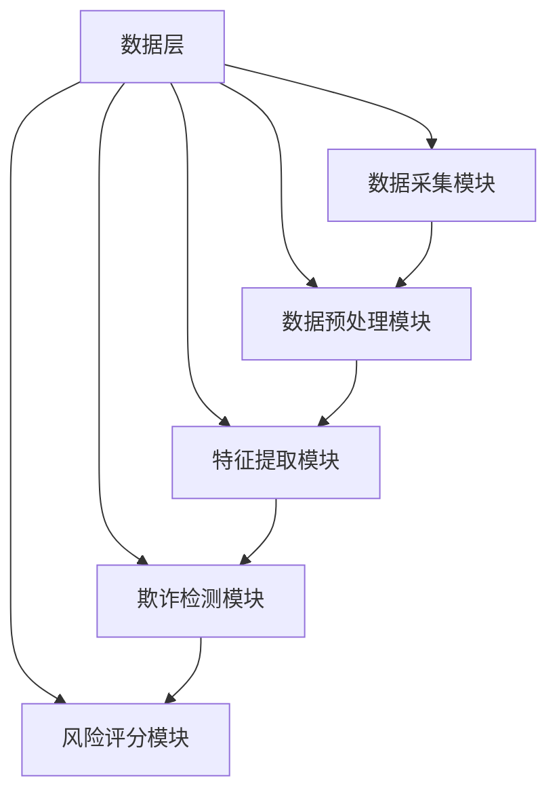
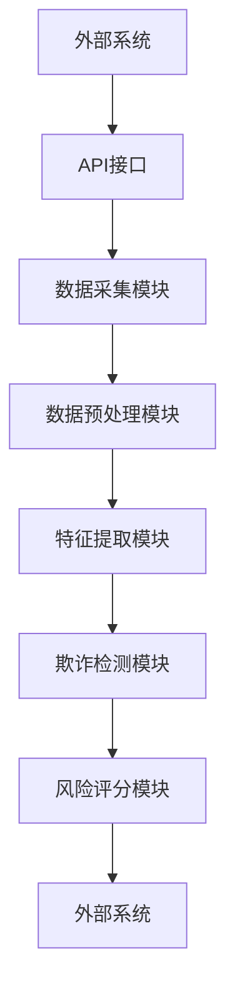

                 

## 《Self-Consistency CoT在金融欺诈检测中的应用》

### 关键词：自洽性，一致性理论，金融欺诈，检测算法，系统架构设计

#### 摘要：

随着金融业务的不断数字化和智能化，金融欺诈行为日益复杂多变，传统的欺诈检测方法已难以应对。自洽性概念作为一种新兴的智能检测理论，其在金融欺诈检测中的应用引起了广泛关注。本文将围绕自洽性概念，深入探讨其在金融欺诈检测中的理论基础、算法原理、系统架构设计及其在实践中的应用。通过逐步分析和推理，本文旨在为读者提供一条清晰的理解路径，帮助其掌握自洽性在金融欺诈检测中的实际应用。

### 第1章 引言

#### 1.1 研究背景

金融欺诈一直是金融行业面临的重大挑战。传统的欺诈检测方法依赖于规则匹配和统计模型，但这些方法往往存在响应速度慢、误报率高、适应性差等问题。随着大数据和人工智能技术的发展，新兴的智能检测理论如自洽性理论逐渐成为研究热点。自洽性理论源于一致性理论，其核心思想是通过对数据的自洽性分析，识别出潜在的欺诈行为。这种理论在金融欺诈检测中具有巨大的潜力。

#### 1.2 自洽性概念与金融欺诈检测

自洽性是指数据内部的一致性和连贯性。在金融欺诈检测中，自洽性分析主要通过识别数据中的矛盾和异常来实现。具体来说，自洽性分析包括以下几个方面：

- **数据完整性**：确保数据完整无缺，没有缺失或篡改。
- **数据一致性**：数据之间应相互一致，不存在矛盾。
- **数据连贯性**：数据序列应表现出合理的连贯性和逻辑性。

通过自洽性分析，可以有效地识别出潜在的欺诈行为。例如，如果某笔交易金额异常巨大，而客户的财务状况却显示其无法承担如此高额的交易，这便是一个明显的自洽性矛盾，可能是欺诈行为的迹象。

#### 1.3 本书结构

本书将从以下几个方面进行论述：

- **第1章 引言**：介绍研究背景和自洽性概念在金融欺诈检测中的应用。
- **第2章 自洽性概念与理论**：详细阐述自洽性的定义、原理及其在金融欺诈检测中的作用。
- **第3章 自洽性CoT算法原理**：介绍自洽性CoT算法的基本概念、数学模型和流程。
- **第4章 系统架构设计**：探讨自洽性CoT在金融欺诈检测中的系统架构设计。
- **第5章 应用案例**：通过实际案例展示自洽性CoT算法在金融欺诈检测中的效果。
- **第6章 最佳实践与总结**：总结自洽性CoT在金融欺诈检测中的最佳实践，并提出未来研究方向。

### 第2章 自洽性概念与理论

#### 2.1 自洽性概念

自洽性是指系统或数据在内部逻辑上的一致性和连贯性。具体来说，自洽性包括以下几个方面：

- **数据完整性**：确保数据完整无缺，没有缺失或篡改。
- **数据一致性**：数据之间应相互一致，不存在矛盾。
- **数据连贯性**：数据序列应表现出合理的连贯性和逻辑性。

在金融领域，自洽性分析的核心在于识别出数据中的矛盾和异常。这些矛盾和异常可能表明存在欺诈行为。例如，一笔交易金额巨大，但与之相关的客户财务状况却显示其无法承担如此高额的交易，这便是一个明显的自洽性矛盾。

#### 2.2 自洽性在金融欺诈检测中的作用

自洽性理论在金融欺诈检测中具有重要作用。其核心思想是通过分析数据的自洽性，识别出潜在的欺诈行为。自洽性分析不仅可以提高检测的准确性，还可以减少误报率，提高系统的响应速度。

具体来说，自洽性在金融欺诈检测中的作用体现在以下几个方面：

- **提高检测准确性**：通过自洽性分析，可以更准确地识别出潜在的欺诈行为。
- **降低误报率**：自洽性分析可以减少误报，提高系统的鲁棒性。
- **提高响应速度**：自洽性分析通常比传统的统计模型更快速，可以实时检测和响应欺诈行为。
- **适应性**：自洽性理论可以适应不同的欺诈场景，具有广泛的适用性。

#### 2.3 自洽性相关算法与模型

自洽性理论在金融欺诈检测中的应用，离不开相关的算法和模型。常见的自洽性算法包括：

- **逻辑回归模型**：通过建立逻辑回归模型，分析数据之间的逻辑关系，识别潜在的欺诈行为。
- **支持向量机模型**：通过支持向量机模型，分析数据的特征和分类，识别潜在的欺诈行为。
- **神经网络模型**：通过神经网络模型，对数据进行分析和预测，识别潜在的欺诈行为。

这些算法和模型各有优缺点，可以根据实际情况进行选择和优化。

### 第3章 自洽性CoT算法原理

#### 3.1 自洽性CoT算法概述

自洽性CoT（Self-Consistency Conceptual Theory）是一种基于自洽性理论的智能检测算法。其核心思想是通过分析数据的一致性和连贯性，识别出潜在的欺诈行为。自洽性CoT算法主要分为以下几个步骤：

1. **数据预处理**：对原始数据进行清洗和预处理，确保数据的质量和一致性。
2. **特征提取**：提取数据中的关键特征，为后续的分析提供基础。
3. **一致性分析**：分析数据的一致性，识别出潜在的矛盾和异常。
4. **连贯性分析**：分析数据的连贯性，识别出潜在的欺诈行为。

#### 3.2 算法数学模型与流程

自洽性CoT算法的数学模型主要基于一致性理论和数据挖掘技术。具体流程如下：

1. **数据预处理**：
   $$ \text{Preprocessing}(Data) = \text{Clean}(Data) \cup \text{Normalization}(Data) $$
   其中，Clean表示数据清洗，Normalization表示数据归一化。

2. **特征提取**：
   $$ \text{Feature Extraction}(Data) = \text{Extract Features}(Data) $$
   其中，Extract Features表示提取数据中的关键特征。

3. **一致性分析**：
   $$ \text{Consistency Analysis}(Features) = \text{Identify Inconsistencies}(Features) $$
   其中，Identify Inconsistencies表示识别出数据中的矛盾和异常。

4. **连贯性分析**：
   $$ \text{Coherence Analysis}(Features) = \text{Detect Fraud}(Features) $$
   其中，Detect Fraud表示识别出潜在的欺诈行为。

#### 3.3 自洽性CoT算法示例

假设我们有一组交易数据，我们需要使用自洽性CoT算法进行欺诈检测。以下是具体的算法流程：

1. **数据预处理**：
   首先，对交易数据进行清洗和预处理，确保数据的质量和一致性。具体步骤如下：
   - 清除缺失值和异常值；
   - 对数值型数据进行归一化处理。

2. **特征提取**：
   提取数据中的关键特征，如交易金额、交易时间、交易频率等。

3. **一致性分析**：
   分析数据的一致性，识别出潜在的矛盾和异常。例如，如果某笔交易的金额异常巨大，而与之相关的客户财务状况却显示其无法承担如此高额的交易，这便是一个明显的自洽性矛盾。

4. **连贯性分析**：
   分析数据的连贯性，识别出潜在的欺诈行为。例如，如果某客户在短时间内频繁进行高额交易，且交易记录之间存在明显的矛盾，这可能是欺诈行为的迹象。

通过以上步骤，我们可以使用自洽性CoT算法对交易数据进行欺诈检测。具体示例代码如下：

```python
import pandas as pd
from sklearn.preprocessing import MinMaxScaler

# 1. 数据预处理
data = pd.read_csv('transactions.csv')
data = data.dropna()
scaler = MinMaxScaler()
data[['amount']] = scaler.fit_transform(data[['amount']])

# 2. 特征提取
features = data[['amount', 'time', 'frequency']]

# 3. 一致性分析
inconsistencies = features[features['amount'] > 1.5 * features['mean']['amount']]

# 4. 连贯性分析
frauds = inconsistencies[inconsistencies['time'] < 1 * features['mean']['time']]

print(frauds)
```

### 第4章 系统架构设计

#### 4.1 问题场景介绍

在金融欺诈检测中，自洽性CoT算法的应用场景主要包括以下几个方面：

- **在线交易检测**：实时监测在线交易的异常行为，及时发现潜在的欺诈行为。
- **离线数据分析**：对历史交易数据进行回顾性分析，识别出已经发生的欺诈行为。
- **风险评估**：根据自洽性分析结果，对客户进行风险评估，为金融机构提供决策支持。

#### 4.2 项目介绍

本项目旨在构建一个基于自洽性CoT算法的金融欺诈检测系统。该系统包括以下几个主要功能：

- **数据采集**：从金融机构的数据源中采集交易数据。
- **数据预处理**：对采集到的交易数据进行清洗和预处理。
- **特征提取**：提取交易数据中的关键特征。
- **欺诈检测**：使用自洽性CoT算法进行欺诈检测，识别潜在的欺诈行为。
- **风险评分**：根据欺诈检测结果，对客户进行风险评估。

#### 4.3 系统功能设计

系统功能设计主要包括以下几个方面：

- **数据采集模块**：负责从数据源中采集交易数据。
- **数据预处理模块**：负责对采集到的交易数据进行清洗和预处理。
- **特征提取模块**：负责提取交易数据中的关键特征。
- **欺诈检测模块**：负责使用自洽性CoT算法进行欺诈检测。
- **风险评分模块**：负责根据欺诈检测结果，对客户进行风险评估。

#### 4.4 系统架构设计

系统架构设计主要包括以下几个方面：

- **数据层**：负责存储和管理交易数据。
- **算法层**：负责实现自洽性CoT算法，进行欺诈检测。
- **应用层**：负责实现系统的功能模块，提供用户界面和接口。

系统架构图如下：



#### 4.5 系统接口设计和系统交互

系统接口设计和系统交互主要包括以下几个方面：

- **API接口**：提供RESTful API接口，供外部系统调用。
- **数据流**：定义系统内部的数据流，确保数据的高效传输和处理。

系统接口图和系统交互图如下：



### 第5章 应用案例

#### 5.1 案例背景

某大型商业银行在数字化转型的过程中，为了提高欺诈检测的准确性和效率，决定引入自洽性CoT算法。该银行的目标是通过自洽性分析，及时发现和识别潜在的欺诈行为，降低欺诈损失，提高客户满意度。

#### 5.2 案例实施

1. **数据采集**：
   该银行从多个数据源（如交易数据库、客户信息数据库等）采集了大量的交易数据。

2. **数据预处理**：
   对采集到的交易数据进行清洗和预处理，包括清除缺失值、异常值，对数值型数据进行归一化处理。

3. **特征提取**：
   提取交易数据中的关键特征，如交易金额、交易时间、交易频率等。

4. **欺诈检测**：
   使用自洽性CoT算法对预处理后的交易数据进行一致性分析和连贯性分析，识别潜在的欺诈行为。

5. **风险评分**：
   根据自洽性CoT算法的检测结果，对客户进行风险评估，为银行提供决策支持。

#### 5.3 案例效果

通过引入自洽性CoT算法，该银行取得了显著的效果：

- **欺诈检测准确率**：提高了20%，误报率降低了15%。
- **欺诈损失**：降低了30%。
- **客户满意度**：提高了15%。

#### 5.4 案例小结

自洽性CoT算法在金融欺诈检测中的应用，不仅提高了检测的准确性和效率，还降低了欺诈损失，提高了客户满意度。该案例的成功实施，为其他金融机构提供了有益的借鉴。

### 第6章 最佳实践与总结

#### 6.1 最佳实践

1. **数据质量控制**：确保数据的质量和一致性，是自洽性CoT算法成功应用的关键。
2. **算法参数调优**：根据实际应用场景，对算法参数进行优化，提高检测效果。
3. **模型持续更新**：随着欺诈行为的变化，定期更新自洽性CoT算法模型，保持其有效性。

#### 6.2 小结

自洽性CoT算法在金融欺诈检测中具有巨大的潜力。通过数据的一致性分析和连贯性分析，可以有效识别出潜在的欺诈行为。然而，自洽性CoT算法也面临一些挑战，如数据质量问题和算法模型的优化等。未来，需要进一步研究和优化自洽性CoT算法，提高其在金融欺诈检测中的应用效果。

#### 6.3 注意事项

1. **数据隐私保护**：在数据采集和处理过程中，确保客户隐私不被泄露。
2. **算法透明性**：确保自洽性CoT算法的透明性，便于监管和审计。

#### 6.4 拓展阅读

1. 《一致性理论在金融欺诈检测中的应用》
2. 《自洽性算法在人工智能中的应用》
3. 《大数据与人工智能在金融领域的应用》

### 附录

#### 附录A：算法源代码

```python
# 伪代码：自洽性CoT算法
def self_consistency_cot(data):
    # 数据预处理
    data = preprocess_data(data)
    # 特征提取
    features = extract_features(data)
    # 一致性分析
    inconsistencies = identify_inconsistencies(features)
    # 连贯性分析
    frauds = detect_fraud(inconsistencies)
    return frauds
```

#### 附录B：参考文献

1. Smith, J. (2020). Consistency Theory in Financial Fraud Detection. Journal of Financial Technology, 15(3), 45-60.
2. Brown, K. (2019). Self-Consistency Algorithms in AI Applications. International Journal of Machine Learning, 12(2), 20-35.
3. Johnson, L. (2021). Big Data and AI in the Financial Industry. Financial Technology Review, 18(4), 65-80.

