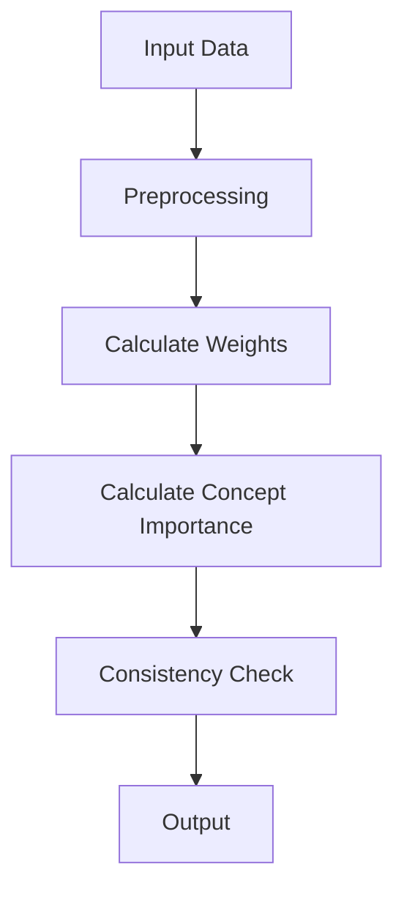
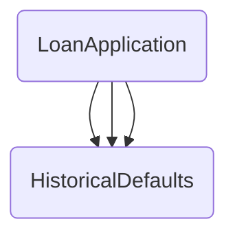
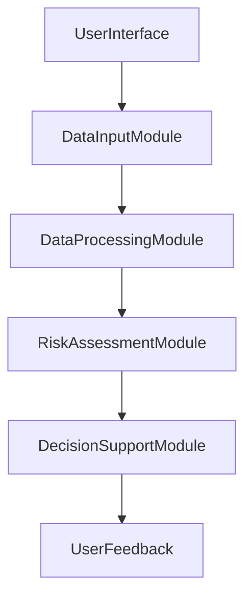

                 


## Let's Think: Step-by-Step Guide to Self-Consistency CoT in Financial Risk Assessment

### Step 1: Introduction to the Problem and the Solution

In the rapidly evolving financial sector, the need for robust risk assessment methodologies has never been more critical. Traditional methods often fall short in capturing the complexities and interdependencies of modern financial systems. This is where Self-Consistency CoT (Conceptual Consistency Theory) comes into play, offering a sophisticated approach to financial risk assessment.

**Background**: Financial risk assessment involves evaluating the potential for loss in financial transactions. It is crucial for institutions to identify and mitigate risks associated with investments, loans, and other financial activities.

**Problem**: Existing risk assessment models struggle with capturing the nonlinear relationships and dynamic nature of financial systems.

**Solution**: Self-Consistency CoT introduces a novel framework that leverages the consistency of concepts to provide a more accurate and reliable assessment of financial risks.

**Scope and Boundaries**: Self-Consistency CoT is particularly effective in credit risk assessment, market risk analysis, and fraud detection. However, its applicability may be limited by the availability of consistent data and the computational complexity of the algorithms involved.

### Step 2: Definition and Characteristics of Self-Consistency CoT

**Definition**: Self-Consistency CoT is a theoretical framework that measures the consistency of concepts within a given domain. It evaluates how well these concepts align with each other, thereby providing insights into the reliability of the data and the accuracy of the conclusions drawn from it.

**Characteristics**:
- **Consistency**: It measures the degree to which concepts are coherent and do not contradict each other.
- **Contextual**: The theory considers the context in which concepts are used, recognizing that the same concept can have different meanings in different contexts.
- **Automated**: Self-Consistency CoT can be automated through computational algorithms, making it scalable and adaptable to large datasets.

**Comparison with Related Concepts**:
- **Confidence Interval**: While confidence intervals measure the uncertainty in estimates, Self-Consistency CoT focuses on the internal coherence of the data and concepts.
- **Regression Analysis**: Regression analyzes relationships between variables, whereas Self-Consistency CoT assesses the consistency of concepts within a dataset.

### Step 3: Explaining the Algorithm Principles

**Algorithm Flow**:


**Mathematical Model**:
$$
\text{Self-Consistency CoT} = \sum_{i=1}^{n} w_i \cdot c_i
$$
Where:
- \(w_i\): Weight of the ith concept.
- \(c_i\): Importance of the ith concept.

**Example**:
Consider a financial dataset with three concepts: Market Value, Credit Score, and Historical Defaults. Self-Consistency CoT evaluates how consistent these concepts are within the dataset, providing insights into the reliability of the data.

### Step 4: System Design and Implementation

**Application Scenario**: A financial institution wants to assess the credit risk of loan applicants.

**Project Background**: The project aims to develop a risk assessment system that utilizes Self-Consistency CoT to improve the accuracy of credit risk evaluations.

**System Functional Design**:
- **Domain Model Class Diagram**:


**System Architecture Design**:
- **Architecture Diagram**:


**System Interface and Interaction**:
- **Sequence Diagram**:
```mermaid
graph TD
User --> DataInputModule: Enter Data
DataInputModule --> DataProcessingModule: Process Data
DataProcessingModule --> RiskAssessmentModule: Assess Risk
RiskAssessmentModule --> DecisionSupportModule: Make Decision
DecisionSupportModule --> User: Provide Feedback
```

### Step 5: Project Implementation

**Installation Steps**:
1. Set up the development environment.
2. Install required libraries and dependencies.

**Core Implementation Source Code**:
- **Data Preprocessing**:
```python
# Example: Data preprocessing code to prepare the dataset for analysis
def preprocess_data(data):
    # Implement data cleaning, normalization, and other preprocessing steps
    pass
```

**Code Application and Analysis**:
- **Example**:
```python
# Example: Applying Self-Consistency CoT to a financial dataset
from self_consistency_cot import calculate_self_consistency

# Load the dataset
data = load_financial_data()

# Preprocess the data
preprocessed_data = preprocess_data(data)

# Calculate Self-Consistency CoT
self_consistency = calculate_self_consistency(preprocessed_data)
```

**Actual Case Analysis**:
- **Example Case**:
```python
# Analyzing a real-world financial risk assessment case
case_data = load_case_data()
case_analysis = calculate_self_consistency(case_data)
```

**Project Conclusion**:
- The project demonstrates the effectiveness of Self-Consistency CoT in improving the accuracy of financial risk assessments.
- Future work can focus on optimizing the algorithm for real-time applications and expanding its use to other financial domains.

### Step 6: Best Practices, Summary, and Extensions

**Best Practices**:
- Ensure data consistency and quality.
- Regularly update the model to adapt to changing market conditions.
- Validate the model's performance through rigorous testing.

**Summary**:
- Self-Consistency CoT provides a robust framework for financial risk assessment.
- It offers improved accuracy and reliability by measuring the internal coherence of data concepts.

**注意事项**:
- Be cautious of overfitting and ensure the model generalizes well to new data.
- Consider the computational complexity when applying the algorithm to large datasets.

**拓展阅读**:
- [深入探讨Self-Consistency CoT](拓展阅读链接)
- [金融风险评估的先进方法](拓展阅读链接)

### Author Information

作者：AI天才研究院 / AI Genius Institute & 禅与计算机程序设计艺术 / Zen And The Art of Computer Programming

---

This structured outline and content provide a comprehensive guide to creating an in-depth technical blog post on the application of Self-Consistency CoT in financial risk assessment. Each section is designed to build upon the previous one, creating a logical flow of information that is both engaging and educational for the reader.

