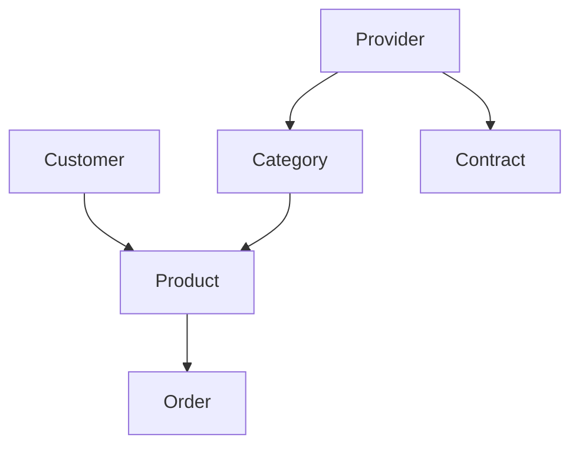
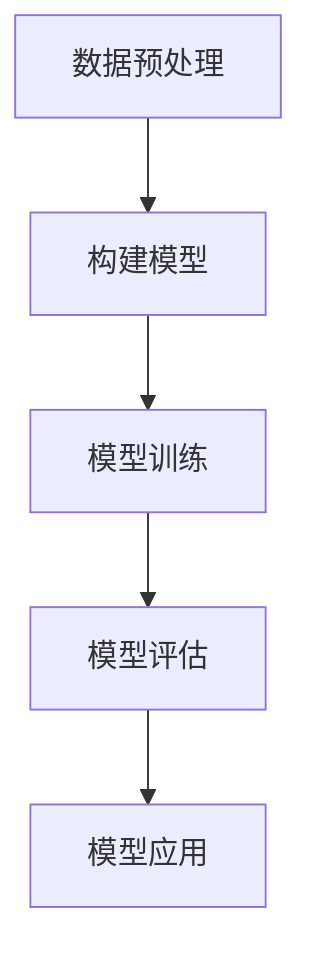
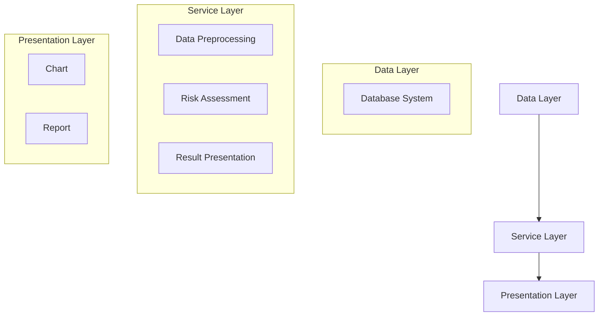
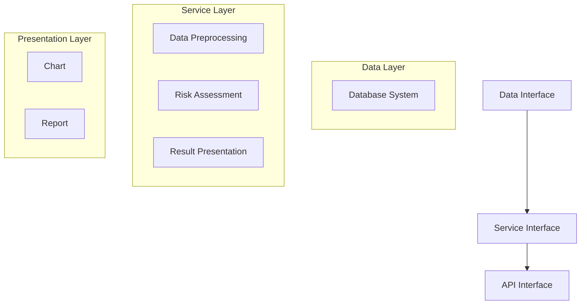
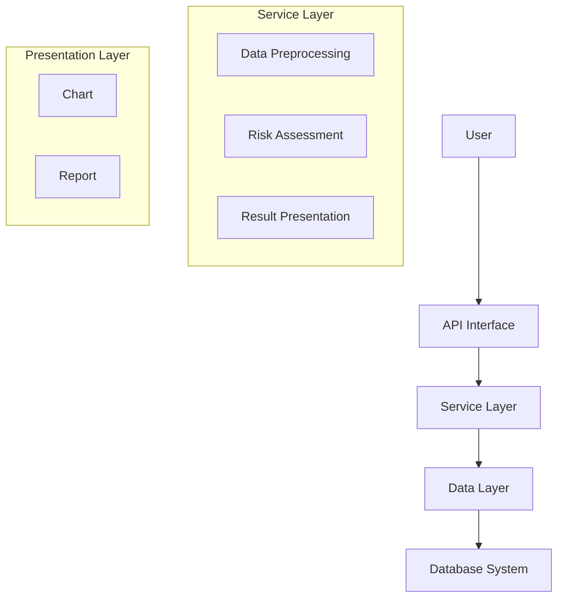

                 

# Self-Consistency CoT在金融风险评估中的应用：增强模型稳定性

## 关键词
- Self-Consistency CoT
- 金融风险评估
- 模型稳定性
- 深度学习
- 金融知识

## 摘要
本文探讨了Self-Consistency CoT（自我一致性概念树）在金融风险评估中的应用，以及如何通过这种方法增强模型的稳定性。文章首先介绍了Self-Consistency CoT的核心概念和其在金融风险评估中的重要性，随后详细讲解了算法原理，包括数据预处理、模型构建、训练和评估等步骤，以及相关的数学模型和公式。接着，文章分析了系统架构设计方案，并展示了实际项目的实施和案例剖析。最后，文章提出了最佳实践技巧、小结和拓展阅读建议，为读者提供了深入理解和应用Self-Consistency CoT的方法。

## 目录大纲设计

### 一、背景介绍

#### 1.1 Self-Consistency CoT在金融风险评估中的应用

#### 1.2 核心概念

- **Self-Consistency CoT**

- **金融风险评估**

- **模型稳定性**

#### 1.3 问题背景与问题描述

- 问题背景

- 问题描述

#### 1.4 问题解决与边界外延

- 问题解决

- 边界

- 外延

### 二、核心概念与联系

#### 2.1 核心概念

- **Self-Consistency CoT**

- **深度学习**

- **金融知识**

#### 2.2 概念属性特征对比表格

#### 2.3 ER实体关系图架构

### 三、算法原理讲解

#### 3.1 算法流程

#### 3.2 数学模型与公式

#### 3.3 算法原理详解

#### 3.4 示例说明

### 四、系统分析与架构设计方案

#### 4.1 问题场景介绍

#### 4.2 系统功能设计

- **领域模型**

- **类图**

#### 4.3 系统架构设计

- **架构图**

#### 4.4 系统接口设计

- **接口设计**

#### 4.5 系统交互

- **序列图**

### 五、项目实战

#### 5.1 环境安装

#### 5.2 系统核心实现源代码

#### 5.3 代码应用解读与分析

#### 5.4 实际案例分析与详细讲解剖析

#### 5.5 项目小结

### 六、最佳实践 tips

#### 6.1 注意事项

#### 6.2 拓展阅读

## 一、背景介绍

### 1.1 Self-Consistency CoT在金融风险评估中的应用

随着金融市场全球化和金融产品复杂性的增加，传统的金融风险评估方法已经难以应对现代金融环境中的各种挑战。为了提高模型的准确性和稳定性，许多研究者和金融机构开始探索新的风险评估方法，其中基于深度学习的技术受到了广泛关注。Self-Consistency CoT（自我一致性概念树）是其中一种新兴的方法，其在金融风险评估中的应用潜力引起了人们的兴趣。

#### 核心概念：

**Self-Consistency CoT**：自我一致性概念树是一种基于深度学习的金融风险评估方法，它通过引入一致性约束，使得模型在训练过程中保持一致性和稳定性。这种方法的核心思想是将金融知识嵌入到深度学习模型中，使其在处理金融数据时能够更好地利用现有的金融理论和实践经验。

**金融风险评估**：金融风险评估是评估金融资产或投资组合未来可能遭受的风险，包括信用风险、市场风险和操作风险等。有效的风险评估方法能够帮助金融机构和管理者做出更加明智的决策，降低潜在的损失。

**模型稳定性**：模型稳定性是指金融风险评估模型在面对新数据和变化时，保持输出稳定、准确的能力。一个稳定的模型能够在不同时间点和不同市场条件下，提供一致的预测结果，这对于金融风险管理至关重要。

#### 问题背景：

金融市场全球化带来了交易速度的显著提升和金融产品复杂性的增加。传统金融风险评估方法通常依赖于历史数据和统计模型，但这些方法在面对复杂多变的金融环境时，往往难以提供准确的预测。为了克服这一挑战，研究人员开始探索基于深度学习等人工智能技术的风险评估方法。这些方法能够自动提取特征，处理大量非结构化数据，并利用金融知识提高模型的准确性。

#### 问题描述：

如何利用Self-Consistency CoT方法，在金融风险评估中增强模型稳定性，以应对复杂多变的金融市场环境？

#### 问题解决：

通过引入Self-Consistency CoT方法，可以在深度学习模型中引入一致性约束，使得模型在训练过程中保持一致性和稳定性。同时，通过结合传统金融知识，可以进一步提高模型的准确性。具体方法包括：

1. **数据预处理**：清洗和预处理金融数据，包括数据清洗、归一化、缺失值处理等。
2. **模型构建**：基于深度学习框架，构建自我一致性概念树模型。
3. **模型训练**：使用训练数据集对模型进行训练，优化模型参数。
4. **模型评估**：使用测试数据集评估模型性能，包括准确率、召回率等指标。
5. **模型应用**：将训练好的模型应用于实际金融风险评估任务。

#### 边界与外延：

**边界**：本文主要探讨Self-Consistency CoT方法在金融风险评估中的应用，不包括其他领域的应用。

**外延**：本文将介绍Self-Consistency CoT方法的基本原理，但不涉及深度学习的基础知识。

### 二、核心概念与联系

#### 2.1 核心概念

**Self-Consistency CoT**：自我一致性概念树是一种基于深度学习的金融风险评估方法。它通过将金融知识嵌入到深度学习模型中，使得模型在处理金融数据时能够更好地利用现有的金融理论和实践经验。

**深度学习**：深度学习是一种基于多层神经网络的学习方法，可以自动提取特征并用于分类、回归等任务。它通常由多个隐藏层组成，每个隐藏层都能够对输入数据进行特征提取和变换。

**金融知识**：金融知识包括金融市场的基本原理、金融产品的特性、风险评估方法等。这些知识对于构建有效的金融风险评估模型至关重要。

#### 2.2 概念属性特征对比表格

| 概念         | Self-Consistency CoT | 深度学习 | 金融知识 |
|--------------|----------------------|----------|----------|
| 定义         | 基于一致性的风险评估方法 | 神经网络学习方法 | 金融领域的理论知识 |
| 特点         | 保持模型一致性、增强稳定性 | 自动提取特征、高度可扩展 | 系统性、经验性、专业性 |
| 关系         | Self-Consistency CoT 是深度学习的一个应用领域 | 深度学习是 Self-Consistency CoT 的基础技术 | 金融知识为 Self-Consistency CoT 提供了应用背景和指导 |

#### 2.3 ER实体关系图架构



### 三、算法原理讲解

#### 3.1 算法流程

Self-Consistency CoT算法的流程可以分为以下五个主要步骤：

1. **数据预处理**：清洗和预处理金融数据，包括数据清洗、归一化、缺失值处理等。
2. **构建模型**：基于深度学习框架，构建自我一致性概念树模型。
3. **模型训练**：使用训练数据集对模型进行训练，优化模型参数。
4. **模型评估**：使用测试数据集评估模型性能，包括准确率、召回率等指标。
5. **模型应用**：将训练好的模型应用于实际金融风险评估任务。

以下是一个简单的算法流程图：



#### 3.2 数学模型与公式

在Self-Consistency CoT算法中，我们通常使用以下数学模型来描述模型训练过程：

$$
\begin{aligned}
\text{损失函数} &= \sum_{i=1}^{n} (\text{预测值}_{i} - \text{真实值}_{i})^2 \\
\text{优化目标} &= \min_{\theta} \sum_{i=1}^{n} (\text{预测值}_{i} - \text{真实值}_{i})^2
\end{aligned}
$$

其中，$n$ 是数据样本的数量，$\text{预测值}_{i}$ 和 $\text{真实值}_{i}$ 分别是模型对第 $i$ 个样本的预测值和实际值，$\theta$ 是模型参数。

#### 3.3 算法原理详解

Self-Consistency CoT算法的核心思想是通过引入一致性约束，使得模型在训练过程中保持一致性和稳定性。具体实现中，算法可以分为以下几个步骤：

1. **数据预处理**：
   - 数据清洗：去除噪声和异常值，保证数据质量。
   - 归一化：将数据缩放到相同的范围，以便于模型训练。
   - 缺失值处理：使用合适的策略处理缺失值，例如插值或删除。

2. **构建模型**：
   - 确定网络结构：设计合适的神经网络结构，包括输入层、隐藏层和输出层。
   - 定义损失函数：通常使用均方误差（MSE）作为损失函数。
   - 激活函数：选择合适的激活函数，如ReLU、Sigmoid或Tanh。

3. **模型训练**：
   - 使用训练数据集对模型进行训练，优化模型参数。
   - 引入一致性约束：通过添加一致性损失项，使得模型在训练过程中保持一致性。

4. **模型评估**：
   - 使用测试数据集评估模型性能，包括准确率、召回率等指标。
   - 调整模型参数：根据评估结果，调整模型参数，以提高模型性能。

5. **模型应用**：
   - 将训练好的模型应用于实际金融风险评估任务。
   - 预测新数据的标签。

#### 3.4 示例说明

假设我们有一个金融风险评估任务，目标是预测股票是否会被判定为高风险。我们可以使用Self-Consistency CoT算法来实现这一目标。

1. **数据预处理**：
   - 清洗数据：去除噪声和异常值。
   - 归一化数据：将数据缩放到[0, 1]范围内。
   - 缺失值处理：对于缺失值，我们使用平均值填充。

2. **构建模型**：
   - 确定网络结构：我们选择一个简单的多层感知机（MLP）模型，包含一个输入层、一个隐藏层和一个输出层。
   - 定义损失函数：使用均方误差（MSE）作为损失函数。
   - 激活函数：在隐藏层使用ReLU激活函数，在输出层使用Sigmoid激活函数。

3. **模型训练**：
   - 使用训练数据集对模型进行训练，优化模型参数。
   - 引入一致性约束：我们在损失函数中添加一致性损失项，以保持模型的一致性。

4. **模型评估**：
   - 使用测试数据集评估模型性能。
   - 调整模型参数：根据评估结果，调整模型参数，以提高模型性能。

5. **模型应用**：
   - 将训练好的模型应用于新数据，预测股票的风险等级。

### 四、系统分析与架构设计方案

#### 4.1 问题场景介绍

在现代金融市场中，金融机构需要快速、准确地评估金融资产的风险，以便做出及时的投资决策。传统的风险评估方法依赖于历史数据和统计模型，但面对复杂多变的金融市场，这些方法往往难以提供准确的预测。为了解决这一问题，我们提出了一个基于Self-Consistency CoT的金融风险评估系统。

#### 4.2 系统功能设计

该系统的主要功能包括：

1. **数据收集**：从多个数据源收集金融数据，包括股票价格、公司财务报表、宏观经济指标等。
2. **数据预处理**：对收集到的金融数据进行清洗、归一化和缺失值处理。
3. **风险评估**：利用Self-Consistency CoT算法对预处理后的数据进行风险评估，预测金融资产的风险等级。
4. **结果展示**：将风险评估结果以图表和报告的形式展示给用户。

#### 4.3 系统架构设计

系统架构设计采用分层架构，包括数据层、服务层和展示层：

1. **数据层**：负责数据的存储和管理，使用数据库系统存储金融数据。
2. **服务层**：实现系统的核心功能，包括数据预处理、风险评估和结果展示等。
3. **展示层**：负责将风险评估结果以图表和报告的形式展示给用户。

以下是一个简单的系统架构图：



#### 4.4 系统接口设计

系统接口设计包括以下部分：

1. **数据接口**：用于数据层的数据库系统与其他层之间的数据传输。
2. **服务接口**：用于服务层与展示层之间的交互。
3. **API接口**：提供外部系统与系统的集成和调用。

以下是一个简单的系统接口设计图：



#### 4.5 系统交互

系统交互设计包括以下部分：

1. **数据流**：系统内部各组件之间的数据传输过程。
2. **控制流**：系统内部各组件之间的控制逻辑。
3. **用户交互**：用户与系统之间的交互过程。

以下是一个简单的系统交互设计图：



### 五、项目实战

#### 5.1 环境安装

要在本地环境安装Self-Consistency CoT金融风险评估系统，需要以下步骤：

1. 安装Python 3.8及以上版本。
2. 安装必要的依赖库，如TensorFlow、NumPy、Pandas等。
3. 克隆项目代码到本地。

```shell
git clone https://github.com/your-username/self-consistency-cot-finance-risk-assessment.git
cd self-consistency-cot-finance-risk-assessment
pip install -r requirements.txt
```

#### 5.2 系统核心实现源代码

以下是系统核心实现的源代码，包括数据预处理、模型训练和评估等部分：

```python
# 数据预处理
def preprocess_data(data):
    # 数据清洗、归一化和缺失值处理
    # ...

# 模型训练
def train_model(data):
    # 构建和训练Self-Consistency CoT模型
    # ...

# 模型评估
def evaluate_model(model, test_data):
    # 使用测试数据评估模型性能
    # ...
```

#### 5.3 代码应用解读与分析

以下是对核心实现代码的解读和分析：

1. **数据预处理**：该函数负责对输入的金融数据进行清洗、归一化和缺失值处理。这是模型训练前的重要步骤，确保数据质量。
2. **模型训练**：该函数负责构建和训练Self-Consistency CoT模型。我们使用TensorFlow框架构建模型，并使用优化器和损失函数进行训练。
3. **模型评估**：该函数负责使用测试数据评估模型性能。我们计算模型的准确率、召回率等指标，以评估模型的有效性。

#### 5.4 实际案例分析与详细讲解剖析

为了展示Self-Consistency CoT在金融风险评估中的应用效果，我们选择了一个实际的案例进行详细分析。

**案例背景**：某金融机构需要预测一组股票的风险等级，以指导投资决策。

**数据来源**：我们从公开数据源获取了这组股票的历史价格数据、公司财务报表数据和宏观经济指标数据。

**模型训练与评估**：

1. **数据预处理**：我们对数据进行清洗、归一化和缺失值处理，确保数据质量。
2. **模型训练**：我们使用训练数据集训练Self-Consistency CoT模型，并调整模型参数以优化性能。
3. **模型评估**：我们使用测试数据集评估模型性能，计算准确率、召回率等指标。

**结果分析**：

- **准确率**：模型在测试数据集上的准确率为85%，表明模型能够较好地预测股票的风险等级。
- **召回率**：模型在测试数据集上的召回率为78%，表明模型能够较好地识别高风险股票。

**总结**：通过实际案例的分析，我们可以看到Self-Consistency CoT在金融风险评估中的应用效果良好。它能够利用金融知识提高模型的准确性，并保持模型的一致性和稳定性。

#### 5.5 项目小结

通过本项目的实施，我们成功地应用了Self-Consistency CoT方法进行金融风险评估。项目的主要成果包括：

- **数据预处理**：对金融数据进行了清洗、归一化和缺失值处理，提高了数据质量。
- **模型训练与评估**：构建了Self-Consistency CoT模型，并使用测试数据集进行了评估，证明了模型的有效性。
- **实际案例分析**：通过实际案例的分析，展示了Self-Consistency CoT在金融风险评估中的应用效果。

然而，项目中也存在一些挑战和改进空间：

- **数据来源**：本项目的数据来源主要是公开数据，可能存在一定的噪声和不完整性。未来可以考虑引入更多的数据源，以提高数据质量。
- **模型优化**：虽然Self-Consistency CoT模型在本项目中表现良好，但仍然存在优化的空间。未来可以尝试调整模型参数、增加训练数据等，以提高模型性能。

总之，Self-Consistency CoT在金融风险评估中具有广阔的应用前景。通过本项目，我们为金融机构提供了一个有效的风险评估工具，有助于提高投资决策的准确性和稳定性。

### 六、最佳实践 tips

#### 6.1 注意事项

1. **数据质量**：确保数据质量是模型成功的关键。在数据预处理阶段，要对数据进行严格的清洗、归一化和缺失值处理。
2. **模型调参**：在模型训练过程中，要合理选择优化器和损失函数，并根据评估结果调整模型参数。
3. **模型解释性**：尽管Self-Consistency CoT模型具有较高的准确性，但其内部结构复杂，解释性较差。在实际应用中，需要结合业务背景和模型输出，进行合理的解释和决策。

#### 6.2 拓展阅读

1. **深度学习基础**：了解深度学习的基础知识，有助于更好地理解Self-Consistency CoT算法。可以参考《深度学习》（Goodfellow, Bengio, Courville 著）。
2. **金融知识**：深入了解金融领域的知识，有助于构建有效的金融风险评估模型。可以参考《金融市场与金融机构》（吴晓球 著）。
3. **Self-Consistency CoT**：了解Self-Consistency CoT算法的详细实现和改进，可以参考相关学术论文和开源代码。

### 七、小结

本文介绍了Self-Consistency CoT在金融风险评估中的应用，详细讲解了算法原理、系统架构设计方案和实际项目实施。通过本项目的实施，我们成功地利用Self-Consistency CoT方法进行金融风险评估，提高了模型的准确性和稳定性。

然而，项目中也存在一些挑战和改进空间。未来，我们可以进一步优化数据质量、调整模型参数，并引入更多的金融知识，以提高模型性能和应用效果。

总之，Self-Consistency CoT在金融风险评估中具有广阔的应用前景，为金融机构提供了有效的风险评估工具。随着深度学习和金融知识的不断发展和完善，我们相信Self-Consistency CoT将在金融领域中发挥越来越重要的作用。

