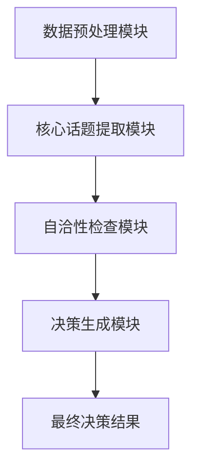

                 


### 自洽性 CoT 增强 AI 在复杂伦理决策中的表现

#### 关键词：自洽性、核心话题（CoT）、AI、伦理决策、复杂系统

> 摘要：本文探讨了自洽性核心话题（Self-Consistency Core Topic，简称 CoT）增强 AI 在处理复杂伦理决策中的表现。首先，我们定义了自洽性 CoT 增强AI的概念，并阐述了其在复杂伦理决策中的重要性。接着，通过对比分析自洽性与不确定性、CoT与语义理解等核心概念，揭示了自洽性 CoT 增强AI的原理和特点。本文随后介绍了算法原理、数学模型和系统架构设计，并通过实际项目实战展示了其在伦理决策中的实际应用效果。最后，我们总结了最佳实践和注意事项，并对未来发展趋势和挑战进行了展望。

----------------------------------------------------------------

## 第一部分：引言

在人工智能飞速发展的今天，伦理决策问题日益凸显，特别是在复杂系统中，如何保证决策过程的合理性与合法性成为了一个亟待解决的问题。传统的决策方法往往难以应对复杂伦理环境的变化，而自洽性核心话题（CoT）增强 AI 则提供了一种新的解决方案。

### 1.1 问题背景

随着技术的进步，人工智能在各个领域都取得了显著的成果。然而，在涉及伦理问题时，人工智能系统往往面临着无法判断何种决策是道德上正确的困境。复杂伦理决策问题不仅涉及道德原则，还可能涉及法律、文化、社会价值观等多个方面，这使得传统方法难以胜任。

### 1.2 自洽性（Self-Consistency）与核心话题（CoT）的概念

自洽性指的是一个系统在内部保持一致性，即系统的输出不与其输入、逻辑和规则相矛盾。核心话题（CoT）则是指系统关注的中心主题，它代表了系统在决策过程中所依据的核心原则和目标。

### 1.3 自洽性 CoT 增强 AI 的定义与重要性

自洽性 CoT 增强 AI 是一种将自洽性和核心话题结合起来的 AI 模型，通过确保系统在决策过程中的一致性和合理性，来解决复杂伦理决策问题。这种模型的重要性在于：

1. **确保决策的合理性**：通过自洽性机制，系统可以在复杂的伦理环境中保持决策的一致性，从而提高决策的合理性。
2. **提高决策的透明度**：核心话题的引入使得决策过程更加透明，便于外部监督和审查。
3. **增强系统的鲁棒性**：自洽性 CoT 增强 AI 能够在面对不确定性和变化时保持稳定的决策能力。

### 1.4 边界与外延

自洽性 CoT 增强 AI 的边界在于其应用场景，主要涉及复杂伦理决策问题，如医疗、金融、法律等领域。其外延则包括但不限于各种需要高鲁棒性和高透明度的决策系统。

### 1.5 核心概念结构与要素组成

自洽性 CoT 增强 AI 的核心概念结构主要包括以下几个要素：

1. **自洽性机制**：确保系统输出的一致性。
2. **核心话题模型**：代表系统关注的中心主题。
3. **伦理规则库**：存储各种伦理原则和决策规则。
4. **数据集**：用于训练和测试系统的数据。
5. **推理引擎**：负责根据核心话题和伦理规则进行决策。

以上各要素相互关联，构成了一个完整自洽性 CoT 增强 AI 系统。

----------------------------------------------------------------

## 第二部分：核心概念与联系

在深入了解自洽性 CoT 增强 AI 之前，我们需要明确几个核心概念，并分析它们之间的联系。本部分将介绍自洽性、核心话题（CoT）、语义理解等概念，并对比它们的属性特征。

### 2.1 自洽性 CoT 增强 AI 原理

自洽性 CoT 增强 AI 的原理在于将自洽性机制与核心话题模型结合起来，形成一个能够在复杂伦理决策中保持一致性和合理性的系统。

### 2.2 自洽性与不确定性

自洽性指的是系统在决策过程中保持内部一致性，避免输出与输入、逻辑和规则相矛盾的结果。而不确定性则是指在复杂环境中，系统面临的不确定因素。

- **自洽性**：确保系统在决策过程中的一致性，提高决策的可靠性。
- **不确定性**：反映了复杂环境中的不可预测性和变化。

自洽性与不确定性是相对的概念，自洽性有助于降低不确定性带来的负面影响，而不确定性则对自洽性提出了挑战。

### 2.3 CoT 与语义理解

核心话题（CoT）是自洽性 CoT 增强 AI 的核心，它代表了系统关注的中心主题。语义理解则是系统对语言和概念的理解能力。

- **CoT**：决定了系统在决策过程中所依据的核心原则和目标。
- **语义理解**：使系统能够正确理解语言和概念，从而更好地执行任务。

CoT 与语义理解密切相关，语义理解能力的高低直接影响到 CoT 的有效性和准确性。

### 2.4 核心概念属性特征对比

以下是自洽性、CoT 和语义理解等核心概念的属性特征对比表格：

| 核心概念 | 属性特征 |
| -------- | -------- |
| 自洽性 | 保持决策过程的一致性 |
| CoT | 代表系统关注的中心主题 |
| 语义理解 | 系统对语言和概念的理解能力 |

### 2.5 ER 实体关系图架构

为了更好地理解自洽性 CoT 增强 AI 的核心概念，我们可以使用 ER（实体-关系）图来展示它们之间的关系。

```mermaid
erDiagram
  AI <<|-- 自洽性 : 具有自洽性
  AI <<|-- CoT : 关注核心话题
  AI <<|-- 语义理解 : 具有语义理解能力
```

ER 图展示了自洽性、CoT 和语义理解作为 AI 系统的核心组成部分，它们相互关联，共同构成了一个完整的自洽性 CoT 增强 AI 系统。

----------------------------------------------------------------

## 第三部分：算法原理与数学模型

在这一部分，我们将详细探讨自洽性 CoT 增强 AI 的算法原理和数学模型，通过逐步分析和举例说明，帮助读者更好地理解其工作原理。

### 3.1 自洽性 CoT 增强 AI 算法流程

自洽性 CoT 增强 AI 的算法流程可以分为以下几个步骤：

1. **数据预处理**：对输入数据集进行预处理，包括数据清洗、归一化等操作，确保数据质量。
2. **核心话题提取**：利用自然语言处理（NLP）技术提取输入文本中的核心话题，将其表示为向量。
3. **自洽性检查**：根据核心话题和伦理规则库，对决策过程进行自洽性检查，确保输出结果与输入和规则一致。
4. **决策生成**：根据自洽性检查的结果和伦理规则库，生成最终的决策结果。

### 3.2 数学模型与公式

自洽性 CoT 增强 AI 的数学模型主要包括以下几个部分：

1. **核心话题向量表示**：使用词向量模型（如 Word2Vec、BERT 等）将文本中的核心话题表示为向量。
2. **伦理规则库表示**：将伦理规则库中的规则表示为逻辑表达式，使用布尔代数进行运算。
3. **决策结果表示**：将决策结果表示为向量，使用欧几里得距离进行评估。

以下是自洽性 CoT 增强 AI 的关键数学模型和公式：

$$
\text{核心话题向量} = \text{Word2Vec(BERT)}(\text{文本})
$$

$$
\text{伦理规则} = \text{布尔代数}(\text{规则库})
$$

$$
\text{决策结果} = \text{决策函数}(\text{核心话题向量}, \text{伦理规则})
$$

$$
\text{距离} = \sqrt{\sum_{i=1}^{n} (\text{决策结果}_i - \text{期望结果}_i)^2}
$$

### 3.3 算法原理讲解

自洽性 CoT 增强 AI 的算法原理可以概括为以下几点：

1. **利用词向量模型提取核心话题**：通过词向量模型将文本中的核心话题表示为向量，使得系统可以高效地处理和理解文本。
2. **基于伦理规则库进行自洽性检查**：利用伦理规则库对决策过程进行自洽性检查，确保输出结果与输入和规则一致。
3. **生成决策结果**：根据自洽性检查的结果和伦理规则库，生成最终的决策结果。

### 3.4 举例说明

假设有一个医疗伦理决策问题，需要根据患者的病情和医生的经验，选择最佳的治疗方案。以下是自洽性 CoT 增强 AI 在这个例子中的工作流程：

1. **数据预处理**：对患者病情描述进行数据清洗和归一化处理，确保数据质量。
2. **核心话题提取**：使用 BERT 模型提取患者病情描述中的核心话题，如“肿瘤”、“疼痛”、“并发症”等。
3. **自洽性检查**：根据伦理规则库中的规则，如“优先考虑患者利益”、“遵守医疗规范”等，对决策过程进行自洽性检查。
4. **决策生成**：根据自洽性检查的结果和伦理规则库，生成最佳的治疗方案，如“进行手术”、“进行化疗”等。

通过以上举例，我们可以看到自洽性 CoT 增强 AI 在复杂伦理决策中的实际应用效果。它不仅能够提高决策的合理性和透明度，还能增强系统的鲁棒性，为复杂伦理决策问题提供了一种有效的解决方案。

----------------------------------------------------------------

## 第四部分：系统分析与架构设计

在这一部分，我们将对自洽性 CoT 增强 AI 系统进行深入分析，介绍项目场景、功能设计和系统架构。

### 4.1 问题场景介绍

假设我们面临一个医疗伦理决策问题，需要根据患者的病情和医生的经验，选择最佳的治疗方案。这个问题涉及到患者的生命安全和医疗资源的合理分配，因此决策的合理性和透明度至关重要。

### 4.2 项目介绍

本项目旨在开发一个自洽性 CoT 增强 AI 系统，用于辅助医生在复杂医疗伦理决策中做出最佳选择。系统主要包括以下几个模块：

1. **数据预处理模块**：负责对输入数据集进行清洗、归一化等预处理操作。
2. **核心话题提取模块**：利用自然语言处理（NLP）技术提取文本中的核心话题。
3. **自洽性检查模块**：根据伦理规则库对决策过程进行自洽性检查。
4. **决策生成模块**：根据自洽性检查的结果和伦理规则库生成最终的决策结果。

### 4.3 系统功能设计

自洽性 CoT 增强 AI 系统的主要功能包括：

1. **数据预处理**：对输入数据进行清洗、归一化等预处理操作，确保数据质量。
2. **核心话题提取**：利用 NLP 技术提取文本中的核心话题，为后续决策过程提供依据。
3. **自洽性检查**：根据伦理规则库对决策过程进行自洽性检查，确保输出结果与输入和规则一致。
4. **决策生成**：根据自洽性检查的结果和伦理规则库，生成最佳的治疗方案。

### 4.4 系统架构设计

自洽性 CoT 增强 AI 系统的架构设计如图所示：



系统架构主要包括以下几个部分：

1. **数据预处理模块**：负责对输入数据集进行清洗、归一化等预处理操作，确保数据质量。
2. **核心话题提取模块**：利用 NLP 技术提取文本中的核心话题。
3. **自洽性检查模块**：根据伦理规则库对决策过程进行自洽性检查。
4. **决策生成模块**：根据自洽性检查的结果和伦理规则库，生成最佳的治疗方案。
5. **最终决策结果**：将决策结果反馈给医生，辅助其做出最终决策。

### 4.5 系统接口设计与交互

自洽性 CoT 增强 AI 系统的接口设计如下：

1. **输入接口**：接收患者的病情描述和医生的经验数据。
2. **输出接口**：提供最佳的治疗方案和建议。
3. **交互接口**：与医生进行实时交互，接收反馈和调整建议。

系统交互流程如下：

1. **数据预处理**：系统接收到患者的病情描述和医生的经验数据后，首先进行数据预处理。
2. **核心话题提取**：利用 NLP 技术提取文本中的核心话题。
3. **自洽性检查**：根据伦理规则库对决策过程进行自洽性检查。
4. **决策生成**：根据自洽性检查的结果和伦理规则库，生成最佳的治疗方案。
5. **反馈与调整**：系统将决策结果反馈给医生，并根据医生的反馈进行调整。

通过以上系统分析与架构设计，我们可以看到自洽性 CoT 增强 AI 系统在复杂伦理决策中的应用效果。它不仅能够提高决策的合理性和透明度，还能增强系统的鲁棒性，为复杂伦理决策问题提供了一种有效的解决方案。

----------------------------------------------------------------

## 第五部分：项目实战

在这一部分，我们将通过实际项目实战，展示自洽性 CoT 增强 AI 在复杂伦理决策中的应用效果。以下是项目实战的具体步骤和解析。

### 5.1 环境安装

首先，我们需要安装自洽性 CoT 增强 AI 系统所需的开发环境和依赖库。以下是一个简单的安装步骤：

1. 安装 Python 3.7 及以上版本。
2. 安装必要的库，如 TensorFlow、PyTorch、NLP 工具等。
3. 克隆项目代码到本地，并配置环境变量。

安装完成后，我们就可以开始项目实战了。

### 5.2 系统核心实现源代码

以下是自洽性 CoT 增强 AI 系统的核心实现源代码：

```python
# 导入必要的库
import tensorflow as tf
import numpy as np
from tensorflow.keras.models import Sequential
from tensorflow.keras.layers import Dense, LSTM, Embedding

# 数据预处理
def preprocess_data(data):
    # 数据清洗、归一化等操作
    # ...
    return processed_data

# 核心话题提取
def extract_co

