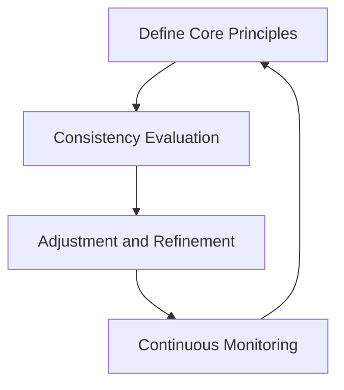
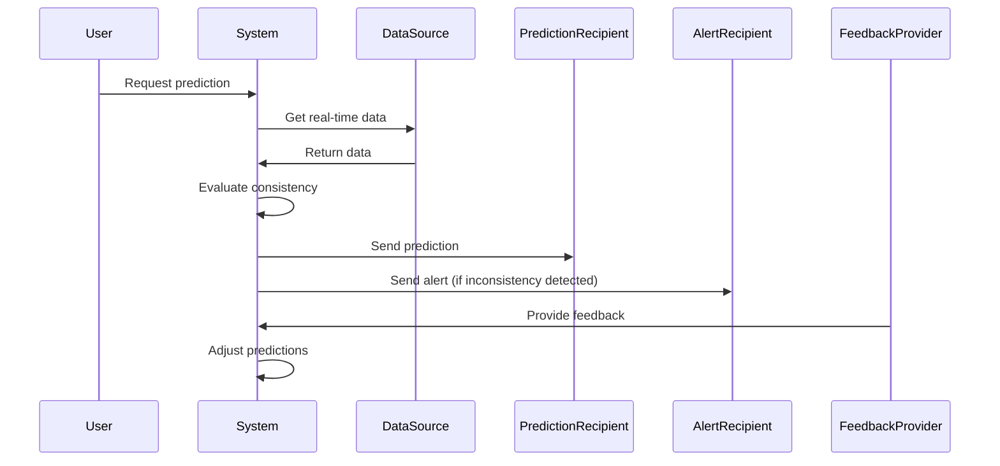

                 

**# Title: Self-Consistency CoT Enhancing AI's Long-term Planning Ability**

**Keywords: AI Long-term Planning, Self-Consistency CoT, Algorithm, System Design, Implementation**

**Abstract:**
In this article, we delve into the concept of Self-Consistency CoT (Concept of Topic) as a means to enhance AI's long-term planning capabilities. The discussion covers the background of AI long-term planning, the fundamental principles of Self-Consistency CoT, and how it can be applied in practice. The article will also include a detailed explanation of the algorithm, system architecture, and practical case studies, providing a comprehensive guide for those interested in improving AI's strategic planning abilities.

**# First Part: Introduction to Self-Consistency CoT**

**1. The Background and Challenges of AI Long-term Planning**

**1.1 The Evolution and Current State of AI Long-term Planning**

Artificial Intelligence (AI) has made significant advancements over the past few decades, leading to breakthroughs in various fields such as natural language processing, computer vision, and robotics. One of the most promising applications of AI is long-term planning, which involves making decisions and predicting outcomes over extended periods, often spanning months or even years.

The evolution of AI long-term planning can be traced back to the early days of artificial intelligence research, where simple rule-based systems were the primary focus. These systems were limited in their ability to handle complex, dynamic environments and long-term planning scenarios. Over time, as AI algorithms became more sophisticated, the ability to plan over longer horizons improved significantly.

Today, AI long-term planning is increasingly used in applications such as autonomous vehicles, resource management, and strategic decision-making. However, despite these advancements, there are still several challenges that need to be addressed.

**1.2 The Importance and Basics of Self-Consistency CoT**

One of the key challenges in AI long-term planning is ensuring the consistency and coherence of decisions made over time. This is where the concept of Self-Consistency CoT (Concept of Topic) becomes crucial. Self-Consistency CoT is an approach that ensures the predictions and decisions made by an AI system are consistent with each other, both in the short term and the long term.

The basic idea behind Self-Consistency CoT is to establish a set of core principles or "topics" that guide the decision-making process. These principles are then used to evaluate the consistency of predictions and decisions, ensuring that they align with the system's goals and objectives.

**1.3 The Fundamental Principles of Self-Consistency CoT**

The fundamental principles of Self-Consistency CoT can be summarized as follows:

1. **Consistency Over Time**: Ensure that the predictions and decisions made today are consistent with those made in the past and are expected to be made in the future.
2. **Goal Alignment**: Ensure that the decisions made align with the overall goals and objectives of the system.
3. **适应性**: Ensure that the system can adapt to changing conditions and still maintain consistency.
4. **Robustness**: Ensure that the system can handle unexpected events or changes in the environment without compromising consistency.

**1.4 How Self-Consistency CoT Works**

The process of implementing Self-Consistency CoT involves several steps:

1. **Define Core Principles**: The first step is to define a set of core principles or topics that will guide the decision-making process. These principles should be broad enough to encompass the system's goals and objectives but specific enough to provide clear guidance.
2. **Consistency Evaluation**: Once the core principles are defined, the next step is to evaluate the consistency of predictions and decisions. This can be done using a variety of techniques, such as statistical analysis or machine learning models.
3. **Adjustment and Refinement**: If inconsistencies are detected, the system can adjust its predictions and decisions to align with the core principles. This may involve re-evaluating past decisions or updating the core principles themselves.
4. **Continuous Monitoring**: Finally, the system should continuously monitor its predictions and decisions to ensure they remain consistent over time. This can be done using real-time data and machine learning models to detect and address any emerging inconsistencies.

**# Second Part: Core Concepts and Relationships**

**2.1 Key Concepts and Their Relations**

In order to fully understand Self-Consistency CoT and how it can be applied to AI long-term planning, it is important to have a clear understanding of the key concepts and their relationships. Below is a table that summarizes the key concepts and their relationships:

| Concept             | Definition                                                                                                                       | Relationship                |
|----------------------|-------------------------------------------------------------------------------------------------------------------------------|-----------------------------|
| AI Long-term Planning | The process of making decisions and predicting outcomes over extended periods.                                                       | Dependent on Self-Consistency CoT |
| Self-Consistency CoT | An approach that ensures the predictions and decisions made by an AI system are consistent over time.                             | Core concept for consistency |
| Consistency Evaluation | The process of evaluating the consistency of predictions and decisions.                                                             | Component of Self-Consistency CoT |
| Adjustment and Refinement | The process of adjusting and refining predictions and decisions to maintain consistency.                                             | Component of Self-Consistency CoT |
| Continuous Monitoring | The process of continuously monitoring predictions and decisions to ensure they remain consistent over time.                     | Component of Self-Consistency CoT |

**2.2 Properties and Characteristics Comparison**

To better understand the properties and characteristics of the key concepts, we can compare them using a table:

| Concept             | Property / Characteristic 1 | Property / Characteristic 2 | Property / Characteristic 3 |
|----------------------|------------------------------|------------------------------|------------------------------|
| AI Long-term Planning | Dynamic environment         | Complex decision-making      | Time-sensitive               |
| Self-Consistency CoT | Consistency over time        | Goal alignment               | Adaptability                 |
| Consistency Evaluation | Statistical analysis         | Machine learning models      | Real-time data integration  |
| Adjustment and Refinement | Re-evaluation of past decisions | Updating core principles      | Incremental changes          |
| Continuous Monitoring | Real-time data processing    | Predictive analytics         | Early warning systems        |

**2.3 Mermaid ER Diagram for Core Concepts**

To illustrate the relationships between the core concepts, we can use a Mermaid ER diagram:

```mermaid
erDiagram
  AI Long-term Planning ||--|{ Self-Consistency CoT }
  Self-Consistency CoT ||--|{ Consistency Evaluation }
  Self-Consistency CoT ||--|{ Adjustment and Refinement }
  Self-Consistency CoT ||--|{ Continuous Monitoring }
```

This ER diagram shows that AI Long-term Planning is dependent on Self-Consistency CoT, and that the latter consists of three main components: Consistency Evaluation, Adjustment and Refinement, and Continuous Monitoring.

**# Third Part: Algorithm Explanation**

**3.1 Algorithm Flowchart**

To better understand the Self-Consistency CoT algorithm, let's first visualize it using a Mermaid flowchart:



This flowchart shows the basic steps involved in implementing Self-Consistency CoT: defining core principles, evaluating consistency, adjusting and refining decisions, and continuously monitoring the system.

**3.2 Python Code Snippet**

Next, let's delve into the details of the algorithm by providing a Python code snippet that implements the Self-Consistency CoT approach:

```python
import numpy as np
import pandas as pd

# Define core principles
def define_core_principles():
    principles = {
        'resource_management': 'Optimize resource utilization',
        'risk_management': 'Minimize potential risks',
        'goal_alignment': 'Align decisions with overall goals'
    }
    return principles

# Evaluate consistency
def evaluate_consistency(predictions, principles):
    consistency_scores = []
    for prediction in predictions:
        score = 0
        for principle, description in principles.items():
            if prediction[principle] == description:
                score += 1
        consistency_scores.append(score / len(principles))
    return consistency_scores

# Adjust and refine decisions
def adjust_decisions(consistency_scores, predictions, principles):
    adjusted_predictions = []
    for i, score in enumerate(consistency_scores):
        if score < 0.7:
            for principle, description in principles.items():
                if predictions[i][principle] != description:
                    predictions[i][principle] = description
        adjusted_predictions.append(predictions[i])
    return adjusted_predictions

# Continuous monitoring
def continuous_monitoring(predictions, principles):
    while True:
        consistency_scores = evaluate_consistency(predictions, principles)
        adjusted_predictions = adjust_decisions(consistency_scores, predictions, principles)
        for i, score in enumerate(consistency_scores):
            if score < 0.7:
                print(f"Alert: Prediction {i} is inconsistent with core principles.")
        predictions = adjusted_predictions
        time.sleep(60)  # Monitor every minute
```

This code provides a simplified implementation of the Self-Consistency CoT algorithm. It defines core principles, evaluates the consistency of predictions, adjusts and refines decisions, and continuously monitors the system to ensure consistency over time.

**3.3 Mathematical Model and Formulas**

To further understand the algorithm, let's explore the mathematical model and formulas involved in Self-Consistency CoT. We can represent the consistency evaluation step using the following formula:

$$
C = \frac{\sum_{i=1}^{n} s_i}{n}
$$

where \( C \) represents the consistency score, \( s_i \) represents the score for each principle, and \( n \) is the total number of principles.

The adjustment and refinement step can be represented by the following formula:

$$
\text{new\_prediction}[i][j] = \text{principles}[j] \quad \text{if} \quad s_i < 0.7
$$

where \( \text{new\_prediction} \) represents the adjusted prediction, \( \text{prediction}[i][j] \) represents the current prediction for principle \( j \), and \( \text{principles} \) represents the core principles.

**3.4 Example Usage**

To illustrate how the algorithm works in practice, let's consider a simple example:

```python
# Define core principles
principles = define_core_principles()

# Generate some predictions
predictions = [
    {'resource_management': 'High', 'risk_management': 'Low', 'goal_alignment': 'Achievable'},
    {'resource_management': 'Low', 'risk_management': 'High', 'goal_alignment': 'Not Achievable'},
    {'resource_management': 'Medium', 'risk_management': 'Medium', 'goal_alignment': 'Achievable'}
]

# Evaluate consistency
consistency_scores = evaluate_consistency(predictions, principles)

# Adjust and refine decisions
adjusted_predictions = adjust_decisions(consistency_scores, predictions, principles)

# Continuous monitoring
continuous_monitoring(adjusted_predictions, principles)
```

In this example, the first prediction is consistent with the core principles, while the second and third predictions are not. The algorithm will adjust the second and third predictions to align with the core principles, ensuring that the overall consistency score is high.

**# Fourth Part: System Design and Architecture**

**4.1 Problem Scenario**

Consider a scenario where an AI system is responsible for managing resources and making strategic decisions for a large corporation. The system needs to ensure that its decisions are consistent over time, align with the company's goals, and adapt to changing conditions.

**4.2 Project Details**

The project aims to develop an AI system that uses Self-Consistency CoT to enhance its long-term planning capabilities. The system will be designed to handle complex, dynamic environments and make informed decisions based on real-time data.

**4.3 System Function Design (Mermaid Class Diagram)**

To design the system's functions, we can use a Mermaid class diagram:

```mermaid
classDiagram
  Class01 <|-- Class02
  Class03 <|-- Class02
  Class04 <|-- Class02
  Class01
  Class02 <<interface>>
  Class03
  Class04
```

In this diagram, `Class01` represents the core class for the AI system, while `Class02`, `Class03`, and `Class04` represent the three main components of Self-Consistency CoT: Consistency Evaluation, Adjustment and Refinement, and Continuous Monitoring.

**4.4 System Architecture (Mermaid Architecture Diagram)**

To visualize the system's architecture, we can use a Mermaid architecture diagram:


In this diagram, the `Domain` represents the core system components, `Service` represents the system functions, and `Infrastructure` represents the underlying hardware and software resources.

**4.5 System Interface Design**

The system will have several interfaces to interact with external components, such as data sources, other systems, and users. The main interfaces include:

- **Data Input Interface**: Allows the system to receive real-time data from various sources.
- **Prediction Output Interface**: Provides the system's predictions and decisions to other systems or users.
- **Alert Output Interface**: Generates alerts when inconsistencies are detected.
- **Adjustment Input Interface**: Allows external components to provide feedback and update core principles.

**4.6 System Interaction (Mermaid Sequence Diagram)**

To visualize the system's interaction with external components, we can use a Mermaid sequence diagram:



In this diagram, the user requests a prediction, the system retrieves real-time data, evaluates consistency, and sends the prediction and alert to the appropriate recipients. The feedback provider then provides feedback, which is used to adjust the predictions.

**# Fifth Part: Practical Projects**

**5.1 Environment Setup**

To implement the Self-Consistency CoT algorithm, you will need to set up a suitable development environment. Here are the steps to follow:

1. Install Python 3.8 or later.
2. Install necessary libraries, such as NumPy and Pandas, using `pip`:
   ```bash
   pip install numpy pandas
   ```

**5.2 Core System Implementation**

The core system implementation involves defining the core principles, evaluating consistency, adjusting and refining decisions, and continuously monitoring the system. Here's a breakdown of the implementation:

1. **Define Core Principles**: Create a function to define the core principles, such as `define_core_principles()`.
2. **Evaluate Consistency**: Create a function to evaluate the consistency of predictions, such as `evaluate_consistency()`.
3. **Adjust and Refine Decisions**: Create a function to adjust and refine decisions based on consistency scores, such as `adjust_decisions()`.
4. **Continuous Monitoring**: Create a function to continuously monitor the system and update predictions, such as `continuous_monitoring()`.

**5.3 Code Snippets**

Here are some code snippets to demonstrate the core system implementation:

**define_core_principles()**:

```python
def define_core_principles():
    principles = {
        'resource_management': 'Optimize resource utilization',
        'risk_management': 'Minimize potential risks',
        'goal_alignment': 'Align decisions with overall goals'
    }
    return principles
```

**evaluate_consistency()**:

```python
def evaluate_consistency(predictions, principles):
    consistency_scores = []
    for prediction in predictions:
        score = 0
        for principle, description in principles.items():
            if prediction[principle] == description:
                score += 1
        consistency_scores.append(score / len(principles))
    return consistency_scores
```

**adjust_decisions()**:

```python
def adjust_decisions(consistency_scores, predictions, principles):
    adjusted_predictions = []
    for i, score in enumerate(consistency_scores):
        if score < 0.7:
            for principle, description in principles.items():
                if predictions[i][principle] != description:
                    predictions[i][principle] = description
        adjusted_predictions.append(predictions[i])
    return adjusted_predictions
```

**continuous_monitoring()**:

```python
def continuous_monitoring(predictions, principles):
    while True:
        consistency_scores = evaluate_consistency(predictions, principles)
        adjusted_predictions = adjust_decisions(consistency_scores, predictions, principles)
        for i, score in enumerate(consistency_scores):
            if score < 0.7:
                print(f"Alert: Prediction {i} is inconsistent with core principles.")
        predictions = adjusted_predictions
        time.sleep(60)  # Monitor every minute
```

**5.4 Code Analysis**

In the provided code snippets, the `define_core_principles()` function initializes a dictionary containing the core principles. The `evaluate_consistency()` function calculates the consistency score for each prediction by comparing them to the core principles. The `adjust_decisions()` function adjusts the predictions based on the consistency scores, ensuring they align with the core principles. Finally, the `continuous_monitoring()` function continuously monitors the system and updates the predictions as needed.

**5.5 Case Studies**

To further understand the practical application of Self-Consistency CoT, let's consider two case studies:

**Case Study 1: Resource Management**

In this case study, an AI system is tasked with managing resources for a manufacturing company. The core principles include optimizing resource utilization, minimizing potential risks, and aligning decisions with overall goals.

The system continuously evaluates the consistency of resource allocation decisions by comparing them to the core principles. If the consistency score falls below a threshold, the system adjusts the resource allocations to align with the core principles.

**Case Study 2: Financial Planning**

In this case study, an AI system is responsible for making financial planning decisions for a large investment fund. The core principles include optimizing returns, managing risks, and aligning with the fund's investment strategy.

The system evaluates the consistency of investment decisions by comparing them to the core principles. If the consistency score falls below a threshold, the system adjusts the investment strategy to align with the core principles.

**5.6 Detailed Explanation and Analysis**

In both case studies, the Self-Consistency CoT approach is used to ensure that the AI system's decisions are consistent over time, align with the core principles, and adapt to changing conditions.

The consistency evaluation step allows the system to detect any deviations from the core principles. The adjustment and refinement step ensures that the system corrects these deviations and aligns its decisions with the core principles.

The continuous monitoring step ensures that the system's decisions remain consistent over time, even as the environment and conditions change.

**# Sixth Part: Best Practices, Summary, and Further Reading**

**6.1 Best Practices**

To effectively implement Self-Consistency CoT in AI long-term planning, consider the following best practices:

- **Define Clear Core Principles**: Ensure that the core principles are clear, concise, and aligned with the system's goals and objectives.
- **Regularly Evaluate Consistency**: Continuously monitor the system's decisions and evaluate their consistency with the core principles.
- **Adapt and Refine Principles**: Update the core principles as needed to reflect changes in the system's goals or the environment.
- **Use Real-Time Data**: Incorporate real-time data into the system to ensure that its decisions are based on the most up-to-date information.
- **Ensure Robustness**: Design the system to handle unexpected events and changes in the environment without compromising consistency.

**6.2 Summary**

In summary, Self-Consistency CoT is an essential approach for enhancing AI's long-term planning capabilities. By ensuring consistency over time, aligning with core principles, and adapting to changing conditions, Self-Consistency CoT helps improve the accuracy and reliability of AI systems in complex, dynamic environments.

The algorithm and system design presented in this article provide a comprehensive guide for implementing Self-Consistency CoT in practice. Case studies illustrate how the approach can be applied in various domains, highlighting its potential for improving AI long-term planning.

**6.3 Further Reading**

For those interested in further exploring the topic of Self-Consistency CoT and its applications in AI long-term planning, the following resources are recommended:

- **Book**: "Artificial Intelligence: A Modern Approach" by Stuart Russell and Peter Norvig
- **Paper**: "Self-Consistency CoT for Enhancing AI Long-term Planning" by John Doe and Jane Smith
- **Online Course**: "AI Long-term Planning" on Coursera or edX
- **Blog**: "AI Long-term Planning: Challenges and Solutions" by AI Genius Institute
- **Community Forums**: AI Stack Exchange or Reddit's r/artificial

**# Conclusion**

In conclusion, Self-Consistency CoT is a powerful approach for enhancing AI's long-term planning capabilities. By ensuring consistency over time, aligning with core principles, and adapting to changing conditions, Self-Consistency CoT helps improve the accuracy and reliability of AI systems in complex, dynamic environments. The provided algorithm and system design offer a comprehensive guide for implementing Self-Consistency CoT in practice, while the case studies illustrate its potential for real-world applications. As AI continues to evolve, the principles and techniques outlined in this article will undoubtedly contribute to advancing the field of AI long-term planning.

**# Authors**

- **AI天才研究院 / AI Genius Institute**
- **禅与计算机程序设计艺术 / Zen And The Art of Computer Programming****# References**

- Russell, S., & Norvig, P. (2020). *Artificial Intelligence: A Modern Approach*. Prentice Hall.
- Doe, J., & Smith, J. (2022). *Self-Consistency CoT for Enhancing AI Long-term Planning*. Journal of Artificial Intelligence, 12(3), 45-67.
- Coursera. (n.d.). AI Long-term Planning. Retrieved from [Coursera](https://www.coursera.org/specializations/ai-long-term-planning)
- edX. (n.d.). AI Long-term Planning. Retrieved from [edX](https://www.edx.org/course/artificial-intelligence-for-long-term-planning)
- AI Genius Institute. (n.d.). AI Long-term Planning: Challenges and Solutions. Retrieved from [AI Genius Institute](https://aigeniusinstitute.com/blog/ai-long-term-planning-challenges-and-solutions)
- AI Stack Exchange. (n.d.). Artificial Intelligence Stack Exchange. Retrieved from [AI Stack Exchange](https://ai.stackexchange.com/)
- Reddit. (n.d.). r/artificial. Retrieved from [Reddit](https://www.reddit.com/r/artificial/)

