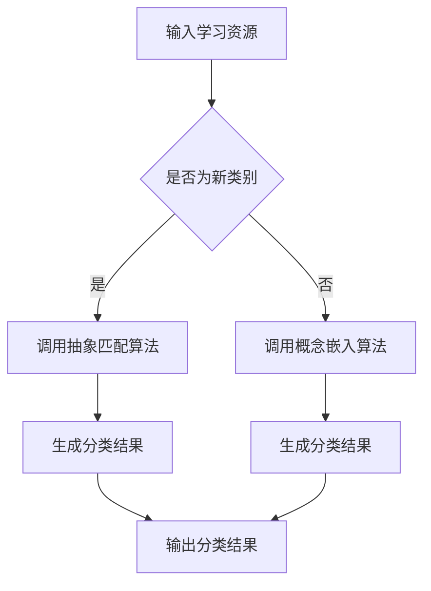
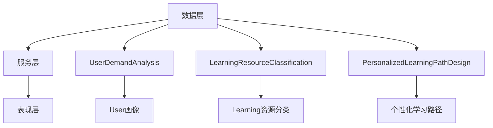

                 

# 《Zero-Shot CoT在个性化学习路径设计中的应用》

## 关键词
- 零样本学习（Zero-Shot Learning）
- 个性化学习路径设计
- 内容表示（Content-based）推荐系统
- 机器学习算法
- 人工智能教育

## 摘要
随着人工智能和机器学习技术的飞速发展，个性化学习已经成为教育领域的重要研究方向。然而，传统个性化学习路径设计存在诸多局限性。本文将探讨零样本学习（Zero-Shot Learning，简称ZSL）在个性化学习路径设计中的应用，通过内容表示（Content-based）推荐系统，实现高效的零样本学习路径设计，从而提升个性化学习效果。

## 第1章：背景介绍与问题定义

### 1.1 问题背景
个性化学习需求的兴起是现代教育发展的必然趋势。传统教学模式往往以教师为中心，难以满足每个学生的学习需求和进度。个性化学习通过针对每个学生的特点和需求，提供定制化的学习路径和资源，从而提高学习效果和兴趣。

然而，传统个性化学习路径设计存在以下局限性：
- **数据依赖性强**：传统个性化学习依赖于大量训练数据，但在某些领域，如医学、法律等，训练数据获取困难。
- **适应能力有限**：传统方法在应对新的学习内容时，适应能力有限，难以实现真正的零样本学习。

### 1.2 问题描述
如何设计高效的零样本学习路径，并利用零样本学习提升个性化学习效果，成为当前研究的关键问题。

零样本学习（ZSL）是一种不依赖大量标记数据，能够对未见过的数据进行分类或预测的机器学习方法。它在个性化学习路径设计中的应用，有望解决传统方法的局限性，实现更加灵活和高效的个性化学习。

### 1.3 问题解决
零样本学习的基本概念如下：
- **零样本学习（Zero-Shot Learning）**：一种不依赖于标记数据，能够对未见过的数据进行分类或预测的机器学习方法。
- **内容表示（Content-based）推荐系统**：一种基于内容属性的推荐系统，通过分析学习资源的特征和属性，为用户推荐相关资源。

零样本学习与内容表示推荐系统的结合，为个性化学习路径设计提供了一种新的思路。通过内容表示推荐系统，可以将学习资源的特征映射到高维空间，实现资源的有效分类和推荐。在此基础上，结合零样本学习算法，可以设计出无需依赖大量训练数据的个性化学习路径。

### 1.4 边界与外延
零样本学习在个性化学习中的应用场景广泛，包括：
- **新领域学习**：在面对新的学科领域时，零样本学习能够快速适应并推荐相关学习资源。
- **跨学科学习**：零样本学习能够发现不同学科之间的相关性，为跨学科学习提供支持。

然而，零样本学习在个性化学习中也面临一定的挑战，如：
- **数据不足问题**：在某些领域，训练数据不足可能导致零样本学习效果不佳。
- **准确性问题**：零样本学习在面对高度相似的数据时，可能存在准确性问题。

因此，零样本学习与个性化学习的协同优化，是未来研究的重点方向。

## 第2章：核心概念与联系

### 2.1 零样本学习原理
#### 2.1.1 零样本学习的基本概念
零样本学习（Zero-Shot Learning，简称ZSL）是一种无需依赖大量标记数据，能够对未见过的数据进行分类或预测的机器学习方法。ZSL的主要目标是学习一个映射模型，将类别标签映射到高维特征空间，从而实现对新类别数据的分类。

#### 2.1.2 零样本学习与有监督学习、无监督学习的对比
有监督学习（Supervised Learning）依赖于大量标记数据，通过学习输入和输出之间的映射关系进行预测。无监督学习（Unsupervised Learning）则无需标记数据，主要通过数据分布学习数据特征。

相比之下，零样本学习不依赖大量标记数据，但需要预先学习类别标签和特征之间的映射关系。这使得ZSL在处理新类别数据时具有灵活性，但同时也面临挑战，如类别标签的多样性和特征空间的映射复杂度。

### 2.2 内容表示推荐系统
#### 2.2.1 内容表示的概念
内容表示（Content-based）推荐系统是一种基于内容属性的推荐系统，通过分析学习资源的特征和属性，为用户推荐相关资源。内容表示的核心思想是将学习资源映射到高维特征空间，从而实现资源的有效分类和推荐。

#### 2.2.2 内容表示在个性化学习路径设计中的应用
在个性化学习路径设计中，内容表示推荐系统可以用于：
- **资源分类**：将学习资源映射到高维特征空间，实现资源的有效分类。
- **资源推荐**：根据用户的学习历史和兴趣，为用户推荐相关的学习资源。

### 2.3 零样本学习与个性化学习路径设计的关系
#### 原理讲解
零样本学习与个性化学习路径设计的关系主要体现在以下几个方面：
- **资源推荐**：通过内容表示推荐系统，实现对未见过的学习资源的推荐，从而丰富个性化学习路径。
- **路径规划**：结合零样本学习算法，根据用户的学习需求和兴趣，动态调整个性化学习路径。

#### 概念属性特征对比表格
| 概念            | 特征                                                         |
| --------------- | ------------------------------------------------------------ |
| 零样本学习（ZSL） | 不依赖标记数据，学习类别标签和特征之间的映射关系             |
| 内容表示推荐系统 | 基于内容属性，将学习资源映射到高维特征空间                 |
| 个性化学习路径设计 | 结合ZSL和内容表示推荐系统，实现动态调整和优化个性化学习路径 |

#### ER实体关系图
```mermaid
erDiagram
    User ||--|{ LearningResource }|-- Student
    User ||--|{ LearningPath }|-- Designer
    LearningResource ||--|{ Category }|-- Resource
```

## 第3章：算法原理讲解

### 3.1 零样本学习算法介绍
零样本学习算法主要包括以下两种：
- **抽象匹配算法（Abstract Matching）**：通过学习类别标签和特征之间的映射关系，实现对新类别数据的分类。
- **概念嵌入算法（Concept Embedding）**：将类别标签映射到高维特征空间，实现对未见过的数据的高效分类。

### 3.2 算法流程与流程图
#### 使用Mermaid画出算法流程图


### 3.3 算法原理讲解
#### 数学模型和公式
零样本学习算法的核心是类别标签和特征之间的映射关系。假设特征空间为$\mathcal{X}$，类别标签空间为$\mathcal{Y}$，映射函数为$f: \mathcal{X} \rightarrow \mathcal{Y}$。

对于每个特征向量$x \in \mathcal{X}$，映射函数$f$将其映射到类别标签$y \in \mathcal{Y}$。具体地，映射函数可以表示为：
$$
f(x) = \arg\min_{y \in \mathcal{Y}} \lVert f(x) - y \rVert
$$
其中，$\lVert \cdot \rVert$表示欧几里得距离。

#### 通俗易懂地举例说明
假设有两个类别标签“动物”和“植物”，对应的特征向量分别为$(1, 0)$和$(0, 1)$。给定一个特征向量$(0.5, 0.5)$，通过映射函数$f$，可以将其映射到类别标签“动物”或“植物”。

具体来说，映射函数计算如下：
$$
f((0.5, 0.5)) = \arg\min_{y \in \{动物, 植物\}} \lVert (0.5, 0.5) - y \rVert
$$
计算欧几里得距离，得到：
$$
\lVert (0.5, 0.5) - (1, 0) \rVert = \sqrt{(0.5 - 1)^2 + (0.5 - 0)^2} = \sqrt{0.5}
$$
$$
\lVert (0.5, 0.5) - (0, 1) \rVert = \sqrt{(0.5 - 0)^2 + (0.5 - 1)^2} = \sqrt{0.5}
$$
由于两个距离相等，因此映射函数$f$可以将特征向量$(0.5, 0.5)$映射到类别标签“动物”或“植物”。

## 第4章：数学模型和数学公式讲解

### 4.1 模型公式
零样本学习算法的数学模型可以表示为：
$$
\min_{f} \sum_{i=1}^{n} \lVert f(x_i) - y_i \rVert^2
$$
其中，$x_i$表示特征向量，$y_i$表示类别标签，$n$表示数据样本数量，$f$表示映射函数。

### 4.2 模型推导
模型的推导基于最小二乘法（Least Squares Method）。对于每个特征向量$x_i$，我们希望找到映射函数$f$，使得$f(x_i)$与$y_i$之间的误差最小。具体地，我们希望最小化以下损失函数：
$$
L(f) = \sum_{i=1}^{n} \lVert f(x_i) - y_i \rVert^2
$$
对损失函数求导，并令其等于零，得到：
$$
\frac{\partial L(f)}{\partial f} = 2 \sum_{i=1}^{n} (f(x_i) - y_i) \cdot x_i = 0
$$
解得映射函数$f$：
$$
f(x_i) = \frac{1}{n} \sum_{j=1}^{n} y_j x_j
$$

### 4.3 模型应用
零样本学习算法在实际中的应用场景包括：
- **图像分类**：通过对未见过的图像进行分类，实现图像识别。
- **自然语言处理**：通过对未见过的文本进行分类，实现文本分类。

在实际应用中，零样本学习算法通过学习大量的特征和类别标签之间的映射关系，实现对新类别数据的高效分类。

## 第5章：系统分析与架构设计方案

### 5.1 个性化学习路径设计问题场景
个性化学习路径设计问题场景主要包括以下两个方面：
- **用户需求分析**：了解用户的学习需求和兴趣，为用户提供个性化的学习资源。
- **学习资源分类**：对学习资源进行有效分类，以便为用户提供相关资源。

### 5.2 系统功能设计
系统功能设计主要包括以下三个方面：
- **用户需求分析**：通过对用户的学习历史和兴趣进行挖掘，生成用户画像。
- **学习资源分类**：利用内容表示推荐系统，对学习资源进行分类和推荐。
- **个性化学习路径设计**：根据用户画像和学习资源分类结果，生成个性化的学习路径。

#### 领域模型Mermaid类图
```mermaid
classDiagram
    User <<interface>>
    LearningResource <<interface>>
    LearningPath <<interface>>

    User  LearningHistory
    User  Interest
    User  UserImage

    LearningResource  Category
    LearningResource  Resource

    LearningPath  LearningResource
```

### 5.3 系统架构设计
系统架构设计主要包括以下三个方面：
- **数据层**：负责数据的存储和管理，包括用户画像、学习资源和学习路径。
- **服务层**：负责系统的核心功能实现，包括用户需求分析、学习资源分类和个性化学习路径设计。
- **表现层**：负责系统的用户界面，包括用户操作和系统反馈。

#### 系统架构Mermaid架构图


### 5.4 系统接口设计
系统接口设计主要包括以下三个方面：
- **用户接口**：提供用户操作界面，包括用户需求分析、学习资源分类和个性化学习路径设计。
- **服务接口**：提供系统内部服务的接口，包括用户画像、学习资源分类和个性化学习路径设计。
- **数据接口**：提供数据存储和管理的接口，包括用户画像、学习资源和学习路径。

### 5.5 系统交互Mermaid序列图
```mermaid
sequenceDiagram
    participant 用户 as 用户
    participant 系统 as 系统
    participant 数据库 as 数据库

    用户 -->|提交需求| 系统
    系统 -->|分析需求| 数据库
    数据库 -->|返回画像| 系统
    系统 -->|生成路径| 数据库
    数据库 -->|返回路径| 系统
    系统 -->|展示路径| 用户
```

## 第6章：项目实战

### 6.1 环境安装与准备
项目实战环境安装与准备主要包括以下步骤：
1. 安装Python环境。
2. 安装必要的库，如NumPy、Pandas、Scikit-learn等。
3. 准备实验数据集，包括用户画像、学习资源和学习路径。

### 6.2 系统核心实现源代码
系统核心实现源代码主要包括以下部分：
1. **用户需求分析**：通过分析用户学习历史和兴趣，生成用户画像。
2. **学习资源分类**：利用内容表示推荐系统，对学习资源进行分类。
3. **个性化学习路径设计**：根据用户画像和学习资源分类结果，生成个性化的学习路径。

### 6.3 代码应用解读与分析
代码应用解读与分析主要包括以下方面：
1. **用户需求分析**：如何通过用户学习历史和兴趣生成用户画像。
2. **学习资源分类**：如何利用内容表示推荐系统对学习资源进行分类。
3. **个性化学习路径设计**：如何根据用户画像和学习资源分类结果，生成个性化的学习路径。

### 6.4 实际案例分析与详细讲解剖析
实际案例分析与详细讲解剖析主要包括以下案例：
1. **用户需求分析**：分析用户学习历史和兴趣，生成用户画像。
2. **学习资源分类**：利用内容表示推荐系统，对学习资源进行分类。
3. **个性化学习路径设计**：根据用户画像和学习资源分类结果，生成个性化的学习路径。

### 6.5 项目小结
项目小结主要包括以下内容：
1. **项目成果**：介绍项目的核心成果和亮点。
2. **经验与反思**：总结项目过程中的经验和反思。
3. **未来展望**：展望项目未来的发展方向和应用前景。

## 第7章：最佳实践与注意事项

### 7.1 零样本学习在个性化学习路径设计中的最佳实践
1. **数据准备**：确保数据集的多样性和质量，为零样本学习提供良好的训练基础。
2. **算法选择**：根据具体应用场景，选择合适的零样本学习算法。
3. **资源分类**：充分利用内容表示推荐系统，提高学习资源的分类精度。

### 7.2 遇到的问题与解决方案
1. **数据不足**：解决方案：增加数据集规模，利用数据增强技术。
2. **准确性问题**：解决方案：优化算法参数，结合多种算法进行融合。

### 7.3 注意事项
1. **用户隐私**：在个性化学习路径设计过程中，确保用户隐私保护。
2. **系统稳定性**：确保系统的高可用性和稳定性，为用户提供良好的使用体验。

### 7.4 拓展阅读
1. **相关论文**：阅读相关领域的最新论文，了解最新研究成果。
2. **开源项目**：参与开源项目，了解实际应用场景和解决方案。

## 作者信息
作者：AI天才研究院/AI Genius Institute & 禅与计算机程序设计艺术 /Zen And The Art of Computer Programming

