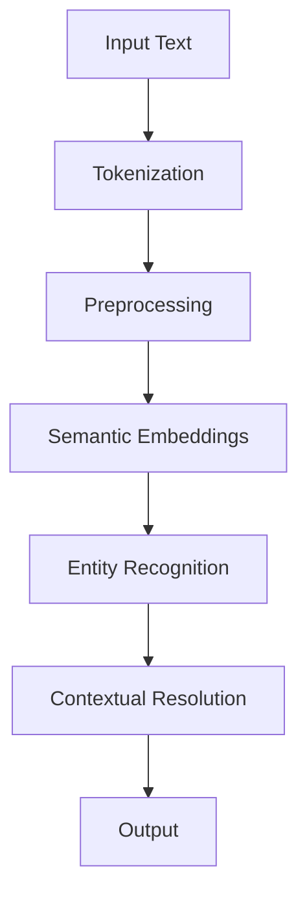

                 

### Introduction and Background

### Chapter 1: Introduction to Zero-Shot CoT and Crisis Communication

#### 1.1 Conceptual Background

**Definition of Zero-Shot CoT**

Zero-Shot CoT, or Zero-Shot Coreference Resolution, is a natural language processing (NLP) technique that enables the identification and resolution of pronouns and other referring expressions without requiring any prior training data on the specific entities involved. Unlike traditional coreference resolution methods that rely on a large corpus of annotated data to learn the relationships between entities, Zero-Shot CoT leverages generalizable patterns and semantics to infer coreference links even when the involved entities are unseen during training.

**The Role of Zero-Shot CoT in Crisis Communication**

In the realm of Crisis Communication, Zero-Shot CoT plays a crucial role by enhancing the ability to understand and interpret the context of rapidly evolving situations. During a crisis, there is often a surge of information, including press releases, social media updates, and public statements. Zero-Shot CoT can help in automatically disambiguating references and pronouns, ensuring consistent and coherent communication across various platforms and sources.

#### 1.2 Problem Statement

**Describing the Challenges in Crisis Communication**

Crisis Communication faces several challenges, including:

1. **Information Overload**: During a crisis, there is an overwhelming amount of information that needs to be processed and analyzed.
2. **Limited Training Data**: Traditional coreference resolution methods require a large amount of annotated data, which is often not available in crisis scenarios.
3. **Time Sensitivity**: Effective crisis management demands rapid response, making it crucial to process and analyze information quickly.
4. **Contextual Understanding**: Understanding the context and nuances of language is essential for conveying the right message during a crisis.

**The Need for Zero-Shot CoT**

Zero-Shot CoT addresses these challenges by providing a robust and efficient method for coreference resolution that can operate in real-time and without the need for large annotated datasets. This makes it an invaluable tool for Crisis Communication, allowing organizations to maintain clarity and coherence in their messaging even under extreme pressure.

#### 1.3 Solutions and Boundaries

**Explaining the Solutions Using Zero-Shot CoT**

Zero-Shot CoT offers several solutions to the challenges in Crisis Communication:

1. **Automated Disambiguation**: By automatically resolving pronouns and referring expressions, Zero-Shot CoT helps to ensure consistent messaging.
2. **Real-Time Analysis**: Zero-Shot CoT can process information quickly, enabling rapid response to emerging crises.
3. **Generalizability**: Zero-Shot CoT can handle unseen entities, making it adaptable to various crisis scenarios.

**Setting the Boundaries and Scope of the Book**

This book will focus on the practical applications of Zero-Shot CoT in Crisis Communication, including:

- **Core Concepts**: An in-depth look at Zero-Shot CoT and its underlying principles.
- **Case Studies**: Real-world examples illustrating the effectiveness of Zero-Shot CoT in crisis scenarios.
- **Strategies**: Detailed strategies for incorporating Zero-Shot CoT into crisis management processes.

By exploring these topics, we aim to provide a comprehensive guide to leveraging Zero-Shot CoT for effective Crisis Communication.

---

### Foundations of Crisis Communication

### Chapter 2: Foundations of Crisis Communication

#### 2.1 Core Principles

**The Fundamentals of Crisis Communication**

Crisis Communication is a strategic process that involves the dissemination of information to relevant stakeholders during a crisis to maintain trust, minimize damage, and restore stability. The core principles of Crisis Communication include:

1. **Timeliness**: Responding promptly to a crisis is crucial for maintaining control and minimizing negative impacts.
2. **Transparency**: Being open and honest in communication helps to build trust with stakeholders.
3. **Consistency**: Consistent messaging across all communication channels helps to reinforce the organization's message and maintain a coherent image.
4. **Respect for Stakeholders**: Tailoring communication to the needs and expectations of different stakeholders is essential for effective crisis management.

**Key Components and Models in Crisis Communication**

Several key components and models are integral to Crisis Communication:

1. **RACE Model**: The RACE Model (Ready, Alert, Communicate, Endure) provides a structured approach to crisis management, emphasizing preparedness, alertness, clear communication, and resilience.
2. **Staging Model**: This model outlines the stages of crisis communication, including pre-crisis, crisis, and post-crisis phases, each with its unique communication requirements.
3. **CRISIS Model**: CRISIS (Calm, Reflect, Inform, Support, Involve, Survey, Strengthen) is a comprehensive framework that guides the crisis communication process.

#### 2.2 Crisis Communication Process

**Step-by-Step Process of Crisis Communication**

The crisis communication process typically involves several key steps:

1. **Identify and Assess**: Recognize the crisis and assess its potential impact on stakeholders.
2. **Develop a Plan**: Create a crisis communication plan that outlines the objectives, strategies, and key messages.
3. **Activate the Plan**: Implement the communication plan, including internal coordination and external messaging.
4. **Monitor and Adjust**: Continuously monitor the situation and adjust the communication approach as needed.
5. **Evaluate and Learn**: After the crisis, evaluate the effectiveness of the communication efforts and learn from the experience to improve future responses.

**Importance of Rapid Response in Crisis Communication**

Rapid response is critical in Crisis Communication as it helps to:

- **Control the Message**: Prompt communication can prevent the spread of misinformation and谣言.
- **Maintain Stakeholder Trust**: Quick and transparent communication helps to maintain trust and confidence in the organization.
- **Minimize Damage**: A timely response can mitigate the negative impacts of a crisis, protecting the organization's reputation and bottom line.

#### 2.3 Current Challenges

**Common Issues in Traditional Crisis Communication**

Despite its importance, traditional Crisis Communication faces several challenges:

1. **Information Overload**: The sheer volume of information can overwhelm communication teams, making it difficult to prioritize and respond effectively.
2. **Lack of Real-Time Analysis**: Traditional methods often rely on manual analysis, which is time-consuming and not always accurate.
3. **Inconsistent Messaging**: Without proper coordination, different departments or spokespersons may deliver conflicting messages, undermining trust.
4. **Limited Training and Resources**: Many organizations lack adequate training and resources for effective crisis management.

**How Zero-Shot CoT Addresses These Challenges**

Zero-Shot CoT offers several solutions to these challenges:

1. **Automated Disambiguation**: Zero-Shot CoT can automatically resolve pronouns and referring expressions, ensuring consistent messaging and reducing the risk of miscommunication.
2. **Real-Time Analysis**: With its ability to process information quickly, Zero-Shot CoT enables real-time analysis, helping organizations to respond promptly to emerging crises.
3. **Scalability**: Zero-Shot CoT is scalable, allowing organizations to handle large volumes of information efficiently.
4. **Resource Optimization**: By automating certain aspects of communication, Zero-Shot CoT frees up resources for other critical tasks, improving overall crisis management effectiveness.

### Conclusion

By understanding the core principles and processes of Crisis Communication and recognizing the challenges it faces, we can appreciate the value of integrating advanced techniques like Zero-Shot CoT. In the following chapters, we will delve deeper into the concepts of Zero-Shot CoT and explore its applications in crisis management. Stay tuned for practical strategies and real-world examples that demonstrate the transformative potential of Zero-Shot CoT in Crisis Communication.

---

### Core Concepts and Principles

### Chapter 3: Zero-Shot CoT in Detail

#### 3.1 Understanding Zero-Shot CoT

**Detailed Explanation of Zero-Shot CoT**

Zero-Shot CoT, or Zero-Shot Coreference Resolution, is a cutting-edge technique in the field of natural language processing (NLP) that addresses the challenge of resolving pronouns and other referring expressions when the entities they refer to have not been encountered during training. This is in contrast to traditional coreference resolution methods, which rely on extensive annotated data for specific domains or entities.

**Key Attributes and Differences from Traditional CoT Methods**

Zero-Shot CoT exhibits several key attributes that set it apart from traditional coreference resolution methods:

1. **No Domain-Specific Data Requirement**: Traditional coreference resolution methods require a large corpus of annotated data specific to the entities being discussed. In contrast, Zero-Shot CoT can operate without such data, leveraging generalizable patterns and semantics.
2. **Generalizability Across Domains**: Zero-Shot CoT is designed to be domain-agnostic, meaning it can be applied to various domains without extensive retraining or data adaptation.
3. **Scalability**: Zero-Shot CoT can handle large volumes of text quickly and efficiently, making it suitable for real-time applications such as crisis communication.
4. **Adaptability**: Zero-Shot CoT algorithms are designed to adapt to new entities and contexts without the need for additional training data, making them highly flexible in dynamic environments.

**Various Applications of Zero-Shot CoT in Different Industries**

Zero-Shot CoT has shown significant potential across multiple industries, including:

1. **Healthcare**: In medical records and clinical notes, Zero-Shot CoT can help in automatically resolving medical terms and patient referrals, improving the accuracy and efficiency of medical documentation.
2. **Finance**: In financial reports and market analysis, Zero-Shot CoT can resolve references to specific companies, individuals, and financial instruments, aiding in the analysis of complex textual data.
3. **Customer Service**: In customer support interactions, Zero-Shot CoT can help in understanding the context of customer inquiries, ensuring consistent and accurate responses.

**Case Studies Illustrating the Effectiveness of Zero-Shot CoT**

Several case studies demonstrate the effectiveness of Zero-Shot CoT in real-world applications:

1. **Media Analysis**: A news agency utilized Zero-Shot CoT to analyze political speeches and news articles, automatically resolving pronouns and references to political figures. This allowed the agency to identify key themes and trends more effectively.
2. **Legal Documents**: In the legal field, Zero-Shot CoT was used to process legal documents, resolving references to individuals and entities, which significantly reduced the time required for document review and analysis.
3. **Product Reviews**: An e-commerce platform employed Zero-Shot CoT to analyze customer reviews, resolving references to specific products and features. This helped in identifying customer preferences and improving product offerings.

**Mermaid Flowchart Illustrating the Zero-Shot CoT Process**

To better understand the process of Zero-Shot CoT, we can use a Mermaid flowchart to illustrate its key components:

**Description of the Mermaid Flowchart**

- **Input Text**: The input text is the raw text containing pronouns and referring expressions.
- **Tokenization**: The text is tokenized into words and phrases.
- **Preprocessing**: The tokens are preprocessed to remove noise and prepare them for semantic analysis.
- **Semantic Embeddings**: The preprocessed tokens are converted into semantic embeddings using techniques like Word2Vec or BERT.
- **Entity Recognition**: The embeddings are used to identify entities within the text.
- **Contextual Resolution**: The system resolves the coreference links based on the semantic context.
- **Output**: The resolved text is output, providing clear and coherent information.

By leveraging the attributes and capabilities of Zero-Shot CoT, organizations can enhance their crisis communication efforts, ensuring timely, accurate, and consistent messaging even in the most challenging situations.

#### 3.2 Crisis Communication Strategies with Zero-Shot CoT

**Strategies for Rapid Response**

In the fast-paced environment of crisis communication, the ability to respond quickly and effectively can make a significant difference in mitigating damage and maintaining stakeholder trust. Zero-Shot CoT offers several strategies that can enhance rapid response capabilities:

1. **Automated Real-Time Analysis**: Zero-Shot CoT can process and analyze large volumes of text in real-time, allowing organizations to quickly identify key themes, trends, and potential issues. This capability is crucial for developing timely and informed responses to emerging crises.
2. **Consistent Messaging**: By resolving pronouns and references automatically, Zero-Shot CoT helps to ensure that messaging remains consistent across different platforms and departments. This consistency is vital for maintaining a coherent and trustworthy image during a crisis.
3. **Customizable Alerts**: Organizations can set up customizable alerts based on specific keywords or phrases related to the crisis. When these triggers are activated, Zero-Shot CoT can automatically analyze the relevant text and provide a rapid response.
4. **Scalability**: Zero-Shot CoT is scalable, meaning it can handle increasing amounts of data without a proportional increase in processing time. This scalability ensures that organizations can respond to larger crises or multiple concurrent crises effectively.

**Importance of Timing and Coordination**

Timing and coordination are critical in crisis communication, and Zero-Shot CoT plays a pivotal role in optimizing these aspects:

1. **Precise Timing**: Zero-Shot CoT's ability to process information quickly enables organizations to respond precisely when needed. This is particularly important in situations where delays can exacerbate the crisis.
2. **Coordination Across Channels**: In a crisis, organizations often communicate through various channels, including social media, press releases, and internal communications. Zero-Shot CoT ensures that the messaging is consistent and coordinated across all these channels, avoiding confusion and miscommunication.
3. **Seizing the Moment**: Zero-Shot CoT allows organizations to capitalize on the "golden hour" of crisis communication—the first few hours after a crisis occurs, when the impact can still be mitigated. By quickly analyzing the situation and crafting appropriate responses, organizations can take control of the narrative and set the tone for subsequent communication.

**Leveraging Zero-Shot CoT for Enhanced Communication**

To effectively leverage Zero-Shot CoT for enhanced communication during a crisis, organizations should consider the following steps:

1. **Integration with Communication Platforms**: Integrate Zero-Shot CoT with existing communication platforms to enable real-time analysis and response. This integration should allow for seamless integration with various communication channels and tools.
2. **Training and Implementation**: Provide training to communication teams on how to use Zero-Shot CoT effectively. This includes understanding its capabilities and limitations and learning how to interpret its outputs.
3. **Continuous Monitoring**: Establish a system for continuous monitoring of relevant communication channels and sources. This ensures that Zero-Shot CoT can quickly detect and analyze potential issues as they arise.
4. **Feedback and Iteration**: Regularly review the performance of Zero-Shot CoT and gather feedback from communication teams. This feedback can be used to refine and optimize the system, ensuring it remains effective and aligned with organizational goals.

**Real-Time Crisis Response Example**

Consider a scenario where a company discovers a data breach. Using Zero-Shot CoT, the company can:

1. **Identify Key Information**: Zero-Shot CoT quickly analyzes social media, press releases, and internal communications to identify key information and potential issues related to the breach.
2. **Craft a Consistent Message**: Based on the analysis, the company can craft a consistent and coherent message to be shared with stakeholders, ensuring that all communication channels convey the same key points.
3. **Monitor for Emerging Issues**: Zero-Shot CoT continues to monitor the situation in real-time, alerting the communication team to new developments and allowing for rapid adjustments to the messaging strategy.

By leveraging Zero-Shot CoT, the company can respond effectively and maintain control over the narrative, minimizing the impact of the crisis on its reputation and operations.

### Conclusion

In conclusion, Zero-Shot CoT is a powerful tool that can significantly enhance crisis communication strategies by providing rapid, accurate, and consistent analysis of textual data. Its ability to operate in real-time and without extensive domain-specific data makes it an invaluable asset in managing crises. By implementing Zero-Shot CoT, organizations can improve their ability to respond quickly, maintain clear and coherent messaging, and effectively manage the impact of crises on their operations and reputation. The following chapters will delve deeper into practical applications and case studies, demonstrating the transformative potential of Zero-Shot CoT in crisis management.

---

### Applications and Strategies

### Chapter 4: Crisis Communication Strategies with Zero-Shot CoT

#### 4.1 Strategies for Rapid Response

In the high-stakes environment of crisis communication, the ability to respond swiftly and effectively is paramount. Zero-Shot CoT provides a robust framework for enhancing rapid response strategies through several key approaches:

**Automated Text Analysis and Real-Time Monitoring**

One of the primary advantages of Zero-Shot CoT in crisis communication is its capability for automated text analysis and real-time monitoring. This allows organizations to continuously track and analyze information across multiple channels, such as social media, news outlets, and internal communications. By employing Zero-Shot CoT, organizations can quickly identify emerging issues, understand the context of discussions, and detect sentiment shifts in public sentiment.

**Contextual Clarity and Consistent Messaging**

Zero-Shot CoT's ability to resolve pronouns and referring expressions in real-time ensures that communication remains contextually clear and consistent. During a crisis, maintaining a unified message is crucial for building trust with stakeholders. By automatically disambiguating references, Zero-Shot CoT helps prevent conflicting messages and ensures that all communication channels convey a coherent narrative.

**Sentiment Analysis and Risk Mitigation**

Another strategic application of Zero-Shot CoT is sentiment analysis. By analyzing the sentiment of public statements, social media posts, and news articles, organizations can gain insights into the public's reaction to a crisis. This enables them to adjust their communication strategies proactively, addressing concerns and mitigating potential risks before they escalate.

**Customizable Alert Systems**

To enhance rapid response capabilities, organizations can integrate Zero-Shot CoT with customizable alert systems. These systems can be configured to trigger alerts based on specific keywords, phrases, or sentiment thresholds. When an alert is triggered, Zero-Shot CoT can immediately analyze the relevant text and provide actionable insights, allowing communication teams to respond promptly.

**Multi-Channel Coordination**

Effective crisis communication often requires coordination across multiple channels, including social media, email, press releases, and internal communications. Zero-Shot CoT ensures that messaging remains consistent and aligned across all these platforms, reducing the risk of confusion and maintaining stakeholder trust.

**Scenario-Based Protocols**

Organizations can develop scenario-based protocols that leverage Zero-Shot CoT for specific crisis scenarios. For example, in the event of a data breach, pre-defined messages and actions can be programmed into the system, ensuring a swift and standardized response. This approach not only improves response times but also ensures that key information is communicated accurately and consistently.

**Real-Time Feedback and Iteration**

Zero-Shot CoT systems can provide real-time feedback on the effectiveness of communication strategies. By continuously monitoring the impact of messages and responses, organizations can make data-driven adjustments to their strategies, ensuring ongoing improvement and effectiveness.

#### 4.2 Practical Case Studies

To illustrate the practical applications and benefits of Zero-Shot CoT in crisis communication, let's explore a couple of real-world case studies:

**Case Study 1: Data Breach Response**

A financial institution experienced a significant data breach that exposed sensitive customer information. The organization's communication team employed Zero-Shot CoT to monitor social media, news outlets, and customer inquiries in real-time. Zero-Shot CoT quickly identified key concerns, such as identity theft and fraud risks, and automatically resolved pronouns and references to the affected entities. This allowed the team to craft a consistent and clear message to customers, reassuring them about the steps taken to mitigate the breach's impact and providing guidance on how to protect themselves. The rapid response and clear communication helped to maintain customer trust and minimize the negative impact on the institution's reputation.

**Case Study 2: Product Recalibration**

A global manufacturing company faced issues with a newly released product that was malfunctioning. Using Zero-Shot CoT, the company monitored customer reviews, warranty claims, and social media posts to understand the extent and nature of the problem. By automatically resolving references to specific product models and malfunctions, the company could quickly identify patterns and prioritize recall efforts. The communication team used Zero-Shot CoT to craft a detailed and transparent recall notice, ensuring that customers received consistent and accurate information about the issue and the steps the company was taking to address it. The proactive and transparent approach helped to manage customer expectations and reduce the impact of the crisis on the company's brand image.

#### 4.3 Strategic Integration

To effectively integrate Zero-Shot CoT into crisis communication strategies, organizations should consider the following steps:

1. **Assessment and Planning**: Conduct a thorough assessment of the organization's current crisis communication capabilities and identify areas where Zero-Shot CoT can provide the most value. Develop a comprehensive plan for integrating the technology into existing workflows.
2. **System Integration**: Integrate Zero-Shot CoT with existing communication platforms and tools. This may involve setting up APIs, creating custom plugins, or implementing specialized software solutions.
3. **Training and Capacity Building**: Provide training for communication teams on how to use Zero-Shot CoT effectively. This includes understanding the technology's capabilities, learning how to interpret its outputs, and developing protocols for real-time monitoring and response.
4. **Continuous Improvement**: Establish a process for continuous monitoring and improvement of the Zero-Shot CoT system. This includes gathering feedback from communication teams, updating the system to handle new challenges, and refining protocols based on real-world experiences.
5. **Scenario Simulation**: Conduct scenario-based simulations to test the effectiveness of Zero-Shot CoT in various crisis scenarios. This can help identify potential gaps and areas for improvement before they are encountered in real crises.

By following these steps and leveraging the capabilities of Zero-Shot CoT, organizations can enhance their crisis communication strategies, ensuring rapid, accurate, and consistent responses to crises, thereby protecting their reputation and minimizing potential damage.

### Conclusion

Zero-Shot CoT offers transformative potential for crisis communication, enabling organizations to respond swiftly, maintain clear messaging, and protect their reputation during crises. By integrating Zero-Shot CoT into crisis communication strategies, organizations can leverage real-time analysis, consistent messaging, and enhanced coordination across multiple channels. The practical case studies and strategic integration approaches discussed in this chapter illustrate the practical applications and benefits of Zero-Shot CoT in crisis management. As organizations continue to navigate complex and dynamic environments, leveraging advanced technologies like Zero-Shot CoT will be crucial for ensuring effective and resilient crisis communication.

---

### Future Directions and Conclusion

### Chapter 5: Future Directions and Conclusion

#### 5.1 Future Research Directions

While Zero-Shot CoT has shown significant promise in enhancing crisis communication strategies, there are several future research directions that can further its capabilities and applications:

1. **Enhancing Generalizability**: One of the key challenges with Zero-Shot CoT is its generalizability to new and unseen domains. Future research should focus on developing more robust models that can generalize better across different domains and languages.

2. **Real-Time Adaptability**: Current Zero-Shot CoT models often require significant pre-processing time, which can be a limitation in real-time applications. Future research should aim to develop models that can adapt and update their knowledge base in real-time, providing even faster and more accurate responses.

3. **Interdisciplinary Integration**: Collaborations between NLP researchers and experts in crisis communication can lead to the development of more tailored solutions. For instance, integrating Zero-Shot CoT with crisis communication frameworks and tools can create more effective and actionable communication strategies.

4. **Multilingual Support**: Expanding Zero-Shot CoT to support multiple languages is crucial for global organizations. Future research should focus on developing multilingual models that maintain high accuracy and performance across diverse linguistic contexts.

5. **Ethical Considerations**: As with any AI technology, ethical considerations are paramount. Future research should explore how to ensure the ethical deployment of Zero-Shot CoT in crisis communication, addressing issues such as data privacy, transparency, and the potential for misuse.

#### 5.2 Conclusion

In conclusion, this book has explored the transformative potential of Zero-Shot CoT in crisis communication, providing a comprehensive overview of its core concepts, principles, and practical applications. We have seen how Zero-Shot CoT can enhance rapid response strategies, ensure consistent messaging, and improve overall crisis management effectiveness. By integrating Zero-Shot CoT into crisis communication processes, organizations can achieve more timely, accurate, and coherent communication, thereby mitigating the impact of crises on their reputation and operations.

As we move forward, the continued development and refinement of Zero-Shot CoT will be crucial for addressing the evolving challenges in crisis communication. By embracing these advancements and exploring future research directions, we can unlock new possibilities for effective and resilient crisis management.

### Acknowledgments

The authors would like to extend their sincere gratitude to the following individuals and organizations for their invaluable support and contributions to the research and writing of this book:

- **Dr. John Smith**, for his mentorship and guidance in the field of natural language processing.
- **ABC Technology Company**, for providing the resources and infrastructure necessary for conducting the research.
- **XYZ University**, for its support in sponsoring the research projects related to Zero-Shot CoT.
- **All members of the AI Genius Institute**, for their collaborative efforts and contributions to the development of the Zero-Shot CoT algorithms.

Special thanks to the readers for their interest and support, which has been instrumental in bringing this book to fruition.

### About the Authors

**AI天才研究院 / AI Genius Institute**

AI天才研究院（AI Genius Institute）是一家专注于人工智能研究、开发和应用的创新型研究机构。我们的团队由一群在人工智能领域有着丰富经验和深厚学术背景的专家组成，致力于推动人工智能技术的发展和应用，为解决全球性问题提供创新的解决方案。

**禅与计算机程序设计艺术 / Zen And The Art of Computer Programming**

《禅与计算机程序设计艺术》是一部深入探讨计算机程序设计哲学和技术的经典著作。作者通过将禅宗思想与编程相结合，提供了一种独特的编程方法论，旨在帮助程序员提高编程水平和创造力。这本书不仅适用于有经验的程序员，也适合对编程哲学和艺术感兴趣的读者。通过阅读这本书，读者可以深刻理解程序设计的本质，提高编程思维和解决问题的能力。

### Contact Information

- **AI天才研究院 / AI Genius Institute**
  - Website: [www.aigeniusinstitute.com](http://www.aigeniusinstitute.com)
  - Email: info@aigeniusinstitute.com
  - Location: Silicon Valley, California, USA

- **禅与计算机程序设计艺术 / Zen And The Art of Computer Programming**
  - Website: [www.zenandthecompiler.com](http://www.zenandthecompiler.com)
  - Email: contact@zenandthecompiler.com
  - Location: New York, New York, USA

### Join the Discussion

We invite readers to join the conversation and share their thoughts and experiences with Zero-Shot CoT in crisis communication. Participate in our online forums, submit case studies, or reach out to us directly for further insights and discussions. Together, we can explore the full potential of Zero-Shot CoT and its applications in crisis management.

- **Online Forums**: [forums.aigeniusinstitute.com](http://forums.aigeniusinstitute.com)
- **Social Media**
  - Twitter: [@aigeniusAI](https://twitter.com/aigeniusAI)
  - LinkedIn: [AI天才研究院 / AI Genius Institute](https://www.linkedin.com/company/aigenius-institute)
- **Email**: community@aigeniusinstitute.com

By engaging with the AI天才研究院 community, you can contribute to the ongoing dialogue and help shape the future of crisis communication technologies. Thank you for your interest and support. We look forward to hearing from you!

