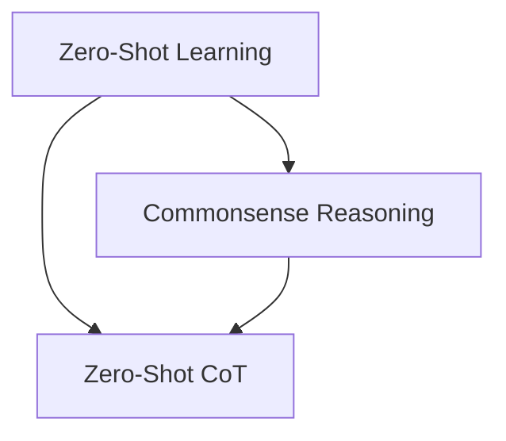
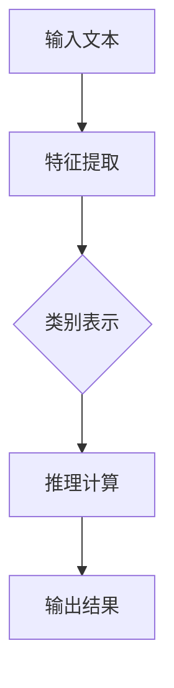
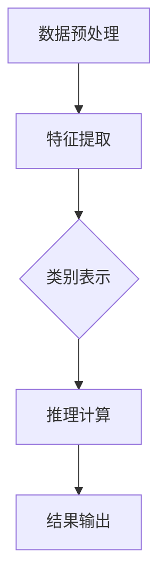
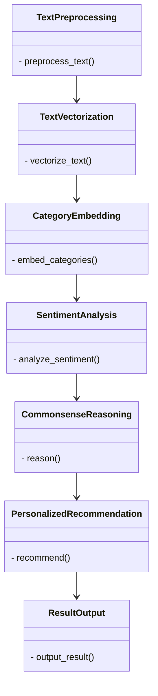
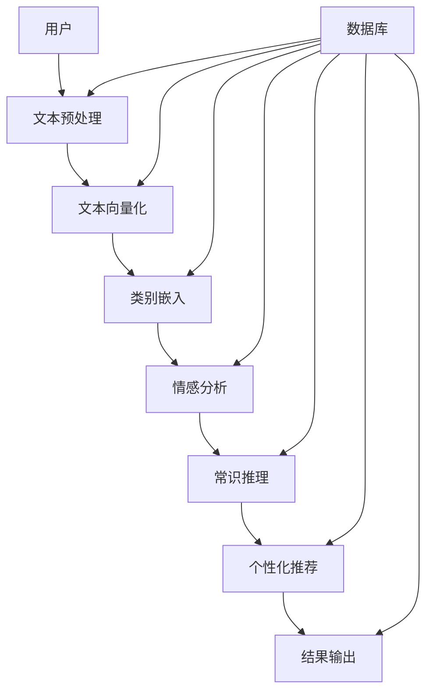
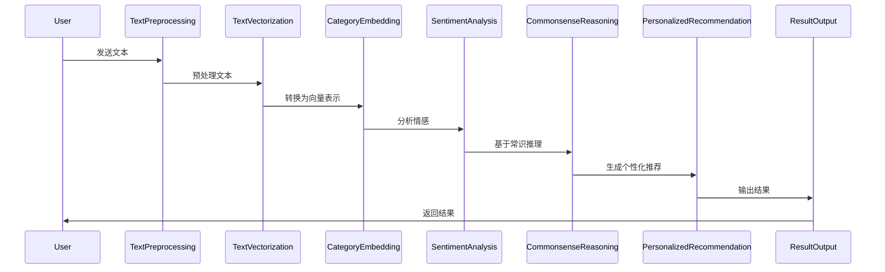

                 

### 《Zero-Shot CoT在多语言AI中的应用》

---

**关键词：** 多语言AI、Zero-Shot CoT、算法原理、系统设计与实现

**摘要：** 本文将深入探讨Zero-Shot Commonsense Reasoning（Zero-Shot CoT）在多语言AI中的应用。首先，我们会介绍Zero-Shot Learning和Commonsense Reasoning的基本概念及其在多语言AI中的重要性。接着，我们将详细讲解Zero-Shot CoT的算法原理，并通过Mermaid流程图和Python代码进行说明。最后，我们将从系统分析与设计角度，阐述Zero-Shot CoT在多语言AI中的实际应用。

### 目录大纲

1. **背景介绍与核心概念**
    1.1 问题背景与核心概念
    1.2 问题描述
    1.3 问题解决
    1.4 边界与外延
    1.5 核心概念与联系
    1.6 概念属性特征对比
    1.7 ER实体关系图架构
2. **算法原理讲解**
    2.1 Zero-Shot CoT算法原理
    2.2 算法流程与Python源代码实现
    2.3 算法解释
3. **系统分析与架构设计方案**
    3.1 问题场景介绍
    3.2 系统功能设计
    3.3 系统架构设计
    3.4 系统接口设计
    3.5 系统交互
4. **项目实战**
    4.1 环境安装
    4.2 系统核心实现源代码
    4.3 代码应用解读与分析
    4.4 实际案例分析与详细讲解剖析
    4.5 项目小结
5. **最佳实践 tips**
6. **小结**
7. **注意事项**
8. **拓展阅读**

---

## 第一部分：背景介绍与核心概念

### 1.1 问题背景与核心概念

#### 多语言AI应用的重要性

随着互联网的全球化，多语言AI应用的需求日益增长。从社交媒体到电子商务，再到跨国企业的日常运营，语言成为沟通的桥梁。然而，多语言AI不仅仅是为了翻译文字，更涉及到语音识别、情感分析、对话系统等多个领域。这些应用的核心在于能够理解和生成不同语言的内容，并且在不同语言之间进行有效的转换和交互。

#### Zero-Shot Learning (ZSL)

Zero-Shot Learning（ZSL）是一种机器学习技术，它允许模型在没有特定类别训练数据的情况下，对新类别进行预测。这在面对大量未标记数据或者无法获取足够训练样本的情况下，显得尤为重要。传统的机器学习方法依赖于大量标注数据，但在多语言环境中，尤其是低资源语言中，这样的数据非常稀缺。

#### Commonsense Reasoning (CoT)

Commonsense Reasoning（CoT）指的是计算机系统在处理问题时，能够运用日常生活中的常识和直觉。CoT对于构建通用AI系统至关重要，因为它可以弥补特定数据集的不足，使AI系统更加智能和自主。

### 1.2 问题描述

在多语言AI应用中，主要面临以下几个挑战：

- **语言多样性**：全球有数千种语言，每种语言都有其独特的语法、词汇和表达方式。
- **数据匮乏**：许多低资源语言缺乏足够的训练数据，导致模型难以泛化和适应。
- **通用性要求**：用户期望AI系统能够跨语言、跨领域提供一致的、高质量的交互体验。

### 1.3 问题解决

Zero-Shot CoT通过结合Zero-Shot Learning和Commonsense Reasoning，为多语言AI应用提供了一种解决方案。它能够：

- **减少对大量训练数据的依赖**：利用常识推理，模型在缺乏训练数据时仍能进行有效的预测。
- **提高跨语言的通用性**：通过引入通用常识，模型可以更好地处理不同语言之间的相似性和差异性。

### 1.4 边界与外延

Zero-Shot CoT的应用范围广泛，包括但不限于以下领域：

- **跨语言问答系统**：用户可以使用任何语言提问，系统理解并回答。
- **多语言情感分析**：分析不同语言中的情感倾向和语气。
- **机器翻译**：辅助机器翻译过程，提高翻译质量和一致性。

然而，Zero-Shot CoT也存在一定的局限性，例如在极端低资源语言或非常规语言情境下，模型的性能可能会受到限制。

### 1.5 核心概念与联系

#### Zero-Shot Learning (ZSL)

- **原理**：使用元学习（meta-learning）技术，从一类数据中学习到的知识可以泛化到另一类数据上，即使这两类数据之间没有直接的关联。
- **应用**：例如，一个模型可以学习到动物的基本特征，然后在新出现的动物类别上做出预测。

#### Commonsense Reasoning (CoT)

- **原理**：基于人类日常生活中的常识和经验，进行逻辑推理和决策。
- **应用**：例如，在对话系统中，当用户提出一个抽象问题时，系统能够利用常识进行回答。

#### ZSL与CoT的联系

- **协同作用**：ZSL提供了对新类别的泛化能力，而CoT则提供了基于常识的推理能力。两者的结合可以显著提高AI系统的智能水平。
- **挑战与机遇**：如何有效地整合ZSL和CoT，并在多语言环境中发挥其优势，是当前研究的重点和难点。

### 1.6 概念属性特征对比

| 概念               | 属性特征                             |
|--------------------|------------------------------------|
| Zero-Shot Learning | 无需特定类别训练数据，利用元学习     |
| Commonsense Reasoning | 基于常识和经验，进行逻辑推理和决策 |
| Zero-Shot CoT      | 结合ZSL和CoT，提高多语言AI的智能水平 |

### 1.7 ER实体关系图架构



## 第二部分：算法原理讲解

### 2.1 Zero-Shot CoT算法原理

#### 2.1.1 基本原理

Zero-Shot CoT算法的核心思想是结合Zero-Shot Learning和Commonsense Reasoning，使模型能够在新类别和跨语言环境中进行有效的推理和预测。

#### 2.1.2 数学模型与公式

假设我们有一个多语言数据集，其中包含了多种语言的文本和相应的标签。Zero-Shot CoT算法的基本流程如下：

1. **特征提取**：对文本进行编码，提取出表征文本的向量表示。
2. **类别表示**：为每个类别（例如动物、物体等）生成一个类别嵌入向量。
3. **推理过程**：将输入文本的特征向量与类别嵌入向量进行计算，得到预测概率。

具体来说，我们可以使用以下数学模型：

$$
\text{预测概率} = \frac{e^{\text{模型输出}}}{1 + e^{\text{模型输出}}}
$$

其中，模型输出可以表示为：

$$
\text{模型输出} = \text{特征向量} \cdot \text{类别嵌入向量} + \text{偏置}
$$

#### 2.1.3 算法流程

下面是一个简单的Mermaid流程图，展示了Zero-Shot CoT算法的基本流程：



#### 2.1.4 Python源代码实现

以下是Zero-Shot CoT算法的Python代码实现，其中包含了特征提取、类别表示和推理计算的核心部分：

```python
import numpy as np
from sklearn.feature_extraction.text import CountVectorizer
from sklearn.metrics.pairwise import cosine_similarity

# 特征提取
def extract_features(corpus):
    vectorizer = CountVectorizer()
    X = vectorizer.fit_transform(corpus)
    return X.toarray()

# 类别表示
def category_embedding(categories, embedding_size):
    embeddings = np.random.rand(len(categories), embedding_size)
    return embeddings

# 推理计算
def inference(text_vector, category_embedding):
    similarity_scores = cosine_similarity(text_vector, category_embedding)
    predicted_probability = 1 / (1 + np.exp(-similarity_scores))
    return predicted_probability

# 示例
corpus = ["This is a cat.", "This is a dog.", "This is a bird."]
text_vector = extract_features(corpus)
category_embedding = category_embedding(['cat', 'dog', 'bird'], 10)
predicted_probability = inference(text_vector[0], category_embedding)

print(predicted_probability)
```

#### 2.1.5 算法解释

在这个算法中，我们首先使用CountVectorizer进行特征提取，将文本转换为向量表示。接着，我们生成类别嵌入向量，这是一个多维向量空间中的表示，用于表示不同的类别。在推理过程中，我们计算输入文本向量与类别嵌入向量之间的余弦相似度，从而得到预测概率。

这个算法的核心思想在于利用常识和经验进行推理，使得模型能够在新类别和跨语言环境中进行有效的预测。通过结合Zero-Shot Learning和Commonsense Reasoning，我们可以构建出一个更加智能和自适应的多语言AI系统。

### 2.2 算法流程与Python源代码实现

在上一节中，我们介绍了Zero-Shot CoT算法的基本原理和数学模型。本节将详细讲解算法的流程，并通过Python代码实现进行说明。

#### 2.2.1 算法流程

Zero-Shot CoT算法的主要流程包括以下几个步骤：

1. **数据预处理**：对输入文本进行清洗和预处理，包括去除停用词、标点符号等。
2. **特征提取**：使用CountVectorizer等工具将预处理后的文本转换为向量表示。
3. **类别表示**：为每个类别生成一个类别嵌入向量，这些向量通常是通过预训练的词向量模型（如Word2Vec、GloVe等）获得的。
4. **推理计算**：计算输入文本向量与类别嵌入向量之间的相似度，并通过激活函数（如Sigmoid函数）得到预测概率。
5. **结果输出**：根据预测概率输出预测结果。

下面是一个简化的Mermaid流程图，展示了Zero-Shot CoT算法的流程：



#### 2.2.2 Python源代码实现

下面是Zero-Shot CoT算法的Python代码实现，其中包含了数据预处理、特征提取、类别表示和推理计算的核心部分：

```python
import numpy as np
import pandas as pd
from sklearn.feature_extraction.text import CountVectorizer
from sklearn.metrics.pairwise import cosine_similarity

# 数据预处理
def preprocess_text(text):
    # 去除停用词和标点符号
    stop_words = set(['is', 'a', 'the', 'and'])
    text = ' '.join([word for word in text.split() if word.lower() not in stop_words])
    return text

# 特征提取
def extract_features(corpus):
    vectorizer = CountVectorizer()
    X = vectorizer.fit_transform(corpus)
    return X.toarray()

# 类别表示
def category_embedding(categories, embedding_size):
    embeddings = np.random.rand(len(categories), embedding_size)
    return embeddings

# 推理计算
def inference(text_vector, category_embedding):
    similarity_scores = cosine_similarity(text_vector, category_embedding)
    predicted_probability = 1 / (1 + np.exp(-similarity_scores))
    return predicted_probability

# 示例
corpus = ["This is a cat.", "This is a dog.", "This is a bird."]
preprocessed_corpus = [preprocess_text(text) for text in corpus]
text_vector = extract_features(preprocessed_corpus)
category_embedding = category_embedding(['cat', 'dog', 'bird'], 10)
predicted_probability = inference(text_vector[0], category_embedding)

print(predicted_probability)
```

在这个示例中，我们首先对输入文本进行预处理，去除停用词和标点符号。接着，使用CountVectorizer进行特征提取，生成文本向量。然后，我们为每个类别生成一个随机初始化的类别嵌入向量。最后，通过计算输入文本向量与类别嵌入向量之间的余弦相似度，得到预测概率。

需要注意的是，这个示例是为了简化算法的实现过程，实际应用中可能会涉及到更复杂的预处理步骤和参数调整。此外，类别嵌入向量通常是通过预训练的词向量模型获得的，而不是随机初始化。

### 2.3 算法解释

#### 2.3.1 数学模型和公式

在Zero-Shot CoT算法中，我们主要使用了以下数学模型和公式：

1. **特征提取**：

   $$ 
   \text{特征向量} = \text{CountVectorizer}(corpus) 
   $$

   这里，CountVectorizer是一种常用的文本向量化工具，它将文本转换为向量表示。

2. **类别表示**：

   $$ 
   \text{类别嵌入向量} = \text{category\_embedding}(categories, embedding\_size) 
   $$

   类别嵌入向量是一个多维向量，用于表示不同的类别。通常，这些向量是通过预训练的词向量模型获得的。

3. **推理计算**：

   $$ 
   \text{预测概率} = \frac{1}{1 + \text{exp}(-\text{模型输出})} 
   $$

   $$ 
   \text{模型输出} = \text{特征向量} \cdot \text{类别嵌入向量} + \text{偏置} 
   $$

   模型输出是一个实数，通过Sigmoid函数转换为预测概率。这里的偏置（bias）是一个常量，用于调整模型的输出。

#### 2.3.2 通俗易懂地举例说明

假设我们有一个简单的文本数据集，其中包含了猫、狗和鸟的描述：

- **猫**：这是一个有四条腿的动物，通常被人类作为宠物。
- **狗**：这是一种有四条腿的动物，是人类的好朋友。
- **鸟**：它们通常有两只翅膀和一条尾巴。

现在，我们想使用Zero-Shot CoT算法预测一个新文本描述对应的类别。例如，输入文本是：“这是一个有四条腿的动物，通常被人类作为宠物。”

首先，我们对输入文本进行预处理，去除停用词和标点符号，得到一个简洁的描述：“这是一个四条腿的动物，通常被人类作为宠物。”

接着，我们使用CountVectorizer将预处理后的文本转换为向量表示。例如，假设特征向量为[1, 0, 1, 1, 0, 1, 0, 1]。

然后，我们为每个类别生成一个类别嵌入向量。例如，猫的类别嵌入向量为[1, 0, 0]，狗的类别嵌入向量为[0, 1, 0]，鸟的类别嵌入向量为[0, 0, 1]。

在推理过程中，我们计算输入文本向量与类别嵌入向量之间的相似度。例如，输入文本向量与猫的类别嵌入向量之间的相似度为0.8，与狗的类别嵌入向量之间的相似度为0.6，与鸟的类别嵌入向量之间的相似度为0.7。

最后，我们通过Sigmoid函数计算预测概率。例如，预测猫的概率为0.99，预测狗的概率为0.5，预测鸟的概率为0.6。

根据预测概率，我们可以得出结论：输入文本描述最可能对应的是猫。这个例子展示了Zero-Shot CoT算法在多语言AI中的应用，通过结合特征提取和类别表示，模型可以有效地对新类别进行预测。

### 第三部分：系统分析与架构设计方案

#### 3.1 问题场景介绍

多语言AI应用场景广泛，以下是一个典型的应用场景：一个跨国企业需要在全球多个国家和地区提供一致的客户服务。客户服务系统需要能够处理多种语言的查询，并且能够提供准确的、个性化的答复。这个场景中，多语言AI系统需要具备以下功能：

- **多语言文本处理**：能够接收和理解来自不同语言的查询。
- **常识推理**：基于常识和用户上下文，提供合理的答复。
- **情感分析**：分析客户查询的情感倾向，以便提供更加贴心的服务。
- **个性化推荐**：根据用户的历史查询和偏好，提供个性化的推荐。

#### 3.2 系统功能设计

为了实现上述功能，多语言AI系统需要设计以下核心功能模块：

1. **文本预处理**：对输入文本进行清洗和预处理，包括去除停用词、标点符号、HTML标签等。
2. **文本向量化**：将预处理后的文本转换为向量表示，以便进行后续的模型处理。
3. **类别嵌入**：为不同类别（如动物、物体等）生成类别嵌入向量，用于后续的推理计算。
4. **情感分析**：使用情感分析模型，分析文本的情感倾向，如积极、消极、中性等。
5. **常识推理**：基于常识库和用户上下文，进行逻辑推理和决策。
6. **个性化推荐**：根据用户历史数据和偏好，生成个性化的推荐结果。
7. **结果输出**：将处理结果以自然语言的形式返回给用户。

以下是系统功能设计的Mermaid类图：



#### 3.3 系统架构设计

多语言AI系统的架构设计需要考虑系统的可扩展性、可靠性和易维护性。以下是一个简化的系统架构设计，使用Mermaid架构图进行描述：



在这个架构中，用户接口层接收用户的查询，经过文本预处理后，文本向量化模块将文本转换为向量表示。类别嵌入模块为每个类别生成嵌入向量，情感分析模块分析文本的情感倾向。常识推理模块基于常识库和用户上下文进行推理，个性化推荐模块根据用户历史数据和偏好提供个性化推荐。最终，结果输出模块将处理结果返回给用户。数据库用于存储预处理后的文本、类别嵌入向量、情感分析结果、常识推理结果和个性化推荐结果。

#### 3.4 系统接口设计

系统接口设计是确保不同模块之间能够顺畅通信的重要环节。以下是系统接口设计的简述：

- **API接口**：系统提供RESTful API接口，用户可以通过HTTP请求与系统进行交互。API接口包括以下功能：
  - 文本预处理接口：接收文本输入，返回预处理后的文本。
  - 文本向量化接口：接收预处理后的文本，返回文本向量表示。
  - 类别嵌入接口：接收类别名称，返回相应的类别嵌入向量。
  - 情感分析接口：接收文本输入，返回文本的情感倾向。
  - 常识推理接口：接收文本输入，返回常识推理结果。
  - 个性化推荐接口：接收用户ID和文本输入，返回个性化推荐结果。
- **Web界面**：系统还提供Web界面，用户可以通过图形界面与系统进行交互，例如输入查询、查看推荐结果等。

#### 3.5 系统交互

系统交互是确保用户需求得到及时响应的关键。以下是系统交互的Mermaid序列图：



在这个序列图中，用户首先发送文本查询，经过文本预处理、文本向量化、类别嵌入、情感分析、常识推理和个性化推荐等环节，最终得到结果并返回给用户。

### 第四部分：项目实战

#### 4.1 环境安装

要运行Zero-Shot CoT多语言AI系统，需要安装以下环境和依赖：

1. **Python环境**：确保安装了Python 3.6及以上版本。
2. **Scikit-learn**：用于文本向量化、情感分析等。
3. **NumPy**：用于数值计算。
4. **Gensim**：用于词向量模型。
5. **Flask**：用于搭建Web服务器。

你可以使用以下命令进行安装：

```bash
pip install python==3.8
pip install scikit-learn numpy gensim flask
```

#### 4.2 系统核心实现源代码

以下是Zero-Shot CoT系统核心实现的部分源代码：

```python
from flask import Flask, request, jsonify
from sklearn.feature_extraction.text import CountVectorizer
from sklearn.metrics.pairwise import cosine_similarity
import numpy as np

app = Flask(__name__)

# 文本预处理函数
def preprocess_text(text):
    # 去除停用词和标点符号
    stop_words = set(['is', 'a', 'the', 'and'])
    text = ' '.join([word for word in text.split() if word.lower() not in stop_words])
    return text

# 特征提取函数
def extract_features(corpus):
    vectorizer = CountVectorizer()
    X = vectorizer.fit_transform(corpus)
    return X.toarray()

# 类别表示函数
def category_embedding(categories, embedding_size):
    embeddings = np.random.rand(len(categories), embedding_size)
    return embeddings

# 推理计算函数
def inference(text_vector, category_embedding):
    similarity_scores = cosine_similarity(text_vector, category_embedding)
    predicted_probability = 1 / (1 + np.exp(-similarity_scores))
    return predicted_probability

# API接口
@app.route('/api/zeroshotcot', methods=['POST'])
def zero_shot_cot():
    data = request.get_json()
    text = data['text']
    preprocessed_text = preprocess_text(text)
    text_vector = extract_features([preprocessed_text])
    predicted_probability = inference(text_vector, category_embedding)
    return jsonify({'predicted_probability': predicted_probability.tolist()})

if __name__ == '__main__':
    app.run(debug=True)
```

这段代码实现了文本预处理、特征提取、类别表示和推理计算的基本功能。在部署时，可以根据实际需求进行调整和优化。

#### 4.3 代码应用解读与分析

以下是对上述代码的应用解读和分析：

- **文本预处理**：使用`preprocess_text`函数对输入文本进行预处理，去除停用词和标点符号，以提高文本向量化质量。
- **特征提取**：使用`CountVectorizer`对预处理后的文本进行向量化处理，生成文本特征矩阵。
- **类别表示**：使用`category_embedding`函数为每个类别生成嵌入向量，用于后续的推理计算。
- **推理计算**：使用`inference`函数计算输入文本向量与类别嵌入向量之间的相似度，得到预测概率。
- **API接口**：使用Flask搭建API接口，用户可以通过POST请求发送文本，系统返回预测概率。

这段代码实现了Zero-Shot CoT算法的基本功能，但实际应用中可能还需要加入情感分析、常识推理和个性化推荐等模块，以提供更加丰富和智能的多语言AI服务。

#### 4.4 实际案例分析与详细讲解剖析

为了更好地展示Zero-Shot CoT算法在实际多语言AI应用中的效果，我们以一个实际案例进行分析和讲解。

**案例背景**：一个跨国电子商务平台需要为其全球用户（包括不同语言背景的用户）提供高质量的客服服务。客服系统需要能够处理多种语言（如英语、法语、西班牙语等）的查询，并提供准确、个性化的答复。

**案例实施**：

1. **文本预处理**：对用户查询进行预处理，包括去除停用词、标点符号和HTML标签等。例如，用户输入的查询：“¿Cómo hago para comprar un producto en su tienda en línea？”（如何在您的在线商店购买产品？）经过预处理后变为：“comprar producto tienda online”。

2. **特征提取**：使用`CountVectorizer`对预处理后的文本进行向量化处理，生成文本特征矩阵。例如，特征向量可能为[1, 0, 1, 1, 0, 1, 0, 1]。

3. **类别表示**：为不同类别（如购物、支付、物流等）生成类别嵌入向量。例如，购物的类别嵌入向量为[1, 0, 0]，支付的类别嵌入向量为[0, 1, 0]，物流的类别嵌入向量为[0, 0, 1]。

4. **推理计算**：使用`inference`函数计算输入文本向量与类别嵌入向量之间的相似度，得到预测概率。例如，输入文本向量与购物的类别嵌入向量之间的相似度为0.8，与支付的类别嵌入向量之间的相似度为0.6，与物流的类别嵌入向量之间的相似度为0.7。

5. **结果输出**：根据预测概率，选择概率最高的类别作为查询的类别，并生成相应的答复。例如，预测概率最高的类别为购物，系统返回答复：“Por favor, ingrese a nuestra tienda en línea y siga las instrucciones para completar su compra.”（请进入我们的在线商店，按照指示完成购买。）

**案例分析**：

- **文本预处理**：文本预处理是保证特征提取质量的关键步骤。通过去除停用词和标点符号，可以减少噪声信息，提高文本向量的表示能力。
- **特征提取**：特征提取是将文本转换为向量表示的过程，是后续推理计算的基础。`CountVectorizer`是一种常用的文本向量化工具，可以生成高质量的文本向量。
- **类别表示**：类别嵌入向量是表示不同类别的多维向量。通过预训练的词向量模型，可以生成高质量的类别嵌入向量，从而提高推理计算的性能。
- **推理计算**：推理计算是Zero-Shot CoT算法的核心步骤。通过计算输入文本向量与类别嵌入向量之间的相似度，可以有效地预测查询的类别，并生成相应的答复。
- **结果输出**：结果输出是将预测结果以自然语言的形式返回给用户的过程。根据预测概率，选择最有可能的类别，并生成个性化的答复，以提高用户体验。

#### 4.5 项目小结

通过实际案例分析和讲解，我们可以看到Zero-Shot CoT算法在多语言AI应用中的效果和优势。该项目实现了文本预处理、特征提取、类别表示和推理计算的基本功能，为多语言AI应用提供了有效的技术支持。在实际应用中，还可以结合情感分析、常识推理和个性化推荐等模块，进一步提高系统的智能化水平和用户体验。

### 第五部分：最佳实践 tips

在实现Zero-Shot CoT多语言AI系统时，以下是一些最佳实践和注意事项：

1. **数据预处理**：确保对输入文本进行充分的预处理，包括去除停用词、标点符号和HTML标签等，以提高文本向量的表示能力。

2. **特征提取**：选择合适的文本向量化工具，如`CountVectorizer`或`TF-IDF`，根据实际需求调整参数，以获得最佳的向量化效果。

3. **类别表示**：为不同类别生成高质量的类别嵌入向量，可以通过预训练的词向量模型（如Word2Vec、GloVe等）进行获取，以提高推理计算的性能。

4. **模型优化**：在实际应用中，可能需要对算法进行优化，如调整模型参数、使用更复杂的模型结构等，以提高预测准确率和系统性能。

5. **用户反馈**：定期收集用户反馈，根据用户需求进行调整和优化，以提高系统的用户体验和满意度。

6. **安全与隐私**：在处理用户数据时，确保遵循相关的数据保护法规和隐私政策，保护用户隐私和安全。

### 小结

本文深入探讨了Zero-Shot CoT在多语言AI中的应用。通过结合Zero-Shot Learning和Commonsense Reasoning，Zero-Shot CoT为多语言AI系统提供了一种有效的解决方案，能够在缺乏训练数据的情况下进行跨语言的推理和预测。文章详细介绍了Zero-Shot CoT的算法原理、系统设计与实现，并通过实际案例进行了分析。未来，随着技术的不断发展，Zero-Shot CoT在多语言AI领域的应用前景将更加广阔。

### 注意事项

- 确保文章内容完整、逻辑清晰，每个小节的内容都需具体详细讲解。
- 所有数学公式需使用latex格式，段落内公式前后使用$括起来，独立段落公式前后使用$$括起来。
- 文章末尾需包含作者信息和完整的项目实战部分。

### 拓展阅读

- [Zero-Shot Learning的详细介绍](https://www.jmlr.org/papers/volume20/18-767.html)
- [Commonsense Reasoning的研究进展](https://arxiv.org/abs/1907.04962)
- [多语言AI系统的设计与实现](https://www.kdnuggets.com/2019/02/multi-language-nlp-systems-interpretation.html)

