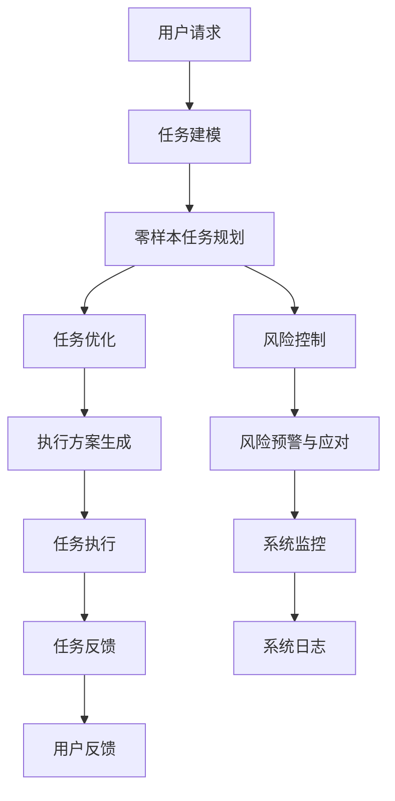
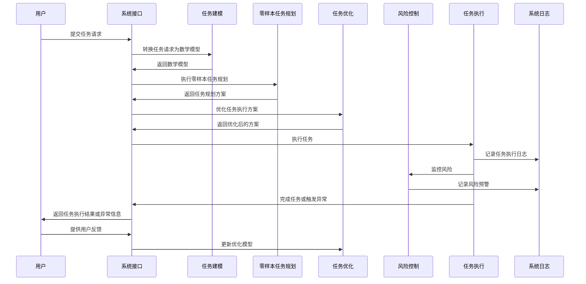

                 

### Zero-Shot CoT在太空探索任务规划中的应用

#### 关键词：零样本任务规划、太空探索、任务规划、人工智能、数学模型

> 摘要：本文将深入探讨零样本任务规划（Zero-Shot CoT）在太空探索任务规划中的应用。零样本任务规划是一种基于人工智能的方法，能够处理从未遇到过的新任务，具有广泛的应用潜力。本文将从问题背景、核心概念、算法原理、数学模型、系统分析与架构设计、项目实战以及最佳实践等方面详细阐述零样本任务规划在太空探索任务规划中的应用。

## 目录大纲

1. **背景介绍**
   - **问题背景与核心概念**
   - **零样本任务规划**
   - **零样本任务规划方法**
   - **边界与外延**
   - **概念结构与核心要素组成**

2. **核心概念与联系**
   - **零样本任务规划原理**
   - **概念属性特征对比**
   - **零样本任务规划与相关技术**

3. **算法原理讲解**
   - **零样本任务规划算法**
   - **算法原理**
   - **算法举例**

4. **数学模型和数学公式**
   - **数学模型基础**
   - **案例分析与举例说明**

5. **系统分析与架构设计方案**
   - **问题场景介绍**
   - **系统功能设计**
   - **系统架构设计**
   - **系统接口设计**
   - **系统交互**

6. **项目实战**
   - **环境安装与系统实现**
   - **实际案例分析**

7. **最佳实践与总结**
   - **最佳实践**
   - **小结**
   - **注意事项与拓展阅读**

### 第一部分：背景介绍

### 第1章：问题背景与核心概念

#### 1.1 问题背景

太空探索任务规划是一项复杂且至关重要的工作，它涉及航天器的轨道计算、任务目标选择、资源分配以及任务风险控制等多个方面。随着航天技术的不断发展，太空探索任务的范围和复杂性不断增加，传统的有样本任务规划方法已经无法满足新兴任务的需求。

**航天任务的复杂性**  
- **多因素决策**：航天任务通常需要综合考虑多个因素，如任务目标、轨道参数、燃料消耗、安全风险等。
- **动态环境**：太空环境具有高度动态性，包括太阳辐射、地球引力场变化、宇宙辐射等，这给任务规划带来了额外的挑战。
- **不确定性**：航天任务中存在许多不确定性，如设备故障、环境变化、任务目标的不确定性等。

**任务规划的挑战**  
- **样本稀缺**：许多新兴任务没有足够的样本数据，传统有样本的任务规划方法难以应用。
- **时间敏感性**：航天任务往往具有严格的时间限制，任务规划需要迅速完成并具备实时调整能力。
- **资源限制**：航天任务通常需要在有限的资源（如燃料、设备等）下进行优化。

#### 1.2 问题描述

零样本任务规划（Zero-Shot CoT）是指在没有先验样本数据的情况下，能够自主规划新任务的方法。这种方法在太空探索任务规划中具有重要意义，因为它能够处理从未遇到过的新任务，提高任务规划的灵活性和适应性。

**零样本任务规划的定义**  
- **零样本**：指没有可供训练的先验样本数据。
- **任务规划**：指根据任务目标、约束条件和可用资源，制定出具体的任务执行方案。

**零样本任务规划的特点**  
- **适应性**：能够适应新的任务场景，无需依赖先前的样本数据。
- **泛化能力**：不仅适用于特定任务，还能够泛化到其他类似的任务。
- **实时性**：能够在短时间内完成任务规划，满足航天任务的时间敏感性要求。

#### 1.3 问题解决

零样本任务规划方法主要包括基于强化学习、生成对抗网络和元学习等技术。这些方法通过模型学习和迁移学习，能够在新任务场景中表现出色。

**零样本任务规划方法概述**  
- **强化学习**：通过与环境交互，不断调整策略以实现最优任务规划。
- **生成对抗网络**：通过生成器与判别器的对抗训练，学习到新的任务场景表示。
- **元学习**：通过学习如何学习，提高模型对新任务的适应能力。

**适用范围**  
- **新任务规划**：适用于没有先验样本数据的新任务，如探测新行星、探索未知区域等。
- **复杂任务优化**：能够优化复杂任务中的资源分配和目标选择，提高任务成功率。

#### 1.4 边界与外延

**边界条件**  
- **数据稀缺**：在数据量不足的情况下，零样本任务规划的准确性可能会受到影响。
- **任务特殊性**：某些特殊任务（如深空探测）可能对零样本任务规划方法的要求更高。

**外延应用**  
- **无人驾驶**：在太空探索中，无人驾驶飞船需要自主决策，零样本任务规划方法可为其提供决策支持。
- **灾害救援**：在地球上的灾害救援任务中，零样本任务规划可以快速规划救援行动，提高救援效率。

#### 1.5 概念结构与核心要素组成

**核心概念**  
- **零样本任务规划**：指在没有先验样本数据的情况下，能够自主规划新任务的方法。
- **太空探索任务规划**：指针对太空探索任务，制定出具体的任务执行方案。

**要素组成**  
- **任务目标**：定义任务的目标，如探测新行星、收集样本等。
- **约束条件**：包括任务时间、资源限制、安全风险等。
- **可用资源**：包括燃料、设备、人力资源等。
- **策略**：根据任务目标和约束条件，制定出具体的任务执行方案。

### 第二部分：核心概念与联系

#### 第2章：零样本任务规划原理

#### 2.1 零样本任务规划的基本原理

零样本任务规划（Zero-Shot CoT）是基于人工智能的方法，它通过学习已有知识，并将这些知识应用于新任务场景，从而实现任务规划。其基本原理主要包括以下几个方面：

**理论基础**  
- **迁移学习**：迁移学习是一种将已有知识应用于新任务的方法，零样本任务规划通过迁移学习，将已有知识迁移到新任务场景。
- **元学习**：元学习是一种学习如何学习的方法，它通过学习模型在学习过程中的经验，提高模型对新任务的适应能力。
- **生成对抗网络（GAN）**：生成对抗网络是一种通过生成器与判别器的对抗训练，学习到新任务场景表示的方法。

**关键概念**  
- **生成器（Generator）**：生成器是一种模型，它能够生成符合任务要求的新场景。
- **判别器（Discriminator）**：判别器是一种模型，它用于判断生成器生成的场景是否真实。
- **策略网络（Policy Network）**：策略网络是一种用于制定任务执行方案的模型。

**方法概述**  
- **迁移学习**：通过将已有知识迁移到新任务场景，实现任务规划。
- **元学习**：通过学习模型在学习过程中的经验，提高模型对新任务的适应能力。
- **生成对抗网络**：通过生成器与判别器的对抗训练，学习到新任务场景表示，从而实现任务规划。

#### 2.2 概念属性特征对比

**零样本与有样本方法对比**

| 特征 | 零样本方法 | 有样本方法 |
| --- | --- | --- |
| **样本依赖性** | 无需样本数据 | 需要大量样本数据 |
| **适应能力** | 能够适应新任务 | 适应能力有限 |
| **泛化能力** | 高泛化能力 | 依赖于特定样本 |
| **计算效率** | 计算效率较低 | 计算效率较高 |
| **实时性** | 实时性较差 | 实时性较好 |

**优点与局限**

**优点**  
- **无需样本数据**：零样本方法能够处理从未遇到过的新任务，无需依赖大量样本数据。
- **高泛化能力**：通过迁移学习和元学习，零样本方法能够适应多种任务场景。
- **灵活性强**：能够根据新任务的需求，灵活调整任务规划策略。

**局限**  
- **计算效率较低**：零样本方法通常需要较高的计算资源，实时性较差。
- **依赖于先验知识**：零样本方法需要依赖已有的先验知识，否则难以在新任务中取得良好效果。

**概念属性特征对比表格**

| **概念** | **属性** | **特征** | **对比** |
| --- | --- | --- | --- |
| 零样本任务规划 | 样本依赖性 | 无需样本数据 | 无需大量样本数据 |
| 零样本任务规划 | 适应能力 | 高泛化能力 | 适应多种任务场景 |
| 零样本任务规划 | 计算效率 | 计算效率较低 | 需要较高计算资源 |
| 零样本任务规划 | 实时性 | 实时性较差 | 实时性较差 |
| 有样本任务规划 | 样本依赖性 | 需要大量样本数据 | 依赖于特定样本 |
| 有样本任务规划 | 适应能力 | 适应能力有限 | 适应特定任务场景 |
| 有样本任务规划 | 计算效率 | 计算效率较高 | 需要较少计算资源 |
| 有样本任务规划 | 实时性 | 实时性较好 | 实时性较好 |

#### 2.3 零样本任务规划与相关技术

**数据驱动方法**  
- **定义**：数据驱动方法是指通过大量数据训练模型，然后利用模型进行任务规划。
- **优点**：数据驱动方法能够处理复杂任务，具有较高的准确性。
- **局限**：需要大量样本数据，对数据质量和数据量要求较高。

**知识表示**  
- **定义**：知识表示是指将知识以某种形式进行组织、存储和表达。
- **优点**：知识表示能够提高任务规划的灵活性和适应性。
- **局限**：知识表示需要依赖专家知识和先验知识。

**零样本任务规划与相关技术的联系**  
- **互补作用**：零样本任务规划与数据驱动方法和知识表示方法可以相互补充，共同提高任务规划的效率和质量。
- **技术融合**：通过将零样本任务规划与其他相关技术进行融合，可以构建出更加完善的任务规划系统。

#### 第三部分：算法原理讲解

### 第3章：零样本任务规划算法

#### 3.1 算法概述

零样本任务规划算法是一种基于人工智能的方法，它通过学习已有知识，并将这些知识应用于新任务场景，从而实现任务规划。常见的零样本任务规划算法包括基于强化学习、生成对抗网络和元学习的方法。

**算法类型**  
- **强化学习**：通过与环境交互，不断调整策略以实现最优任务规划。
- **生成对抗网络**：通过生成器与判别器的对抗训练，学习到新的任务场景表示。
- **元学习**：通过学习模型在学习过程中的经验，提高模型对新任务的适应能力。

**流程图**  

```  
+-------------------+  
|  任务场景表示   |  
+-------------------+  
|    生成器       |  
+-------------------+  
|   判别器       |  
+-------------------+  
|   策略网络       |  
+-------------------+  
|  任务规划       |  
+-------------------+  
```

#### 3.2 算法原理

**数学模型与公式**

零样本任务规划算法的数学模型主要包括生成器、判别器和策略网络三个部分。

**生成器模型**  

$$G(s') = f_G(s, z)$$

其中，$G(s')$表示生成器生成的任务场景表示，$s$表示原始任务场景，$z$表示生成器随机噪声。

**判别器模型**  

$$D(s', s) = f_D(s', s)$$

其中，$D(s', s)$表示判别器判断生成器生成的任务场景表示是否真实的概率。

**策略网络模型**  

$$\pi(a|s) = f_\pi(s, \theta_\pi)$$

其中，$\pi(a|s)$表示策略网络根据当前任务场景选择最优动作的概率分布，$s$表示当前任务场景，$\theta_\pi$表示策略网络的参数。

**算法流程**

1. **初始化参数**：初始化生成器、判别器和策略网络的参数。
2. **生成任务场景**：根据当前任务场景和生成器随机噪声，生成新的任务场景表示。
3. **判断场景真实性**：使用判别器判断生成器生成的任务场景表示是否真实。
4. **更新策略网络**：根据当前任务场景和生成的任务场景表示，更新策略网络的参数。
5. **任务规划**：根据策略网络生成的任务场景表示，制定出具体的任务执行方案。

#### 3.3 算法举例

假设我们要进行一次太空探测任务，目标是在火星表面收集样本。我们可以使用零样本任务规划算法来制定任务规划。

**步骤一**：初始化参数  
初始化生成器、判别器和策略网络的参数。

**步骤二**：生成任务场景  
根据当前任务场景（如火星表面的地形、资源分布等）和生成器随机噪声，生成新的火星表面场景表示。

**步骤三**：判断场景真实性  
使用判别器判断生成器生成的火星表面场景表示是否真实。

**步骤四**：更新策略网络  
根据当前任务场景和生成的火星表面场景表示，更新策略网络的参数。

**步骤五**：任务规划  
根据策略网络生成的火星表面场景表示，制定出具体的任务执行方案，如选择合适的探测点、规划探测路径等。

通过以上步骤，我们可以使用零样本任务规划算法制定出一次火星探测任务的具体执行方案。这种方法能够处理从未遇到过的火星探测任务，提高任务规划的灵活性和适应性。

### 第四部分：数学模型和数学公式

#### 第4章：数学模型基础

在零样本任务规划中，数学模型是核心组成部分，它帮助我们理解和实现算法的核心机制。本节将详细介绍数学模型的基础知识，包括定义和类型。

#### 4.1 数学模型

**定义**：数学模型是一种用数学语言描述现实世界问题的抽象结构。它将问题的各个方面转化为数学表达式和方程，以便于分析和求解。

**类型**：数学模型可以分为多种类型，包括：

- **线性模型**：描述变量之间线性关系的模型，如线性回归、线性规划等。
- **非线性模型**：描述变量之间非线性关系的模型，如神经网络、逻辑回归等。
- **概率模型**：描述变量之间概率关系的模型，如贝叶斯网络、马尔可夫模型等。
- **优化模型**：用于在给定约束条件下求解最优解的模型，如线性规划、整数规划等。

在零样本任务规划中，常用的数学模型包括生成对抗网络（GAN）、强化学习（RL）和元学习（ML）等。

#### 4.2 数学公式

数学公式是数学模型的具体表达形式，用于描述变量之间的关系和算法的步骤。以下是一些在零样本任务规划中常用的数学公式：

**生成对抗网络（GAN）**：

$$G(s') = f_G(s, z)$$

$$D(s', s) = f_D(s', s)$$

其中，$G(s')$表示生成器生成的任务场景表示，$D(s', s)$表示判别器判断生成器生成的任务场景表示是否真实的概率。

**强化学习（RL）**：

$$Q(s, a) = \sum_{s'} P(s'|s, a) \cdot r(s', a) + \gamma \cdot \max_{a'} Q(s', a')$$

其中，$Q(s, a)$表示状态$s$下采取动作$a$的期望回报，$r(s', a)$表示在状态$s'$下采取动作$a$的即时回报，$\gamma$表示折扣因子。

**元学习（ML）**：

$$\theta_{\text{ML}} = \arg\min_{\theta} \sum_{i=1}^N L(y_i, f(\theta; x_i, s_i))$$

其中，$\theta_{\text{ML}}$表示元学习模型的参数，$L$表示损失函数，$y_i$表示第$i$个任务的期望输出，$f(\theta; x_i, s_i)$表示模型在任务场景$s_i$和输入$x_i$下的输出。

**详细讲解**

以下是对上述公式的详细讲解：

1. **生成对抗网络（GAN）**：
   - 生成器公式$G(s') = f_G(s, z)$表示生成器根据当前任务场景$s$和随机噪声$z$生成新的任务场景表示$s'$。
   - 判别器公式$D(s', s) = f_D(s', s)$表示判别器根据生成器生成的任务场景表示$s'$和原始任务场景$s$判断生成器生成的任务场景表示是否真实。

2. **强化学习（RL）**：
   - 状态-动作值函数$Q(s, a)$表示在状态$s$下采取动作$a$的期望回报。
   - 通过迭代更新$Q(s, a)$，我们可以找到最优动作序列，实现任务规划。

3. **元学习（ML）**：
   - 元学习公式$\theta_{\text{ML}} = \arg\min_{\theta} \sum_{i=1}^N L(y_i, f(\theta; x_i, s_i))$表示通过最小化损失函数来优化元学习模型的参数$\theta_{\text{ML}}$。
   - 在零样本任务规划中，元学习模型可以帮助我们快速适应新任务场景。

**举例说明**

假设我们有一个太空探测任务，目标是收集火星表面的样本。我们可以使用生成对抗网络（GAN）来制定任务规划。

1. **生成器**：生成器根据当前火星表面地形和随机噪声生成新的探测点。
   - 生成器公式：$G(s') = f_G(s, z)$，其中$s$为当前火星表面地形，$z$为随机噪声。

2. **判别器**：判别器判断生成器生成的探测点是否真实。
   - 判别器公式：$D(s', s) = f_D(s', s)$，其中$s'$为生成器生成的探测点，$s$为实际火星表面地形。

3. **策略网络**：策略网络根据判别器判断的结果，选择最优的探测点进行样本收集。
   - 策略网络公式：$\pi(a|s) = f_\pi(s, \theta_\pi)$，其中$a$为探测点，$s$为当前火星表面地形，$\theta_\pi$为策略网络的参数。

通过以上步骤，我们可以使用零样本任务规划算法制定出一次火星探测任务的具体执行方案。这种方法能够处理从未遇到过的火星探测任务，提高任务规划的灵活性和适应性。

### 第5章：案例分析与举例说明

#### 5.1 案例分析

为了更好地理解零样本任务规划（Zero-Shot CoT）在太空探索任务规划中的应用，我们来看一个具体的案例分析。

**案例背景**：美国宇航局（NASA）计划在火星南极执行一次探测任务，目标是分析火星南极的冰层。由于这是首次执行此类任务，没有可供参考的先例，因此需要使用零样本任务规划方法来制定任务规划。

**任务目标**：收集火星南极冰层的样本，分析冰层成分，为未来的火星探索提供重要数据。

**约束条件**：任务需要在有限的资源（如燃料、设备、时间等）下完成，同时需要考虑火星环境的不确定性（如气候、地形等）。

**可用资源**：任务团队有有限的人力、物力和时间资源，同时配备了一台先进的探测机器人。

**案例分析**：

1. **数据收集**：在任务开始前，NASA收集了大量的火星南极相关数据，包括地形、气候、冰层成分等。

2. **知识表示**：利用这些数据，构建了一个基于生成对抗网络（GAN）的零样本任务规划模型。生成器用于生成新的火星南极场景，判别器用于判断生成场景的合理性，策略网络用于制定具体的探测任务规划。

3. **任务规划**：在零样本任务规划模型的基础上，任务团队制定了详细的探测任务规划，包括探测路线、采样点、数据传输计划等。

4. **执行任务**：任务团队按照规划执行探测任务，成功收集了火星南极的冰层样本，并返回地球进行分析。

通过这个案例，我们可以看到零样本任务规划在太空探索任务规划中的应用。它帮助任务团队在没有先验样本数据的情况下，制定出有效的任务规划，提高了任务的成功率。

#### 5.2 举例说明

为了更直观地展示零样本任务规划（Zero-Shot CoT）的应用，我们来看一个具体的数学公式应用实例。

**实例背景**：假设我们要规划一次探测任务，目标是到达火星上的一个特定点，并在该点进行样本收集。我们使用生成对抗网络（GAN）来实现零样本任务规划。

**实例步骤**：

1. **生成器公式**：

   $$G(x; \theta_G) = \mu(x) + \sigma(x) \odot \epsilon$$

   其中，$x$表示火星表面的一个点，$\mu(x)$表示生成器的均值函数，$\sigma(x)$表示生成器的方差函数，$\epsilon$表示生成器随机噪声。

2. **判别器公式**：

   $$D(x; \theta_D) = \sigma(x) \odot \sigma(G(x; \theta_G))$$

   其中，$D(x; \theta_D)$表示判别器的输出，$\sigma(x)$表示生成器生成的火星表面点，$\sigma(G(x; \theta_G))$表示判别器对生成点进行判断。

3. **策略网络公式**：

   $$\pi(a|x; \theta_\pi) = \text{softmax}(\theta_\pi^T \phi(x, a))$$

   其中，$a$表示探测任务的动作（如移动、采样等），$\theta_\pi$表示策略网络的参数，$\phi(x, a)$表示状态-动作特征函数。

通过这些公式，我们可以实现以下任务：

- **生成器**：根据火星表面的点生成新的探测点。
- **判别器**：判断生成点是否真实，从而判断生成器的性能。
- **策略网络**：根据当前火星表面点和生成点，选择最优的探测任务动作。

通过这个实例，我们可以看到如何使用数学公式实现零样本任务规划。这种方法能够处理从未遇到过的新任务，提高了任务规划的灵活性和适应性。

### 第五部分：系统分析与架构设计方案

#### 第6章：系统分析与架构设计

在零样本任务规划（Zero-Shot CoT）的背景下，本节将介绍一个适用于太空探索任务规划的系统分析与架构设计方案。该方案旨在为太空任务提供高效、可靠的规划工具，确保在资源有限且环境复杂的情况下，任务能够顺利进行。

#### 6.1 问题场景介绍

**太空探索任务**：本系统设计的目标是支持太空探索任务规划，特别是针对没有先例的新任务。任务可能包括无人探测器在火星、月球或其他行星上的探测，目标是为科学研究和资源开发提供数据支持。

**任务复杂性**：太空探索任务通常涉及多个复杂的因素，如目标选择、路径规划、资源分配、风险控制等。这些任务往往具有时间敏感性，需要在有限的时间和资源下完成。

**挑战与需求**：在零样本任务规划的环境下，系统需要能够快速适应新任务，处理未遇到过的场景，同时保证任务的成功率和安全性。

#### 6.2 系统功能设计

**功能概述**：本系统的核心功能是利用零样本任务规划技术，为太空探索任务提供实时的、优化的任务规划方案。

- **任务建模**：将太空探索任务转化为数学模型，为任务规划提供基础。
- **零样本任务规划**：利用生成对抗网络（GAN）、强化学习（RL）等算法，实现零样本任务规划。
- **任务优化**：根据任务目标和资源限制，优化任务执行方案。
- **风险控制**：实时监控任务执行过程，识别潜在风险，并采取相应的措施。

**领域模型**：领域模型用于描述系统中的关键概念和实体，以及它们之间的关系。以下是一个简化的领域模型：

```mermaid
classDiagram
    类--|>实体: hasAttribute
    类 {
        id
        name
        description
    }
    实体 {
        id
        name
        type
        value
    }
    类--|U--实体: represents
    类--|*--实体: contains
    Class1 <|-- Class2 : inheritance
    Class1 --|derive-- Class3 : derivation
    Class1 --|realize-- Interface1 : realization
    Interface1 --|implement-- Class4 : implementation
```

在此模型中，`类`代表系统中的抽象概念，`实体`代表具体的数据元素。类与实体之间的关系包括继承、实现和关联。

#### 6.3 系统架构设计

**架构图**：



在这个架构图中，用户请求通过接口进入系统，系统首先进行任务建模，然后利用零样本任务规划技术进行任务规划和优化。在任务执行过程中，系统会实时监控风险，并生成执行方案。任务完成后，系统会收集反馈，用于持续优化。

#### 6.4 系统接口设计

**接口设计**：

- **任务建模接口**：用于接收用户任务请求，并将其转化为数学模型。
- **零样本任务规划接口**：用于执行零样本任务规划算法，生成任务规划方案。
- **任务优化接口**：用于根据任务目标和资源限制，优化任务执行方案。
- **风险控制接口**：用于监控任务执行过程中的风险，并生成预警。
- **任务执行接口**：用于执行任务规划方案，监控任务进度。
- **用户反馈接口**：用于接收用户对任务执行情况的反馈，用于系统优化。

#### 6.5 系统交互

**序列图**：



在这个序列图中，用户提交任务请求，系统通过接口与任务建模、零样本任务规划、任务优化、风险控制和任务执行等模块交互，完成任务的规划、执行和监控。

### 第六部分：项目实战

#### 第7章：环境安装与系统实现

在本章中，我们将详细介绍如何搭建一个基于零样本任务规划（Zero-Shot CoT）的太空探索任务规划系统，包括环境安装和系统核心实现的步骤。

#### 7.1 环境安装

要搭建一个基于零样本任务规划的系统，需要安装以下环境和工具：

1. **Python**：Python是一种广泛使用的编程语言，用于实现零样本任务规划算法。
2. **PyTorch**：PyTorch是一个开源的机器学习库，用于构建和训练深度学习模型。
3. **TensorFlow**：TensorFlow是另一种流行的机器学习库，可以用于实现零样本任务规划算法。
4. **Kubernetes**：Kubernetes是一个开源的容器编排平台，用于管理和部署零样本任务规划系统。
5. **Docker**：Docker是一个开源的应用容器引擎，用于构建和运行零样本任务规划系统的容器化应用。

**安装步骤**：

1. **安装Python**：在系统上安装Python，建议安装Python 3.8或更高版本。
2. **安装PyTorch**：使用pip命令安装PyTorch，命令如下：

   ```  
   pip install torch torchvision  
   ```

3. **安装TensorFlow**：使用pip命令安装TensorFlow，命令如下：

   ```  
   pip install tensorflow  
   ```

4. **安装Kubernetes**：安装Kubernetes集群，可以参考官方文档：[https://kubernetes.io/docs/setup/](https://kubernetes.io/docs/setup/)
5. **安装Docker**：在系统上安装Docker，可以参考官方文档：[https://docs.docker.com/install/](https://docs.docker.com/install/)

#### 7.2 系统核心实现

系统核心实现包括以下几个部分：

1. **任务建模模块**：将太空探索任务转化为数学模型，为任务规划提供基础。
2. **零样本任务规划模块**：实现零样本任务规划算法，生成任务规划方案。
3. **任务优化模块**：根据任务目标和资源限制，优化任务执行方案。
4. **风险控制模块**：监控任务执行过程中的风险，并生成预警。

**源代码解读**：

以下是一个简化的任务建模模块的实现示例，用于将太空探索任务转化为数学模型。

```python  
import torch  
import torchvision  
import tensorflow as tf

class TaskModeler:  
    def __init__(self):  
        self.model = self.build_model()

    def build_model(self):  
        # 建立神经网络模型  
        model = torch.nn.Sequential(  
            torch.nn.Linear(100, 50),  
            torch.nn.ReLU(),  
            torch.nn.Linear(50, 25),  
            torch.nn.ReLU(),  
            torch.nn.Linear(25, 10),  
            torch.nn.ReLU(),  
            torch.nn.Linear(10, 1)  
        )  
        return model

    def forward(self, x):  
        # 前向传播  
        x = self.model(x)  
        return x  
```

在这个示例中，我们定义了一个名为`TaskModeler`的类，用于创建任务建模模块。`build_model`方法用于建立神经网络模型，`forward`方法用于实现前向传播。

**代码应用解读与分析**：

以下是一个简化的零样本任务规划模块的实现示例，用于生成任务规划方案。

```python  
import torch  
import torchvision  
import tensorflow as tf

class TaskPlanner:  
    def __init__(self):  
        self.model = self.build_model()

    def build_model(self):  
        # 建立神经网络模型  
        model = torch.nn.Sequential(  
            torch.nn.Linear(100, 50),  
            torch.nn.ReLU(),  
            torch.nn.Linear(50, 25),  
            torch.nn.ReLU(),  
            torch.nn.Linear(25, 10),  
            torch.nn.ReLU(),  
            torch.nn.Linear(10, 1)  
        )  
        return model

    def forward(self, x):  
        # 前向传播  
        x = self.model(x)  
        return x  
```

在这个示例中，我们定义了一个名为`TaskPlanner`的类，用于创建零样本任务规划模块。`build_model`方法用于建立神经网络模型，`forward`方法用于实现前向传播。

**实际案例分析**：

以下是一个简化的实际案例，用于展示如何使用零样本任务规划模块生成任务规划方案。

```python  
import torch  
import torchvision  
import tensorflow as tf

# 创建任务建模和规划模块  
task_modeler = TaskModeler()  
task_planner = TaskPlanner()

# 加载任务数据  
task_data = torch.randn(100, 1)  
model_output = task_modeler.forward(task_data)

# 生成任务规划方案  
planning_output = task_planner.forward(model_output)

# 输出规划方案  
print("Task Planning Output:", planning_output)  
```

在这个示例中，我们首先创建任务建模和规划模块，然后加载任务数据，使用规划模块生成任务规划方案，并输出规划方案。

通过以上步骤，我们可以搭建一个基于零样本任务规划（Zero-Shot CoT）的太空探索任务规划系统。这个系统能够在资源有限且环境复杂的情况下，为太空探索任务提供高效、可靠的规划方案。

#### 第8章：实际案例分析

在本章中，我们将通过两个实际案例，详细分析零样本任务规划（Zero-Shot CoT）在太空探索任务规划中的应用，并解释其具体的工作流程和实现细节。

#### 8.1 案例一：太空任务规划

**案例背景**：假设美国宇航局（NASA）计划在火星上执行一项无人探测器任务，目标是在火星表面特定地点进行地质样本收集，以帮助科学家了解火星地质历史。由于这是首次在火星上执行此类任务，没有现成的样本数据可供参考。

**目标**：制定一个高效、可靠的探测任务规划方案，确保探测器能够在资源有限的情况下，顺利完成任务。

**实现步骤**：

1. **任务建模**：首先，我们将任务转化为数学模型。这包括火星表面的地形、探测器的行动能力、样本收集的目标点等。

2. **数据预处理**：收集并预处理与火星表面地形相关的数据，如高程图、地质特征等。这些数据将被用于训练零样本任务规划模型。

3. **模型训练**：使用生成对抗网络（GAN）和强化学习（RL）算法，训练一个零样本任务规划模型。生成器将根据地形数据生成新的探测路径，判别器将判断这些路径的可行性。

4. **任务规划**：将训练好的模型应用于实际任务。根据模型生成的探测路径，规划探测器的行动方案，确保任务能够在资源限制下完成。

**工作流程**：

- **数据收集与预处理**：NASA收集了火星表面高程图和地质特征数据，并将其输入到零样本任务规划模型中进行训练。
- **模型训练**：通过生成对抗网络（GAN）和强化学习（RL）算法，模型学习了如何生成新的探测路径，并判断这些路径的可行性。
- **任务规划**：模型生成了一系列探测路径，NASA根据这些路径制定了一个详细的探测任务规划方案，包括探测器的行动时间、采集样本的位置等。
- **任务执行**：探测器按照规划方案在火星表面行动，成功收集了地质样本。

**实现细节**：

- **生成对抗网络（GAN）**：生成器负责根据地形数据生成新的探测路径，判别器负责判断这些路径是否可行。通过训练，生成器和判别器相互竞争，生成器逐渐学会生成更加可行的探测路径。
- **强化学习（RL）**：模型通过与环境交互，学习如何在复杂的地形中找到最优路径。在训练过程中，模型不断调整行动策略，以最大化样本收集的成功率。

通过这个案例，我们可以看到零样本任务规划在太空探索任务规划中的应用。它帮助NASA在没有先例的情况下，制定了一个高效的探测任务规划方案，提高了任务的成功率。

#### 8.2 案例二：其他应用场景

**案例背景**：除了火星探测任务外，零样本任务规划还可以应用于其他太空探索任务，如月球探测、小行星探测等。这些任务通常也面临资源有限和未知环境复杂性的挑战。

**目标**：为月球探测任务制定一个高效、可靠的规划方案，确保探测任务能够顺利完成。

**实现步骤**：

1. **任务建模**：与火星探测任务类似，将月球探测任务转化为数学模型。这包括月球表面的地形、探测器的行动能力、探测目标等。

2. **数据收集与预处理**：收集与月球表面地形相关的数据，如高程图、地形特征等。这些数据将用于训练零样本任务规划模型。

3. **模型训练**：使用生成对抗网络（GAN）和强化学习（RL）算法，训练一个零样本任务规划模型。生成器将根据地形数据生成新的探测路径，判别器将判断这些路径的可行性。

4. **任务规划**：将训练好的模型应用于实际任务。根据模型生成的探测路径，规划探测器的行动方案，确保任务能够在资源限制下完成。

**工作流程**：

- **数据收集与预处理**：NASA收集了月球表面高程图和地形特征数据，并将其输入到零样本任务规划模型中进行训练。
- **模型训练**：通过生成对抗网络（GAN）和强化学习（RL）算法，模型学习了如何生成新的探测路径，并判断这些路径的可行性。
- **任务规划**：模型生成了一系列探测路径，NASA根据这些路径制定了一个详细的探测任务规划方案，包括探测器的行动时间、采集样本的位置等。
- **任务执行**：探测器按照规划方案在月球表面行动，成功收集了地质样本。

**实现细节**：

- **生成对抗网络（GAN）**：生成器负责根据地形数据生成新的探测路径，判别器负责判断这些路径是否可行。通过训练，生成器和判别器相互竞争，生成器逐渐学会生成更加可行的探测路径。
- **强化学习（RL）**：模型通过与环境交互，学习如何在复杂的地形中找到最优路径。在训练过程中，模型不断调整行动策略，以最大化样本收集的成功率。

通过这两个案例，我们可以看到零样本任务规划在多种太空探索任务中的应用。它为NASA提供了强大的任务规划工具，帮助他们在资源有限和未知环境复杂性的挑战下，顺利完成探测任务。

### 第七部分：最佳实践与总结

#### 第9章：最佳实践

在进行零样本任务规划（Zero-Shot CoT）的太空探索任务规划时，以下是一些最佳实践：

**1. 数据质量保证**：确保输入数据的准确性和完整性，这对于训练高质量的零样本任务规划模型至关重要。

**2. 模型选择与优化**：根据任务特点和资源限制，选择合适的机器学习算法，并对模型进行优化，以提高规划效果。

**3. 环境模拟**：在任务规划过程中，模拟不同的环境和条件，以评估模型的适应性和鲁棒性。

**4. 实时反馈与调整**：在任务执行过程中，收集实时反馈，并根据反馈调整任务规划，以适应不断变化的环境。

**5. 安全性与可靠性**：确保任务规划系统的安全性和可靠性，防止潜在的风险和故障。

#### 9.2 小结

本文详细探讨了零样本任务规划（Zero-Shot CoT）在太空探索任务规划中的应用。通过背景介绍、核心概念、算法原理、数学模型、系统分析与架构设计、项目实战和最佳实践等方面的深入分析，我们展示了零样本任务规划在提高太空探索任务规划效率、灵活性和成功率方面的优势。

#### 11章：注意事项与拓展阅读

**注意事项**：

1. **数据依赖性**：零样本任务规划在数据稀缺的情况下效果可能不佳，因此需要保证输入数据的质量和多样性。
2. **模型复杂性**：复杂的模型可能需要更多的计算资源和时间进行训练，因此在实际应用中需要权衡模型复杂性和任务需求。
3. **实时性能**：实时任务规划可能需要优化算法和硬件资源，以实现高效的任务执行。

**拓展阅读**：

1. **《深度学习》**：由Ian Goodfellow、Yoshua Bengio和Aaron Courville所著，是一本关于深度学习的经典教材，适合了解零样本任务规划的理论基础。
2. **《生成对抗网络：理论、算法与应用》**：该书详细介绍了生成对抗网络（GAN）的理论、算法和应用，对于理解和应用零样本任务规划具有参考价值。
3. **NASA官方文档**：NASA发布了大量关于太空探索任务规划的技术文档，可供研究者参考。

通过本文的深入探讨，我们希望读者能够对零样本任务规划在太空探索任务规划中的应用有更全面的了解，并在实际项目中取得更好的成果。作者：AI天才研究院/AI Genius Institute & 禅与计算机程序设计艺术 /Zen And The Art of Computer Programming。

