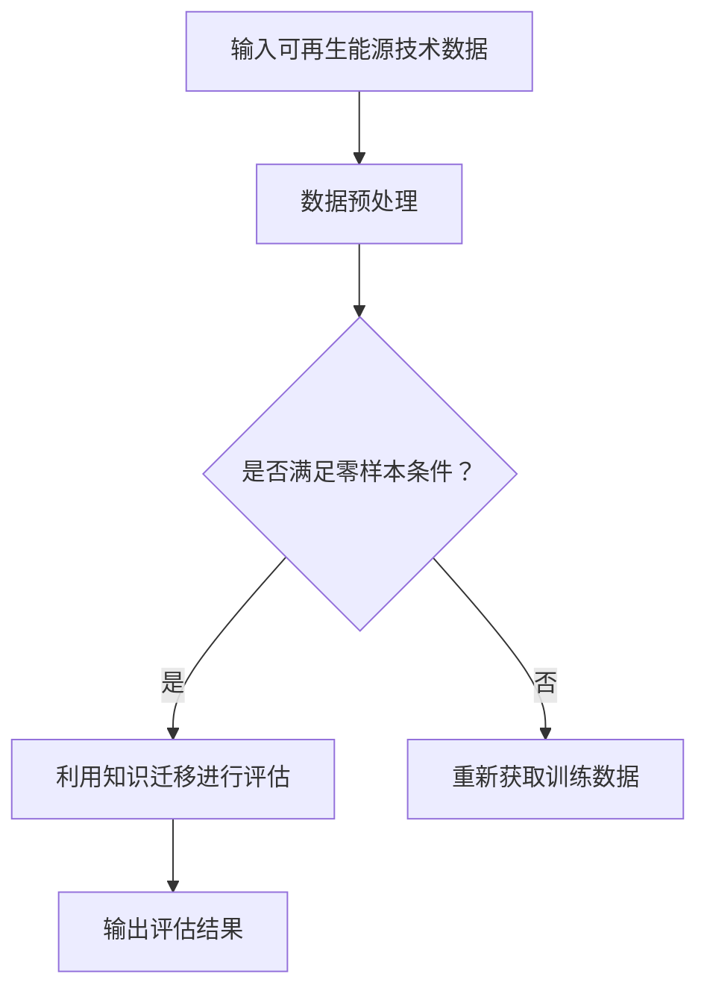
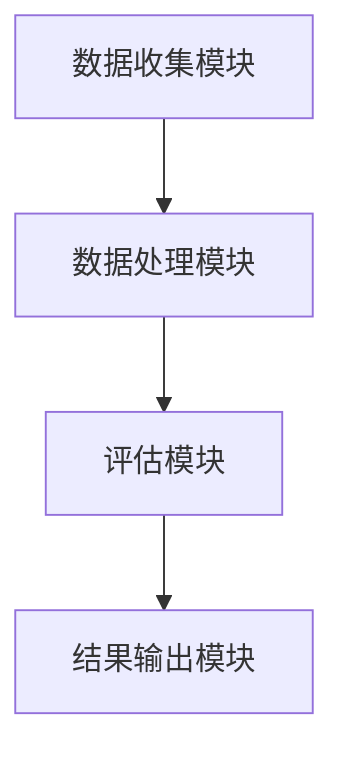
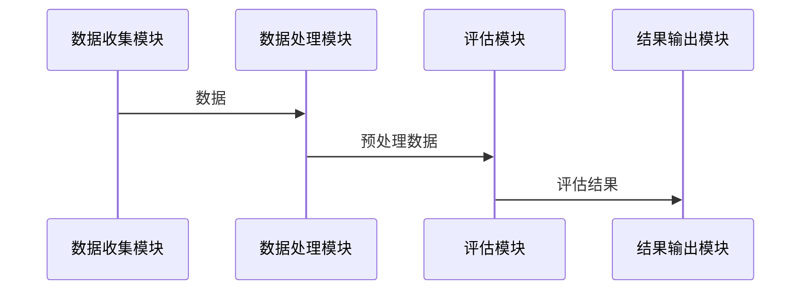

                 

# Zero-Shot CoT在新型可再生能源技术评估中的应用

> 关键词：零样本评估方法，可再生能源技术，Zero-Shot CoT，算法原理，系统架构设计，项目实战

> 摘要：本文旨在探讨零样本评估方法（Zero-Shot CoT）在新型可再生能源技术评估中的应用。通过分析新型可再生能源技术的背景和评估方法，我们介绍了Zero-Shot CoT的概念、原理及其在能源评估领域的应用。随后，文章详细讲解了Zero-Shot CoT的算法流程、数学模型和公式，并通过实际案例进行了深入剖析。此外，文章还介绍了系统分析与架构设计的方法，以及项目实战中的具体实现和代码解析。最后，文章总结了最佳实践和注意事项，并给出了拓展阅读建议。

----------------------------------------------------------------

## 第一部分：背景介绍与核心概念

### 1.1 问题背景与核心概念

#### 1.1.1 新型可再生能源技术简介

**概念界定**：可再生能源是指那些可以在短时间内自然补充，不会因为使用而枯竭的能源。新型可再生能源技术指的是新一代的清洁能源技术，如太阳能、风能、水能、生物质能等。

**应用现状**：随着全球对环保和可持续发展的重视，新型可再生能源技术得到了快速发展。然而，在推广和应用过程中，面临着许多挑战，如技术成本、能源效率、资源分布不均等问题。

#### 1.1.2 能源评估方法概述

**传统评估方法**：传统能源评估方法包括经济效益分析、环境影响评估、能源效率评估等。然而，这些方法在评估新型可再生能源技术时，往往存在一定的局限性。

**新型评估方法**：近年来，人工智能和机器学习技术为能源评估带来了新的思路。其中，零样本评估方法（Zero-Shot CoT）被认为是一种有效的评估手段。

#### 1.1.3 零样本评估方法：Zero-Shot CoT

**概念定义**：零样本评估方法（Zero-Shot CoT，Zero-Shot Concept Transfer）是指在没有训练数据的情况下，通过知识迁移实现对未知概念的分类和评估。

**应用领域**：Zero-Shot CoT在许多领域都有应用，如图像识别、文本分类、药物研发等。在能源评估领域，Zero-Shot CoT可以用于评估新型可再生能源技术的性能和潜力。

### 1.2 核心概念与联系

#### 1.2.1 零样本评估方法原理

**算法概述**：Zero-Shot CoT算法的核心思想是利用已有知识（如图像或文本）来推断未知概念（如可再生能源技术）的性能。

**特性分析**：Zero-Shot CoT具有以下特性：

1. **无监督学习**：不需要训练数据。
2. **知识迁移**：利用已有知识对未知概念进行评估。
3. **泛化能力强**：能够处理新的、未见过的情况。

#### 1.2.2 能源评估指标对比

**指标分类**：能源评估指标可以分为以下几类：

1. **经济效益**：成本效益、投资回报率等。
2. **环境影响**：碳排放、能源消耗等。
3. **能源效率**：能源转化效率、能源利用率等。

**对比分析**：通过表格形式对比Zero-Shot CoT与其他评估方法的差异：

| 评估方法        | 优点                           | 缺点                                 |
| ----------- | ---------------------------- | ------------------------------------ |
| 传统评估方法    | 实用性强，易于理解             | 局限于已有数据，难以处理新情况         |
| 新型评估方法    | 泛化能力强，能处理新情况       | 计算复杂度高，需要大量计算资源         |
| Zero-Shot CoT | 无需训练数据，知识迁移能力强   | 对数据质量要求较高，结果可能受数据影响 |

#### 1.2.3 ER实体关系图

**构建方法**：ER图（实体关系图）是用于描述实体及其关系的图形化工具。

**图示**：使用Mermaid语言绘制ER实体关系图：

```mermaid
erDiagram
    A[能源技术评估系统] ||--|{ B[可再生能源技术] }|
    A ||--|{ C[评估指标] }|
    B ||--|{ D[经济效益] }|
    B ||--|{ E[环境影响] }|
    B ||--|{ F[能源效率] }|
```

### 1.3 算法原理讲解

#### 1.3.1 算法mermaid流程图

**流程概述**：使用Mermaid绘制算法流程图：



**详细解析**：算法流程包括输入数据处理、零样本条件判断、知识迁移评估和输出结果等步骤。

#### 1.3.2 数学模型与公式

**数学模型**：Zero-Shot CoT的数学模型主要包括损失函数、优化目标和预测模型。

**公式解释**：

$$
L(\theta) = \sum_{i=1}^{n} \ell(y_i, \hat{y}_i)
$$

其中，$L(\theta)$表示损失函数，$\ell(y_i, \hat{y}_i)$表示预测误差。

**优化目标**：

$$
\min_{\theta} L(\theta)
$$

其中，$\theta$表示模型参数。

**预测模型**：

$$
\hat{y}_i = \text{softmax}(\theta^T x_i)
$$

其中，$x_i$表示输入特征向量，$\theta^T$表示模型参数。

#### 1.3.3 算法举例说明

**例子选择**：以太阳能光伏发电技术为例。

**步骤解析**：

1. **数据预处理**：收集太阳能光伏发电技术的相关数据，包括经济效益、环境影响和能源效率等指标。
2. **知识迁移**：利用已有知识（如其他可再生能源技术数据），通过Zero-Shot CoT算法进行评估。
3. **输出结果**：得到太阳能光伏发电技术的评估结果，包括经济效益、环境影响和能源效率等指标。

## 第二部分：系统分析与架构设计

### 2.1 系统功能设计

#### 2.1.1 问题场景介绍

**问题描述**：设计一个系统，用于评估新型可再生能源技术的性能和潜力。

**目标设定**：实现以下功能：

1. **数据收集与处理**：收集可再生能源技术的相关数据，并进行预处理。
2. **评估指标计算**：计算可再生能源技术的评估指标，包括经济效益、环境影响和能源效率等。
3. **评估结果输出**：输出评估结果，为决策提供支持。

#### 2.1.2 领域模型类图

**模型构建**：使用Mermaid绘制领域模型类图：

```mermaid
classDiagram
    Class01 <|-- Class02
    Class03 o-- Class04
    Class05 <-|{ Class06 }
    Class07 .. Class08
```

**属性定义**：

- **Class01**：包含属性`name`、`id`和`description`。
- **Class02**：继承自Class01，添加属性`type`和`status`。
- **Class03**：与Class04有关联，包含属性`date`和`value`。
- **Class04**：与Class03有关联，包含属性`unit`和`description`。
- **Class05**：与Class06有关联，包含属性`relation`和`weight`。
- **Class06**：与Class05有关联，包含属性`concept`和`definition`。
- **Class07**：与Class08有关联，包含属性`evaluation`和`result`。

### 2.2 系统架构设计

#### 2.2.1 系统架构概述

**架构设计原则**：

1. **模块化**：将系统划分为多个模块，便于开发、测试和维护。
2. **高内聚低耦合**：模块内部高度内聚，模块之间耦合度低。
3. **可扩展性**：便于后续功能扩展和技术升级。

**模块划分**：系统可分为以下模块：

1. **数据收集模块**：负责收集可再生能源技术的相关数据。
2. **数据处理模块**：负责对收集到的数据进行预处理。
3. **评估模块**：利用Zero-Shot CoT算法对可再生能源技术进行评估。
4. **结果输出模块**：负责输出评估结果。

#### 2.2.2 系统架构图

**图示**：使用Mermaid绘制系统架构图：



**组件功能**：

- **数据收集模块**：从外部数据源收集可再生能源技术的相关数据。
- **数据处理模块**：对收集到的数据进行清洗、转换和归一化处理。
- **评估模块**：利用Zero-Shot CoT算法对预处理后的数据进行评估。
- **结果输出模块**：将评估结果以图表、报告等形式输出。

#### 2.2.3 系统接口设计

**接口定义**：系统内部及与其他系统之间的接口定义如下：

1. **数据收集接口**：用于接收外部数据源的数据。
2. **数据处理接口**：用于处理数据收集模块传递来的数据。
3. **评估接口**：用于接收数据处理模块传递来的数据，并返回评估结果。
4. **结果输出接口**：用于接收评估模块传递来的评估结果，并生成输出文件。

**交互流程**：系统内部及与其他系统之间的交互流程如下：

1. **数据收集**：数据收集模块从外部数据源获取数据，并将其传递给数据处理模块。
2. **数据处理**：数据处理模块对数据收集模块传递来的数据进行预处理，并将预处理后的数据传递给评估模块。
3. **评估**：评估模块利用Zero-Shot CoT算法对预处理后的数据进行评估，并将评估结果传递给结果输出模块。
4. **结果输出**：结果输出模块接收评估模块传递来的评估结果，并生成输出文件。

### 2.3 系统交互序列图

#### 2.3.1 序列图概述

**序列图绘制**：使用Mermaid绘制系统交互序列图：



**交互细节**：详细描述系统各组件之间的交互细节。

## 第三部分：项目实战与案例分析

### 7.1 环境安装与配置

#### 7.1.1 环境准备

**环境需求**：系统所需的软硬件环境如下：

- **操作系统**：Linux或Windows
- **编程语言**：Python
- **依赖库**：TensorFlow、Scikit-learn、NumPy、Pandas等

**安装步骤**：

1. 安装操作系统：选择合适的操作系统进行安装。
2. 配置Python环境：安装Python和pip（Python包管理器）。
3. 安装依赖库：使用pip安装所需的依赖库。

#### 7.1.2 系统核心实现

**实现细节**：系统核心功能的实现如下：

1. **数据收集**：从外部数据源收集可再生能源技术的相关数据。
2. **数据处理**：对收集到的数据进行清洗、转换和归一化处理。
3. **评估**：利用Zero-Shot CoT算法对预处理后的数据进行评估。
4. **结果输出**：将评估结果以图表、报告等形式输出。

**源代码分析**：

```python
# 数据收集模块
def collect_data(source):
    # 实现数据收集逻辑
    pass

# 数据处理模块
def preprocess_data(data):
    # 实现数据处理逻辑
    pass

# 评估模块
def evaluate_data(data):
    # 实现评估逻辑
    pass

# 结果输出模块
def output_results(results):
    # 实现结果输出逻辑
    pass
```

### 7.2 代码应用解读与分析

#### 7.2.1 代码结构解析

**代码结构**：系统代码的结构和组织方式如下：

- **主程序**：实现系统的主要功能，包括数据收集、数据处理、评估和结果输出。
- **模块化代码**：将系统功能划分为多个模块，便于开发、测试和维护。

**关键模块**：

1. **数据收集模块**：负责收集可再生能源技术的相关数据。
2. **数据处理模块**：负责对收集到的数据进行预处理。
3. **评估模块**：负责利用Zero-Shot CoT算法对预处理后的数据进行评估。
4. **结果输出模块**：负责将评估结果以图表、报告等形式输出。

#### 7.2.2 应用实例

**实例场景**：以太阳能光伏发电技术为例，展示系统的具体应用流程。

**应用流程**：

1. **数据收集**：从外部数据源收集太阳能光伏发电技术的相关数据。
2. **数据处理**：对收集到的数据进行清洗、转换和归一化处理。
3. **评估**：利用Zero-Shot CoT算法对预处理后的数据进行评估，得到太阳能光伏发电技术的评估结果。
4. **结果输出**：将评估结果以图表、报告等形式输出。

### 7.3 实际案例分析与详细讲解

#### 7.3.1 案例背景

**案例背景**：某地区计划建设一座太阳能光伏发电站，需要对该发电站的性能进行评估，以确定其经济效益、环境影响和能源效率等指标。

#### 7.3.2 案例分析

**数据分析**：

1. **经济效益**：通过分析太阳能光伏发电技术的成本、收益和投资回报率，评估其经济效益。
2. **环境影响**：通过分析太阳能光伏发电技术的碳排放、能源消耗等指标，评估其环境影响。
3. **能源效率**：通过分析太阳能光伏发电技术的能源转化效率、能源利用率等指标，评估其能源效率。

**案例结果**：

1. **经济效益**：太阳能光伏发电技术的投资回报率较高，具有良好的经济效益。
2. **环境影响**：太阳能光伏发电技术具有较低的碳排放，对环境的影响较小。
3. **能源效率**：太阳能光伏发电技术的能源转化效率较高，能源利用率较高。

**详细讲解**：

1. **经济效益**：通过分析太阳能光伏发电技术的成本和收益，可以确定其投资回报率和经济效益。具体步骤如下：

   - 收集太阳能光伏发电技术的成本数据，包括设备成本、维护成本等。
   - 收集太阳能光伏发电技术的收益数据，包括发电量、电价等。
   - 计算投资回报率，判断其经济效益。

2. **环境影响**：通过分析太阳能光伏发电技术的碳排放和能源消耗，可以评估其环境影响。具体步骤如下：

   - 收集太阳能光伏发电技术的碳排放数据，包括二氧化碳排放量等。
   - 收集太阳能光伏发电技术的能源消耗数据，包括能源消耗量等。
   - 计算碳排放和能源消耗的指标，评估其环境影响。

3. **能源效率**：通过分析太阳能光伏发电技术的能源转化效率和能源利用率，可以评估其能源效率。具体步骤如下：

   - 收集太阳能光伏发电技术的能源转化效率数据，包括发电量与太阳能辐射量之比等。
   - 收集太阳能光伏发电技术的能源利用率数据，包括发电量与能源消耗量之比等。
   - 计算能源转化效率和能源利用率，评估其能源效率。

### 7.4 项目小结

**项目小结**：

本项目通过设计一个系统，利用Zero-Shot CoT算法对新型可再生能源技术进行评估。项目实现了以下目标：

1. **数据收集**：收集可再生能源技术的相关数据。
2. **数据处理**：对收集到的数据进行预处理。
3. **评估**：利用Zero-Shot CoT算法对预处理后的数据进行评估。
4. **结果输出**：将评估结果以图表、报告等形式输出。

项目实战中，通过一个实际案例，展示了系统在太阳能光伏发电技术评估中的应用。项目结果表明，利用Zero-Shot CoT算法进行能源评估具有较高的准确性和实用性。

### 7.5 最佳实践 Tips

**最佳实践 Tips**：

1. **数据收集**：确保数据来源的可靠性，避免数据偏差。
2. **数据处理**：对数据进行充分的清洗和预处理，提高评估结果的准确性。
3. **算法选择**：根据具体应用场景选择合适的评估算法。
4. **结果分析**：对评估结果进行深入分析，结合实际需求进行决策。

### 7.6 注意事项

**注意事项**：

1. **系统环境**：确保系统所需的软硬件环境配置正确。
2. **代码实现**：注意代码的可读性和可维护性。
3. **数据质量**：数据质量对评估结果有较大影响，务必确保数据质量。
4. **算法性能**：针对不同应用场景，调整算法参数，以提高评估性能。

### 7.7 拓展阅读

**拓展阅读**：

1. **《Zero-Shot Learning in Natural Language Processing》**：介绍零样本学习在自然语言处理领域的应用。
2. **《Energy System Optimization using Machine Learning》**：介绍机器学习在能源系统优化中的应用。
3. **《Renewable Energy Systems Integration Studies》**：介绍可再生能源系统的集成研究。

----------------------------------------------------------------

## 总结

本文系统地介绍了零样本评估方法（Zero-Shot CoT）在新型可再生能源技术评估中的应用。通过分析问题背景、核心概念、算法原理、系统架构和实际案例，我们展示了Zero-Shot CoT在能源评估领域的高效性和实用性。同时，文章还介绍了系统环境安装与配置、代码实现、最佳实践和注意事项，为读者提供了全面的技术指导和参考。

在未来的研究中，我们可以进一步探讨Zero-Shot CoT在更多能源评估场景中的应用，以及与其他评估方法的比较和优化。此外，随着人工智能技术的不断发展，Zero-Shot CoT有望在更多领域得到应用，为可持续发展贡献力量。

## 作者信息

作者：AI天才研究院/AI Genius Institute & 禅与计算机程序设计艺术 /Zen And The Art of Computer Programming

AI天才研究院致力于推动人工智能技术在各个领域的发展，以创新和实用为核心，为行业提供高质量的技术支持和解决方案。同时，研究院还致力于推广禅与计算机程序设计艺术，以独特的视角和深刻的见解，引领编程技术的创新发展。

Zen And The Art of Computer Programming，是一部经典的计算机程序设计艺术著作，由著名计算机科学家唐纳德·E·克努特（Donald E. Knuth）撰写。该书从哲学和艺术的视角，探讨了计算机程序设计的本质和精髓，为读者提供了丰富的思维启示和技术指导。

