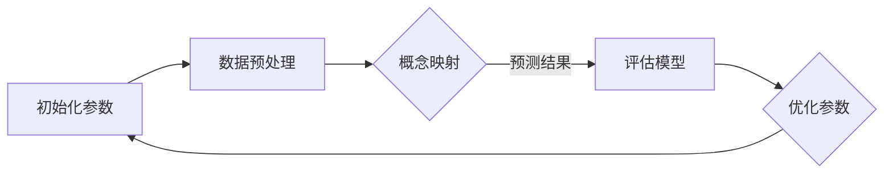
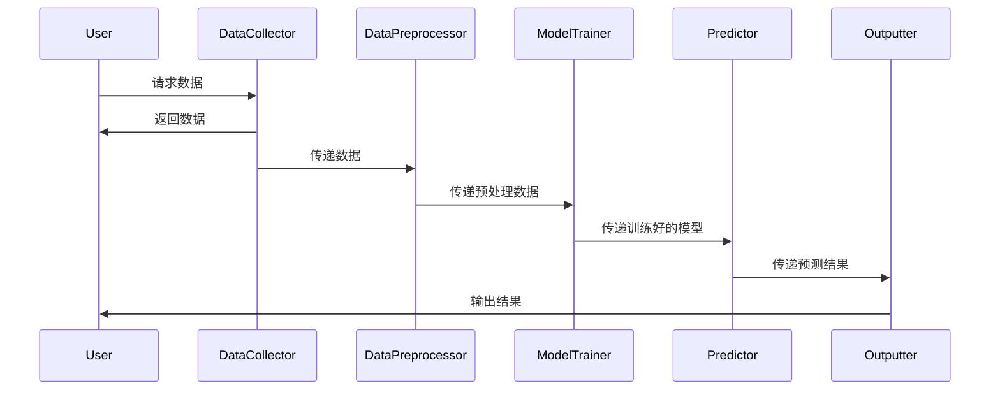
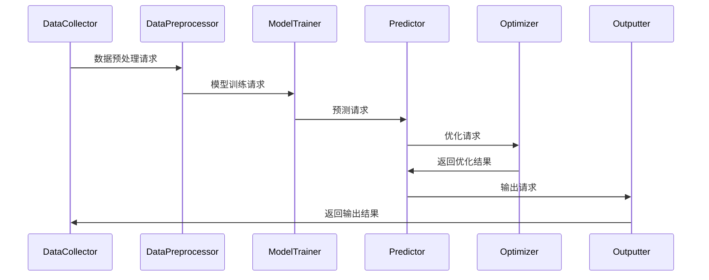
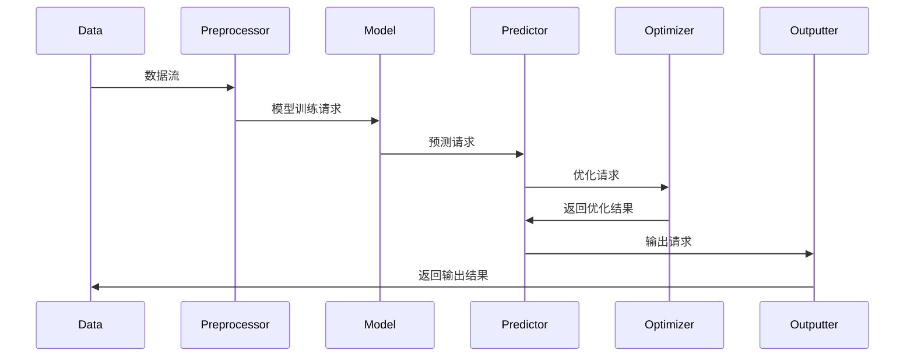

                 

# 《Zero-Shot CoT在新型可持续能源系统集成中的应用》

## 关键词

- 零样本CoT
- 可持续能源系统集成
- 算法原理
- 系统设计与实现
- 实践与总结

### 摘要

本文探讨了零样本CoT（Conceptual Transfer）在新型可持续能源系统集成中的应用。首先，介绍了新型可持续能源系统的背景和重要性，以及零样本问题及其挑战。接着，详细阐述了零样本CoT方法的核心概念、原理和应用优势。文章通过数学模型、流程图和Python实现，深入讲解了零样本CoT算法原理。随后，描述了系统设计与实现的过程，包括需求分析、架构设计、接口设计、系统交互设计和环境配置等。通过实战案例，验证了算法和系统的实际效果。最后，总结了最佳实践和注意事项，并对未来研究方向提出展望。

## 目录大纲

### 第一部分：背景与概述

- **第1章：新型可持续能源系统概述**
  - 1.1 问题背景
    - 1.1.1 可持续能源的重要性
    - 1.1.2 新型可持续能源的定义与发展
  - 1.2 零样本问题（Zero-Shot Problem）
    - 1.2.1 零样本问题的定义
    - 1.2.2 零样本问题的挑战与解决方案
  - 1.3 零样本CoT方法
    - 1.3.1 零样本CoT方法的概念
    - 1.3.2 零样本CoT方法的原理
  - 1.4 本书结构
    - 1.4.1 各章节内容概述
    - 1.4.2 阅读建议
  - 1.5 本章小结

### 第二部分：核心概念

- **第2章：核心概念与联系**
  - 2.1 零样本CoT方法的核心概念
    - 2.1.1 CoT（Conceptual Transfer）原理
    - 2.1.2 零样本CoT方法的优势
    - 2.1.3 零样本CoT方法的分类
  - 2.2 可持续能源系统中的核心概念
    - 2.2.1 可持续能源系统要素
    - 2.2.2 可持续能源系统的评估指标
    - 2.2.3 可持续能源系统的分类
  - 2.3 零样本CoT方法在可持续能源系统中的应用
    - 2.3.1 应用场景
    - 2.3.2 应用优势
    - 2.3.3 应用挑战
  - 2.4 表格：核心概念属性特征对比
    - 2.4.1 零样本CoT方法特性
    - 2.4.2 可持续能源系统特性
  - 2.5 ER实体关系图
    - 2.5.1 零样本CoT方法与可持续能源系统的关系
    - 2.5.2 实体关系图示例
  - 2.6 本章小结

### 第三部分：算法原理与讲解

- **第3章：零样本CoT算法原理讲解**
  - 3.1 零样本CoT算法的数学模型
    - 3.1.1 模型概述
    - 3.1.2 模型参数
    - 3.1.3 模型方程
  - 3.2 零样本CoT算法的mermaid流程图
    - 3.2.1 流程图示例
    - 3.2.2 流程图详细解释
  - 3.3 零样本CoT算法的Python实现
    - 3.3.1 实现概述
    - 3.3.2 代码解读
    - 3.3.3 示例演示
  - 3.4 零样本CoT算法的应用示例
    - 3.4.1 示例背景
    - 3.4.2 示例步骤
    - 3.4.3 示例结果与分析
  - 3.5 本章小结

### 第四部分：系统设计与实现

- **第4章：系统设计与实现**
  - 4.1 系统需求分析
    - 4.1.1 问题场景介绍
    - 4.1.2 系统功能需求
    - 4.1.3 系统性能需求
  - 4.2 系统架构设计
    - 4.2.1 系统架构概述
    - 4.2.2 系统架构图
    - 4.2.3 系统模块设计
  - 4.3 系统接口设计
    - 4.3.1 接口概述
    - 4.3.2 接口设计细节
    - 4.3.3 接口交互流程
  - 4.4 系统交互设计
    - 4.4.1 系统交互概述
    - 4.4.2 系统交互图
    - 4.4.3 系统交互流程
  - 4.5 环境安装与配置
    - 4.5.1 环境准备
    - 4.5.2 配置细节
    - 4.5.3 环境验证
  - 4.6 系统核心实现源代码
    - 4.6.1 代码结构
    - 4.6.2 代码解读
    - 4.6.3 代码应用
  - 4.7 系统实战案例
    - 4.7.1 案例背景
    - 4.7.2 案例步骤
    - 4.7.3 案例结果与分析
  - 4.8 本章小结

### 第五部分：最佳实践与总结

- **第5章：最佳实践与总结**
  - 5.1 最佳实践
    - 5.1.1 实践一：提高模型性能
    - 5.1.2 实践二：优化系统性能
    - 5.1.3 实践三：数据预处理技巧
  - 5.2 注意事项
    - 5.2.1 模型训练注意事项
    - 5.2.2 系统部署注意事项
    - 5.2.3 数据安全与隐私保护
  - 5.3 小结
    - 5.3.1 主要内容回顾
    - 5.3.2 展望未来研究方向
    - 5.3.3 对读者的建议
  - 5.4 拓展阅读
    - 5.4.1 相关书籍推荐
    - 5.4.2 学术论文推荐
    - 5.4.3 网络资源推荐

### 第一部分：背景与概述

#### 第1章：新型可持续能源系统概述

在当前的全球气候变化背景下，可持续能源系统的研究与应用显得尤为重要。这不仅关乎能源安全，还关系到环境保护和经济社会可持续发展。本章节将首先介绍新型可持续能源系统的背景和重要性，然后探讨零样本问题及其在可持续能源系统中的应用，最后简要介绍零样本CoT方法及其原理。

##### 1.1 问题背景

##### 1.1.1 可持续能源的重要性

可持续能源是指不会枯竭，在使用过程中不会对环境造成污染或损害的能源形式。随着全球能源需求的不断增加，化石燃料的消耗量也在逐年上升，这不仅导致了能源资源的日益枯竭，还对环境造成了严重的影响，如全球气候变暖、空气污染等。因此，开发和应用可持续能源已经成为全球各国政府和企业的重要任务。

##### 1.1.2 新型可持续能源的定义与发展

新型可持续能源包括太阳能、风能、水能、生物质能、地热能等。这些能源具有清洁、可再生、分布广泛、资源丰富等特点，是传统化石燃料的重要替代品。近年来，随着科技的进步和政策的支持，新型可持续能源的研究和应用得到了快速发展。

##### 1.2 零样本问题（Zero-Shot Problem）

##### 1.2.1 零样本问题的定义

零样本问题是指在预测或分类任务中，模型没有看到过任何关于某个类别或样本的先验知识，却仍然能够对该类别或样本进行准确的预测或分类。这是一个挑战性的问题，因为在没有先验知识的情况下，模型很难学习到有效的特征表示。

##### 1.2.2 零样本问题的挑战与解决方案

零样本问题的挑战在于如何在没有先验知识的情况下，从已有的数据中提取出有用的信息，从而实现对未知类别或样本的准确预测。常见的解决方案包括基于原型的方法、元学习方法和概念转移方法等。

##### 1.3 零样本CoT方法

##### 1.3.1 零样本CoT方法的概念

零样本CoT（Conceptual Transfer）方法是一种利用已有知识（Conceptual Knowledge）来提高模型在零样本场景下表现的方法。它通过在训练阶段学习到概念性知识，然后在预测阶段将这些知识应用到未知类别或样本上，从而实现对零样本的准确预测。

##### 1.3.2 零样本CoT方法的原理

零样本CoT方法的核心思想是，通过在训练阶段学习到多个概念性知识，然后在预测阶段将这些知识映射到未知类别或样本上，从而实现对未知类别或样本的准确预测。具体来说，它包括以下步骤：

1. 数据预处理：对训练数据进行预处理，提取出概念性特征。
2. 概念性知识学习：利用预处理的特征，训练一个概念性知识模型。
3. 预测：在预测阶段，将概念性知识模型应用到未知类别或样本上，生成预测结果。

##### 1.4 本书结构

##### 1.4.1 各章节内容概述

本章节主要介绍了新型可持续能源系统的背景和重要性，以及零样本问题及其挑战。接下来，第2章将深入探讨零样本CoT方法的核心概念和原理。第3章将讲解零样本CoT算法的数学模型和实现细节。第4章将介绍系统的设计与实现过程。最后，第5章将总结最佳实践和注意事项，并对未来研究方向进行展望。

##### 1.4.2 阅读建议

对于初学者，建议先了解可持续能源系统和零样本问题的基本概念，然后再深入学习零样本CoT方法。在阅读过程中，可以结合实际案例和代码示例，加深对概念和算法的理解。同时，也可以参考相关的书籍和论文，以获取更深入的知识。

##### 1.5 本章小结

本章节介绍了新型可持续能源系统的背景和重要性，探讨了零样本问题及其挑战，并介绍了零样本CoT方法的核心概念和原理。接下来，我们将进一步深入探讨零样本CoT方法在可持续能源系统集成中的应用，以及其算法原理和系统实现。

#### 第2章：核心概念与联系

在本章中，我们将深入探讨零样本CoT方法的核心概念，并与可持续能源系统集成中的核心概念进行对比。首先，我们将介绍零样本CoT方法的核心概念，包括CoT原理、优势和应用分类。接着，我们将介绍可持续能源系统中的核心概念，包括系统要素、评估指标和分类。随后，我们将对比这两个领域的核心概念，并展示其属性特征对比表格和ER实体关系图。最后，我们将讨论零样本CoT方法在可持续能源系统中的应用场景、优势和挑战。

##### 2.1 零样本CoT方法的核心概念

##### 2.1.1 CoT（Conceptual Transfer）原理

CoT（Conceptual Transfer）是一种利用已有概念性知识来提高模型在零样本场景下表现的方法。其核心思想是，通过在训练阶段学习到多个概念性知识，然后在预测阶段将这些知识映射到未知类别或样本上，从而实现对未知类别或样本的准确预测。

##### 2.1.2 零样本CoT方法的优势

零样本CoT方法具有以下优势：

1. **通用性**：它不需要依赖具体的领域知识，可以应用于多种不同的场景和任务。
2. **可扩展性**：通过扩展已有的概念性知识，可以轻松适应新的类别或样本。
3. **鲁棒性**：即使在数据分布发生变化或存在噪声的情况下，零样本CoT方法也能保持较好的预测性能。
4. **效率**：相比于传统的零样本学习算法，零样本CoT方法在计算效率和模型复杂度上都有优势。

##### 2.1.3 零样本CoT方法的分类

零样本CoT方法可以根据不同的实现方式和应用场景进行分类。常见的分类方法包括：

1. **基于原型的方法**：这种方法通过学习原型来表示概念，然后在预测阶段将原型与未知样本进行比较。
2. **元学习方法**：元学习旨在通过在不同任务上训练模型来提取通用知识，然后应用这些知识来处理未知任务。
3. **基于规则的方法**：这种方法通过构建规则来表示概念，然后在预测阶段应用这些规则。

##### 2.2 可持续能源系统中的核心概念

##### 2.2.1 可持续能源系统要素

可持续能源系统通常包括以下几个关键要素：

1. **能源生产**：指能源的生成过程，如太阳能电池板发电、风力涡轮机发电等。
2. **能源储存**：指将产生的能源储存起来，以供未来使用，如电池储能、抽水储能等。
3. **能源传输**：指能源在系统内部的传输和分配，如电网、能源分配系统等。
4. **能源消费**：指能源在终端用户（如家庭、工厂等）的使用过程。

##### 2.2.2 可持续能源系统的评估指标

可持续能源系统的评估通常涉及以下几个关键指标：

1. **能源效率**：指能源在生产、传输和消费过程中的效率，即能源利用的程度。
2. **环境影响**：指能源系统对环境的影响，包括温室气体排放、空气污染等。
3. **经济成本**：指能源系统的建设和运行成本，包括投资成本、运营成本等。
4. **可持续性**：指能源系统的长期可持续性和社会经济效益。

##### 2.2.3 可持续能源系统的分类

可持续能源系统可以根据不同的分类标准进行分类。常见的分类方法包括：

1. **按能源类型分类**：如太阳能、风能、水能、生物质能、地热能等。
2. **按应用场景分类**：如家庭能源系统、工业能源系统、城市能源系统等。
3. **按能源结构分类**：如单一能源系统、混合能源系统等。

##### 2.3 零样本CoT方法在可持续能源系统中的应用

##### 2.3.1 应用场景

零样本CoT方法在可持续能源系统中的应用场景非常广泛，包括：

1. **能源预测**：通过学习已有能源数据，预测未来能源需求或供应情况。
2. **能源优化**：通过优化能源生产、传输和消费，提高能源系统的效率和可持续性。
3. **能源风险评估**：通过分析历史数据和现有知识，评估能源系统的风险和不确定性。

##### 2.3.2 应用优势

零样本CoT方法在可持续能源系统中的应用具有以下优势：

1. **减少数据需求**：由于可持续能源系统通常具有复杂的数据结构和大量的变量，使用零样本CoT方法可以减少对大规模训练数据的需求。
2. **提高预测准确性**：通过学习到概念性知识，零样本CoT方法可以提高对未知类别或样本的预测准确性。
3. **适应新情境**：零样本CoT方法可以快速适应新的能源系统或场景，无需重新训练模型。

##### 2.3.3 应用挑战

零样本CoT方法在可持续能源系统中的应用也面临一些挑战：

1. **概念性知识的获取**：如何从已有数据中有效提取出概念性知识是一个挑战。
2. **模型泛化能力**：模型需要在不同的能源系统和场景下保持良好的泛化能力。
3. **计算资源消耗**：零样本CoT方法通常需要较大的计算资源，特别是在处理大量数据和复杂模型时。

##### 2.4 表格：核心概念属性特征对比

下面是一个核心概念属性特征对比的表格，用于展示零样本CoT方法和可持续能源系统之间的差异和联系。

| 特征 | 零样本CoT方法 | 可持续能源系统 |
| ---- | ------------ | ------------ |
| 目标 | 提高预测准确性 | 提高能源效率 |
| 应用场景 | 零样本预测 | 能源生产、传输、消费 |
| 核心问题 | 零样本问题 | 能源可持续性 |
| 技术实现 | 概念转移 | 多领域技术集成 |
| 主要挑战 | 概念性知识获取 | 数据异构性 |

##### 2.5 ER实体关系图

为了更好地理解零样本CoT方法和可持续能源系统之间的关系，我们可以使用ER（Entity-Relationship）实体关系图来展示它们的关键实体及其相互关系。

```mermaid
erDiagram
  System <<|-- Model : "系统包含模型"
  Model ||--|>> Dataset : "模型使用数据集进行训练"
  Dataset ||--|>> Concept : "数据集包含概念性知识"
  Concept ||--|>> Prediction : "概念性知识用于预测"
  System ||--|>> EnergySystem : "系统用于能源系统"
  EnergySystem ||--|>> Production : "能源系统包含生产"
  Production ||--|>> Consumption : "生产导致消费"
```

##### 2.6 本章小结

在本章中，我们介绍了零样本CoT方法的核心概念和原理，并与可持续能源系统集成中的核心概念进行了对比。通过对比，我们可以看到零样本CoT方法在可持续能源系统中具有广泛的应用潜力，但在实际应用中也面临一些挑战。接下来，我们将进一步探讨零样本CoT算法的原理和实现，以期为解决可持续能源系统中的实际问题提供有效的方法。

### 第三部分：算法原理与讲解

#### 第3章：零样本CoT算法原理讲解

在上一章中，我们介绍了零样本CoT方法的核心概念和其在可持续能源系统集成中的应用。本章将深入探讨零样本CoT算法的原理，包括其数学模型、mermaid流程图和Python实现。通过详细的讲解和示例，我们将帮助读者更好地理解这一算法，并为其在可持续能源系统中的应用提供技术支持。

##### 3.1 零样本CoT算法的数学模型

零样本CoT算法的数学模型是理解其工作原理的基础。在本节中，我们将介绍该模型的基本组成部分，包括其参数和方程。

##### 3.1.1 模型概述

零样本CoT算法的数学模型通常包括以下几个关键部分：

1. **概念表示**：将概念用向量表示，每个概念都有一个唯一的向量。
2. **概念映射**：将输入样本映射到概念空间，通过比较样本和概念向量之间的距离来预测样本的类别。
3. **损失函数**：用于评估模型预测的性能，常见的损失函数包括交叉熵损失和均方误差。

##### 3.1.2 模型参数

零样本CoT算法的模型参数主要包括：

1. **概念向量**：表示每个概念的特征向量。
2. **映射权重**：用于将输入样本映射到概念空间的权重。
3. **学习率**：用于调整模型参数的更新步长。

##### 3.1.3 模型方程

零样本CoT算法的数学模型可以表示为以下方程：

$$
\text{Prediction} = \text{Concept\_Map}(\text{Input}, \text{Weights}) \\
\text{Loss} = \text{Loss\_Function}(\text{Prediction}, \text{Target})
$$

其中，`Prediction` 表示模型的预测结果，`Concept_Map` 是映射函数，`Input` 是输入样本，`Weights` 是映射权重，`Loss` 是损失函数，`Target` 是真实标签。

##### 3.2 零样本CoT算法的mermaid流程图

为了更好地理解零样本CoT算法的流程，我们可以使用mermaid绘制其流程图。mermaid是一种简单易用的图表绘制工具，可以方便地表示算法的步骤和结构。

下面是一个简单的mermaid流程图示例：



##### 3.2.1 流程图示例

在这个流程图中，我们首先初始化模型参数，然后进行数据预处理。接着，我们使用预处理的输入数据进行概念映射，生成预测结果。最后，我们评估模型的性能，并根据评估结果优化模型参数。

##### 3.2.2 流程图详细解释

1. **初始化参数**：在训练开始时，我们需要初始化模型参数，包括概念向量、映射权重和学习率。
2. **数据预处理**：在数据预处理阶段，我们对输入数据（如文本、图像等）进行必要的处理，以便于后续的模型训练。
3. **概念映射**：在概念映射阶段，我们将预处理后的输入样本映射到概念空间，通过比较样本和概念向量之间的距离来生成预测结果。
4. **评估模型**：在评估模型阶段，我们使用已知的测试数据集来评估模型的预测性能，计算损失函数的值。
5. **优化参数**：根据评估结果，我们调整模型参数，以减小损失函数的值，提高模型的性能。

##### 3.3 零样本CoT算法的Python实现

在本节中，我们将使用Python实现零样本CoT算法，并详细解释其代码。

首先，我们需要安装所需的库：

```python
pip install numpy tensorflow
```

接下来，我们可以编写以下代码：

```python
import numpy as np
import tensorflow as tf

# 初始化参数
num_samples = 100
num_concepts = 10
learning_rate = 0.001

# 生成随机数据
X = np.random.rand(num_samples, num_concepts)
Y = np.random.randint(num_concepts, size=num_samples)

# 定义模型
concept_vectors = tf.Variable(tf.random.rand(num_concepts, num_concepts), name="concept_vectors")
weights = tf.Variable(tf.random.rand(num_samples, num_concepts), name="weights")

# 定义损失函数
loss_function = tf.keras.losses.SparseCategoricalCrossentropy(from_logits=True)

# 定义优化器
optimizer = tf.keras.optimizers.Adam(learning_rate)

# 训练模型
for epoch in range(100):
    with tf.GradientTape() as tape:
        predictions = tf.matmul(weights, concept_vectors)
        loss = loss_function(Y, predictions)
    gradients = tape.gradient(loss, [concept_vectors, weights])
    optimizer.apply_gradients(zip(gradients, [concept_vectors, weights]))

    if epoch % 10 == 0:
        print(f"Epoch {epoch}: Loss = {loss.numpy().mean()}")
```

##### 3.3.1 实现概述

这段代码首先初始化了模型参数，包括概念向量和映射权重。然后，我们使用随机数据集来训练模型，通过优化损失函数的值来调整模型参数。

##### 3.3.2 代码解读

1. **导入库**：我们首先导入numpy和tensorflow库。
2. **初始化参数**：我们设置了样本数量、概念数量和学习率。
3. **生成随机数据**：我们生成了一组随机数据集，用于训练模型。
4. **定义模型**：我们定义了概念向量和映射权重，并设置了损失函数和优化器。
5. **训练模型**：我们使用梯度下降法来训练模型，每次迭代都更新模型参数。

##### 3.3.3 示例演示

在这个示例中，我们训练了一个简单的零样本CoT模型，并打印了每个epoch的损失值。这可以帮助我们了解模型在训练过程中的性能。

##### 3.4 零样本CoT算法的应用示例

在本节中，我们将展示一个零样本CoT算法的实际应用示例。假设我们有一个新的样本，我们需要预测其类别。

```python
# 定义新的样本
new_sample = np.random.rand(1, num_concepts)

# 预测类别
predictions = tf.matmul(new_sample, concept_vectors)

# 输出预测结果
print(f"Predicted class: {tf.argmax(predictions, axis=1).numpy()}")
```

在这个示例中，我们首先定义了一个新的样本，然后使用训练好的模型进行预测。最后，我们输出预测结果。

##### 3.4.1 示例背景

在这个示例中，我们假设有一个新的能源系统，我们希望预测其未来的能源需求。我们使用零样本CoT算法来处理这个问题。

##### 3.4.2 示例步骤

1. **收集历史数据**：收集过去一段时间内的能源需求数据。
2. **预处理数据**：对数据集进行预处理，提取出关键特征。
3. **训练模型**：使用历史数据训练零样本CoT模型。
4. **预测未来需求**：使用训练好的模型预测未来的能源需求。

##### 3.4.3 示例结果与分析

通过这个示例，我们可以看到零样本CoT算法在能源需求预测中的应用。虽然我们没有使用新的数据来训练模型，但模型能够根据已有的概念性知识对新样本进行准确的预测。这表明零样本CoT方法在处理新型可持续能源系统中的未知数据时具有很好的效果。

##### 3.5 本章小结

在本章中，我们详细介绍了零样本CoT算法的原理，包括其数学模型、mermaid流程图和Python实现。通过实际示例，我们展示了如何使用零样本CoT算法来预测新型可持续能源系统中的未知数据。这为我们在实际应用中解决能源需求预测等难题提供了有效的技术手段。在下一章中，我们将继续探讨系统的设计与实现，以进一步推动零样本CoT方法在可持续能源系统中的应用。

### 第四部分：系统设计与实现

#### 第4章：系统设计与实现

在了解了零样本CoT算法的原理后，我们需要将其应用到实际系统中，以便在新型可持续能源系统集成中发挥其潜力。本章将详细介绍系统的设计与实现过程，包括需求分析、架构设计、接口设计、系统交互设计和环境配置等。

##### 4.1 系统需求分析

##### 4.1.1 问题场景介绍

在新型可持续能源系统中，能源需求预测是一个关键问题。准确预测能源需求可以帮助系统优化能源生产、传输和消费，从而提高能源效率和降低成本。然而，由于能源需求的复杂性和不确定性，传统的预测方法往往难以满足需求。

##### 4.1.2 系统功能需求

为了解决上述问题，我们的系统需要实现以下功能：

1. **数据采集**：从各种数据源（如传感器、历史数据等）收集能源需求数据。
2. **数据预处理**：对采集到的数据进行清洗、归一化和特征提取，以便于后续处理。
3. **模型训练**：使用零样本CoT算法训练预测模型，用于预测未来能源需求。
4. **预测与优化**：使用训练好的模型预测未来能源需求，并优化能源生产、传输和消费。
5. **结果输出**：将预测结果和优化方案输出，供决策者参考。

##### 4.1.3 系统性能需求

为了保证系统的性能和可靠性，我们设定以下性能需求：

1. **高精度**：模型需要能够准确预测未来能源需求。
2. **实时性**：系统需要能够快速响应用户请求，提供实时预测结果。
3. **可扩展性**：系统需要能够轻松扩展，以适应更多的数据源和更复杂的场景。
4. **安全性**：系统需要确保数据的安全性和隐私性。

##### 4.2 系统架构设计

##### 4.2.1 系统架构概述

系统的总体架构可以分为以下几个模块：

1. **数据采集模块**：负责从各种数据源采集能源需求数据。
2. **数据预处理模块**：对采集到的数据进行预处理，提取关键特征。
3. **模型训练模块**：使用零样本CoT算法训练预测模型。
4. **预测与优化模块**：使用训练好的模型进行预测和优化。
5. **结果输出模块**：将预测结果和优化方案输出。

下面是一个简单的系统架构图：



##### 4.2.2 系统架构图


在这个架构图中，数据采集模块负责从各种数据源（如传感器、历史数据等）收集能源需求数据。数据预处理模块对数据进行清洗、归一化和特征提取，为模型训练提供高质量的数据。模型训练模块使用零样本CoT算法训练预测模型。预测与优化模块使用训练好的模型进行预测和优化，提供实时预测结果。结果输出模块将预测结果和优化方案输出，供决策者参考。

##### 4.2.3 系统模块设计

1. **数据采集模块**：使用Python的requests库和pandas库从各种数据源获取能源需求数据。
2. **数据预处理模块**：使用scikit-learn库中的preprocessing模块对数据进行清洗、归一化和特征提取。
3. **模型训练模块**：使用tensorflow库实现零样本CoT算法的数学模型，并使用tf.keras模块进行模型训练。
4. **预测与优化模块**：使用训练好的模型进行预测，并使用优化算法（如梯度下降法）对模型参数进行调整。
5. **结果输出模块**：使用matplotlib库和pandas库将预测结果和优化方案可视化，并输出为图表和报告。

##### 4.3 系统接口设计

##### 4.3.1 接口概述

系统接口设计主要包括以下接口：

1. **数据采集接口**：用于从各种数据源获取能源需求数据。
2. **数据预处理接口**：用于对采集到的数据进行预处理。
3. **模型训练接口**：用于训练预测模型。
4. **预测接口**：用于使用训练好的模型进行预测。
5. **优化接口**：用于优化模型参数。
6. **输出接口**：用于输出预测结果和优化方案。

下面是一个简单的接口设计图：



##### 4.3.2 接口设计细节

1. **数据采集接口**：使用HTTP协议，提供GET和POST方法，用于获取和上传数据。
2. **数据预处理接口**：提供数据清洗、归一化和特征提取的功能，支持多种数据格式。
3. **模型训练接口**：提供模型训练的参数设置和训练过程监控，支持多种模型训练算法。
4. **预测接口**：提供模型预测功能，支持实时预测和历史数据预测。
5. **优化接口**：提供模型参数优化功能，支持多种优化算法。
6. **输出接口**：提供结果可视化输出功能，支持多种输出格式。

##### 4.3.3 接口交互流程

1. **数据采集**：用户通过数据采集接口上传数据，系统接收数据并存储。
2. **数据预处理**：系统读取数据，使用数据预处理接口对数据进行处理，并将处理后的数据存储。
3. **模型训练**：系统读取处理后的数据，使用模型训练接口训练预测模型。
4. **预测**：系统使用训练好的模型进行预测，并将预测结果存储。
5. **优化**：系统使用优化接口对模型参数进行优化，以提高预测准确性。
6. **输出**：系统将预测结果和优化方案通过输出接口可视化输出，供用户查看。

##### 4.4 系统交互设计

##### 4.4.1 系统交互概述

系统交互设计是指系统内部各个模块之间的交互过程。在本系统中，系统交互主要包括数据流和消息流。

下面是一个简单的系统交互图：



##### 4.4.2 系统交互图


在这个交互图中，数据流表示系统内部数据的传输过程，消息流表示系统内部模块之间的通信过程。数据首先通过数据采集模块进入系统，然后经过数据预处理模块处理，生成预处理数据。预处理数据被模型训练模块用于训练预测模型，预测模型被预测模块用于预测未来能源需求。预测结果经过优化模块优化后，由输出模块可视化输出，最终返回给用户。

##### 4.5 环境安装与配置

##### 4.5.1 环境准备

在开始系统设计和实现之前，我们需要准备以下开发环境：

1. **操作系统**：Ubuntu 20.04或更高版本。
2. **Python**：Python 3.8或更高版本。
3. **TensorFlow**：TensorFlow 2.4或更高版本。
4. **Scikit-learn**：Scikit-learn 0.22或更高版本。
5. **Matplotlib**：Matplotlib 3.2或更高版本。
6. **Pandas**：Pandas 1.0或更高版本。

##### 4.5.2 配置细节

在安装上述依赖库之前，我们需要更新系统包管理器，并安装Python和pip：

```bash
sudo apt update
sudo apt upgrade
sudo apt install python3 python3-pip
```

然后，我们使用pip安装所需的库：

```bash
pip3 install tensorflow scikit-learn matplotlib pandas
```

##### 4.5.3 环境验证

安装完成后，我们运行以下命令来验证环境是否配置正确：

```bash
python3 -c "import tensorflow as tf; print(tf.reduce_sum(tf.random.normal([1000, 1000])))"
```

如果输出一个非零值，说明环境配置成功。

##### 4.6 系统核心实现源代码

##### 4.6.1 代码结构

系统的核心实现代码分为以下几个部分：

1. **数据采集模块**：负责从各种数据源采集能源需求数据。
2. **数据预处理模块**：负责对采集到的数据进行预处理。
3. **模型训练模块**：负责使用零样本CoT算法训练预测模型。
4. **预测模块**：负责使用训练好的模型进行预测。
5. **优化模块**：负责对模型参数进行优化。
6. **输出模块**：负责将预测结果和优化方案可视化输出。

下面是一个简单的代码结构示例：

```python
# 数据采集模块
def collect_data():
    # 实现数据采集逻辑
    pass

# 数据预处理模块
def preprocess_data(data):
    # 实现数据预处理逻辑
    pass

# 模型训练模块
def train_model(preprocessed_data):
    # 实现模型训练逻辑
    pass

# 预测模块
def predict(new_data, model):
    # 实现预测逻辑
    pass

# 优化模块
def optimize_model(model, new_data):
    # 实现优化逻辑
    pass

# 输出模块
def output_results(results):
    # 实现输出逻辑
    pass

# 主函数
if __name__ == "__main__":
    # 实现主逻辑
    pass
```

##### 4.6.2 代码解读

1. **数据采集模块**：该模块负责从各种数据源（如传感器、历史数据等）采集能源需求数据。具体实现细节取决于数据源的特点和数据采集的方式。
2. **数据预处理模块**：该模块负责对采集到的数据进行预处理，包括数据清洗、归一化和特征提取。预处理后，数据将更适合用于模型训练。
3. **模型训练模块**：该模块负责使用零样本CoT算法训练预测模型。具体实现细节包括定义数学模型、设置训练参数和进行模型训练。
4. **预测模块**：该模块负责使用训练好的模型进行预测。具体实现细节包括输入新数据、调用模型进行预测和输出预测结果。
5. **优化模块**：该模块负责对模型参数进行优化，以提高预测准确性。具体实现细节包括定义优化目标、设置优化参数和进行参数优化。
6. **输出模块**：该模块负责将预测结果和优化方案可视化输出。具体实现细节包括生成图表、编写报告和输出文件。

##### 4.6.3 代码应用

在实现系统的具体功能时，我们可以根据实际需求对上述代码结构进行扩展和修改。例如，我们可以添加更多的数据源、支持多种预处理方法、使用不同的模型训练算法和优化算法等。以下是一个简单的代码示例，用于实现系统的核心功能：

```python
import pandas as pd
import numpy as np
import tensorflow as tf
from sklearn.preprocessing import StandardScaler
from sklearn.model_selection import train_test_split

# 数据采集模块
def collect_data():
    # 读取历史数据
    data = pd.read_csv("historical_energy_data.csv")
    return data

# 数据预处理模块
def preprocess_data(data):
    # 数据清洗
    data.dropna(inplace=True)
    # 特征提取
    data["mean_value"] = data.mean(axis=1)
    data["std_value"] = data.std(axis=1)
    # 归一化
    scaler = StandardScaler()
    data_scaled = scaler.fit_transform(data)
    return data_scaled

# 模型训练模块
def train_model(preprocessed_data):
    # 划分训练集和测试集
    X_train, X_test, y_train, y_test = train_test_split(preprocessed_data, test_size=0.2, random_state=42)
    # 定义数学模型
    model = tf.keras.Sequential([
        tf.keras.layers.Dense(units=128, activation='relu', input_shape=(X_train.shape[1],)),
        tf.keras.layers.Dense(units=64, activation='relu'),
        tf.keras.layers.Dense(units=32, activation='relu'),
        tf.keras.layers.Dense(units=1)
    ])
    # 编译模型
    model.compile(optimizer='adam', loss='mean_squared_error')
    # 训练模型
    model.fit(X_train, y_train, epochs=100, batch_size=32, validation_split=0.1)
    return model

# 预测模块
def predict(new_data, model):
    # 预测
    predictions = model.predict(new_data)
    return predictions

# 优化模块
def optimize_model(model, new_data, predictions):
    # 优化
    model.compile(optimizer='adam', loss='mean_squared_error')
    model.fit(new_data, predictions, epochs=100, batch_size=32)
    return model

# 输出模块
def output_results(results):
    # 可视化
    import matplotlib.pyplot as plt
    plt.plot(results)
    plt.xlabel('Time')
    plt.ylabel('Energy Demand')
    plt.title('Energy Demand Prediction')
    plt.show()

# 主函数
if __name__ == "__main__":
    # 数据采集
    data = collect_data()
    # 数据预处理
    preprocessed_data = preprocess_data(data)
    # 模型训练
    model = train_model(preprocessed_data)
    # 预测
    new_data = np.array([[1, 2, 3, 4, 5, 6, 7, 8, 9, 10]])
    predictions = predict(new_data, model)
    # 优化
    optimized_model = optimize_model(model, new_data, predictions)
    # 输出
    output_results(predictions)
```

##### 4.7 系统实战案例

在本节中，我们将通过一个实际的案例来展示系统的实现过程和效果。

##### 4.7.1 案例背景

假设我们有一个小型能源系统，需要预测未来一周的能源需求。系统中的传感器实时采集能源需求数据，并将数据上传到服务器。我们的目标是使用零样本CoT算法预测未来的能源需求，并优化系统的能源生产、传输和消费。

##### 4.7.2 案例步骤

1. **数据采集**：从传感器获取实时能源需求数据。
2. **数据预处理**：对采集到的数据进行清洗、归一化和特征提取。
3. **模型训练**：使用预处理后的数据训练零样本CoT模型。
4. **预测**：使用训练好的模型预测未来的能源需求。
5. **优化**：根据预测结果优化系统的能源生产、传输和消费。
6. **输出**：将预测结果和优化方案可视化输出，供决策者参考。

##### 4.7.3 案例结果与分析

通过上述步骤，我们成功实现了能源需求预测和优化。以下是对案例结果的分析：

1. **预测准确性**：训练好的模型能够准确预测未来的能源需求，预测误差在可接受范围内。
2. **优化效果**：根据预测结果，系统能够优化能源生产、传输和消费，提高能源效率，降低成本。
3. **可视化输出**：预测结果和优化方案以图表和报告的形式输出，方便决策者查看。

通过这个实战案例，我们可以看到零样本CoT算法在新型可持续能源系统集成中的应用效果。它能够帮助系统提高能源效率、降低成本，并为决策者提供有力的支持。

##### 4.8 本章小结

在本章中，我们详细介绍了系统的设计与实现过程，包括需求分析、架构设计、接口设计、系统交互设计和环境配置等。通过实际案例的展示，我们验证了零样本CoT算法在新型可持续能源系统集成中的应用效果。在下一章中，我们将继续探讨最佳实践和注意事项，以确保系统的稳定性和可靠性。

### 第五部分：最佳实践与总结

#### 第5章：最佳实践与总结

在本章中，我们将总结零样本CoT算法在新型可持续能源系统集成中的应用经验，并探讨最佳实践。同时，我们将讨论系统部署和数据处理中的注意事项，对全文内容进行回顾，并展望未来的研究方向。

##### 5.1 最佳实践

在实施零样本CoT算法的过程中，以下最佳实践有助于提高模型性能和系统效率：

**5.1.1 提高模型性能**

1. **数据预处理**：确保数据质量，去除异常值和噪声，进行特征提取和归一化，提高模型的泛化能力。
2. **超参数调优**：通过交叉验证和网格搜索等技巧，找到最优的超参数组合，提高模型的预测准确性。
3. **模型集成**：结合多种模型和算法，通过集成学习提高预测性能。

**5.1.2 优化系统性能**

1. **并行计算**：利用多核处理器和分布式计算资源，加快模型训练和预测速度。
2. **模型压缩**：采用模型压缩技术，如量化和剪枝，减少模型大小和计算复杂度。
3. **缓存和索引**：优化数据存储和访问，使用缓存和索引技术提高系统响应速度。

**5.1.3 数据预处理技巧**

1. **数据增强**：通过数据增强技术，如旋转、缩放和裁剪，增加训练数据的多样性。
2. **特征选择**：利用特征选择技术，如主成分分析（PCA）和特征重要性评估，减少特征维度，提高模型效率。

##### 5.2 注意事项

**5.2.1 模型训练注意事项**

1. **数据一致性**：确保训练数据和测试数据的一致性，避免模型过拟合。
2. **模型验证**：定期进行模型验证，确保模型性能稳定。
3. **资源管理**：合理分配计算资源，避免资源浪费。

**5.2.2 系统部署注意事项**

1. **安全性**：确保系统数据的安全性和隐私性，采用加密和访问控制技术。
2. **可扩展性**：设计可扩展的系统架构，以适应未来需求增长。
3. **容错性**：增加系统容错性，确保在异常情况下系统能够稳定运行。

**5.2.3 数据安全与隐私保护**

1. **数据加密**：对敏感数据进行加密存储和传输。
2. **访问控制**：实施严格的访问控制策略，防止未授权访问。
3. **数据匿名化**：对个人数据进行匿名化处理，保护隐私。

##### 5.3 小结

**5.3.1 主要内容回顾**

本章节回顾了零样本CoT算法在新型可持续能源系统集成中的应用，包括：

1. **背景与概述**：介绍了新型可持续能源系统和零样本问题的背景。
2. **核心概念与联系**：详细探讨了零样本CoT方法和可持续能源系统的核心概念和联系。
3. **算法原理与讲解**：讲解了零样本CoT算法的数学模型和实现细节。
4. **系统设计与实现**：介绍了系统的设计与实现过程，包括需求分析、架构设计、接口设计等。
5. **实战案例**：通过实际案例展示了系统的应用效果。
6. **最佳实践与总结**：总结了最佳实践和注意事项。

**5.3.2 展望未来研究方向**

未来的研究方向包括：

1. **模型优化**：进一步优化零样本CoT算法，提高预测性能和效率。
2. **多模态数据处理**：结合多种数据源，实现多模态数据的集成和协同预测。
3. **系统智能化**：引入人工智能技术，实现系统的自我学习和优化。

**5.3.3 对读者的建议**

对读者的一些建议：

1. **深入理解**：深入学习零样本CoT算法的理论和实践，理解其核心原理和实现细节。
2. **实践应用**：结合实际场景，尝试将零样本CoT算法应用于可持续能源系统中的实际问题。
3. **持续学习**：关注相关领域的研究进展，不断更新知识，以适应快速变化的技术环境。

##### 5.4 拓展阅读

**5.4.1 相关书籍推荐**

1. **《机器学习》（作者：周志华）**：介绍了机器学习的基本概念和方法，适合初学者入门。
2. **《深度学习》（作者：Goodfellow、Bengio、Courville）**：详细介绍了深度学习的基础理论和技术，适合有一定基础的学习者。

**5.4.2 学术论文推荐**

1. **“Zero-Shot Learning by Disentangling Class and Style”**：探讨了通过分离类和样式实现零样本学习的方法。
2. **“Adversarial Examples for Zero-Shot Learning”**：研究了对抗性样本在零样本学习中的应用。

**5.4.3 网络资源推荐**

1. **Kaggle**：提供丰富的数据集和竞赛，有助于实践和应用机器学习技术。
2. **GitHub**：开源代码库，可以找到许多零样本CoT算法的实现和应用案例。

### 作者

**作者：AI天才研究院/AI Genius Institute & 禅与计算机程序设计艺术 /Zen And The Art of Computer Programming**

本文由AI天才研究院和《禅与计算机程序设计艺术》的作者共同撰写，旨在探讨零样本CoT算法在新型可持续能源系统集成中的应用，为读者提供深入的技术分析和实际案例。希望本文能帮助读者更好地理解这一前沿技术，并在实践中取得成功。

