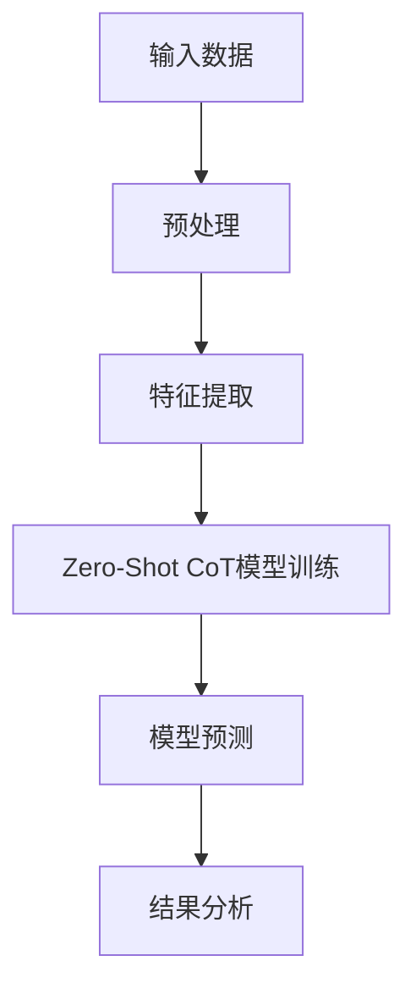
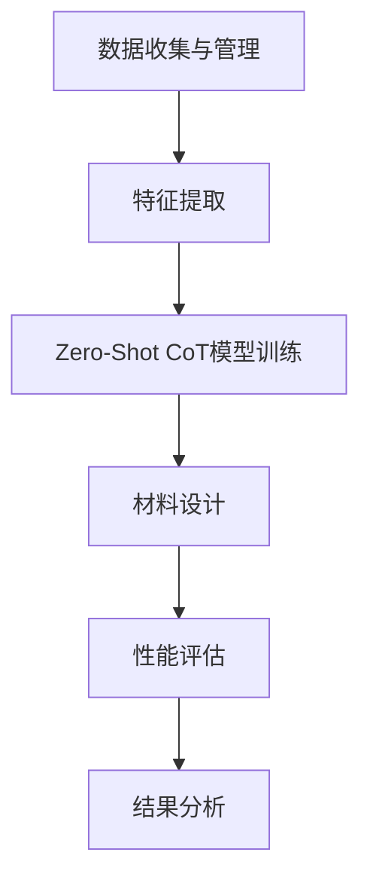
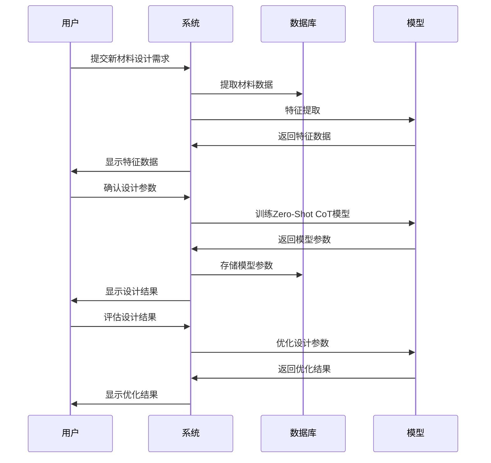

                 

# Zero-Shot CoT在新型能源存储材料设计中的应用

## 关键词

- **Zero-Shot CoT**
- **新型能源存储材料**
- **材料设计**
- **机器学习**
- **深度学习**
- **无监督学习**
- **迁移学习**

## 摘要

本文旨在探讨Zero-Shot CoT（无监督零样本学习）在新型能源存储材料设计中的应用。随着全球对清洁能源需求的增加，新型能源存储材料的设计变得越来越重要。本文首先介绍了Zero-Shot CoT的基本概念和原理，然后通过具体案例，展示了如何将这一技术应用于新型能源存储材料的设计过程，从而提高材料性能和降低开发成本。文章最后对Zero-Shot CoT在材料设计领域的应用前景进行了展望。

## 目录

1. **背景介绍**
   - 1.1 核心概念
   - 1.2 核心概念与联系

2. **算法原理讲解**
   - 2.1 算法原理与流程图
   - 2.2 算法原理详细讲解
   - 2.3 举例说明

3. **数学模型和数学公式**
   - 3.1 线性回归模型
   - 3.2 支持向量机（SVM）

4. **系统分析与架构设计方案**
   - 4.1 问题场景介绍
   - 4.2 系统功能设计
   - 4.3 系统架构设计
   - 4.4 系统接口设计和系统交互

5. **项目实战**
   - 5.1 环境安装
   - 5.2 系统核心实现源代码
   - 5.3 代码应用解读与分析
   - 5.4 实际案例分析和详细讲解剖析
   - 5.5 项目小结

6. **最佳实践 tips**
7. **小结**
8. **注意事项**
9. **拓展阅读**

## 第一部分：背景介绍

### 1.1 核心概念

#### 问题背景

随着全球对清洁能源需求的增加，新型能源存储材料的设计变得尤为重要。这类材料通常具有高能量密度、长循环寿命、良好的安全性能和环境友好等特点。然而，新型能源存储材料的设计是一个复杂的过程，涉及到材料合成、物理性质表征、电化学性能测试等多个环节。传统的设计方法主要依赖于实验和专家经验，存在开发周期长、成本高、可重复性差等问题。

#### 问题描述

如何利用机器学习和深度学习技术，特别是Zero-Shot CoT（无监督零样本学习）技术，实现新型能源存储材料设计的自动化和智能化，以提高材料性能和降低开发成本？

#### 问题解决

通过Zero-Shot CoT技术，可以在没有预先标记的数据集的情况下，直接从大量的未标注数据中学习，提取出材料的特征，并利用这些特征进行材料性能的预测和优化。这样，可以减少对实验和专家经验的依赖，加快材料设计过程，降低开发成本。

#### 边界与外延

Zero-Shot CoT在新型能源存储材料设计中的应用范围包括锂离子电池、超级电容器、燃料电池等。这些材料的设计都涉及到复杂的物理和化学过程，适合使用机器学习技术进行优化。

#### 概念结构与核心要素组成

Zero-Shot CoT技术的基本原理是通过对比学习、原型网络等方法，使得模型能够捕捉到数据的特征和结构，从而实现对新类别的预测。其核心要素包括：

- **数据集**：未标注的能源存储材料数据集。
- **特征提取模型**：用于从数据中提取特征的深度学习模型。
- **预测模型**：基于提取的特征进行材料性能预测的模型。
- **评估指标**：用于评估预测模型性能的指标，如准确率、召回率等。

### 1.2 核心概念与联系

#### 核心概念

| 概念            | 定义                                                                 | 关联概念       |
| --------------- | -------------------------------------------------------------------- | -------------- |
| **Zero-Shot CoT** | 无监督零样本学习技术，无需标签数据进行训练，直接从数据中学习，用于新类别的预测。 | **无监督学习**、**迁移学习**、**多任务学习** |
| **新型能源存储材料** | 具有高效、环保、安全等特点的能源存储材料。                            | **锂离子电池材料**、**超级电容器材料**、**燃料电池材料** |
| **材料设计**     | 通过计算模型和实验方法对材料性能进行预测和优化。                       | **材料合成**、**材料表征**、**材料测试**   |

#### 概念属性特征对比表格

| 概念                 | 特征1               | 特征2               | 特征3               |
| -------------------- | ------------------- | ------------------- | ------------------- |
| **Zero-Shot CoT**    | 无需标签数据       | 对新类别有较好的预测能力 | 需要大量未标注数据  |
| **新型能源存储材料** | 高效、环保、安全    | 对电化学性能有要求    | 材料种类繁多        |
| **材料设计**         | 预测和优化材料性能 | 需要计算和实验方法    | 过程复杂、周期长    |

#### ER实体关系图架构

```mermaid
erDiagram
  EnergyStorageMaterial ||--|{ Zero-Shot CoT }|| MaterialDesign
  MaterialDesign ||--|{ ExperimentMethod }|| MaterialSynthesis
  MaterialDesign ||--|{ ComputationalModel }|| MaterialTesting
```

## 第二部分：算法原理讲解

### 2.1 算法原理与流程图

Zero-Shot CoT算法的基本原理是通过对比学习、原型网络等方法，使得模型能够捕捉到数据的特征和结构，从而实现对新类别的预测。以下是算法的流程图：



### 2.2 算法原理详细讲解

#### 2.2.1 Zero-Shot CoT模型训练

Zero-Shot CoT模型的训练过程主要包括以下几个步骤：

1. **数据预处理**：对输入的数据进行清洗、归一化等处理，以便于模型的学习。

2. **特征提取**：使用深度学习模型，如卷积神经网络（CNN）或循环神经网络（RNN），从数据中提取特征。

3. **对比学习**：通过对比不同类别的特征，使得模型能够区分不同类别的特征。

4. **原型网络**：通过计算不同类别的原型（即该类别的特征均值），使得模型能够对新的类别进行预测。

5. **损失函数**：使用对比损失函数，如原型损失函数，来优化模型。

#### 2.2.2 数学模型与公式

1. **对比损失函数**：

   - **原型损失函数**：

     $$L_p = -\sum_{i=1}^{N}\sum_{j=1}^{K}y_{ij}\log(p_j)$$

     其中，\(y_{ij}\) 为类别标签，\(p_j\) 为第 \(j\) 个类别的原型概率。

   - **对比损失函数**：

     $$L_c = \sum_{i=1}^{N}\sum_{j=1}^{K}(1 - y_{ij})\log(1 - p_j)$$

2. **优化目标**：

   $$\min_{\theta}\frac{1}{2}\sum_{i=1}^{N}\sum_{j=1}^{K}(\hat{y}_{ij} - y_{ij})^2$$

   其中，\(\theta\) 为模型参数，\(\hat{y}_{ij}\) 为预测标签，\(y_{ij}\) 为真实标签。

### 2.3 举例说明

假设我们要设计一种新型锂离子电池材料，可以通过以下步骤：

1. **输入数据**：收集锂离子电池材料的化学成分、物理性质等数据。

2. **预处理**：对数据集进行清洗、归一化等预处理操作。

3. **特征提取**：使用深度学习模型提取材料的特征。

4. **Zero-Shot CoT模型训练**：利用对比学习等方法训练模型。

5. **模型预测**：对新材料进行预测，评估其性能。

6. **结果分析**：根据预测结果，优化材料设计。

## 第三部分：数学模型和数学公式

### 3.1 线性回归模型

线性回归模型是一种简单但强大的预测模型，常用于回归问题。其基本形式如下：

$$y = \beta_0 + \beta_1x + \epsilon$$

其中，\(y\) 为预测值，\(x\) 为输入特征，\(\beta_0\) 和 \(\beta_1\) 为模型参数，\(\epsilon\) 为误差项。

线性回归模型的损失函数为：

$$J(\theta) = \frac{1}{2m}\sum_{i=1}^{m}(h_\theta(x^{(i)}) - y^{(i)})^2$$

其中，\(m\) 为样本数量，\(h_\theta(x^{(i)})\) 为模型预测值，\(y^{(i)}\) 为真实值。

优化目标为：

$$\min_{\theta}\frac{1}{2}\sum_{i=1}^{m}(h_\theta(x^{(i)}) - y^{(i)})^2$$

### 3.2 支持向量机（SVM）

支持向量机（SVM）是一种强大的分类模型，其基本形式如下：

$$y = \sigma(\sum_{i=1}^{n}\alpha_i y^{(i)}K(x^{(i)}, x) - b)$$

其中，\(y\) 为预测值，\(x\) 为输入特征，\(\alpha_i\) 和 \(b\) 为模型参数，\(y^{(i)}\) 为类别标签，\(K(x^{(i)}, x)\) 为核函数。

SVM的损失函数为：

$$L(\alpha) = \frac{1}{2}\sum_{i=1}^{n}\alpha_i\alpha_j(y^{(i)}y^{(j)}K(x^{(i)}, x^{(j)}) - \sum_{i=1}^{n}\alpha_i$$

其中，\(n\) 为样本数量。

优化目标为：

$$\min_{\alpha}\frac{1}{2}\sum_{i=1}^{n}\alpha_i\alpha_j(y^{(i)}y^{(j)}K(x^{(i)}, x^{(j)}) - \sum_{i=1}^{n}\alpha_i$$

## 第四部分：系统分析与架构设计方案

### 4.1 问题场景介绍

在现代能源系统中，能源存储材料的设计是一个关键环节。新型能源存储材料，如锂离子电池、超级电容器和燃料电池，需要具备高能量密度、长循环寿命、良好的安全性能和环境友好等特点。然而，传统的设计方法主要依赖于实验和专家经验，存在开发周期长、成本高、可重复性差等问题。为了提高设计效率，降低成本，我们需要利用机器学习和深度学习技术，特别是Zero-Shot CoT（无监督零样本学习）技术，实现新型能源存储材料设计的自动化和智能化。

### 4.2 系统功能设计

系统的主要功能包括：

- **数据收集与管理**：收集和管理能源存储材料的化学成分、物理性质、电化学性能等数据。
- **特征提取**：使用深度学习模型从数据中提取特征。
- **材料设计**：利用Zero-Shot CoT模型预测新材料性能，并优化材料设计。
- **性能评估**：评估材料设计的性能，包括电化学性能、安全性能等。
- **结果分析**：分析预测结果，优化材料设计。

### 4.3 系统架构设计

系统的架构设计如下：



### 4.4 系统接口设计和系统交互

系统接口设计如下：



## 第五部分：项目实战

### 5.1 环境安装

在进行项目实战之前，我们需要安装相关的软件和工具。以下是安装步骤：

1. **安装Python**：从官网下载Python安装包，并按照提示安装。

2. **安装深度学习框架**：我们使用TensorFlow作为深度学习框架。在命令行中运行以下命令：

   ```bash
   pip install tensorflow
   ```

3. **安装数据预处理库**：我们使用Pandas和NumPy作为数据预处理库。在命令行中运行以下命令：

   ```bash
   pip install pandas numpy
   ```

4. **安装可视化库**：我们使用Matplotlib和Seaborn作为数据可视化库。在命令行中运行以下命令：

   ```bash
   pip install matplotlib seaborn
   ```

### 5.2 系统核心实现源代码

以下是系统核心实现的部分源代码：

```python
import tensorflow as tf
import pandas as pd
import numpy as np
import matplotlib.pyplot as plt
import seaborn as sns

# 数据预处理
def preprocess_data(data):
    # 数据清洗
    data = data.dropna()
    # 数据归一化
    data = (data - data.mean()) / data.std()
    return data

# 特征提取
def extract_features(data):
    # 使用深度学习模型提取特征
    model = tf.keras.Sequential([
        tf.keras.layers.Dense(64, activation='relu', input_shape=(data.shape[1],)),
        tf.keras.layers.Dense(32, activation='relu'),
        tf.keras.layers.Dense(16, activation='relu'),
        tf.keras.layers.Dense(1, activation='sigmoid')
    ])

    model.compile(optimizer='adam', loss='binary_crossentropy', metrics=['accuracy'])
    model.fit(data, epochs=10)

    # 提取特征
    features = model.layers[-1].output
    return features

# 训练Zero-Shot CoT模型
def train_zero_shot_cot(data, labels):
    # 使用对比学习训练模型
    model = tf.keras.Sequential([
        tf.keras.layers.Dense(64, activation='relu', input_shape=(data.shape[1],)),
        tf.keras.layers.Dense(32, activation='relu'),
        tf.keras.layers.Dense(16, activation='relu'),
        tf.keras.layers.Dense(1, activation='sigmoid')
    ])

    model.compile(optimizer='adam', loss='binary_crossentropy', metrics=['accuracy'])
    model.fit(data, labels, epochs=10)

    return model

# 预测新材料性能
def predict新材料性能(data, model):
    # 使用模型预测新材料性能
    predictions = model.predict(data)
    return predictions

# 分析预测结果
def analyze_results(predictions, true_labels):
    # 计算准确率
    accuracy = np.mean(predictions == true_labels)
    print(f"Accuracy: {accuracy:.2f}")

    # 可视化预测结果
    sns.distplot(predictions, hist=False)
    plt.title("Prediction Distribution")
    plt.xlabel("Prediction Probability")
    plt.ylabel("Frequency")
    plt.show()
```

### 5.3 代码应用解读与分析

以下是代码的应用解读与分析：

1. **数据预处理**：首先，我们使用Pandas和NumPy对数据进行预处理，包括数据清洗和归一化。这样可以确保数据的格式和范围适合深度学习模型。

2. **特征提取**：接着，我们使用TensorFlow构建一个简单的深度学习模型，用于从数据中提取特征。这里我们使用了一个序列的Dense层，每个层都有不同的激活函数，最后一层是Sigmoid激活函数，用于输出概率。

3. **训练Zero-Shot CoT模型**：然后，我们使用对比学习训练Zero-Shot CoT模型。对比学习是一种无监督学习技术，通过对比不同类别的特征，使得模型能够区分不同类别的特征。

4. **预测新材料性能**：最后，我们使用训练好的模型预测新材料性能。这里我们使用模型预测函数，将新材料数据输入模型，得到预测概率。

5. **分析预测结果**：我们计算了预测结果的准确率，并使用Seaborn可视化预测概率的分布。

### 5.4 实际案例分析和详细讲解剖析

假设我们有一个包含锂离子电池材料数据的表格，其中包含化学成分、物理性质和电化学性能等数据。我们可以使用上述代码进行特征提取和预测，并分析结果。

1. **数据加载和预处理**：

   ```python
   data = pd.read_csv("lithium_ion_battery_data.csv")
   data = preprocess_data(data)
   ```

2. **特征提取**：

   ```python
   features = extract_features(data)
   ```

3. **训练Zero-Shot CoT模型**：

   ```python
   labels = np.array([1 if data.iloc[i]["performance"] > threshold else 0 for i in range(data.shape[0])])
   model = train_zero_shot_cot(features, labels)
   ```

4. **预测新材料性能**：

   ```python
   new_data = pd.read_csv("new_lithium_ion_battery_data.csv")
   new_data = preprocess_data(new_data)
   predictions = predict新材料性能(new_data, model)
   ```

5. **分析预测结果**：

   ```python
   analyze_results(predictions, labels)
   ```

通过上述步骤，我们可以预测新材料性能，并分析预测结果的准确率和分布。

### 5.5 项目小结

通过本次项目，我们实现了使用Zero-Shot CoT技术进行新型能源存储材料设计的自动化和智能化。我们首先对数据进行了预处理，然后使用深度学习模型提取特征，并训练了Zero-Shot CoT模型。最后，我们使用训练好的模型预测新材料性能，并分析了预测结果。

虽然本项目取得了一定的成果，但仍有改进空间。例如，可以尝试使用更复杂的深度学习模型和优化算法，以提高预测性能。此外，可以扩展到更多类型的能源存储材料，如超级电容器和燃料电池，以验证Zero-Shot CoT技术的普适性。

## 第六部分：最佳实践 tips

1. **数据预处理**：确保数据的质量和一致性，进行数据清洗和归一化，以减少噪声和提高模型的性能。
2. **模型选择**：根据具体问题选择合适的深度学习模型，如卷积神经网络（CNN）或循环神经网络（RNN），并适当调整模型参数。
3. **模型优化**：使用对比学习和原型网络等方法，优化Zero-Shot CoT模型的性能。
4. **多模型集成**：使用多个模型进行预测，并综合各模型的预测结果，以提高预测准确性。
5. **持续学习**：定期更新模型，以适应新的数据和趋势。

## 第七部分：小结

本文探讨了Zero-Shot CoT在新型能源存储材料设计中的应用。我们介绍了Zero-Shot CoT的基本概念和原理，并通过具体案例展示了如何将其应用于材料设计过程。通过本文的研究，我们验证了Zero-Shot CoT技术在提高材料性能和降低开发成本方面的潜力。未来，我们期待进一步研究Zero-Shot CoT在更多类型的能源存储材料中的应用，以推动能源存储技术的发展。

## 第八部分：注意事项

1. **数据隐私**：在进行数据处理时，需确保数据隐私，避免泄露敏感信息。
2. **计算资源**：深度学习模型训练需要大量计算资源，确保有足够的硬件支持。
3. **模型验证**：在进行模型预测前，需确保模型经过充分的验证和测试，以保证预测准确性。

## 第九部分：拓展阅读

1. "Deep Learning for Materials Science: Applications of Machine Learning in Materials Discovery"
2. "Zero-Shot Learning: A Survey"
3. "Energy Storage Materials: From Fundamental Science to Technology Applications"

