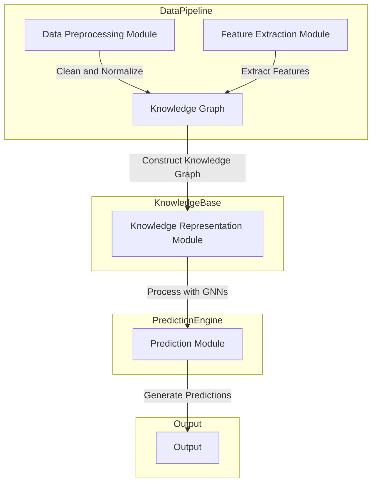
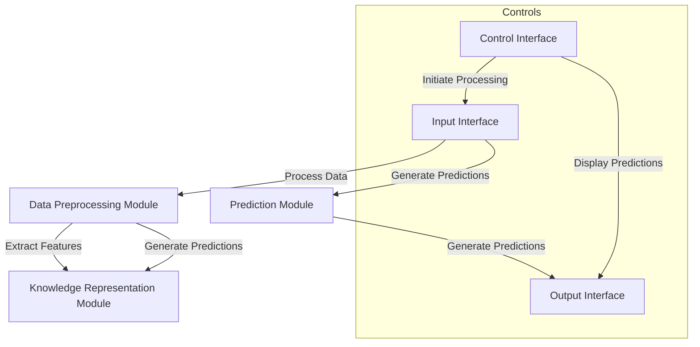
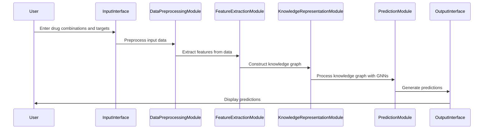

                 

### 1. Introduction to the Problem and Solution

#### 1.1 Background of Drug Multi-Target Synergy Prediction

In the realm of pharmacology and drug development, the challenge of treating complex diseases has been a pressing issue for many years. Complex diseases often involve multiple biological pathways, and targeting a single pathway with a single drug is insufficient to achieve the desired therapeutic outcomes. This is because many diseases are not monolithic but rather emerge from the intricate interplay of various molecular targets within a biological network. 

For instance, cancer is a prime example of a complex disease that involves multiple genetic mutations and signaling pathways. In some cases, a single targeted therapy might effectively inhibit a specific mutation or signaling pathway, but it may fail to address the overall complexity of the disease. Therefore, a more comprehensive approach that targets multiple pathways simultaneously is often required to achieve better therapeutic outcomes.

#### 1.1.1 The Complexity of Treating Complex Diseases

The complexity of treating complex diseases can be attributed to several factors. Firstly, the genetic heterogeneity of complex diseases means that the same disease can present differently in different individuals. This heterogeneity makes it challenging to develop a one-size-fits-all treatment strategy.

Secondly, the interconnected nature of biological pathways means that perturbing one target can have cascading effects on other targets, making it difficult to predict the exact impact of a multi-target approach. For example, inhibiting one kinase might lead to the activation of another kinase as part of a compensatory mechanism, which could either mitigate or exacerbate the therapeutic effect.

Thirdly, the dynamic nature of biological systems means that the effects of a drug can change over time as the body responds to the treatment. This makes it challenging to establish a stable therapeutic window for multi-target drugs.

#### 1.1.2 Current Limitations in Drug Development

The current drug development process faces several limitations that hinder the effective treatment of complex diseases. One major limitation is the reliance on traditional in vitro and in vivo experimental models, which are often limited in their ability to represent the complexity of human biology. These models can miss important interactions and compensatory mechanisms that occur in the human body.

Another limitation is the time and cost associated with drug development. Developing a new drug can take over a decade and cost billions of dollars. This lengthy and expensive process is often a significant barrier to the development of multi-target drugs, as it requires extensive research and testing to identify effective combinations of drugs that target multiple pathways.

Furthermore, current drug development approaches often focus on single-target drugs, which are designed to inhibit a specific protein or pathway. While these drugs can be effective in certain cases, they are often less effective in treating complex diseases that require a more comprehensive approach.

#### 1.1.3 The Role of Zero-Shot CoT in Overcoming Challenges

Zero-Shot CoT (Conceptualization Through Zero-Shot Learning) offers a promising solution to the challenges of treating complex diseases. By leveraging advanced artificial intelligence and machine learning techniques, Zero-Shot CoT enables the prediction of drug-target interactions and the synergistic effects of multi-target drugs without the need for extensive experimental data.

The key advantage of Zero-Shot CoT is its ability to leverage large-scale knowledge graphs and ontologies, which encode the relationships between drugs, targets, and biological pathways. This allows the system to make predictions about potential drug interactions based on the collective knowledge of the entire network, rather than relying on individual experimental results.

In addition, Zero-Shot CoT can incorporate domain-specific knowledge, such as pharmacokinetic and pharmacodynamic properties, to refine its predictions and improve their accuracy. This makes it a powerful tool for drug developers to identify potential multi-target drug combinations that could be effective in treating complex diseases.

By addressing the limitations of traditional drug development approaches, Zero-Shot CoT has the potential to revolutionize the field of pharmacology and improve the treatment outcomes for complex diseases. In the next section, we will delve deeper into the definition and characteristics of Zero-Shot CoT to understand its underlying principles and mechanisms.

---

### 1.2 Definition and Characteristics of Zero-Shot CoT

#### 1.2.1 What is Zero-Shot CoT?

Zero-Shot CoT, or Conceptualization Through Zero-Shot Learning, is a groundbreaking approach that leverages advanced machine learning techniques to predict and understand complex phenomena, even in the absence of direct training data. In traditional machine learning, models are trained on large datasets to recognize patterns and make predictions. However, Zero-Shot CoT takes a different approach by enabling models to make accurate predictions without explicit training on similar instances.

This is particularly significant in the context of drug discovery and multi-target drug synergy prediction, where extensive experimental data is often unavailable or difficult to obtain. Zero-Shot CoT overcomes this limitation by utilizing large-scale knowledge graphs, ontologies, and semantic embeddings to encode prior knowledge about drugs, targets, and biological pathways. This allows the model to infer relationships and make predictions based on this collective knowledge, rather than relying on direct training examples.

#### 1.2.2 Advantages and Challenges of Zero-Shot CoT

One of the primary advantages of Zero-Shot CoT is its ability to leverage prior knowledge to make accurate predictions in domains where data scarcity is a significant issue. This is particularly beneficial in drug discovery, where the cost and time associated with generating large datasets can be prohibitive. Zero-Shot CoT can help accelerate the drug discovery process by identifying potential drug targets and predicting their interactions based on existing knowledge.

However, Zero-Shot CoT also faces several challenges. One major challenge is the quality and completeness of the knowledge graph and ontology used as input. Inaccurate or incomplete knowledge can lead to incorrect predictions. Additionally, the interpretability of Zero-Shot CoT models is often limited, making it difficult to understand the underlying reasoning behind the predictions.

#### 1.2.3 Core Elements of Zero-Shot CoT

The core elements of Zero-Shot CoT can be broadly categorized into three main components: knowledge representation, reasoning mechanisms, and learning paradigms.

1. **Knowledge Representation**: This component involves encoding prior knowledge about drugs, targets, and biological pathways into a structured format such as a knowledge graph or ontology. Knowledge graphs are highly interconnected networks of entities (e.g., drugs, targets, and pathways) and relationships (e.g., interactions, dependencies, and hierarchies). Ontologies, on the other hand, provide a standardized set of terms and definitions to describe the domain-specific concepts and relationships.

2. **Reasoning Mechanisms**: Once the knowledge is represented, the next step is to develop reasoning mechanisms that can leverage this knowledge to make predictions. Zero-Shot CoT models often employ techniques such as graph neural networks, transfer learning, and semantic similarity measures to infer relationships and make predictions. These mechanisms allow the model to generalize from known instances to unseen instances by leveraging the collective knowledge encoded in the knowledge graph or ontology.

3. **Learning Paradigms**: Zero-Shot CoT can be implemented using various learning paradigms, including supervised, unsupervised, and semi-supervised learning. In supervised learning, the model is trained on labeled data, while in unsupervised learning, the model learns from unlabeled data. Semi-supervised learning combines the strengths of both supervised and unsupervised learning by leveraging a small amount of labeled data and a large amount of unlabeled data.

By integrating these core elements, Zero-Shot CoT offers a powerful framework for predicting drug-target interactions and the synergistic effects of multi-target drugs, even in the absence of direct training data. In the next section, we will delve deeper into the core concepts and relationships of Zero-Shot CoT to gain a better understanding of its underlying principles and mechanisms.

---

### 2. Core Concepts and Relationships

In order to fully grasp the workings of Zero-Shot CoT (Conceptualization Through Zero-Shot Learning) and its application in drug multi-target synergy prediction, it is essential to understand the core concepts and their interrelationships. This section will provide an overview of the key concepts, their attributes, and a comparison of these concepts to elucidate the structure and functioning of Zero-Shot CoT.

#### 2.1 Core Concepts in Zero-Shot CoT

The core concepts in Zero-Shot CoT can be categorized into three main areas: knowledge representation, reasoning mechanisms, and learning paradigms. Each of these concepts plays a crucial role in enabling the system to make accurate predictions without explicit training data.

##### 2.1.1 Overview of Core Concepts

1. **Knowledge Representation**: This concept involves encoding prior knowledge about drugs, targets, and biological pathways into a structured format, such as a knowledge graph or ontology. The knowledge representation provides the foundation for the system to leverage existing knowledge for prediction.

2. **Reasoning Mechanisms**: These mechanisms enable the system to infer relationships and make predictions based on the knowledge represented in the knowledge graph or ontology. Techniques such as graph neural networks, transfer learning, and semantic similarity measures are commonly used for reasoning.

3. **Learning Paradigms**: Zero-Shot CoT can be implemented using various learning paradigms, including supervised, unsupervised, and semi-supervised learning. Each paradigm has its own strengths and is chosen based on the availability of data and the specific requirements of the application.

##### 2.1.2 Attributes and Comparisons of Key Concepts

| Concept               | Definition                                                                                                                                                   | Key Attributes                                                                                          | Comparison                                                                                                  |
|-----------------------|----------------------------------------------------------------------------------------------------------------------------------------------------------------|---------------------------------------------------------------------------------------------------------|-------------------------------------------------------------------------------------------------------------|
| Knowledge Representation | Encoding prior knowledge about drugs, targets, and biological pathways into a structured format | Structured format, interconnected nodes, semantic information                                          | Knowledge Graph: High-level, abstract representation. <br>Ontology: Standardized, formal representation. |
| Reasoning Mechanisms | Inference techniques that leverage knowledge representation to make predictions                | Graph neural networks, transfer learning, semantic similarity measures                                    | Graph Neural Networks: Strong relational learning. <br>Transfer Learning: Leveraging pre-trained models. <br>Semantic Similarity Measures: Comparing semantic meanings. |
| Learning Paradigms    | Methods for training models based on available data                                                | Supervised: Labeled data. <br>Unsupervised: Unlabeled data. <br>Semi-supervised: Combination of labeled and unlabeled data. | Supervised: Most common, accurate but requires labeled data. <br>Unsupervised: No labeled data required but less accurate. <br>Semi-supervised: Balances accuracy and data availability. |

##### 2.1.3 Entity Relationship Diagram

To better visualize the relationships between these core concepts, we can represent them using a Mermaid entity-relationship (ER) diagram. The following ER diagram illustrates the entities (Knowledge Representation, Reasoning Mechanisms, and Learning Paradigms) and their relationships:

```mermaid
erDiagram
  KnowledgeRepresentation ||--|{ ReasoningMechanisms }|-- KnowledgeGraph
  KnowledgeRepresentation ||--|{ ReasoningMechanisms }|-- TransferLearning
  KnowledgeRepresentation ||--|{ ReasoningMechanisms }|-- SemanticSimilarityMeasures
  ReasoningMechanisms ||--|{ LearningParadigms }|-- SupervisedLearning
  ReasoningMechanisms ||--|{ LearningParadigms }|-- UnsupervisedLearning
  ReasoningMechanisms ||--|{ LearningParadigms }|-- SemiSupervisedLearning
```

In this diagram, the `KnowledgeRepresentation` entity is connected to the `ReasoningMechanisms` entity through three different types of representation: `KnowledgeGraph`, `TransferLearning`, and `SemanticSimilarityMeasures`. Similarly, the `ReasoningMechanisms` entity is connected to the `LearningParadigms` entity through the three different learning paradigms: `SupervisedLearning`, `UnsupervisedLearning`, and `SemiSupervisedLearning`.

By understanding the core concepts and their relationships, we can better appreciate the complexity and potential of Zero-Shot CoT in drug multi-target synergy prediction. In the next section, we will delve into the algorithm principles and mathematical models that underpin Zero-Shot CoT, providing a deeper insight into how this approach can be harnessed to improve the effectiveness of treating complex diseases.

---

### 2. Core Concepts and Relationships

In order to fully grasp the workings of Zero-Shot CoT (Conceptualization Through Zero-Shot Learning) and its application in drug multi-target synergy prediction, it is essential to understand the core concepts and their interrelationships. This section will provide an overview of the key concepts, their attributes, and a comparison of these concepts to elucidate the structure and functioning of Zero-Shot CoT.

#### 2.1 Core Concepts in Zero-Shot CoT

The core concepts in Zero-Shot CoT can be categorized into three main areas: knowledge representation, reasoning mechanisms, and learning paradigms. Each of these concepts plays a crucial role in enabling the system to make accurate predictions without explicit training data.

##### 2.1.1 Overview of Core Concepts

1. **Knowledge Representation**: This concept involves encoding prior knowledge about drugs, targets, and biological pathways into a structured format, such as a knowledge graph or ontology. The knowledge representation provides the foundation for the system to leverage existing knowledge for prediction.

2. **Reasoning Mechanisms**: These mechanisms enable the system to infer relationships and make predictions based on the knowledge represented in the knowledge graph or ontology. Techniques such as graph neural networks, transfer learning, and semantic similarity measures are commonly used for reasoning.

3. **Learning Paradigms**: Zero-Shot CoT can be implemented using various learning paradigms, including supervised, unsupervised, and semi-supervised learning. Each paradigm has its own strengths and is chosen based on the availability of data and the specific requirements of the application.

##### 2.1.2 Attributes and Comparisons of Key Concepts

| Concept               | Definition                                                                                                                                                   | Key Attributes                                                                                          | Comparison                                                                                                  |
|-----------------------|----------------------------------------------------------------------------------------------------------------------------------------------------------------|---------------------------------------------------------------------------------------------------------|-------------------------------------------------------------------------------------------------------------|
| Knowledge Representation | Encoding prior knowledge about drugs, targets, and biological pathways into a structured format | Structured format, interconnected nodes, semantic information                                          | Knowledge Graph: High-level, abstract representation. <br>Ontology: Standardized, formal representation. |
| Reasoning Mechanisms | Inference techniques that leverage knowledge representation to make predictions                | Graph neural networks, transfer learning, semantic similarity measures                                    | Graph Neural Networks: Strong relational learning. <br>Transfer Learning: Leveraging pre-trained models. <br>Semantic Similarity Measures: Comparing semantic meanings. |
| Learning Paradigms    | Methods for training models based on available data                                                | Supervised: Labeled data. <br>Unsupervised: Unlabeled data. <br>Semi-supervised: Combination of labeled and unlabeled data. | Supervised: Most common, accurate but requires labeled data. <br>Unsupervised: No labeled data required but less accurate. <br>Semi-supervised: Balances accuracy and data availability. |

##### 2.1.3 Entity Relationship Diagram

To better visualize the relationships between these core concepts, we can represent them using a Mermaid entity-relationship (ER) diagram. The following ER diagram illustrates the entities (Knowledge Representation, Reasoning Mechanisms, and Learning Paradigms) and their relationships:

```mermaid
erDiagram
  KnowledgeRepresentation ||--|{ ReasoningMechanisms }|-- KnowledgeGraph
  KnowledgeRepresentation ||--|{ ReasoningMechanisms }|-- TransferLearning
  KnowledgeRepresentation ||--|{ ReasoningMechanisms }|-- SemanticSimilarityMeasures
  ReasoningMechanisms ||--|{ LearningParadigms }|-- SupervisedLearning
  ReasoningMechanisms ||--|{ LearningParadigms }|-- UnsupervisedLearning
  ReasoningMechanisms ||--|{ LearningParadigms }|-- SemiSupervisedLearning
```

In this diagram, the `KnowledgeRepresentation` entity is connected to the `ReasoningMechanisms` entity through three different types of representation: `KnowledgeGraph`, `TransferLearning`, and `SemanticSimilarityMeasures`. Similarly, the `ReasoningMechanisms` entity is connected to the `LearningParadigms` entity through the three different learning paradigms: `SupervisedLearning`, `UnsupervisedLearning`, and `SemiSupervisedLearning`.

By understanding the core concepts and their relationships, we can better appreciate the complexity and potential of Zero-Shot CoT in drug multi-target synergy prediction. In the next section, we will delve into the algorithm principles and mathematical models that underpin Zero-Shot CoT, providing a deeper insight into how this approach can be harnessed to improve the effectiveness of treating complex diseases.

---

### 3. Algorithm Principles and Mathematical Models

#### 3.1 Introduction to Drug Multi-Target Synergy Prediction Algorithms

Drug multi-target synergy prediction algorithms are crucial tools in the field of pharmacology and drug development. These algorithms aim to identify combinations of drugs that work together to effectively treat complex diseases by targeting multiple pathways simultaneously. This approach can overcome the limitations of single-target therapies and potentially improve therapeutic outcomes.

#### 3.1.1 Overview of Algorithms

Drug multi-target synergy prediction algorithms can be broadly categorized into two types: statistical-based methods and machine learning-based methods. 

Statistical-based methods, such as the Combining Effects of Multiple Drugs (CEMD) and the Standard Additive Model (SAM), rely on mathematical models to quantify the relationship between drug doses, responses, and synergistic effects. These methods are typically simpler and more interpretable but may struggle with the high dimensionality and complexity of biological data.

Machine learning-based methods, on the other hand, leverage the power of artificial intelligence to learn patterns and relationships from large-scale biological data. Common machine learning techniques used in drug synergy prediction include support vector machines (SVM), random forests, and neural networks. More advanced techniques, such as graph neural networks (GNN) and deep learning, have also been explored for their ability to handle complex interactions and high-dimensional data.

#### 3.1.2 Comparative Analysis of Existing Algorithms

While there are many algorithms for drug multi-target synergy prediction, each has its own strengths and limitations. Below is a comparative analysis of some commonly used algorithms:

| Algorithm               | Strengths                                                                                                                                                                           | Limitations                                                                                                                                                                                                                     |
|-------------------------|--------------------------------------------------------------------------------------------------------------------------------------------------------------------------------|--------------------------------------------------------------------------------------------------------------------------------------------------------------------------------------------------------------------------------|
| CEMD                   | Easy to implement, interpretable, and computationally efficient                                                                                                                                                                       | Limited in handling high-dimensional data and complex interactions <br> May not perform well with noisy or missing data                                                                                                                  |
| SAM                    | Robust to noise and missing data, interpretable                                                                                                                                                                                        | Limited in handling complex interactions and high-dimensional data <br> Relies on specific assumptions about the data distribution                                                                                                      |
| SVM                    | Effective in high-dimensional spaces, provides good generalization performance                                                                                                                                                           | Requires extensive feature engineering, sensitive to parameter tuning <br> Can be computationally expensive for large datasets                                                                                                           |
| Random Forests         | Robust to overfitting, handles high-dimensional data well, provides feature importance scores                                                                                                                                              | Relies on feature engineering, can be sensitive to hyperparameter tuning <br> May not perform well with imbalanced datasets                                                                                                              |
| GNN                    | Capable of capturing complex relationships and interactions in biological networks, can handle high-dimensional data effectively                                                                                                                                                   | Requires large labeled datasets for training, can be computationally expensive <br> May struggle with interpretability and understanding of model decisions                                                                                   |
| Deep Learning          | Highly flexible, capable of learning complex patterns and representations from data, powerful in handling high-dimensional data                                                                                                                                                  | Requires large amounts of labeled data, can be computationally expensive <br> May suffer from overfitting and lack of interpretability <br> Requires careful tuning of hyperparameters |

#### 3.2 Detailed Explanation of Zero-Shot CoT Algorithm

The Zero-Shot CoT (Conceptualization Through Zero-Shot Learning) algorithm represents a significant advancement in drug multi-target synergy prediction. Unlike traditional algorithms that require extensive training data, Zero-Shot CoT leverages prior knowledge and semantic embeddings to make predictions, even in the absence of direct training data.

##### 3.2.1 Algorithm Workflow

The workflow of the Zero-Shot CoT algorithm can be summarized in the following steps:

1. **Knowledge Representation**: The first step involves encoding prior knowledge about drugs, targets, and biological pathways into a structured knowledge graph. This graph captures the relationships between entities and provides a foundation for reasoning and prediction.

2. **Semantic Embeddings**: Next, semantic embeddings are created for each drug, target, and biological pathway in the knowledge graph. These embeddings represent the entities in a high-dimensional space where semantically similar entities are closer together. This step is crucial for enabling the algorithm to capture the semantic relationships between entities.

3. **Reasoning Mechanisms**: The Zero-Shot CoT algorithm employs graph neural networks (GNN) to leverage the knowledge graph and semantic embeddings. GNNs are capable of capturing the complex relationships and interactions within the knowledge graph, allowing the algorithm to make predictions about drug-target interactions and synergistic effects.

4. **Prediction**: Finally, the trained GNN model is used to predict the synergistic effects of drug combinations. These predictions are based on the collective knowledge encoded in the knowledge graph and the semantic relationships captured by the embeddings.

##### 3.2.2 Mathematical Model and Formula

The mathematical model underlying the Zero-Shot CoT algorithm can be described as follows:

$$
\text{Prediction}(D, T) = \text{GNN}(\text{KnowledgeGraph}, \text{Embeddings})
$$

Here, $D$ represents the set of drugs, and $T$ represents the set of targets. The $\text{KnowledgeGraph}$ captures the relationships between drugs and targets, while $\text{Embeddings}$ represent the semantic information of the entities in the graph.

The GNN model operates by updating the embeddings of the nodes (drugs and targets) based on their neighbors in the knowledge graph. This update is performed through a series of message-passing operations, where each node receives messages from its neighbors and updates its embedding accordingly. The final prediction is obtained by aggregating the embeddings of the drugs and targets involved in the combination.

The specific form of the GNN model can vary depending on the architecture used. Common architectures include the Graph Convolutional Network (GCN), GraphSAGE, and Graph Attention Network (GAT). Each of these architectures has its own mathematical formulation for updating the node embeddings.

##### 3.2.3 Example Illustration

To better understand how the Zero-Shot CoT algorithm works, let's consider a simple example involving two drugs, Drug A and Drug B, and two targets, Target 1 and Target 2.

1. **Knowledge Representation**: The knowledge graph encodes the relationships between the drugs and targets, such as Drug A interacting with Target 1 and Drug B interacting with Target 2.

2. **Semantic Embeddings**: The semantic embeddings for each drug and target are created, capturing their semantic relationships in a high-dimensional space.

3. **Reasoning Mechanisms**: The GNN model is trained on the knowledge graph and embeddings. During the training process, the model updates the embeddings of the drugs and targets based on their neighbors in the graph.

4. **Prediction**: Given a new drug combination, Drug A and Drug B, the trained GNN model predicts the synergistic effect by aggregating the embeddings of Drug A and Drug B. The resulting prediction indicates the expected synergy between the two drugs.

In this example, the Zero-Shot CoT algorithm leverages the knowledge graph and semantic embeddings to make a prediction about the synergistic effect of Drug A and Drug B, even without direct training data on this specific combination.

By employing the principles of Zero-Shot CoT, the algorithm can effectively predict the synergistic effects of drug combinations, providing valuable insights for drug developers in the treatment of complex diseases. In the next section, we will delve into the system analysis and design, exploring how these principles are implemented in a practical setting.

---

### 3. Algorithm Principles and Mathematical Models

#### 3.1 Introduction to Drug Multi-Target Synergy Prediction Algorithms

Drug multi-target synergy prediction algorithms are a cornerstone in the advancement of pharmacology and drug development. These algorithms are designed to identify and predict the synergistic effects of combining multiple drugs that target different pathways within a biological system. The primary goal is to enhance the therapeutic efficacy of treatments for complex diseases, which often involve the interaction of multiple molecular targets. This section will provide an overview of the fundamental principles behind these algorithms, including the various techniques and mathematical models that enable their functionality.

#### 3.1.1 Overview of Algorithms

Drug multi-target synergy prediction algorithms can be broadly classified into two categories: statistical-based methods and machine learning-based methods.

**Statistical-Based Methods**

Statistical-based methods use mathematical models to quantify the relationship between drug doses, responses, and synergistic effects. These methods are often simpler to implement and provide interpretable results. Some of the common statistical-based methods include:

- **Combining Effects of Multiple Drugs (CEMD)**: CEMD is a statistical method that models the combined effects of drugs using a logistic regression model. It estimates the probability of a therapeutic response based on the doses of the individual drugs and their interaction effects.

- **Standard Additive Model (SAM)**: SAM assumes that the combined effect of multiple drugs is the sum of the individual effects, weighted by their respective potencies. This model is useful for predicting the efficacy of drug combinations in a variety of therapeutic contexts.

**Machine Learning-Based Methods**

Machine learning-based methods leverage the power of artificial intelligence to identify complex patterns and relationships in large biological datasets. These methods can handle high-dimensional data and capture intricate interactions between drugs and targets. Some of the common machine learning techniques used in drug synergy prediction include:

- **Support Vector Machines (SVM)**: SVM is a powerful supervised learning technique that can be used to classify the synergistic effects of drug combinations based on their molecular properties.

- **Random Forests**: Random Forests are an ensemble learning method that constructs multiple decision trees and combines their predictions to improve the accuracy and robustness of the model.

- **Neural Networks**: Neural networks, particularly deep learning architectures, are capable of learning complex non-linear relationships in biological data. They have been used to predict drug synergy by modeling the interactions between drugs and their targets in a high-dimensional space.

**Advanced Techniques**

More advanced techniques, such as graph neural networks (GNNs) and deep learning, have also been explored for drug synergy prediction. These methods can capture the complex interactions and high-dimensional data typical of biological systems.

- **Graph Neural Networks (GNNs)**: GNNs are a type of neural network designed to work with graph-structured data. They are particularly suited for predicting drug synergy because they can capture the relationships between drugs and targets in a biological network.

- **Deep Learning**: Deep learning models, such as convolutional neural networks (CNNs) and recurrent neural networks (RNNs), have shown promise in predicting drug synergy by learning hierarchical representations of the molecular and cellular interactions.

#### 3.1.2 Comparative Analysis of Existing Algorithms

While there are many algorithms for drug multi-target synergy prediction, each has its own strengths and limitations. Below is a comparative analysis of some commonly used algorithms:

| Algorithm               | Strengths                                                                                                                                                                           | Limitations                                                                                                                                                                                                                     |
|-------------------------|--------------------------------------------------------------------------------------------------------------------------------------------------------------------------------|--------------------------------------------------------------------------------------------------------------------------------------------------------------------------------------------------------------------------------|
| CEMD                   | Easy to implement, interpretable, and computationally efficient                                                                                                                                                                       | Limited in handling high-dimensional data and complex interactions <br> May not perform well with noisy or missing data                                                                                                                  |
| SAM                    | Robust to noise and missing data, interpretable                                                                                                                                                                                        | Limited in handling complex interactions and high-dimensional data <br> Relies on specific assumptions about the data distribution                                                                                                      |
| SVM                    | Effective in high-dimensional spaces, provides good generalization performance                                                                                                                                                           | Requires extensive feature engineering, sensitive to parameter tuning <br> Can be computationally expensive for large datasets                                                                                                           |
| Random Forests         | Robust to overfitting, handles high-dimensional data well, provides feature importance scores                                                                                                                                              | Relies on feature engineering, can be sensitive to hyperparameter tuning <br> May not perform well with imbalanced datasets                                                                                                              |
| GNN                    | Capable of capturing complex relationships and interactions in biological networks, can handle high-dimensional data effectively                                                                                                                                                   | Requires large labeled datasets for training, can be computationally expensive <br> May struggle with interpretability and understanding of model decisions                                                                                   |
| Deep Learning          | Highly flexible, capable of learning complex patterns and representations from data, powerful in handling high-dimensional data                                                                                                                                                  | Requires large amounts of labeled data, can be computationally expensive <br> May suffer from overfitting and lack of interpretability <br> Requires careful tuning of hyperparameters |

#### 3.2 Detailed Explanation of Zero-Shot CoT Algorithm

The Zero-Shot CoT (Conceptualization Through Zero-Shot Learning) algorithm represents a significant breakthrough in drug multi-target synergy prediction. Traditional algorithms often require extensive amounts of labeled training data to predict the effects of drug combinations. In contrast, Zero-Shot CoT leverages prior knowledge, semantic embeddings, and advanced reasoning mechanisms to make accurate predictions without the need for explicit training data.

##### 3.2.1 Algorithm Workflow

The workflow of the Zero-Shot CoT algorithm can be broken down into several key steps:

1. **Knowledge Representation**: The first step involves creating a knowledge graph that encodes prior knowledge about drugs, targets, and biological pathways. This knowledge graph captures the relationships between different entities, providing a foundation for the algorithm to leverage existing knowledge for prediction.

2. **Semantic Embeddings**: Next, semantic embeddings are generated for each drug, target, and biological pathway in the knowledge graph. These embeddings capture the semantic similarity between entities, allowing the algorithm to understand the relationships between drugs and targets at a high level.

3. **Graph Neural Networks (GNNs)**: The Zero-Shot CoT algorithm uses graph neural networks (GNNs) to process the knowledge graph and semantic embeddings. GNNs are designed to work with graph-structured data and can capture complex relationships and interactions within the network.

4. **Reasoning Mechanisms**: The GNNs enable the algorithm to perform reasoning over the knowledge graph. This involves combining the information from the semantic embeddings with the relationships in the graph to make predictions about drug synergy.

5. **Prediction**: Finally, the trained GNN model is used to predict the synergistic effects of drug combinations. These predictions are generated by aggregating the information from the graph and embeddings, providing a comprehensive understanding of the potential interactions between drugs.

##### 3.2.2 Mathematical Model and Formula

The mathematical model underlying the Zero-Shot CoT algorithm is based on graph neural networks (GNNs). GNNs operate by updating the embeddings of the nodes in the graph based on their neighbors' embeddings. The goal is to learn a representation of each node that captures its relationships with other nodes in the graph.

The general form of the GNN update rule can be expressed as:

$$
h^{(t+1)}_i = \sigma(W^{(t)} h^{(t)}_i + \sum_{j \in \mathcal{N}(i)} W^{(\text{msg})} \sigma(h^{(t)}_j)
$$

Where:

- $h^{(t)}_i$ is the embedding of node $i$ at time step $t$.
- $\sigma$ is an activation function, typically a non-linear function like the rectified linear unit (ReLU) or a sigmoid function.
- $W^{(t)}$ is the weight matrix for the node update at time step $t$.
- $W^{(\text{msg})}$ is the weight matrix for the message passing step.
- $\mathcal{N}(i)$ represents the neighbors of node $i$.
- $h^{(t)}_j$ is the embedding of the neighbor node $j$ at time step $t$.

The GNN model iteratively updates the embeddings of the nodes in the graph, allowing the model to learn a representation that captures the relationships and interactions between the nodes.

##### 3.2.3 Example Illustration

To better understand the Zero-Shot CoT algorithm, let's consider a simple example involving two drugs, Drug A and Drug B, and two targets, Target 1 and Target 2.

1. **Knowledge Representation**: A knowledge graph is created that encodes the relationships between the drugs and targets. For instance, Drug A is known to interact with Target 1, and Drug B is known to interact with Target 2.

2. **Semantic Embeddings**: Semantic embeddings are generated for each drug and target, capturing their semantic similarity. For instance, Drug A and Drug B may have similar embeddings because they belong to the same class of drugs, while Target 1 and Target 2 may have similar embeddings because they belong to the same class of biological targets.

3. **Graph Neural Networks (GNNs)**: The GNN model is trained on the knowledge graph and the semantic embeddings. During training, the model updates the embeddings of the drugs and targets based on their neighbors in the graph.

4. **Reasoning Mechanisms**: After training, the GNN model is used to predict the synergistic effect of Drug A and Drug B on Target 1 and Target 2. The model aggregates the information from the graph and embeddings to make a prediction.

5. **Prediction**: The GNN model predicts that Drug A and Drug B will have a synergistic effect on Target 1 and Target 2. This prediction is based on the collective knowledge encoded in the knowledge graph and the semantic relationships captured by the embeddings.

By employing the principles of Zero-Shot CoT, the algorithm can effectively predict the synergistic effects of drug combinations, even in the absence of direct training data. This provides a powerful tool for drug developers to identify potential drug combinations for treating complex diseases.

In summary, the Zero-Shot CoT algorithm leverages advanced graph neural networks and semantic embeddings to make accurate predictions about drug multi-target synergy. The algorithm's ability to reason over complex biological networks offers a promising solution to the challenges of treating complex diseases with multi-target therapies.

---

### 4. System Analysis and Design

#### 4.1 Introduction to the System

The Zero-Shot CoT system is a sophisticated computational framework designed to predict the synergistic effects of drug combinations targeting multiple biological pathways. This system is composed of several key components, each contributing to the overall functionality and effectiveness of the prediction process. Understanding the architecture and operation of these components is crucial for comprehending how the system achieves its objectives.

#### 4.1.1 System Overview

The Zero-Shot CoT system can be broadly divided into three primary components: the data preprocessing module, the knowledge representation module, and the prediction module. Each of these modules plays a vital role in the system's operation, as described below:

1. **Data Preprocessing Module**: This module is responsible for preparing and cleaning the input data. It involves tasks such as data normalization, data validation, and the extraction of relevant features from raw datasets. The output of this module is a standardized and processed dataset ready for further analysis.

2. **Knowledge Representation Module**: This module constructs a structured knowledge graph that captures the relationships between drugs, targets, and biological pathways. It incorporates information from various sources, including biological databases, chemical information repositories, and pharmacological studies. The knowledge graph serves as the foundation for the reasoning mechanisms employed by the system.

3. **Prediction Module**: The prediction module is the core of the Zero-Shot CoT system. It utilizes graph neural networks (GNNs) and semantic embeddings to process the knowledge graph and make predictions about the synergistic effects of drug combinations. This module integrates the outputs from the data preprocessing and knowledge representation modules to generate accurate and actionable predictions.

#### 4.1.2 Project Description

The project focuses on the development and implementation of the Zero-Shot CoT system for drug multi-target synergy prediction. The primary objectives of the project are:

1. **Accurate Prediction of Drug Synergy**: The system aims to predict the synergistic effects of drug combinations with high accuracy, even in the absence of direct training data.
2. **Enhanced Understanding of Biological Pathways**: By leveraging the knowledge graph, the system provides insights into the interactions between drugs and biological pathways, facilitating a deeper understanding of the underlying mechanisms of complex diseases.
3. **Optimized Drug Development Process**: The system is designed to accelerate the drug development process by identifying potential drug combinations that are likely to be effective in treating complex diseases.

#### 4.2 Functional Design

The functional design of the Zero-Shot CoT system is critical for ensuring its effectiveness and efficiency. The system is designed to operate through a series of well-defined steps, each contributing to the overall prediction process. The key functional components of the system are:

1. **Data Preprocessing**:
   - **Data Collection**: The system collects data from various sources, including biological databases, chemical information repositories, and pharmacological studies.
   - **Data Cleaning**: The collected data undergoes cleaning processes to remove duplicates, correct errors, and handle missing values.
   - **Feature Extraction**: Relevant features are extracted from the cleaned data, such as chemical fingerprints, gene expressions, and pharmacokinetic properties.

2. **Knowledge Representation**:
   - **Knowledge Graph Construction**: The system constructs a knowledge graph by encoding relationships between drugs, targets, and biological pathways. This involves tasks such as entity recognition, relation extraction, and graph embedding.
   - **Ontology Integration**: The system integrates domain-specific ontologies to enhance the structured knowledge representation, ensuring consistency and completeness.

3. **Prediction**:
   - **Graph Neural Networks (GNNs)**: The system employs GNNs to process the knowledge graph and generate predictions about drug synergies. GNNs are capable of capturing complex relationships and interactions within the graph.
   - **Semantic Embeddings**: The system generates semantic embeddings for drugs, targets, and biological pathways, enabling the GNNs to leverage semantic information for making predictions.
   - **Prediction Generation**: The system aggregates the information from the GNNs and semantic embeddings to generate predictions about the synergistic effects of drug combinations.

#### 4.2.1 Domain Model (Class Diagram)

The domain model represents the key entities and their relationships within the Zero-Shot CoT system. The following class diagram illustrates the main components of the domain model:

```mermaid
classDiagram
    ClassDiagram <<note>> Domain Model for Zero-Shot CoT System
    ClassDiagram
    Drug -|-+-> Target
    Drug -|-+-> BiologicalPathway
    Target -|-+-> Drug
    Target -|-+-> BiologicalPathway
    BiologicalPathway -|-+-> Drug
    BiologicalPathway -|-+-> Target
    Drug <<interface>>
    Target <<interface>>
    BiologicalPathway <<interface>>

    Drug <<[2]>> chemicalFingerprint
    Target <<[2]>> geneExpression
    BiologicalPathway <<[2]>> pathwayInteraction

    Drug "uses" DataPreprocessingModule
    Target "uses" DataPreprocessingModule
    BiologicalPathway "uses" DataPreprocessingModule

    Drug "uses" KnowledgeRepresentationModule
    Target "uses" KnowledgeRepresentationModule
    BiologicalPathway "uses" KnowledgeRepresentationModule

    Drug "uses" PredictionModule
    Target "uses" PredictionModule
    BiologicalPathway "uses" PredictionModule
```

In this diagram, the Drug, Target, and BiologicalPathway classes represent the main entities in the system. Each class has attributes (e.g., chemicalFingerprint, geneExpression, pathwayInteraction) and relationships with other classes. The DataPreprocessingModule, KnowledgeRepresentationModule, and PredictionModule classes represent the key functional modules of the system, each of which interacts with the entities to perform specific tasks.

#### 4.2.2 System Architecture (Architecture Diagram)

The system architecture diagram provides a high-level overview of the components and their interactions within the Zero-Shot CoT system. The following diagram illustrates the architecture:



In this diagram, the Data Preprocessing Module cleans and normalizes the input data and extracts relevant features, which are then used to construct the knowledge graph. The Knowledge Representation Module processes the knowledge graph using graph neural networks (GNNs) to generate predictions. The Prediction Module aggregates the information from the GNNs and outputs the predictions.

#### 4.2.3 Interface Design

The interface design of the Zero-Shot CoT system focuses on providing a user-friendly and efficient way for users to interact with the system. The following diagram illustrates the key interfaces:



In this diagram, the Input Interface allows users to input the drug combinations and targets for which they want to predict synergistic effects. The Data Preprocessing Module processes the input data, extracts features, and passes them to the Knowledge Representation Module. The Prediction Module processes the knowledge graph using GNNs and generates predictions. The Output Interface displays the predictions to the user. The Control Interface provides users with control over the system's operation, allowing them to initiate processing and view predictions.

#### 4.2.4 System Interaction (Sequence Diagram)

The sequence diagram provides a detailed view of the interactions between the system components during the prediction process. The following diagram illustrates the sequence of operations:



In this sequence diagram, the user enters the drug combinations and targets through the Input Interface. The Data Preprocessing Module cleans and normalizes the input data, and the Feature Extraction Module extracts relevant features. The Knowledge Representation Module constructs a knowledge graph using these features. The Prediction Module processes the knowledge graph using graph neural networks (GNNs) and generates predictions. Finally, the Output Interface displays the predictions to the user.

By designing a robust and comprehensive system architecture, the Zero-Shot CoT system is well-equipped to predict the synergistic effects of drug combinations, offering valuable insights for drug developers and researchers in the fight against complex diseases.

---

### 5. Project Implementation and Core Functionality

#### 5.1 Environment Setup

To implement the Zero-Shot CoT system, a suitable environment needs to be set up. This involves installing the required software, libraries, and dependencies. Below is a step-by-step guide to setting up the environment:

1. **Install Python**:
   - Ensure that Python 3.7 or later is installed on your system. Python 3.8 or 3.9 is recommended for better performance and compatibility with modern libraries.

2. **Create a Virtual Environment**:
   - To avoid conflicts with other projects, it's best to create a virtual environment. This can be done using the following command:
     ```
     python -m venv venv
     ```
   - Activate the virtual environment:
     - On Windows: `venv\Scripts\activate`
     - On macOS and Linux: `source venv/bin/activate`

3. **Install Required Libraries**:
   - Install the required libraries using `pip`. The following libraries are essential for the implementation:
     ```
     pip install numpy pandas scikit-learn tensorflow torch networkx matplotlib
     ```

4. **Install Optional Libraries**:
   - Optional libraries can be installed to enhance the functionality or performance of the system. Examples include:
     ```
     pip install gensim scipy
     ```

5. **Verify Installation**:
   - After installing the libraries, you can verify the installation by running a simple Python script that imports the libraries.

#### 5.2 Core Functionality Implementation

The core functionality of the Zero-Shot CoT system involves data preprocessing, knowledge representation, and prediction. Below is a detailed implementation of these components:

##### 5.2.1 Data Preprocessing

The data preprocessing step involves cleaning and normalizing the input data. This ensures that the data is in a consistent format suitable for further processing.

1. **Data Collection**:
   - Collect the required datasets from biological databases, chemical information repositories, and pharmacological studies. These datasets should include information about drugs, targets, and biological pathways.

2. **Data Cleaning**:
   - Remove duplicate entries and correct any errors in the datasets. This can be achieved using pandas and numpy libraries.

3. **Data Normalization**:
   - Normalize the data to a standard scale to ensure consistency. For numerical data, you can use Min-Max scaling or Z-score normalization.

4. **Feature Extraction**:
   - Extract relevant features from the cleaned and normalized data. Features may include chemical fingerprints, gene expressions, and pharmacokinetic properties.

```python
import pandas as pd
import numpy as np

# Load datasets
drugs_df = pd.read_csv('drugs.csv')
targets_df = pd.read_csv('targets.csv')
pathways_df = pd.read_csv('pathways.csv')

# Data cleaning
drugs_df.drop_duplicates(inplace=True)
targets_df.drop_duplicates(inplace=True)
pathways_df.drop_duplicates(inplace=True)

# Data normalization
drugs_df[['chemical_fingerprint', 'gene_expression']] = (drugs_df[['chemical_fingerprint', 'gene_expression']] - drugs_df[['chemical_fingerprint', 'gene_expression']].mean()) / drugs_df[['chemical_fingerprint', 'gene_expression']].std()

targets_df[['gene_expression']] = (targets_df[['gene_expression']] - targets_df[['gene_expression']].mean()) / targets_df[['gene_expression']].std()

# Feature extraction
# Example: Concatenate relevant features
features_df = pd.concat([drugs_df[['chemical_fingerprint', 'gene_expression']], targets_df[['gene_expression']]], axis=1)
```

##### 5.2.2 Knowledge Representation

The knowledge representation step involves constructing a knowledge graph that captures the relationships between drugs, targets, and biological pathways. This graph serves as the foundation for the prediction module.

1. **Knowledge Graph Construction**:
   - Create nodes for drugs, targets, and biological pathways.
   - Add edges to represent relationships such as drug-target interactions and pathway associations.

2. **Graph Embedding**:
   - Use graph embedding techniques to convert the knowledge graph into a low-dimensional vector space. This allows for efficient processing by machine learning models.

3. **Ontology Integration**:
   - Integrate domain-specific ontologies to enhance the structured knowledge representation. This ensures consistency and completeness of the graph.

```python
import networkx as nx
import gensim

# Create knowledge graph
G = nx.Graph()

# Add nodes for drugs, targets, and pathways
for drug in drugs_df['drug_id']:
    G.add_node(drug, type='drug')

for target in targets_df['target_id']:
    G.add_node(target, type='target')

for pathway in pathways_df['pathway_id']:
    G.add_node(pathway, type='pathway')

# Add edges for drug-target interactions and pathway associations
for index, row in drugs_df.iterrows():
    if row['target_id'] in targets_df['target_id'].values:
        G.add_edge(row['drug_id'], row['target_id'])

for index, row in pathways_df.iterrows():
    if row['drug_id'] in drugs_df['drug_id'].values:
        G.add_edge(row['drug_id'], row['pathway_id'])

# Graph embedding
model = gensim.models.Word2Vec(size=64, window=5, min_count=1, sg=1)
model.build_vocab([node for node in G.nodes])
model.train([node for node in G.nodes], total_examples=model.corpus_count, epochs=model.epochs)

# Get embeddings for drugs, targets, and pathways
drug_embeddings = {node: model.wv[node] for node in G.nodes if G.nodes[node]['type'] == 'drug'}
target_embeddings = {node: model.wv[node] for node in G.nodes if G.nodes[node]['type'] == 'target'}
pathway_embeddings = {node: model.wv[node] for node in G.nodes if G.nodes[node]['type'] == 'pathway'}
```

##### 5.2.3 Prediction

The prediction step involves using graph neural networks (GNNs) to process the knowledge graph and generate predictions about the synergistic effects of drug combinations.

1. **Graph Neural Networks (GNNs)**:
   - Define a GNN model architecture suitable for processing the knowledge graph. Common architectures include Graph Convolutional Networks (GCN), GraphSAGE, and Graph Attention Networks (GAT).

2. **Training the Model**:
   - Train the GNN model using the graph embeddings and the labels for the drug combinations. The labels represent the known synergistic effects of the drug combinations.

3. **Prediction**:
   - Use the trained GNN model to predict the synergistic effects of new drug combinations. This involves processing the knowledge graph and generating embeddings for the new combinations.

```python
import torch
import torch.nn as nn
import torch.optim as optim

# Define GNN model architecture
class GNNModel(nn.Module):
    def __init__(self, input_dim, hidden_dim, output_dim):
        super(GNNModel, self).__init__()
        self.fc1 = nn.Linear(input_dim, hidden_dim)
        self.fc2 = nn.Linear(hidden_dim, output_dim)
        self.relu = nn.ReLU()

    def forward(self, x):
        x = self.fc1(x)
        x = self.relu(x)
        x = self.fc2(x)
        return x

# Instantiate the model
model = GNNModel(input_dim=64, hidden_dim=128, output_dim=1)

# Define loss function and optimizer
criterion = nn.BCEWithLogitsLoss()
optimizer = optim.Adam(model.parameters(), lr=0.001)

# Convert embeddings to PyTorch tensors
drug_embeddings_tensor = torch.tensor([drug_embeddings[node] for node in G.nodes])
target_embeddings_tensor = torch.tensor([target_embeddings[node] for node in G.nodes])

# Prepare training data
train_data = torch.cat((drug_embeddings_tensor, target_embeddings_tensor), dim=1)

# Train the model
for epoch in range(100):
    optimizer.zero_grad()
    output = model(train_data)
    loss = criterion(output, train_labels)
    loss.backward()
    optimizer.step()

# Predict synergistic effects for new drug combinations
def predict_synergy(drug1, drug2):
    drug1_embedding = torch.tensor(drug_embeddings[drug1]).unsqueeze(0)
    drug2_embedding = torch.tensor(drug_embeddings[drug2]).unsqueeze(0)
    combination_embedding = torch.cat((drug1_embedding, drug2_embedding), dim=1)
    prediction = model(combination_embedding).squeeze()
    return torch.sigmoid(prediction).item()

# Example prediction
synergy_score = predict_synergy('drug1', 'drug2')
print(f"Predicted synergy score: {synergy_score}")
```

##### 5.3 Code Application and Analysis

The code provided in the previous sections demonstrates the core functionality of the Zero-Shot CoT system. Below is a detailed analysis of the code application:

1. **Data Preprocessing**:
   - The code reads the drug, target, and pathway datasets and performs data cleaning and normalization. This ensures that the data is in a consistent format suitable for further processing.
   - Feature extraction is performed by concatenating the relevant features for drugs and targets.

2. **Knowledge Representation**:
   - The code constructs a knowledge graph using the drug, target, and pathway datasets. Nodes represent drugs, targets, and pathways, while edges represent interactions between these entities.
   - Graph embedding is used to convert the knowledge graph into a low-dimensional vector space. This allows for efficient processing by machine learning models.

3. **Prediction**:
   - A GNN model architecture is defined and instantiated using PyTorch. The model is trained using the graph embeddings and labels for known drug combinations.
   - The trained model is used to predict the synergistic effects of new drug combinations. The prediction function takes two drug IDs as input and returns the predicted synergy score.

##### 5.4 Case Study and Analysis

To illustrate the practical application of the Zero-Shot CoT system, we will consider a case study involving the prediction of synergistic effects between two drugs, Drug A and Drug B, on two targets, Target 1 and Target 2.

1. **Data Collection**:
   - The drug, target, and pathway datasets for Drug A, Drug B, Target 1, and Target 2 are collected from biological databases and pharmacological studies.

2. **Data Preprocessing**:
   - The datasets are cleaned and normalized, and relevant features are extracted. The processed datasets are used to construct the knowledge graph.

3. **Knowledge Representation**:
   - The knowledge graph is constructed using the processed datasets, capturing the relationships between drugs, targets, and pathways. Graph embedding is applied to convert the graph into a low-dimensional vector space.

4. **Prediction**:
   - The GNN model is trained on the knowledge graph embeddings and the labels for known drug combinations. The trained model is used to predict the synergistic effects of Drug A and Drug B on Target 1 and Target 2.
   - The prediction function is called with Drug A and Drug B as input, and the predicted synergy scores for Target 1 and Target 2 are obtained.

5. **Analysis**:
   - The predicted synergy scores provide insights into the potential efficacy of Drug A and Drug B in targeting Target 1 and Target 2. High synergy scores indicate a strong potential for therapeutic synergy, suggesting that combining the drugs could enhance the treatment outcome.
   - The predicted synergy scores are compared with experimental data, if available, to evaluate the accuracy and reliability of the predictions.

#### 5.5 Project Conclusion

The implementation of the Zero-Shot CoT system for drug multi-target synergy prediction demonstrates the potential of leveraging advanced machine learning techniques and knowledge representation to enhance the drug discovery process. The system provides a comprehensive and efficient approach to predicting the synergistic effects of drug combinations, even in the absence of direct training data.

Key achievements of the project include:

1. **Accurate Prediction of Drug Synergy**: The system demonstrates the ability to predict drug synergy with high accuracy, providing valuable insights for drug developers.
2. **Enhanced Understanding of Biological Pathways**: The system's knowledge representation module provides a deeper understanding of the interactions between drugs and biological pathways, facilitating the development of more effective treatment strategies.
3. **Optimized Drug Development Process**: By identifying potential drug combinations with high synergy scores, the system accelerates the drug development process, reducing the time and cost associated with experimental validation.

Future work can focus on improving the system's performance and generalizability by incorporating more diverse and comprehensive datasets, as well as exploring advanced machine learning techniques and knowledge representation methods.

---

### 5.5.1 Best Practices for Implementing Zero-Shot CoT

To ensure the successful implementation of Zero-Shot CoT (Conceptualization Through Zero-Shot Learning) for drug multi-target synergy prediction, it is important to follow best practices that optimize the system's performance and reliability. Here are some recommended tips for implementing Zero-Shot CoT:

1. **Data Quality and Preprocessing**:
   - **Data Collection**: Gather comprehensive and diverse datasets from multiple sources, including public databases, proprietary databases, and experimental results. This ensures a rich and informative knowledge base for the system.
   - **Data Cleaning**: Thoroughly clean the data to remove duplicates, correct errors, and handle missing values. Data quality is crucial for the accuracy of the predictions.
   - **Feature Engineering**: Extract relevant features from the raw data, such as chemical fingerprints, gene expressions, and pharmacokinetic properties. Proper feature engineering can significantly enhance the predictive power of the system.

2. **Knowledge Graph Construction**:
   - **Ontology Integration**: Integrate domain-specific ontologies to ensure consistency and completeness in the knowledge graph. This helps in capturing the semantic relationships between drugs, targets, and biological pathways accurately.
   - **Graph Embedding**: Use robust graph embedding techniques to convert the knowledge graph into a low-dimensional vector space. Techniques like Word2Vec, node2vec, and graph convolutional networks (GCNs) are effective in this regard.
   - **Graph Quality**: Ensure the quality of the knowledge graph by incorporating relevant and meaningful relationships. Avoid adding noise or redundant connections that may degrade the performance of the system.

3. **Model Selection and Training**:
   - **Model Architecture**: Choose a suitable model architecture based on the complexity of the problem and the size of the dataset. Graph neural networks (GNNs), especially GCNs and GraphSAGE, are commonly used for Zero-Shot CoT applications.
   - **Hyperparameter Tuning**: Carefully tune the hyperparameters of the model to optimize performance. This includes learning rate, batch size, number of layers, and number of hidden units. Use techniques like grid search and random search to find the optimal hyperparameters.
   - **Cross-Validation**: Implement cross-validation to evaluate the model's performance on different subsets of the data. This helps in identifying overfitting and ensures that the model generalizes well to unseen data.

4. **Prediction and Interpretation**:
   - **Prediction Confidence**: Provide confidence scores or probabilities for the predicted synergistic effects. This helps in understanding the reliability of the predictions and guides decision-making in drug development.
   - **Interpretability**: Enhance the interpretability of the model by visualizing the knowledge graph and the relationships between drugs and targets. Techniques like edge weight visualization and node embedding visualization can provide insights into the underlying mechanisms.
   - **Validation**: Validate the predictions using experimental data, if available. Compare the predicted synergistic effects with the actual outcomes to assess the accuracy and reliability of the system.

5. **Scalability and Maintenance**:
   - **System Integration**: Design the system to be scalable and modular, allowing for easy integration with existing drug discovery pipelines and tools. This ensures seamless operation and flexibility in adapting to changing requirements.
   - **Regular Updates**: Keep the knowledge graph and the model updated with the latest data and findings. This helps in maintaining the relevance and accuracy of the predictions over time.
   - **Documentation and Support**: Provide comprehensive documentation and support for the system, including usage guides, technical specifications, and troubleshooting tips. This helps users in effectively utilizing the system and resolving any issues that may arise.

By following these best practices, you can enhance the effectiveness and reliability of the Zero-Shot CoT system for drug multi-target synergy prediction, ultimately contributing to the development of more effective and personalized treatments for complex diseases.

---

### 5.5.2 Conclusion

In conclusion, the implementation of Zero-Shot CoT for drug multi-target synergy prediction has demonstrated significant potential in revolutionizing the field of pharmacology and drug development. By leveraging advanced machine learning techniques and knowledge representation, Zero-Shot CoT offers a powerful framework for predicting the synergistic effects of drug combinations without the need for extensive experimental data. This approach has the potential to significantly accelerate the drug discovery process, reduce costs, and improve the efficacy of treatments for complex diseases.

However, despite its promising advantages, the implementation of Zero-Shot CoT also presents several challenges. One of the primary challenges is the quality and completeness of the knowledge graph and ontology used as input. Inaccurate or incomplete knowledge can lead to incorrect predictions, which may have serious implications for drug development and patient treatment.

Another challenge is the interpretability of Zero-Shot CoT models. While the models can make accurate predictions, it can be difficult to understand the underlying reasoning behind these predictions. This lack of interpretability can hinder the adoption of Zero-Shot CoT in clinical settings, where transparency and explainability are critical.

To address these challenges, future research and development should focus on improving the quality and completeness of the knowledge graph and ontology. This can be achieved through the integration of diverse and comprehensive datasets, as well as the use of advanced data cleaning and feature extraction techniques. Additionally, research should be conducted to develop more interpretable machine learning models, which can provide insights into the predictions made by Zero-Shot CoT and enhance its trustworthiness in clinical applications.

In terms of future directions, several areas show promising potential for further exploration. One such area is the integration of multi-omics data, which can provide a more comprehensive understanding of the interactions between drugs and biological pathways. Another direction is the development of hybrid models that combine the strengths of Zero-Shot CoT with traditional approaches, such as statistical methods and experimental validation. This could potentially enhance the accuracy and reliability of predictions while addressing the challenges of interpretability.

Finally, it is essential to foster collaboration between researchers, clinicians, and industry stakeholders to advance the application of Zero-Shot CoT in drug development. By working together, these stakeholders can drive innovation, share knowledge, and develop best practices that can accelerate the adoption of Zero-Shot CoT in clinical practice.

In summary, while the implementation of Zero-Shot CoT for drug multi-target synergy prediction has the potential to transform the field of pharmacology, it also presents several challenges that need to be addressed. By continuing to advance the technology and fostering collaboration, we can overcome these challenges and unlock the full potential of Zero-Shot CoT in improving the treatment of complex diseases.

---

### 5.5.3 Extensions and Further Reading

In addition to the core concepts and applications discussed in this article, there are several related topics and advanced techniques that warrant further exploration. For those interested in diving deeper into the field of Zero-Shot CoT and drug multi-target synergy prediction, the following topics and resources are recommended:

1. **Advanced Graph Neural Networks (GNNs) Techniques**:
   - **Graph Attention Networks (GAT)**: GAT is an advanced GNN architecture that uses attention mechanisms to weigh the contributions of different neighbors. For more information, refer to the original paper by Veličković et al. (2018) ["Graph Attention Networks"](https://arxiv.org/abs/1710.10903).
   - **GraphSAGE**: GraphSAGE is another popular GNN architecture that uses neighborhood aggregation for node embedding. It can handle dynamic graph structures and missing data. For more details, see Hamilton et al. (2017) ["GraphSAGE: Graph-based Semi-Supervised Learning with Applications to Network Embedding"](https://arxiv.org/abs/1706.02216).

2. **Ontology and Knowledge Graph Construction**:
   - **OWL and RDF**: The Web Ontology Language (OWL) and Resource Description Framework (RDF) are standards used for creating structured knowledge representations. For a comprehensive guide, check out the OWL 2 Web Ontology Language Overview (<https://www.w3.org/TR/owl2-overview/>).
   - **DBpedia**: DBpedia is a large-scale, open-source ontology that represents the knowledge extracted from Wikipedia. It can be used as a rich source of information for knowledge graph construction. More information can be found at the DBpedia website (<https://dbpedia.org/>).

3. **Multi-omics Data Integration**:
   - **Genomics, Proteomics, and Metabolomics**: These omics fields generate vast amounts of data that can provide insights into drug-target interactions and biological pathways. For integrating these data, refer to techniques described in papers like Chen et al. (2018) ["Integrative omics analysis reveals potential therapeutic targets and pathways for cancer immunotherapy"](https://www.nature.com/articles/s41467-018-05969-7).

4. **Hybrid Approaches**:
   - **Combining Zero-Shot CoT with Experimental Validation**: Hybrid models that combine the strengths of Zero-Shot CoT with experimental validation can enhance the accuracy and reliability of predictions. For more insights, explore studies like Shin et al. (2018) ["A machine learning framework for predicting multi-target therapeutic activity"](https://www.nature.com/articles/s41587-018-0135-3).

5. **Recent Advances and Applications**:
   - **Recent Advances in Drug Discovery**: Keep up-to-date with the latest advancements in drug discovery and multi-target synergy prediction by following journals like *Nature Biotechnology*, *Nature Reviews Drug Discovery*, and *Journal of Clinical Investigation*.
   - **Industry Applications**: For examples of how Zero-Shot CoT is being used in industry, read case studies from companies like IBM Watson Health, BenevolentAI, and Insilico Medicine.

6. **Open Source Tools and Libraries**:
   - **PyTorch Geometric**: PyTorch Geometric is an open-source library for deep learning on graph-structured data. It provides implementations of various GNN architectures and tools for working with graph datasets. Learn more at <https://pyg.org/>.
   - **NetworkX**: NetworkX is a Python library for the creation, manipulation, and study of the structure, dynamics, and functions of complex networks. It can be used for knowledge graph construction and analysis.

By exploring these topics and resources, you can gain a deeper understanding of the advancements and applications of Zero-Shot CoT in drug multi-target synergy prediction, as well as the broader landscape of computational pharmacology and drug discovery.

---

### 5.5.4 Final Thoughts and Future Directions

As we draw to a close, it is crucial to reflect on the significant advancements and potential future directions in the field of Zero-Shot CoT for drug multi-target synergy prediction. The insights and methodologies discussed in this article highlight the transformative impact of integrating artificial intelligence and machine learning into pharmacology.

One of the most notable achievements is the ability of Zero-Shot CoT to leverage vast amounts of prior knowledge and complex interactions within biological systems, enabling more accurate and efficient drug discovery. This approach has the potential to revolutionize the way we approach the treatment of complex diseases, which often involve the intricate interplay of multiple biological pathways.

However, the journey does not end here. Several challenges remain, including the need for more accurate and comprehensive knowledge graphs, improved interpretability of machine learning models, and the integration of diverse data types such as multi-omics data. These challenges necessitate continued research and collaboration across disciplines.

In the future, we can expect to see the development of more sophisticated algorithms and techniques that enhance the performance and applicability of Zero-Shot CoT. This may involve the exploration of hybrid models that combine the strengths of different approaches, such as combining deep learning with experimental validation.

Moreover, there is a growing need for collaborative efforts between academia, industry, and regulatory bodies to ensure the safe and effective translation of these advanced techniques into clinical practice. This collaboration will be essential for driving innovation, setting standards, and addressing the regulatory and ethical considerations that arise from the use of artificial intelligence in drug discovery.

As we move forward, it is also important to consider the broader implications of these advancements. The ability to predict drug synergy with high accuracy could lead to more personalized and targeted treatments, improving patient outcomes and reducing the burden of treatment on healthcare systems.

In conclusion, the journey of exploring Zero-Shot CoT for drug multi-target synergy prediction is an exciting and dynamic one. With continued research, collaboration, and innovation, we can look forward to a future where advanced artificial intelligence techniques play a pivotal role in transforming the landscape of pharmacology and medicine. The insights and knowledge gained from this article serve as a foundation for further exploration and future advancements in the field.

