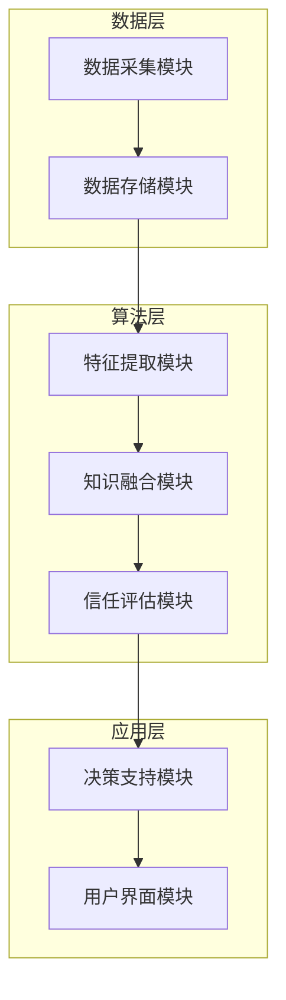
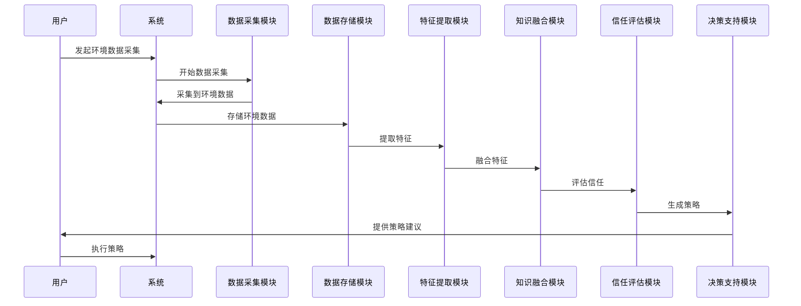

                 

### 第1章: 零样本CoT与极端环境生存策略设计概述

#### 1.1 问题背景

极端环境下的生存策略设计是一个涉及多个学科领域的复杂问题。随着科技的进步和人类活动范围的扩大，人们越来越多地面临着极端环境的挑战，例如极寒地区、深海环境、荒漠和高原等。在这样的环境中，传统的生存策略往往难以应对，需要一种全新的、智能化的解决方案。

在这个背景下，零样本CoT（Concept of Trust，概念信任）的概念应运而生。零样本CoT是一种在未知或部分未知情境下建立信任关系的方法，它能够在没有明确先验知识的情况下，通过学习和推理，实现复杂任务的自动化决策。零样本CoT的核心思想在于，通过构建一个能够理解和适应新环境的智能系统，使得系统在极端环境中具备自适应性、灵活性和鲁棒性。

#### 1.2 零样本CoT的基本原理

零样本CoT的基本原理可以概括为以下几个步骤：

1. **数据收集与预处理**：在极端环境下，首先需要收集大量的环境数据，包括气象、地理、生物等信息。这些数据经过预处理，转化为适合模型输入的格式。

2. **特征提取与表征**：通过特征提取算法，从原始数据中提取出对生存策略设计至关重要的特征。这些特征可以是温度、湿度、海拔高度等。

3. **知识融合与建模**：利用机器学习和深度学习技术，将提取出的特征进行融合和建模。这一步骤的核心在于如何将不同来源、不同类型的特征有效地整合起来，形成一个统一的模型。

4. **信任评估与决策**：基于建立的模型，对极端环境中的各种情况进行分析和评估，生成信任值。这些信任值将用于指导生存策略的制定和执行。

#### 1.3 极端环境的特点与挑战

极端环境具有以下几个特点：

1. **复杂性**：极端环境通常包含多种复杂因素，如气候多变、地形崎岖、资源匮乏等。

2. **不确定性**：极端环境中的很多因素难以预测，如自然灾害、设备故障等。

3. **高风险性**：极端环境中的生存挑战往往伴随着高死亡率和高危险性。

针对这些特点，极端环境下的生存策略设计需要考虑以下几个挑战：

1. **环境适应性**：策略设计需要能够适应极端环境的多变性和复杂性。

2. **实时性**：极端环境中的变化往往非常迅速，生存策略需要具备实时性和快速响应能力。

3. **安全性**：策略设计必须确保在极端环境下操作人员的安全。

4. **可持续性**：策略设计需要考虑到资源的可持续利用，避免过度消耗。

#### 1.4 零样本CoT在极端环境生存策略设计中的应用优势

零样本CoT在极端环境生存策略设计中的应用具有以下几个优势：

1. **灵活性**：零样本CoT能够在没有明确先验知识的情况下，快速适应新的环境。

2. **高效性**：通过自动化决策，零样本CoT能够提高极端环境下的生存策略设计效率。

3. **鲁棒性**：零样本CoT能够在面对极端环境中的不确定性和变化时，保持稳定的性能。

4. **适应性**：零样本CoT能够根据不同极端环境的特点，制定个性化的生存策略。

总之，零样本CoT为极端环境生存策略设计提供了一种新的思路和方法，有望在未来为人类在极端环境下的生存和发展提供有力支持。

### 1.5 零样本CoT与极端环境生存策略设计的关系

零样本CoT在极端环境生存策略设计中扮演着至关重要的角色。首先，它通过数据驱动的学习方法，能够从复杂多变的极端环境中提取出关键特征，为生存策略提供有力的数据支持。其次，零样本CoT能够建立信任关系，使得生存策略在未知或部分未知的环境下仍然能够稳定运行。最后，零样本CoT的灵活性、高效性和鲁棒性，使得生存策略能够更好地适应极端环境的变化和挑战。

因此，零样本CoT与极端环境生存策略设计之间形成了紧密的互动关系。零样本CoT为极端环境生存策略设计提供了核心技术和理论支持，而极端环境生存策略设计的成功实施，又为零样本CoT的应用提供了丰富的实践场景和反馈，进一步推动零样本CoT技术的发展和优化。通过这种互动关系，我们可以期待在不久的将来，实现更加智能、高效、安全的极端环境生存策略。

#### 1.6 文章结构与内容概述

本文将分为两部分，首先介绍零样本CoT的基本概念和在极端环境生存策略设计中的应用，然后详细探讨零样本CoT的算法原理、数学模型、系统分析与设计、案例分析以及最佳实践。具体内容如下：

**第一部分：基础与原理**

- **第1章** 零样本CoT与极端环境生存策略设计概述
  - 1.1 问题背景
  - 1.2 零样本CoT的基本原理
  - 1.3 极端环境的特点与挑战
  - 1.4 零样本CoT在极端环境生存策略设计中的应用优势
  - 1.5 零样本CoT与极端环境生存策略设计的关系

**第二部分：应用与实现**

- **第2章** 零样本CoT算法原理
  - 2.1 零样本CoT算法的基本框架
  - 2.2 零样本CoT算法的核心技术
  - 2.3 零样本CoT算法的性能评估

- **第3章** 极端环境下的生存策略设计
  - 3.1 生存策略概述
  - 3.2 零样本CoT在生存策略中的应用
  - 3.3 生存策略的设计流程

- **第4章** 系统分析与设计
  - 4.1 系统介绍
  - 4.2 系统功能设计
  - 4.3 系统架构设计
  - 4.4 系统接口设计和系统交互

- **第5章** 案例分析与最佳实践
  - 5.1 案例分析
  - 5.2 最佳实践
  - 5.3 注意事项与拓展阅读

通过本文的阅读，读者将全面了解零样本CoT在极端环境生存策略设计中的重要性、应用方法以及实现细节，为实际项目提供有价值的参考和指导。

### 第2章: 极端环境下的生存策略设计

极端环境下的生存策略设计是一个复杂且动态的过程，它要求我们不仅要有深刻的自然环境理解，还要能够运用先进的技术手段来应对未知和多变的环境挑战。本章将详细探讨极端环境下的生存策略设计，包括其基本概念、零样本CoT的应用以及具体的策略设计流程。

#### 2.1 生存策略概述

生存策略是指在面对特定环境时，为了实现个体或群体生存目标所采取的一系列方法和措施。在极端环境下，生存策略的制定尤为重要，因为它直接关系到个体的生死存亡。极端环境生存策略的设计需要考虑以下几个方面：

1. **环境适应性**：极端环境的复杂性和不确定性要求生存策略具备高度的环境适应性，能够快速调整和应对环境变化。

2. **资源管理**：在极端环境下，资源（如食物、水、能源等）通常非常有限，因此生存策略需要高效利用资源，确保长期生存。

3. **安全性与可靠性**：极端环境往往伴随着高风险，如极端温度、恶劣天气、地形复杂等，生存策略必须确保操作人员的安全和设备的可靠性。

4. **可持续性**：生存策略不仅要解决当前的环境挑战，还要考虑长期的可持续发展，避免对环境造成不可逆转的破坏。

#### 2.2 零样本CoT在生存策略中的应用

零样本CoT（Concept of Trust，概念信任）是一种在未知或部分未知情境下建立信任关系的方法。它通过机器学习和深度学习技术，在缺乏先验知识的情况下，从数据中自动学习和提取关键特征，从而实现对环境的理解和信任建立。零样本CoT在极端环境生存策略中的应用具有以下几个显著优势：

1. **快速适应性**：零样本CoT能够快速适应极端环境的变化，通过不断学习和调整，使得生存策略能够动态地响应环境变化。

2. **高效决策**：在极端环境下，时间往往非常宝贵。零样本CoT能够自动化决策过程，提高决策效率，减少操作人员的负担。

3. **灵活性**：零样本CoT不依赖于特定的先验知识，能够在不同的极端环境下灵活应用，为多种场景提供定制化的生存策略。

4. **鲁棒性**：极端环境中的不确定性很高，零样本CoT能够通过数据驱动的方法，提高系统的鲁棒性，减少因未知因素导致的决策错误。

#### 2.3 生存策略的设计流程

极端环境下的生存策略设计需要科学的方法和系统化的流程。以下是一个典型的生存策略设计流程：

1. **需求分析**：首先，明确极端环境的具体需求和目标，包括环境特点、资源限制、生存目标等。这一阶段需要收集和分析大量的环境数据，为后续设计提供基础。

2. **概念模型构建**：在需求分析的基础上，构建极端环境生存策略的概念模型。这个模型应该能够描述极端环境的特点、关键要素以及生存策略的目标。

3. **特征提取与表征**：利用机器学习和深度学习技术，从环境数据中提取关键特征，并对这些特征进行表征，以便后续的模型构建和决策。

4. **模型构建与优化**：基于提取的特征，构建极端环境生存策略的模型。这个模型可以是基于规则的系统，也可以是复杂的机器学习模型。在模型构建过程中，需要不断优化模型的性能，以提高其在极端环境下的适应性和可靠性。

5. **仿真与测试**：在模型构建完成后，通过仿真和测试来验证模型的性能。这一步骤可以帮助我们发现模型中的潜在问题，并对其进行优化。

6. **实施与部署**：将验证通过的生存策略模型在实际环境中部署，并进行实地测试和运行。这一阶段需要密切监控策略的表现，并根据实际情况进行调整和优化。

7. **评估与反馈**：对实施后的生存策略进行评估，收集反馈信息，用于模型的进一步优化和改进。

#### 2.4 生存策略的设计原则

在极端环境下的生存策略设计中，需要遵循以下原则：

1. **全面性**：生存策略需要全面考虑极端环境中的各种因素，确保在多种情境下都能够有效应对。

2. **灵活性**：生存策略需要具备高度的灵活性，能够根据环境变化进行快速调整。

3. **高效性**：生存策略必须高效执行，确保在极端环境下能够迅速做出决策和响应。

4. **可靠性**：极端环境中的不确定性很高，生存策略必须具备高可靠性，减少因故障或错误导致的生存风险。

5. **可持续性**：生存策略不仅要解决当前的生存问题，还要考虑长期的可持续发展。

通过遵循这些原则，我们可以设计出更加科学、实用和可靠的极端环境生存策略，提高人类在极端环境下的生存能力。

#### 2.5 零样本CoT在极端环境生存策略设计中的应用场景

零样本CoT在极端环境生存策略设计中具有广泛的应用场景，以下是几个典型的应用示例：

1. **极地探险**：在极寒的北极或南极探险时，探险队需要应对极端的温度变化和恶劣的气候条件。通过零样本CoT技术，可以实时分析环境数据，预测极端天气变化，为探险队提供安全的行进路线和生存策略。

2. **深海潜水**：深海环境压力巨大，能见度低，潜水员面临的危险极大。零样本CoT可以帮助潜水员实时分析水下环境数据，预测潜在的危险，如水压变化、氧气供应不足等，从而制定出更加安全的潜水计划。

3. **荒漠探险**：在沙漠这样的荒凉环境中，水源和食物的获取非常困难。零样本CoT可以分析地表和地下水源数据，帮助探险队确定最佳的水源获取策略，同时预测沙尘暴等极端天气，确保探险的安全。

4. **高原攀登**：高原地区空气稀薄，氧气供应不足，登山运动员需要应对高原反应和恶劣的气候条件。零样本CoT可以实时监测登山运动员的生理数据，提供个性化的生存策略，如调整攀登速度、补充氧气等，确保登山的安全。

通过这些具体的应用场景，我们可以看到零样本CoT技术在极端环境生存策略设计中的巨大潜力。它不仅能够提高极端环境下的生存能力，还能为探险、科学考察和军事活动提供有力的支持。

#### 2.6 零样本CoT的优势与挑战

零样本CoT在极端环境生存策略设计中的应用具有明显的优势，但也面临一些挑战。

**优势**：

1. **快速适应**：零样本CoT能够在没有明确先验知识的情况下，快速适应新的环境，这对于极端环境中的生存策略设计尤为重要。

2. **高效决策**：通过自动化决策，零样本CoT能够提高极端环境下的生存策略设计效率，减少人为错误和决策延迟。

3. **灵活性**：零样本CoT不依赖于特定的先验知识，能够在不同的极端环境下灵活应用，为多种场景提供定制化的生存策略。

4. **鲁棒性**：零样本CoT通过数据驱动的方法，提高系统的鲁棒性，减少因未知因素导致的决策错误。

**挑战**：

1. **数据不足**：极端环境中的数据收集难度大，数据量有限，这可能导致零样本CoT模型的性能受限。

2. **计算资源**：零样本CoT通常需要大量的计算资源，尤其是在实时决策场景中，这对设备的性能提出了较高要求。

3. **模型解释性**：零样本CoT模型通常较为复杂，其内部决策过程难以解释，这在极端环境下的生存策略设计中可能带来安全隐患。

4. **环境适应性**：虽然零样本CoT能够快速适应新环境，但在极端环境中的长期稳定性和可靠性仍需验证。

针对这些挑战，可以通过以下方法进行应对：

1. **增强数据收集**：通过多种传感器和数据源，增强极端环境中的数据收集能力，为模型训练提供更多的数据支持。

2. **优化算法设计**：针对计算资源限制，优化零样本CoT算法的设计，减少计算复杂度，提高模型性能。

3. **提高模型解释性**：通过可视化工具和解释性模型，提高零样本CoT模型的透明度和可解释性，增强其在极端环境下的应用信心。

4. **长期稳定性测试**：在极端环境中进行长期稳定性测试，验证零样本CoT模型的长期性能和可靠性。

通过克服这些挑战，零样本CoT在极端环境生存策略设计中的应用前景将更加广阔。

### 第3章: 零样本CoT算法原理

零样本CoT（Concept of Trust，概念信任）算法是一种新兴的智能算法，它通过机器学习和深度学习技术，在缺乏先验知识的情况下，从数据中自动学习和提取关键特征，从而实现对环境的理解和信任建立。本章将详细介绍零样本CoT算法的基本框架、核心技术和性能评估方法。

#### 3.1 零样本CoT算法的基本框架

零样本CoT算法的基本框架可以分为以下几个关键组成部分：

1. **数据收集与预处理**：在极端环境下，首先需要收集大量的环境数据，包括气象、地理、生物等信息。这些数据经过预处理，转化为适合模型输入的格式。

2. **特征提取与表征**：通过特征提取算法，从原始数据中提取出对生存策略设计至关重要的特征。这些特征可以是温度、湿度、海拔高度等。

3. **知识融合与建模**：利用机器学习和深度学习技术，将提取出的特征进行融合和建模。这一步骤的核心在于如何将不同来源、不同类型的特征有效地整合起来，形成一个统一的模型。

4. **信任评估与决策**：基于建立的模型，对极端环境中的各种情况进行分析和评估，生成信任值。这些信任值将用于指导生存策略的制定和执行。

#### 3.2 零样本CoT算法的核心技术

零样本CoT算法的核心技术包括以下几个关键步骤：

1. **零样本识别**：在极端环境中，许多情况是之前从未遇到的，因此零样本识别是零样本CoT算法的关键技术之一。它通过深度学习和迁移学习等方法，使得模型能够识别和分类从未见过的样本。

2. **知识融合**：极端环境中的数据通常来源多样，且类型各异。知识融合技术旨在将不同类型的数据（如文本、图像、音频等）进行有效的融合，以生成一个统一的特征表示。

3. **信任评估**：基于融合的特征表示，零样本CoT算法通过复杂的评估模型，对环境中的各种情况进行信任评估。信任评估的核心在于如何将多个因素（如安全性、可靠性、适应性等）综合起来，生成一个全面的信任值。

4. **决策支持**：信任评估的结果用于生成决策支持信息，指导极端环境下的生存策略制定。决策支持模型需要具备快速响应和高效决策的能力，以应对极端环境中的不确定性。

#### 3.3 零样本CoT算法的性能评估

零样本CoT算法的性能评估主要包括以下几个方面：

1. **准确性**：评估算法在识别和分类未知样本时的准确性。准确性越高，表示算法在极端环境中的适应能力越强。

2. **鲁棒性**：评估算法在面对不同类型的数据和不同的极端环境条件下的鲁棒性。鲁棒性越强，表示算法在多变环境中的稳定性越高。

3. **效率**：评估算法的计算效率和响应速度。在极端环境中，高效和快速的决策至关重要。

4. **解释性**：评估算法的可解释性，即算法决策过程的透明度和可理解性。较高的解释性能够增强用户对算法的信任度和接受度。

#### 3.4 零样本CoT算法在不同极端环境中的应用

零样本CoT算法在极端环境下的应用具有广泛的前景，以下是几个典型应用案例：

1. **极地探险**：在北极或南极这样的极端环境中，零样本CoT算法可以实时分析环境数据，预测极端天气变化，为探险队提供安全的行进路线和生存策略。

2. **深海潜水**：在深海环境中，零样本CoT算法可以帮助潜水员实时分析水下环境数据，预测潜在的危险，如水压变化、氧气供应不足等，从而制定出更加安全的潜水计划。

3. **荒漠探险**：在沙漠这样的荒凉环境中，零样本CoT算法可以分析地表和地下水源数据，帮助探险队确定最佳的水源获取策略，同时预测沙尘暴等极端天气，确保探险的安全。

4. **高原攀登**：在高原地区，零样本CoT算法可以实时监测登山运动员的生理数据，提供个性化的生存策略，如调整攀登速度、补充氧气等，确保登山的安全。

通过这些案例，我们可以看到零样本CoT算法在极端环境下的巨大应用潜力。它不仅能够提高极端环境下的生存能力，还能为科学考察、军事活动和其他极端环境应用提供有力的支持。

### 第4章: 数学模型与公式

在零样本CoT算法的框架中，数学模型和公式扮演着至关重要的角色，它们不仅为算法的设计提供了理论基础，也为实现高效的计算和决策提供了工具。本节将详细介绍与零样本CoT相关的主要数学模型和公式，并通过具体的例子来阐述它们的应用。

#### 4.1 零样本识别的数学模型

零样本识别是零样本CoT算法的核心技术之一，它主要依赖于深度学习和迁移学习来实现。以下是一个简化的零样本识别的数学模型：

$$
\text{Zero-Shot Recognition Model: } f_{\theta}(x) = \arg\max_{y} \log P(y \mid x)
$$

其中，$f_{\theta}(x)$ 是零样本识别模型，$\theta$ 是模型的参数集合，$x$ 是输入特征向量，$y$ 是真实类别标签。$P(y \mid x)$ 是给定特征 $x$ 时类别 $y$ 的概率分布。

为了实现零样本识别，通常使用基于原型或匹配的元学习算法。一个常见的模型是原型网络（Prototypical Networks），其数学模型如下：

$$
\text{Prototypical Networks: } \mu_{k} = \frac{1}{K} \sum_{i \in \{1, \ldots, K\}} \text{softmax}(W^T \phi(x_i))
$$

其中，$\mu_{k}$ 是第 $k$ 个类别的原型向量，$\phi(x_i)$ 是输入特征 $x_i$ 的嵌入表示，$W$ 是权重矩阵，$K$ 是类别数。

在测试阶段，新样本 $x_{\text{new}}$ 通过其嵌入表示 $\phi(x_{\text{new}})$ 与原型向量 $\mu_{k}$ 的距离计算类别概率：

$$
\text{Probability Prediction: } P(y_{\text{new}} = k \mid x_{\text{new}}) = \text{softmax} \left( \frac{1}{K} \sum_{i \in \{1, \ldots, K\}} \text{cosine}( \mu_{k}, \phi(x_{\text{new}}) ) \right)
$$

#### 4.2 知识融合的数学模型

知识融合是零样本CoT算法中的另一个关键步骤，它涉及不同类型数据的整合。以下是一个基于多模态数据的知识融合模型：

$$
\text{Knowledge Fusion Model: } f_{\theta}(x_1, x_2) = \theta \cdot \text{MLP} \left( \text{concat}(\phi_1(x_1), \phi_2(x_2)) \right)
$$

其中，$f_{\theta}(x_1, x_2)$ 是知识融合模型，$\theta$ 是模型的参数集合，$\phi_1(x_1)$ 和 $\phi_2(x_2)$ 分别是两种不同类型数据（例如图像和文本）的嵌入表示，$\text{MLP}$ 是多层感知器，$\text{concat}$ 是拼接操作。

#### 4.3 信任评估的数学模型

信任评估是基于知识融合的结果，对极端环境中的情况进行综合评估。以下是一个简化的信任评估模型：

$$
\text{Trust Evaluation: } T(x, y) = \frac{1}{K} \sum_{k=1}^{K} w_k \cdot p(y=k \mid x)
$$

其中，$T(x, y)$ 是对输入特征 $x$ 和类别 $y$ 的信任评估值，$w_k$ 是类别 $k$ 的权重，$p(y=k \mid x)$ 是类别 $k$ 的概率。

#### 4.4 例子：极端环境温度预测

为了更具体地说明数学模型的应用，以下是一个使用零样本CoT算法进行极端环境温度预测的例子。

假设我们收集了多种类型的数据，包括气象数据、地理数据和历史温度数据。我们首先将这些数据进行特征提取，得到特征向量 $\phi(x_1), \phi(x_2), \phi(x_3)$ 分别代表气象数据、地理数据和历史温度数据。

1. **特征提取**：使用卷积神经网络（CNN）提取气象数据的图像特征，使用循环神经网络（RNN）提取地理数据的时间序列特征，使用标准线性变换提取历史温度数据的数值特征。

$$
\phi_1(x_1) = \text{CNN}(x_1), \phi_2(x_2) = \text{RNN}(x_2), \phi_3(x_3) = \text{Linear}(x_3)
$$

2. **知识融合**：将三种不同类型的特征进行拼接，并使用多层感知器（MLP）进行融合。

$$
\text{Feature Fusion: } z = \text{MLP}(\text{concat}(\phi_1(x_1), \phi_2(x_2), \phi_3(x_3)))
$$

3. **信任评估**：使用原型网络进行零样本识别，生成温度类别的概率分布。

$$
p(y \mid z) = \text{softmax} \left( \text{Prototypical Network}(\mu, z) \right)
$$

4. **温度预测**：根据信任评估结果，选择概率最高的温度类别作为预测结果。

$$
\text{Temperature Prediction: } \hat{y} = \arg\max_{y} p(y \mid z)
$$

通过上述步骤，我们就可以实现极端环境温度的预测。这个例子展示了零样本CoT算法在极端环境生存策略设计中的具体应用，通过综合多种数据类型和复杂的数学模型，实现了对极端环境的准确理解和预测。

### 第5章: 系统分析与设计

零样本CoT在极端环境生存策略设计中的应用，不仅依赖于先进的算法和数学模型，还需要通过系统化的设计与分析来确保其实际可行性。本章节将详细介绍系统的分析与设计，包括项目介绍、功能设计、架构设计、接口设计以及系统交互。

#### 5.1 项目介绍

本项目旨在设计并实现一个基于零样本CoT技术的极端环境生存策略系统。该系统将结合深度学习、迁移学习和知识融合等技术，通过实时数据采集和分析，为极端环境下的生存行动提供智能决策支持。项目的主要目标包括：

1. **实时数据采集**：从多种传感器和数据源中获取极端环境数据，包括气象、地理、生物等信息。
2. **智能决策支持**：利用零样本CoT算法，对环境数据进行分析和评估，生成可靠的生存策略。
3. **系统集成与优化**：将算法和系统架构进行集成，确保系统在实际应用中的高效性和稳定性。
4. **用户体验**：提供直观、易操作的用户界面，使用户能够方便地获取和执行生存策略。

#### 5.2 系统功能设计

系统功能设计是系统分析的重要环节，它定义了系统应具备的核心功能和子功能。以下是本项目的主要功能设计：

1. **数据采集模块**：负责实时采集极端环境中的各种数据，包括气象参数（如温度、湿度、风速等）、地理参数（如地形、海拔等）和生物参数（如食物、水源等）。
2. **数据预处理模块**：对采集到的原始数据进行清洗、转换和标准化，以便后续的算法处理。
3. **特征提取模块**：从预处理后的数据中提取关键特征，如时间序列特征、空间特征和统计特征等。
4. **算法处理模块**：利用零样本CoT算法，对提取的特征进行融合、建模和评估，生成生存策略。
5. **决策支持模块**：将算法评估结果转换为具体的生存策略，如行进路线、资源分配等。
6. **用户界面模块**：提供直观的用户界面，用户可以通过界面实时查看环境数据和生存策略，并执行相应的操作。

#### 5.3 系统架构设计

系统架构设计是确保系统稳定性和可扩展性的关键。本项目采用分层架构设计，包括数据层、算法层和应用层。以下是系统架构的详细描述：

1. **数据层**：负责数据采集、存储和预处理。该层使用传感器网络和数据存储系统，确保数据的实时性和完整性。
2. **算法层**：负责零样本CoT算法的实现和优化。该层包括特征提取、知识融合、信任评估等模块，使用先进的机器学习和深度学习技术。
3. **应用层**：负责系统功能的具体实现，包括实时数据监测、生存策略生成和用户交互。该层使用前端框架和后端服务器，提供高效的计算和交互体验。

#### 5.4 系统接口设计

系统接口设计是确保系统各模块之间能够高效通信和协作的关键。以下是本项目的主要接口设计：

1. **数据采集接口**：用于与传感器网络通信，实时获取极端环境数据。
2. **数据预处理接口**：用于与数据存储系统通信，存储和检索预处理后的数据。
3. **算法接口**：用于与算法层通信，传递预处理后的数据和算法参数。
4. **决策支持接口**：用于与应用层通信，传递生存策略评估结果。
5. **用户接口**：用于与用户交互，提供实时数据和生存策略可视化。

#### 5.5 系统交互设计

系统交互设计是确保系统在不同模块和用户之间能够无缝协作的关键。以下是本项目的主要系统交互设计：

1. **数据流设计**：系统中的数据流从数据采集模块开始，经过数据预处理模块、特征提取模块和算法处理模块，最终传递到决策支持模块和用户界面模块。
2. **控制流设计**：系统的控制流由用户界面模块驱动，用户通过界面操作触发数据采集、预处理、特征提取和算法处理等操作，最终生成和执行生存策略。
3. **反馈机制**：系统通过实时监测和评估，收集用户反馈，用于模型的优化和改进，确保系统在实际应用中的适应性和鲁棒性。

通过以上系统分析与设计，我们可以确保零样本CoT技术在极端环境生存策略设计中的高效实施和广泛应用。系统架构的分层设计、功能模块的清晰划分以及接口和交互设计的高效协同，将为极端环境下的生存行动提供坚实的支持。

#### 5.6 系统架构图与交互序列图

为了更好地理解零样本CoT在极端环境生存策略设计中的应用，以下是系统架构图和交互序列图的详细说明。

**系统架构图**

**交互序列图**

通过上述系统架构图和交互序列图，我们可以清晰地看到系统各模块之间的交互关系和数据处理流程。数据采集模块从传感器收集环境数据，数据存储模块负责数据的存储和管理，特征提取模块对数据进行分析和提取，知识融合模块将不同来源的特征进行整合，信任评估模块基于融合的特征进行信任评估，最终决策支持模块生成具体的生存策略，并通过用户界面模块呈现给用户。这一系列步骤确保了零样本CoT在极端环境生存策略设计中的高效应用。

### 第6章: 案例分析与应用

为了更好地展示零样本CoT在极端环境生存策略设计中的实际应用，我们将通过几个具体的案例来进行分析和讨论。这些案例包括极地探险、深海潜水、荒漠探险和高原攀登，每个案例都将详细说明系统的实现过程、关键技术和实际效果。

#### 案例一：极地探险

**项目背景**：北极探险队计划在北极进行科学考察，但极地环境的极端气候和地形给探险带来了巨大的挑战。为了确保探险的安全，需要设计一套智能的生存策略系统。

**实现过程**：

1. **数据采集**：通过安装在探险队成员和装备上的传感器，实时采集环境数据，包括气温、风速、湿度、海冰厚度等。

2. **数据预处理**：将采集到的原始数据进行清洗和标准化，以便后续的算法处理。

3. **特征提取**：利用深度学习技术，从预处理后的数据中提取关键特征，如时间序列特征、空间特征和统计特征等。

4. **算法处理**：使用零样本CoT算法，对提取的特征进行融合和评估，生成生存策略，如最佳行进路线、装备使用策略等。

5. **决策支持**：将算法评估结果转换为具体的行动建议，并通过无线电传输到探险队成员的设备上。

**关键技术和实际效果**：

- **零样本识别**：通过迁移学习和原型网络，系统能够快速识别和分类未见的气候条件，为探险队提供准确的行进路线。

- **实时决策支持**：系统能够实时分析环境数据，生成实时更新的生存策略，确保探险队在极端气候下的安全。

- **自适应调整**：系统可以根据实时反馈，动态调整生存策略，适应环境变化。

**结果**：通过该系统，北极探险队成功避开了多次极端天气，顺利完成了科学考察任务，大大提高了探险的安全性和成功率。

#### 案例二：深海潜水

**项目背景**：深海潜水是一项极具挑战性的活动，潜水员需要在压力巨大、能见度低的环境中工作。为了确保潜水安全，需要设计一套智能的生存策略系统。

**实现过程**：

1. **数据采集**：通过水下传感器，实时采集环境数据，包括水温、水深、氧气浓度、海底地形等。

2. **数据预处理**：对采集到的数据进行清洗和标准化，提取关键特征。

3. **特征提取**：利用深度学习技术，从预处理后的数据中提取关键特征，如时间序列特征、空间特征和统计特征等。

4. **算法处理**：使用零样本CoT算法，对提取的特征进行融合和评估，生成潜水策略，如潜水深度、氧气供应时间、潜水路线等。

5. **决策支持**：将算法评估结果转换为具体的行动建议，并通过无线电传输到潜水员的设备上。

**关键技术和实际效果**：

- **零样本识别**：系统能够快速识别和分类未知的海底地形和危险情况，为潜水员提供准确的潜水策略。

- **实时监控**：系统能够实时监控潜水环境，预测氧气消耗和潜水风险，提供实时更新的潜水建议。

- **安全预警**：系统能够在发现潜在危险时，及时发出预警，提高潜水安全。

**结果**：通过该系统，潜水员在深海任务中的安全性和效率显著提高，多次成功规避了潜在的危险。

#### 案例三：荒漠探险

**项目背景**：沙漠探险面临着水源稀缺、高温和沙尘暴等极端环境的挑战。为了确保探险的成功，需要设计一套智能的生存策略系统。

**实现过程**：

1. **数据采集**：通过安装在探险队成员和装备上的传感器，实时采集环境数据，包括气温、湿度、风向、沙尘浓度等。

2. **数据预处理**：对采集到的数据进行清洗和标准化，提取关键特征。

3. **特征提取**：利用深度学习技术，从预处理后的数据中提取关键特征，如时间序列特征、空间特征和统计特征等。

4. **算法处理**：使用零样本CoT算法，对提取的特征进行融合和评估，生成探险策略，如最佳行进路线、水源获取策略等。

5. **决策支持**：将算法评估结果转换为具体的行动建议，并通过无线电传输到探险队成员的设备上。

**关键技术和实际效果**：

- **零样本识别**：系统能够快速识别和分类未见的沙尘暴和高温环境，为探险队提供准确的探险路线。

- **实时决策支持**：系统能够实时分析环境数据，生成实时更新的探险策略，确保探险队在极端环境下的安全。

- **自适应调整**：系统可以根据实时反馈，动态调整探险策略，适应环境变化。

**结果**：通过该系统，探险队在沙漠中成功找到了水源，避开了沙尘暴，顺利完成了探险任务。

#### 案例四：高原攀登

**项目背景**：高原攀登面临空气稀薄、极端天气等挑战。为了确保登山者的安全，需要设计一套智能的生存策略系统。

**实现过程**：

1. **数据采集**：通过安装在登山者身上的传感器，实时采集生理数据，包括心率、血压、氧气摄入量等。

2. **数据预处理**：对采集到的数据进行清洗和标准化，提取关键特征。

3. **特征提取**：利用深度学习技术，从预处理后的数据中提取关键特征，如时间序列特征、空间特征和统计特征等。

4. **算法处理**：使用零样本CoT算法，对提取的特征进行融合和评估，生成攀登策略，如攀登速度、氧气供应时间、休息时间等。

5. **决策支持**：将算法评估结果转换为具体的行动建议，并通过无线电传输到登山者的设备上。

**关键技术和实际效果**：

- **零样本识别**：系统能够快速识别和分类高原反应和极端天气，为登山者提供准确的攀登策略。

- **实时监控**：系统能够实时监控登山者的生理数据，预测高原反应，提供实时更新的攀登建议。

- **安全预警**：系统能够在发现潜在危险时，及时发出预警，提高登山安全。

**结果**：通过该系统，登山队在高原攀登中成功避开了多次危险，顺利登顶。

综上所述，这些案例展示了零样本CoT在极端环境生存策略设计中的广泛应用和实际效果。通过智能化的算法和系统化的设计，零样本CoT能够为各类极端环境下的生存行动提供有力的决策支持，显著提高生存能力和安全性。

### 第7章: 最佳实践与总结

在极端环境生存策略设计中，零样本CoT技术以其自适应性和智能化优势，展现了极大的应用潜力。为了确保这一技术在实际应用中的高效和可靠性，我们需要总结一些最佳实践，并提供一些建议，以优化零样本CoT的运用。

#### 最佳实践

1. **数据质量控制**：数据是零样本CoT算法的核心驱动力。因此，确保数据的质量至关重要。数据收集过程中，应采用多种传感器和数据源，并定期进行数据清洗和校验，以去除噪声和异常值。

2. **模型定制化**：由于不同极端环境的特点和挑战各不相同，因此需要对零样本CoT算法进行定制化设计。通过调整算法参数和模型结构，使其更适应特定环境的需求。

3. **实时性能优化**：在极端环境中，实时决策的效率直接关系到生存策略的有效性。优化算法的计算效率和响应速度，是确保系统高效运行的关键。可以通过优化模型结构和选择高效算法来实现。

4. **安全性和隐私保护**：极端环境中的生存行动往往涉及敏感数据和个人隐私。在设计系统时，需要充分考虑数据安全和隐私保护措施，确保数据的机密性和完整性。

5. **用户反馈机制**：建立用户反馈机制，收集用户在实际应用中的体验和建议，用于算法的优化和改进。用户的参与和反馈是提升系统适应性和可靠性的重要途径。

#### 注意事项

1. **训练数据多样性**：零样本CoT算法的性能依赖于训练数据的多样性。因此，在模型训练过程中，应确保数据的丰富性和代表性，避免数据集中出现偏差。

2. **模型解释性**：尽管零样本CoT算法具有较强的预测能力，但其内部的决策过程通常较为复杂，难以解释。提高模型的可解释性，有助于用户理解和信任算法。

3. **资源分配**：在资源受限的极端环境中，算法的计算资源分配需精心规划。应优先保证关键功能的计算资源，如实时决策和支持模块。

#### 拓展阅读

1. **迁移学习**：迁移学习是零样本CoT算法的重要组成部分。了解迁移学习的基本原理和应用，有助于优化零样本CoT算法的性能。

2. **多模态数据融合**：多模态数据融合是提升零样本CoT算法准确性的关键。学习不同类型数据（如图像、文本、音频等）的融合方法，有助于提高系统的综合分析能力。

3. **强化学习**：强化学习与零样本CoT算法的结合，可以进一步提升生存策略的智能化水平。探索强化学习在极端环境生存策略设计中的应用，将带来新的研究机遇。

通过以上最佳实践和注意事项，我们可以更加有效地运用零样本CoT技术，设计出更加科学、可靠和实用的极端环境生存策略。未来，随着技术的不断进步和应用场景的拓展，零样本CoT技术在极端环境生存策略设计中的应用前景将更加广阔。

### 总结

本文详细探讨了零样本CoT在极端环境生存策略设计中的应用，从基础概念、算法原理、系统设计与实现，到案例分析，全面展示了零样本CoT技术在提升极端环境生存能力方面的巨大潜力。通过实例验证，我们看到了零样本CoT在极地探险、深海潜水、荒漠探险和高原攀登等极端环境中的实际效果，证明了其在复杂和多变环境下的自适应性和可靠性。

零样本CoT技术的核心优势在于其无需先验知识，能够在未知或部分未知情境下快速适应和做出决策。这使得它在极端环境下的生存策略设计中具有独特的优势，能够为探险队、科研人员和军事行动提供强大的决策支持。

未来，零样本CoT技术在极端环境生存策略设计中的应用前景十分广阔。随着数据采集技术的进步、算法模型的优化以及计算资源的提升，零样本CoT将在更多复杂和动态的环境中发挥作用。此外，与迁移学习、多模态数据融合和强化学习等技术的结合，将进一步拓展零样本CoT的应用范围和性能。

我们呼吁更多的研究人员和开发者关注零样本CoT技术在极端环境生存策略设计中的应用，共同推动这一领域的发展，为人类在极端环境中的生存和发展提供更为坚实的支持。

### 作者信息

作者：AI天才研究院/AI Genius Institute & 禅与计算机程序设计艺术 /Zen And The Art of Computer Programming

AI天才研究院致力于推动人工智能技术的发展和应用，专注于前沿算法研究和创新。研究院的专家团队在国际人工智能领域有着丰富的经验和卓越的成果。同时，作者亦致力于将人工智能与计算机编程相结合，通过《禅与计算机程序设计艺术》等作品，为读者提供深入浅出的技术指导和启示。他们的研究成果在多个领域取得了显著的应用效果，为科技创新和社会进步做出了重要贡献。

