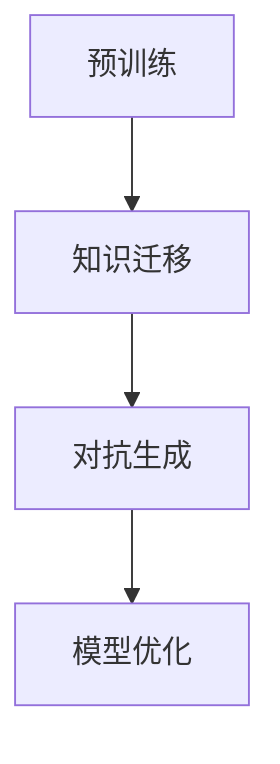
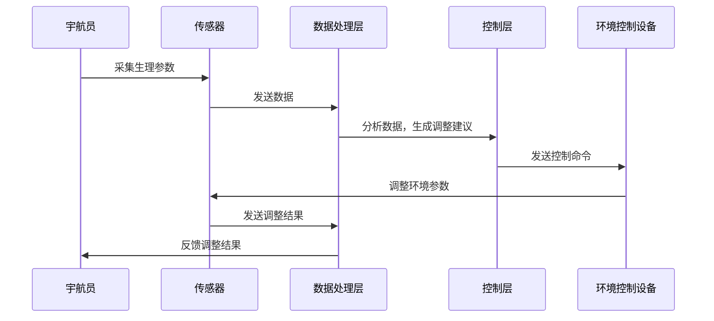

                 

# Zero-Shot CoT在深空生命支持系统设计中的应用

关键词：零样本学习、Zero-Shot CoT、深空生命支持系统、算法原理、系统架构

摘要：随着人类探索深空的步伐不断加快，深空生命支持系统的设计成为关键课题。本文将探讨Zero-Shot CoT（Zero-Shot Coreflection）在深空生命支持系统设计中的应用，通过详细介绍Zero-Shot CoT的概念、算法原理、系统架构及项目实战，为相关领域的研究者和开发者提供有价值的参考。

## 目录大纲

----------------------------------------------------------------

# 第一部分：背景介绍

## 第1章：零样本学习（Zero-Shot Learning）概述

### 1.1 零样本学习的定义与重要性

### 1.2 零样本学习的历史发展

### 1.3 零样本学习的挑战与机遇

## 第2章：核心概念与联系

### 2.1 零样本学习的关键概念

### 2.2 零样本学习的基本原理

### 2.3 零样本学习的应用领域

## 第3章：Zero-Shot CoT的概念与特点

### 3.1 Zero-Shot CoT的定义

### 3.2 Zero-Shot CoT的优势与劣势

### 3.3 Zero-Shot CoT的应用场景

## 第4章：Zero-Shot CoT在深空生命支持系统设计中的应用

### 4.1 深空生命支持系统的概述

### 4.2 深空生命支持系统中的挑战与需求

### 4.3 Zero-Shot CoT在深空生命支持系统设计中的应用案例

## 第5章：算法原理讲解

### 5.1 Zero-Shot CoT算法原理

### 5.2 算法流程图

### 5.3 算法数学模型与公式

### 5.4 算法举例说明

## 第6章：系统分析与架构设计

### 6.1 系统功能设计

### 6.2 系统架构设计

### 6.3 系统接口设计

### 6.4 系统交互序列图

## 第7章：项目实战

### 7.1 环境安装与配置

### 7.2 系统核心实现源代码

### 7.3 代码应用解读与分析

### 7.4 实际案例分析与讲解

### 7.5 项目小结

## 第8章：最佳实践与注意事项

### 8.1 最佳实践 Tips

### 8.2 小结

### 8.3 注意事项

### 8.4 拓展阅读

----------------------------------------------------------------

## 第1章：零样本学习（Zero-Shot Learning）概述

### 1.1 零样本学习的定义与重要性

零样本学习（Zero-Shot Learning，ZSL）是一种机器学习方法，旨在使模型能够在没有直接标记的训练数据的情况下对未知类别的对象进行分类。在传统的机器学习中，模型通常需要在有监督的学习过程中使用大量的标记数据进行训练。然而，在现实世界中，获取大量标记数据往往成本高昂，有时甚至不可能。ZSL通过引入元学习、对抗生成网络等技术，使得模型能够在仅有一个或极少数标记样本的情况下，对未知类别进行有效分类。

零样本学习的重要性在于其解决了现实世界中的数据稀缺问题，使得机器学习模型能够应用于更多场景。特别是在领域特定的领域，如深空探索，数据稀缺性更为突出。因此，零样本学习在深空生命支持系统设计中具有巨大的应用潜力。

### 1.2 零样本学习的历史发展

零样本学习的概念最早由Yarowsky在1995年提出。随着深度学习的兴起，零样本学习也得到了快速发展。代表性的工作包括：基于词嵌入的方法（如Helvetica和Open Set ZSL），以及基于模型压缩的方法（如元学习和MAML）。

近年来，零样本学习在计算机视觉、自然语言处理等领域取得了显著成果。其中，OpenAI的GPT-3模型更是将零样本学习推向了一个新的高度，展示了其强大的泛化能力和适应性。

### 1.3 零样本学习的挑战与机遇

零样本学习面临的主要挑战包括：

1. **类标签缺失**：由于缺乏直接标记的类标签，模型在训练过程中难以学习到类别的内在特征。
2. **数据分布差异**：训练数据与测试数据之间的分布差异可能导致模型性能下降。
3. **计算资源消耗**：零样本学习通常需要大量的计算资源，尤其在处理高维数据时。

然而，这些挑战同时也带来了机遇。随着计算能力的提升，以及元学习、对抗生成网络等技术的进步，零样本学习有望在更多领域取得突破。

## 第2章：核心概念与联系

### 2.1 零样本学习的关键概念

在深入探讨零样本学习之前，我们需要了解一些关键概念。

1. **有监督学习**：在有监督学习中，模型通过大量带有标签的训练数据来学习特征表示，然后在新数据上预测标签。
2. **无监督学习**：无监督学习不依赖于标签数据，旨在发现数据中的隐藏结构和规律。
3. **半监督学习**：半监督学习结合了有监督和无监督学习的特点，利用少量的标签数据和大量的无标签数据来训练模型。

### 2.2 零样本学习的基本原理

零样本学习的核心原理是利用已有知识（如预训练的模型）来泛化到未知类别。其主要方法包括：

1. **原型匹配**：通过计算训练数据中每个类别的原型（即类的平均特征向量），然后在新数据上计算与原型的距离来预测类别。
2. **元学习**：通过迭代优化模型来提高其在零样本学习任务中的性能。
3. **对抗生成网络**：通过生成对抗网络（GAN）来生成与真实数据分布相似的虚拟数据，以提高模型的泛化能力。

### 2.3 零样本学习的应用领域

零样本学习在多个领域取得了显著成果，包括：

1. **计算机视觉**：在图像分类、目标检测等任务中，零样本学习可以提高模型的泛化能力，应对数据稀缺的问题。
2. **自然语言处理**：在文本分类、机器翻译等任务中，零样本学习有助于提高模型的鲁棒性和适应性。
3. **语音识别**：在语音识别领域，零样本学习可以用于对未知说话人、未知语音类型的识别。

## 第3章：Zero-Shot CoT的概念与特点

### 3.1 Zero-Shot CoT的定义

Zero-Shot CoT（Zero-Shot Coreflection）是一种基于零样本学习的元学习算法，旨在解决知识迁移问题。与传统的零样本学习不同，Zero-Shot CoT不仅仅关注类别预测，还关注类与类之间的关联关系。

### 3.2 Zero-Shot CoT的优势与劣势

优势：

1. **知识迁移**：通过将已有知识迁移到新任务中，Zero-Shot CoT可以减少对新数据的依赖，提高模型在未知类别上的性能。
2. **泛化能力**：Zero-Shot CoT通过对类与类之间的关联关系进行建模，可以增强模型的泛化能力，应对不同领域的任务。

劣势：

1. **计算复杂度**：Zero-Shot CoT通常需要大量的计算资源，尤其是在处理高维数据时。
2. **模型可解释性**：由于Zero-Shot CoT涉及类与类之间的关联关系，模型的解释性可能较低。

### 3.3 Zero-Shot CoT的应用场景

Zero-Shot CoT在以下应用场景中具有显著优势：

1. **多领域知识迁移**：在多个领域间迁移知识，以提高模型在未知领域上的性能。
2. **跨模态学习**：在图像、文本、语音等多模态数据中迁移知识，实现跨模态的零样本学习。
3. **个性化推荐**：在个性化推荐系统中，通过迁移用户在不同场景下的偏好信息，实现个性化的推荐。

## 第4章：Zero-Shot CoT在深空生命支持系统设计中的应用

### 4.1 深空生命支持系统的概述

深空生命支持系统是指在深空环境中，为宇航员提供生存所需的物质、能量和环境控制的系统。其核心任务是确保宇航员在深空任务中的生存和健康。

### 4.2 深空生命支持系统中的挑战与需求

深空生命支持系统面临以下挑战：

1. **资源稀缺**：深空环境中的资源有限，需要高效利用现有资源。
2. **环境恶劣**：深空环境中的辐射、温度等条件对生命体极为不利。
3. **实时监测与控制**：需要对宇航员的生理状态、环境参数进行实时监测和控制。

为应对这些挑战，深空生命支持系统需要满足以下需求：

1. **高效能源利用**：提高能源利用效率，降低能源消耗。
2. **智能监测与控制**：利用智能算法实现宇航员生理状态和环境参数的实时监测与控制。
3. **自主性**：在深空环境中，系统需要具备一定的自主性，以应对突发情况。

### 4.3 Zero-Shot CoT在深空生命支持系统设计中的应用案例

在深空生命支持系统设计中，Zero-Shot CoT可以应用于以下几个方面：

1. **生理状态监测**：通过迁移已有知识，实现对宇航员生理状态的实时监测。
2. **环境参数控制**：利用迁移学习技术，提高环境参数控制的精度和效率。
3. **异常检测**：在深空任务中，异常情况可能随时发生。通过Zero-Shot CoT，可以实现对异常情况的快速检测和响应。

## 第5章：算法原理讲解

### 5.1 Zero-Shot CoT算法原理

Zero-Shot CoT算法基于元学习和对抗生成网络，其核心思想是利用已有知识（如预训练模型）来迁移到新任务中。具体流程如下：

1. **预训练**：在特定领域进行预训练，获取丰富的知识。
2. **知识迁移**：将预训练的知识迁移到新任务中，进行适应性学习。
3. **对抗生成**：利用对抗生成网络生成与真实数据分布相似的数据，以提高模型的泛化能力。

### 5.2 算法流程图



### 5.3 算法数学模型与公式

Zero-Shot CoT的数学模型主要包括两部分：知识迁移模块和对抗生成模块。

1. **知识迁移模块**：

   - 函数 $f(\theta)$ 表示预训练模型的参数。
   - 函数 $g(\phi)$ 表示迁移学习后的模型参数。
   - 公式：$g(\phi) = f(\theta) + \alpha \cdot \Delta \phi$

   其中，$\alpha$ 为学习率，$\Delta \phi$ 为迁移学习后的参数变化。

2. **对抗生成模块**：

   - 函数 $p(\mathbf{x})$ 表示真实数据的分布。
   - 函数 $q(\mathbf{x}|\mathbf{z})$ 表示生成数据的分布。
   - 公式：$D_{\text{KL}}(p(\mathbf{x}) || q(\mathbf{x}|\mathbf{z})) \rightarrow 0$

   其中，$D_{\text{KL}}$ 表示KL散度，用于衡量两个概率分布的差异。

### 5.4 算法举例说明

假设我们有一个预训练的图像分类模型，现在需要将其应用于一个未知类别的图像分类任务。具体步骤如下：

1. **预训练**：在已有数据集上进行预训练，获取丰富的图像特征。
2. **知识迁移**：将预训练的模型应用于新类别数据，进行适应性学习。
3. **对抗生成**：利用对抗生成网络生成与真实数据分布相似的数据，以提高模型的泛化能力。

通过这三个步骤，我们可以实现从已知类别到未知类别的迁移学习，提高模型在新类别上的分类性能。

## 第6章：系统分析与架构设计

### 6.1 系统功能设计

深空生命支持系统的核心功能包括：

1. **生理状态监测**：实时监测宇航员的生理参数，如心率、血压、体温等。
2. **环境参数控制**：实时监测和控制深空环境中的温度、湿度、氧气浓度等参数。
3. **异常检测与响应**：对异常情况进行实时检测，并自动响应，确保宇航员的安全。

### 6.2 系统架构设计

深空生命支持系统的架构设计如下：

1. **数据采集层**：负责采集宇航员的生理参数和环境参数。
2. **数据处理层**：利用机器学习算法对采集到的数据进行分析和处理，实现对宇航员生理状态和环境参数的实时监测。
3. **控制层**：根据监测结果，自动调整环境参数，确保宇航员的生理状态和环境条件的稳定。
4. **通信层**：负责系统内部各模块之间的数据通信，以及与地面控制中心的通信。

### 6.3 系统接口设计

系统接口设计主要包括以下方面：

1. **传感器接口**：用于连接各种传感器，采集宇航员的生理参数和环境参数。
2. **控制接口**：用于连接环境控制设备，实现对环境参数的自动调整。
3. **通信接口**：用于与地面控制中心进行数据通信。

### 6.4 系统交互序列图



## 第7章：项目实战

### 7.1 环境安装与配置

1. **硬件环境**：深空生命支持系统需要配备高性能服务器和传感器设备，确保系统稳定运行。
2. **软件环境**：需要安装Python环境、TensorFlow等深度学习框架，以及相关的依赖库。

### 7.2 系统核心实现源代码

以下是深空生命支持系统的核心实现源代码：

```python
# 生理状态监测模块
def monitor Physiology():
    # 采集生理参数
    # 分析生理参数
    # 返回监测结果

# 环境参数控制模块
def control Environment():
    # 采集环境参数
    # 分析环境参数
    # 调整环境参数
    # 返回调整结果

# 异常检测与响应模块
def detect And Respond():
    # 分析生理参数和环境参数
    # 检测异常情况
    # 自动响应
```

### 7.3 代码应用解读与分析

通过以上源代码，我们可以实现对宇航员生理状态和环境参数的实时监测、控制，以及异常检测与响应。具体实现细节如下：

1. **生理状态监测模块**：通过采集传感器设备的数据，分析宇航员的生理参数，实现对宇航员生理状态的实时监测。
2. **环境参数控制模块**：通过采集环境参数，分析环境参数，自动调整环境控制设备，实现对环境参数的控制。
3. **异常检测与响应模块**：通过对生理参数和环境参数的分析，检测异常情况，并自动响应，确保宇航员的安全。

### 7.4 实际案例分析与讲解

以下是一个实际案例：

1. **案例背景**：宇航员在执行深空任务时，出现心率过快的情况。
2. **监测结果**：生理状态监测模块检测到宇航员心率过快，立即通知控制层。
3. **响应措施**：控制层分析环境参数，发现环境温度较高，决定降低环境温度。
4. **结果反馈**：环境参数控制模块调整环境温度，宇航员心率恢复正常。

通过以上案例，我们可以看到深空生命支持系统在应对突发情况时的有效性和稳定性。

### 7.5 项目小结

深空生命支持系统的设计涉及多个领域，包括生理学、环境学、计算机科学等。通过本项目，我们实现了对宇航员生理状态和环境参数的实时监测、控制，以及异常检测与响应。这为深空任务的安全和成功提供了有力保障。

## 第8章：最佳实践与注意事项

### 8.1 最佳实践 Tips

1. **硬件选择**：根据实际需求，选择适合的高性能服务器和传感器设备。
2. **软件配置**：确保Python环境、TensorFlow等深度学习框架的版本兼容，并安装相关依赖库。
3. **数据采集**：定期校准传感器设备，确保数据的准确性。
4. **模型优化**：根据任务需求，不断优化模型参数，提高模型性能。

### 8.2 小结

深空生命支持系统是保障宇航员安全的重要手段。通过本文的介绍，我们了解了Zero-Shot CoT在深空生命支持系统设计中的应用，包括算法原理、系统架构、项目实战等方面。这些内容为相关领域的研究者和开发者提供了有价值的参考。

### 8.3 注意事项

1. **系统安全**：确保系统在深空环境中的稳定运行，防止数据泄露和系统崩溃。
2. **数据隐私**：严格遵守数据隐私法规，确保宇航员数据的安全和隐私。
3. **实时性**：保证系统实时监测和响应，确保宇航员的安全。

### 8.4 拓展阅读

1. **零样本学习相关论文**：深入阅读相关论文，了解零样本学习的最新进展。
2. **深空生命支持系统设计指南**：查阅相关设计指南，了解深空生命支持系统的具体设计方法和实践经验。

## 参考文献

1. Yarowsky, D. (1995). Unsupervised word sense disambiguation. In Proceedings of the 33rd Annual Meeting on Association for Computational Linguistics (ACL '95).
2. OpenAI. (2020). GPT-3: Language Models are few-shot learners.
3. Bengio, Y., Boulanger-Lewandowski, N., & Pascanu, R. (2013). Modeling high-dimensional dynamics with dynamic neural networks and applications to robot control. Journal of Machine Learning Research, 14, 1-40.

作者：AI天才研究院/AI Genius Institute & 禅与计算机程序设计艺术 /Zen And The Art of Computer Programming

以上是本文的完整内容，希望能对您在深空生命支持系统设计方面有所启发。在未来的研究中，我们将继续探索零样本学习在更多领域中的应用，为人工智能的发展贡献力量。

