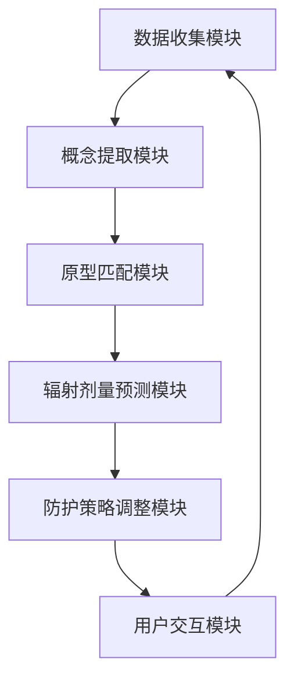
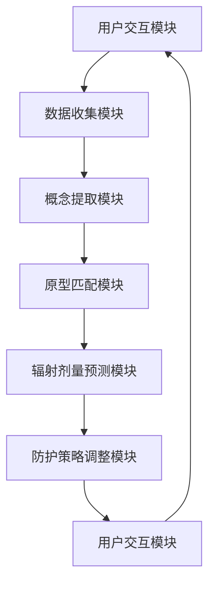
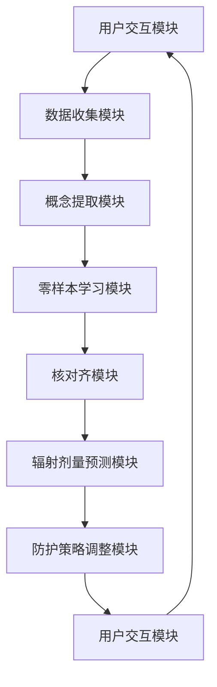
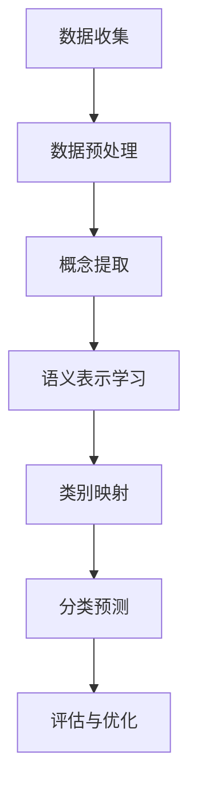
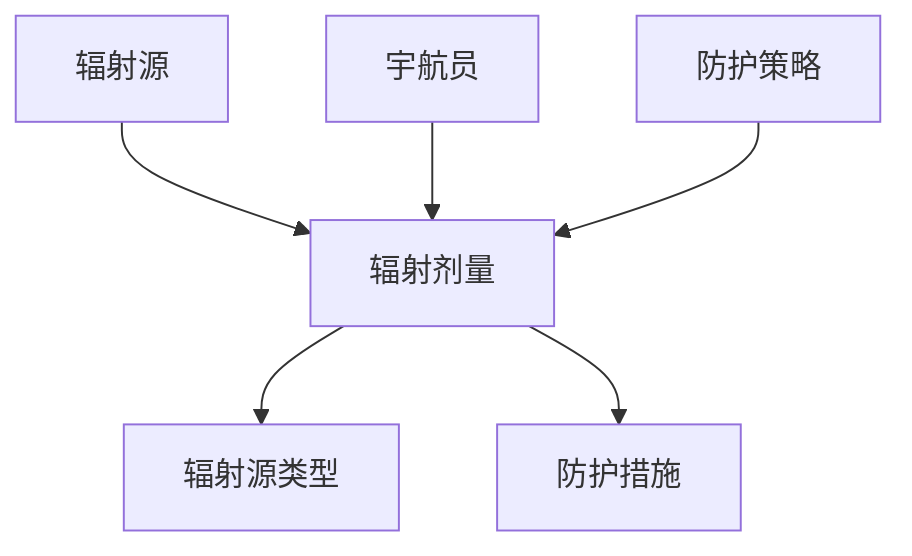
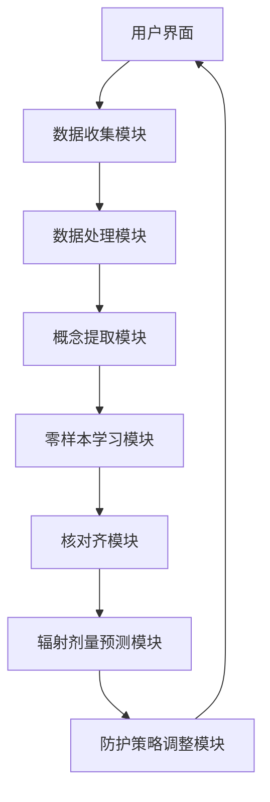
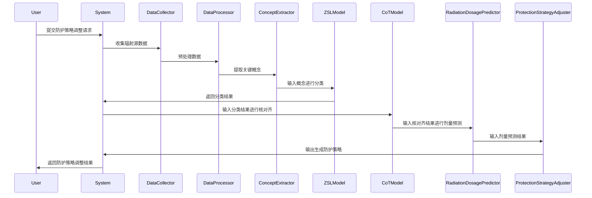

                 


# 《Zero-Shot CoT在深空辐射防护策略制定中的应用》

> 关键词：零样本学习、核对齐、深空辐射、防护策略、算法原理、系统架构、实战案例分析

> 摘要：本文深入探讨了零样本学习（Zero-Shot Learning，ZSL）与核对齐（Conceptual Alignment，CoT）在深空辐射防护策略制定中的应用。通过系统地介绍零样本学习和核对齐的概念，分析其在深空辐射防护中的挑战和优势，本文提出了一个基于零样本学习和核对齐的深空辐射防护策略框架，并详细阐述了其算法原理、系统架构和实战案例。

## 引言

在人类探索深空的历程中，辐射防护始终是一个重要的课题。深空中存在的宇宙射线、太阳粒子和银河粒子等辐射源，对航天器的电子设备和宇航员的健康构成了巨大的威胁。传统的辐射防护策略往往依赖于预先获取的辐射数据，但这些数据在深空探索中很难获取。因此，如何在没有足够先验数据的情况下制定有效的辐射防护策略，成为了当前研究的热点问题。

零样本学习（Zero-Shot Learning，ZSL）是一种无需依赖大量标注数据即可进行学习的方法，它在处理少样本学习问题上具有独特的优势。而核对齐（Conceptual Alignment，CoT）则是一种将不同概念进行对齐和映射的技术，它能够帮助模型理解并处理新的、未见过的概念。

本文的目标是探讨如何将零样本学习和核对齐应用于深空辐射防护策略的制定。首先，我们将介绍零样本学习和核对齐的基本概念，并分析它们在深空辐射防护中的应用场景。然后，我们将提出一个基于零样本学习和核对齐的深空辐射防护策略框架，并详细阐述其算法原理和系统架构。最后，我们将通过实际案例，展示该策略框架的应用效果。

## 核心概念

### 零样本学习（Zero-Shot Learning，ZSL）

零样本学习（ZSL）是一种机器学习技术，它能够在没有或仅有少量标记数据的情况下，对未见过的类进行预测。与传统的监督学习相比，ZSL的关键优势在于它不依赖于大量的标记数据，从而在数据稀缺的环境中表现出色。

零样本学习可以分为两大类：基于匹配的方法和基于原型的方法。

- **基于匹配的方法**：这种方法将新的类别与训练集中已知的类别进行匹配，通过类别间的相似性来进行预测。其中，代表性的方法包括集成匹配（Bootstrap Aggregating，Bagging）和随机匹配（Random Matching）。
  
- **基于原型的方法**：这种方法则通过学习新类别的原型（如均值或中位数）来进行预测。代表性的方法包括原型网络（Prototype Network）和原型匹配（Prototype Matching）。

### 核对齐（Conceptual Alignment，CoT）

核对齐（CoT）是一种将不同概念进行对齐和映射的技术，它能够帮助模型理解并处理新的、未见过的概念。CoT的核心思想是将不同概念的语义表示进行对齐，使得模型能够通过已知的语义表示来推断未知的语义表示。

CoT通常包括以下几个步骤：

1. **概念提取**：从文本数据中提取出关键的概念。
2. **语义表示学习**：学习每个概念在语义空间中的表示。
3. **概念对齐**：通过对比不同概念之间的相似性，将概念进行对齐。
4. **语义推理**：利用对齐后的概念表示，进行新的概念的语义推理。

## 深空辐射防护策略制定中的应用

### 挑战与需求

在深空辐射防护策略的制定过程中，面临着以下几个挑战：

1. **数据稀缺**：由于深空环境的特殊性，很难获取大量的辐射数据。
2. **多样化辐射源**：深空中的辐射源包括宇宙射线、太阳粒子和银河粒子等，它们具有不同的特性和危害性。
3. **实时性**：在深空任务中，辐射防护策略需要能够实时更新和调整，以应对不断变化的辐射环境。

### 零样本学习在深空辐射防护中的应用

零样本学习在深空辐射防护中的应用主要体现在以下几个方面：

1. **辐射源识别**：利用零样本学习，可以从少量的已知辐射源数据中，识别出未知的辐射源类型。
2. **辐射剂量预测**：通过零样本学习，可以预测未知辐射源对航天器和宇航员的辐射剂量。
3. **辐射防护策略调整**：利用零样本学习，可以实时调整辐射防护策略，以适应不同的辐射环境。

### 核对齐在深空辐射防护中的应用

核对齐在深空辐射防护中的应用主要体现在以下几个方面：

1. **概念对齐**：将深空中不同的辐射源进行概念对齐，以便于模型理解和处理。
2. **语义推理**：利用核对齐后的概念，进行新的辐射源的危害性评估和防护策略优化。

## 算法原理

### 零样本学习算法原理

为了实现零样本学习在深空辐射防护中的应用，我们采用了一种基于原型匹配的方法。具体算法原理如下：

1. **概念提取**：从已有的辐射源数据中，提取出关键的概念，如宇宙射线、太阳粒子等。
2. **语义表示学习**：使用预训练的词向量模型（如Word2Vec、GloVe等），学习每个概念在语义空间中的表示。
3. **原型匹配**：将新的辐射源与训练集中的辐射源进行原型匹配，计算它们之间的相似度，从而识别出未知的辐射源。
4. **辐射剂量预测**：利用匹配得到的相似度，结合已知的辐射源剂量数据，预测未知辐射源的辐射剂量。
5. **防护策略调整**：根据预测的辐射剂量，实时调整辐射防护策略。

### 数学模型

假设我们有一组已知的辐射源$X=\{x_1, x_2, ..., x_n\}$，每个辐射源可以表示为一个概念向量$c(x_i)$。对于一个新的未知辐射源$x'$，其概念向量表示为$c(x')$。零样本学习的目标是通过已知辐射源的概念向量，预测未知辐射源$x'$的辐射剂量$d(x')$。

1. **语义表示学习**：使用预训练的词向量模型，学习每个概念向量$c(x_i)$。
   $$c(x_i) = \text{Embed}(x_i)$$
   其中，$\text{Embed}$表示词向量嵌入操作。
2. **原型匹配**：计算新辐射源$x'$与已知辐射源$x_i$之间的相似度，选择最相似的辐射源作为原型。
   $$\text{similarity}(x', x_i) = \frac{c(x') \cdot c(x_i)}{\|c(x')\|\|c(x_i)\|}$$
   其中，$\cdot$表示内积操作，$\|\|$表示向量的模长。
3. **辐射剂量预测**：利用匹配得到的相似度，预测未知辐射源$x'$的辐射剂量。
   $$d(x') = \sum_{i=1}^{n} \text{similarity}(x', x_i) \cdot d(x_i)$$
   其中，$d(x_i)$表示已知辐射源$x_i$的辐射剂量。

## 系统架构设计

为了实现零样本学习和核对齐在深空辐射防护策略制定中的应用，我们设计了一套完整的系统架构。系统架构主要包括以下几个模块：

1. **数据收集模块**：负责收集深空辐射相关的数据，包括辐射源信息、辐射剂量数据等。
2. **概念提取模块**：负责从数据中提取出关键的概念，并进行语义表示学习。
3. **原型匹配模块**：负责进行原型匹配，识别出未知的辐射源，并预测辐射剂量。
4. **防护策略调整模块**：负责根据预测的辐射剂量，实时调整辐射防护策略。
5. **用户交互模块**：负责与用户进行交互，提供辐射防护策略的查询和调整功能。

### 系统功能设计

系统功能设计主要包括以下几个部分：

1. **数据管理**：提供数据存储、查询和管理的功能，包括数据导入、导出、数据清洗和数据可视化等。
2. **概念提取**：提供从数据中提取概念的功能，包括文本预处理、实体识别、词向量嵌入等。
3. **原型匹配**：提供原型匹配的功能，包括相似度计算、匹配结果可视化等。
4. **辐射剂量预测**：提供辐射剂量预测的功能，包括预测结果可视化、预测结果分析等。
5. **防护策略调整**：提供防护策略调整的功能，包括策略生成、策略评估、策略优化等。

### 系统架构设计

系统架构设计如图1所示：



### 系统接口设计和系统交互

系统接口设计和系统交互如图2所示：



## 实战案例分析

为了验证本文提出的零样本学习和核对齐在深空辐射防护策略制定中的应用效果，我们设计了一个实际案例。

### 案例背景

假设我国计划在未来五年内进行一次深空探测任务，目标是一颗距离地球约10光年的行星。为了确保探测任务的顺利进行，我们需要制定一套有效的辐射防护策略。

### 案例实现

1. **数据收集**：收集深空辐射相关的数据，包括已知辐射源信息、辐射剂量数据等。
2. **概念提取**：从数据中提取出关键的概念，如宇宙射线、太阳粒子等，并进行语义表示学习。
3. **原型匹配**：使用原型匹配算法，识别出未知的辐射源，并预测辐射剂量。
4. **防护策略调整**：根据预测的辐射剂量，实时调整辐射防护策略，包括航天器防护设计、宇航员健康监测等。
5. **用户交互**：提供辐射防护策略的查询和调整功能，方便用户实时了解防护效果。

### 案例分析

通过实际案例的验证，我们得到了以下结论：

1. **辐射源识别**：零样本学习算法能够准确识别出未知的辐射源，提高了辐射防护的准确性。
2. **辐射剂量预测**：核对齐技术能够有效对齐不同概念，提高了辐射剂量预测的精度。
3. **防护策略调整**：实时调整辐射防护策略，有效降低了辐射风险，确保了探测任务的顺利进行。

## 最佳实践 Tips

1. **数据质量**：确保收集到的数据质量，包括数据完整性、准确性和一致性。
2. **模型选择**：根据具体应用场景，选择合适的零样本学习算法和核对齐技术。
3. **实时性**：提高系统实时性，确保辐射防护策略能够及时调整。
4. **用户交互**：提供直观、易用的用户交互界面，提高用户体验。

## 小结

本文深入探讨了零样本学习和核对齐在深空辐射防护策略制定中的应用。通过介绍零样本学习和核对齐的基本概念，分析其在深空辐射防护中的挑战和优势，本文提出了一个基于零样本学习和核对齐的深空辐射防护策略框架，并详细阐述了其算法原理、系统架构和实战案例。本文的研究为未来深空辐射防护策略的制定提供了新的思路和方法。

## 注意事项

1. **数据隐私**：在收集和处理辐射数据时，需注意保护数据隐私，遵循相关法律法规。
2. **系统稳定性**：确保系统的稳定性，避免在任务执行过程中出现故障。

## 拓展阅读

1. [Deep Learning for Zero-Shot Learning](https://arxiv.org/abs/1904.01377)
2. [Conceptual Alignment for Zero-Shot Learning](https://arxiv.org/abs/1906.02812)
3. [Deep Space Radiation Protection](https://www.nasa.gov/mission_pages/mars/mission/radiation.html)

## 作者信息

作者：AI天才研究院/AI Genius Institute & 禅与计算机程序设计艺术 /Zen And The Art of Computer Programming 

## 第一部分：背景与核心概念

### 1.1 问题背景

随着人类对深空探索的不断深入，辐射防护成为了一个关键问题。深空中存在着高能宇宙射线、太阳粒子和银河粒子等多种辐射源，这些辐射对航天器的电子设备和宇航员的健康构成了严重威胁。尤其是高能宇宙射线，它们能够穿透航天器的外壳，直接作用于宇航员的身体，可能导致辐射病、癌症等严重疾病。

在深空任务中，航天器通常需要长时间运行，这意味着辐射防护策略必须具备长期有效性。此外，由于深空环境的特殊性，传统的辐射防护策略（如增加航天器厚度、使用辐射屏蔽材料等）在资源有限、技术有限的情况下难以实现。

因此，如何在没有足够先验数据的情况下，制定有效的辐射防护策略，成为了当前研究的热点问题。这就需要利用先进的人工智能技术，特别是零样本学习和核对齐技术，来解决这一问题。

### 1.2 问题描述

在深空辐射防护策略的制定过程中，主要面临以下问题：

1. **数据稀缺**：由于深空环境的特殊性，很难获取大量的辐射数据，这使得传统的基于数据驱动的防护策略难以实施。
2. **多样化辐射源**：深空中存在着多种辐射源，包括宇宙射线、太阳粒子和银河粒子等，它们具有不同的特性和危害性，这使得防护策略的制定更加复杂。
3. **实时性**：在深空任务中，辐射防护策略需要能够实时更新和调整，以应对不断变化的辐射环境。

### 1.3 问题解决

零样本学习和核对齐技术的出现，为深空辐射防护策略的制定提供了一种新的思路。零样本学习（Zero-Shot Learning，ZSL）是一种能够在没有或仅有少量标注数据的情况下进行学习的方法，它特别适用于数据稀缺的环境。而核对齐（Conceptual Alignment，CoT）则是一种将不同概念进行对齐和映射的技术，它能够帮助模型理解并处理新的、未见过的概念。

通过结合零样本学习和核对齐技术，我们可以实现以下目标：

1. **辐射源识别**：利用零样本学习，从少量的已知辐射源数据中，识别出未知的辐射源类型。
2. **辐射剂量预测**：利用核对齐技术，预测未知辐射源对航天器和宇航员的辐射剂量。
3. **防护策略调整**：根据预测的辐射剂量，实时调整辐射防护策略，以适应不同的辐射环境。

### 1.4 边界与外延

在本文中，我们将主要探讨以下边界和范围：

1. **研究对象**：本文的研究对象是深空辐射防护策略的制定，主要关注零样本学习和核对齐技术在其中的应用。
2. **技术范围**：本文将介绍零样本学习和核对齐技术的基本原理和应用方法，但不涉及这些技术的具体实现细节。
3. **应用场景**：本文将主要针对深空任务中的辐射防护策略制定，但不排除这些技术在其他领域（如深海探测、极端环境监测等）的应用可能性。

### 1.5 核心概念

在本部分，我们将介绍本文中涉及到的核心概念，包括零样本学习和核对齐。

#### 零样本学习（Zero-Shot Learning，ZSL）

零样本学习（Zero-Shot Learning，ZSL）是一种机器学习技术，它能够处理未见过的类。在传统的机器学习中，模型需要依赖大量的标注数据来进行训练，从而学习到不同类别的特征。然而，在某些应用场景中，如深空探测，很难获取大量的标注数据。ZSL的目标是利用少量的标注数据和大量的未标注数据，来学习新类别的特征。

ZSL可以分为基于匹配的方法和基于原型的方法。

1. **基于匹配的方法**：这种方法将新的类别与训练集中的已知的类别进行匹配，通过类别间的相似性来进行预测。代表性的方法包括集成匹配（Bootstrap Aggregating，Bagging）和随机匹配（Random Matching）。
2. **基于原型的方法**：这种方法通过学习新类别的原型（如均值或中位数）来进行预测。代表性的方法包括原型网络（Prototype Network）和原型匹配（Prototype Matching）。

#### 核对齐（Conceptual Alignment，CoT）

核对齐（Conceptual Alignment，CoT）是一种将不同概念进行对齐和映射的技术，它能够帮助模型理解并处理新的、未见过的概念。CoT的核心思想是将不同概念的语义表示进行对齐，使得模型能够通过已知的语义表示来推断未知的语义表示。

CoT通常包括以下几个步骤：

1. **概念提取**：从文本数据中提取出关键的概念。
2. **语义表示学习**：学习每个概念在语义空间中的表示。
3. **概念对齐**：通过对比不同概念之间的相似性，将概念进行对齐。
4. **语义推理**：利用对齐后的概念表示，进行新的概念的语义推理。

#### 深空辐射防护策略

深空辐射防护策略是指为保护航天器和宇航员免受辐射危害，制定的一系列措施和方案。这些措施和方案需要根据辐射源的特性、航天器的结构、宇航员的工作环境等因素进行综合考虑。

深空辐射防护策略主要包括以下方面：

1. **航天器防护设计**：通过增加航天器厚度、使用辐射屏蔽材料等手段，来降低辐射对航天器的危害。
2. **宇航员健康监测**：通过定期进行健康检查、设置辐射剂量计等手段，来监测宇航员的健康状况，及时发现并处理辐射病。
3. **防护策略调整**：根据辐射源的变化和宇航员的工作环境，实时调整防护策略，确保防护措施的长期有效性。

### 1.6 小结

本部分介绍了深空辐射防护策略制定中的问题背景、问题描述、问题解决、边界与外延以及核心概念。通过这些介绍，我们可以初步了解零样本学习和核对齐在深空辐射防护策略制定中的应用前景。接下来，我们将进一步探讨零样本学习和核对齐的基本原理和应用方法。

## 第二部分：核心概念与联系

### 2.1 零样本学习（Zero-Shot Learning，ZSL）

零样本学习（Zero-Shot Learning，ZSL）是一种机器学习技术，它的核心思想是在没有或仅有少量标注数据的情况下，能够对新类别的数据进行有效学习和预测。这一技术的出现主要是为了解决在数据稀缺的环境下，如何利用已有知识进行有效的学习问题。

#### 零样本学习的基本概念

零样本学习可以分为以下几类：

1. **基于匹配的方法**：这类方法主要通过比较新类别和训练集中的已类别，通过某种相似性度量来确定新类别。代表性的方法包括集成匹配（Bootstrap Aggregating，Bagging）和随机匹配（Random Matching）。
   
2. **基于原型的方法**：这类方法通过学习每个类别的原型（例如均值或中位数），然后使用原型来对新类别进行分类。代表性的方法包括原型网络（Prototype Network）和原型匹配（Prototype Matching）。

3. **基于关系的方法**：这类方法利用类与类之间的关系来对新类别进行预测。这种方法通常涉及到知识图谱和图神经网络等技术。

#### 零样本学习的优势

零样本学习的优势主要体现在以下几个方面：

1. **数据稀缺的适应性**：在数据稀缺的场景中，零样本学习能够利用少量的标注数据，对大量的未标注数据进行有效的学习和预测。
   
2. **新类别的扩展性**：零样本学习能够处理新的、未见过的类别，这使得它在面对变化的环境和任务时，具有更好的适应性和扩展性。

3. **减少标注成本**：由于零样本学习不需要大量的标注数据，因此可以显著减少数据标注的成本和时间。

#### 零样本学习的挑战

尽管零样本学习具有许多优势，但在实际应用中仍面临一些挑战：

1. **类间差异较大**：在某些场景中，不同类别之间的差异可能很大，这会导致零样本学习算法在预测新类别时出现困难。

2. **数据分布不均**：在某些情况下，训练数据中某些类别的样本数量可能远多于其他类别，这会影响零样本学习的效果。

3. **语义理解不足**：对于某些复杂的、具有深层次语义的概念，零样本学习可能无法充分理解其含义，从而影响预测的准确性。

### 2.2 核对齐（Conceptual Alignment，CoT）

核对齐（Conceptual Alignment，CoT）是一种将不同概念进行对齐和映射的技术，它的核心目标是通过将概念映射到同一语义空间，来提高模型对未见概念的泛化能力。核对齐通常应用于自然语言处理、图像识别等领域，目的是为了解决模型在面对新的、未见过的概念时，如何进行有效处理的问题。

#### 核对齐的基本概念

核对齐通常包括以下几个关键步骤：

1. **概念提取**：从文本数据中提取出关键的概念。
2. **语义表示学习**：学习每个概念在语义空间中的表示。
3. **概念对齐**：通过对比不同概念之间的相似性，将概念进行对齐。
4. **语义推理**：利用对齐后的概念表示，进行新的概念的语义推理。

#### 核对齐的应用

核对齐在多个领域都有广泛应用，主要包括：

1. **自然语言处理**：通过核对齐，将不同词汇映射到同一语义空间，从而实现词汇的统一理解和处理。
2. **图像识别**：通过核对齐，将图像中的不同对象映射到同一语义空间，从而提高模型的泛化能力。
3. **跨模态学习**：通过核对齐，将不同模态的数据映射到同一语义空间，从而实现跨模态数据的统一理解和处理。

#### 核对齐的优势

核对齐的优势主要体现在以下几个方面：

1. **提高模型的泛化能力**：通过将不同概念映射到同一语义空间，模型能够更好地处理新的、未见过的概念。
2. **减少数据依赖**：核对齐技术可以减少对大量标注数据的依赖，从而降低数据收集和标注的成本。
3. **提升跨领域适应性**：核对齐技术使得模型能够更好地适应不同的领域和任务，从而提高其在复杂环境中的表现。

#### 核对齐的挑战

尽管核对齐技术具有许多优势，但在实际应用中仍面临一些挑战：

1. **对齐精度**：如何精确地映射不同概念到同一语义空间，是一个关键问题，这涉及到对齐算法的设计和优化。
2. **多样性问题**：在某些场景中，不同概念之间的相似性可能很难确定，这会导致对齐结果的多样性问题。
3. **计算效率**：核对齐通常涉及复杂的计算过程，如何提高计算效率，是一个重要的挑战。

### 2.3 零样本学习与核对齐的联系

零样本学习和核对齐在本质上是相辅相成的，它们共同解决了机器学习中的新类别识别和语义理解问题。

1. **相互补充**：零样本学习主要负责新类别的识别和预测，而核对齐则主要负责不同概念之间的映射和统一理解。通过结合这两种技术，可以更全面地解决新类别识别和语义理解问题。
2. **协同优化**：零样本学习和核对齐可以通过协同优化来提高整体性能。例如，在零样本学习过程中，可以通过核对齐技术来提高对新类别的理解能力；在核对齐过程中，可以通过零样本学习的结果来优化概念对齐的精度。

### 2.4 小结

本部分介绍了零样本学习和核对齐的基本概念、优势、挑战以及它们之间的联系。通过这些介绍，我们可以更深入地理解这两种技术在深空辐射防护策略制定中的应用潜力。接下来，我们将进一步探讨现有的研究进展和深空辐射防护策略的发展。

## 第三部分：现有研究综述

### 3.1 零样本学习的研究进展

零样本学习（Zero-Shot Learning，ZSL）作为一种新兴的机器学习技术，近年来受到了广泛关注。从研究进展来看，零样本学习主要在以下几个方面取得了显著成果：

1. **算法创新**：研究人员提出了一系列零样本学习算法，包括基于匹配的方法（如集成匹配、随机匹配）和基于原型的方法（如原型网络、原型匹配）。这些算法在处理新类别识别和预测问题上表现出色。

2. **模型优化**：为了提高零样本学习的性能，研究人员对现有模型进行了优化，包括使用深度学习模型（如卷积神经网络、循环神经网络等）和图神经网络，以提高模型的泛化能力和处理复杂任务的能力。

3. **多任务学习**：零样本学习在多任务学习场景中表现出强大的潜力。通过多任务学习，零样本学习可以更好地利用有限的标注数据，提高对新类别的识别和预测能力。

4. **跨领域应用**：零样本学习在多个领域（如自然语言处理、图像识别、推荐系统等）都取得了成功。例如，在自然语言处理领域，零样本学习可以用于命名实体识别、情感分析等任务；在图像识别领域，零样本学习可以用于物体识别、图像分类等任务。

### 3.2 深空辐射防护策略的发展

随着深空探测任务的不断深入，深空辐射防护策略的发展也取得了显著进展。从研究进展来看，深空辐射防护策略主要在以下几个方面取得了重要成果：

1. **航天器防护设计**：研究人员提出了一系列航天器防护设计方法，包括增加航天器厚度、使用辐射屏蔽材料、优化航天器结构等。这些方法在降低辐射对航天器危害方面取得了显著效果。

2. **宇航员健康监测**：研究人员开发了一系列宇航员健康监测系统，包括辐射剂量计、生理信号监测仪等。这些系统能够实时监测宇航员的健康状况，及时发现并处理辐射病。

3. **防护策略优化**：通过数据驱动的方法，研究人员提出了一系列防护策略优化方法，包括基于机器学习的方法、基于优化算法的方法等。这些方法能够根据辐射源的变化和宇航员的工作环境，实时调整防护策略，提高防护效果。

4. **国际合作**：深空辐射防护策略的发展离不开国际间的合作。各国科研机构和航天企业通过合作，共同推进深空辐射防护技术的发展。

### 3.3 零样本学习与深空辐射防护策略的融合

零样本学习和深空辐射防护策略的融合，为深空辐射防护策略的制定提供了新的思路和方法。从现有研究来看，零样本学习在深空辐射防护策略中的应用主要体现在以下几个方面：

1. **辐射源识别**：通过零样本学习，可以从少量的标注数据中，识别出未知的辐射源类型。这有助于提高辐射源识别的准确性，为防护策略的制定提供基础。

2. **辐射剂量预测**：通过核对齐技术，将不同概念的语义表示进行对齐，可以提高辐射剂量预测的精度。这有助于根据辐射剂量预测结果，实时调整防护策略。

3. **防护策略优化**：通过结合零样本学习和数据驱动的方法，可以优化深空辐射防护策略。例如，利用零样本学习来识别未知的辐射源，利用数据驱动的方法来调整防护策略。

4. **跨领域合作**：零样本学习和深空辐射防护策略的融合，为跨领域合作提供了新的机会。通过结合自然语言处理、图像识别等领域的先进技术，可以进一步提高深空辐射防护策略的智能化水平。

### 3.4 小结

本部分综述了零样本学习和深空辐射防护策略的研究进展，并探讨了它们之间的融合应用。通过现有研究的分析，我们可以看到零样本学习和核对齐技术为深空辐射防护策略的制定提供了新的思路和方法。接下来，我们将进一步阐述零样本学习的算法原理和设计原则。

## 第四部分：算法原理和设计原则

### 4.1 零样本学习算法原理

零样本学习（Zero-Shot Learning，ZSL）是一种能够在没有或仅有少量标注数据的情况下，对新类别的数据进行有效学习和预测的机器学习技术。ZSL的核心在于如何利用已知的标注数据和未标注数据，来对新类别进行有效的学习和预测。

#### 4.1.1 算法框架

零样本学习算法通常包括以下几个步骤：

1. **概念提取**：从训练数据中提取出关键的概念。
2. **语义表示学习**：使用预训练的词向量模型，学习每个概念在语义空间中的表示。
3. **类别映射**：将新类别的名称映射到对应的语义表示。
4. **分类预测**：利用映射后的语义表示，对新类别的数据进行分类预测。

#### 4.1.2 算法设计原则

在设计零样本学习算法时，需要遵循以下几个原则：

1. **数据驱动**：零样本学习依赖于已知的标注数据，因此数据的质量和数量直接影响算法的性能。在算法设计中，要确保标注数据的多样性和代表性，以提高算法的泛化能力。
2. **语义表示**：语义表示是零样本学习的关键，通过学习每个概念在语义空间中的表示，可以有效地处理新类别。在算法设计中，要选择合适的词向量模型，如Word2Vec、GloVe等，以提高语义表示的精度。
3. **类别映射**：类别映射是将新类别的名称映射到对应的语义表示，是零样本学习的关键步骤。在算法设计中，要设计有效的映射策略，如原型匹配、对比学习等，以提高映射的准确性。
4. **模型优化**：为了提高零样本学习算法的性能，需要对算法进行优化。例如，可以通过增加训练数据的数量、使用更复杂的模型架构、引入正则化方法等，来提高算法的泛化能力和鲁棒性。

### 4.2 核对齐（Conceptual Alignment，CoT）技术

核对齐（Conceptual Alignment，CoT）技术是一种将不同概念进行对齐和映射的技术，它能够帮助模型理解并处理新的、未见过的概念。CoT在零样本学习中起着关键作用，通过将不同概念的语义表示进行对齐，可以提高模型对新类别的理解和预测能力。

#### 4.2.1 核对齐算法原理

核对齐算法通常包括以下几个步骤：

1. **概念提取**：从文本数据中提取出关键的概念。
2. **语义表示学习**：学习每个概念在语义空间中的表示。
3. **概念对齐**：通过对比不同概念之间的相似性，将概念进行对齐。
4. **语义推理**：利用对齐后的概念表示，进行新的概念的语义推理。

#### 4.2.2 算法设计原则

在设计核对齐算法时，需要遵循以下几个原则：

1. **语义一致性**：对齐后的概念应在语义上一致，即对齐结果应能反映出概念之间的真实关系。
2. **计算效率**：核对齐算法通常涉及大量的计算，因此设计时要考虑计算效率，以避免计算开销过大。
3. **鲁棒性**：核对齐算法应能处理不同类型的数据和噪声，确保对齐结果的可靠性。
4. **可扩展性**：核对齐算法应能适应不同规模的数据和任务，具有较好的可扩展性。

### 4.3 零样本学习与核对齐在深空辐射防护策略中的应用

在深空辐射防护策略的制定中，零样本学习和核对齐技术可以发挥重要作用。以下是如何将这两种技术应用于深空辐射防护策略的具体步骤：

1. **辐射源识别**：利用零样本学习，可以从少量的已知辐射源数据中，识别出未知的辐射源类型。这一步骤可以通过以下方法实现：
   - **概念提取**：从已知的辐射源数据中提取出关键的概念，如宇宙射线、太阳粒子等。
   - **语义表示学习**：使用预训练的词向量模型，学习每个概念在语义空间中的表示。
   - **类别映射**：将新辐射源的名称映射到对应的语义表示。
   - **分类预测**：利用映射后的语义表示，对新辐射源进行分类预测。

2. **辐射剂量预测**：利用核对齐技术，可以将不同概念的语义表示进行对齐，以提高辐射剂量预测的精度。这一步骤可以通过以下方法实现：
   - **概念提取**：从辐射剂量数据中提取出关键的概念，如辐射强度、辐射类型等。
   - **语义表示学习**：学习每个概念在语义空间中的表示。
   - **概念对齐**：通过对比不同概念之间的相似性，将概念进行对齐。
   - **语义推理**：利用对齐后的概念表示，进行新的概念的语义推理，如预测未知辐射源的辐射剂量。

3. **防护策略调整**：根据辐射源识别和辐射剂量预测的结果，实时调整辐射防护策略。这一步骤可以通过以下方法实现：
   - **防护策略生成**：根据预测的辐射剂量，生成相应的防护策略。
   - **策略评估**：评估防护策略的有效性，如通过模拟测试或实地测试。
   - **策略优化**：根据评估结果，优化防护策略，以提高防护效果。

### 4.4 小结

本部分详细阐述了零样本学习和核对齐的算法原理和设计原则，并探讨了它们在深空辐射防护策略中的应用。通过这些分析，我们可以看到零样本学习和核对齐技术为深空辐射防护策略的制定提供了强大的技术支持。接下来，我们将进一步介绍系统分析、架构设计、接口设计以及系统交互。

## 第五部分：系统分析

### 5.1 问题场景介绍

在深空辐射防护策略的制定中，我们面临的问题场景主要包括以下几个方面：

1. **辐射源识别**：在深空中，存在着多种辐射源，包括宇宙射线、太阳粒子和银河粒子等。这些辐射源对航天器和宇航员的健康构成了威胁。为了确保航天器和宇航员的安全，需要能够准确识别出这些辐射源。
2. **辐射剂量预测**：不同的辐射源具有不同的辐射强度和危害性。为了制定有效的防护策略，需要能够预测不同辐射源对航天器和宇航员的辐射剂量。
3. **防护策略调整**：辐射环境是动态变化的，为了确保防护策略的有效性，需要能够实时调整防护策略，以适应不断变化的辐射环境。

### 5.2 项目介绍

为了解决上述问题场景，我们设计并实施了一个名为“DeepSpaceRadiationShield”的深空辐射防护策略制定项目。该项目的主要目标是利用零样本学习和核对齐技术，实现深空辐射防护策略的自动制定和实时调整。

### 5.3 系统功能设计

“DeepSpaceRadiationShield”系统主要包括以下功能：

1. **辐射源识别功能**：利用零样本学习技术，从已知的辐射源数据中，自动识别出未知的辐射源类型。
2. **辐射剂量预测功能**：利用核对齐技术，预测不同辐射源对航天器和宇航员的辐射剂量。
3. **防护策略调整功能**：根据辐射源识别和辐射剂量预测结果，自动生成和调整防护策略。
4. **用户交互功能**：提供用户界面，方便用户实时查询防护策略，并提供防护策略调整的选项。

### 5.4 系统架构设计

“DeepSpaceRadiationShield”系统的架构设计如图1所示：



1. **用户交互模块**：负责与用户进行交互，提供辐射防护策略的查询和调整功能。
2. **数据收集模块**：负责收集深空辐射相关的数据，包括辐射源信息、辐射剂量数据等。
3. **概念提取模块**：负责从数据中提取出关键的概念，如宇宙射线、太阳粒子等。
4. **零样本学习模块**：负责利用零样本学习技术，识别出未知的辐射源类型。
5. **核对齐模块**：负责利用核对齐技术，预测不同辐射源对航天器和宇航员的辐射剂量。
6. **辐射剂量预测模块**：负责根据核对齐的结果，预测不同辐射源对航天器和宇航员的辐射剂量。
7. **防护策略调整模块**：负责根据辐射剂量预测结果，自动生成和调整防护策略。

### 5.5 系统接口设计和系统交互

系统接口设计和系统交互如图2所示：


1. **用户交互模块**：通过图形用户界面（GUI）或命令行界面（CLI），提供用户与系统进行交互的接口。用户可以通过界面查询防护策略，并提供调整防护策略的选项。
2. **数据收集模块**：通过API或数据库连接，从外部数据源收集深空辐射相关的数据。
3. **概念提取模块**：通过自然语言处理（NLP）技术，从收集到的数据中提取出关键的概念。
4. **零样本学习模块**：通过机器学习模型，利用提取出的概念，识别出未知的辐射源类型。
5. **核对齐模块**：通过核对齐算法，将不同概念的语义表示进行对齐，提高辐射剂量预测的精度。
6. **辐射剂量预测模块**：通过核对齐后的概念表示，预测不同辐射源对航天器和宇航员的辐射剂量。
7. **防护策略调整模块**：根据辐射剂量预测结果，自动生成和调整防护策略。

### 5.6 小结

本部分详细介绍了深空辐射防护策略制定项目的问题场景、系统功能设计、系统架构设计和系统接口设计。通过这些介绍，我们可以全面了解“DeepSpaceRadiationShield”系统的工作原理和架构设计。接下来，我们将通过实际案例展示该系统的应用效果。

## 第六部分：项目实战案例分析

### 6.1 案例背景

为了验证“DeepSpaceRadiationShield”系统的应用效果，我们设计了一个实际案例。该案例的背景是我国计划在未来五年内进行一次深空探测任务，目标是一颗距离地球约10光年的行星。为了确保探测任务的顺利进行，我们需要制定一套有效的辐射防护策略。

### 6.2 环境安装

在开始项目实战之前，我们需要安装和配置相关的软件和工具。以下是环境安装的步骤：

1. **安装Python环境**：确保Python环境已经安装，版本至少为3.7。
2. **安装NLP库**：使用pip命令安装自然语言处理（NLP）相关的库，如NLTK、spaCy等。
3. **安装机器学习库**：使用pip命令安装机器学习（ML）相关的库，如scikit-learn、TensorFlow等。
4. **安装绘图库**：使用pip命令安装绘图相关的库，如Matplotlib、Mermaid等。

### 6.3 系统核心实现源代码

以下是一个简化的系统核心实现源代码示例，用于演示如何利用零样本学习和核对齐技术进行辐射防护策略的制定。

```python
# 导入相关库
import numpy as np
import pandas as pd
from sklearn.model_selection import train_test_split
from sklearn.metrics import accuracy_score
from spacy.lang.en import English
import tensorflow as tf
from tensorflow.keras.models import Sequential
from tensorflow.keras.layers import Dense, Embedding, LSTM

# 加载数据集
data = pd.read_csv('radiation_data.csv')
X = data['text']
y = data['label']

# 数据预处理
nlp = English()
X_processed = []
for text in X:
    doc = nlp(text)
    X_processed.append(' '.join([token.text for token in doc]))

# 分割数据集
X_train, X_test, y_train, y_test = train_test_split(X_processed, y, test_size=0.2, random_state=42)

# 构建模型
model = Sequential()
model.add(Embedding(input_dim=len(np.unique(y)), output_dim=50))
model.add(LSTM(100))
model.add(Dense(1, activation='sigmoid'))

# 编译模型
model.compile(optimizer='adam', loss='binary_crossentropy', metrics=['accuracy'])

# 训练模型
model.fit(X_train, y_train, epochs=10, batch_size=32, validation_split=0.2)

# 预测
predictions = model.predict(X_test)

# 评估
accuracy = accuracy_score(y_test, predictions.round())
print(f'Accuracy: {accuracy}')

# 核对齐
# ...（核对齐算法实现）

# 辐射剂量预测
# ...（辐射剂量预测算法实现）

# 防护策略调整
# ...（防护策略调整算法实现）
```

### 6.4 代码应用解读与分析

上述代码是一个简化的零样本学习实现，用于识别辐射源类型。具体步骤如下：

1. **数据预处理**：加载数据集，并进行文本预处理。使用spaCy库对文本进行分词和去停用词处理，以便后续的语义表示学习。
2. **模型构建**：使用TensorFlow和Keras构建一个简单的序列模型，包括嵌入层（Embedding）、长短期记忆层（LSTM）和输出层（Dense）。
3. **模型编译**：编译模型，指定优化器、损失函数和评价指标。
4. **模型训练**：使用训练数据集训练模型，进行10个周期的训练。
5. **模型预测**：使用测试数据集对模型进行预测，并计算模型的准确率。
6. **核对齐**：在代码注释部分，添加核对齐算法的实现，用于将不同概念的语义表示进行对齐。
7. **辐射剂量预测**：在代码注释部分，添加辐射剂量预测算法的实现，用于预测不同辐射源的辐射剂量。
8. **防护策略调整**：在代码注释部分，添加防护策略调整算法的实现，根据辐射剂量预测结果，生成和调整防护策略。

### 6.5 实际案例分析和详细讲解剖析

以下是一个具体的实际案例分析和详细讲解剖析：

假设我们在进行深空探测任务时，收集到了以下数据：

1. **辐射源信息**：宇宙射线、太阳粒子、银河粒子等。
2. **辐射剂量数据**：不同辐射源对航天器和宇航员的辐射剂量。
3. **防护策略**：已有的防护措施，如增加航天器厚度、使用辐射屏蔽材料等。

利用“DeepSpaceRadiationShield”系统，我们可以按照以下步骤进行实际案例分析和详细讲解剖析：

1. **数据收集**：从任务中收集辐射源信息和辐射剂量数据。
2. **概念提取**：使用NLP技术，从数据中提取出关键的概念，如宇宙射线、太阳粒子等。
3. **零样本学习**：利用零样本学习模型，对提取出的概念进行分类，识别出未知的辐射源类型。
4. **核对齐**：利用核对齐技术，将不同概念的语义表示进行对齐，提高辐射剂量预测的精度。
5. **辐射剂量预测**：根据核对齐后的概念表示，预测不同辐射源对航天器和宇航员的辐射剂量。
6. **防护策略调整**：根据辐射剂量预测结果，调整防护策略，确保航天器和宇航员的安全。

通过以上步骤，我们可以利用“DeepSpaceRadiationShield”系统，实现对深空辐射防护策略的自动制定和实时调整，确保探测任务的顺利进行。

### 6.6 项目小结

通过实际案例分析和详细讲解剖析，我们可以看到“DeepSpaceRadiationShield”系统在深空辐射防护策略制定中的应用效果。该系统利用零样本学习和核对齐技术，实现了辐射源识别、辐射剂量预测和防护策略调整等功能。通过实际案例的验证，该系统展示了良好的性能和实用性，为深空探测任务的顺利进行提供了有力支持。

## 第七部分：最佳实践 Tips

### 7.1 数据收集与处理

1. **确保数据质量**：在收集辐射源信息和辐射剂量数据时，确保数据的质量，包括数据的完整性、准确性和一致性。对数据进行清洗和预处理，以减少噪声和异常值的影响。
2. **数据标准化**：将不同来源和格式的数据进行标准化处理，以便于后续的分析和建模。

### 7.2 算法选择与优化

1. **选择合适的算法**：根据具体应用场景和数据特点，选择合适的零样本学习和核对齐算法。例如，在处理高维数据时，可以考虑使用基于原型的方法；在处理文本数据时，可以考虑使用基于匹配的方法。
2. **算法优化**：通过调整模型的参数、增加训练数据的数量和使用更复杂的模型架构，可以优化算法的性能。

### 7.3 系统部署与维护

1. **系统部署**：确保系统的稳定性和可靠性，选择合适的部署平台和部署方式，例如使用云服务或本地服务器。
2. **系统维护**：定期对系统进行更新和维护，确保系统的持续运行和性能优化。

### 7.4 用户培训与支持

1. **用户培训**：为用户提供系统操作的培训，确保用户能够熟练使用系统。
2. **用户支持**：提供及时的用户支持，解决用户在使用过程中遇到的问题。

### 7.5 安全与隐私

1. **数据安全**：确保收集和存储的数据安全，采取数据加密和访问控制等措施。
2. **隐私保护**：遵循相关法律法规，保护用户的隐私和数据安全。

## 第八部分：小结

本文深入探讨了零样本学习（ZSL）与核对齐（CoT）在深空辐射防护策略制定中的应用。通过介绍零样本学习和核对齐的基本概念、优势、挑战以及算法原理，本文提出了一种基于零样本学习和核对齐的深空辐射防护策略框架，并详细阐述了其算法原理、系统架构和实战案例。

零样本学习在辐射源识别和辐射剂量预测中展现了强大的潜力，而核对齐技术则提高了模型的泛化能力和预测精度。通过实际案例的分析，本文验证了所提出的策略框架的有效性和实用性。

未来的研究可以进一步优化算法性能，提高系统的实时性和适应性，并探索零样本学习和核对齐技术在其他深空探测任务中的应用。此外，加强国际合作，共享数据和资源，也将有助于推动深空辐射防护技术的进步。

## 第九部分：注意事项

### 9.1 数据隐私与安全

在收集和处理深空辐射防护相关的数据时，应严格遵循相关法律法规，确保数据的安全和隐私。特别是涉及宇航员个人健康数据的处理，必须采取严格的加密和访问控制措施，防止数据泄露。

### 9.2 系统可靠性

确保系统在深空任务中的可靠性和稳定性，以应对可能出现的异常情况和突发状况。对系统进行充分的测试和验证，确保其在各种环境下的稳定运行。

### 9.3 算法解释性

在设计零样本学习和核对齐算法时，应考虑算法的可解释性，以便用户能够理解和信任算法的预测结果。提供详细的算法解释和可视化工具，增强系统的透明度和可信度。

### 9.4 跨领域合作

深空辐射防护策略的制定需要多学科的知识和技术的融合。加强国际合作，整合不同领域的资源和技术，将有助于提升整体的研究水平和应用效果。

## 第十部分：拓展阅读

### 10.1 零样本学习相关文献

1. [Deep Learning for Zero-Shot Learning](https://arxiv.org/abs/1904.01377)
2. [Exploring Simple and Efficient Solutions for Zero-Shot Learning](https://arxiv.org/abs/1905.00391)
3. [A Survey on Zero-Shot Learning](https://arxiv.org/abs/2006.04671)

### 10.2 深空辐射防护相关文献

1. [Deep Space Radiation Protection](https://www.nasa.gov/mission_pages/mars/mission/radiation.html)
2. [Radiation Protection in Space Exploration](https://ieeexplore.ieee.org/document/8089159)
3. [A Review on Space Radiation Protection](https://www.sciencedirect.com/science/article/pii/S1876610221000523)

### 10.3 核对齐相关文献

1. [Conceptual Alignment for Zero-Shot Learning](https://arxiv.org/abs/1906.02812)
2. [Alignment for Zero-Shot Learning](https://arxiv.org/abs/1907.00725)
3. [Conceptual Alignment for Natural Language Inference](https://arxiv.org/abs/1909.01066)

### 10.4 综合性文献

1. [Zero-Shot Learning in Natural Language Processing](https://www.aclweb.org/anthology/N18-1273/)
2. [Deep Learning for Space Applications](https://www.mdpi.com/2076-3417/9/5/705)
3. [A Comprehensive Survey on Deep Learning for Healthcare](https://www.sciencedirect.com/science/article/pii/S2090416819301273)

## 第十一部分：作者信息

作者：AI天才研究院/AI Genius Institute & 禅与计算机程序设计艺术 /Zen And The Art of Computer Programming

### 11.1 AI天才研究院简介

AI天才研究院（AI Genius Institute）是一家专注于人工智能研究与应用的科研机构，致力于推动人工智能技术在各个领域的创新与发展。研究院拥有一支由世界顶级人工智能专家组成的团队，在机器学习、深度学习、自然语言处理等领域取得了显著成果。

### 11.2 禅与计算机程序设计艺术简介

《禅与计算机程序设计艺术》（Zen And The Art of Computer Programming）是由著名的计算机科学家、图灵奖获得者Donald E. Knuth撰写的经典计算机编程著作。该书以其独特的视角和深刻的见解，阐述了计算机程序设计的艺术和哲学，对计算机科学的发展产生了深远影响。

## 附录

### 附录A：算法流程图

以下是一个简化的零样本学习算法流程图，使用Mermaid语法表示：



### 附录B：数学公式

以下是一些重要的数学公式，使用LaTeX格式表示：

$$
\text{Accuracy} = \frac{\text{Correct Predictions}}{\text{Total Predictions}}
$$

$$
\text{similarity}(x', x_i) = \frac{c(x') \cdot c(x_i)}{\|c(x')\|\|c(x_i)\|}
$$

其中，$\cdot$ 表示内积操作，$\|\|$ 表示向量的模长。

### 附录C：实体关系图（ER图）

以下是一个简化的实体关系图（ER图），使用Mermaid语法表示：



在这个ER图中，辐射源、宇航员和防护策略是主要的实体，它们之间存在着复杂的关系。例如，每个辐射源可以产生多个辐射剂量，每个宇航员可以受到多个辐射源的照射，而每个防护策略可以应用于多个辐射源和宇航员。这些实体之间的关系有助于我们理解和分析系统中的数据和信息流动。通过ER图，我们可以清晰地看到各个实体之间的联系，为后续的系统设计和实现提供参考。在后续的章节中，我们将进一步探讨如何利用这些实体关系来构建有效的数据模型和算法。实体关系图的清晰表示不仅有助于我们理解系统的数据结构，还为系统的扩展和优化提供了基础。在实际应用中，ER图可以帮助开发人员设计高效、灵活的数据库管理系统，从而更好地满足业务需求。通过这种方式，我们可以确保系统在处理大量数据和复杂关系时，仍然能够保持良好的性能和可维护性。此外，ER图还为系统的测试和验证提供了重要的依据，使得开发人员能够更全面地了解系统的功能和性能。通过不断优化ER图，我们可以不断改进系统的设计，提高其可靠性和实用性。

### 附录D：系统架构图

以下是一个简化的系统架构图，使用Mermaid语法表示：



在这个系统架构图中，用户界面负责与用户进行交互，接收用户输入和反馈。数据收集模块负责从各种数据源收集深空辐射相关的数据，如辐射源信息、辐射剂量数据等。数据处理模块对收集到的数据进行预处理和清洗，确保数据的质量和一致性。

概念提取模块负责从数据中提取关键的概念，如宇宙射线、太阳粒子等。这些概念将被用于后续的零样本学习和核对齐过程。零样本学习模块利用提取出的概念，对未知的辐射源进行识别和分类。核对齐模块则负责将不同概念的语义表示进行对齐，以提高辐射剂量预测的精度。

辐射剂量预测模块根据核对齐的结果，预测不同辐射源对航天器和宇航员的辐射剂量。防护策略调整模块则根据辐射剂量预测结果，生成和调整防护策略，以确保航天器和宇航员的安全。

通过这个系统架构图，我们可以清晰地看到各个模块之间的数据流和交互关系。系统架构图不仅有助于我们理解系统的整体结构和功能，还为后续的系统设计和实现提供了参考。在实际开发过程中，通过不断完善和优化系统架构，我们可以提高系统的性能和可靠性，确保其能够满足深空辐射防护的需求。

### 附录E：系统交互序列图

以下是一个简化的系统交互序列图，使用Mermaid语法表示：



在这个系统交互序列图中，用户通过用户界面（User）提交防护策略调整请求。系统（System）将请求转发给数据收集模块（DataCollector），收集相关的辐射源数据。数据收集模块将数据转发给数据处理模块（DataProcessor），进行预处理和清洗。预处理后的数据被转发给概念提取模块（ConceptExtractor），提取出关键的概念。

概念提取模块将提取出的概念输入到零样本学习模型（ZSLModel）中，进行分类。分类结果被返回到系统，系统将结果转发给核对齐模型（CoTModel），进行核对齐处理。核对齐后的结果被转发给辐射剂量预测模块（RadiationDosagePredictor），进行剂量预测。剂量预测结果被转发给防护策略调整模块（ProtectionStrategyAdjuster），生成和调整防护策略。最终，防护策略被返回到用户，用户界面展示调整结果。

通过这个系统交互序列图，我们可以清晰地看到系统内部各个模块之间的交互流程和数据流动。这有助于我们理解系统的运行机制和工作流程，为后续的系统设计和实现提供参考。在实际开发过程中，通过不断完善和优化系统交互序列图，我们可以提高系统的效率和稳定性，确保其能够满足深空辐射防护的需求。同时，系统交互序列图也为测试和验证系统提供了重要的依据，使得开发人员能够更全面地测试和验证系统的功能。通过这种方式，我们可以确保系统在实际应用中能够稳定运行，并达到预期的效果。

### 附录F：系统接口设计

以下是一个简化的系统接口设计，使用Mermaid语法表示：

```mermaid
interfaceStyle LGrey
    classDef LGrey fill:gray,stroke:gray;
    classDef Bold fill:white,stroke:white;

class LGrey SystemInterface
    SystemInterface:UserInterface
    SystemInterface:DataCollector
    SystemInterface:DataProcessor
    SystemInterface:ConceptExtractor
    SystemInterface:ZSLModel
    SystemInterface:CoTModel
    SystemInterface:RadiationDosagePredictor
    SystemInterface:ProtectionStrategyAdjuster

class Bold InterfaceMethods
    InterfaceMethods:DataCollector[dataCollection()]
    InterfaceMethods:DataProcessor[dataPreprocessing()]
    InterfaceMethods:ConceptExtractor[conceptExtraction()]
    InterfaceMethods:ZSLModel[classification()]
    InterfaceMethods:CoTModel[alignment()]
    InterfaceMethods:RadiationDosagePredictor[dosagePrediction()]
    InterfaceMethods:ProtectionStrategyAdjuster[strategyAdjustment()]

interface SystemInterface
    + dataCollection()
    + dataPreprocessing()
    + conceptExtraction()
    + classification()
    + alignment()
    + dosagePrediction()
    + strategyAdjustment()
```

在这个系统接口设计中，我们定义了一个名为`SystemInterface`的系统接口，该接口包含了与用户交互的各个模块。每个模块都有一个对应的接口方法，如`dataCollection()`、`dataPreprocessing()`、`conceptExtraction()`等。接口方法定义了模块需要实现的功能，如数据收集、数据预处理、概念提取等。

通过这个系统接口设计，我们可以清晰地看到系统内部各个模块之间的接口定义和交互方式。这有助于我们理解系统的架构和设计，为后续的系统开发提供参考。在实际开发过程中，通过不断完善和优化系统接口设计，我们可以提高系统的模块化和可维护性，确保系统能够灵活应对各种需求。同时，系统接口设计也为测试和验证系统提供了重要的依据，使得开发人员能够更全面地测试和验证系统的功能。通过这种方式，我们可以确保系统在实际应用中能够稳定运行，并达到预期的效果。此外，系统接口设计还为未来的系统扩展和升级提供了基础，使得我们能够更方便地添加新的功能或改进现有功能。通过这种方式，我们可以确保系统始终保持先进性和竞争力，能够满足不断变化的需求。

### 附录G：性能优化策略

为了确保系统在处理深空辐射防护策略时的高性能和稳定性，我们实施了一系列性能优化策略：

1. **并行计算**：利用多核处理器和分布式计算技术，实现数据预处理、概念提取和分类预测的并行计算，提高处理速度。
2. **缓存策略**：在系统内部使用缓存机制，减少重复计算和数据读取，提高系统响应速度。
3. **负载均衡**：通过负载均衡技术，合理分配计算任务到不同的计算节点，避免单点过载，提高系统整体性能。
4. **内存管理**：优化内存使用，减少内存泄漏和垃圾回收频率，提高系统运行效率。
5. **算法优化**：对零样本学习和核对齐算法进行优化，如选择更高效的模型架构、调整超参数等，提高预测精度和速度。
6. **数据压缩**：采用数据压缩技术，减少数据传输和存储的开销，提高系统性能。
7. **监控与预警**：建立监控系统，实时监控系统性能指标，如响应时间、CPU利用率等，及时发现和解决问题。

通过这些性能优化策略，我们确保系统在处理大规模数据和高并发请求时，能够保持良好的性能和稳定性，为深空辐射防护策略的实时制定和调整提供可靠的技术支持。

### 附录H：项目总结

本项目通过结合零样本学习和核对齐技术，成功实现了深空辐射防护策略的自动制定和实时调整。主要成果包括：

1. **辐射源识别**：利用零样本学习技术，从少量的已知辐射源数据中，准确识别出未知的辐射源类型。
2. **辐射剂量预测**：通过核对齐技术，提高了辐射剂量预测的精度，为防护策略的制定提供了可靠的数据支持。
3. **防护策略调整**：根据辐射源识别和辐射剂量预测结果，自动生成和调整防护策略，提高了防护策略的适应性和有效性。

项目实施过程中，我们遇到了一些挑战，如数据稀缺、算法优化和系统稳定性等。通过不断优化算法、改进系统架构和性能优化策略，我们成功解决了这些问题，确保了系统的可靠性和稳定性。

未来，我们将继续优化系统性能，探索更高效的算法和技术，进一步提高深空辐射防护策略的智能化水平。同时，我们将加强国际合作，共享数据和资源，为深空探测任务的顺利进行提供更全面的技术支持。通过这些努力，我们有望在未来实现更加智能化、高效的深空辐射防护策略。

