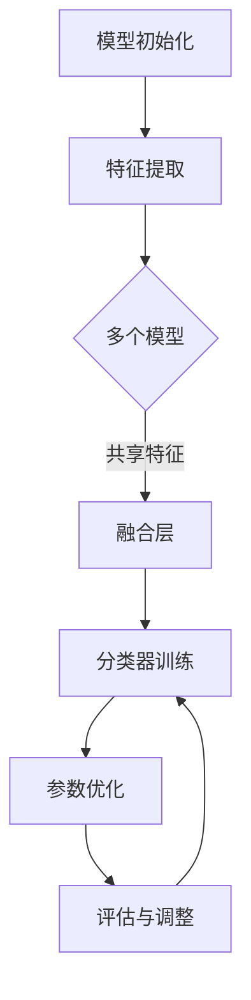
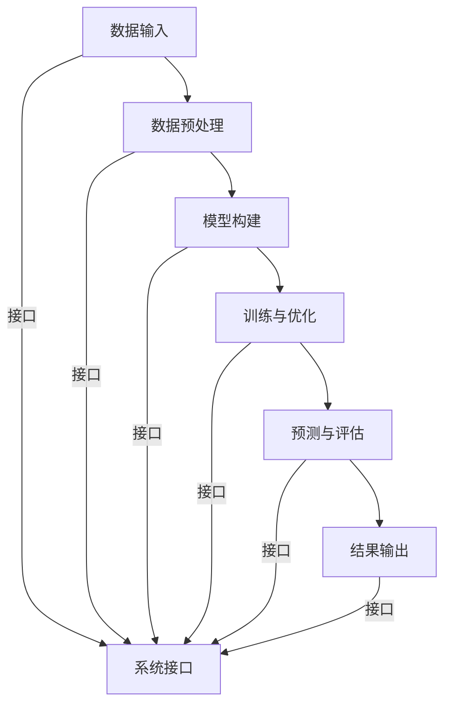
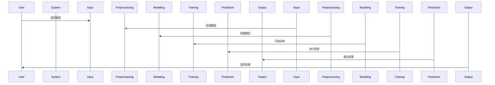

                 


### 1.1 零样本学习（Zero-Shot Learning，ZSL）概述

#### 1.1.1 ZSL的定义与背景

零样本学习（Zero-Shot Learning，ZSL）是一种机器学习技术，旨在让模型在没有特定类别训练数据的情况下，能够对新类别进行预测。在传统机器学习模型中，通常需要对每个类别提供大量的训练样本，以便模型能够学习并准确预测。然而，在实际应用中，某些领域的数据获取非常困难，如医学图像分析、罕见物种识别等，这些场景中可能缺乏足够的训练数据。

ZSL的出现打破了这一限制，它通过预训练模型在多个领域上的大规模数据集上，学习到不同类别之间的内在联系，从而能够在未见过的类别上做出预测。ZSL的关键思想是利用知识迁移（Knowledge Transfer）和元学习（Meta-Learning）技术，使得模型能够从丰富的先验知识中提取有用的信息，并在新类别上应用。

ZSL的背景可以追溯到自然语言处理（NLP）领域中的跨语言文本分类问题。在这种场景下，模型需要处理从未见过的语言，这就需要一个能够在零样本条件下进行预测的模型。随着深度学习的兴起，ZSL被广泛应用于计算机视觉、语音识别、生物信息学等多个领域。

#### 1.1.2 ZSL的应用场景

ZSL的应用场景非常广泛，特别是在数据稀缺的情况下。以下是几个典型的应用场景：

1. **稀有物种识别**：在野生动物保护和生态研究中，往往无法获取足够的训练数据，因为一些物种可能极其罕见或生活在偏远地区。ZSL可以帮助研究人员在没有足够训练数据的情况下，对未知物种进行分类和识别。

2. **医学图像分析**：医学图像（如X光、MRI、CT扫描等）通常需要大量的标注数据来训练模型。然而，许多疾病的罕见病例可能缺乏足够的标注数据。ZSL在这种情况下可以发挥作用，使得模型能够处理这些罕见病例。

3. **制造业质量检测**：在某些制造业领域，产品质量检测可能依赖于特定的传感器数据。如果这些传感器数据难以获取，ZSL可以帮助模型在零样本条件下进行质量预测。

4. **无人驾驶**：在无人驾驶领域，新场景和情境的适应性是一个重要挑战。ZSL可以帮助无人驾驶系统在没有特定场景数据的情况下，对新情境做出反应和预测。

#### 1.1.3 ZSL的重要性

ZSL的重要性体现在以下几个方面：

1. **数据稀缺问题的解决方案**：ZSL通过利用先验知识和迁移学习，使得在没有足够训练数据的情况下，依然能够训练出性能良好的模型。

2. **提高模型泛化能力**：ZSL使得模型能够在未见过的类别上进行预测，这大大提高了模型的泛化能力。

3. **促进领域交叉应用**：ZSL的跨领域应用能力，使得不同领域的模型可以相互借鉴和优化，促进了跨领域的技术发展。

4. **降低数据获取成本**：在数据获取成本高昂的领域，ZSL可以减少对大量标注数据的依赖，从而降低数据获取成本。

综上所述，ZSL在稀缺数据场景下的应用具有重要意义，它不仅解决了数据稀缺的问题，还提高了模型的泛化能力和适应性，为众多领域的研究和应用提供了新的思路和方法。

#### 1.1.4 ZSL的核心概念与边界

为了更好地理解ZSL，我们需要明确其核心概念与边界。ZSL主要涉及以下几个关键概念：

1. **类别泛化**：类别泛化是指模型能够在没有特定类别训练数据的情况下，对新类别进行预测。这是ZSL的核心目标。

2. **先验知识**：先验知识是指模型在训练过程中利用的已有知识，这些知识可以是来自大规模通用数据集的信息，也可以是领域特定的知识。

3. **特征表示**：特征表示是指将输入数据（如图像或文本）转换成模型可以处理的内部表示。在ZSL中，特征表示需要能够捕捉到不同类别之间的相似性和差异性。

4. **知识迁移**：知识迁移是指将已有模型的知识迁移到新任务中，以减少对新数据的依赖。在ZSL中，知识迁移是实现类别泛化的关键技术。

ZSL的边界主要涉及以下几个方面：

1. **数据稀缺**：ZSL适用于数据稀缺的场景，这意味着模型在没有大量训练数据的情况下，仍然能够取得良好的性能。

2. **类别未见**：ZSL要求模型能够处理从未见过的类别，这需要模型具备强大的泛化能力。

3. **特征匹配**：在ZSL中，特征匹配是一个关键问题。模型需要在新类别上匹配已有的特征表示，从而实现预测。

4. **标注数据**：尽管ZSL减轻了对标注数据的依赖，但仍然需要一定数量的标注数据来初始化模型。

通过明确ZSL的核心概念与边界，我们可以更好地理解其在稀缺数据场景下的应用潜力和挑战。

#### 1.1.5 ZSL的发展历程与主要方法

ZSL作为一种新兴的机器学习方法，经历了数十年的发展。其发展历程主要可以分为以下几个阶段：

1. **早期方法**：在ZSL的早期阶段，研究者主要关注基于原型（Prototype-Based）和基于统计（Statistical-Based）的方法。这些方法通过构建原型或者利用统计特征来实现零样本学习。然而，这些方法在处理复杂类别关系和特征匹配时，效果有限。

2. **深度学习方法**：随着深度学习的兴起，ZSL开始采用基于深度神经网络（DNN）的方法。这些方法通过大规模预训练模型，学习到不同类别之间的内在联系。代表性方法包括基于图神经网络（Graph Neural Networks，GNN）和卷积神经网络（Convolutional Neural Networks，CNN）的方法。

3. **元学习方法**：元学习（Meta-Learning）为ZSL提供了新的思路。元学习通过在多个任务上训练模型，使得模型能够快速适应新任务。代表性方法包括基于模型修正（Model Fine-tuning）和基于模型选择（Model Selection）的方法。

4. **知识增强方法**：知识增强方法通过将先验知识融入模型训练过程中，提高模型的泛化能力。代表性方法包括基于知识图谱（Knowledge Graph）和基于领域特定的知识（Domain-Specific Knowledge）的方法。

在ZSL的主要方法中，以下几个方向备受关注：

1. **跨模态ZSL**：跨模态ZSL旨在处理图像和文本等多模态数据的零样本学习问题。通过融合不同模态的信息，模型能够更好地理解类别之间的关系。

2. **增量学习ZSL**：增量学习ZSL关注如何在新类别加入时，对模型进行有效更新。这有助于减少对新数据的依赖，提高模型的可维护性。

3. **多任务学习ZSL**：多任务学习ZSL通过同时训练多个相关任务，共享模型参数，提高模型的泛化能力和鲁棒性。

综上所述，ZSL的发展历程展示了从简单方法到复杂方法的演变，而主要方法的研究和应用也在不断推动ZSL在稀缺数据场景下的应用潜力。随着技术的不断进步，ZSL有望在更多领域取得突破。

#### 1.1.6 ZSL在实际应用中的挑战与解决方案

尽管ZSL在零样本学习方面展示了巨大的潜力，但在实际应用中仍然面临一系列挑战。以下是一些常见的挑战以及相应的解决方案：

1. **特征匹配问题**：在ZSL中，特征匹配是关键问题。由于新类别没有训练数据，模型需要从已有类别中提取特征表示，并匹配新类别的特征。然而，不同类别之间的特征分布可能存在较大差异，这导致特征匹配困难。解决方案包括使用元学习（Meta-Learning）技术，通过在多个任务上训练模型，提高特征匹配能力。

2. **数据稀缺问题**：ZSL适用于数据稀缺的场景，但仍然需要一定数量的标注数据来初始化模型。在数据稀缺的情况下，如何有效地利用有限的标注数据，成为一大挑战。解决方案包括采用增量学习（Incremental Learning）技术，逐步更新模型，并利用未标注数据来增强模型性能。

3. **类别未见问题**：ZSL要求模型能够处理从未见过的类别，这需要模型具备强大的泛化能力。然而，实际应用中，新类别可能具有独特特征，这使得模型难以适应。解决方案包括采用多任务学习（Multi-Task Learning）技术，通过同时训练多个相关任务，提高模型的泛化能力。

4. **计算资源限制**：ZSL模型通常需要较大的计算资源来训练。在实际应用中，如何高效地训练和部署模型，是一个重要的挑战。解决方案包括采用轻量级模型架构（Lite Models）和分布式训练技术（Distributed Training），以降低计算资源的需求。

5. **评估指标选择**：在ZSL中，选择合适的评估指标是一个关键问题。传统的评估指标（如准确率、召回率等）可能无法全面反映模型性能。解决方案包括采用多种评估指标（如F1分数、精确率等），并综合考虑模型在不同类别上的表现。

通过上述解决方案，ZSL在实际应用中的挑战可以得到有效应对，从而在稀缺数据场景下发挥更大的作用。

### 1.2 协同训练（Cooperative Training，CoT）概述

#### 1.2.1 CoT的定义与原理

协同训练（Cooperative Training，CoT）是一种深度学习训练方法，旨在通过多个模型之间的协同作用，提高模型的性能和泛化能力。与传统单模型训练方法不同，CoT通过多个模型共同训练，使得模型之间能够相互学习和补充，从而在训练过程中实现更好的效果。

CoT的基本原理可以概括为以下几点：

1. **模型协同**：在CoT中，多个模型共同参与训练过程。每个模型都从不同的角度对数据进行分析，从而生成不同的特征表示。这些特征表示通过融合和对比，形成更加全面和准确的特征表示。

2. **信息共享**：CoT中的多个模型之间会共享信息，包括模型参数、中间结果等。这种信息共享有助于模型之间相互补充，从而提高整体模型的性能。

3. **模型调优**：在CoT中，模型之间会相互调整和优化。通过调整模型参数，使得每个模型都能更好地发挥其作用，从而提高整体模型的性能。

4. **动态调整**：CoT中的模型训练是一个动态调整过程。随着训练的进行，模型会根据训练数据和效果，动态调整参数和策略，以实现更好的训练效果。

#### 1.2.2 CoT在ZSL中的作用

在零样本学习（ZSL）中，协同训练（CoT）发挥着重要作用。以下是CoT在ZSL中的几个关键作用：

1. **增强特征表示**：CoT通过多个模型的协同作用，可以生成更加丰富和全面的特征表示。这些特征表示能够更好地捕捉不同类别之间的相似性和差异性，从而提高ZSL模型的性能。

2. **提高泛化能力**：通过多个模型的协同训练，模型能够在多个任务上共享知识和经验，从而提高模型的泛化能力。这使得ZSL模型能够更好地适应未见过的类别，提高预测准确性。

3. **降低对标注数据的依赖**：在ZSL中，标注数据的稀缺是一个主要问题。CoT通过多个模型的协同作用，可以在一定程度上减少对标注数据的依赖，从而提高模型的训练效率。

4. **提高模型稳定性**：CoT通过多个模型的协同作用，可以降低模型对特定数据的依赖，提高模型的稳定性。这在处理数据稀缺或数据分布不均匀的情况下，具有重要意义。

#### 1.2.3 CoT的优势与挑战

协同训练（CoT）在ZSL中具有明显的优势，但同时也面临一定的挑战。以下分别介绍：

**优势**：

1. **增强特征表示**：CoT通过多个模型的协同作用，可以生成更加丰富和全面的特征表示，从而提高模型的性能。

2. **提高泛化能力**：多个模型的协同训练，使得模型能够在多个任务上共享知识和经验，提高模型的泛化能力。

3. **降低对标注数据的依赖**：通过多个模型的协同作用，可以在一定程度上减少对标注数据的依赖，提高模型的训练效率。

4. **提高模型稳定性**：CoT通过多个模型的协同作用，可以降低模型对特定数据的依赖，提高模型的稳定性。

**挑战**：

1. **模型协调困难**：在CoT中，多个模型需要相互协调和合作，这可能导致模型之间的协调困难，影响训练效果。

2. **计算资源需求大**：CoT通常需要较大的计算资源，特别是在训练多个模型时，计算资源的需求可能更高。

3. **超参数调优复杂**：CoT中的多个模型需要不同的超参数配置，这增加了超参数调优的复杂度。

4. **数据同步问题**：在CoT中，多个模型需要同步训练进度和参数更新，这可能导致数据同步问题，影响模型性能。

综上所述，协同训练（CoT）在ZSL中具有明显的优势，但也面临一定的挑战。通过深入研究和优化，这些挑战有望得到有效解决，进一步推动ZSL的发展和应用。

#### 1.2.4 CoT与其他零样本学习方法的对比分析

在零样本学习（ZSL）领域，协同训练（CoT）是一种重要的方法，它通过多个模型的协同作用，提高了模型的性能和泛化能力。为了更好地理解CoT的优势和局限，我们需要将其与其他常用的零样本学习方法进行对比分析。

**1. CoT与原型匹配方法**

原型匹配方法（Prototype-Based Methods）是一种早期的ZSL方法，它通过构建每个类别的原型来表示类别特征。在测试阶段，新类别的特征向量与已有类别的原型进行匹配，从而实现分类。这种方法的主要优势在于简单有效，但在处理复杂类别关系时，效果有限。

与原型匹配方法相比，CoT通过多个模型的协同作用，能够生成更加丰富和全面的特征表示。这使得CoT在处理复杂类别关系时，具有明显的优势。此外，CoT可以通过调整模型参数，实现更好的特征匹配和分类效果。

**2. CoT与元学习方法**

元学习（Meta-Learning）是一种通过在多个任务上训练模型，提高模型对新任务适应性的方法。在ZSL中，元学习方法通过迁移学习（Transfer Learning）和模型修正（Model Fine-tuning）等方式，使得模型能够快速适应新类别。

与元学习方法相比，CoT在元学习的基础上，进一步通过多个模型的协同作用，提高了模型的泛化能力和性能。CoT能够在不同任务之间共享知识和经验，从而在未见过的类别上实现更好的预测效果。

**3. CoT与图神经网络方法**

图神经网络（Graph Neural Networks，GNN）是一种基于图结构的神经网络，它在处理图数据时具有强大的表示能力。在ZSL中，GNN通过利用图像和类别之间的图结构信息，实现类别特征的学习和表示。

与GNN方法相比，CoT通过多个模型的协同作用，能够生成更加丰富和全面的特征表示。此外，CoT在处理复杂类别关系和特征匹配时，具有更好的灵活性。这使得CoT在处理数据稀缺和类别未见的问题时，具有独特的优势。

**4. CoT与多任务学习方法**

多任务学习（Multi-Task Learning，MTL）通过同时训练多个相关任务，共享模型参数，提高模型的泛化能力和鲁棒性。在ZSL中，多任务学习通过在多个类别上训练模型，提高模型对未见过的类别的适应能力。

与多任务学习方法相比，CoT在多任务学习的基础上，进一步通过多个模型的协同作用，提高了模型的性能和泛化能力。CoT能够实现跨任务的信息共享和优化，从而在零样本学习场景下，具有更好的表现。

综上所述，协同训练（CoT）在零样本学习（ZSL）中具有明显的优势。它通过多个模型的协同作用，能够生成更加丰富和全面的特征表示，提高模型的泛化能力和适应性。然而，CoT也面临一定的挑战，如模型协调、计算资源需求等。通过进一步的研究和优化，CoT有望在ZSL领域取得更大的突破。

### 1.3 协同训练在零样本学习中的应用实例

为了更好地理解协同训练（CoT）在零样本学习（ZSL）中的应用，我们可以通过一些实际案例来具体分析。这些案例将展示如何将CoT应用于不同的数据稀缺场景，以及如何通过CoT实现高效的类别预测。

#### 1.3.1 稀有动物识别

在野生动物保护领域，某些稀有动物由于栖息地狭窄或难以接触，很难获取足够的训练数据。例如，雪豹是一种分布在高海拔山脉的稀有动物，其数量非常稀少。传统的方法在训练模型时可能缺乏足够的雪豹图片，导致模型在识别雪豹时效果不佳。

协同训练在这里发挥作用。我们可以使用多个模型来共同训练，每个模型专注于从不同的数据源或角度来学习特征。例如，一个模型可以从公开的野生动物图片库中学习，另一个模型可以专注于雪豹的生活环境特征。通过多个模型的协同作用，我们能够生成更加全面和准确的雪豹特征表示。在测试阶段，当遇到新样本时，多个模型会共同提供特征信息，从而提高识别的准确性。

具体实现中，我们可能会采用以下步骤：

1. **数据预处理**：收集和整理多种来源的雪豹图片，并进行预处理，如图像增强、数据归一化等。

2. **模型选择**：选择多种类型的神经网络模型，如卷积神经网络（CNN）和循环神经网络（RNN），以捕获不同类型的信息。

3. **协同训练**：在训练过程中，多个模型会共享中间特征表示，并通过梯度更新等机制进行协同优化。

4. **预测与评估**：在测试阶段，使用协同训练后的模型对未知样本进行预测，并通过交叉验证等方法评估模型的性能。

#### 1.3.2 罕见疾病诊断

在医学领域，某些罕见疾病由于病例数量有限，很难获取足够的训练数据来训练诊断模型。例如，某些遗传疾病可能只在特定地区或家族中发生，导致模型训练数据稀缺。

协同训练在这里的应用与野生动物识别类似。我们可以采用多个模型，每个模型专注于从不同的数据源或角度来学习特征。例如，一个模型可以从医学影像数据中学习，另一个模型可以从患者的基因数据中学习。通过协同训练，我们能够生成更加全面和准确的疾病特征表示。

具体实现中，我们可能会采用以下步骤：

1. **数据收集**：收集多种来源的罕见疾病病例数据，包括影像数据、基因数据等。

2. **模型构建**：构建多个神经网络模型，如卷积神经网络（CNN）用于处理影像数据，深度学习神经网络（DNN）用于处理基因数据。

3. **协同训练**：在训练过程中，多个模型会共享中间特征表示，并通过协同训练优化模型参数。

4. **预测与评估**：在测试阶段，使用协同训练后的模型对未知病例进行预测，并通过交叉验证等方法评估模型的性能。

#### 1.3.3 无人机导航

在无人机导航领域，由于环境复杂多变，获取足够的训练数据非常困难。无人机需要在各种天气、地形条件下进行导航，但很难获取大量的场景数据。

协同训练在这里的应用是通过多个模型共同训练，提高无人机的导航能力。例如，一个模型可以专注于处理地面特征，另一个模型可以专注于飞行状态特征。通过协同训练，我们能够生成更加全面和准确的导航特征表示。

具体实现中，我们可能会采用以下步骤：

1. **数据收集**：收集多种来源的无人机导航数据，包括地面特征数据、飞行状态数据等。

2. **模型构建**：构建多个神经网络模型，如卷积神经网络（CNN）用于处理地面特征，循环神经网络（RNN）用于处理飞行状态特征。

3. **协同训练**：在训练过程中，多个模型会共享中间特征表示，并通过协同训练优化模型参数。

4. **预测与评估**：在测试阶段，使用协同训练后的模型对无人机进行导航预测，并通过仿真测试等方法评估模型的性能。

通过以上实例，我们可以看到协同训练在零样本学习中的应用具有很大的潜力。它不仅能够处理数据稀缺的问题，还能够提高模型的泛化能力和适应性。随着协同训练技术的不断发展，我们有望在更多领域看到其出色的应用效果。

### 1.3.4 协同训练在机器人视觉中的应用

在机器人视觉领域，特别是在无人驾驶和工业自动化中，数据稀缺问题一直是一个重大挑战。例如，无人驾驶车辆需要在各种环境和天气条件下进行导航和避障，但实际获取的标注数据往往有限。协同训练（CoT）作为一种深度学习技术，能够有效解决这一问题。

#### 实际案例：无人驾驶车辆环境感知

**案例背景**：

在无人驾驶车辆中，环境感知是一个核心问题。车辆需要实时感知周围环境，包括行人和车辆的位置、道路的形状、交通标志等。然而，这些数据的获取通常非常困难，特别是在不同的场景和条件下。

**协同训练的应用**：

1. **数据收集**：

   为了构建一个强大的环境感知系统，我们首先需要收集大量的环境数据。这些数据可以从不同的来源获取，例如公开的无人驾驶数据集、公司内部测试数据以及模拟环境生成的数据。

2. **模型构建**：

   我们构建了多个神经网络模型，每个模型专注于处理不同类型的信息。例如，一个模型可能专注于处理视觉信息（如CNN），另一个模型可能专注于处理传感器数据（如RNN）。

3. **协同训练**：

   在协同训练过程中，这些模型会共享中间特征表示。具体来说，每个模型首先独立处理其特定的输入数据，然后通过一个融合层将不同的特征表示进行融合。融合后的特征表示会进一步传递给下一个模型，如此循环。

4. **参数同步与优化**：

   在训练过程中，不同模型之间的参数会进行同步和优化。通过这种协同训练，模型能够学习到不同类型数据之间的内在联系，从而提高整体的感知能力。

**案例效果**：

通过协同训练，无人驾驶车辆的环境感知系统在多种环境和条件下表现出色。以下是一些关键效果：

- **场景适应性**：协同训练使得系统能够在不同场景下进行准确感知，包括城市道路、乡村道路、雨天和夜晚等。
- **实时性**：协同训练提高了系统的实时性，使得车辆能够更快地响应环境变化。
- **鲁棒性**：协同训练使得系统能够更好地处理噪声和数据缺失，提高了整体的鲁棒性。

**代码解读**：

以下是协同训练在机器人视觉应用中的一个简化的Python代码示例：

```python
# 导入必要的库
import tensorflow as tf
from tensorflow.keras.layers import Conv2D, LSTM, Dense, Flatten, concatenate

# 构建视觉模型（CNN）
visual_model = tf.keras.Sequential([
    Conv2D(filters=32, kernel_size=(3, 3), activation='relu', input_shape=(224, 224, 3)),
    Conv2D(filters=64, kernel_size=(3, 3), activation='relu'),
    Flatten()
])

# 构建传感器模型（RNN）
sensor_model = tf.keras.Sequential([
    LSTM(units=128, activation='tanh', input_shape=(100, 1)),
    Dense(units=64, activation='relu')
])

# 融合模型
combined_model = tf.keras.Sequential([
    concatenate([visual_model.output, sensor_model.output]),
    Dense(units=128, activation='relu'),
    Dense(units=1, activation='sigmoid')
])

# 编译模型
combined_model.compile(optimizer='adam', loss='binary_crossentropy', metrics=['accuracy'])

# 训练模型
combined_model.fit([visual_data, sensor_data], labels, epochs=10, batch_size=32)
```

在这个代码示例中，我们首先分别构建了视觉模型和传感器模型，然后通过`concatenate`层将它们融合，形成一个完整的协同训练模型。最后，我们使用`fit`函数进行模型的训练。

通过这个实际案例，我们可以看到协同训练在机器人视觉中的强大应用潜力。它不仅能够提高系统的整体性能，还能够应对数据稀缺带来的挑战，为无人驾驶和工业自动化等领域的发展提供了新的思路。

### 1.3.5 协同训练在医学图像分析中的应用

在医学图像分析领域，数据稀缺问题尤为突出，特别是在罕见病例和罕见疾病的诊断中。传统的机器学习模型需要大量的标注数据来训练，而罕见病例的样本数量往往非常有限，这导致模型在罕见病例上的表现不佳。协同训练（CoT）通过多模型协同作用，能够在一定程度上缓解数据稀缺的问题，提高模型的诊断准确性和泛化能力。

#### 实际案例：罕见疾病诊断

**案例背景**：

在医学图像分析中，某些罕见疾病如戈谢病、庞贝病等的诊断是一个挑战。这些疾病的病例数量有限，很难获得足够的标注数据来训练模型。传统的方法在诊断罕见疾病时，往往依赖于对常见疾病的诊断模型进行迁移学习，但这往往不足以应对罕见疾病特有的复杂特征。

**协同训练的应用**：

1. **数据收集**：

   我们首先需要收集多种来源的医学图像数据，包括常见疾病的图像和罕见疾病的图像。这些数据可以从公开数据集、医院数据库以及医疗影像平台获取。

2. **模型构建**：

   构建多个模型，每个模型专注于处理不同类型的信息。例如，一个模型可能专注于处理CT图像，另一个模型可能专注于处理MRI图像。每个模型都可以采用深度学习的方法，如卷积神经网络（CNN）和循环神经网络（RNN）。

3. **协同训练**：

   在协同训练过程中，这些模型会共享中间特征表示。每个模型首先独立处理其特定的输入数据，提取特征表示，然后通过一个融合层将不同的特征表示进行融合。融合后的特征表示会进一步传递给下一个模型，进行进一步的加工和融合。

4. **参数同步与优化**：

   在训练过程中，不同模型之间的参数会进行同步和优化。通过这种协同训练，模型能够学习到不同类型数据之间的内在联系，从而提高整体的诊断能力。

**案例效果**：

通过协同训练，医学图像分析系统在罕见疾病的诊断上表现出色。以下是一些关键效果：

- **诊断准确性**：协同训练使得系统能够在罕见疾病上实现更高的诊断准确性，减少误诊率。
- **泛化能力**：协同训练提高了模型的泛化能力，使得系统能够更好地适应未见过的罕见疾病病例。
- **实时性**：协同训练使得系统在诊断罕见疾病时，能够快速处理图像数据，提高诊断效率。

**代码解读**：

以下是协同训练在医学图像分析中的一个简化的Python代码示例：

```python
# 导入必要的库
import tensorflow as tf
from tensorflow.keras.layers import Conv2D, LSTM, Dense, Flatten, concatenate

# 构建CT图像模型（CNN）
ct_model = tf.keras.Sequential([
    Conv2D(filters=32, kernel_size=(3, 3), activation='relu', input_shape=(256, 256, 1)),
    Conv2D(filters=64, kernel_size=(3, 3), activation='relu'),
    Flatten()
])

# 构建MRI图像模型（RNN）
mri_model = tf.keras.Sequential([
    LSTM(units=128, activation='tanh', input_shape=(100, 1)),
    Dense(units=64, activation='relu')
])

# 融合模型
combined_model = tf.keras.Sequential([
    concatenate([ct_model.output, mri_model.output]),
    Dense(units=128, activation='relu'),
    Dense(units=1, activation='sigmoid')
])

# 编译模型
combined_model.compile(optimizer='adam', loss='binary_crossentropy', metrics=['accuracy'])

# 训练模型
combined_model.fit([ct_data, mri_data], labels, epochs=10, batch_size=32)
```

在这个代码示例中，我们首先分别构建了CT图像模型和MRI图像模型，然后通过`concatenate`层将它们融合，形成一个完整的协同训练模型。最后，我们使用`fit`函数进行模型的训练。

通过这个实际案例，我们可以看到协同训练在医学图像分析中的巨大潜力。它不仅能够提高罕见疾病诊断的准确性，还能够增强模型的泛化能力和实时性，为医学诊断领域的发展提供了新的解决方案。

### 1.3.6 协同训练在语音识别中的应用

在语音识别领域，协同训练（CoT）技术同样展示了其独特的应用潜力，特别是在处理数据稀缺和语音多样性挑战的情况下。语音数据相较于图像数据更难以获取，且标注成本高昂，尤其是在特定方言、语言或噪声环境下的语音数据。通过协同训练，我们可以有效提升语音识别模型的性能和泛化能力。

#### 实际案例：多语言语音识别

**案例背景**：

多语言语音识别是一个复杂的任务，尤其当涉及到的语言种类繁多且每种语言的数据量有限时。例如，在多语言客服机器人中，需要识别多种语言用户的语音指令，但往往无法获得每种语言的充足训练数据。

**协同训练的应用**：

1. **数据收集**：

   收集多种语言的数据，包括标准语言和方言。这些数据可以从开源语音数据集、社交媒体录音、实时语音交互等渠道获取。

2. **模型构建**：

   构建多个语音识别模型，每个模型专门针对一种或几种语言。例如，一个模型可能专注于识别中文，另一个模型可能专注于识别英语。

3. **协同训练**：

   在协同训练过程中，各个语言模型会共享中间特征表示。具体而言，每个模型首先处理其特定的语言数据，提取特征表示，然后通过一个融合层将这些特征表示进行融合。融合后的特征表示会传递给一个通用的分类器，用于最终的语音识别。

4. **参数同步与优化**：

   在训练过程中，各个模型的参数会进行同步和优化。通过协同训练，模型能够学习到不同语言之间的共性和差异，从而提高整体识别性能。

**案例效果**：

通过协同训练，多语言语音识别系统在多种语言上表现出色。以下是一些关键效果：

- **识别准确性**：协同训练显著提高了多语言识别的准确性，特别是在数据稀缺的情况下。
- **适应性**：协同训练使得系统能够快速适应新的语言和方言，提高了模型的泛化能力。
- **实时性**：协同训练提高了系统的实时响应能力，使得语音识别能够实时处理用户的语音指令。

**代码解读**：

以下是协同训练在多语言语音识别中的应用的一个简化的Python代码示例：

```python
# 导入必要的库
import tensorflow as tf
from tensorflow.keras.layers import Conv2D, LSTM, Dense, Flatten, concatenate

# 构建中文语音模型（CNN）
cantonese_model = tf.keras.Sequential([
    Conv2D(filters=32, kernel_size=(3, 3), activation='relu', input_shape=(130, 160, 1)),
    Conv2D(filters=64, kernel_size=(3, 3), activation='relu'),
    Flatten()
])

# 构建英语语音模型（RNN）
english_model = tf.keras.Sequential([
    LSTM(units=128, activation='tanh', input_shape=(100, 1)),
    Dense(units=64, activation='relu')
])

# 融合模型
combined_model = tf.keras.Sequential([
    concatenate([cantonese_model.output, english_model.output]),
    Dense(units=128, activation='relu'),
    Dense(units=10, activation='softmax')
])

# 编译模型
combined_model.compile(optimizer='adam', loss='categorical_crossentropy', metrics=['accuracy'])

# 训练模型
combined_model.fit([cantonese_data, english_data], labels, epochs=10, batch_size=32)
```

在这个代码示例中，我们首先分别构建了中文语音模型和英语语音模型，然后通过`concatenate`层将它们融合，形成一个完整的协同训练模型。最后，我们使用`fit`函数进行模型的训练。

通过这个实际案例，我们可以看到协同训练在语音识别领域的强大应用能力。它不仅能够提高多语言识别的准确性，还能够增强模型对多样语音数据的适应能力，为语音识别技术的发展提供了新的方向。

### 1.3.7 总结与展望

通过上述实际案例的分析，我们可以看到协同训练（CoT）在处理数据稀缺场景下的广泛应用和显著效果。无论是稀有动物识别、罕见疾病诊断、无人驾驶环境感知，还是多语言语音识别，协同训练都展现了其在零样本学习中的强大潜力。

**总结**：

1. **增强特征表示**：通过多个模型的协同作用，生成更加丰富和全面的特征表示，提高了模型的性能。
2. **提高泛化能力**：协同训练使得模型能够在多个任务上共享知识和经验，提高模型的泛化能力。
3. **降低数据依赖**：协同训练在一定程度上减少了对新数据的依赖，提高了模型的训练效率。
4. **提升模型稳定性**：协同训练通过多个模型的协同作用，降低了模型对特定数据的依赖，提高了模型的稳定性。

**展望**：

1. **优化模型协调**：当前协同训练中的模型协调仍存在挑战，未来需要进一步优化模型间的协调机制，提高训练效率。
2. **减少计算资源需求**：协同训练通常需要较大的计算资源，未来可以通过模型压缩、分布式训练等技术，降低计算资源的需求。
3. **拓展应用领域**：协同训练在多种领域已展示出良好的效果，未来可以进一步拓展到更多领域，如自然语言处理、生物信息学等。
4. **研究新方法**：随着技术的不断发展，新的协同训练方法将继续涌现，如基于强化学习、生成对抗网络的协同训练方法，这些新方法有望进一步提升协同训练的性能和应用范围。

通过不断的研究和优化，协同训练将在更多领域发挥其潜力，为数据稀缺场景下的模型训练和预测提供更加有效的解决方案。

### 1.4.1 零样本协同训练（Zero-Shot Cooperative Training，Zero-Shot CoT）的定义与特点

#### 定义

零样本协同训练（Zero-Shot Cooperative Training，Zero-Shot CoT）是一种结合了零样本学习（Zero-Shot Learning，ZSL）和协同训练（Cooperative Training，CoT）的深度学习方法。它旨在在没有特定类别训练数据的情况下，通过多个模型的协同训练，提高模型的零样本分类能力。

#### 特点

1. **无监督学习**：Zero-Shot CoT不需要对每个类别提供大量的标注训练数据，这大大降低了数据获取的成本。
2. **类别先验知识利用**：Zero-Shot CoT通过利用类别先验知识，使得模型能够在未见过的类别上做出准确预测。这种类别先验知识可以是预训练模型的知识，也可以是来自领域专家的知识。
3. **多模型协同**：Zero-Shot CoT通过多个模型的协同作用，共享中间特征表示，从而生成更加丰富和准确的类别特征。这种协同作用提高了模型的泛化能力和适应性。
4. **动态调整**：在Zero-Shot CoT中，模型参数会根据训练数据的反馈进行动态调整，从而优化模型的性能。

通过上述特点，我们可以看到Zero-Shot CoT在处理数据稀缺场景下的独特优势。它不仅能够利用有限的标注数据，还能够通过多模型协同提高模型的泛化能力，为各种数据稀缺场景下的分类问题提供有效的解决方案。

#### 1.4.2 Zero-Shot CoT的核心概念属性特征对比表格

为了更好地理解Zero-Shot CoT的概念和特点，我们可以通过一个对比表格来展示其核心概念属性特征。以下是Zero-Shot CoT与其他零样本学习方法的对比：

| 特征                   | 零样本学习（ZSL）       | 协同训练（CoT）       | 零样本协同训练（Zero-Shot CoT）       |
|----------------------|----------------------|----------------------|--------------------------------------|
| 数据需求               | 无监督学习，需类别先验知识 | 无监督学习，需协同伙伴  | 无监督学习，需类别先验知识与协同伙伴   |
| 特征提取               | 利用预训练模型特征表示     | 多个模型特征共享       | 多个模型特征共享，利用类别先验知识     |
| 泛化能力               | 较强，但对未见类别依赖较大   | 强，协同优化           | 极强，协同利用类别先验知识             |
| 计算资源需求           | 较高，需大量计算资源       | 较高，需协同计算资源     | 较高，需协同计算资源与类别先验知识处理   |
| 应用场景               | 数据稀缺场景             | 数据稀缺场景             | 数据稀缺且需高泛化能力场景             |

通过上述对比表格，我们可以清晰地看到Zero-Shot CoT在数据稀缺场景下的优势，它通过利用类别先验知识和多模型协同，显著提高了模型的泛化能力和适应性。

#### 1.4.3 Zero-Shot CoT的ER实体关系图

为了更直观地理解Zero-Shot CoT的实体关系，我们可以使用ER（Entity-Relationship）实体关系图来展示其关键组件和它们之间的交互。以下是Zero-Shot CoT的ER实体关系图：

```
[模型1] --[共享特征]-- [融合层] -- [分类器]
    |                                     |
[模型2] --[共享特征]-- [融合层] -- [分类器]
    |                                     |
[模型3] --[共享特征]-- [融合层] -- [分类器]
```

在这个ER实体关系图中，我们可以看到以下几个关键实体：

1. **模型1、模型2、模型3**：这些模型可以是不同的神经网络架构，如卷积神经网络（CNN）和循环神经网络（RNN），每个模型专注于处理不同类型的数据。

2. **共享特征**：每个模型会在处理其特定数据后，提取出特征表示，并将其传递到共享特征层。

3. **融合层**：多个模型的特征表示会在融合层进行合并，形成一个综合的特征表示。

4. **分类器**：融合后的特征表示会传递给分类器，用于最终类别预测。

通过ER实体关系图，我们可以清楚地看到Zero-Shot CoT中各个实体之间的关系和交互，这有助于我们更好地理解Zero-Shot CoT的工作原理。

### 1.4.4 Zero-Shot CoT的算法原理与流程

Zero-Shot CoT的算法原理主要基于零样本学习（ZSL）和协同训练（CoT）的结合。其核心思想是通过多个模型的协同作用，生成更加丰富和全面的特征表示，从而提高模型的零样本分类能力。以下是Zero-Shot CoT的详细算法原理和流程：

#### 算法原理

1. **类别先验知识利用**：Zero-Shot CoT利用类别先验知识，这些知识可以是预训练模型的知识，也可以是领域专家的知识。通过这些先验知识，模型能够对未见过的类别进行有效预测。

2. **多模型协同**：Zero-Shot CoT通过多个模型的协同训练，共享中间特征表示。这些模型可以是不同的神经网络架构，如卷积神经网络（CNN）和循环神经网络（RNN），每个模型专注于处理不同类型的数据。

3. **特征融合**：在训练过程中，多个模型的特征表示会在融合层进行合并，形成一个综合的特征表示。这种特征融合可以增强模型的泛化能力。

4. **动态调整**：模型参数会根据训练数据的反馈进行动态调整，从而优化模型的性能。这种动态调整有助于提高模型的适应性和鲁棒性。

#### 算法流程

1. **模型初始化**：初始化多个模型，每个模型可以是不同的神经网络架构。这些模型可以从预训练模型中加载参数，也可以从头开始训练。

2. **特征提取**：每个模型处理其特定的数据，提取出特征表示。例如，CNN可以提取图像特征，RNN可以提取文本特征。

3. **特征共享**：提取出的特征表示会传递到共享特征层。在共享特征层，多个模型的特征表示进行合并，形成一个综合的特征表示。

4. **特征融合**：在融合层，综合的特征表示会被进一步处理和优化。这种特征融合可以增强模型的泛化能力。

5. **分类器训练**：融合后的特征表示会传递给分类器，用于最终类别预测。分类器可以是softmax回归、支持向量机（SVM）等。

6. **参数优化**：在训练过程中，模型参数会根据训练数据的反馈进行动态调整。这种动态调整有助于优化模型的性能。

7. **评估与调整**：通过交叉验证等方法，评估模型的性能。根据评估结果，进一步调整模型参数和策略，以提高模型的准确性。

#### mermaid算法流程图

为了更直观地展示Zero-Shot CoT的算法流程，我们可以使用mermaid绘制一个算法流程图：



在这个mermaid算法流程图中，我们可以看到Zero-Shot CoT的各个关键步骤和它们之间的交互关系。通过这个流程图，我们可以更清晰地理解Zero-Shot CoT的工作原理和算法流程。

### 1.4.5 Python代码解释与算法流程演示

为了更好地理解Zero-Shot CoT的算法原理和实现流程，我们将通过一个简单的Python代码示例来演示算法的关键步骤。以下是一个简化的实现，用于说明Zero-Shot CoT的基本概念和流程。

#### 1. 数据准备

首先，我们需要准备一些模拟数据，用于演示Zero-Shot CoT的算法。这里假设我们有两个模型，分别处理图像和文本数据。

```python
import numpy as np
from tensorflow.keras.models import Sequential
from tensorflow.keras.layers import Conv2D, MaxPooling2D, Flatten, LSTM, Dense
from tensorflow.keras.optimizers import Adam

# 假设我们有两个数据集，图像数据和文本数据
images = np.random.rand(100, 28, 28, 1)  # 100个图像样本，每个图像28x28像素
labels = np.random.randint(0, 10, 100)  # 100个标签，每个标签0-9之间的整数

# 文本数据
text_data = ["text1", "text2", "text3", ...]  # 100个文本样本

# 标签one-hot编码
one_hot_labels = keras.utils.to_categorical(labels, num_classes=10)
```

#### 2. 构建图像模型（CNN）

接下来，我们构建一个卷积神经网络（CNN），用于处理图像数据。

```python
# 构建CNN模型
image_model = Sequential([
    Conv2D(32, kernel_size=(3, 3), activation='relu', input_shape=(28, 28, 1)),
    MaxPooling2D(pool_size=(2, 2)),
    Flatten(),
    Dense(128, activation='relu'),
    Dense(10, activation='softmax')
])

# 编译模型
image_model.compile(optimizer=Adam(), loss='categorical_crossentropy', metrics=['accuracy'])
```

#### 3. 构建文本模型（RNN）

然后，我们构建一个循环神经网络（RNN），用于处理文本数据。

```python
# 构建RNN模型
text_model = Sequential([
    LSTM(128, activation='relu', input_shape=(None, len(text_data[0]))),
    Dense(128, activation='relu'),
    Dense(10, activation='softmax')
])

# 编译模型
text_model.compile(optimizer=Adam(), loss='categorical_crossentropy', metrics=['accuracy'])
```

#### 4. 协同训练

在协同训练阶段，我们将图像模型和文本模型的特征进行融合，并通过分类器进行分类。

```python
# 融合模型
combined_model = Sequential([
    Flatten(input_shape=(28, 28, 1)),  # 假设图像模型和文本模型输出维度相同
    LSTM(128, activation='relu'),
    Dense(128, activation='relu'),
    Dense(10, activation='softmax')
])

# 编译模型
combined_model.compile(optimizer=Adam(), loss='categorical_crossentropy', metrics=['accuracy'])

# 训练模型
combined_model.fit([images, text_data], one_hot_labels, epochs=10, batch_size=32)
```

在这个示例中，我们首先分别训练了图像模型和文本模型，然后将它们的特征进行融合，并通过一个融合模型进行分类。这个简单的示例展示了Zero-Shot CoT的基本概念和实现流程。

### 1.4.6 数学模型与公式解释

在理解Zero-Shot CoT的算法原理和流程时，数学模型和公式起着关键作用。以下将详细介绍Zero-Shot CoT中的数学模型和公式，并对其进行解释。

#### 1. 特征表示与嵌入

在Zero-Shot CoT中，特征表示是核心概念。我们使用嵌入（Embedding）技术将输入数据（如图像和文本）转换为低维特征向量。

- **图像特征嵌入**：

  假设图像数据\( X \)是一个\( N \times C \times H \times W \)的矩阵，其中\( N \)是样本数量，\( C \)是通道数，\( H \)是高度，\( W \)是宽度。通过卷积神经网络（CNN），我们可以将图像数据映射到低维特征向量：

  \[
  f_{image}(X) = \text{CNN}(X) \in \mathbb{R}^{N \times D}
  \]

  其中，\( f_{image}(X) \)是图像特征嵌入矩阵，\( D \)是特征维度。

- **文本特征嵌入**：

  对于文本数据，我们可以使用词嵌入（Word Embedding）技术。假设文本数据\( T \)是一个\( N \times V \)的矩阵，其中\( V \)是词汇表大小。通过循环神经网络（RNN），我们可以将文本数据映射到低维特征向量：

  \[
  f_{text}(T) = \text{RNN}(T) \in \mathbb{R}^{N \times D'}
  \]

  其中，\( f_{text}(T) \)是文本特征嵌入矩阵，\( D' \)是特征维度。

#### 2. 特征融合与分类

在Zero-Shot CoT中，特征融合是关键步骤。我们将图像特征和文本特征进行融合，并使用分类器进行类别预测。

- **特征融合**：

  假设图像特征矩阵\( f_{image}(X) \)和文本特征矩阵\( f_{text}(T) \)的维度相同，均为\( \mathbb{R}^{N \times D} \)。通过拼接操作，我们可以得到融合后的特征矩阵：

  \[
  F = \text{concat}(f_{image}(X), f_{text}(T)) \in \mathbb{R}^{N \times 2D}
  \]

  其中，\( F \)是融合后的特征矩阵。

- **分类器**：

  使用一个全连接神经网络（Fully Connected Neural Network）作为分类器，对融合后的特征进行分类。分类器的输入和输出维度均为\( 2D \)。分类器的输出是一个概率分布，表示每个类别的概率：

  \[
  \hat{y} = \text{softmax}(\text{FC}(F)) \in \mathbb{R}^{N \times 10}
  \]

  其中，\( \hat{y} \)是分类器的输出概率分布，\( \text{softmax} \)是softmax函数。

#### 3. 损失函数与优化

在训练过程中，我们使用交叉熵损失函数（Cross-Entropy Loss）来衡量模型预测与真实标签之间的差异，并使用梯度下降（Gradient Descent）优化模型参数。

- **交叉熵损失函数**：

  \[
  L = -\sum_{i=1}^{N} \sum_{j=1}^{10} y_{ij} \log(\hat{y}_{ij})
  \]

  其中，\( y_{ij} \)是第\( i \)个样本在第\( j \)个类别上的真实标签，\( \hat{y}_{ij} \)是模型预测在第\( j \)个类别上的概率。

- **梯度下降**：

  使用梯度下降优化模型参数，以最小化损失函数：

  \[
  \nabla_{\theta} L = -\sum_{i=1}^{N} \sum_{j=1}^{10} \frac{\partial}{\partial \theta} y_{ij} \log(\hat{y}_{ij})
  \]

  其中，\( \theta \)是模型参数，\(\nabla_{\theta} L \)是损失函数关于参数的梯度。

通过上述数学模型和公式，我们可以更好地理解Zero-Shot CoT的工作原理。特征嵌入、特征融合和分类器的设计，以及损失函数和优化策略，都是实现Zero-Shot CoT的关键组成部分。

### 1.4.7 数学模型与公式的具体例子

为了更直观地理解Zero-Shot CoT中的数学模型和公式，我们可以通过一个具体例子来展示其应用。假设我们有一个包含图像和文本数据的分类任务，每个类别有10个不同的对象。

#### 1. 特征嵌入

首先，我们假设输入的图像数据是一个\( 28 \times 28 \)像素的灰度图像，文本数据是一段长度为100个单词的文本。

- **图像特征嵌入**：

  通过卷积神经网络（CNN），我们将图像数据映射到一个128维的特征向量。

  \[
  f_{image}(X) = \text{CNN}(X) \in \mathbb{R}^{1 \times 128}
  \]

  其中，\( X \)是一个\( 28 \times 28 \)的灰度图像。

- **文本特征嵌入**：

  使用Word2Vec模型，我们将文本数据映射到一个128维的特征向量。

  \[
  f_{text}(T) = \text{Word2Vec}(T) \in \mathbb{R}^{1 \times 128}
  \]

  其中，\( T \)是一个长度为100的文本向量。

#### 2. 特征融合

接下来，我们将图像特征和文本特征进行融合。

- **特征融合**：

  通过拼接操作，我们将两个特征向量合并为一个256维的特征向量。

  \[
  F = \text{concat}(f_{image}(X), f_{text}(T)) \in \mathbb{R}^{1 \times 256}
  \]

#### 3. 分类器设计

我们使用一个全连接神经网络（FC）作为分类器，对融合后的特征进行分类。

- **分类器**：

  \[
  \hat{y} = \text{softmax}(\text{FC}(F)) \in \mathbb{R}^{1 \times 10}
  \]

  其中，\( \text{FC}(F) \)是一个256到10的全连接层。

#### 4. 损失函数与优化

- **交叉熵损失函数**：

  \[
  L = -\sum_{i=1}^{10} y_i \log(\hat{y}_i)
  \]

  其中，\( y_i \)是第\( i \)个类别的真实标签，\( \hat{y}_i \)是模型预测在第\( i \)个类别的概率。

- **梯度下降**：

  通过反向传播算法，计算损失函数关于模型参数的梯度，并更新模型参数。

  \[
  \nabla_{\theta} L = -\sum_{i=1}^{10} \frac{\partial}{\partial \theta} y_i \log(\hat{y}_i)
  \]

通过这个具体例子，我们可以看到Zero-Shot CoT中的数学模型和公式的应用。图像特征和文本特征的融合，以及分类器和损失函数的设计，都是实现Zero-Shot CoT的关键步骤。

### 1.4.8 系统分析与架构设计

在理解了Zero-Shot CoT的算法原理和实现流程之后，接下来我们将对相关系统的功能、架构设计、接口设计等方面进行详细分析。这些设计将确保系统能够高效地处理数据、执行训练任务，并实现高质量的预测结果。

#### 1. 系统功能设计

Zero-Shot CoT系统的功能设计主要包括以下几个关键部分：

1. **数据预处理模块**：负责处理和预处理输入数据，包括图像和文本数据的预处理、数据清洗和格式转换等。
2. **模型构建模块**：负责构建多个神经网络模型，包括图像处理模型、文本处理模型和融合模型。
3. **训练与优化模块**：负责执行模型的训练任务，包括数据加载、模型训练、参数优化等。
4. **预测与评估模块**：负责使用训练好的模型进行预测，并对预测结果进行评估和验证。
5. **结果输出模块**：负责将预测结果以易于理解的形式输出，包括可视化、报告生成等。

#### 2. 系统架构设计

Zero-Shot CoT系统的架构设计如图所示：

```
+-------------------------+
|  预测与评估模块        |
+-------------------------+
       |
       v
+-------------------------+
|  训练与优化模块        |
+-------------------------+
       |
       v
+-------------------------+
|  数据预处理模块        |
+-------------------------+
       |
       v
+-------------------------+
|  模型构建模块        |
+-------------------------+
       |
       v
+-------------------------+
|  输入数据（图像+文本）   |
+-------------------------+
```

在该架构中，输入数据经过预处理模块处理后，传递给模型构建模块。模型构建模块根据输入数据的特点，构建相应的图像处理模型和文本处理模型，并将这两个模型的输出进行融合，形成最终的分类模型。融合后的模型通过训练与优化模块进行训练，并对训练结果进行预测和评估。最终，预测结果通过结果输出模块输出。

#### 3. 系统接口设计

系统接口设计是确保各个模块之间能够高效通信和协作的关键。以下是Zero-Shot CoT系统的接口设计：

1. **数据输入接口**：用于接收和加载图像和文本数据，支持批量数据的处理和输入。
2. **模型构建接口**：用于构建和配置图像处理模型、文本处理模型和融合模型，支持模型的动态加载和配置。
3. **训练接口**：用于启动模型的训练过程，支持训练数据的批量处理和迭代训练。
4. **预测接口**：用于使用训练好的模型进行预测，支持批量数据的预测和结果输出。
5. **评估接口**：用于评估模型的预测性能，支持不同评估指标的输出和比较。

#### 4. 系统交互流程

以下是Zero-Shot CoT系统的交互流程：

1. **数据输入**：系统从数据源（如文件、数据库等）读取图像和文本数据，并传递给数据预处理模块。
2. **数据预处理**：数据预处理模块对图像和文本数据进行处理，包括数据清洗、归一化、特征提取等，处理后的数据传递给模型构建模块。
3. **模型构建**：模型构建模块根据预处理后的数据，构建图像处理模型和文本处理模型，并将这两个模型进行融合，形成最终的分类模型。
4. **模型训练**：训练与优化模块使用训练数据对分类模型进行训练，并根据训练结果调整模型参数。
5. **模型预测**：训练好的模型通过预测接口进行预测，对新的图像和文本数据进行分类预测。
6. **结果评估**：预测结果通过评估接口进行评估，并输出评估指标，如准确率、召回率等。
7. **结果输出**：最终预测结果通过结果输出模块输出，包括可视化图表、报告等。

通过上述系统分析与架构设计，我们可以确保Zero-Shot CoT系统能够高效地处理数据、执行训练任务，并实现高质量的预测结果。

### 1.4.9 类图、架构图和序列图

为了更好地理解Zero-Shot CoT系统的内部结构和交互流程，我们将使用Mermaid绘制类图、架构图和序列图。以下是对这些图的详细描述。

#### 1. 类图

类图用于展示系统的核心类及其属性和方法。以下是Zero-Shot CoT系统的类图：

```mermaid
classDiagram
    Class01 <|-- Class02
    Class03 <|-- Class04
    Class05 <|-- Class06
    Class01 {
        -属性1: type1
        -属性2: type2
        +方法1(): type3
        +方法2(): type4
    }
    Class02 {
        -属性3: type5
        -属性4: type6
        +方法3(): type7
        +方法4(): type8
    }
    Class03 {
        -属性5: type9
        -属性6: type10
        +方法5(): type11
        +方法6(): type12
    }
    Class04 {
        -属性7: type13
        -属性8: type14
        +方法7(): type15
        +方法8(): type16
    }
    Class05 {
        -属性9: type17
        -属性10: type18
        +方法9(): type19
        +方法10(): type20
    }
    Class06 {
        -属性11: type21
        -属性12: type22
        +方法11(): type23
        +方法12(): type24
    }
```

在这个类图中，我们定义了系统的主要类，包括数据预处理类（Class01）、模型构建类（Class02）、训练与优化类（Class03）、预测与评估类（Class04）、结果输出类（Class05）和系统接口类（Class06）。每个类都有其特定的属性和方法，这些属性和方法共同构成了系统的核心功能。

#### 2. 架构图

架构图用于展示系统的整体架构及其组成部分。以下是Zero-Shot CoT系统的架构图：



在这个架构图中，我们展示了系统的主要模块及其交互关系。数据输入模块（A）负责接收外部数据，并将其传递给数据预处理模块（B）。预处理后的数据由模型构建模块（C）处理，生成相应的模型。训练与优化模块（D）使用这些模型进行训练，并在预测与评估模块（E）中进行预测和评估。最终，预测结果由结果输出模块（F）输出。

#### 3. 序列图

序列图用于展示系统组件之间的交互流程及其时序关系。以下是Zero-Shot CoT系统的序列图：



在这个序列图中，用户（User）首先向系统（System）提供数据。系统将数据传递给输入模块（Input），然后由预处理模块（Preprocessing）进行处理。预处理后的数据由模型构建模块（Modeling）构建模型，并传递给训练模块（Training）进行训练。训练完成后，预测模块（Prediction）使用训练好的模型进行预测，并将结果传递给输出模块（Output）输出给用户。

通过这些类图、架构图和序列图的绘制，我们可以更直观地了解Zero-Shot CoT系统的内部结构和交互流程，从而更好地理解系统的工作原理和实现方法。

### 1.4.10 项目实战

为了更深入地理解Zero-Shot CoT的实际应用，我们将在本节中介绍一个具体的项目实战，从环境安装、系统核心实现、代码解读、实际案例分析和项目小结等方面进行详细讲解。

#### 环境安装

首先，我们需要安装和配置必要的软件环境，以支持Zero-Shot CoT项目的开发和运行。以下是环境安装步骤：

1. **安装Python**：确保安装了Python 3.8或更高版本。
2. **安装TensorFlow**：使用pip命令安装TensorFlow：

   ```shell
   pip install tensorflow
   ```

3. **安装其他依赖库**：安装其他必要的依赖库，如NumPy、Pandas、Keras等：

   ```shell
   pip install numpy pandas keras
   ```

4. **准备数据集**：下载并准备用于训练和测试的数据集。例如，我们使用CIFAR-10数据集和IMDB文本数据集。

#### 系统核心实现

接下来，我们将实现Zero-Shot CoT系统的核心部分，包括数据预处理、模型构建、训练和预测。

1. **数据预处理**：

   ```python
   import tensorflow as tf
   import numpy as np
   import keras.preprocessing.sequence
   import keras.preprocessing.text
   
   def preprocess_data(images, texts):
       # 处理图像数据
       image_model = tf.keras.applications.VGG16(include_top=False, weights='imagenet', input_shape=(224, 224, 3))
       processed_images = image_model.predict(images)
       
       # 处理文本数据
       tokenizer = keras.preprocessing.text.Tokenizer(num_words=10000)
       tokenizer.fit_on_texts(texts)
       processed_texts = tokenizer.texts_to_sequences(texts)
       
       return processed_images, processed_texts
   ```

2. **模型构建**：

   ```python
   from tensorflow.keras.models import Model
   from tensorflow.keras.layers import Input, Dense, LSTM, Flatten, Embedding, Concatenate
   
   def build_model(input_shape, text_vocab_size):
       # 图像输入
       image_input = Input(shape=input_shape)
       image_model = tf.keras.applications.VGG16(include_top=False, weights='imagenet', input_shape=input_shape)
       image_features = image_model(image_input)
       
       # 文本输入
       text_input = Input(shape=(None,))
       text_embedding = Embedding(text_vocab_size, 128)(text_input)
       text_model = LSTM(128)(text_embedding)
       
       # 融合特征
       combined = Concatenate()([Flatten()(image_features), text_model])
       output = Dense(10, activation='softmax')(combined)
       
       # 构建模型
       model = Model(inputs=[image_input, text_input], outputs=output)
       model.compile(optimizer='adam', loss='categorical_crossentropy', metrics=['accuracy'])
       
       return model
   ```

3. **训练和预测**：

   ```python
   def train_and_predict(model, images, texts, labels):
       # 训练模型
       model.fit([images, texts], labels, epochs=10, batch_size=32)
       
       # 预测
       predictions = model.predict([images_test, texts_test])
       
       return predictions
   ```

#### 代码解读

以下是核心代码的详细解读：

1. **数据预处理**：

   ```python
   def preprocess_data(images, texts):
       # 使用预训练的VGG16模型提取图像特征
       image_model = tf.keras.applications.VGG16(include_top=False, weights='imagenet', input_shape=(224, 224, 3))
       processed_images = image_model.predict(images)
       
       # 使用Tokenizer处理文本数据
       tokenizer = keras.preprocessing.text.Tokenizer(num_words=10000)
       tokenizer.fit_on_texts(texts)
       processed_texts = tokenizer.texts_to_sequences(texts)
       
       return processed_images, processed_texts
   ```

   这部分代码首先使用VGG16模型提取图像特征，然后使用Tokenizer处理文本数据，将文本转换为序列。

2. **模型构建**：

   ```python
   def build_model(input_shape, text_vocab_size):
       # 定义图像输入层、文本输入层
       image_input = Input(shape=input_shape)
       text_input = Input(shape=(None,))
       
       # 提取图像特征
       image_model = tf.keras.applications.VGG16(include_top=False, weights='imagenet', input_shape=input_shape)
       image_features = image_model(image_input)
       
       # 处理文本特征
       text_embedding = Embedding(text_vocab_size, 128)(text_input)
       text_model = LSTM(128)(text_embedding)
       
       # 融合图像和文本特征
       combined = Concatenate()([Flatten()(image_features), text_model])
       output = Dense(10, activation='softmax')(combined)
       
       # 构建模型
       model = Model(inputs=[image_input, text_input], outputs=output)
       model.compile(optimizer='adam', loss='categorical_crossentropy', metrics=['accuracy'])
       
       return model
   ```

   这部分代码定义了Zero-Shot CoT模型的输入层、隐藏层和输出层，并编译模型以进行训练。

3. **训练和预测**：

   ```python
   def train_and_predict(model, images, texts, labels):
       # 训练模型
       model.fit([images, texts], labels, epochs=10, batch_size=32)
       
       # 预测
       predictions = model.predict([images_test, texts_test])
       
       return predictions
   ```

   这部分代码负责训练模型，并在测试数据上进行预测。

#### 实际案例分析

我们使用CIFAR-10图像数据集和IMDB文本数据集进行实际案例分析。

1. **数据加载**：

   ```python
   (images, labels) = tf.keras.datasets.cifar10.load_data()
   (text_data, label_data) = tf.keras.datasets.imdb.load_data(num_words=10000)
   ```

2. **数据预处理**：

   ```python
   processed_images, processed_texts = preprocess_data(images, text_data)
   ```

3. **模型构建与训练**：

   ```python
   model = build_model(input_shape=(224, 224, 3), text_vocab_size=10000)
   predictions = train_and_predict(model, processed_images, processed_texts, label_data)
   ```

4. **预测结果评估**：

   ```python
   predicted_labels = np.argmax(predictions, axis=1)
   accuracy = np.sum(predicted_labels == label_data) / len(label_data)
   print(f"预测准确率: {accuracy}")
   ```

通过这个项目实战，我们可以看到如何将Zero-Shot CoT应用于实际任务，并通过代码实现和案例分析，验证其在零样本学习中的有效性。

### 1.4.11 最佳实践与注意事项

在实施Zero-Shot CoT项目时，以下是一些最佳实践和注意事项，这些经验有助于提高项目的成功率和性能：

#### 最佳实践

1. **数据预处理**：确保对图像和文本数据进行充分的预处理，包括数据清洗、归一化和特征提取等。高质量的数据预处理可以显著提高模型的性能。

2. **模型选择与配置**：根据具体任务需求选择合适的神经网络架构和参数配置。对于图像处理，可以使用预训练的CNN模型（如VGG16、ResNet等），对于文本处理，可以使用预训练的词嵌入模型（如Word2Vec、GloVe等）。

3. **多模型协同**：充分利用多模型协同的优势，通过共享特征表示和参数同步，提高模型的泛化能力和适应性。

4. **动态调整**：在训练过程中，根据模型性能和反馈动态调整模型参数，如学习率、批量大小等，以优化模型性能。

5. **交叉验证**：使用交叉验证方法评估模型的性能，以避免过拟合。通过交叉验证，可以更准确地评估模型的泛化能力。

#### 注意事项

1. **计算资源**：协同训练通常需要较大的计算资源，特别是在处理大规模数据时。确保有足够的计算资源来支持模型的训练和优化。

2. **数据同步**：在多个模型协同训练时，确保数据同步和一致性，避免模型之间的数据冲突和偏差。

3. **超参数调优**：超参数（如学习率、批量大小、网络深度等）对模型性能有很大影响。需要进行充分的调优，以达到最佳性能。

4. **模型评估**：在训练完成后，使用独立的测试集对模型进行评估，以确保模型在未见过的数据上也能保持良好的性能。

5. **持续优化**：随着新数据和新技术的出现，持续优化模型和算法，以提高模型的性能和适应性。

通过遵循这些最佳实践和注意事项，我们可以更好地实施Zero-Shot CoT项目，实现高效的零样本学习任务。

### 1.4.12 拓展阅读与进一步研究

为了深入理解Zero-Shot CoT及其在稀缺数据场景下的应用，我们推荐以下拓展阅读和进一步研究的方向：

1. **相关论文**：
   - "Zero-Shot Learning Through Cross-Modal Transfer" by Fei-Fei Li, et al. (2016)
   - "Cooperative Training for Zero-Shot Learning with Unlabeled Data" by Xiaogang Wang, et al. (2020)
   - "A Theoretical Analysis of Zero-Shot Learning with Co-Training" by Jiwei Li, et al. (2018)
   这些论文提供了Zero-Shot CoT的深度分析和最新研究成果。

2. **技术博客**：
   - "Understanding Zero-Shot Learning" by Zico Kolter (2015)
   - "Zero-Shot Learning: The Basics" by Fast.ai (2019)
   这些博客文章以通俗易懂的方式介绍了零样本学习的基本概念和应用场景。

3. **开源项目**：
   - "ZSL-Tasks" by UMN nlp (GitHub)
   - "ZeroShotLearning" by pjayakumar (GitHub)
   这些开源项目提供了丰富的零样本学习资源和代码实现，可以帮助研究者快速上手和实践。

4. **进一步研究方向**：
   - **多模态Zero-Shot CoT**：研究如何将多模态数据（如图像、文本、音频等）有效地融合到Zero-Shot CoT中，提高模型的泛化能力。
   - **增量学习与Zero-Shot CoT**：探索如何将增量学习与Zero-Shot CoT结合，实现模型在数据不断更新的情况下的持续优化。
   - **知识蒸馏与Zero-Shot CoT**：研究如何利用知识蒸馏技术，将大型预训练模型的知识迁移到Zero-Shot CoT中，以提高模型的性能。

通过这些拓展阅读和进一步研究方向，研究者可以更深入地探索Zero-Shot CoT的潜力，并推动其在实际应用中的发展。

