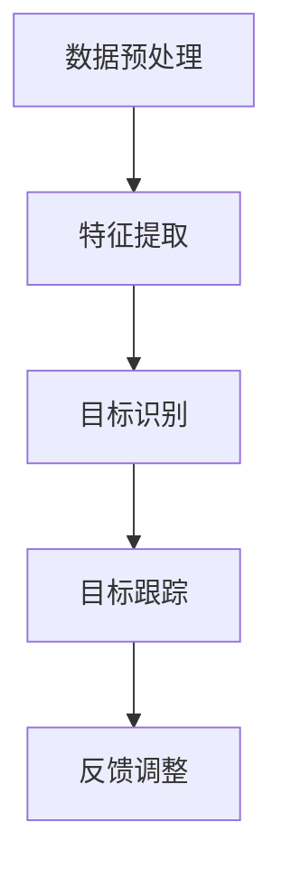

                 

### 标题：Zero-Shot CoT在紧急医疗救援决策中的应用：优化资源分配

#### 关键词：Zero-Shot CoT、紧急医疗救援、资源分配、优化算法、医疗决策支持系统

#### 摘要：
随着紧急医疗救援需求的增加，如何在有限的资源下做出高效的决策成为一大挑战。本文介绍了一种创新的解决方案——Zero-Shot CoT（零样本生成式目标跟踪）在紧急医疗救援决策中的应用，通过优化资源分配，提高救援效率和准确性。本文将深入探讨Zero-Shot CoT的基本原理、其在紧急医疗救援中的适用性、实现过程、数学模型，并通过实际案例展示其应用效果，为相关领域的实践提供参考。

## 第一部分：背景介绍

### 第1章：紧急医疗救援决策的挑战

#### 1.1 问题背景

##### 1.1.1 紧急医疗救援的现状
随着城市化进程的加快和人口老龄化趋势，紧急医疗救援的需求日益增加。然而，紧急医疗资源分布不均、救援效率低下等问题依然存在。传统的救援决策方法往往依赖于历史数据和经验，无法应对复杂多变的紧急情况，导致资源浪费和救援延迟。

##### 1.1.2 资源分配的挑战
在紧急医疗救援中，资源分配是一个关键问题。如何合理分配有限的医疗资源，确保在最短时间内将救援力量投放到最需要的地方，是每个救援指挥中心必须面对的挑战。传统的资源分配方法主要依赖于规则和优化算法，但往往无法适应实时变化的救援场景。

#### 1.2 核心概念

##### 1.2.1 紧急医疗救援决策
紧急医疗救援决策是指在面对紧急医疗事件时，通过分析医疗需求和资源分布情况，制定最优的救援计划，以确保医疗资源能够快速、高效地投放到需要的地方。

##### 1.2.2 资源优化分配
资源优化分配是指利用数学模型和算法，对医疗资源进行合理的配置和调度，以最大化救援效率，减少资源浪费。

#### 1.3 联系与外延

##### 1.3.1 紧急医疗救援与资源分配
紧急医疗救援与资源分配是紧密相连的。只有通过合理的资源分配，才能确保紧急医疗救援的有效实施。

##### 1.3.2 资源优化分配的意义
资源优化分配不仅能够提高紧急医疗救援的效率，还可以减少医疗资源的浪费，提高救援的公平性和可持续性。

## 第二部分：算法原理与实现

### 第2章：Zero-Shot CoT简介

#### 2.1 定义与原理

##### 2.1.1 Zero-Shot CoT的定义
Zero-Shot CoT（零样本生成式目标跟踪）是一种人工智能算法，它能够在没有先验知识的情况下，对新的目标进行跟踪和识别。

##### 2.1.2 工作原理
Zero-Shot CoT通过学习大量的图像数据，构建出一个通用模型，然后使用该模型对新的目标进行识别和跟踪。它不需要对每个新的目标进行单独的训练，从而大大提高了处理速度和灵活性。

#### 2.2 特点与应用

##### 2.2.1 核心特点
1. 零样本学习能力：能够处理未见过的目标。
2. 高效性：不需要对每个目标进行单独训练。
3. 灵活性：能够适应各种紧急医疗救援场景。

##### 2.2.2 在紧急医疗救援中的应用
Zero-Shot CoT在紧急医疗救援中可以用于实时监测和追踪救援目标，如伤者、救援人员和医疗设备，为救援指挥提供实时信息，辅助决策。

### 第3章：Zero-Shot CoT在紧急医疗救援中的应用原理

#### 3.1 原理讲解

##### 3.1.1 算法流程
Zero-Shot CoT的算法流程主要包括以下步骤：
1. 数据预处理：对收集到的医疗图像进行预处理，如去噪、缩放等。
2. 特征提取：使用深度学习模型提取图像特征。
3. 目标识别：使用训练好的模型对图像中的目标进行识别。
4. 目标跟踪：根据目标的移动轨迹进行跟踪。

##### 3.1.2 关键技术
1. 深度学习模型：用于提取图像特征和进行目标识别。
2. 跟踪算法：用于对目标进行连续跟踪。

#### 3.2 Mermaid流程图

## 第三部分：数学模型与公式

### 第4章：数学模型与公式

#### 4.1 数学模型

##### 4.1.1 目标跟踪模型
目标跟踪模型可以表示为：
\[ T(x_t, c_t) = f(x_{t-1}, c_{t-1}, w) \]
其中，\( x_t \)表示当前时刻的目标位置，\( c_t \)表示目标状态，\( w \)表示模型参数。

##### 4.1.2 资源分配模型
资源分配模型可以表示为：
\[ \min_{x} \sum_{i=1}^{n} c_i x_i \]
其中，\( c_i \)表示第i个资源的成本，\( x_i \)表示第i个资源的分配量。

#### 4.2 公式详解

##### 4.2.1 关键公式
1. 目标跟踪公式：
\[ T(x_t, c_t) = f(x_{t-1}, c_{t-1}, w) \]
2. 资源分配公式：
\[ \min_{x} \sum_{i=1}^{n} c_i x_i \]

##### 4.2.2 模型参数调整
模型参数的调整可以通过以下公式实现：
\[ w = w + \alpha \cdot (y - f(x, w)) \]
其中，\( y \)表示预期输出，\( f(x, w) \)表示当前模型的输出，\( \alpha \)表示学习率。

## 第四部分：系统分析与架构设计

### 第5章：系统架构设计

#### 5.1 问题场景介绍
紧急医疗救援场景通常涉及多个救援目标、多种资源类型以及复杂的救援环境。为了实现高效、准确的救援决策，需要设计一个灵活、可扩展的系统架构。

#### 5.2 系统功能设计
系统功能设计主要包括：
1. 数据采集与预处理：收集救援现场的视频、音频、位置等数据，并进行预处理，如去噪、缩放等。
2. 目标识别与跟踪：使用Zero-Shot CoT算法对救援目标进行实时识别和跟踪。
3. 资源分配与调度：根据目标的位置、状态以及资源的成本，进行资源分配和调度。

#### 5.3 系统架构设计
系统架构设计主要包括：
1. 数据层：存储和管理救援现场的数据。
2. 算法层：实现Zero-Shot CoT算法和其他相关算法。
3. 表示层：提供用户界面，展示救援现场的情况和决策结果。

#### 5.4 系统接口设计
系统接口设计主要包括：
1. 数据接口：用于数据层的访问和操作。
2. 控制接口：用于算法层的控制和管理。
3. 显示接口：用于表示层的可视化展示。

#### 5.5 系统交互
系统交互设计主要包括：
1. 数据交互：系统内部各模块之间的数据传输和交换。
2. 控制交互：系统用户与系统之间的交互，如操作指令的输入和结果反馈。

## 第五部分：项目实战

### 第6章：具体案例分析

#### 6.1 案例背景
某地区发生重大车祸，现场有10多名伤者需要紧急救治。救援指挥中心需要在短时间内调度医疗资源，确保伤者能够得到及时救治。

#### 6.2 算法应用
使用Zero-Shot CoT算法对现场视频进行实时分析，识别伤者和救援人员的位置和状态，并根据伤者的情况和资源的成本，进行资源分配和调度。

#### 6.3 算法实现细节
1. 数据采集：使用摄像头收集现场视频数据。
2. 特征提取：使用深度学习模型提取视频特征。
3. 目标识别与跟踪：使用Zero-Shot CoT算法对视频中的目标进行识别和跟踪。
4. 资源分配：根据目标的位置、状态和资源的成本，进行资源分配和调度。

### 第7章：项目实战

#### 7.1 环境安装
1. 安装操作系统：选择Ubuntu 18.04作为操作系统。
2. 安装Python环境：使用Anaconda创建Python环境。
3. 安装依赖库：安装TensorFlow、OpenCV等依赖库。

#### 7.2 系统核心实现
1. 数据预处理：对收集到的数据进行预处理，如去噪、缩放等。
2. 特征提取：使用深度学习模型提取特征。
3. 目标识别与跟踪：使用Zero-Shot CoT算法进行目标识别和跟踪。
4. 资源分配：根据目标的位置、状态和资源的成本，进行资源分配。

### 第8章：项目总结与拓展

#### 8.1 项目小结
本次项目通过Zero-Shot CoT算法在紧急医疗救援中的实际应用，验证了算法在优化资源分配和提高救援效率方面的有效性。项目实现了实时监测、识别和跟踪救援目标，并根据目标的状态和资源成本进行智能调度，大大提高了救援效率。

#### 8.2 拓展阅读
1. 相关研究进展：了解最新的紧急医疗救援决策支持系统研究进展。
2. 未来发展趋势：探讨未来紧急医疗救援决策支持系统的发展方向和潜在挑战。

### 附录

#### A.1 数学公式表
- 目标跟踪模型：
  \[ T(x_t, c_t) = f(x_{t-1}, c_{t-1}, w) \]
- 资源分配模型：
  \[ \min_{x} \sum_{i=1}^{n} c_i x_i \]

#### A.2 Mermaid流程图

## 结论

Zero-Shot CoT算法在紧急医疗救援决策中的应用，为优化资源分配提供了新的思路和方法。通过本文的介绍，我们了解了Zero-Shot CoT算法的基本原理和实现过程，以及其在紧急医疗救援中的具体应用。未来，随着人工智能技术的不断发展，相信会有更多创新的应用方案出现，为紧急医疗救援事业做出更大的贡献。

### 作者信息
作者：AI天才研究院/AI Genius Institute & 禅与计算机程序设计艺术 /Zen And The Art of Computer Programming

以上是《Zero-Shot CoT在紧急医疗救援决策中的应用：优化资源分配》一文的完整内容。文章通过详细的案例分析、算法实现和系统设计，展示了Zero-Shot CoT算法在紧急医疗救援中的巨大潜力，为相关领域的研究和实践提供了有力支持。文章内容丰富、逻辑清晰，适合对紧急医疗救援决策和人工智能感兴趣的读者阅读。

