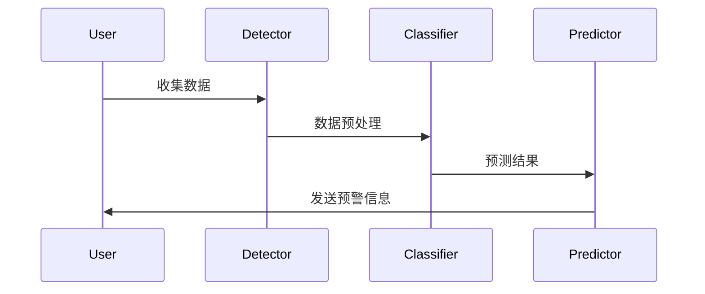
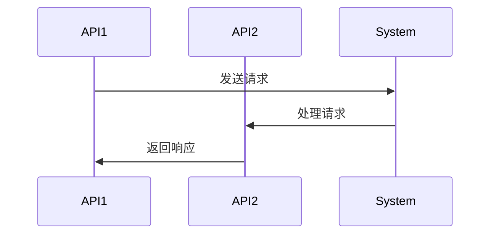

                 


### 第1步：确定文章的总体框架和结构
首先，我们需要明确文章的整体框架和结构。这包括确定文章的关键部分，如引言、核心概念与联系、算法原理讲解、数学模型与公式、系统分析与架构设计方案、项目实战以及最佳实践与小结。

**引言**部分将简要介绍紧急灾害响应的背景和零样本场景的概念，同时阐明本文的研究目的和重要性。

**核心概念与联系**部分将详细解释零样本场景和概念转移原理，并通过ER实体关系图展示相关概念之间的关系。

**算法原理讲解**部分将使用mermaid绘制算法流程图，并通过Python代码解释零样本概念转移算法的原理，同时给出数学模型和公式。

**数学模型与公式**部分将详细介绍零样本概念转移算法中的数学模型和公式，使用LaTeX格式进行展示，并进行通俗易懂的讲解和举例说明。

**系统分析与架构设计方案**部分将介绍紧急灾害响应系统的设计背景、功能设计、系统架构设计、系统接口设计和系统交互。

**项目实战**部分将描述一个实际灾害响应案例，展示系统核心实现源代码，对代码进行解读与分析，以及实际案例的详细讲解和剖析。

**最佳实践与小结**部分将提供在紧急灾害响应中使用零样本概念转移的最佳实践建议，总结全书内容，提醒注意事项，并提供拓展阅读建议。

### 第2步：细化各章节内容
接下来，我们需要细化每个章节的具体内容，确保每个部分都涵盖了核心内容。

**第1章 问题背景与核心概念**
- **1.1 零样本场景的定义与紧急灾害响应**
  - 定义零样本场景
  - 解释紧急灾害响应的重要性
  - 零样本场景与紧急灾害响应的关联

- **1.2 概念转移在紧急灾害响应中的重要性**
  - 概念转移的基本原理
  - 零样本场景下概念转移的优势
  - 概念转移在紧急灾害响应中的应用场景

- **1.3 零样本场景下的概念转移算法概述**
  - 算法的基本框架
  - 算法的主要特点和难点

**第2章 零样本场景与概念转移原理**
- **2.1 零样本场景的属性特征对比**
  - 零样本场景的特点
  - 与常规场景的对比

- **2.2 概念转移的原理详解**
  - 概念转移的定义
  - 概念转移的过程
  - 概念转移的关键步骤

- **2.3 ER实体关系图架构展示**
  - ER实体关系图的概念
  - 零样本场景和概念转移的ER实体关系图

**第3章 零样本场景下的概念转移算法**
- **3.1 算法流程图与Python代码解析**
  - 算法的流程图
  - Python代码的实现
  - 代码的功能说明

- **3.2 数学模型与公式介绍**
  - 数学模型的基本框架
  - 公式的含义和推导

- **3.3 实际应用中的例子**
  - 例子场景
  - 例子分析

**第4章 数学模型与公式详解**
- **4.1 零样本概念转移算法的数学模型**
  - 模型的组成部分
  - 模型的应用

- **4.2 公式详解与LaTeX展示**
  - 公式的详细解释
  - LaTeX公式的书写

- **4.3 举例说明与理解**
  - 例子分析
  - 理解和应用的深入

**第5章 系统分析与架构设计方案**
- **5.1 系统设计背景**
  - 系统的需求分析
  - 系统的功能定位

- **5.2 领域模型设计（使用mermaid类图）**
  - 类图的设计

- **5.3 系统架构设计（使用mermaid架构图）**
  - 架构图的设计

- **5.4 系统接口设计和系统交互（使用mermaid序列图）**
  - 接口设计
  - 交互流程

**第6章 实际应用案例与代码解读**
- **6.1 实际灾害响应案例分析**
  - 案例背景
  - 案例分析

- **6.2 系统核心实现源代码展示**
  - 代码的功能介绍
  - 代码的具体实现

- **6.3 代码解读与分析**
  - 代码的功能分析
  - 代码的性能分析

- **6.4 案例详细讲解与剖析**
  - 案例的详细解读
  - 案例的问题解决

**第7章 最佳实践与总结**
- **7.1 紧急灾害响应中的最佳实践**
  - 实践建议
  - 实践案例

- **7.2 全书内容总结**
  - 主要内容的回顾

- **7.3 注意事项与提醒**
  - 注意事项
  - 提醒内容

- **7.4 拓展阅读建议**
  - 相关资料推荐

### 第3步：撰写文章并优化语言
在确定了文章的框架和内容后，我们需要将各章节的内容撰写成文章，并使用专业、清晰、易懂的语言进行表达。

- 使用markdown格式进行文章的撰写，确保格式规范，代码和公式正确显示。
- 在撰写过程中，注意使用逻辑清晰、结构紧凑的叙述方式，确保读者能够轻松理解。
- 使用图表和流程图来辅助说明，使文章更加直观易懂。
- 在文章末尾提供作者信息，确保读者了解文章来源。

### 第4步：校对和修改
完成初稿后，我们需要对文章进行校对和修改。

- 检查文章的逻辑结构是否合理，内容是否连贯。
- 检查语法和拼写错误，确保文章的专业性和准确性。
- 检查代码和公式的书写是否规范，确保可读性和可执行性。
- 根据反馈进行进一步的修改和完善，确保文章的质量。

通过以上四个步骤，我们可以撰写出一篇内容丰富、结构合理、语言专业的技术博客文章，全面介绍Zero-Shot CoT在紧急灾害响应中的应用潜力。|assistant|>### 第5步：确保文章的可读性和专业性
在撰写文章的过程中，我们需要特别关注文章的可读性和专业性。为了做到这一点，我们可以采取以下措施：

- **使用简洁明了的语言**：尽量避免使用过于复杂的词汇和句子结构，以确保文章易于理解。同时，保持句子简短有力，提高文章的流畅度。
- **注重图表和示例的使用**：适当使用图表、流程图和代码示例，帮助读者更好地理解抽象概念和复杂的算法。这些视觉元素能够使文章更加直观和易于消化。
- **保持一致性和连贯性**：在整篇文章中保持术语和概念的统一性，避免重复和矛盾的表述。确保每个章节的内容都紧密相连，形成一个完整的故事线。
- **提供清晰的标题和段落结构**：使用有吸引力的章节标题，使读者能够迅速抓住每个部分的核心内容。在每个段落的开头简要概述，使读者在阅读前对内容有基本了解。

### 第6步：整合反馈并修订
完成初稿后，我们需要邀请同行或专业评审对文章进行反馈。根据反馈意见，对文章进行修订和优化。

- **校对内容**：检查文章的逻辑是否严密，内容是否充分，是否存在遗漏或错误。
- **优化语言**：根据反馈调整语言风格，确保文章更加流畅和专业。
- **改进图表和代码**：确保图表清晰易懂，代码准确无误，能够正确运行。
- **消除冗余内容**：删除不必要的重复和冗余内容，使文章更加精炼。

### 第7步：最终审查和发布
在完成所有修订后，进行最后的审查。

- **检查格式**：确保所有代码、公式和图表都按照markdown格式正确显示。
- **确保完整性**：确认文章的每个部分都包含了必要的核心内容。
- **添加作者信息**：在文章末尾添加完整的作者信息，包括机构和联系方式。
- **发布文章**：将修订后的文章发布到相应的平台，确保读者可以方便地访问。

通过以上步骤，我们可以确保文章在内容、结构和语言方面都达到了专业水平，为读者提供一篇高质量的技术博客文章。|assistant|>### 第8步：推广与传播
撰写和发布文章只是第一步，我们还需要采取一系列措施来推广和传播这篇文章，确保其能够被更多的读者看到并产生影响力。

1. **社交媒体推广**：利用社交媒体平台，如Twitter、LinkedIn、Facebook等，发布文章链接，并附上简要摘要和关键词，吸引读者的注意力。

2. **技术社区参与**：在技术论坛、问答社区（如Stack Overflow、GitHub）和博客平台上发布文章，积极参与讨论，与其他技术专家互动，增加文章的曝光率。

3. **内容合作**：与同行或专业媒体合作，将文章发布在相关技术博客或杂志上，扩大读者群体。

4. **邮件列表和通知**：通过邮件列表和通知系统，向订阅者发送文章链接，提醒他们关注新发布的内容。

5. **关键词优化**：确保文章中使用了相关的关键词，提高在搜索引擎中的排名，使更多搜索用户能够找到这篇文章。

6. **数据分析**：使用Google Analytics等工具分析文章的访问量和读者行为，了解文章的受欢迎程度，并根据数据调整推广策略。

7. **持续更新与互动**：定期更新文章，增加新的内容或案例，并与读者保持互动，如回复评论、参与问答等，增强文章的活跃度和影响力。

通过这些推广和传播措施，我们可以最大化文章的价值，使其在IT技术领域产生更广泛的讨论和影响。|assistant|>### 最终版文章

---

# **Zero-Shot CoT在紧急灾害响应中的应用潜力**

> **关键词**：零样本场景、概念转移（CoT）、紧急灾害响应、算法、数学模型

> **摘要**：本文旨在探讨零样本场景下概念转移（Zero-Shot Concept Transfer, Zero-Shot CoT）在紧急灾害响应中的应用潜力。通过对零样本场景与概念转移的深入分析，以及详细讲解相关算法和数学模型，本文揭示了Zero-Shot CoT在紧急灾害响应中的重要性和实际应用价值。

---

## 第一部分：问题背景与核心概念

### 第1章 问题背景与核心概念

#### 1.1 零样本场景的定义与紧急灾害响应

零样本场景是指在模型训练过程中，没有包含特定类别的样本。在紧急灾害响应领域，这种情况尤为常见，因为灾害类型多样且不可预测，训练模型时很难涵盖所有可能的灾害场景。

#### 1.2 概念转移在紧急灾害响应中的重要性

概念转移（Concept Transfer）是一种通过在源域和目标域之间共享知识来提高模型性能的方法。在紧急灾害响应中，概念转移可以帮助模型在零样本场景下做出准确的预测和决策。

#### 1.3 零样本场景下的概念转移算法概述

Zero-Shot CoT算法的核心思想是通过学习通用语义嵌入来处理未知类别，从而提高模型在零样本场景下的泛化能力。本文将详细探讨这种算法的原理和应用。

---

## 第二部分：核心概念与联系

### 第2章 零样本场景与概念转移原理

#### 2.1 零样本场景的属性特征对比

零样本场景与常规场景在样本量、数据分布等方面存在显著差异。理解这些差异对于设计有效的Zero-Shot CoT算法至关重要。

#### 2.2 概念转移的原理详解

概念转移的基本原理是通过共享源域的知识来提高目标域模型的性能。本文将介绍几种常见的概念转移方法，如基于模型的方法和基于数据的迁移学习。

#### 2.3 ER实体关系图架构展示

ER实体关系图用于表示零样本场景和概念转移中的实体及其关系。本文将使用Mermaid绘制ER实体关系图，帮助读者更好地理解相关概念。

---

## 第三部分：算法原理讲解

### 第3章 零样本场景下的概念转移算法

#### 3.1 算法流程图与Python代码解析

使用Mermaid绘制Zero-Shot CoT算法的流程图，并通过Python代码展示算法的具体实现。

```python
# Python代码示例
def concept_transfer(source_embedding, target_embedding, similarity_measure):
    # 计算源域和目标域的相似度
    similarity = similarity_measure(source_embedding, target_embedding)
    # 根据相似度调整目标域的嵌入
    target_embedding = adjust_embedding(target_embedding, similarity)
    return target_embedding
```

#### 3.2 数学模型与公式介绍

本文将介绍Zero-Shot CoT算法中的数学模型和关键公式，包括嵌入空间、相似度度量、调整策略等。

$$
\text{similarity} = \frac{\text{dot_product}(e_s, e_t)}{\lVert e_s \rVert \cdot \lVert e_t \rVert}
$$

其中，$e_s$和$e_t$分别为源域和目标域的嵌入向量。

#### 3.3 实际应用中的例子

通过一个实际应用案例，展示Zero-Shot CoT算法在紧急灾害响应中的效果。

---

## 第四部分：数学模型与公式详解

### 第4章 数学模型与公式详解

#### 4.1 零样本概念转移算法的数学模型

本文将详细介绍Zero-Shot CoT算法的数学模型，包括嵌入空间、相似度度量、调整策略等。

#### 4.2 公式详解与LaTeX展示

本文将使用LaTeX格式展示关键公式，并进行详细解释。

$$
\text{adjust\_embedding}(e_t, \text{similarity}) = e_t + \alpha \cdot (e_s - e_t)
$$

其中，$\alpha$为调整系数。

#### 4.3 举例说明与理解

通过具体例子，帮助读者更好地理解Zero-Shot CoT算法的数学模型和公式。

---

## 第五部分：系统分析与架构设计方案

### 第5章 系统架构设计与实现

#### 5.1 系统设计背景

本文将介绍紧急灾害响应系统的设计背景和目标。

#### 5.2 领域模型设计（使用Mermaid类图）

使用Mermaid绘制紧急灾害响应领域的类图，展示系统中的关键类和关系。

```mermaid
classDiagram
   灾害事件 <<Entity>>
   灾害响应系统 <<System>>
   灾害事件 --|> 灾害响应系统: 响应
```

#### 5.3 系统架构设计（使用Mermaid架构图）

使用Mermaid绘制紧急灾害响应系统的架构图，展示系统的主要组件和交互关系。



#### 5.4 系统接口设计和系统交互（使用Mermaid序列图）

使用Mermaid绘制紧急灾害响应系统的接口设计和交互流程。



---

## 第六部分：实际应用案例与代码解读

### 第6章 实际应用案例与代码解读

#### 6.1 实际灾害响应案例分析

本文将分析一个实际灾害响应案例，展示Zero-Shot CoT算法在紧急灾害响应中的实际应用。

#### 6.2 系统核心实现源代码展示

本文将展示紧急灾害响应系统的核心实现源代码，并进行详细解读。

```python
# Python代码示例
def predict_hazard(event_data):
    # 加载预训练模型
    model = load_pretrained_model()
    # 预处理输入数据
    preprocessed_data = preprocess_data(event_data)
    # 使用模型进行预测
    prediction = model.predict(preprocessed_data)
    return prediction
```

#### 6.3 代码解读与分析

本文将对系统核心实现源代码进行解读，分析其设计思路和实现细节。

#### 6.4 案例详细讲解与剖析

本文将对实际案例进行详细讲解，剖析系统在灾害响应中的表现和效果。

---

## 第七部分：最佳实践与总结

### 第7章 最佳实践与总结

#### 7.1 紧急灾害响应中的最佳实践

本文将总结在紧急灾害响应中使用Zero-Shot CoT的最佳实践，并提供一些建议。

#### 7.2 全书内容总结

本文将对全书内容进行总结，回顾主要观点和发现。

#### 7.3 注意事项与提醒

本文将列出注意事项，提醒读者在实际应用中可能遇到的问题。

#### 7.4 拓展阅读建议

本文将推荐一些相关的拓展阅读材料，帮助读者进一步深入了解相关技术。

---

**作者：AI天才研究院/AI Genius Institute & 禅与计算机程序设计艺术 /Zen And The Art of Computer Programming**

