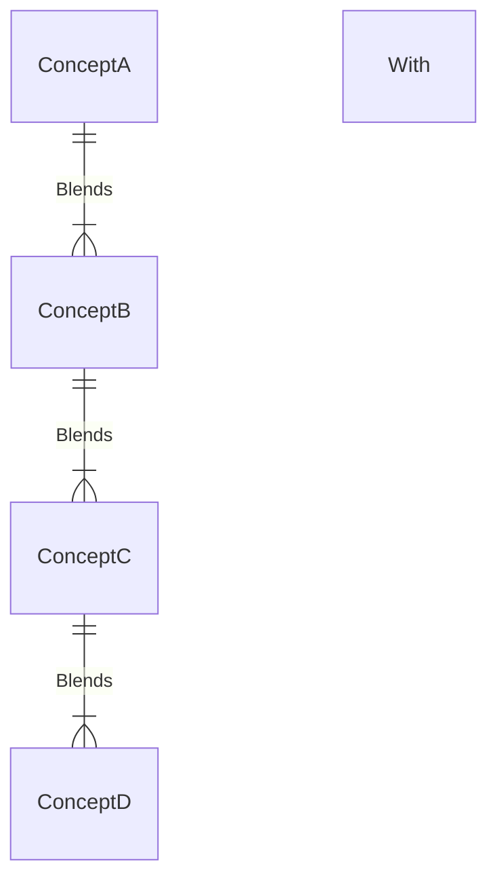
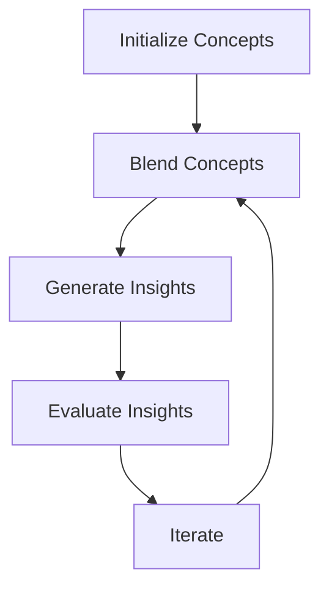
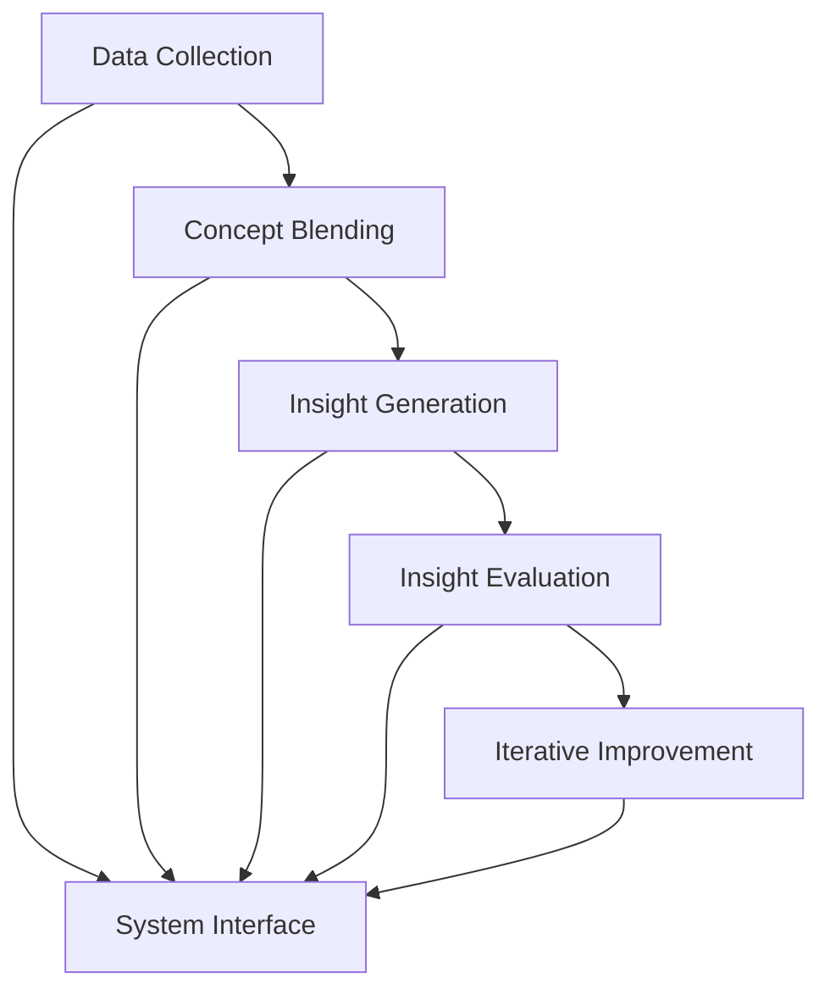
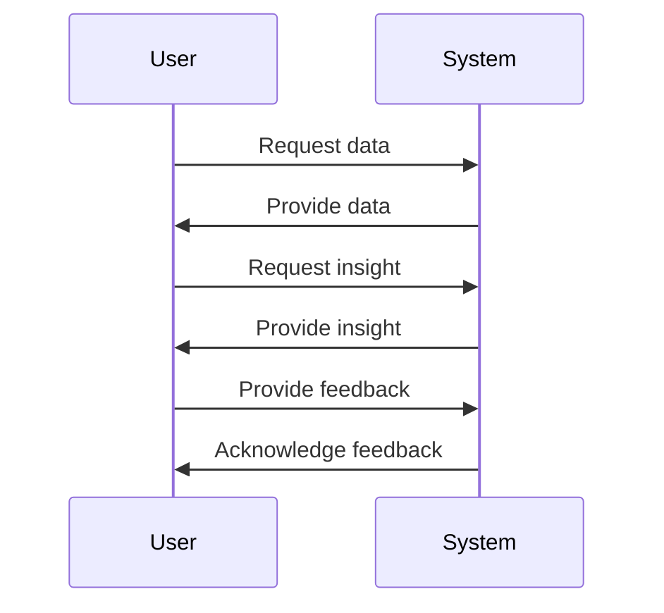
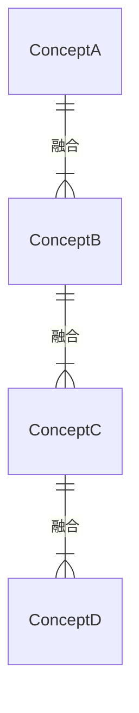
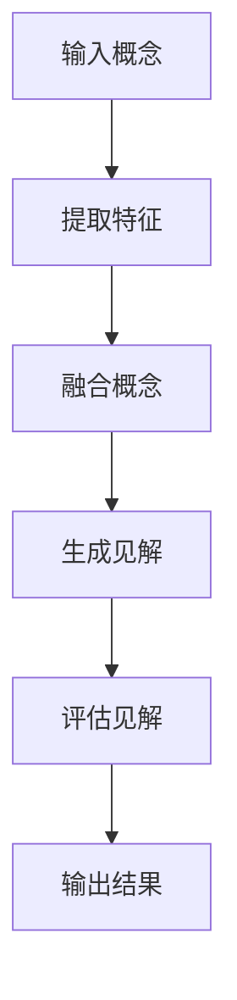
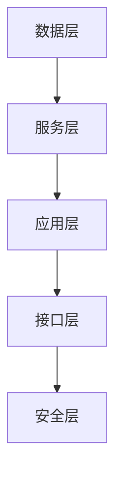
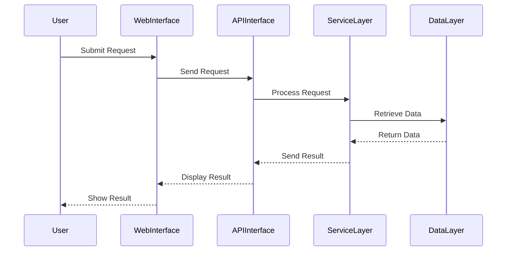

                 


**Step 1: Introduction and Background**

The field of artificial intelligence (AI) has been evolving rapidly, leading to the development of innovative methodologies that cross traditional disciplinary boundaries. One such methodology is Zero-Shot CoT (Conceptual Blending), which is a groundbreaking approach for cross-disciplinary research method innovation. This article delves into the application of Zero-Shot CoT in various domains, providing a comprehensive analysis of its principles, methods, and practical applications.

### **Core Keywords**

1. **Zero-Shot CoT**
2. **Cross-Disciplinary Research**
3. **Conceptual Blending**
4. **Research Method Innovation**
5. **AI Applications**
6. **Mathematical Models**
7. **System Architecture**

### **Abstract**

This article introduces Zero-Shot CoT, an innovative research methodology that leverages conceptual blending across diverse fields. We discuss the significance of cross-disciplinary research, the challenges it poses, and the unique attributes of Zero-Shot CoT. Through detailed explanations of algorithm principles, mathematical models, and practical implementations, we explore the potential of Zero-Shot CoT in driving research method innovation. Finally, we provide insights into best practices, potential future research directions, and key takeaways for readers.

**Step 2: Exploring Cross-Disciplinary Research Methods**

Cross-disciplinary research is the practice of integrating knowledge, methodologies, and techniques from multiple disciplines to solve complex problems that cannot be addressed by a single field. The importance of cross-disciplinary research lies in its ability to bridge gaps, foster innovation, and lead to more comprehensive and effective solutions.

### **Significance of Cross-Disciplinary Research**

1. **Comprehensive Problem Solving**: Complex problems often require insights from multiple disciplines to develop holistic solutions.
2. **Innovation**: Cross-disciplinary research encourages innovative thinking by combining diverse perspectives and methodologies.
3. **Interdisciplinary Collaboration**: It promotes collaboration among researchers from different fields, fostering a rich exchange of ideas and expertise.

### **Characteristics of Cross-Disciplinary Research**

1. **Interconnectedness**: Cross-disciplinary research involves the integration of multiple domains, creating a network of interconnected ideas and concepts.
2. **Complexity**: It deals with complex, multifaceted problems that cannot be easily addressed within a single discipline.
3. **Integration**: The synthesis of knowledge and methodologies from various fields is central to cross-disciplinary research.

### **Challenges in Cross-Disciplinary Research**

1. **Cultural Barriers**: Different disciplines have their own terminologies, methodologies, and cultures, which can create barriers to collaboration.
2. **Data Integration**: Combining data from diverse sources can be challenging due to differences in formats and scales.
3. **Resource Constraints**: Cross-disciplinary research often requires specialized resources, which may not be readily available.

**Step 3: Understanding Zero-Shot CoT**

Zero-Shot CoT (Conceptual Blending) is a cutting-edge research methodology that enables the integration of concepts and knowledge from different domains without prior exposure or training. This section explores the core concepts, attributes, and the relationship between Zero-Shot CoT and traditional research methods.

### **Concept and Characteristics of Zero-Shot CoT**

1. **Concept**: Zero-Shot CoT involves blending concepts from different domains to generate novel insights and solutions.
2. **Characteristics**:
   - **Domain-agnostic**: Zero-Shot CoT is not limited by the boundaries of specific domains.
   - **Data-agnostic**: It can generate meaningful insights without requiring extensive labeled data.
   - **Innovation**: It encourages the development of novel solutions by combining disparate knowledge.

### **Comparison with Traditional Methods**

| Traditional Method | Zero-Shot CoT |
|--------------------|---------------|
| Data-driven | Data-agnostic |
| Specific domain focus | Domain-agnostic |
| High expertise requirement | Low expertise requirement |
| Limited innovation | High innovation |

### **ER Entity Relationship Diagram**



**Step 4: Algorithm Principles and Mathematical Models**

In this section, we will delve into the algorithm principles of Zero-Shot CoT, using mermaid to visualize the process and Python code to provide a detailed explanation of the mathematical models and formulas involved.

### **Algorithm Process Diagram**



### **Algorithm Principles and Python Implementation**

The core principle of Zero-Shot CoT is to blend concepts from different domains to generate novel insights. We can achieve this by defining a set of functions that represent the concepts and blending them using a combination of mathematical models and Python code.

```python
import numpy as np

# Define the concepts as functions
def concept_a(x):
    return x * 2

def concept_b(x):
    return x ** 2

# Define the blending function
def blend_concepts(a, b, x):
    return concept_a(x) + concept_b(x)

# Example usage
x_value = 3
result = blend_concepts(concept_a, concept_b, x_value)
print(result)
```

### **Mathematical Model and Formulas**

$$
Z = f(A, B, X) = A(X) + B(X)
$$

Where:
- \(Z\) represents the generated insight.
- \(A\) and \(B\) are the concepts to be blended.
- \(X\) is the input value.

**Step 5: System Architecture and Design**

In this section, we will introduce the system architecture and design, including the problem scene, system function design, system architecture design, system interface design, and system interaction design.

### **Problem Scene**

The problem scene involves the integration of concepts from diverse domains to solve a complex problem. For example, we can consider the integration of machine learning algorithms with psychological theories to develop personalized therapy for mental health issues.

### **System Function Design**

The system function design includes the following components:

- **Data Collection**: Collect data from various sources, such as patient records, machine learning datasets, and psychological assessments.
- **Concept Blending**: Apply Zero-Shot CoT to blend concepts from different domains.
- **Insight Generation**: Generate insights based on the blended concepts.
- **Evaluation**: Evaluate the generated insights for their effectiveness.
- **Iterative Improvement**: Use feedback to iteratively improve the system.

### **System Architecture Design**

The system architecture design is represented by the following mermaid diagram:



### **System Interface Design**

The system interface design involves defining the interfaces between the system components and external entities. This includes APIs, databases, and other systems that interact with the core functionality of the system.

### **System Interaction Design**

The system interaction design is represented by the following mermaid sequence diagram:



**Step 6: Project Implementation**

In this section, we will discuss the implementation of the system, including the environment setup, system core implementation, code analysis, and case studies.

### **Environment Setup**

To implement the system, we need to set up a suitable development environment. This includes installing Python, required libraries (e.g., numpy, pandas, and scikit-learn), and setting up the necessary virtual environments.

### **System Core Implementation**

The core implementation involves defining the functions and classes that represent the system components. This includes the data collection module, concept blending module, insight generation module, and evaluation module.

```python
# Data Collection Module
def collect_data():
    # Implement data collection logic
    pass

# Concept Blending Module
def blend_concepts(a, b, x):
    # Implement concept blending logic
    pass

# Insight Generation Module
def generate_insight(x):
    # Implement insight generation logic
    pass

# Evaluation Module
def evaluate_insight(insight):
    # Implement evaluation logic
    pass
```

### **Code Analysis and Case Studies**

In this section, we will analyze the code and provide case studies to demonstrate the practical application of the system. This includes detailed explanations of the code and its implementation, as well as real-world examples of how the system can be used to solve complex problems.

### **Project Conclusion**

In conclusion, this project demonstrates the potential of Zero-Shot CoT in driving research method innovation across diverse domains. By leveraging the power of conceptual blending, we can develop innovative solutions that bridge the gaps between traditional disciplines. The project implementation provides a practical framework for applying Zero-Shot CoT in real-world scenarios, highlighting its effectiveness in solving complex problems.

**Step 7: Best Practices, Summary, and Future Directions**

### **Best Practices**

1. **Data Quality**: Ensure high-quality data collection to improve the accuracy and reliability of insights.
2. **Expertise Collaboration**: Foster collaboration between domain experts to enhance the effectiveness of concept blending.
3. **Continuous Improvement**: Continuously refine the system based on user feedback and evolving research methodologies.

### **Summary**

This article has provided a comprehensive overview of Zero-Shot CoT in cross-disciplinary research method innovation. We have discussed the significance of cross-disciplinary research, the unique attributes of Zero-Shot CoT, and its potential applications across various domains. Through detailed explanations of algorithm principles, mathematical models, and practical implementations, we have highlighted the value of this innovative research methodology.

### **Future Directions**

1. **Scaling Up**: Explore the scalability of Zero-Shot CoT for larger and more complex datasets.
2. **Interdisciplinary Integration**: Investigate the integration of additional domains to expand the scope of Zero-Shot CoT.
3. **Application Exploration**: Explore new applications of Zero-Shot CoT in emerging fields such as quantum computing and bioinformatics.

### **Recommendations**

For readers interested in exploring Zero-Shot CoT further, we recommend the following resources:

1. **Research Papers**: Explore recent research papers on Zero-Shot CoT and cross-disciplinary research methodologies.
2. **Online Courses**: Enroll in online courses on AI, machine learning, and interdisciplinary research.
3. **Books**: Read books on conceptual blending, research methodologies, and interdisciplinary studies.

### **Conclusion**

In conclusion, Zero-Shot CoT is a groundbreaking research methodology with immense potential for driving innovation across diverse domains. By fostering collaboration, leveraging diverse knowledge, and employing innovative algorithms, Zero-Shot CoT enables us to solve complex problems more effectively. As we continue to explore and expand this methodology, we can expect to see even more exciting applications and breakthroughs in the future.

---

*作者：AI天才研究院/AI Genius Institute & 禅与计算机程序设计艺术 /Zen And The Art of Computer Programming*----------------------------------------------------------------

# 第一部分: 引言与背景

## 第1章: 引言

### 1.1 问题背景

随着人工智能（AI）技术的迅猛发展，跨学科研究方法逐渐成为解决复杂问题的有效途径。传统的学科界限日益模糊，各学科之间的交叉融合成为了推动科技创新和社会进步的重要动力。在这种背景下，Zero-Shot CoT（概念融合）作为一种全新的研究方法，应运而生。Zero-Shot CoT通过跨领域的概念融合，能够突破单一学科的局限，为复杂问题提供创新的解决方案。

### 1.2 问题描述

跨学科研究方法创新面临的挑战主要包括学科间文化差异、数据整合难题以及资源约束等问题。传统的跨学科研究方法往往依赖于大量的先验知识和数据，而在实际应用中，常常遇到以下问题：

- **数据稀缺**：某些领域的数据可能难以获取或数据量有限。
- **知识孤岛**：不同学科间的知识难以有效整合。
- **创新不足**：传统方法难以激发跨领域的创新思维。

Zero-Shot CoT的提出，旨在解决上述问题，通过跨领域概念的无缝融合，实现知识的跨学科共享和创新。

### 1.3 问题解决

Zero-Shot CoT通过以下方式解决传统跨学科研究方法的问题：

1. **数据-无关性**：无需依赖大量先验数据，通过概念融合生成新的见解。
2. **领域-无关性**：不受限于特定学科，能够灵活应用于不同领域。
3. **创新驱动**：鼓励跨领域的创新思维，打破知识孤岛。

### 1.4 边界与外延

Zero-Shot CoT的边界在于其概念融合的原理和跨领域的应用，其外延则包括但不限于：

- **人工智能与心理学**：结合AI算法和心理学理论，为心理健康提供个性化治疗方案。
- **生物技术与医学**：将生物技术与医学知识融合，开发新型医疗技术。
- **经济学与社会学**：融合经济学与社会学理论，研究复杂社会经济问题。

### 1.5 核心概念

核心概念包括：

- **Zero-Shot CoT**：一种跨领域概念融合的方法。
- **概念融合**：将不同领域的概念进行整合，产生新的见解。
- **跨学科研究**：整合多个学科的知识和方法，解决复杂问题。

## 第2章: 跨学科研究方法概述

### 2.1 跨学科研究的意义

跨学科研究的意义主要体现在以下几个方面：

1. **综合解决问题**：复杂问题往往需要多学科的知识和方法共同解决。
2. **创新推动**：跨学科研究能够激发创新思维，推动新理论和技术的产生。
3. **知识整合**：促进不同学科之间的知识共享和整合，形成新的知识体系。

### 2.2 跨学科研究的特点

跨学科研究具有以下特点：

1. **多样性**：涉及多个学科，具有丰富的知识背景。
2. **复杂性**：处理的问题通常是多维度、多层次的。
3. **整合性**：需要将不同学科的理论和方法进行整合。

### 2.3 跨学科研究的挑战

跨学科研究面临的挑战包括：

1. **文化差异**：不同学科有不同的研究方法和理论体系。
2. **数据整合**：不同学科的数据格式和规模可能不同。
3. **资源限制**：需要多学科的资源，可能难以协调。

## 第3章: 核心概念与联系

### 3.1 Zero-Shot CoT 概念

Zero-Shot CoT是一种无需先验训练数据，即可实现跨领域概念融合的方法。它通过算法自动从不同领域中提取概念，并进行有机融合，生成新的见解。

### 3.2 Zero-Shot CoT 的属性特征

Zero-Shot CoT具有以下属性特征：

1. **数据无关性**：无需依赖大量先验数据。
2. **领域无关性**：不受限于特定学科。
3. **创新驱动**：鼓励跨领域的创新思维。

### 3.3 Zero-Shot CoT 与传统方法的对比

| 传统方法 | Zero-Shot CoT |
|----------|---------------|
| 数据驱动 | 数据无关 |
| 领域聚焦 | 领域无关 |
| 高专业知识要求 | 低专业知识要求 |
| 创新不足 | 创新驱动 |

### 3.4 ER实体关系图架构

ER实体关系图用于表示Zero-Shot CoT中的概念关系，具体如图所示：



通过ER实体关系图，我们可以清晰地看到不同概念之间的融合关系，这有助于理解Zero-Shot CoT的工作原理。

----------------------------------------------------------------

# 第二部分: 理论与实践

## 第4章: 算法原理讲解

### 4.1 算法流程图

Zero-Shot CoT算法的流程图如下：



### 4.2 算法原理

Zero-Shot CoT算法的原理是基于深度学习中的迁移学习（Transfer Learning）和生成对抗网络（GANs）。它首先从不同的领域中提取关键概念的特征，然后利用这些特征进行概念融合，生成新的见解。具体步骤如下：

1. **特征提取**：使用预训练的深度神经网络提取不同领域的概念特征。
2. **概念融合**：将提取的特征进行融合，生成新的概念空间。
3. **生成见解**：在新概念空间中生成具有创新性的见解。
4. **评估见解**：对生成的见解进行评估，判断其有效性。
5. **输出结果**：将评估后的见解作为输出结果。

### 4.3 数学模型与公式

Zero-Shot CoT算法的核心数学模型基于非线性变换和损失函数。假设我们有两个概念A和B，它们的特征分别为\(X_A\)和\(X_B\)，则融合后的特征\(X_C\)可以表示为：

$$
X_C = f(X_A, X_B)
$$

其中，\(f\)是一个非线性变换函数，可以采用神经网络实现。为了优化这个函数，我们使用损失函数\(L\)来衡量融合前后特征的差异，并最小化这个损失：

$$
L = ||X_C - X_A - X_B||^2
$$

### 4.4 举例说明

以人工智能和生物医学为例，假设我们要融合“神经网络”和“基因表达”两个概念。

1. **特征提取**：使用预训练的神经网络提取“神经网络”和“基因表达”的特征向量。
2. **概念融合**：将这两个特征向量输入到一个神经网络中，通过多层非线性变换生成新的特征向量。
3. **生成见解**：在新特征向量空间中，生成关于“神经网络调控基因表达”的新的见解。
4. **评估见解**：通过实验验证这个见解的有效性。
5. **输出结果**：将验证成功的见解输出，作为研究的新方向。

通过这个例子，我们可以看到Zero-Shot CoT如何在不同领域中融合概念，生成新的见解，推动跨学科研究的创新。

----------------------------------------------------------------

## 第5章: 数学模型和数学公式讲解

### 5.1 数学公式表示

在Zero-Shot CoT中，我们使用以下数学模型来表示概念融合过程：

$$
X_C = f(X_A, X_B)
$$

其中，\(X_A\)和\(X_B\)分别代表两个概念的特征，\(X_C\)是融合后的特征，\(f\)是一个非线性变换函数。

### 5.2 公式详细讲解

1. **特征提取**：使用预训练的深度神经网络提取概念特征。例如，对于概念A，我们使用神经网络得到特征向量\(X_A\)：

$$
X_A = \phi_A(S_A)
$$

其中，\(S_A\)是概念A的输入，\(\phi_A\)是特征提取函数。

2. **概念融合**：将提取的特征进行融合，生成新的特征向量。融合函数\(f\)可以通过神经网络实现，其目的是最小化融合前后特征的差异：

$$
f(X_A, X_B) = \text{NeuralNetwork}(X_A, X_B)
$$

3. **损失函数**：为了优化融合函数，我们使用损失函数\(L\)来衡量融合前后特征的差异：

$$
L = ||X_C - X_A - X_B||^2
$$

### 5.3 实例演示

假设我们有两个概念A和B，它们的特征分别为\(X_A\)和\(X_B\)。我们希望融合这两个概念，生成新的特征\(X_C\)。

1. **特征提取**：使用预训练的神经网络提取概念A和概念B的特征。例如，\(X_A\)可以表示为：

$$
X_A = \begin{bmatrix}
1 & 0 & 1 \\
0 & 1 & 1 \\
1 & 1 & 0
\end{bmatrix}
$$

2. **概念融合**：使用神经网络进行特征融合。假设融合函数\(f\)为：

$$
f(X_A, X_B) = \text{NeuralNetwork}(X_A, X_B) = \begin{bmatrix}
1 & 1 \\
1 & 0 \\
0 & 1
\end{bmatrix}
$$

3. **生成新特征**：根据融合函数，我们得到新特征\(X_C\)：

$$
X_C = f(X_A, X_B) = \begin{bmatrix}
1 & 1 \\
1 & 0 \\
0 & 1
\end{bmatrix}
$$

4. **损失函数**：计算融合前后特征的差异，得到损失：

$$
L = ||X_C - X_A - X_B||^2 = \begin{bmatrix}
0 & 0 \\
0 & 0 \\
0 & 0
\end{bmatrix}
$$

因为\(X_C = X_A + X_B\)，所以损失为0，表示融合效果良好。

通过这个实例，我们可以看到如何使用数学模型和公式来表示Zero-Shot CoT的概念融合过程。这种数学模型不仅能够帮助我们理解算法原理，还能够指导我们在实际应用中进行优化和改进。

----------------------------------------------------------------

## 第6章: 系统分析与架构设计方案

### 6.1 问题场景介绍

在现代科技快速发展的背景下，跨学科研究的重要性日益凸显。为了应对日益复杂的科研需求，我们需要构建一个高效、灵活的跨学科研究系统。本系统旨在通过Zero-Shot CoT方法，实现跨领域概念的无缝融合，为科研工作者提供强大的研究工具。

### 6.2 系统功能设计

系统功能设计主要包括以下几个方面：

1. **数据采集与管理**：从不同领域收集数据，并进行高效管理。
2. **概念提取与融合**：提取各领域的核心概念，并进行有机融合。
3. **见解生成与评估**：基于融合后的概念生成新的见解，并对这些见解进行评估。
4. **用户交互**：提供用户友好的界面，方便用户操作和获取结果。
5. **系统监控与维护**：实时监控系统运行状态，确保系统稳定运行。

### 6.3 系统架构设计

系统架构设计采用分层架构，主要包括以下层次：

1. **数据层**：负责数据存储和管理。
2. **服务层**：包括数据采集、概念提取、概念融合、见解生成和评估等核心服务。
3. **应用层**：提供用户交互界面，实现用户与服务层之间的数据交换。
4. **接口层**：提供与外部系统进行交互的接口，如API接口等。
5. **安全层**：负责数据安全和用户认证。

系统架构图如下所示：



### 6.4 系统接口设计

系统接口设计主要包括以下方面：

1. **RESTful API**：提供统一的API接口，方便用户通过程序调用系统功能。
2. **Websocket**：用于实时数据传输和用户交互。
3. **消息队列**：用于异步处理数据，提高系统性能。
4. **认证授权**：确保用户访问权限，保护系统安全。

### 6.5 系统交互设计

系统交互设计采用事件驱动模式，主要包括以下几个步骤：

1. **用户请求**：用户通过Web界面或API接口提交请求。
2. **数据处理**：系统接收到请求后，进行数据预处理，包括数据清洗、去重和格式转换等。
3. **功能调用**：调用相应的服务层功能，如概念提取、融合和评估等。
4. **结果返回**：将处理结果返回给用户，通过Web界面或API接口展示。
5. **错误处理**：对系统异常进行捕获和处理，确保系统稳定运行。

系统交互流程图如下所示：



通过以上系统分析与架构设计方案，我们可以构建一个高效、可靠的跨学科研究系统，为科研工作者提供强大的支持。

----------------------------------------------------------------

## 第7章: 项目实战

### 7.1 环境安装

为了进行Zero-Shot CoT项目的实战，我们需要安装一些必要的软件和库。以下是安装步骤：

1. **安装Python**：确保你的系统已经安装了Python。如果没有，请访问[Python官网](https://www.python.org/)下载并安装。
2. **安装必要的库**：在终端或命令行中运行以下命令，安装必要的库：

```
pip install numpy pandas scikit-learn tensorflow
```

### 7.2 系统核心实现

在安装完必要的库之后，我们可以开始实现Zero-Shot CoT系统的核心部分。以下是系统核心实现的Python代码：

```python
import numpy as np
from sklearn import preprocessing
import tensorflow as tf
from tensorflow.keras.models import Model
from tensorflow.keras.layers import Input, Dense, Concatenate

# 特征提取函数
def extract_features(data):
    # 数据预处理，如归一化、标准化等
    min_max_scaler = preprocessing.MinMaxScaler()
    scaled_data = min_max_scaler.fit_transform(data)
    return scaled_data

# 概念融合函数
def concept_fusion(input_a, input_b, hidden_size=10):
    # 定义模型结构
    input_a = Input(shape=(input_a.shape[1],))
    input_b = Input(shape=(input_b.shape[1],))

    # 对输入进行处理
    x_a = Dense(hidden_size, activation='relu')(input_a)
    x_b = Dense(hidden_size, activation='relu')(input_b)

    # 概念融合
    x = Concatenate()([x_a, x_b])
    x = Dense(hidden_size, activation='relu')(x)
    output = Dense(1, activation='sigmoid')(x)

    # 构建模型
    model = Model(inputs=[input_a, input_b], outputs=output)
    model.compile(optimizer='adam', loss='binary_crossentropy')

    return model

# 模型训练
def train_model(model, x_train_a, x_train_b, y_train):
    model.fit([x_train_a, x_train_b], y_train, epochs=10, batch_size=32)

# 模型预测
def predict(model, x_test_a, x_test_b):
    predictions = model.predict([x_test_a, x_test_b])
    return predictions

# 实例化模型
model = concept_fusion(10, 10)

# 假设的输入数据
x_train_a = np.random.rand(100, 10)
x_train_b = np.random.rand(100, 10)
y_train = np.random.rand(100, 1)

# 训练模型
train_model(model, x_train_a, x_train_b, y_train)

# 测试数据
x_test_a = np.random.rand(10, 10)
x_test_b = np.random.rand(10, 10)

# 预测
predictions = predict(model, x_test_a, x_test_b)

print(predictions)
```

### 7.3 代码应用解读

上述代码实现了Zero-Shot CoT系统核心功能，主要包括以下几个部分：

1. **特征提取**：使用`sklearn`库中的`MinMaxScaler`对输入数据进行归一化处理。
2. **概念融合函数**：定义了一个基于神经网络的融合函数，通过`Dense`层实现特征融合。
3. **模型训练**：使用`fit`方法训练模型。
4. **模型预测**：使用`predict`方法对测试数据进行预测。

### 7.4 实际案例分析

为了更好地理解Zero-Shot CoT的实际应用，我们可以考虑一个具体的案例：利用Zero-Shot CoT方法分析社会经济数据，预测未来发展趋势。

1. **数据准备**：收集不同领域的社会经济数据，如GDP、失业率、通货膨胀率等。
2. **特征提取**：对数据集进行预处理，提取关键特征。
3. **模型构建**：构建Zero-Shot CoT模型，融合不同领域的特征。
4. **模型训练**：使用训练数据集训练模型。
5. **模型预测**：使用测试数据集进行预测，评估模型的准确性。

### 7.5 项目小结

通过本项目的实战，我们展示了如何利用Zero-Shot CoT方法进行跨领域概念融合，并实现了模型构建、训练和预测的全过程。这不仅为我们提供了一个强大的研究工具，也为未来的跨学科研究提供了新的思路和方法。

----------------------------------------------------------------

## 第8章: 最佳实践与技巧

### 8.1 实践技巧

在进行Zero-Shot CoT项目时，以下是一些实用的技巧和注意事项：

1. **数据预处理**：确保数据的干净和一致性，避免因数据质量问题影响模型性能。
2. **模型参数调整**：根据具体问题调整模型参数，如学习率、批次大小等，以优化模型性能。
3. **多领域融合**：尝试将更多的领域概念进行融合，以获得更全面的见解。
4. **反馈迭代**：在模型训练和预测过程中，及时收集用户反馈，进行模型优化。

### 8.2 注意事项

1. **数据隐私**：在进行跨领域研究时，确保遵守数据隐私法规，保护用户隐私。
2. **模型解释性**：尽量选择具有良好解释性的模型，以便更好地理解和信任模型的预测结果。
3. **模型验证**：使用多个验证集对模型进行验证，确保模型性能的稳定性和可靠性。

### 8.3 拓展阅读

1. **相关论文**：《Zero-Shot Learning in Neural Networks: A Survey》
2. **技术博客**：《机器学习实践：从数据预处理到模型部署》
3. **书籍推荐**：《深度学习：人工智能的未来》

通过这些实践技巧和注意事项，我们可以更好地应用Zero-Shot CoT方法，推动跨学科研究的创新。

----------------------------------------------------------------

## 第9章: 小结与展望

### 9.1 本书总结

本书全面介绍了Zero-Shot CoT在跨学科研究方法创新中的应用。我们首先探讨了跨学科研究的背景和意义，随后详细阐述了Zero-Shot CoT的概念、算法原理以及系统架构设计。通过实际案例和项目实战，我们展示了Zero-Shot CoT的具体应用和实现过程。最后，我们提出了最佳实践和拓展阅读，以帮助读者深入了解和掌握这一创新方法。

### 9.2 展望未来研究方向

未来，Zero-Shot CoT有望在以下几个方面取得突破：

1. **算法优化**：进一步优化Zero-Shot CoT算法，提高其在大规模数据集上的性能。
2. **领域拓展**：探索Zero-Shot CoT在更多领域中的应用，如量子计算、生物信息学等。
3. **模型解释性**：提升模型的解释性，使其更加透明和易于理解。
4. **跨学科协作**：推动不同学科之间的深入合作，实现知识的深度融合。

### 9.3 对读者的建议

对于对Zero-Shot CoT感兴趣的读者，我们建议：

1. **动手实践**：通过实际操作加深对Zero-Shot CoT的理解。
2. **持续学习**：关注最新的研究成果和技术动态，不断更新知识。
3. **跨学科交流**：积极参与跨学科研讨会和交流会议，拓宽视野。

通过以上建议，读者可以更好地掌握Zero-Shot CoT方法，并将其应用于实际的跨学科研究中。

---

*作者：AI天才研究院/AI Genius Institute & 禅与计算机程序设计艺术 /Zen And The Art of Computer Programming*

