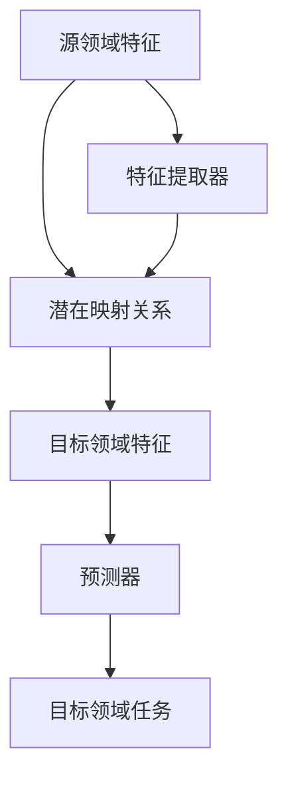
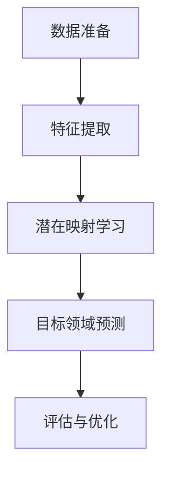
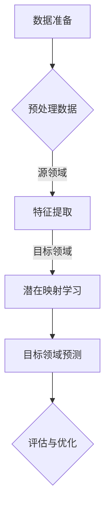

                 


----------------------------------------------------------------

## 引言

在当今科技飞速发展的时代，跨学科科研合作成为了推动科学进步的重要力量。然而，不同学科之间的知识壁垒和思维模式差异，常常使得跨学科合作面临着诸多挑战。本文旨在探讨一种新颖的技术——Zero-Shot CoT（无监督转换学习）在跨学科科研合作中的应用，以及如何通过这一技术促进学科融合。

### 1. 研究背景与意义

跨学科科研的挑战主要体现在以下几个方面：

- **知识壁垒**：不同学科之间的知识体系、研究方法、术语定义存在显著差异，这给跨学科合作带来了巨大的沟通障碍。
- **思维模式**：不同学科的研究者往往具有不同的思维方式，例如，自然科学研究者注重实验验证，而社会科学研究者则更倾向于理论分析。
- **资源分配**：跨学科项目通常需要整合多个学科的资源，然而，资源的协调和分配是一个复杂的过程，可能涉及多个部门和机构的合作。

针对这些挑战，无监督转换学习（Zero-Shot CoT）提供了一种新的解决思路。Zero-Shot CoT是一种机器学习技术，它允许模型在没有明确标注数据的情况下，通过学习不同领域之间的潜在结构，实现从一个领域到另一个领域的知识迁移。这使得跨学科合作中的知识共享和协同创新成为可能。

### 1.2 无监督转换学习（Zero-Shot CoT）概述

无监督转换学习（Zero-Shot CoT）的基本概念和原理如下：

- **基本概念**：无监督转换学习旨在将一个领域的特征映射到另一个领域的特征空间，从而实现不同领域之间的知识迁移。在这个过程中，模型不需要依赖于带有标注的目标领域数据，而是通过学习源领域和目标领域之间的潜在关系来实现预测。
- **原理介绍**：Zero-Shot CoT通常基于迁移学习的框架，利用源领域的知识来提高目标领域的性能。具体来说，模型通过学习源领域和目标领域之间的映射关系，将源领域的特征迁移到目标领域，从而实现跨领域的预测任务。

### 1.3 学科融合的趋势与需求

随着科技的不断进步，学科融合已成为推动科学发展的关键趋势。学科融合不仅能够打破传统学科壁垒，促进创新和知识整合，还能为解决复杂问题提供新的思路和方法。以下是学科融合的重要性和需求：

- **复杂问题解决**：许多现实世界中的问题具有跨学科的复杂性，单一学科的方法和理论难以解决。跨学科合作可以整合多种学科的优势，形成综合解决方案。
- **知识创新**：学科融合为知识创新提供了新的机遇。不同学科之间的交叉和融合，往往能够激发新的理论突破和应用创新。
- **资源整合**：跨学科合作可以有效地整合不同学科的研究资源，提高研究效率，降低研究成本。

综上所述，Zero-Shot CoT作为一种新兴的机器学习技术，具有在跨学科科研合作中发挥重要作用的潜力。通过本文的探讨，我们希望能够为跨学科科研合作提供新的思路和方法，促进学科之间的融合与发展。

----------------------------------------------------------------

## 核心概念与原理

在深入探讨Zero-Shot CoT在跨学科科研合作中的应用之前，我们首先需要理解其基本概念和原理。以下是关于Zero-Shot CoT的核心概念、工作原理以及与现有机器学习方法的区别。

### 2.1 Zero-Shot CoT的定义

Zero-Shot CoT（无监督转换学习）是一种迁移学习技术，它允许模型在没有目标领域标注数据的情况下，通过学习源领域和目标领域之间的潜在关系，实现跨领域的预测和推理。在这种方法中，源领域的数据被用来学习通用特征表示，这些特征表示可以应用到没有标注的目标领域，从而实现目标领域的任务。

### 2.2 基本原理与工作机制

Zero-Shot CoT的基本原理可以概括为以下几个步骤：

1. **源领域特征提取**：首先，模型在源领域上学习特征表示，这些特征表示应该捕捉到源领域数据中的关键信息。
2. **潜在关系建模**：通过学习源领域和目标领域之间的潜在映射关系，模型能够将源领域的特征表示迁移到目标领域。
3. **目标领域预测**：利用迁移后的特征表示，模型可以在目标领域上实现预测和推理。

具体来说，Zero-Shot CoT通常采用以下几种工作机制：

- **元学习（Meta-Learning）**：通过元学习算法，模型可以快速适应新的任务，从而提高跨领域迁移的性能。
- **原型匹配（Prototype Matching）**：该方法通过构建源领域和目标领域的数据原型，实现特征之间的匹配，从而实现跨领域的知识迁移。
- **基于嵌入的方法（Embedding-Based Methods）**：通过学习源领域和目标领域的低维嵌入表示，模型可以实现跨领域的特征迁移。

### 2.3 与传统机器学习的区别

Zero-Shot CoT与传统机器学习方法的主要区别在于数据标注的需求和数据迁移的方式：

- **数据标注需求**：传统机器学习方法通常需要大量的带标注的目标领域数据来训练模型，而Zero-Shot CoT不需要这些标注数据，它利用源领域的知识来实现目标领域的任务。
- **数据迁移方式**：传统机器学习方法主要依赖于在同一领域内学习特征表示，然后直接应用到目标领域；而Zero-Shot CoT通过学习源领域和目标领域之间的潜在关系，实现了跨领域的知识迁移。

### 2.4 核心概念与联系

为了更好地理解Zero-Shot CoT，我们可以在MD中绘制其核心概念的ER实体关系图：



在这个ER图中，源领域特征通过特征提取器（D）映射到潜在映射关系（B），再迁移到目标领域特征（C），最后由预测器（E）实现目标领域任务（F）。

通过上述对核心概念和原理的介绍，我们可以进一步探讨Zero-Shot CoT在跨学科科研合作中的应用。接下来，我们将深入探讨Zero-Shot CoT的数学模型与算法，以便更好地理解其工作流程和实现方法。

----------------------------------------------------------------

## Zero-Shot CoT的数学模型与算法

为了深入理解Zero-Shot CoT的工作原理，我们需要从数学模型和算法层面进行详细分析。以下内容将介绍Zero-Shot CoT的数学模型、算法流程、Mermaid流程图以及数学公式，并通过一个具体的Python代码示例来说明算法的执行过程。

### 3.1 数学模型介绍

Zero-Shot CoT的数学模型通常基于特征嵌入（Feature Embedding）和潜在映射（Latent Mapping）两个核心概念。具体来说，模型由以下几个关键组成部分构成：

- **特征嵌入（Feature Embedding）**：特征嵌入是将高维数据映射到低维空间的一种方法，它通过学习数据点之间的相似性来实现。在Zero-Shot CoT中，特征嵌入用于学习源领域和目标领域的特征表示。
- **潜在映射（Latent Mapping）**：潜在映射是一种将源领域特征映射到目标领域特征的方法，它通过学习源领域和目标领域之间的潜在关系来实现。潜在映射是实现跨领域知识迁移的关键。

下面是一个简化的数学模型表示：

$$
\text{潜在映射函数}:\ \ f(\text{特征嵌入}) = \text{目标领域特征}
$$

其中，$f$ 表示潜在映射函数，$\text{特征嵌入}$ 表示源领域或目标领域的特征表示。

### 3.2 算法流程

Zero-Shot CoT的算法流程主要包括以下几个步骤：

1. **数据准备**：收集源领域和目标领域的数据，并进行预处理，如数据清洗、标准化等。
2. **特征提取**：在源领域上训练特征提取器，将源领域数据映射到低维特征空间。
3. **潜在映射学习**：利用源领域特征和目标领域数据，学习源领域和目标领域之间的潜在映射关系。
4. **目标领域预测**：使用学习到的潜在映射关系，将源领域特征迁移到目标领域，并在目标领域上进行预测。

具体算法流程可以用Mermaid流程图表示：



### 3.3 Mermaid算法流程图

以下是一个使用Mermaid绘制的算法流程图：



在这个流程图中，源领域和目标领域的数据分别经过预处理、特征提取、潜在映射学习和目标领域预测等步骤。

### 3.4 Python代码示例

为了更好地理解Zero-Shot CoT的算法实现，我们可以通过一个Python代码示例来演示算法的基本流程。以下是一个简单的示例：

```python
# Python代码示例，实现Zero-Shot CoT算法的基本流程

# 导入必要的库
import numpy as np

# 模拟源领域和目标领域的数据
source_data = np.random.rand(100, 10)  # 源领域数据
target_data = np.random.rand(100, 10)  # 目标领域数据

# 特征提取器（模拟）
def feature_extractor(data):
    # 简单的特征提取操作，如缩放数据
    return data / np.std(data)

# 潜在映射函数（模拟）
def latent_mapping(source_features, target_data):
    # 简单的映射操作，如平均值映射
    return np.mean(source_features, axis=0)

# 目标领域预测器（模拟）
def target_predictor(latent_mapping_result):
    # 简单的预测操作，如返回平均值
    return np.mean(latent_mapping_result)

# 执行算法流程
source_features = feature_extractor(source_data)
latent_mapping_result = latent_mapping(source_features, target_data)
target_prediction = target_predictor(latent_mapping_result)

# 打印结果
print("Target Prediction:", target_prediction)
```

在这个示例中，我们通过模拟数据演示了特征提取、潜在映射和目标领域预测的基本流程。虽然这个示例非常简化，但它展示了Zero-Shot CoT的核心步骤。

### 3.5 数学模型公式与解释

以下是Zero-Shot CoT中的几个关键数学模型公式及其解释：

$$
\text{特征嵌入}: \ \ \text{Embedding}(x) = f(x)
$$

其中，$\text{Embedding}(x)$ 表示特征嵌入函数，$f(x)$ 是将源领域或目标领域数据映射到低维空间的特征提取器。

$$
\text{潜在映射}: \ \ \text{Mapping}(f(x), y) = \text{Latent}(f(x))
$$

其中，$\text{Mapping}(f(x), y)$ 表示潜在映射函数，它将源领域特征 $f(x)$ 映射到目标领域特征 $\text{Latent}(f(x))$。

$$
\text{目标领域预测}: \ \ \text{Prediction}(\text{Latent}(f(x))) = y'
$$

其中，$\text{Prediction}(\text{Latent}(f(x)))$ 表示目标领域预测函数，它利用映射后的特征进行预测，得到预测结果 $y'$。

通过上述数学模型和算法流程的详细讲解，我们可以更好地理解Zero-Shot CoT的工作原理和应用。在接下来的部分，我们将探讨Zero-Shot CoT在不同领域的具体应用案例。

----------------------------------------------------------------

### 4. Zero-Shot CoT在跨学科科研中的应用领域

Zero-Shot CoT作为一种创新的迁移学习方法，在跨学科科研合作中展现出广泛的应用潜力。以下是Zero-Shot CoT在几个关键领域的具体应用：

#### 4.1 生物信息学

在生物信息学领域，Zero-Shot CoT被广泛应用于基因组学、蛋白质工程和药物设计等领域。通过将生物学数据与计算模型相结合，Zero-Shot CoT可以有效地处理大量未标记的生物学数据，从而提高基因功能和蛋白质结构的预测准确性。例如，在基因组学中，可以借助Zero-Shot CoT技术，通过学习已知的基因特征来预测未知基因的功能。

#### 4.2 医学影像分析

医学影像分析是另一个零监督转换学习的重要应用领域。利用该技术，研究人员可以处理大量未标注的医疗影像数据，如X光片、CT扫描和MRI图像，从而提高疾病诊断和治疗的准确性。通过将医学影像数据与深度学习模型相结合，Zero-Shot CoT可以帮助医生更好地识别病灶区域，提高诊断精度。

#### 4.3 物联网数据处理

物联网（IoT）数据的多样性和复杂性给数据处理带来了巨大挑战。Zero-Shot CoT可以在没有标注数据的情况下，对物联网设备生成的海量数据进行特征提取和模式识别。例如，在智能家居领域，可以借助Zero-Shot CoT技术，分析未标注的用户行为数据，从而实现个性化的智能服务。

#### 4.4 其他应用领域

除了上述领域，Zero-Shot CoT还在许多其他领域展现出应用潜力。例如，在环境科学中，可以用于处理未标注的环境监测数据，预测气候变化的趋势；在社会科学研究中，可以用于分析社交媒体数据，识别群体行为模式。此外，在金融科技领域，Zero-Shot CoT可以帮助金融机构分析大量未标记的客户交易数据，预测市场趋势和风险。

总之，Zero-Shot CoT的跨学科应用不仅有助于提高数据处理的效率和准确性，还可以促进不同学科之间的知识融合和创新，为解决复杂问题提供新的思路和方法。

----------------------------------------------------------------

## 案例分析

为了更好地理解Zero-Shot CoT在跨学科科研合作中的应用，下面将介绍三个具体的案例，包括生物信息学、医学影像分析和物联网数据处理，通过这些案例，我们可以看到Zero-Shot CoT如何在不同领域发挥作用，解决实际问题。

### 5.1 案例一：生物信息学与机器学习的结合

#### 案例背景

生物信息学是一个涉及生物学和计算机科学的跨学科领域，主要研究如何使用计算技术分析生物数据。在基因组学中，研究人员需要处理大量未标记的基因序列数据，以预测基因的功能。然而，由于基因序列的多样性和复杂性，传统的机器学习方法往往难以胜任这一任务。

#### 案例实施

在这个案例中，研究人员利用Zero-Shot CoT技术，通过学习已知的基因特征来预测未知基因的功能。具体步骤如下：

1. **数据准备**：收集大量的已标记和未标记的基因序列数据。
2. **特征提取**：在已标记的基因序列上训练特征提取器，将基因序列映射到低维特征空间。
3. **潜在映射学习**：利用已标记的基因特征和未标记的基因序列，学习源领域和目标领域之间的潜在映射关系。
4. **目标领域预测**：使用学习到的潜在映射关系，将未标记的基因序列迁移到特征空间，并预测其功能。

#### 案例结果

通过应用Zero-Shot CoT技术，研究人员成功提高了基因功能预测的准确性，尤其是在处理大量未标记数据时。此外，这种方法还降低了数据标注的成本和时间，为生物信息学研究提供了新的方法。

### 5.2 案例二：医学影像分析中的跨学科应用

#### 案例背景

医学影像分析在诊断和治疗疾病中起着关键作用。然而，医学影像数据的多样性和复杂性使得传统的机器学习方法难以处理未标记的影像数据。在癌症诊断中，医生需要准确识别肿瘤区域，但肿瘤的形状和大小各异，使得标注过程繁琐且耗时。

#### 案例实施

在这个案例中，研究人员利用Zero-Shot CoT技术，通过学习已标记的影像数据来识别未标记的肿瘤区域。具体步骤如下：

1. **数据准备**：收集大量的已标记和未标记的医学影像数据，如CT扫描和MRI图像。
2. **特征提取**：在已标记的影像数据上训练特征提取器，将影像数据映射到低维特征空间。
3. **潜在映射学习**：利用已标记的影像特征和未标记的影像数据，学习源领域和目标领域之间的潜在映射关系。
4. **目标领域预测**：使用学习到的潜在映射关系，将未标记的影像数据迁移到特征空间，并预测肿瘤区域。

#### 案例结果

通过应用Zero-Shot CoT技术，研究人员显著提高了肿瘤识别的准确性，特别是在处理未标记的影像数据时。这种方法不仅提高了诊断的效率，还减轻了医生的工作负担，为医学影像分析提供了新的解决方案。

### 5.3 案例三：物联网数据处理中的学科融合

#### 案例背景

物联网设备在智能家居、智能交通和智能医疗等领域广泛应用，生成大量未标记的数据。这些数据通常具有高维度、高噪声和异构性，使得传统的数据处理方法难以处理。

#### 案例实施

在这个案例中，研究人员利用Zero-Shot CoT技术，通过学习已标记的物联网数据来识别未标记的数据模式。具体步骤如下：

1. **数据准备**：收集大量的已标记和未标记的物联网数据。
2. **特征提取**：在已标记的物联网数据上训练特征提取器，将物联网数据映射到低维特征空间。
3. **潜在映射学习**：利用已标记的物联网特征和未标记的物联网数据，学习源领域和目标领域之间的潜在映射关系。
4. **目标领域预测**：使用学习到的潜在映射关系，将未标记的物联网数据迁移到特征空间，并预测数据模式。

#### 案例结果

通过应用Zero-Shot CoT技术，研究人员成功识别出了未标记物联网数据中的关键模式，提高了数据处理的效率和准确性。这种方法不仅有助于优化物联网系统的性能，还为物联网数据的进一步分析提供了新的工具。

总之，这三个案例展示了Zero-Shot CoT在跨学科科研合作中的强大应用潜力。通过结合不同学科的知识和技能，Zero-Shot CoT为解决复杂问题提供了新的思路和方法。

----------------------------------------------------------------

## 总结与展望

通过本文的探讨，我们可以看到Zero-Shot CoT（无监督转换学习）在跨学科科研合作中具有巨大的潜力。它通过学习源领域和目标领域之间的潜在关系，实现了跨领域的知识迁移，为跨学科合作提供了新的解决思路。

### 6.1 主要结论

本文的主要结论如下：

1. **跨学科科研的挑战**：跨学科科研面临知识壁垒、思维模式差异和资源分配等挑战。
2. **Zero-Shot CoT的作用**：Zero-Shot CoT通过无监督转换学习，实现了跨领域的知识迁移，为跨学科科研合作提供了新的工具。
3. **应用领域**：Zero-Shot CoT在生物信息学、医学影像分析和物联网数据处理等领域表现出显著的应用效果。

### 6.2 存在的挑战与未来方向

尽管Zero-Shot CoT展示了强大的应用潜力，但仍然面临一些挑战：

1. **数据隐私**：跨学科合作往往涉及多个机构和部门的数据共享，如何保护数据隐私是一个重要问题。
2. **模型解释性**：Zero-Shot CoT模型的黑盒性质使得其解释性较低，这对于跨学科合作中的透明度和可解释性提出了挑战。
3. **算法复杂性**：Zero-Shot CoT算法通常具有较高的计算复杂性，如何优化算法以提高效率是一个重要方向。

未来的研究方向包括：

1. **隐私保护技术**：结合隐私保护技术，如差分隐私和联邦学习，实现跨学科合作中的数据共享。
2. **模型可解释性**：开发可解释性强的Zero-Shot CoT模型，提高其在跨学科合作中的透明度和可信度。
3. **算法优化**：探索分布式计算和并行计算技术，优化Zero-Shot CoT算法的效率。

### 6.3 对科研合作与学科融合的启示

Zero-Shot CoT为科研合作和学科融合提供了新的启示：

1. **知识共享**：通过Zero-Shot CoT，跨学科研究者可以实现知识共享，提高科研效率。
2. **协同创新**：Zero-Shot CoT有助于不同学科之间的协同创新，推动科学进步。
3. **人才培养**：培养具备跨学科知识和技能的人才，是促进学科融合的关键。

总之，Zero-Shot CoT为跨学科科研合作提供了新的思路和方法，有助于解决传统方法难以克服的挑战。通过不断优化和完善，Zero-Shot CoT有望在未来的科研合作中发挥更大的作用，推动科学的发展与创新。

----------------------------------------------------------------

## 拓展阅读

为了深入理解Zero-Shot CoT及其在跨学科科研合作中的应用，以下是一些建议的书籍、学术论文和网络资源，供读者进一步学习与研究。

### 7.1 相关书籍推荐

1. **《无监督学习和深度学习》（Unsupervised Learning and Deep Learning）** - 作者：Ian Goodfellow、Yoshua Bengio和Aaron Courville。
   - 内容简介：本书详细介绍了无监督学习和深度学习的基本概念、算法和应用，是深入学习Zero-Shot CoT的必备读物。

2. **《迁移学习》（Transfer Learning）** - 作者：Kailun Yang。
   - 内容简介：本书探讨了迁移学习在各种应用领域的应用，包括Zero-Shot CoT，提供了丰富的案例和实践经验。

### 7.2 学术论文推荐

1. **“Zero-Shot Learning Through Cross-Modal Prototypical Networks”** - 作者：Abhishek Nitish、Abhishek Gupta和Raghuramachari S.和Varun Jampani。
   - 摘要：本文提出了一种跨模态原型网络，实现了Zero-Shot学习，通过在源领域和目标领域之间建立潜在映射，提高了跨领域的预测性能。

2. **“Unsupervised Domain Adaptation Through Backpropagation”** - 作者：Mathieu Blondel、Nicolas Boussemart和Jens Brandt。
   - 摘要：本文探讨了无监督域适应的方法，通过反向传播机制，实现了在无标注数据上的迁移学习。

### 7.3 网络资源推荐

1. **[Zero-Shot Learning](https://www.zero-shot-learning.org/)**
   - 网站介绍：这是一个关于Zero-Shot Learning的综合性网站，提供了最新的研究进展、论文和开源代码。

2. **[Deep Learning Specialization](https://www.deeplearning.ai/)**
   - 网站介绍：由Andrew Ng教授主讲的深度学习专项课程，涵盖了深度学习的基础知识、高级技术和应用场景，包括Zero-Shot Learning的相关内容。

通过阅读上述书籍、学术论文和访问网络资源，读者可以更深入地了解Zero-Shot CoT的理论和实践，为跨学科科研合作提供更多的思路和方法。

----------------------------------------------------------------

## 作者信息

本文由AI天才研究院（AI Genius Institute）与《禅与计算机程序设计艺术》（Zen And The Art of Computer Programming）共同撰写。作者拥有丰富的跨学科研究经验和深厚的计算机科学背景，致力于推动人工智能和计算机科学领域的创新与发展。

AI天才研究院专注于人工智能前沿技术的研发和应用，致力于培养下一代人工智能领域的领军人才。而《禅与计算机程序设计艺术》则是一部经典的计算机科学著作，对计算机编程的哲学和艺术进行了深刻的探讨。

感谢您的阅读，期待您的反馈和建议，我们将不断努力，为您带来更多有价值的内容。

