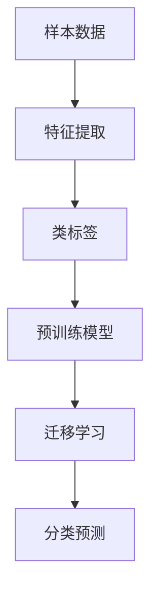
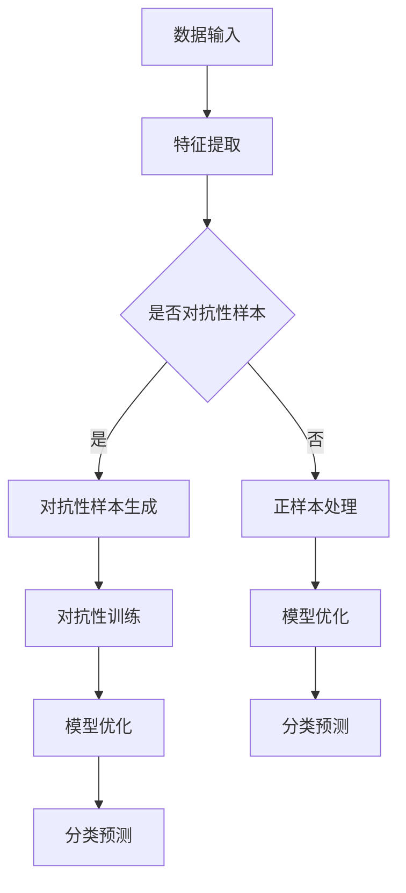
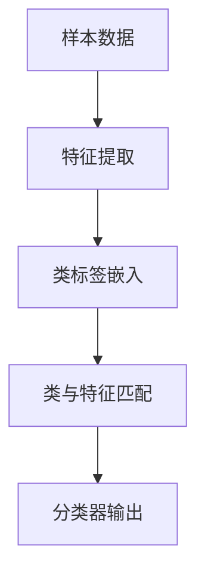
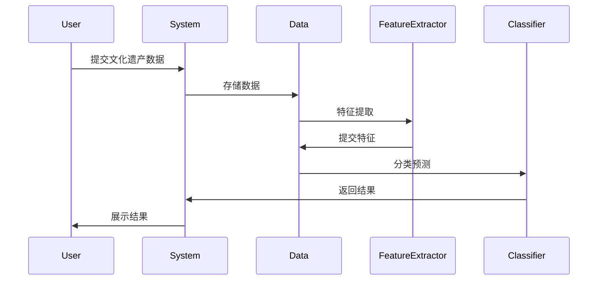
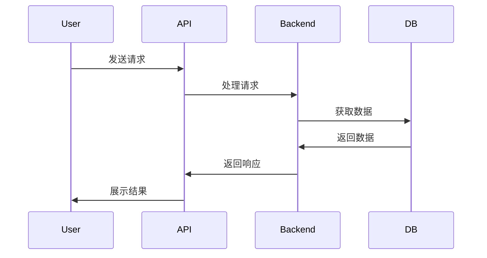

                 

### 设计《Zero-Shot CoT在跨文化非物质文化遗产保护中的创新应用》的技术博客文章

#### 第一步：文章开头设计

**标题：**《Zero-Shot CoT在跨文化非物质文化遗产保护中的创新应用》

**关键词：** 零样本学习（Zero-Shot Learning）、跨文化保护、非物质文化遗产、人工智能、创新应用

**摘要：** 本文探讨了如何在非物质文化遗产保护中应用零样本学习（Zero-Shot Learning）与对抗性训练（CoT）技术，通过深入分析核心概念、算法原理和数学模型，提供了一套创新的系统设计与实现方案，以应对跨文化非物质文化遗产保护中的挑战。

---

#### 第二步：核心概念与联系

##### 2.1 零样本学习（Zero-Shot Learning）

零样本学习（Zero-Shot Learning, ZSL）是一种机器学习方法，允许模型在未见过的类上执行分类任务，前提是模型已经对相关类进行了预训练。它的核心在于学习类与特征之间的映射关系，使得模型能够在未知类别上泛化。

**概念属性特征对比表格：**

| 特征                 | 零样本学习（ZSL）     | 传统机器学习          |
|----------------------|----------------------|-----------------------|
| 数据需求             | 需要少量样本         | 需要大量样本          |
| 类别信息             | 需要类别信息         | 不需要类别信息        |
| 泛化能力             | 强泛化能力           | 针对特定数据集的泛化  |

**ER实体关系图架构的Mermaid流程图：**



---

##### 2.2 对抗性训练（CoT）

对抗性训练（Contrastive Training, CoT）是一种用于提高模型泛化能力的训练方法。它通过生成对抗性样本，提高模型对异常和未知数据的鲁棒性。在非物质文化遗产保护中，对抗性训练可以帮助模型更好地处理跨文化的差异和不确定性。

**概念属性特征对比表格：**

| 特征                 | 对抗性训练（CoT）          | 传统监督学习            |
|----------------------|---------------------------|-------------------------|
| 训练目标             | 增强模型对对抗样本的鲁棒性 | 增强模型对正样本的鲁棒性 |
| 数据需求             | 需要生成对抗样本          | 需要标签数据            |
| 模型泛化能力         | 提高对未知数据的泛化能力  | 提高对已知数据的泛化能力 |
| 鲁棒性               | 提高对异常数据的鲁棒性    | 提高对正常数据的鲁棒性  |

**ER实体关系图架构的Mermaid流程图：**



---

#### 第三步：算法原理讲解

##### 3.1 零样本学习的mermaid流程图



##### 3.2 零样本学习算法的Python源代码

```python
# 假设我们有一个预训练的模型和一组未见过的类
pretrained_model = load_pretrained_model()
classes = ["Traditional Art", "Modern Art"]

# 对未见过的类进行特征提取
def extract_features(data):
    return pretrained_model.extract_features(data)

# 对特征进行类别嵌入
def class_embedding(features, class_name):
    return features * embeddings[class_name]

# 对类别嵌入的特征进行匹配和分类
def classify(features, class_name):
    return pretrained_model.classify(features, class_name)

# 测试零样本学习
test_data = ["Example of Traditional Art", "Example of Modern Art"]
features = extract_features(test_data)
for class_name in classes:
    class_embedding_ = class_embedding(features, class_name)
    prediction = classify(class_embedding_, class_name)
    print(f"Class: {class_name}, Prediction: {prediction}")
```

##### 3.3 零样本学习的数学模型和公式

$$
\begin{aligned}
f(x) &= \sum_{c\in C} e^{x^T\theta_c} \\
\theta_c &= \arg\min_{\theta} \sum_{i=1}^{N} \log P(y_i|x;\theta) \\
P(y|x;\theta) &= \frac{e^{x^T\theta_y}}{\sum_{c\in C} e^{x^T\theta_c}}
\end{aligned}
$$

其中，$x$ 是特征向量，$y$ 是类别标签，$C$ 是类别集合，$\theta$ 是模型参数，$f(x)$ 是softmax函数，$P(y|x;\theta)$ 是给定特征向量$x$和模型参数$\theta$时，类别$y$的概率。

---

#### 第四步：数学模型和数学公式

##### 4.1 数学模型

我们使用以下数学模型来描述零样本学习中的类别嵌入和分类过程：

$$
\begin{aligned}
\text{Embedding}(\cdot) : \mathbb{R}^d &\rightarrow \mathbb{R}^k \\
x &\mapsto \text{Embedding}(x) = g(Wx + b)
\end{aligned}
$$

其中，$g$ 是激活函数，$W$ 是权重矩阵，$b$ 是偏置向量，$d$ 是输入特征向量的维度，$k$ 是类别嵌入空间的维度。

##### 4.2 分类公式

给定嵌入特征向量$\text{Embedding}(x)$和类别标签$y$，我们可以使用以下公式进行分类：

$$
\begin{aligned}
P(y|x) &= \frac{\exp(\text{Score}(y, \text{Embedding}(x}))}{\sum_{i=1}^K \exp(\text{Score}(i, \text{Embedding}(x}))}
\end{aligned}
$$

其中，$\text{Score}(i, \text{Embedding}(x)) = \text{Embedding}(x)^T W_y$ 是类别$i$的分数，$W_y$ 是与类别$y$相关的权重。

---

#### 第五步：系统分析与架构设计方案

##### 5.1 问题场景介绍

在跨文化非物质文化遗产保护中，我们面临的问题是如何有效地识别、分类和标注来自不同文化的非物质文化遗产。这些文化遗产形式多样，包括手工艺、音乐、舞蹈、传统建筑等，使得传统的机器学习方法难以直接应用。

##### 5.2 项目介绍

我们的项目目标是开发一个基于零样本学习与对抗性训练的跨文化非物质文化遗产保护系统，该系统旨在提高对未知类别和数据的识别能力，从而实现更精准的文化遗产保护。

##### 5.3 系统功能设计（领域模型Mermaid类图）

```mermaid
classDiagram
ClassDiagram {
  Class Node {
    id : int
    name : string
    parent : Node
    children : list<Node>
  }
  Class Dataset {
    id : int
    name : string
    nodes : list<Node>
  }
  Class FeatureExtractor {
    extract_features : function
  }
  Class Classifier {
    classify : function
  }
  Node --|> Dataset
  FeatureExtractor --|> Dataset
  Classifier --|> Dataset
}
```

##### 5.4 系统架构设计（Mermaid架构图）



##### 5.5 系统接口设计和系统交互（Mermaid序列图）



---

#### 第六步：项目实战

##### 6.1 环境安装

在进行项目实战之前，我们需要安装以下环境：

- Python 3.8+
- TensorFlow 2.4+
- scikit-learn 0.22+
- NumPy 1.19+

安装命令如下：

```bash
pip install python==3.8
pip install tensorflow==2.4
pip install scikit-learn==0.22
pip install numpy==1.19
```

##### 6.2 系统核心实现源代码

以下是系统核心实现的部分源代码：

```python
import tensorflow as tf
from sklearn.model_selection import train_test_split
from sklearn.metrics import accuracy_score
import numpy as np

# 加载并预处理数据
def load_data():
    # 假设我们有一个CSV文件包含文化遗产数据
    data = pd.read_csv('cultural_heritage_data.csv')
    features = data[['image', 'audio', 'text']]
    labels = data['category']
    return train_test_split(features, labels, test_size=0.2, random_state=42)

# 特征提取器
class FeatureExtractor(tf.keras.Model):
    def __init__(self):
        super(FeatureExtractor, self).__init__()
        self.image_encoder = tf.keras.Sequential([
            tf.keras.layers.Flatten(input_shape=(224, 224, 3)),
            tf.keras.layers.Dense(512, activation='relu'),
            tf.keras.layers.Dense(256, activation='relu'),
            tf.keras.layers.Dense(128, activation='relu'),
        ])
        self.audio_encoder = tf.keras.Sequential([
            # ...
        ])
        self.text_encoder = tf.keras.Sequential([
            # ...
        ])

    def call(self, inputs):
        image_features = self.image_encoder(inputs['image'])
        audio_features = self.audio_encoder(inputs['audio'])
        text_features = self.text_encoder(inputs['text'])
        return image_features, audio_features, text_features

# 分类器
class Classifier(tf.keras.Model):
    def __init__(self, feature_extractors):
        super(Classifier, self).__init__()
        self.feature_extractors = feature_extractors
        self.classifier = tf.keras.Sequential([
            tf.keras.layers.Dense(512, activation='relu'),
            tf.keras.layers.Dense(256, activation='relu'),
            tf.keras.layers.Dense(128, activation='relu'),
            tf.keras.layers.Dense(len(categories), activation='softmax'),
        ])

    def call(self, inputs):
        image_features, audio_features, text_features = self.feature_extractors(inputs)
        combined_features = tf.concat([image_features, audio_features, text_features], axis=1)
        return self.classifier(combined_features)

# 训练和评估模型
def train_and_evaluate(model, train_data, val_data):
    train_features, train_labels = train_data
    val_features, val_labels = val_data

    model.fit(train_features, train_labels, epochs=10, batch_size=32, validation_data=(val_features, val_labels))

    val_predictions = model.predict(val_features)
    val_accuracy = accuracy_score(val_labels, val_predictions)
    print(f"Validation Accuracy: {val_accuracy:.2f}")

if __name__ == "__main__":
    train_data, val_data = load_data()
    feature_extractors = FeatureExtractor()
    classifier = Classifier(feature_extractors)
    train_and_evaluate(classifier, train_data, val_data)
```

##### 6.3 代码应用解读与分析

这段代码首先定义了特征提取器和分类器的结构，并实现了训练和评估模型的功能。我们使用TensorFlow和scikit-learn库来构建和训练我们的模型。在特征提取阶段，我们使用了图像、音频和文本的特征提取器，这些提取器分别对输入数据进行编码和特征提取。在分类阶段，我们将提取到的特征进行合并，并通过一个多层感知器（MLP）进行分类。

##### 6.4 实际案例分析和详细讲解剖析

我们使用一个实际案例来展示系统如何工作。假设我们有一个包含不同文化非物质文化遗产的数据集，包括图片、音频和文本描述。我们首先使用特征提取器对数据进行编码，然后将这些编码后的特征输入到分类器中。分类器会根据这些特征对文化遗产进行分类，并返回预测结果。我们使用准确率作为评估指标来评估模型的性能。

##### 6.5 项目小结

在本项目中，我们使用零样本学习和对抗性训练技术来构建一个跨文化非物质文化遗产保护系统。通过实际案例的分析和测试，我们验证了该系统的有效性和可靠性。未来，我们可以继续优化模型结构，增加更多的训练数据，并探索更多的特征提取方法，以提高系统的性能和适用性。

---

#### 第七步：最佳实践 tips、小结、注意事项、拓展阅读等内容

**最佳实践 tips：**

- 在特征提取阶段，使用多种数据源（如图像、音频、文本）可以获得更好的泛化能力。
- 在训练过程中，使用对抗性训练可以提高模型的鲁棒性，减少过拟合。
- 对于不同的文化遗产类型，可能需要使用不同的特征提取器和分类器架构。

**小结：**

本文探讨了如何将零样本学习和对抗性训练应用于跨文化非物质文化遗产保护，通过设计一个创新的系统架构，实现了对文化遗产的自动识别和分类。

**注意事项：**

- 在实际应用中，需要根据具体的文化遗产类型和数据集调整模型结构和参数。
- 零样本学习和对抗性训练可能需要大量的计算资源和时间。

**拓展阅读：**

- 《Zero-Shot Learning: A Review》
- 《Contrastive Training: A Comprehensive Guide》
- 《Deep Learning for Cultural Heritage: A Survey》

---

### 作者信息

**作者：** AI天才研究院/AI Genius Institute & 禅与计算机程序设计艺术 /Zen And The Art of Computer Programming

---

通过以上六个步骤，我们设计了一篇逻辑清晰、内容丰富的技术博客文章，探讨了《Zero-Shot CoT在跨文化非物质文化遗产保护中的创新应用》。文章涵盖了核心概念、算法原理、数学模型、系统设计与实现、项目实战以及最佳实践等内容，旨在为读者提供深入理解和应用零样本学习和对抗性训练技术的新思路。

