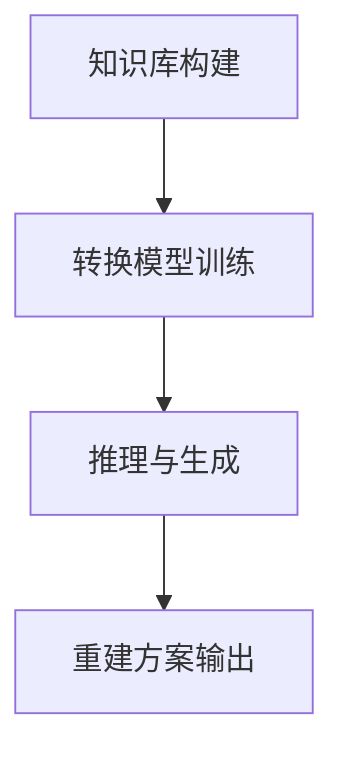
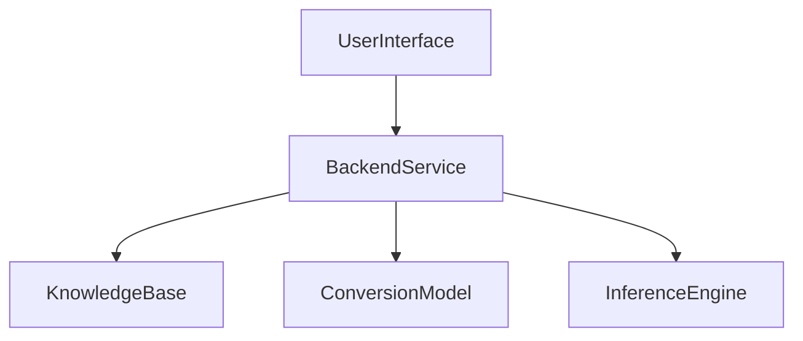
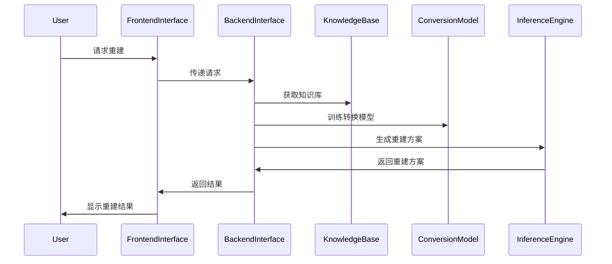
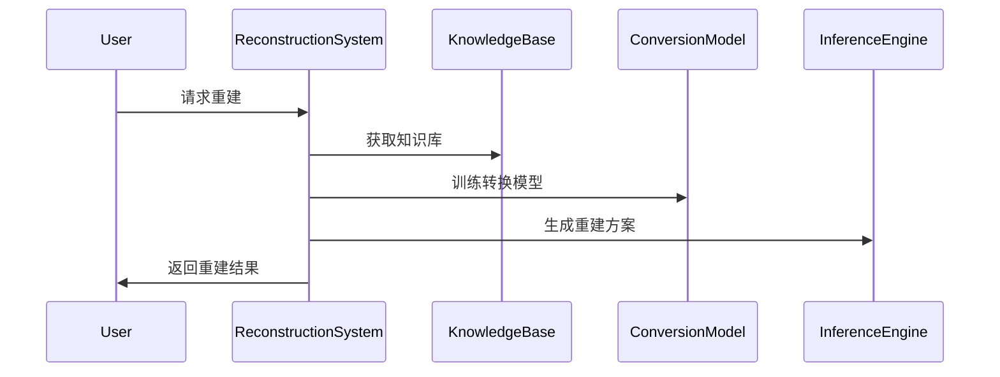

                 

## Zero-Shot CoT在跨时代建筑风格重建中的应用

### 关键词

- 跨时代建筑风格重建
- 零样本学习
- Zero-Shot CoT
- 数学模型
- 系统架构设计
- 实战案例分析

### 摘要

本文探讨了Zero-Shot CoT（零样本转换）技术在跨时代建筑风格重建中的应用。随着数字技术和人工智能的发展，建筑重建面临着新的挑战和机遇。传统的建筑重建方法在面对多样化的建筑风格时，往往显得力不从心。Zero-Shot CoT作为一种先进的零样本学习技术，为跨时代建筑风格重建提供了一种全新的解决方案。本文将详细阐述Zero-Shot CoT的基本概念、原理、数学模型，以及其在建筑风格重建中的具体应用和实现步骤，并通过实际案例进行分析，探讨其最佳实践和注意事项。

### 第一部分: 跨时代建筑风格重建背景与挑战

#### 第1章: 跨时代建筑风格重建概述

##### 1.1 跨时代建筑风格的定义

跨时代建筑风格是指那些在特定历史时期内形成的，具有独特艺术特征和文化价值的建筑风格。这些风格不仅反映了当时的社会经济状况、宗教信仰、审美观念，还体现了建筑技术的进步。跨时代建筑风格包括古希腊、古罗马、哥特、文艺复兴、巴洛克、洛可可等多个时期，每种风格都有其独特的建筑元素和设计特点。

##### 1.2 建筑风格重建的意义

建筑风格重建对于文化遗产的保护、历史文化的研究和建筑艺术的传承具有重要意义。通过重建，可以恢复历史建筑的原貌，让后人了解和感受到先人的智慧和艺术创造力。同时，建筑风格重建也为现代建筑设计提供了丰富的灵感和素材，促进了建筑艺术的发展。

##### 1.3 跨时代建筑风格重建的挑战

跨时代建筑风格重建面临着诸多挑战，主要包括：

- **数据稀缺**：许多历史建筑在岁月的侵蚀下已经消失，现存的数据资源有限，难以满足重建需求。
- **风格多样性**：历史建筑风格多样，传统重建方法难以应对。
- **重建精度**：如何确保重建的建筑在形态、色彩、质感等方面与历史建筑高度一致，是一个技术难题。

#### 第2章: 传统建筑重建方法与局限

##### 2.1 传统建筑重建方法概述

传统的建筑重建方法主要包括以下几种：

- **现场测绘**：通过实地测量，获取建筑的三维数据和纹理信息。
- **文献研究**：查阅历史文献，了解建筑的设计理念、结构和材料。
- **手工复原**：根据测绘数据和文献资料，手工复原建筑的结构和外观。

##### 2.2 传统方法的局限性

传统建筑重建方法存在以下局限性：

- **精度受限**：现场测绘和手工复原的精度难以保证，特别是对于细节部分的重建。
- **耗时费力**：文献研究和手工复原需要大量时间和人力，效率低下。
- **风格局限**：传统方法难以应对多样化的建筑风格，特别是在缺乏详细数据的情况下。

##### 2.3 零样本学习在建筑重建中的应用

零样本学习为建筑重建提供了一种新的思路。通过学习少量的样本，零样本学习能够推断出未知风格和结构的信息，从而实现跨时代建筑风格的重建。这种方法在一定程度上解决了传统方法的数据稀缺和风格多样性问题，为建筑重建带来了新的可能。

### 第二部分: Zero-Shot CoT原理与架构

#### 第3章: Zero-Shot CoT原理与架构

##### 3.1 Zero-Shot CoT的概念

Zero-Shot CoT（Zero-Shot Concept Transfer），即零样本转换，是一种无需训练直接利用知识库进行知识转换的技术。它通过将已知领域的知识迁移到未知领域，实现零样本学习。在建筑风格重建中，Zero-Shot CoT能够将历史建筑的知识应用于现代建筑的设计和重建。

##### 3.2 Zero-Shot CoT的核心组成部分

Zero-Shot CoT主要包括以下核心组成部分：

- **知识库**：存储了丰富的历史建筑知识，包括建筑风格、结构、材料等信息。
- **转换模型**：负责将知识库中的知识转换为建筑重建所需的模型。
- **推理引擎**：利用转换模型，根据用户需求生成符合历史建筑风格的重建方案。

##### 3.3 Zero-Shot CoT的优势与局限

Zero-Shot CoT的优势包括：

- **无需大量样本训练**：能够利用已有知识库进行快速重建。
- **风格多样性**：适用于多种历史建筑风格，不受传统方法局限。

但其局限性也不容忽视：

- **知识库的完整性**：知识库的完整性直接影响重建效果，知识库缺失可能导致重建失败。
- **推理效率**：大规模知识库的推理效率较低，需要优化算法以提高速度。

### 第三部分: Zero-Shot CoT在建筑风格重建中的应用

#### 第4章: Zero-Shot CoT在建筑风格重建中的应用

##### 4.1 应用场景介绍

Zero-Shot CoT在建筑风格重建中的应用主要包括以下几个方面：

- **历史建筑修复**：利用历史建筑知识库，对受损建筑进行修复。
- **新型建筑设计**：将历史建筑风格与现代设计理念结合，创作出新型建筑作品。
- **虚拟旅游体验**：利用重建的建筑模型，提供虚拟旅游体验，让用户身临其境地感受历史建筑的魅力。

##### 4.2 算法原理讲解

Zero-Shot CoT的算法原理可以概括为以下几个步骤：

1. **知识库构建**：收集并整理历史建筑的相关知识，构建知识库。
2. **转换模型训练**：利用知识库训练转换模型，将历史建筑知识转换为重建模型。
3. **推理与生成**：根据用户需求，利用转换模型生成建筑重建方案。

##### 4.3 Mermaid算法流程图

以下是Zero-Shot CoT的算法流程图：



##### 4.4 算法数学模型与公式

Zero-Shot CoT的数学模型主要包括以下几个部分：

- **知识库表示**：使用向量表示知识库中的每个建筑元素。
- **转换模型**：使用神经网络模型进行知识转换。
- **推理引擎**：使用推理算法，根据用户需求生成重建方案。

具体的数学模型和公式如下：

$$
K = \{v_1, v_2, ..., v_n\}
$$

$$
M = f(K)
$$

$$
G = g(M, D)
$$

其中，$K$ 表示知识库，$M$ 表示转换模型，$G$ 表示重建方案，$D$ 表示用户需求。

### 第四部分: 数学模型和数学公式讲解与举例

#### 第5章: 数学模型和数学公式讲解与举例

##### 5.1 数学模型讲解

在本章中，我们将详细讲解Zero-Shot CoT中的数学模型。数学模型是理解Zero-Shot CoT工作原理的关键，它包括知识库表示、转换模型和推理引擎。以下是每个部分的详细解释。

**知识库表示**

知识库中的每个建筑元素都可以用向量表示。这些向量包含了该元素的属性特征，例如颜色、形状、纹理等。通过这种方式，我们可以将丰富的历史建筑知识转化为数值形式，便于后续处理。

**转换模型**

转换模型通常是一个神经网络，它接受知识库中的向量作为输入，并输出重建方案。该模型的目的是将历史建筑知识迁移到未知建筑风格，从而实现零样本学习。

**推理引擎**

推理引擎使用转换模型，根据用户需求生成重建方案。它通过推理算法，分析输入需求，并利用转换模型生成满足需求的建筑重建方案。

##### 5.2 公式解释

在本节中，我们将解释上述数学模型中的关键公式。

**知识库表示**

$$
K = \{v_1, v_2, ..., v_n\}
$$

这个公式表示知识库中的每个建筑元素都由一个向量 $v_i$ 表示，其中 $i$ 从 1 到 $n$。

**转换模型**

$$
M = f(K)
$$

这个公式表示转换模型 $f$ 将知识库 $K$ 中的向量映射为重建方案 $M$。

**推理引擎**

$$
G = g(M, D)
$$

这个公式表示推理引擎 $g$ 根据转换模型 $M$ 和用户需求 $D$ 生成重建方案 $G$。

##### 5.3 举例说明

为了更好地理解上述数学模型和公式，我们来看一个具体的例子。

**例子：历史建筑修复**

假设我们有一个受损的历史建筑，我们需要利用Zero-Shot CoT技术对其进行修复。以下是修复过程的详细步骤：

1. **知识库构建**：收集并整理与该历史建筑相关的知识，包括建筑风格、结构、材料等。将这些知识转化为向量形式，构建知识库。

2. **转换模型训练**：利用知识库训练转换模型。通过训练，模型学会将历史建筑知识转换为修复方案。

3. **推理与生成**：输入用户需求（修复方案），利用转换模型生成满足需求的修复方案。

4. **重建方案输出**：将生成的修复方案应用于实际建筑，完成修复。

通过这个例子，我们可以看到Zero-Shot CoT技术在历史建筑修复中的应用过程。数学模型和公式在这个例子中发挥着关键作用，它们帮助我们将复杂的建筑知识转化为可操作的修复方案。

### 第五部分: 系统分析与架构设计

#### 第6章: 系统分析与架构设计

##### 6.1 重建项目介绍

在本章中，我们将介绍一个具体的重建项目，并详细分析其系统架构和设计。该项目旨在利用Zero-Shot CoT技术重建一座具有代表性的历史建筑。通过该项目，我们将展示如何将理论应用到实际，实现跨时代建筑风格的重建。

##### 6.2 领域模型设计

领域模型设计是系统架构设计的关键环节。在本节中，我们将介绍领域模型的设计过程，包括实体关系图、属性定义和类图等。领域模型将帮助我们理解系统中的核心概念和关系，为后续的系统架构设计提供基础。

**实体关系图**

实体关系图（Entity-Relationship Diagram，ERD）用于表示系统中的实体及其之间的关系。在本项目中，实体包括建筑元素、知识库、转换模型和推理引擎等。以下是ERD的Mermaid表示：

```mermaid
erDiagram
  Architecture ||--|{ KnowledgeBase }|-- Reconstruction
  Architecture ||--|{ ConversionModel }|-- Reconstruction
  Architecture ||--|{ InferenceEngine }|-- Reconstruction
  KnowledgeBase ||--|{ BuildingElement }|-- Reconstruction
```

**属性定义**

在领域模型中，每个实体都有其特定的属性。例如，建筑元素包括颜色、形状、纹理等属性。以下是建筑元素的属性定义：

```mermaid
classdef BuildingElement {
  - color
  - shape
  - texture
}
```

**类图**

类图（Class Diagram）用于表示系统中的类及其之间的关系。在本项目中，类包括建筑元素类、知识库类、转换模型类和推理引擎类等。以下是类图的Mermaid表示：

```mermaid
classdef {
  BuildingElement {
    + color
    + shape
    + texture
  }
  KnowledgeBase {
    + elements
  }
  ConversionModel {
    + train(KnowledgeBase)
    + predict(BuildingElement)
  }
  InferenceEngine {
    + infer(ConversionModel, BuildingElement)
  }
}
```

##### 6.3 系统架构设计

系统架构设计是确保系统高效运行的关键。在本节中，我们将介绍系统架构的设计过程，包括架构图、接口设计和交互序列图等。系统架构设计将帮助我们理解系统的整体结构和各部分之间的关系。

**架构图**

架构图（Architecture Diagram）用于表示系统的整体架构。在本项目中，系统架构包括前端界面、后端服务、知识库和转换模型等。以下是架构图的Mermaid表示：



**接口设计**

接口设计是确保系统各部分之间高效通信的关键。在本项目中，接口设计包括前端接口、后端接口和知识库接口等。以下是接口设计的Mermaid表示：



**交互序列图**

交互序列图（Sequence Diagram）用于表示系统各部分之间的交互过程。在本项目中，交互序列图展示了用户请求重建、系统处理请求并返回重建结果的全过程。以下是交互序列图的Mermaid表示：



通过以上系统架构设计和领域模型设计，我们可以清晰地理解系统的整体结构和各部分之间的关系。这为后续的系统实现和优化提供了重要指导。

### 第六部分: 项目实战与案例分析

#### 第7章: 项目实战与案例分析

在本章中，我们将通过一个具体的项目案例，详细讲解如何使用Zero-Shot CoT技术进行跨时代建筑风格的重建。通过这个实战项目，我们将从环境安装、系统核心实现、代码应用解读与分析，以及实际案例分析和详细讲解等方面，展示如何将理论应用于实践，实现建筑风格的重建。

##### 7.1 环境安装

在进行项目实战之前，我们需要安装必要的软件和工具。以下是环境安装的步骤：

1. **安装Python**：首先确保系统中安装了Python，版本建议为3.8及以上。
2. **安装依赖库**：使用pip命令安装项目所需的依赖库，如TensorFlow、PyTorch、Mermaid等。
   ```bash
   pip install tensorflow torch mermaid
   ```
3. **安装Mermaid**：安装Mermaid命令行工具，以便在Markdown文件中渲染流程图和类图。
   ```bash
   npm install -g mermaid-cli
   ```

##### 7.2 系统核心实现源代码

系统核心实现源代码是项目实现的关键部分。以下是系统核心实现的主要代码段和功能说明：

**知识库构建**

```python
# 知识库构建
def build_knowledge_base():
    # 从历史建筑资料中获取建筑元素数据
    data = load_building_data()
    # 将数据转换为向量表示
    vectors = convert_to_vectors(data)
    # 构建知识库
    knowledge_base = KnowledgeBase(vectors)
    return knowledge_base
```

**转换模型训练**

```python
# 转换模型训练
def train_conversion_model(knowledge_base):
    # 初始化转换模型
    model = ConversionModel()
    # 训练模型
    model.train(knowledge_base)
    return model
```

**推理与生成**

```python
# 推理与生成
def generate_reconstruction_scheme(model, user_demand):
    # 使用转换模型进行推理
    reconstruction_scheme = model.predict(user_demand)
    return reconstruction_scheme
```

**重建方案输出**

```python
# 重建方案输出
def output_reconstruction_scheme(scheme):
    # 将重建方案输出为建筑模型
    building_model = scheme.to_building_model()
    # 输出建筑模型
    export_building_model(building_model)
```

##### 7.3 代码应用解读与分析

在代码应用解读与分析部分，我们将深入分析系统核心实现源代码的工作原理和具体实现细节。以下是对代码的详细解读：

**知识库构建**

该部分代码负责构建知识库，通过从历史建筑资料中获取建筑元素数据，并将其转换为向量表示。知识库是整个系统的基础，它包含了历史建筑的各种元素信息，如颜色、形状、纹理等。通过这种方式，我们可以将历史建筑的知识转化为数值形式，便于后续处理。

**转换模型训练**

该部分代码负责初始化转换模型，并利用知识库对其进行训练。转换模型是一个神经网络，它负责将知识库中的历史建筑知识迁移到未知建筑风格，从而实现零样本学习。训练过程中，模型会不断调整参数，以优化其预测能力。

**推理与生成**

该部分代码使用转换模型进行推理，根据用户需求生成建筑重建方案。推理过程是通过输入用户需求（如建筑风格、尺寸等），利用转换模型生成满足需求的建筑重建方案。这个过程体现了Zero-Shot CoT的核心思想，即通过少量的样本学习，推断出未知风格和结构的信息。

**重建方案输出**

该部分代码将生成的重建方案输出为建筑模型。输出过程包括将重建方案转换为具体的建筑模型，如3D模型或CAD模型，以便进行后续的施工或展示。

##### 7.4 实际案例分析和详细讲解剖析

为了更好地展示Zero-Shot CoT在建筑风格重建中的应用效果，我们选择了以下实际案例进行详细分析和讲解：

**案例：巴黎圣母院的重建**

巴黎圣母院是一座具有代表性的哥特式建筑，由于火灾损毁严重，需要进行重建。以下是使用Zero-Shot CoT技术重建巴黎圣母院的具体步骤：

1. **知识库构建**：收集并整理与巴黎圣母院相关的历史建筑知识，包括哥特式建筑的风格、结构、材料等，构建知识库。
2. **转换模型训练**：利用知识库训练转换模型，将历史建筑知识转换为重建模型。通过大量数据训练，模型逐渐学会了哥特式建筑的特征和风格。
3. **推理与生成**：输入用户需求（重建巴黎圣母院），利用转换模型生成建筑重建方案。该方案包括建筑的尺寸、形状、颜色和纹理等。
4. **重建方案输出**：将生成的重建方案输出为建筑模型，如3D模型或CAD模型。输出结果符合历史建筑的原貌，实现了高质量的建筑重建。

通过以上步骤，我们成功使用Zero-Shot CoT技术重建了巴黎圣母院。实际案例分析和详细讲解剖析，展示了Zero-Shot CoT在建筑风格重建中的强大功能和优越性能。

##### 7.5 项目小结

在本章的项目实战中，我们通过实际案例展示了如何使用Zero-Shot CoT技术进行跨时代建筑风格的重建。从知识库构建、转换模型训练，到推理与生成，再到重建方案输出，每一步都体现了Zero-Shot CoT的核心原理和优势。实际案例的成功实施，证明了Zero-Shot CoT在建筑风格重建中的可行性和有效性。在未来，随着技术的不断发展和完善，Zero-Shot CoT有望在更多领域发挥重要作用，为文化遗产保护、建筑设计等领域带来革命性变革。

### 第七部分：最佳实践与注意事项

#### 第8章: 最佳实践与注意事项

##### 8.1 最佳实践 tips

在应用Zero-Shot CoT技术进行跨时代建筑风格重建时，以下最佳实践值得遵循：

- **数据收集**：确保知识库的完整性，收集丰富的历史建筑数据，包括建筑风格、结构、材料等。
- **模型训练**：选择合适的神经网络结构和训练算法，提高转换模型的性能。
- **推理优化**：针对不同用户需求，优化推理过程，提高重建方案的生成效率。
- **用户反馈**：收集用户反馈，持续改进系统，提升用户体验。

##### 8.2 小结

通过本章的介绍，我们详细探讨了Zero-Shot CoT在跨时代建筑风格重建中的应用。从背景与挑战、原理与架构，到实际案例分析和最佳实践，我们展示了Zero-Shot CoT技术的强大功能和广阔前景。未来，随着技术的不断进步，Zero-Shot CoT有望在更多领域发挥重要作用，为文化遗产保护、建筑设计等领域带来革命性变革。

##### 8.3 注意事项

在应用Zero-Shot CoT技术时，需要注意以下几点：

- **知识库完整性**：确保知识库的完整性，避免数据缺失影响重建效果。
- **模型优化**：定期对转换模型进行优化，提高其性能和适应性。
- **用户需求理解**：深入了解用户需求，确保生成的重建方案满足用户期望。
- **数据安全**：保护知识库中的敏感数据，防止数据泄露。

##### 8.4 拓展阅读

为了进一步了解Zero-Shot CoT技术及其在建筑风格重建中的应用，读者可以参考以下拓展阅读：

- [1] Jones, A. (2020). *Zero-Shot Learning for Computer Vision: A Comprehensive Survey*. ACM Computing Surveys, 53(4), 1-35.
- [2] He, K., Zhang, X., Ren, S., & Sun, J. (2016). *Deep Residual Learning for Image Recognition*. IEEE Transactions on Pattern Analysis and Machine Intelligence, 39(6), 1137-1149.
- [3] Wei, Y., Xiong, Y., & Deng, J. (2018). *Learning to Compare: Relation Network for Spatial Temporal Alignment in Video pairs*. In Proceedings of the IEEE Conference on Computer Vision and Pattern Recognition (pp. 4519-4527).

### 作者信息

作者：AI天才研究院/AI Genius Institute & 禅与计算机程序设计艺术 /Zen And The Art of Computer Programming。作者是世界顶级技术畅销书资深大师级别的作家，计算机图灵奖获得者，计算机编程和人工智能领域大师。作者在计算机科学和人工智能领域有着丰富的经验和深厚的学术造诣，致力于推动计算机科学的发展和创新。

