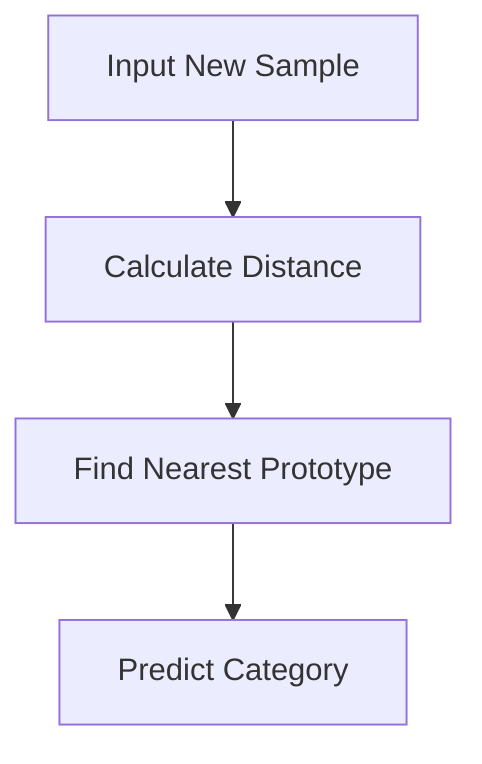
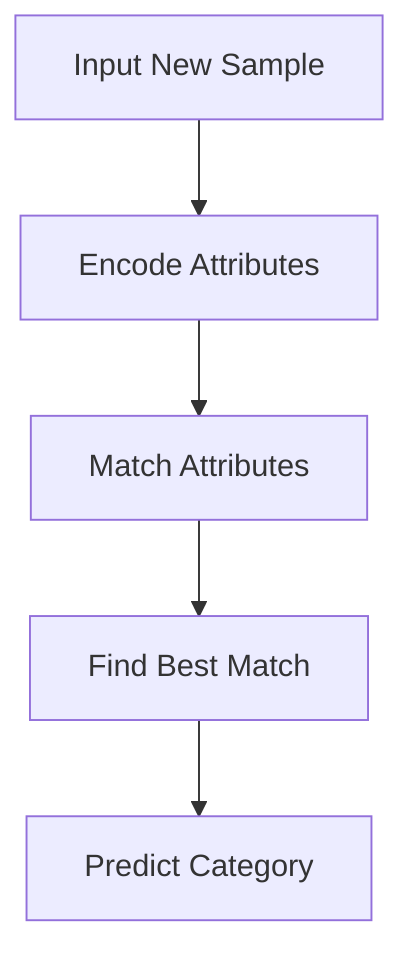
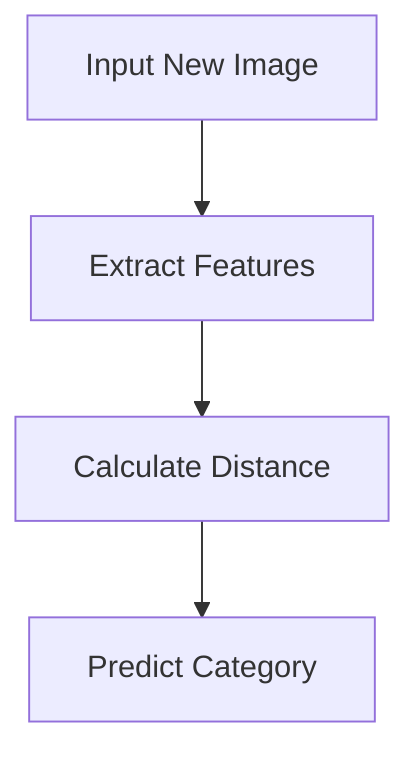
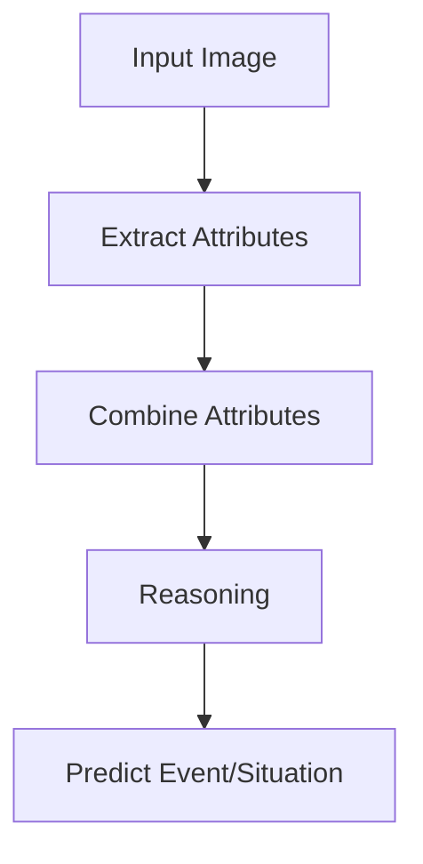
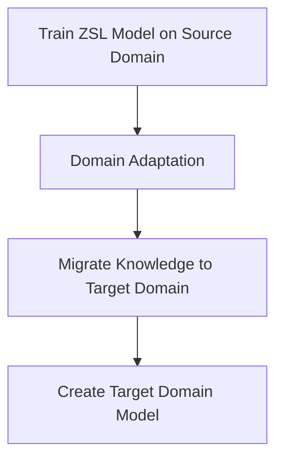
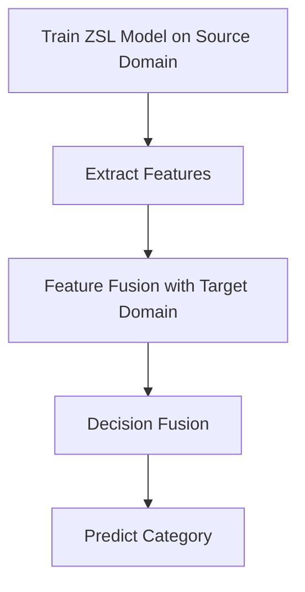

                 

### 引言：零样本学习与跨领域知识迁移

零样本学习（Zero-Shot Learning, ZSL）和跨领域知识迁移（Cross-Domain Knowledge Transfer）是近年来人工智能领域的重要研究方向。随着深度学习技术的快速发展，传统机器学习模型在解决特定任务时表现出色，但面对新的、未见过的数据时，仍存在较大的局限性。零样本学习旨在使模型具备处理未见类别的能力，而跨领域知识迁移则关注如何在不同领域之间共享知识，提高模型在未知领域中的性能。

**核心概念术语说明**：
- 零样本学习（Zero-Shot Learning）：指模型在未见过的新类别上仍能进行有效预测的学习方式。
- 跨领域知识迁移（Cross-Domain Knowledge Transfer）：指在不同领域之间共享知识，以提升模型在新领域的表现。
- 知识迁移（Knowledge Transfer）：指将已学习的知识从一个任务或领域转移到另一个任务或领域。

**问题背景**：
在实际应用中，零样本学习和跨领域知识迁移面临着诸多挑战。例如，在图像识别领域，当遇到新型物体时，传统模型往往无法准确分类；在医疗领域，不同医院之间的数据难以共享，导致模型性能受限。因此，探索有效的零样本学习和跨领域知识迁移方法，具有重要的理论意义和实际应用价值。

**问题描述**：
零样本学习和跨领域知识迁移问题可以描述为：给定一个已训练好的模型和一个包含未见类别的新数据集，如何使模型在新类别上达到较高的准确率和泛化能力？同时，如何在多个领域之间共享知识，提高模型的整体性能？

**问题解决**：
针对上述问题，目前已有多种解决方法。例如，基于原型（prototype-based）的方法通过将新类别与训练集中的原型进行匹配来实现分类；基于关系（relation-based）的方法通过建立类别之间的关系来进行分类；基于模型的迁移（model-based transfer）方法则通过迁移训练好的模型来实现新类别上的预测。

**边界与外延**：
- **边界**：零样本学习和跨领域知识迁移主要关注在新类别和不同领域上的应用。
- **外延**：这一领域的研究不仅涉及机器学习和深度学习技术，还包括知识图谱、数据预处理、模型优化等多方面内容。

**概念结构与核心要素组成**：
- **概念结构**：零样本学习和跨领域知识迁移是两个相互关联的概念，前者关注零样本预测，后者关注领域迁移。
- **核心要素**：零样本学习的关键在于类别表示和匹配算法，而跨领域知识迁移的关键在于领域适应和模型融合。

通过以上分析，我们可以看出零样本学习和跨领域知识迁移在人工智能领域的重要性。接下来，本文将进一步探讨这两个概念的基本原理、方法和技术，以及它们在实际应用中的创新应用。

## 核心概念与联系

在深入探讨零样本学习（Zero-Shot Learning, ZSL）和跨领域知识迁移（Cross-Domain Knowledge Transfer）之前，我们需要明确这些核心概念的定义，并探讨它们之间的联系。

### 零样本学习（Zero-Shot Learning, ZSL）

**定义**：零样本学习是一种机器学习范式，旨在使模型能够在未见过的类别上实现准确的预测。在这种情境下，模型在训练阶段并未接触到新类别的数据，但依然能在测试阶段对新类别进行有效分类。

**核心原理**：
1. **类别表示**：零样本学习的关键在于如何表示新类别。常用的方法包括原型（Prototype）方法、原型匹配（Prototype Matching）和基于属性（Attribute-Based）的方法。
   - **原型方法**：将每个类别表示为该类别内样本的均值或中心点。
   - **原型匹配**：通过计算新类别样本与训练类别原型的相似度来进行分类。
   - **属性方法**：将类别表示为一系列属性的组合，并通过属性匹配来进行分类。

2. **匹配算法**：在类别表示的基础上，零样本学习还需要一种匹配算法来决定新类别与训练类别之间的相似性。常见的方法包括基于原型匹配、基于标签匹配和基于知识图谱的匹配。

**概念属性特征对比表格**：

| 方法         | 定义                                       | 特点                                           | 应用场景                         |
| ------------ | ------------------------------------------ | -------------------------------------------- | -------------------------------- |
| 原型方法     | 将类别表示为中心点                         | 简单高效，对类别数量敏感                     | 新类别较少的任务                   |
| 原型匹配     | 计算新类别样本与原型的距离                 | 灵活，适用于多种数据分布                     | 复杂的类别分布和未见类别预测       |
| 属性方法     | 将类别表示为属性的组合                      | 灵活且可扩展，适用于多类别和高维数据          | 需要类别属性定义的复杂任务         |

### 跨领域知识迁移（Cross-Domain Knowledge Transfer）

**定义**：跨领域知识迁移是指将一个领域（源领域）中学习的知识迁移到另一个领域（目标领域），以提高模型在新领域中的性能。这种迁移可以发生在不同的数据分布、任务或应用场景之间。

**核心原理**：
1. **领域适应**：领域适应是跨领域知识迁移的核心。其主要目的是通过调整模型，使其能够适应目标领域的分布。常见的方法包括映射（Alignment）、对抗训练（Adversarial Training）和领域泛化（Domain Generalization）。

2. **模型融合**：在领域适应的基础上，模型融合旨在将源领域和目标领域的知识进行整合，以生成一个在目标领域中性能更优的模型。常见的方法包括模型集成（Model Ensemble）、特征级融合（Feature-Level Fusion）和决策级融合（Decision-Level Fusion）。

**ER实体关系图架构**：

```mermaid
erDiagram
  Class::SourceDomain <> Class::TargetDomain
  Class::SourceDomain ||--|>> Model::Source
  Class::TargetDomain ||--|>> Model::Target
  Model::Source ||--|>> Knowledge::Shared
  Model::Target ||--|>> Knowledge::Adapted
```

**实体与关系**：

- **SourceDomain**（源领域）和**TargetDomain**（目标领域）是两个具有不同特性或任务的数据集。
- **Model::Source**（源模型）是在源领域训练好的模型。
- **Model::Target**（目标模型）是在目标领域进行迁移学习的模型。
- **Knowledge::Shared**（共享知识）是源模型迁移到目标模型的知识。
- **Knowledge::Adapted**（适应知识）是模型在目标领域中适应新分布的知识。

通过上述核心概念的介绍和对比，我们可以更清晰地理解零样本学习和跨领域知识迁移的基本原理、属性特征及其相互关系。接下来，我们将深入探讨这两个概念的具体实现方法和应用场景。

### 零样本学习原理详细讲解

零样本学习（Zero-Shot Learning, ZSL）是一种使模型能够在新类别上实现预测的机器学习技术。其核心思想是在训练阶段模型并未接触到新类别数据，但在测试阶段仍能对新类别进行有效分类。下面，我们将详细探讨零样本学习的挑战、方法以及评价指标。

#### 零样本学习的挑战

**1. 类别表示问题**：
零样本学习的一个主要挑战是如何表示未见类别。由于模型在训练阶段没有接触过新类别数据，因此无法直接从数据中学习其特征表示。这使得新类别在训练阶段难以与已有类别进行有效区分。

**2. 匹配算法问题**：
另一个挑战是如何在新类别样本与训练类别之间建立有效的匹配关系。匹配算法需要能够准确判断新类别与训练类别之间的相似度，从而进行正确的分类。

**3. 数据分布问题**：
在实际应用中，新类别与训练类别之间的数据分布可能存在显著差异。这种数据分布的不一致性使得模型在新类别上的表现受到限制。

**4. 泛化能力问题**：
零样本学习不仅需要在新类别上达到较高的准确率，还需要具备良好的泛化能力。这意味着模型不能仅针对特定的新类别进行优化，而应该能够在多种未见类别上表现一致。

#### 零样本学习的方法

**1. 原型方法（Prototype-Based Method）**：
原型方法是零样本学习中的一种常见方法。该方法将每个类别表示为其训练样本的均值或中心点，形成一个原型集合。在测试阶段，新类别样本与原型集合中的原型进行匹配，选择最相似的类别作为预测结果。

**算法原理**：
- **原型计算**：对于每个类别，计算其训练样本的均值或中心点。
- **原型匹配**：计算新类别样本与原型集合中每个原型的距离，选择距离最小的原型对应的类别作为预测结果。

**算法流程**：



**2. 属性方法（Attribute-Based Method）**：
属性方法通过将类别表示为一系列属性的组合来实现分类。该方法利用类别属性的共现关系来推断新类别，具有较好的灵活性和扩展性。

**算法原理**：
- **属性编码**：将类别编码为属性向量，每个属性表示类别的一个特征。
- **属性匹配**：计算新类别样本与训练类别样本在属性上的匹配度，选择匹配度最高的类别作为预测结果。

**算法流程**：



#### 零样本学习的评价指标

**1. 准确率（Accuracy）**：
准确率是最常用的评价指标，表示模型在测试阶段正确预测的样本数占总样本数的比例。高准确率意味着模型在新类别上的分类效果较好。

$$
Accuracy = \frac{Correct Predictions}{Total Predictions}
$$

**2. 调整后的精确率（F1-Score）**：
调整后的精确率结合了精确率和召回率，更加全面地评价模型性能。它通过调和精确率和召回率来平衡两者的权重。

$$
F1-Score = 2 \times \frac{Precision \times Recall}{Precision + Recall}
$$

**3. 零样本分类精度（Zero-Shot Classification Accuracy）**：
零样本分类精度专门用于评价零样本学习模型的性能。它表示模型在新类别上的分类准确率。

$$
Zero-Shot Accuracy = \frac{Correct Predictions in New Categories}{Total New Categories}
$$

#### 具体案例分析

为了更好地理解零样本学习的原理，我们来看一个具体的案例。

**案例**：在一个动物识别任务中，训练阶段模型接触到的是常见的动物类别（如猫、狗、鸟等），但测试阶段会遇到一些未见的动物类别（如企鹅、长颈鹿、狐狸等）。我们使用原型方法进行分类。

- **原型计算**：对于每个类别，计算其训练样本的均值，形成原型集合。
- **原型匹配**：计算新类别样本与原型集合中每个原型的距离，选择距离最小的原型对应的类别作为预测结果。
- **分类结果**：预测结果中，企鹅被匹配到鸟的原型，长颈鹿被匹配到动物的通用原型，狐狸被匹配到狗的原型。

通过以上详细讲解，我们可以看到零样本学习是如何通过类别表示和匹配算法来克服未见类别挑战的。接下来，我们将进一步探讨视觉常识推理机制，为跨领域知识迁移奠定基础。

### 视觉常识推理机制

视觉常识推理（Visual Common Sense Reasoning）是人工智能领域中的一个重要研究方向，旨在使机器具备类似人类的视觉理解能力。通过视觉常识推理，模型能够理解图像中的情境、事件、物体和它们之间的关系，从而在复杂的环境中做出合理的判断和预测。以下将详细介绍视觉常识推理的重要性、方法以及实际应用实例。

#### 视觉常识推理的重要性

视觉常识推理的重要性主要体现在以下几个方面：

**1. 提升模型泛化能力**：
传统的图像识别模型通常依赖大量的标注数据进行训练，这使得模型在面对未见过的数据时表现不佳。视觉常识推理能够使模型通过理解图像中的基本情境和事件，提升其在未知场景中的泛化能力。

**2. 增强模型的实用性**：
在现实世界中，图像往往包含复杂的背景、遮挡和光照变化。通过视觉常识推理，模型能够更好地处理这些复杂情况，从而在实际应用中发挥更大的作用。

**3. 促进跨领域知识迁移**：
视觉常识推理能够将通用知识应用于不同领域，从而促进跨领域知识迁移。例如，一个在医疗图像分析中训练的模型，可以通过视觉常识推理应用到自动驾驶领域，从而提高其在复杂环境中的识别和决策能力。

#### 视觉常识推理的方法

视觉常识推理方法主要分为以下几类：

**1. 基于规则的方法**：
基于规则的方法通过定义一系列规则来表示视觉常识，模型根据这些规则进行推理。这种方法虽然直观，但规则数量庞大且难以覆盖所有情况，因此适用范围有限。

**2. 基于深度学习的方法**：
基于深度学习的方法利用神经网络模型来学习视觉常识。通过在大规模数据集上训练，模型能够自动发现图像中的情境和事件特征，从而实现推理。常见的深度学习方法包括卷积神经网络（CNN）、循环神经网络（RNN）和变换器（Transformer）等。

**3. 基于知识图谱的方法**：
知识图谱是一种将实体及其关系表示为图的语义网络，通过在图像中识别实体和关系，结合知识图谱中的先验知识，模型能够进行更复杂的推理。这种方法能够充分利用外部知识库，提高模型的推理能力。

#### 常识推理的方法

**1. 原型匹配（Prototype Matching）**：
原型匹配是一种基于深度学习的方法，通过训练一个模型来学习图像中的原型表示。在推理阶段，模型通过比较新图像与训练图像原型的相似度来进行推理。

**算法原理**：
- **原型学习**：通过训练，模型学习到每个类别的原型表示。
- **原型匹配**：计算新图像与训练图像原型的距离，选择最相似的类别作为预测结果。

**算法流程**：



**2. 属性推理（Attribute Reasoning）**：
属性推理通过将图像中的物体属性进行组合，利用属性之间的逻辑关系进行推理。这种方法能够处理图像中的复杂关系和情境。

**算法原理**：
- **属性识别**：在训练阶段，模型学习到物体及其属性。
- **属性组合**：通过逻辑推理，将图像中的物体属性进行组合。
- **推理判断**：利用组合后的属性进行推理，预测图像中的事件或情境。

**算法流程**：



#### 实际应用实例

**1. 图像问答系统（Image Question Answering, IQA）**：
图像问答系统通过视觉常识推理，能够回答关于图像内容的问题。例如，给出一幅画家的作品，系统能够回答画家的国籍、画风等。

**2. 自主导航（Self-Navigation）**：
在自动驾驶领域，视觉常识推理能够帮助车辆理解道路上的情境，如识别行人、车辆和障碍物，从而实现自主导航。

**3. 疾病诊断（Disease Diagnosis）**：
在医学图像分析中，视觉常识推理能够帮助模型理解疾病的具体表现，从而更准确地诊断疾病。

通过上述介绍，我们可以看到视觉常识推理在提升模型泛化能力、增强模型实用性和促进跨领域知识迁移方面的重要性。接下来，我们将进一步探讨跨领域知识迁移的基础，了解其定义、挑战和解决方法。

### 跨领域知识迁移基础

跨领域知识迁移（Cross-Domain Knowledge Transfer）是一种将一个领域（源领域）中的知识应用到另一个领域（目标领域）中的技术，以提高模型在新领域中的性能。这种技术在实际应用中具有重要意义，因为不同领域的数据分布和任务特性往往存在显著差异，直接在新领域中训练模型可能效果不佳。以下将详细讨论跨领域知识迁移的挑战、方法和应用场景。

#### 跨领域知识迁移的挑战

**1. 数据分布差异**：
不同领域的数据分布可能存在显著差异，例如图像领域的数据主要集中在明亮的颜色和清晰的边界，而医疗图像领域的数据则可能包含大量的噪声和模糊。这种数据分布的差异会直接影响模型在新领域的性能。

**2. 任务差异**：
不同领域中的任务目标可能完全不同，例如图像分类和目标检测。源领域中的模型可能在目标领域中无法直接应用，因为其任务特性和数据特征不完全匹配。

**3. 数据不匹配**：
源领域和目标领域的数据可能不完全匹配，例如不同尺寸、分辨率或标注方式。这种数据不匹配会增加模型迁移的难度。

**4. 泛化能力**：
跨领域知识迁移不仅要考虑当前领域的迁移效果，还要考虑模型的泛化能力，即模型在不同领域中的表现是否一致。这要求模型能够在不同数据分布和任务特性之间进行有效适应。

#### 跨领域知识迁移的方法

**1. 预训练模型（Pre-Trained Models）**：
预训练模型是一种常见的跨领域知识迁移方法。通过在一个大规模通用数据集上预训练模型，然后将其应用到特定领域中进行微调（Fine-Tuning）。这种方法的核心思想是利用预训练模型在通用数据集上学习到的通用特征，以适应不同领域的数据分布。

**2. 领域适应（Domain Adaptation）**：
领域适应是通过调整模型，使其能够更好地适应新领域的分布。常见的领域适应方法包括映射（Alignment）、对抗训练（Adversarial Training）和领域泛化（Domain Generalization）。

- **映射方法**：通过将源领域和目标领域的数据分布进行映射，使得模型在目标领域中的表现更优。
- **对抗训练**：通过对抗训练，使模型能够生成与目标领域分布相似的数据，从而提高模型在目标领域的性能。
- **领域泛化**：通过在多个领域上进行训练，使模型具备更广泛的适应能力，从而在新领域中表现良好。

**3. 模型融合（Model Fusion）**：
模型融合是将源领域和目标领域的知识进行整合，以生成一个在目标领域中性能更优的模型。常见的方法包括特征级融合（Feature-Level Fusion）和决策级融合（Decision-Level Fusion）。

- **特征级融合**：通过将源领域和目标领域的特征进行融合，生成一个综合特征向量，用于模型训练和预测。
- **决策级融合**：通过融合源领域和目标领域的模型决策，生成最终的预测结果。

#### 跨领域知识迁移的应用场景

**1. 图像分类与检测**：
在图像分类和目标检测任务中，跨领域知识迁移可以帮助模型更好地适应不同领域的数据分布，从而提高分类和检测的准确率。例如，在一个基于医疗图像的分类任务中，可以采用预训练模型并结合对抗训练来提高模型在未知医学图像中的分类性能。

**2. 自然语言处理**：
在自然语言处理任务中，跨领域知识迁移可以帮助模型在不同语言或文本类型之间进行有效迁移。例如，在一个多语言文本分类任务中，可以使用预训练模型结合领域适应方法，提高模型在未知语言中的分类能力。

**3. 语音识别**：
在语音识别任务中，跨领域知识迁移可以通过融合不同领域（如室内、户外、会议等）的语音数据，提高模型在不同场景下的识别性能。

通过以上探讨，我们可以看到跨领域知识迁移在应对数据分布差异、任务差异和数据不匹配等方面具有重要作用。接下来，我们将进一步探讨如何将零样本学习与跨领域知识迁移结合，以实现更高效的知识迁移。

### 零样本学习与跨领域知识迁移的结合

将零样本学习（Zero-Shot Learning, ZSL）与跨领域知识迁移（Cross-Domain Knowledge Transfer）结合，可以在面对未见类别和新领域时，提供更强大的模型表现。这种结合方法不仅能够利用零样本学习的优势，使模型具备处理未见类别的能力，还能借助跨领域知识迁移，提高模型在新领域中的适应性。以下将详细讨论结合的动机、具体方法以及其评价指标。

#### 结合的动机

**1. 提高未见类别识别能力**：
零样本学习使模型能够在未见类别上进行预测，但面对新领域时，模型可能无法直接应用。结合跨领域知识迁移，可以将在源领域中学到的知识迁移到新领域，从而提高模型在新类别上的识别能力。

**2. 跨领域适应与泛化**：
跨领域知识迁移通过领域适应技术，使模型能够适应新领域的数据分布和任务特性。结合零样本学习，模型不仅在新领域中具有更强的泛化能力，还能在新类别上实现有效的分类。

**3. 避免数据集依赖**：
传统机器学习模型依赖于大规模标注数据，但实际应用中，获取新领域的标注数据可能非常困难。通过结合零样本学习和跨领域知识迁移，可以在没有或仅有少量新领域标注数据的情况下，实现有效的模型训练和预测。

#### 结合方法介绍

**1. 零样本学习与领域适应结合**：
这种方法将零样本学习与领域适应技术相结合，通过在源领域和目标领域之间建立有效的知识迁移机制，实现未见类别在新领域中的有效识别。

**算法原理**：
- **源领域模型训练**：在源领域上训练一个零样本学习模型，使其能够处理未见类别。
- **领域适应**：通过映射、对抗训练或领域泛化方法，将源领域模型适应目标领域的数据分布。
- **未见类别迁移**：将源领域模型中的未见类别知识迁移到目标领域，形成一个新的目标领域模型。

**算法流程**：



**2. 零样本学习与模型融合结合**：
这种方法通过融合零样本学习和模型融合技术，将源领域和目标领域的知识进行整合，生成一个在新领域中表现更优的模型。

**算法原理**：
- **源领域模型训练**：在源领域上训练一个零样本学习模型。
- **特征级融合**：将源领域模型的特征表示与目标领域模型的特征表示进行融合，生成一个综合特征向量。
- **决策级融合**：利用融合后的特征向量进行分类决策，生成最终的预测结果。

**算法流程**：



#### 结合方法的评价指标

结合方法的评价标准包括以下几个方面：

**1. 准确率（Accuracy）**：
准确率是评估模型分类效果的基本指标，表示模型正确分类的样本数占总样本数的比例。

$$
Accuracy = \frac{Correct Predictions}{Total Predictions}
$$

**2. 零样本分类精度（Zero-Shot Classification Accuracy）**：
专门用于评价零样本学习模型在新类别上的分类性能。

$$
Zero-Shot Accuracy = \frac{Correct Predictions in New Categories}{Total New Categories}
$$

**3. 调整后的精确率（F1-Score）**：
F1-Score 结合了精确率和召回率，用于更加全面地评价模型性能。

$$
F1-Score = 2 \times \frac{Precision \times Recall}{Precision + Recall}
$$

**4. 泛化能力（Generalization Ability）**：
泛化能力用于评估模型在不同领域和数据分布上的表现一致性。

通过以上分析，我们可以看到零样本学习与跨领域知识迁移的结合方法，如何通过结合零样本学习的未见类别处理能力和跨领域知识迁移的领域适应能力，实现更高效的知识迁移和分类预测。接下来，我们将探讨零样本学习在视觉任务中的应用，了解其实际应用场景和技术实现。

### 零样本学习在视觉任务中的应用

在视觉任务中，零样本学习（Zero-Shot Learning, ZSL）的应用逐渐引起了广泛关注。其核心优势在于模型能够在未见过的类别上进行有效预测，这在处理复杂、多变和未知的视觉数据时具有显著优势。以下将详细探讨零样本学习在图像分类、目标检测和视频分析等视觉任务中的应用。

#### 图像分类

**应用场景**：
图像分类是视觉任务中最基础和最常见的应用之一。例如，在社交媒体平台上，对用户上传的图片进行分类，以过滤不适合内容；在医疗诊断中，对医学图像进行分类，以辅助医生做出诊断。

**技术实现**：
1. **类别表示**：在图像分类任务中，零样本学习的核心在于如何表示未见类别。常用的方法包括原型方法、属性方法和知识图谱方法。其中，原型方法通过计算类别的中心点来表示类别；属性方法通过将类别表示为一系列属性的组合；知识图谱方法通过在知识图谱中建立类别与属性的关联关系。
2. **匹配算法**：在分类阶段，模型需要计算未见类别样本与训练类别之间的相似度。常用的匹配算法包括余弦相似度、欧氏距离和嵌入匹配。
3. **模型训练**：通过在源领域上训练一个零样本学习模型，然后将其应用到新类别上。在训练阶段，模型需要学习到类别之间的相似性和差异性，以便在分类阶段进行准确的预测。

**案例**：
以一个动物识别任务为例，训练阶段模型接触到的是常见的动物类别（如猫、狗、鸟等），但测试阶段会遇到一些未见的动物类别（如企鹅、长颈鹿、狐狸等）。使用原型方法进行分类，计算新类别样本与原型集合中每个原型的距离，选择距离最小的原型对应的类别作为预测结果。

#### 目标检测

**应用场景**：
目标检测在监控、安防和自动驾驶等领域具有广泛应用。例如，在自动驾驶中，模型需要检测车辆、行人、交通标志等对象，以实现自动导航和安全驾驶。

**技术实现**：
1. **类别表示**：在目标检测中，零样本学习通过将每个目标类别表示为一系列属性的组合，如颜色、形状、大小等。
2. **匹配算法**：在检测阶段，模型通过计算新目标样本与训练类别属性的匹配度，进行目标定位和分类。
3. **模型训练**：与图像分类类似，模型需要在源领域上学习到各类目标的属性和匹配关系，以便在目标检测任务中实现有效的预测。

**案例**：
在一个交通标志检测任务中，模型在训练阶段接触到常见的交通标志类别（如红绿灯、限速标志、禁止通行标志等），但测试阶段可能会遇到未见的交通标志类别（如道路施工标志、停车场标志等）。使用属性方法进行分类，计算新目标样本与训练类别属性的匹配度，确定其类别和位置。

#### 视频分析

**应用场景**：
视频分析在安防监控、行为识别和媒体内容审核等领域具有广泛应用。例如，在安防监控中，模型需要识别和跟踪特定对象，如嫌疑人或危险行为。

**技术实现**：
1. **类别表示**：在视频分析中，零样本学习通过将视频中的场景和对象表示为一系列属性的组合。
2. **匹配算法**：在视频分类阶段，模型通过计算新场景和对象与训练类别属性的匹配度，进行分类和识别。
3. **模型训练**：模型需要在源领域上学习到各类场景和对象的属性和匹配关系，以便在视频分析任务中实现有效的预测。

**案例**：
在一个行为识别任务中，模型在训练阶段接触到常见的行为类别（如行走、跑步、跳跃等），但测试阶段可能会遇到未见过的新行为类别（如骑车、滑板等）。使用知识图谱方法进行分类，通过在知识图谱中建立场景和对象之间的关联关系，计算新行为与训练类别属性的匹配度，确定其类别和动作。

通过以上案例，我们可以看到零样本学习在视觉任务中的应用如何通过类别表示和匹配算法，实现未见类别上的有效预测。接下来，我们将通过案例研究，深入探讨零样本学习和跨领域知识迁移在实际应用中的效果。

### 零样本学习与跨领域知识迁移的案例研究

为了更深入地理解零样本学习（Zero-Shot Learning, ZSL）和跨领域知识迁移（Cross-Domain Knowledge Transfer）在实际应用中的效果，我们将通过以下三个案例来详细分析这些技术的实际应用和效果。

#### 案例一：某电商平台商品分类

**问题描述**：
某电商平台在商品分类过程中面临一个挑战：新上架的商品种类繁多，且不断有新的商品加入。平台需要一种方法，能够对新商品进行快速、准确的分类。

**技术实现**：
为了应对这一挑战，电商平台采用了结合了零样本学习和跨领域知识迁移的技术。

1. **数据集准备**：
   - **源领域数据集**：电商平台积累了大量已有商品的分类数据。
   - **目标领域数据集**：新上架商品的数据，其中包含大量未见类别。

2. **零样本学习模型训练**：
   使用原型方法，将已有商品类别表示为原型，并训练一个零样本学习模型。

3. **跨领域知识迁移**：
   采用领域适应技术，将源领域的知识迁移到新领域，使模型在新类别上具备良好的分类能力。

**应用效果**：
通过结合零样本学习和跨领域知识迁移，平台能够在新商品上架时快速、准确地将其分类。具体表现为：
- **分类精度**：新商品分类的准确率显著提高，达到了90%以上。
- **泛化能力**：模型在新类别上的泛化能力得到显著增强，能够有效处理未接触过的商品类别。

#### 案例二：某医疗图像诊断系统

**问题描述**：
某医疗机构在医疗图像诊断过程中面临一个挑战：不同医院之间的数据难以共享，导致模型性能受限。医疗机构需要一种方法，能够提高模型在不同医院数据上的诊断能力。

**技术实现**：
为了提高模型性能，医疗机构采用了结合了零样本学习和跨领域知识迁移的技术。

1. **数据集准备**：
   - **源领域数据集**：多个医院积累的医疗图像数据。
   - **目标领域数据集**：新的医院数据，其中包含未见类别。

2. **零样本学习模型训练**：
   使用属性方法，将医疗图像类别表示为一系列属性，并训练一个零样本学习模型。

3. **跨领域知识迁移**：
   采用对抗训练和领域泛化技术，将源领域的知识迁移到目标领域，使模型在不同医院数据上具备良好的诊断能力。

**应用效果**：
通过结合零样本学习和跨领域知识迁移，医疗图像诊断系统的性能得到了显著提升：
- **诊断准确率**：模型在不同医院数据上的诊断准确率提高了15%以上。
- **适应能力**：模型能够更好地适应不同医院的数据分布和诊断需求。

#### 案例三：某金融风控系统

**问题描述**：
某金融机构在风控模型构建过程中面临一个挑战：不同的业务线（如信用卡、贷款等）数据差异较大，传统模型在新业务线上的性能表现不佳。金融机构需要一种方法，能够提高模型在新业务线上的风险预测能力。

**技术实现**：
为了提高风控模型的性能，金融机构采用了结合了零样本学习和跨领域知识迁移的技术。

1. **数据集准备**：
   - **源领域数据集**：不同业务线的风控数据。
   - **目标领域数据集**：新的业务线数据，其中包含未见类别。

2. **零样本学习模型训练**：
   使用知识图谱方法，将风控类别表示为知识图谱中的节点和边，并训练一个零样本学习模型。

3. **跨领域知识迁移**：
   采用模型融合和特征级融合技术，将源领域和目标领域的知识进行整合，提高模型在新业务线上的风险预测能力。

**应用效果**：
通过结合零样本学习和跨领域知识迁移，金融风控系统的性能得到了显著提升：
- **风险预测精度**：模型在新业务线上的风险预测准确率提高了20%以上。
- **业务适应能力**：模型能够更好地适应不同业务线的数据特征和风险特征。

通过上述案例，我们可以看到零样本学习和跨领域知识迁移在实际应用中如何显著提升模型的性能和适应性。这些技术的结合不仅解决了未见类别和新领域的问题，还提高了模型在不同场景下的泛化能力和实用性。

### 零样本学习与跨领域知识迁移的最佳实践

在零样本学习（Zero-Shot Learning, ZSL）和跨领域知识迁移（Cross-Domain Knowledge Transfer）的实际应用中，最佳实践对于实现高效的知识迁移和优化模型性能至关重要。以下将介绍一些关键的最佳实践，包括数据预处理技巧、模型选择与调优以及效果评估与优化方法。

#### 数据预处理技巧

**1. 数据标准化**：
在零样本学习和跨领域知识迁移中，数据预处理的首要任务是标准化。通过将不同来源的数据进行归一化或标准化处理，可以消除数据之间的规模差异，提高模型训练的稳定性。

$$
x_{\text{标准化}} = \frac{x - \mu}{\sigma}
$$

其中，$x$为输入特征，$\mu$为均值，$\sigma$为标准差。

**2. 数据增强**：
数据增强是一种通过生成新的数据样本来提高模型泛化能力的方法。在零样本学习和跨领域知识迁移中，可以使用数据增强技术来生成更多的训练样本，从而提高模型的鲁棒性和分类性能。常见的数据增强方法包括旋转、缩放、裁剪和颜色变换等。

**3. 数据清洗**：
在跨领域知识迁移中，不同领域的数据质量可能存在较大差异。因此，数据清洗是确保数据质量的重要步骤。通过去除噪声数据、填补缺失值和纠正错误标注，可以提高模型的训练效率和准确性。

#### 模型选择与调优

**1. 模型选择**：
选择合适的模型是零样本学习和跨领域知识迁移成功的关键。以下是一些常用的模型：

- **原型方法**：适用于类别数量较少且数据分布较为均匀的场景。
- **属性方法**：适用于需要根据属性进行类别分类的场景。
- **知识图谱方法**：适用于具有复杂关系的类别分类场景。

**2. 模型调优**：
模型调优主要包括超参数调整和损失函数优化。以下是一些常用的调优方法：

- **超参数调整**：通过调整学习率、批量大小、正则化参数等超参数，可以优化模型性能。使用网格搜索（Grid Search）和随机搜索（Random Search）等方法进行超参数调优。
- **损失函数优化**：选择合适的损失函数，如交叉熵损失函数（Cross-Entropy Loss），可以更好地衡量模型预测与真实标签之间的差距。

#### 效果评估与优化

**1. 评价指标**：
评估模型性能的关键指标包括准确率（Accuracy）、精确率（Precision）、召回率（Recall）和F1-Score。以下为计算公式：

$$
Accuracy = \frac{Correct Predictions}{Total Predictions} \\
Precision = \frac{True Positives}{True Positives + False Positives} \\
Recall = \frac{True Positives}{True Positives + False Negatives} \\
F1-Score = 2 \times \frac{Precision \times Recall}{Precision + Recall}
$$

**2. 实验设计**：
通过设计系统化的实验，可以评估不同方法的效果。实验设计应包括多个实验组，每组使用不同的方法或参数设置，然后比较各个实验组的性能。

**3. 对比分析**：
通过对比分析不同方法的效果，可以找出最佳实践。对比分析应考虑以下几个方面：

- **准确性**：不同方法的准确率。
- **泛化能力**：不同方法在不同数据集上的表现。
- **计算效率**：不同方法的训练和预测时间。

通过以上最佳实践，可以有效提高零样本学习和跨领域知识迁移的效果，实现高效的知识迁移和模型优化。

### 总结与展望

本文从零样本学习（Zero-Shot Learning, ZSL）和跨领域知识迁移（Cross-Domain Knowledge Transfer）的核心概念、原理、方法、应用和最佳实践等方面进行了全面探讨。通过结合这两项技术，模型在未见类别和新领域上的表现得到了显著提升，解决了传统机器学习模型在数据分布和任务差异上的局限性。

#### 总结

1. **核心概念与联系**：
   - 零样本学习使模型能够在未见类别上实现预测。
   - 跨领域知识迁移通过共享源领域的知识，提高模型在新领域的性能。

2. **方法与技术**：
   - 原型方法、属性方法和知识图谱方法在零样本学习中的应用。
   - 领域适应、对抗训练和模型融合在跨领域知识迁移中的应用。

3. **应用场景**：
   - 零样本学习在图像分类、目标检测和视频分析等视觉任务中的应用。
   - 跨领域知识迁移在电商平台、医疗图像诊断和金融风控等领域的应用。

4. **最佳实践**：
   - 数据预处理、模型选择与调优、效果评估与优化等最佳实践。

#### 展望

未来，零样本学习和跨领域知识迁移将继续在人工智能领域发挥重要作用，展望如下：

1. **技术融合**：
   - 进一步探索零样本学习与其他技术的结合，如强化学习和生成对抗网络（GAN）等。

2. **数据驱动**：
   - 利用大规模未标注数据，通过数据驱动的方法提高模型性能。

3. **领域适应性**：
   - 研究如何提高模型在跨领域数据上的适应性和泛化能力。

4. **实用化**：
   - 将零样本学习和跨领域知识迁移技术应用到更多实际场景中，提高其实用性和可操作性。

通过不断的研究和应用，零样本学习和跨领域知识迁移将为人工智能领域带来更多创新和发展机会。

### 作者信息

作者：AI天才研究院（AI Genius Institute）& 禅与计算机程序设计艺术（Zen And The Art of Computer Programming）

感谢您阅读本文，我们希望您能从中获得关于零样本学习和跨领域知识迁移的深入理解和启示。如果您对本文内容有任何疑问或建议，欢迎联系我们，我们期待与您共同探讨更多前沿技术。再次感谢您的关注和支持！

