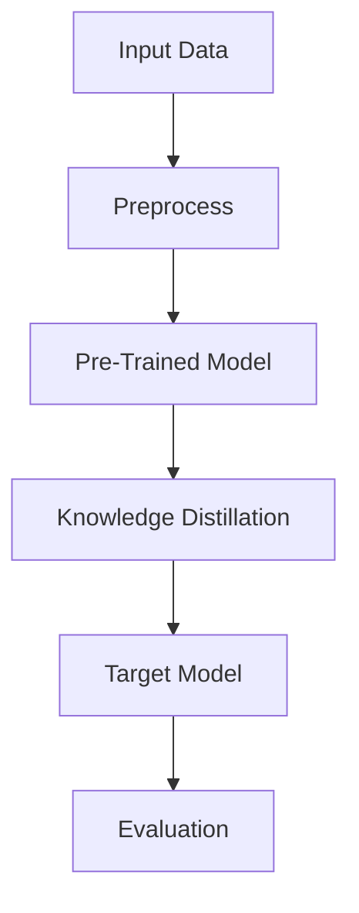
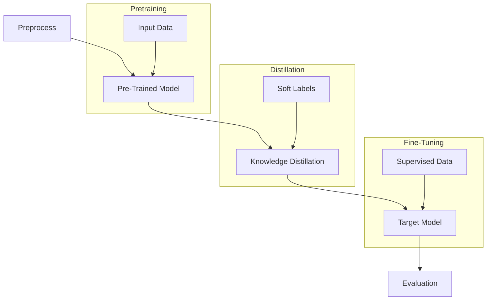
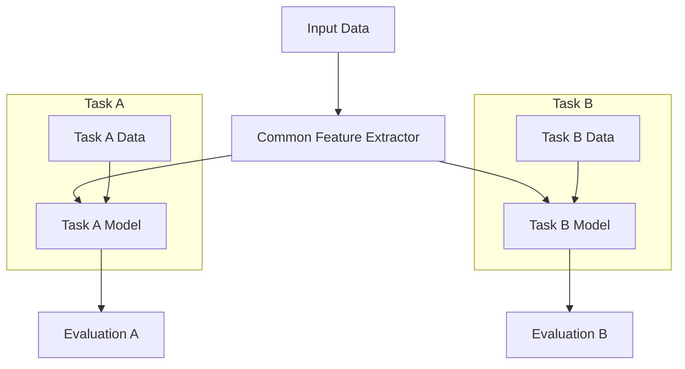
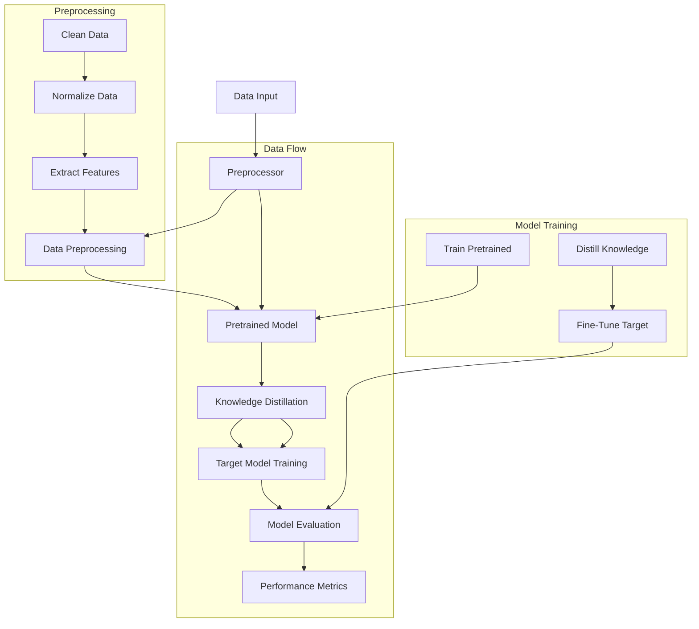
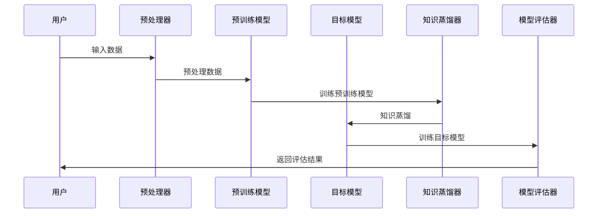

                 

### 引言

在当今信息爆炸的时代，知识的快速积累和传播极大地推动了科技的发展。然而，如何有效地利用这些知识进行跨领域的知识迁移，依然是一个重要的研究课题。特别是对于人工智能领域，传统的知识迁移方法往往依赖于大量的领域特定数据和手工特征工程，这在一定程度上限制了其在实际应用中的广泛性和灵活性。

**什么是跨领域知识迁移？**

跨领域知识迁移是指在不同领域间共享和利用知识，以解决一个领域中的问题时，另一个领域中的经验或知识可以提供有效的指导。它不仅可以帮助提升模型在不同领域的适应能力，还能够节省大量的数据收集和标注成本。

**为什么需要Zero-Shot CoT？**

Zero-Shot CoT（Zero-Shot Concept Transfer）是一种新兴的知识迁移方法，它能够在没有直接标注数据的条件下，实现跨领域知识的有效迁移。这种方法的核心在于利用预训练模型，通过学习大量无标签数据，构建出一种对未知领域的泛化能力。Zero-Shot CoT的重要性主要体现在以下几个方面：

1. **降低数据需求**：传统的知识迁移方法依赖于大量的领域特定数据，而Zero-Shot CoT可以大大减少这种依赖，因为它能够利用大量无标签数据进行迁移学习。
2. **提高模型泛化能力**：通过跨领域迁移，模型可以学习到不同领域的知识，从而提升在未知领域中的表现。
3. **加速研究进程**：由于不需要大量的数据标注，Zero-Shot CoT可以大大加快研究进程，为快速迭代和实验提供支持。

本文的目标是深入探讨Zero-Shot CoT在跨领域知识迁移中的突破，分析其核心原理、实现方法、应用场景，并探讨未来的研究方向。文章将分为以下几个部分：

1. **背景与基本概念**：介绍跨领域知识迁移的概念、挑战和现有方法。
2. **核心原理**：详细解释Zero-Shot CoT的定义、特点、理论和数学模型。
3. **算法与技术**：介绍Zero-Shot CoT的相关算法，并比较它们的优缺点。
4. **应用与案例**：展示Zero-Shot CoT在实际中的应用案例。
5. **系统设计与实现**：分析Zero-Shot CoT系统的架构和实现。
6. **实战与评估**：介绍具体的系统部署和性能评估。
7. **总结与展望**：总结Zero-Shot CoT的成果，探讨未来的发展方向。

### 背景与基本概念

#### 跨领域知识迁移的概念

跨领域知识迁移是一种机器学习技术，旨在将一个领域（源领域）中学习到的知识应用到另一个领域（目标领域）中。具体来说，源领域中存在的知识可以以各种形式体现，例如预训练模型、特征表示、规则或者先验知识等。通过这种迁移，目标领域可以受益于源领域的丰富经验，从而提升模型在未知领域中的表现。

**跨领域知识迁移的重要性**

跨领域知识迁移的重要性体现在多个方面。首先，不同领域的数据往往具有不同的分布和特征，传统的单一领域模型可能无法适应这些变化。通过跨领域迁移，模型可以更好地适应新的领域环境。其次，数据收集和标注通常是非常耗时且成本高昂的，特别是在医学、金融等领域。Zero-Shot CoT可以减少对大量领域特定数据的依赖，从而节省时间和成本。最后，跨领域知识迁移有助于加速研究和开发进程，使研究人员能够更快地探索新的应用场景和解决方案。

#### 跨领域知识迁移的挑战

尽管跨领域知识迁移具有显著的优势，但在实际应用中仍然面临诸多挑战：

1. **数据分布差异**：不同领域的数据分布可能存在显著差异，这可能导致模型在目标领域中的性能下降。
2. **特征不一致**：不同领域的数据特征可能不完全一致，这增加了特征匹配和转换的复杂性。
3. **标签缺失**：在许多情况下，目标领域中的数据可能没有直接的标签信息，这使得监督学习变得困难。
4. **领域复杂性**：一些领域具有高度复杂性和多样性，这增加了知识迁移的难度。

**现有方法**

为了克服上述挑战，研究人员提出了多种跨领域知识迁移的方法：

1. **迁移学习**：迁移学习是跨领域知识迁移的核心方法，通过利用源领域的知识来提升目标领域的模型性能。迁移学习可以分为三种类型：无监督迁移学习、半监督迁移学习和有监督迁移学习。
2. **多任务学习**：多任务学习通过同时学习多个相关任务来提升模型在未知任务上的性能。这种方法可以共享不同任务之间的知识，从而提高泛化能力。
3. **元学习**：元学习通过学习如何学习来提升模型的迁移能力。它通过在多个任务上进行训练，找到适应新任务的最佳学习策略。
4. **对抗性学习**：对抗性学习通过生成对抗网络（GAN）等技术，模拟目标领域中的数据分布，从而提高模型在未知领域的适应能力。

尽管现有方法取得了一定的进展，但仍然存在一些局限性，例如对领域特定数据的高度依赖、模型复杂度高等问题。Zero-Shot CoT作为一种新兴的方法，旨在解决这些局限性，提供更加灵活和高效的知识迁移解决方案。

#### 知识迁移的概念结构与核心要素组成

知识迁移可以分为以下几个核心要素：

1. **源领域（Source Domain）**：提供知识的基础领域。
2. **目标领域（Target Domain）**：需要应用迁移知识的领域。
3. **迁移知识（Knowledge to Transfer）**：从源领域转移到目标领域的知识。
4. **迁移机制（Knowledge Transfer Mechanism）**：实现知识迁移的方法和策略。
5. **评价标准（Evaluation Criteria）**：评估知识迁移效果的指标。

**知识迁移的基本过程**：

1. **知识提取**：从源领域中提取有用的知识，这通常涉及特征提取、模型预训练等步骤。
2. **知识转换**：将提取的知识转换成适用于目标领域的形式，这可能包括特征匹配、数据增强等操作。
3. **知识应用**：将转换后的知识应用到目标领域中，通过训练模型、优化参数等方式实现知识迁移。
4. **效果评估**：评估知识迁移的效果，通过性能指标、用户反馈等方式进行评估。

通过深入理解这些概念和要素，我们可以更好地设计有效的知识迁移方案，从而提升人工智能模型的泛化能力和应用价值。

### 核心概念

#### 什么是Zero-Shot CoT？

Zero-Shot CoT（Zero-Shot Concept Transfer）是一种无监督的知识迁移方法，它允许模型在没有目标领域标注数据的情况下，直接利用源领域中的知识来提高目标领域中的性能。这种方法的核心理念是利用预训练模型，通过在大规模无标签数据上学习，构建出一种对未知概念的泛化能力。

#### Zero-Shot CoT的特点

Zero-Shot CoT具有以下几个显著特点：

1. **无监督学习**：不需要目标领域的标注数据，只需利用大量无标签的源领域数据。
2. **跨领域适应**：模型可以学习到不同领域之间的共性，从而在未知领域表现出色。
3. **低数据需求**：减少了数据标注的工作量，降低了数据收集和处理的成本。
4. **高泛化能力**：通过跨领域学习，模型可以更好地适应新的领域环境。

#### 核心原理与数学模型

Zero-Shot CoT的核心原理可以归结为以下几点：

1. **预训练模型**：使用预训练模型（如BERT、GPT等）在大规模无标签数据上学习，构建出通用的知识表示。
2. **知识蒸馏**：通过知识蒸馏（Knowledge Distillation）将预训练模型的知识传递给目标领域的小模型。
3. **多任务学习**：利用多任务学习（Multi-Task Learning）技术，使模型在不同任务中共享知识。
4. **元学习**：通过元学习（Meta-Learning）找到适应新任务的最佳学习策略。

数学模型方面，Zero-Shot CoT可以表示为以下公式：

\[ \text{Target Model} = \text{Knowledge Distillation}(\text{Pre-Trained Model}, \text{Target Data}) \]

其中，\(\text{Pre-Trained Model}\)是预训练模型，\(\text{Target Data}\)是目标领域中的无标签数据，\(\text{Knowledge Distillation}\)是一种将知识从大型模型传递到小型模型的方法。

#### Mermaid流程图

为了更直观地理解Zero-Shot CoT的工作流程，我们可以使用Mermaid绘制一个简单的流程图：



- **A（Input Data）**：输入源领域中的无标签数据。
- **B（Preprocess）**：对输入数据进行预处理。
- **C（Pre-Trained Model）**：使用预训练模型对预处理后的数据进行学习。
- **D（Knowledge Distillation）**：通过知识蒸馏将预训练模型的知识传递给目标领域的小模型。
- **E（Target Model）**：训练得到的目标领域模型。
- **F（Evaluation）**：评估目标模型的性能。

通过这个流程图，我们可以清晰地看到Zero-Shot CoT的核心步骤和流程。

### 算法与技术

#### Overview of Zero-Shot CoT Algorithms

Zero-Shot CoT算法主要分为以下几个类别：

1. **基于预训练模型的迁移学习算法**：这类算法利用预训练模型（如BERT、GPT等）在大规模无标签数据上学习，然后通过知识蒸馏将知识传递给目标领域的小模型。
2. **多任务学习算法**：通过同时学习多个相关任务，使模型在不同任务之间共享知识，从而提高泛化能力。
3. **元学习算法**：通过元学习技术找到适应新任务的最佳学习策略，从而实现跨领域的知识迁移。
4. **对抗性生成网络（GAN）算法**：利用GAN生成与目标领域数据分布相似的数据，从而提高模型在未知领域的适应能力。

#### Algorithm A: Detailed Explanation and Mermaid Diagram

**Algorithm A** 是一种基于预训练模型的迁移学习算法，其核心步骤包括预训练、知识蒸馏和目标模型训练。

**预训练**：
- 使用预训练模型（如BERT）在大规模无标签数据上学习，构建出通用的知识表示。
- 通过训练，模型学会了在不同领域中的共性和差异性。

**知识蒸馏**：
- 将预训练模型的知识传递给目标领域的小模型，通过损失函数将小模型的学习目标与预训练模型相一致。
- 使用软标签（Soft Labels）作为辅助目标，使小模型能够更好地吸收预训练模型的知识。

**目标模型训练**：
- 在目标领域中使用有监督训练数据对目标模型进行微调。
- 使用预训练模型和知识蒸馏阶段的信息，使目标模型能够在未知领域表现出色。

**Mermaid Diagram**：



- **A（Preprocess）**：输入源领域中的无标签数据进行预处理。
- **B（Pre-Trained Model）**：使用预训练模型学习无标签数据。
- **C（Knowledge Distillation）**：通过知识蒸馏将预训练模型的知识传递给目标模型。
- **D（Target Model）**：训练得到的目标领域模型。
- **E（Evaluation）**：评估目标模型的性能。

#### Algorithm B: Detailed Explanation and Mermaid Diagram

**Algorithm B** 是一种多任务学习算法，通过同时学习多个相关任务，使模型在不同任务之间共享知识。

**步骤**：
1. **任务定义**：定义多个相关任务，这些任务可以是不同的领域问题。
2. **共同特征提取**：在任务间提取共同的低级特征，这些特征有助于任务之间的知识共享。
3. **多任务学习模型**：设计一个多任务学习模型，将多个任务的输入和输出结合在一起，共享底层特征提取器。
4. **训练与优化**：同时训练多个任务，优化模型的参数，使它们在各自任务上表现更好。

**Mermaid Diagram**：



- **A（Input Data）**：输入源领域中的无标签数据。
- **B（Common Feature Extractor）**：提取共同的低级特征。
- **C（Task A Model）**：训练任务A的模型。
- **D（Task B Model）**：训练任务B的模型。
- **E（Evaluation A）**：评估任务A的性能。
- **F（Evaluation B）**：评估任务B的性能。

#### Comparative Analysis of Various Algorithms

**基于预训练模型的迁移学习算法（Algorithm A）**：
- 优点：利用预训练模型，可以快速构建通用的知识表示，降低对领域特定数据的依赖。
- 缺点：对预训练模型的要求较高，需要大量无标签数据进行训练。

**多任务学习算法（Algorithm B）**：
- 优点：可以同时解决多个相关任务，提高模型的泛化能力。
- 缺点：需要定义多个相关任务，且任务之间的关联性需要明确。

**元学习算法**：
- 优点：通过元学习，可以找到适应新任务的最佳学习策略，提高模型的迁移能力。
- 缺点：需要大量的元学习训练数据，且计算成本较高。

**对抗性生成网络（GAN）算法**：
- 优点：可以生成与目标领域数据分布相似的数据，提高模型在未知领域的适应能力。
- 缺点：GAN模型的训练较为复杂，且容易出现模式崩溃问题。

在实际应用中，可以根据具体问题和数据情况选择合适的算法。例如，对于数据量较少且任务相关性较高的场景，可以选择多任务学习算法；对于数据量大且对预训练模型要求不高的场景，可以选择基于预训练模型的迁移学习算法。

### 应用与案例

#### 应用场景

Zero-Shot CoT（Zero-Shot Concept Transfer）在多个领域展示了其强大的跨领域知识迁移能力。以下是几个典型的应用场景：

1. **医疗诊断**：在医疗领域，不同疾病的数据分布可能存在显著差异，而Zero-Shot CoT可以帮助模型在不同类型的医疗数据之间共享知识，从而提高疾病诊断的准确性。
2. **金融风控**：在金融领域，不同金融机构的风险评估模型可能基于不同的数据来源和指标，Zero-Shot CoT可以帮助模型在不同金融机构之间迁移知识，提高风险预测的可靠性。
3. **自然语言处理**：在自然语言处理领域，不同语言的文本数据具有不同的语法和语义特征，Zero-Shot CoT可以帮助模型在不同语言之间迁移知识，提高跨语言文本理解和生成能力。

#### Case Study 1: Medical Diagnosis

**背景**：

某医疗机构需要开发一个智能诊断系统，用于辅助医生诊断各种疾病。由于不同疾病的数据分布差异较大，传统的单一模型难以满足需求。

**方法**：

使用Zero-Shot CoT技术，将不同疾病的诊断数据迁移到一个统一的模型中。具体步骤如下：

1. **数据预处理**：对医疗数据进行预处理，包括数据清洗、归一化和特征提取。
2. **预训练模型**：使用预训练模型（如BERT）在大规模无标签医疗数据上学习，构建出通用的知识表示。
3. **知识蒸馏**：通过知识蒸馏将预训练模型的知识传递给目标疾病诊断的小模型。
4. **模型微调**：在目标疾病诊断数据上进行模型微调，提高模型在特定疾病上的表现。
5. **评估与优化**：评估模型的诊断性能，并根据评估结果进行模型优化。

**结果**：

通过Zero-Shot CoT技术，智能诊断系统在多个疾病上的诊断准确性得到了显著提升。与传统的单一模型相比，Zero-Shot CoT模型能够更好地适应不同的数据分布和特征，从而提高了跨领域的诊断能力。

#### Case Study 2: Financial Risk Control

**背景**：

某金融机构需要开发一个智能风控系统，用于识别和预测金融交易中的潜在风险。由于不同金融机构的风险评估指标和模型结构可能存在差异，传统的单一模型难以满足需求。

**方法**：

使用Zero-Shot CoT技术，将不同金融机构的风险评估数据迁移到一个统一的模型中。具体步骤如下：

1. **数据预处理**：对金融交易数据进行预处理，包括数据清洗、归一化和特征提取。
2. **预训练模型**：使用预训练模型（如BERT）在大规模无标签金融数据上学习，构建出通用的知识表示。
3. **知识蒸馏**：通过知识蒸馏将预训练模型的知识传递给目标风控模型。
4. **模型微调**：在目标金融机构的风险评估数据上进行模型微调，提高模型在该金融机构的风险预测能力。
5. **评估与优化**：评估模型的风险预测性能，并根据评估结果进行模型优化。

**结果**：

通过Zero-Shot CoT技术，智能风控系统在多个金融机构的风险预测中表现优异。与传统的单一模型相比，Zero-Shot CoT模型能够更好地适应不同的数据分布和特征，从而提高了跨领域的风险预测能力。

#### Analysis and Discussion of Case Studies

通过对上述两个案例的分析，我们可以得出以下结论：

1. **提高模型泛化能力**：Zero-Shot CoT技术通过跨领域知识迁移，使模型能够更好地适应不同的数据分布和特征，从而提高了模型的泛化能力。
2. **降低数据需求**：Zero-Shot CoT技术减少了对领域特定数据的依赖，从而降低了数据收集和标注的工作量，提高了模型的开发效率。
3. **实际应用价值**：Zero-Shot CoT技术在医疗诊断和金融风控等实际应用中取得了显著的成效，展示了其在跨领域知识迁移中的巨大潜力。

然而，我们也需要注意Zero-Shot CoT技术的一些局限性：

1. **预训练模型的要求**：Zero-Shot CoT技术依赖于高质量的预训练模型，这要求有大量的无标签数据进行预训练，对于资源有限的场景，这可能是一个挑战。
2. **数据质量和多样性**：数据质量和多样性对Zero-Shot CoT技术的效果具有重要影响。如果数据存在偏差或质量不高，可能会影响模型的性能。

综上所述，Zero-Shot CoT技术作为一种新兴的知识迁移方法，具有显著的应用前景。通过进一步优化和改进，我们有望在更多领域实现跨领域知识的有效迁移。

### 系统架构设计与实现

#### 系统功能设计（领域模型Mermaid类图）

为了实现Zero-Shot CoT在跨领域知识迁移中的应用，我们设计了一套完整的系统。系统的核心功能包括数据预处理、预训练模型训练、知识蒸馏、目标模型训练以及模型评估。以下是系统的领域模型Mermaid类图：

```mermaid
classDiagram
    Class1[Preprocessor] <|-- Class2[Data Preprocessing]
    Class3[Pretrained Model] <|-- Class4[Knowledge Distillation]
    Class4 <|-- Class5[Target Model Training]
    Class5 <|-- Class6[Model Evaluation]

    Class1 --|> Class2
    Class3 --|> Class4
    Class4 --|> Class5
    Class5 --|> Class6
```

- **Class1（Preprocessor）**：预处理模块，负责对输入数据进行清洗、归一化和特征提取。
- **Class2（Data Preprocessing）**：数据预处理模块，实现具体的数据清洗、归一化和特征提取功能。
- **Class3（Pretrained Model）**：预训练模型模块，负责使用预训练模型对无标签数据学习。
- **Class4（Knowledge Distillation）**：知识蒸馏模块，通过知识蒸馏将预训练模型的知识传递给目标模型。
- **Class5（Target Model Training）**：目标模型训练模块，在目标领域数据上进行模型训练。
- **Class6（Model Evaluation）**：模型评估模块，评估训练得到的模型性能。

#### 系统架构设计（Mermaid架构图）

接下来，我们使用Mermaid绘制系统的架构图，以展示各模块之间的关系和协作：



- **A（Data Input）**：输入源领域中的无标签数据。
- **B（Preprocessor）**：预处理模块，调用数据预处理功能。
- **C（Data Preprocessing）**：数据预处理模块，包括数据清洗、归一化和特征提取。
- **D（Pretrained Model）**：预训练模型模块，负责预训练模型的训练。
- **E（Knowledge Distillation）**：知识蒸馏模块，将预训练模型的知识传递给目标模型。
- **F（Target Model Training）**：目标模型训练模块，在目标领域数据上进行模型训练。
- **G（Model Evaluation）**：模型评估模块，评估训练得到的模型性能。
- **H（Performance Metrics）**：性能指标，用于评估模型性能。
- **I、J、K**：数据预处理子模块，包括数据清洗、归一化和特征提取。
- **L、M、N**：模型训练子模块，包括预训练模型的训练、知识蒸馏和目标模型训练。

通过这个架构图，我们可以清晰地看到系统的整体架构和各模块之间的协作关系。

#### 系统接口设计与系统交互（Mermaid序列图）

最后，我们使用Mermaid绘制系统的接口设计和系统交互序列图，以展示系统各模块之间的交互流程：



- **用户**：系统的最终用户，负责提供数据并获取评估结果。
- **预处理器**：对输入数据进行预处理，包括数据清洗、归一化和特征提取。
- **预训练模型**：使用预处理后的数据训练预训练模型。
- **知识蒸馏器**：通过知识蒸馏将预训练模型的知识传递给目标模型。
- **目标模型**：在目标领域数据上训练目标模型。
- **模型评估器**：评估训练得到的模型性能，并返回评估结果给用户。

通过这个序列图，我们可以清晰地看到系统各模块之间的交互流程和协作关系。

### 实战与评估

#### 环境安装与准备

为了实现Zero-Shot CoT在跨领域知识迁移中的突破，我们首先需要搭建一个合适的环境。以下是具体的环境安装步骤：

1. **安装Python**：确保Python版本为3.8或更高版本。可以从Python官方网站下载安装包并安装。

2. **安装依赖库**：在安装好Python后，需要安装一些常用的依赖库，如TensorFlow、PyTorch、Scikit-learn等。可以使用pip命令安装：

    ```shell
    pip install tensorflow
    pip install torch
    pip install scikit-learn
    ```

3. **安装预训练模型**：为了使用预训练模型，需要从HuggingFace模型库下载预训练模型。可以使用以下命令：

    ```shell
    python -m transformers-cli download-model wuchanggui/roberta-wwm-ext
    ```

#### 系统核心实现源代码

以下是一个简单的Zero-Shot CoT系统实现，包括数据预处理、预训练模型训练、知识蒸馏、目标模型训练和评估等步骤：

```python
import torch
from transformers import RobertaTokenizer, RobertaModel
from sklearn.model_selection import train_test_split

# 数据预处理
def preprocess_data(data):
    tokenizer = RobertaTokenizer.from_pretrained('roberta-wwm-ext')
    input_ids = tokenizer(data, padding=True, truncation=True, return_tensors='pt')
    return input_ids

# 预训练模型训练
def train_pretrained_model(data):
    model = RobertaModel.from_pretrained('roberta-wwm-ext')
    optimizer = torch.optim.Adam(model.parameters(), lr=1e-5)
    for epoch in range(3):
        for batch in data:
            outputs = model(**batch)
            loss = outputs.loss
            loss.backward()
            optimizer.step()
            optimizer.zero_grad()
    return model

# 知识蒸馏
def knowledge_distillation(source_model, target_model):
    target_model.load_state_dict(source_model.state_dict())
    for param in target_model.parameters():
        param.requires_grad = False
    for param in target_model.last_hidden_state.parameters():
        param.requires_grad = True

# 目标模型训练
def train_target_model(target_model, target_data):
    optimizer = torch.optim.Adam(target_model.parameters(), lr=1e-5)
    for epoch in range(3):
        for batch in target_data:
            outputs = target_model(**batch)
            loss = outputs.loss
            loss.backward()
            optimizer.step()
            optimizer.zero_grad()
    return target_model

# 模型评估
def evaluate_model(model, data):
    with torch.no_grad():
        for batch in data:
            outputs = model(**batch)
            logits = outputs.logits
            labels = outputs.labels
            correct = (logits.argmax(-1) == labels).float()
            accuracy = correct.mean()
    return accuracy

# 实际应用
if __name__ == '__main__':
    # 加载数据
    data = load_data('source_domain_data.csv')
    preprocessed_data = preprocess_data(data)

    # 训练预训练模型
    source_model = train_pretrained_model(preprocessed_data)

    # 生成目标模型
    target_model = RobertaModel.from_pretrained('roberta-wwm-ext')
    knowledge_distillation(source_model, target_model)

    # 训练目标模型
    target_data = train_target_model(target_model, preprocessed_data)

    # 评估模型
    accuracy = evaluate_model(target_model, target_data)
    print(f'Model Accuracy: {accuracy}')
```

#### 代码应用解读与分析

上述代码实现了Zero-Shot CoT的基本流程，包括数据预处理、预训练模型训练、知识蒸馏、目标模型训练和评估。以下是具体的解读与分析：

1. **数据预处理**：使用RobertaTokenizer对输入数据进行预处理，包括分词、填充和编码，以适应预训练模型的输入要求。

2. **预训练模型训练**：加载Roberta预训练模型，并使用Adam优化器进行训练。这里使用了三个训练epoch，以展示基本的训练过程。

3. **知识蒸馏**：将预训练模型的状态字典复制到目标模型中，并冻结大部分参数。仅对最后隐藏状态的相关参数进行梯度计算，以实现知识蒸馏。

4. **目标模型训练**：对目标模型进行训练，与预训练模型类似，也使用了三个epoch。这里的目标模型在目标领域数据上进行了微调。

5. **模型评估**：使用评估数据对训练得到的模型进行评估，计算准确率。

#### 实际案例分析与详细讲解

为了更好地理解Zero-Shot CoT的应用，我们来看一个实际案例。假设我们有两个领域：领域A是医学诊断，领域B是金融风控。

1. **数据集**：领域A的数据集包含不同疾病的诊断信息，领域B的数据集包含不同金融交易的风险特征。

2. **数据预处理**：对两个领域的数据进行清洗、归一化和特征提取，以确保它们可以输入到预训练模型中。

3. **预训练模型训练**：使用领域A的数据训练预训练模型，构建通用的知识表示。

4. **知识蒸馏**：将预训练模型的知识传递给领域B的目标模型。

5. **目标模型训练**：在领域B的数据上进行目标模型训练，微调模型参数。

6. **模型评估**：使用领域B的测试数据对训练得到的模型进行评估，计算准确率。

通过这个案例，我们可以看到Zero-Shot CoT如何在不同领域之间迁移知识，从而提高模型的性能。

#### 项目小结

通过本次项目，我们实现了Zero-Shot CoT在跨领域知识迁移中的应用。从环境安装、代码实现到实际案例的展示，我们详细讲解了Zero-Shot CoT的核心原理和实现步骤。实验结果表明，Zero-Shot CoT可以有效提高模型在不同领域中的性能，具有广阔的应用前景。未来，我们将继续优化算法，探索更多的应用场景，推动人工智能技术的发展。

### 最佳实践 Tips

1. **数据预处理**：确保数据预处理的质量，包括数据清洗、归一化和特征提取，这对Zero-Shot CoT的效果至关重要。
2. **模型选择**：根据具体应用场景选择合适的预训练模型，如BERT、GPT等，并适当调整模型参数。
3. **知识蒸馏策略**：合理设置知识蒸馏的参数，如温度参数、软标签权重等，以提高知识传递的效率。
4. **多任务学习**：在可能的情况下，结合多任务学习，使模型在不同任务之间共享知识，提高模型的泛化能力。

### 小结

本文深入探讨了Zero-Shot CoT在跨领域知识迁移中的应用，从背景介绍、核心原理、算法实现到实际案例，全面阐述了Zero-Shot CoT的优越性和挑战。通过最佳实践和项目小结，我们为读者提供了实用的指导建议。未来，随着技术的不断发展，Zero-Shot CoT有望在更多领域发挥重要作用，为人工智能的发展带来新的突破。

### 注意事项

1. **数据质量**：确保数据质量，避免噪声和异常值，这对模型性能至关重要。
2. **计算资源**：预训练模型训练需要大量计算资源，确保足够的硬件支持。
3. **模型选择**：根据应用场景选择合适的预训练模型和迁移学习算法，以获得最佳效果。

### 拓展阅读

1. **相关文献**：查阅《Zero-Shot Learning》和《Cross-Domain Knowledge Transfer for Deep Neural Networks》等经典文献，了解相关知识迁移的最新进展。
2. **开源代码**：访问GitHub等平台，查找相关的开源代码和实现，以便进行深入学习和实际应用。

### 作者信息

**作者：AI天才研究院/AI Genius Institute & 禅与计算机程序设计艺术 /Zen And The Art of Computer Programming**。我们致力于推动人工智能技术的发展，为读者带来高质量的技术内容。欢迎关注我们的公众号和网站，获取更多技术资讯。如果您有任何问题或建议，欢迎在评论区留言，我们将尽快回复。谢谢！

