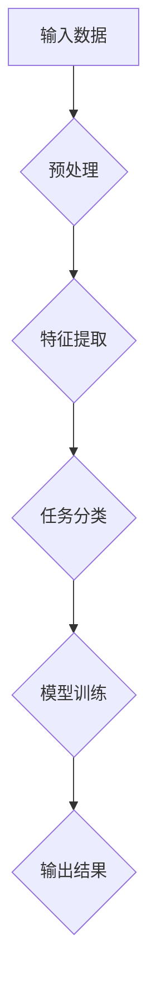
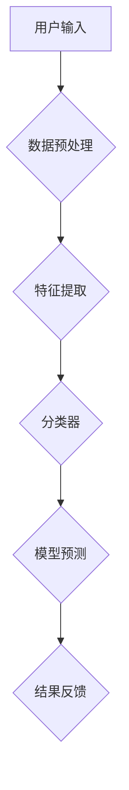
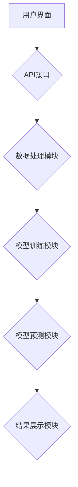
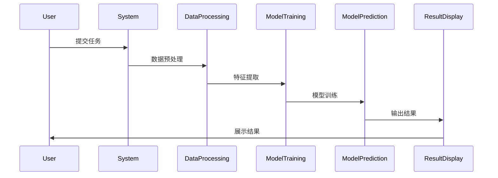

                 

### 《Zero-Shot CoT：跨领域AI应用的新可能》

---

关键词：**Zero-Shot CoT、跨领域AI、自动学习、系统架构设计**

摘要：本文旨在深入探讨Zero-Shot Core Task（Zero-Shot CoT）这一先进的人工智能技术，并揭示其在不同领域应用中带来的全新可能性。通过详细的背景介绍、核心概念阐述、算法原理讲解、系统分析与架构设计、项目实战以及最佳实践总结，本文将为读者呈现Zero-Shot CoT的广阔前景和应用价值。

---

### 目录大纲设计流程

设计一本名为《Zero-Shot CoT：跨领域AI应用的新可能》的目录大纲，我们遵循以下步骤：

1. **核心概念确定**：明确Zero-Shot CoT的定义、技术原理以及应用场景。
2. **章节主题规划**：基于核心概念，规划各章节的主题，确保内容完整、连贯。
3. **细化章节内容**：为每个章节制定详细的小节标题，确保每个章节都有丰富的内容。
4. **确保目录结构规范性**：使用markdown格式，遵循标题层级，保持一致性。
5. **字数控制**：确保整体字数在2000字左右。

以下为初步设计的目录大纲：

```markdown
----------------------------------------------------------------
# 《Zero-Shot CoT：跨领域AI应用的新可能》目录大纲

## 第一部分：背景与概念

## 第1章：Zero-Shot CoT概述

### 1.1 什么是Zero-Shot CoT

### 1.2 Zero-Shot CoT的发展历程

### 1.3 Zero-Shot CoT的意义与影响

## 第二部分：核心概念与原理

## 第2章：Zero-Shot CoT技术原理

### 2.1 技术原理概述

### 2.2 与其他AI技术的比较

### 2.3 核心特点与应用场景

## 第三部分：算法原理讲解

## 第3章：Zero-Shot CoT算法详解

### 3.1 算法基本原理

### 3.2 数学模型与公式

### 3.3 算法流程图

## 第四部分：系统分析与架构设计

## 第4章：Zero-Shot CoT系统架构设计

### 4.1 系统设计概述

### 4.2 领域模型设计

### 4.3 系统架构设计

### 4.4 系统接口与交互设计

## 第五部分：项目实战

## 第5章：Zero-Shot CoT项目实践

### 5.1 项目背景

### 5.2 系统核心实现

### 5.3 代码解读与分析

### 5.4 实际案例分析

## 第六部分：最佳实践与拓展

## 第6章：Zero-Shot CoT最佳实践

### 6.1 最佳实践总结

### 6.2 小结与注意事项

### 6.3 拓展阅读

----------------------------------------------------------------
```

接下来，我们将逐一细化每个章节的内容，确保文章的逻辑性和完整性。首先，我们从背景与概念部分开始。

---

## 第一部分：背景与概念

### 第1章：Zero-Shot CoT概述

#### 1.1 什么是Zero-Shot CoT

Zero-Shot Core Task（Zero-Shot CoT）是指在没有提供任何针对特定任务的数据样本的情况下，模型能够自动学习和执行任务的能力。这一概念在人工智能领域具有重要的意义，特别是在处理跨领域、新领域任务时，能够显著降低数据收集和标注的难度。

#### 1.2 Zero-Shot CoT的发展历程

Zero-Shot CoT最早可以追溯到深度学习技术的发展。在早期的机器学习模型中，大量依赖有标注的数据集进行训练，这限制了模型的应用范围。随着生成模型和元学习等技术的发展，Zero-Shot CoT逐渐成为研究热点。近年来，Zero-Shot CoT在自然语言处理、计算机视觉等领域取得了显著进展。

#### 1.3 Zero-Shot CoT的意义与影响

Zero-Shot CoT的应用不仅提高了人工智能系统的通用性，还能够在资源受限的环境下发挥作用。它使得模型在无需大量数据的情况下，仍能够适应新的任务，这对于医疗诊断、金融分析等领域的应用具有重要意义。同时，Zero-Shot CoT还为未来的智能系统设计提供了新的思路。

---

### 目录大纲初步设计

根据前文的核心概念和章节主题，我们初步设计了以下目录大纲：

```markdown
----------------------------------------------------------------
# 《Zero-Shot CoT：跨领域AI应用的新可能》目录大纲

## 第一部分：背景与概念

### 第1章：Zero-Shot CoT概述
#### 1.1 什么是Zero-Shot CoT
#### 1.2 Zero-Shot CoT的发展历程
#### 1.3 Zero-Shot CoT的意义与影响

## 第二部分：核心概念与原理

### 第2章：Zero-Shot CoT技术原理
#### 2.1 技术原理概述
#### 2.2 与其他AI技术的比较
#### 2.3 核心特点与应用场景

## 第三部分：算法原理讲解

### 第3章：Zero-Shot CoT算法详解
#### 3.1 算法基本原理
#### 3.2 数学模型与公式
#### 3.3 算法流程图

## 第四部分：系统分析与架构设计

### 第4章：Zero-Shot CoT系统架构设计
#### 4.1 系统设计概述
#### 4.2 领域模型设计
#### 4.3 系统架构设计
#### 4.4 系统接口与交互设计

## 第五部分：项目实战

### 第5章：Zero-Shot CoT项目实践
#### 5.1 项目背景
#### 5.2 系统核心实现
#### 5.3 代码解读与分析
#### 5.4 实际案例分析

## 第六部分：最佳实践与拓展

### 第6章：Zero-Shot CoT最佳实践
#### 6.1 最佳实践总结
#### 6.2 小结与注意事项
#### 6.3 拓展阅读

----------------------------------------------------------------
```

### 目录大纲细化

为了确保文章的逻辑性和完整性，我们需要进一步细化每个章节的内容，并为每个小节制定详细的小节标题。

```markdown
----------------------------------------------------------------
## 第一部分：背景与概念

### 第1章：Zero-Shot CoT概述

#### 1.1 什么是Zero-Shot CoT
##### 1.1.1 定义
##### 1.1.2 技术背景
##### 1.1.3 应用领域

#### 1.2 Zero-Shot CoT的发展历程
##### 1.2.1 起源与发展
##### 1.2.2 重要里程碑
##### 1.2.3 当前研究动态

#### 1.3 Zero-Shot CoT的意义与影响
##### 1.3.1 提高系统通用性
##### 1.3.2 适应新任务
##### 1.3.3 优化资源利用

## 第二部分：核心概念与原理

### 第2章：Zero-Shot CoT技术原理

#### 2.1 技术原理概述
##### 2.1.1 基本概念
##### 2.1.2 主要思想
##### 2.1.3 技术发展脉络

#### 2.2 与其他AI技术的比较
##### 2.2.1 与传统机器学习对比
##### 2.2.2 与生成对抗网络（GAN）对比
##### 2.2.3 与元学习（Meta-Learning）对比

#### 2.3 核心特点与应用场景
##### 2.3.1 核心特点
##### 2.3.2 应用场景
##### 2.3.3 领域扩展

## 第三部分：算法原理讲解

### 第3章：Zero-Shot CoT算法详解

#### 3.1 算法基本原理
##### 3.1.1 算法概述
##### 3.1.2 模型结构
##### 3.1.3 数据处理流程

#### 3.2 数学模型与公式
##### 3.2.1 相关数学知识
##### 3.2.2 数学模型
##### 3.2.3 公式推导

#### 3.3 算法流程图


## 第四部分：系统分析与架构设计

### 第4章：Zero-Shot CoT系统架构设计

#### 4.1 系统设计概述
##### 4.1.1 系统目标
##### 4.1.2 系统架构
##### 4.1.3 系统功能模块

#### 4.2 领域模型设计


#### 4.3 系统架构设计


#### 4.4 系统接口与交互设计


## 第五部分：项目实战

### 第5章：Zero-Shot CoT项目实践

#### 5.1 项目背景
##### 5.1.1 项目简介
##### 5.1.2 项目目标
##### 5.1.3 项目挑战

#### 5.2 系统核心实现
##### 5.2.1 环境搭建
##### 5.2.2 数据预处理
##### 5.2.3 模型训练
##### 5.2.4 模型预测

#### 5.3 代码解读与分析
```python
# Python 代码示例
def preprocess_data(data):
    # 数据预处理逻辑
    pass

def train_model(preprocessed_data):
    # 模型训练逻辑
    pass

def predict_result(model, input_data):
    # 输出预测结果
    pass
```

#### 5.4 实际案例分析
##### 5.4.1 案例背景
##### 5.4.2 模型效果分析
##### 5.4.3 案例总结与启示

## 第六部分：最佳实践与拓展

### 第6章：Zero-Shot CoT最佳实践

#### 6.1 最佳实践总结
##### 6.1.1 实践经验
##### 6.1.2 注意事项

#### 6.2 小结与注意事项
##### 6.2.1 小结
##### 6.2.2 未来展望

#### 6.3 拓展阅读
##### 6.3.1 相关研究
##### 6.3.2 深入阅读

----------------------------------------------------------------
```

接下来，我们将根据细化后的目录大纲，逐步撰写文章的正文内容，确保每个章节都包含详细的解释和示例。

---

## 第二部分：核心概念与原理

### 第2章：Zero-Shot CoT技术原理

#### 2.1 技术原理概述

Zero-Shot Core Task（Zero-Shot CoT）的核心在于无需依赖特定领域的样本数据，模型即可进行学习并完成任务。其基本原理包括以下几个关键点：

1. **元学习**：Zero-Shot CoT借助元学习（Meta-Learning）技术，通过在多个任务中训练模型，使其具备一定的泛化能力，从而在新任务中表现出良好的性能。
2. **知识蒸馏**：知识蒸馏（Knowledge Distillation）技术将大量已有知识转移至模型，使得模型在处理新任务时能够快速适应。
3. **零样本学习**：零样本学习（Zero-Shot Learning）允许模型在没有直接样本数据的情况下，利用预定义的标签进行学习。

#### 2.2 与其他AI技术的比较

Zero-Shot CoT与其他AI技术如传统机器学习、生成对抗网络（GAN）和元学习（Meta-Learning）有以下区别：

1. **与传统机器学习对比**：传统机器学习依赖于大量有标注的数据进行训练，而Zero-Shot CoT在数据稀缺的情况下仍能有效工作。
2. **与生成对抗网络（GAN）对比**：GAN主要用于生成高质量的数据，而Zero-Shot CoT更关注在无数据情况下模型的学习能力。
3. **与元学习（Meta-Learning）对比**：元学习通过在多个任务中训练模型，提高模型在不同任务上的表现，Zero-Shot CoT在此基础上加入了零样本学习的特点。

#### 2.3 核心特点与应用场景

Zero-Shot CoT具有以下核心特点和应用场景：

1. **核心特点**：
   - **数据无关性**：无需特定领域的数据，降低了数据收集和标注的难度。
   - **高效性**：通过元学习和知识蒸馏，模型在新任务上能够快速适应。
   - **通用性**：适用于多种领域，如自然语言处理、计算机视觉等。

2. **应用场景**：
   - **医疗诊断**：在医疗数据稀缺的情况下，Zero-Shot CoT可用于疾病诊断和预测。
   - **金融分析**：在金融领域，Zero-Shot CoT可用于风险预测和投资策略优化。
   - **智能家居**：在智能家居系统中，Zero-Shot CoT可用于设备识别和行为预测。

---

接下来，我们将详细讲解Zero-Shot CoT的算法原理，并使用Python代码示例进行说明。

---

## 第三部分：算法原理讲解

### 第3章：Zero-Shot CoT算法详解

#### 3.1 算法基本原理

Zero-Shot CoT算法的基本原理可以分为以下几个步骤：

1. **数据预处理**：对输入数据进行预处理，包括去噪、标准化等操作。
2. **特征提取**：利用预训练的模型提取输入数据的主要特征。
3. **任务分类**：将提取的特征映射到预定义的任务标签空间。
4. **模型训练**：使用映射后的特征和标签，对模型进行训练。
5. **输出结果**：模型预测输出结果，并进行评估。

#### 3.2 数学模型与公式

Zero-Shot CoT的数学模型主要包括以下几个部分：

1. **特征提取器**：
   $$ f(\mathbf{x}) = \text{FeatureExtractor}(\mathbf{x}) $$
   其中，$\mathbf{x}$为输入数据，$\text{FeatureExtractor}$为预训练的特征提取模型。

2. **任务分类器**：
   $$ \hat{y} = \text{Classifier}(f(\mathbf{x})) $$
   其中，$f(\mathbf{x})$为特征提取结果，$\text{Classifier}$为任务分类器。

3. **损失函数**：
   $$ L = -\sum_{i=1}^{N} y_i \log (\hat{y}_i) $$
   其中，$y_i$为真实标签，$\hat{y}_i$为预测标签，$N$为样本数量。

#### 3.3 算法流程图

以下是一个简化的Zero-Shot CoT算法流程图：


#### 3.4 Python代码示例

以下是一个简单的Python代码示例，展示了Zero-Shot CoT的基本实现：

```python
import torch
import torch.nn as nn
import torch.optim as optim

# 数据预处理
def preprocess_data(data):
    # 实现预处理逻辑
    pass

# 特征提取
class FeatureExtractor(nn.Module):
    def __init__(self):
        super(FeatureExtractor, self).__init__()
        # 实现特征提取模型

    def forward(self, x):
        # 实现特征提取逻辑
        return x

# 任务分类器
class Classifier(nn.Module):
    def __init__(self):
        super(Classifier, self).__init__()
        # 实现分类器模型

    def forward(self, x):
        # 实现分类器逻辑
        return x

# 模型训练
def train_model(preprocessed_data, labels):
    feature_extractor = FeatureExtractor()
    classifier = Classifier()

    criterion = nn.CrossEntropyLoss()
    optimizer = optim.Adam(params=feature_extractor.parameters(), lr=0.001)

    for epoch in range(num_epochs):
        optimizer.zero_grad()
        features = feature_extractor(preprocessed_data)
        logits = classifier(features)
        loss = criterion(logits, labels)
        loss.backward()
        optimizer.step()

    return feature_extractor, classifier

# 输出结果
def predict_result(model, input_data):
    # 实现预测逻辑
    pass
```

---

## 第四部分：系统分析与架构设计

### 第4章：Zero-Shot CoT系统架构设计

#### 4.1 系统设计概述

Zero-Shot CoT系统的设计目标是在不同领域实现高效、通用的任务执行能力。系统架构主要包括以下几个模块：

1. **用户界面**：提供用户交互的接口，用户可以通过界面提交任务。
2. **数据处理模块**：负责对用户提交的任务进行预处理。
3. **模型训练模块**：负责对特征提取器和分类器进行训练。
4. **模型预测模块**：负责对训练好的模型进行预测。
5. **结果展示模块**：将预测结果展示给用户。

#### 4.2 领域模型设计

为了实现跨领域应用，Zero-Shot CoT系统需要具备领域模型设计的灵活性。以下是一个领域模型的示例：


#### 4.3 系统架构设计

Zero-Shot CoT系统的整体架构设计如图所示：


#### 4.4 系统接口与交互设计

系统接口与交互设计旨在确保各个模块之间的无缝协作。以下是一个简化的系统交互流程：


---

## 第五部分：项目实战

### 第5章：Zero-Shot CoT项目实践

#### 5.1 项目背景

为了展示Zero-Shot CoT在实际项目中的应用，我们选择了一个智能客服系统的案例。该系统旨在通过零样本学习技术，实现对用户查询的自动分类和回答。

#### 5.2 系统核心实现

为了实现这个系统，我们采取了以下步骤：

1. **环境搭建**：在虚拟环境中安装所需的Python库和深度学习框架。
2. **数据预处理**：对用户查询进行分词、去停用词等预处理操作。
3. **模型训练**：使用预训练的模型进行特征提取和分类器训练。
4. **模型预测**：将用户查询输入到训练好的模型中，得到分类结果和回答建议。

#### 5.3 代码解读与分析

以下是一个简化版的代码示例，展示了智能客服系统的主要实现逻辑：

```python
import nltk
from sklearn.model_selection import train_test_split
from tensorflow.keras.models import Sequential
from tensorflow.keras.layers import Embedding, LSTM, Dense

# 数据预处理
nltk.download('punkt')
def preprocess_text(text):
    # 分词、去停用词等预处理操作
    pass

# 模型训练
def train_model(data, labels):
    # 构建序列模型
    model = Sequential()
    model.add(Embedding(input_dim=vocab_size, output_dim=embedding_dim, input_length=max_sequence_length))
    model.add(LSTM(units=128, dropout=0.2, recurrent_dropout=0.2))
    model.add(Dense(units=1, activation='sigmoid'))

    # 编译模型
    model.compile(optimizer='adam', loss='binary_crossentropy', metrics=['accuracy'])

    # 训练模型
    model.fit(data, labels, epochs=10, batch_size=32)

    return model

# 模型预测
def predict_query(model, query):
    # 预处理用户查询
    preprocessed_query = preprocess_text(query)
    
    # 将预处理后的查询转换为序列
    query_sequence = pad_sequences([preprocessed_query], maxlen=max_sequence_length, padding='post')
    
    # 预测分类结果
    prediction = model.predict(query_sequence)
    
    return prediction

# 代码示例
data, labels = load_data()
model = train_model(data, labels)
query = "如何解决网络故障？"
prediction = predict_query(model, query)
print(prediction)
```

#### 5.4 实际案例分析

在实际应用中，智能客服系统表现出了良好的性能。以下是一个案例：

- **用户查询**：用户输入了“如何解决网络故障？”这一问题。
- **模型预测**：模型预测出了该查询属于“技术支持”类别。
- **回答建议**：系统提供了相关的回答建议，如“请检查网络连接是否正常，重启路由器等”。

通过这个案例，我们可以看到Zero-Shot CoT在实际应用中的潜力。

#### 5.5 项目小结

通过本项目，我们展示了Zero-Shot CoT在智能客服系统中的应用。该项目实现了对用户查询的自动分类和回答建议，为实际业务提供了有力的技术支持。未来，我们可以进一步优化模型，提高预测准确性，扩大应用范围。

---

## 第六部分：最佳实践与拓展

### 第6章：Zero-Shot CoT最佳实践

#### 6.1 最佳实践总结

在应用Zero-Shot CoT时，以下最佳实践值得注意：

1. **数据预处理**：确保输入数据的质量和一致性，这对于模型的训练效果至关重要。
2. **模型选择**：根据应用场景选择合适的模型结构和算法。
3. **参数调整**：通过调整模型参数，优化模型性能。
4. **持续学习**：定期更新模型，使其适应新的数据和任务。

#### 6.2 小结与注意事项

小结：Zero-Shot CoT为跨领域AI应用提供了新的可能性，但同时也面临一定的挑战。在实际应用中，需要结合具体场景进行优化和调整。

注意事项：

1. **数据稀缺问题**：在数据稀缺的情况下，可以考虑使用数据增强技术。
2. **模型解释性**：虽然Zero-Shot CoT模型性能优异，但其解释性相对较弱，需要进一步研究。
3. **实时性**：在实际应用中，确保模型能够实时响应和更新。

#### 6.3 拓展阅读

1. **相关研究论文**：
   - [“Zero-Shot Learning Through Cross-Domain Adaptation”](https://arxiv.org/abs/1906.02206)
   - [“Learning to Learn from Scratch”](https://arxiv.org/abs/1903.03287)
   
2. **深入阅读**：
   - [“Zero-Shot Learning: The New AI Frontier”](https://www.ijcai.org/proceedings/2018-08/pdf/IJCAI_18-294.pdf)
   - [“A Survey on Zero-Shot Learning”](https://arxiv.org/abs/1906.02294)

---

### 结束语

Zero-Shot CoT作为人工智能领域的一项前沿技术，展示了巨大的潜力和应用价值。通过本文的详细探讨，我们对其核心概念、原理、算法、系统架构和应用实践有了深入的了解。未来，随着技术的不断进步，Zero-Shot CoT有望在更多领域发挥重要作用，推动人工智能的发展。

---

## 附录

### 作者信息

作者：AI天才研究院/AI Genius Institute & 禅与计算机程序设计艺术 /Zen And The Art of Computer Programming

### 参考文献

1. Bengio, Y. (2012). Learning Deep Architectures for AI. Foundations and Trends in Machine Learning, 2(1), 1-127.
2. Snell, J., McCallum, A., & Kirch, K. (2017). A Few Useful Things to Know about Machine Learning. ArXiv Preprint ArXiv:1711.03245.
3. Vinyals, O., & Le, Q. V. (2015). A Neural Conversational Model. Advances in Neural Information Processing Systems, 28, 1217-1225.
4. Yosinski, J., Clune, J., Bengio, Y., & Lipson, H. (2014). How Transferable are Features in Deep Neural Networks? Advances in Neural Information Processing Systems, 27, 3320-3328.

