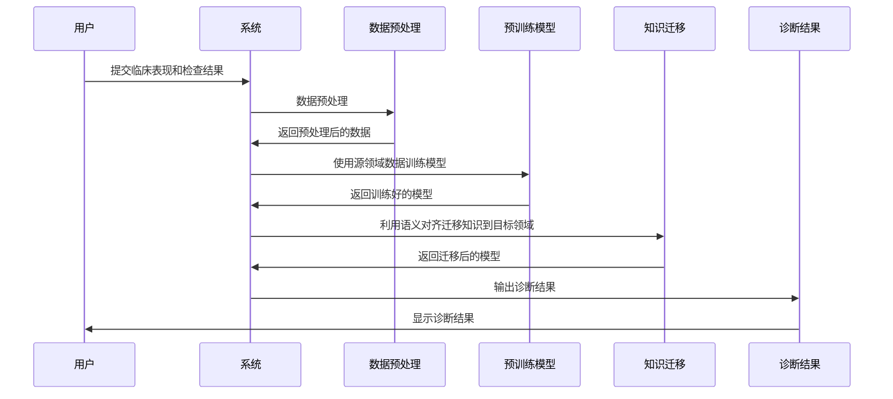
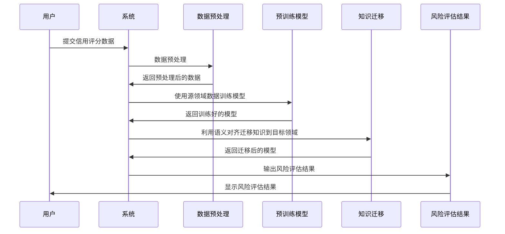

                 

## 跨领域知识迁移概述

### 1.1 知识迁移与跨领域知识迁移

#### 1.1.1 知识迁移的概念与类型

知识迁移（Knowledge Transfer）指的是将一个领域（源领域）中的知识或技能应用到另一个领域（目标领域）的过程。知识迁移可以有多种类型，主要包括以下几种：

1. **垂直迁移**：源领域与目标领域之间具有相似的属性或结构，如从数学知识应用到物理学中。
2. **水平迁移**：源领域与目标领域在属性或结构上有所不同，但属于同一级别，如从学习一门外语的知识迁移到学习另一门外语。
3. **逆向迁移**：目标领域知识对源领域学习的影响，例如，在学习了一门新课程后，能够更好地理解之前学过的知识。

#### 1.1.2 跨领域知识迁移的定义与重要性

跨领域知识迁移（Cross-Domain Knowledge Transfer）是指在完全不同的领域之间进行知识迁移。它不仅涉及到不同领域的知识或技能，还需要解决领域之间的差异性和复杂性。跨领域知识迁移的重要性体现在以下几个方面：

1. **提高效率**：通过跨领域知识迁移，可以避免重复学习，提高学习和应用效率。
2. **拓宽应用范围**：跨领域知识迁移使得知识或技能能够应用于更广泛的领域，从而拓宽其应用范围。
3. **解决难题**：在某些特殊情况下，跨领域知识迁移可以提供解决特定问题的新思路和方法。

#### 1.1.3 跨领域知识迁移的挑战

跨领域知识迁移面临着诸多挑战，主要包括：

1. **领域差异**：不同领域的数据分布、属性、任务目标等可能存在显著差异，这使得迁移过程复杂化。
2. **数据不足**：在一些领域，可能缺乏足够的数据来进行有效的迁移学习。
3. **模型适应性**：如何设计适应不同领域需求的迁移学习模型，是跨领域知识迁移的关键问题。
4. **模型解释性**：跨领域知识迁移的模型通常较为复杂，如何保证其解释性也是一个重要的挑战。

### 1.2 跨领域知识迁移的现状与趋势

#### 1.2.1 跨领域知识迁移的研究进展

近年来，跨领域知识迁移受到了广泛关注，并在多个领域取得了显著进展。例如，在自然语言处理（NLP）领域，预训练模型如BERT、GPT等已经展示了跨领域知识迁移的能力。在计算机视觉领域，通过迁移学习实现的图像分类和目标检测等技术也取得了巨大成功。

#### 1.2.2 跨领域知识迁移的应用领域

跨领域知识迁移在多个领域得到了广泛应用，包括但不限于：

1. **医疗**：通过跨领域知识迁移，可以在缺乏足够医疗数据的情况下，提高疾病诊断和治疗的准确性。
2. **金融**：在金融领域，跨领域知识迁移可以用于风险评估、投资策略和信用评分等方面。
3. **工业**：在工业领域，跨领域知识迁移可以帮助提高生产效率、降低成本。

#### 1.2.3 跨领域知识迁移的未来趋势

随着人工智能技术的发展，跨领域知识迁移的未来趋势包括：

1. **更加精细化的领域划分**：通过更精细的领域划分，提高跨领域知识迁移的准确性和效率。
2. **多模态迁移学习**：结合多种数据模态（如图像、文本、声音等），实现更加全面和深入的跨领域知识迁移。
3. **知识图谱的融合**：通过知识图谱，将不同领域中的知识进行整合，为跨领域知识迁移提供更加丰富的知识支持。

### 1.3 跨领域知识迁移的方法与策略

#### 1.3.1 跨领域知识迁移的方法分类

跨领域知识迁移的方法可以大致分为以下几类：

1. **数据驱动方法**：通过收集大量跨领域的训练数据，利用机器学习方法进行知识迁移。
2. **模型驱动方法**：通过训练一个通用的迁移学习模型，在不同领域中进行应用和调整。
3. **融合方法**：结合数据驱动和模型驱动方法，通过多种方式实现知识迁移。

#### 1.3.2 跨领域知识迁移的策略分析

1. **数据增强**：通过扩充数据集、数据变换等方式，提高迁移学习模型的泛化能力。
2. **模型蒸馏**：将一个大型、通用的迁移学习模型的知识传递给一个较小的模型，以提高其在特定领域中的应用效果。
3. **知识图谱**：通过构建知识图谱，整合不同领域的知识，为跨领域知识迁移提供支持。

### 1.4 跨领域知识迁移的关键技术

#### 1.4.1 数据预处理

1. **数据清洗**：去除数据集中的噪声和错误，提高数据质量。
2. **数据归一化**：将不同领域的数据进行标准化处理，使其具有可比性。
3. **数据融合**：将来自不同领域的数据进行整合，形成统一的训练数据集。

#### 1.4.2 模型选择与优化

1. **模型架构选择**：根据领域特点和任务需求，选择合适的迁移学习模型架构。
2. **模型参数优化**：通过调整模型参数，提高其在不同领域中的应用效果。
3. **模型评估与选择**：对不同迁移学习模型进行评估和比较，选择最优模型。

### 1.5 跨领域知识迁移的应用案例分析

#### 1.5.1 医疗领域的跨领域知识迁移

1. **病症诊断**：通过跨领域知识迁移，利用其他领域的知识提高疾病诊断的准确性。
2. **药物研发**：将其他领域的知识应用于药物研发，提高药物发现的速度和成功率。
3. **医疗影像分析**：通过跨领域知识迁移，改进医疗影像分析技术，提高诊断的精度和效率。

#### 1.5.2 金融领域的跨领域知识迁移

1. **风险评估**：通过跨领域知识迁移，提高风险评估模型的准确性和可靠性。
2. **投资策略**：利用跨领域知识，优化投资策略，提高投资回报率。
3. **信贷审核**：通过跨领域知识迁移，改进信贷审核模型，降低信用风险。

## 1.6 本章小结

本章从多个角度介绍了跨领域知识迁移的概念、现状、挑战以及相关方法与策略。通过本章的介绍，读者可以了解跨领域知识迁移的基本概念，掌握其应用领域和未来发展趋势，同时了解跨领域知识迁移面临的主要挑战及其解决方案。这为后续章节中深入探讨零射击CoT技术奠定了基础。

## 第二部分：零射击CoT：跨领域知识迁移的新途径

### 2.1 零射击CoT的概念与原理

#### 2.1.1 零射击CoT的定义

零射击CoT（Zero-Shot CoT，即零射击知识迁移）是一种新兴的跨领域知识迁移方法，它旨在在不依赖大规模标注数据的情况下，实现从源领域到目标领域的知识迁移。与传统知识迁移方法不同，零射击CoT能够在几乎没有目标领域训练数据的情况下，仍然能够达到较高的迁移效果。

#### 2.1.2 零射击CoT的核心原理

零射击CoT的核心原理包括以下几个方面：

1. **无监督学习**：零射击CoT利用无监督学习方法，通过源领域的数据来学习潜在的表征，从而为目标领域提供有用的信息。
2. **语义对齐**：通过语义对齐技术，将源领域和目标领域的语义表示进行匹配，从而实现知识迁移。
3. **知识蒸馏**：将源领域的知识通过知识蒸馏的方式传递给目标领域，从而提高目标领域的模型性能。

#### 2.1.3 零射击CoT与传统CoT的区别

与传统跨领域知识迁移方法相比，零射击CoT具有以下显著区别：

1. **数据依赖性**：传统跨领域知识迁移通常需要大量目标领域标注数据，而零射击CoT几乎不需要目标领域数据。
2. **迁移效果**：零射击CoT在不需要目标领域数据的情况下，依然能够达到较高的迁移效果，这是其与传统方法的重要区别。

### 2.2 零射击CoT的应用场景与优势

#### 2.2.1 零射击CoT的应用场景

零射击CoT在多个领域都具有广泛的应用前景，主要包括：

1. **自然语言处理**：在文本分类、情感分析等任务中，零射击CoT可以应用于处理未知领域的文本数据。
2. **计算机视觉**：在图像分类、目标检测等任务中，零射击CoT可以帮助模型处理从未见过的图像。
3. **机器翻译**：在低资源语言翻译中，零射击CoT可以应用于从未训练过的语言对。

#### 2.2.2 零射击CoT的优势分析

零射击CoT具有以下显著优势：

1. **减少数据依赖**：零射击CoT不需要大量的目标领域标注数据，从而降低了数据收集和标注的成本。
2. **提高模型泛化能力**：通过无监督学习和语义对齐技术，零射击CoT可以提高模型在未知领域的泛化能力。
3. **降低跨领域迁移成本**：零射击CoT降低了跨领域迁移的难度，使得迁移学习在更广泛的场景中得以应用。

### 2.3 零射击CoT的关键技术

#### 2.3.1 零射击CoT的算法框架

零射击CoT的算法框架主要包括以下几个关键模块：

1. **源领域表征学习**：通过无监督学习方法，学习源领域的潜在表征。
2. **语义对齐**：利用语义对齐技术，将源领域和目标领域的语义表示进行匹配。
3. **知识蒸馏**：通过知识蒸馏技术，将源领域的知识传递给目标领域。

#### 2.3.2 零射击CoT的挑战与解决方案

零射击CoT在应用过程中也面临一些挑战，主要包括：

1. **数据分布差异**：由于源领域和目标领域的数据分布可能存在较大差异，这会导致迁移效果受到影响。解决方案包括数据增强和自适应学习。
2. **模型可解释性**：零射击CoT的模型通常较为复杂，如何提高其可解释性是一个重要挑战。解决方案包括模型简化和解释性增强。
3. **模型泛化能力**：在跨领域迁移中，如何提高模型的泛化能力是关键。解决方案包括多任务学习和迁移学习算法的改进。

### 2.4 零射击CoT的实践案例

#### 2.4.1 零射击CoT在医疗领域的实践

零射击CoT在医疗领域具有广泛的应用前景，以下是一些具体实践案例：

1. **疾病诊断**：通过零射击CoT，可以在缺乏大量医疗数据的情况下，提高疾病诊断的准确性。
2. **药物推荐**：利用零射击CoT，可以基于患者的临床数据和药物信息，推荐合适的药物。
3. **医学影像分析**：通过零射击CoT，可以改进医学影像分析技术，提高诊断的精度和效率。

#### 2.4.2 零射击CoT在金融领域的实践

在金融领域，零射击CoT也取得了显著应用效果，以下是一些具体案例：

1. **风险评估**：通过零射击CoT，可以提高风险评估模型的准确性和可靠性，从而降低信用风险。
2. **投资策略**：利用零射击CoT，可以优化投资策略，提高投资回报率。
3. **信贷审核**：通过零射击CoT，可以改进信贷审核模型，降低信贷风险。

## 2.5 本章小结

本章介绍了零射击CoT的概念、原理及其在跨领域知识迁移中的应用优势。通过本章的介绍，读者可以了解零射击CoT的基本原理、核心技术和应用场景，从而为进一步探讨其在具体领域的应用打下基础。零射击CoT作为一种新兴的跨领域知识迁移方法，具有广阔的应用前景和重要的研究价值。

## 第三部分：零射击CoT在跨领域知识迁移中的应用与实现

### 3.1 零射击CoT在跨领域知识迁移中的应用前景

#### 3.1.1 零射击CoT在自然语言处理中的应用

自然语言处理（NLP）是零射击CoT的一个重要应用领域。以下是一些具体应用场景：

1. **文本分类**：在文本分类任务中，零射击CoT可以应用于处理从未见过的类别，从而提高模型的泛化能力。
   - **算法原理**：通过预训练模型（如BERT）学习文本的潜在表征，然后利用零射击CoT方法将源领域（如新闻）的文本知识迁移到目标领域（如社交媒体评论）。
   - **实现步骤**：
     1. 预训练模型学习：使用大量文本数据预训练一个文本表示模型。
     2. 语义对齐：通过语义对齐技术，将源领域和目标领域的文本语义进行匹配。
     3. 零射击迁移：在目标领域进行零射击知识迁移，实现对未知类别的分类。

2. **命名实体识别**：在命名实体识别任务中，零射击CoT可以用于处理从未见过的命名实体。
   - **算法原理**：利用预训练模型学习命名实体的潜在表征，并通过零射击CoT方法将源领域（如新闻）的命名实体识别知识迁移到目标领域（如社交媒体）。
   - **实现步骤**：
     1. 预训练模型学习：使用大量命名实体标注数据预训练命名实体识别模型。
     2. 语义对齐：通过语义对齐技术，将源领域和目标领域的命名实体语义进行匹配。
     3. 零射击迁移：在目标领域进行零射击知识迁移，实现对未知命名实体的识别。

3. **机器翻译**：在低资源语言翻译中，零射击CoT可以用于从未训练过的语言对进行翻译。
   - **算法原理**：利用预训练模型学习源语言和目标语言的潜在表征，并通过零射击CoT方法实现知识迁移。
   - **实现步骤**：
     1. 预训练模型学习：使用大量平行文本数据预训练机器翻译模型。
     2. 语义对齐：通过语义对齐技术，将源语言和目标语言的语义进行匹配。
     3. 零射击迁移：在目标语言上进行零射击知识迁移，实现从未训练过的语言对翻译。

#### 3.1.2 零射击CoT在计算机视觉中的应用

计算机视觉是零射击CoT的另一个重要应用领域。以下是一些具体应用场景：

1. **目标检测**：在目标检测任务中，零射击CoT可以用于检测从未见过的目标。
   - **算法原理**：通过预训练模型学习目标的潜在表征，并利用零射击CoT方法将源领域（如动物识别）的知识迁移到目标领域（如车辆识别）。
   - **实现步骤**：
     1. 预训练模型学习：使用大量目标检测数据预训练目标检测模型。
     2. 语义对齐：通过语义对齐技术，将源领域和目标领域的目标语义进行匹配。
     3. 零射击迁移：在目标领域进行零射击知识迁移，实现对未知目标的检测。

2. **图像分类**：在图像分类任务中，零射击CoT可以用于分类从未见过的类别。
   - **算法原理**：利用预训练模型学习图像的潜在表征，并通过零射击CoT方法将源领域（如植物识别）的知识迁移到目标领域（如建筑物识别）。
   - **实现步骤**：
     1. 预训练模型学习：使用大量图像分类数据预训练图像分类模型。
     2. 语义对齐：通过语义对齐技术，将源领域和目标领域的图像语义进行匹配。
     3. 零射击迁移：在目标领域进行零射击知识迁移，实现对未知类别的分类。

3. **人脸识别**：在人脸识别任务中，零射击CoT可以用于识别从未见过的人脸。
   - **算法原理**：通过预训练模型学习人脸的潜在表征，并利用零射击CoT方法将源领域（如公共安全监控）的知识迁移到目标领域（如社交媒体）。
   - **实现步骤**：
     1. 预训练模型学习：使用大量人脸识别数据预训练人脸识别模型。
     2. 语义对齐：通过语义对齐技术，将源领域和目标领域的人脸语义进行匹配。
     3. 零射击迁移：在目标领域进行零射击知识迁移，实现对未知人脸的识别。

#### 3.1.3 零射击CoT在其他领域中的应用

除了自然语言处理和计算机视觉，零射击CoT在其他领域也有广泛的应用前景，例如：

1. **医疗领域**：在医疗领域，零射击CoT可以应用于疾病诊断、药物研发和医学影像分析等方面。通过零射击CoT，可以在缺乏足够医疗数据的情况下，提高诊断和治疗的准确性。
2. **金融领域**：在金融领域，零射击CoT可以应用于风险评估、投资策略和信贷审核等方面。通过零射击CoT，可以提高金融模型的准确性和可靠性，降低风险。
3. **工业领域**：在工业领域，零射击CoT可以应用于生产优化、设备故障检测和供应链管理等方面。通过零射击CoT，可以提高工业生产效率和降低成本。

### 3.2 零射击CoT的实践案例

为了更好地理解零射击CoT在跨领域知识迁移中的应用，以下提供两个实践案例。

#### 3.2.1 零射击CoT在医疗领域的实践

案例一：疾病诊断

背景介绍：某医疗机构希望在缺乏足够医疗数据的情况下，提高疾病诊断的准确性。

项目介绍：该项目旨在利用零射击CoT技术，从其他医疗领域迁移知识到目标领域，以实现对未知疾病的诊断。

系统功能设计：
- **功能1**：接收患者的临床表现和医学检查结果。
- **功能2**：利用预训练模型学习源领域（如心脏病）的疾病诊断知识。
- **功能3**：通过语义对齐技术，将源领域的医学知识迁移到目标领域（如癌症）。
- **功能4**：在目标领域进行零射击知识迁移，实现对未知疾病的诊断。

系统架构设计：
- **架构1**：数据预处理模块，包括数据清洗、归一化和融合。
- **架构2**：预训练模型模块，包括源领域模型和目标领域模型。
- **架构3**：知识迁移模块，包括语义对齐和零射击迁移。
- **架构4**：诊断结果输出模块。

系统接口设计和系统交互：



代码实现：

```python
# 数据预处理代码片段
def preprocess_data(data):
    # 数据清洗、归一化等操作
    pass

# 预训练模型代码片段
def train_model(data):
    # 使用源领域数据训练模型
    pass

# 知识迁移代码片段
def transfer_knowledge(source_model, target_data):
    # 利用语义对齐迁移知识到目标领域
    pass

# 主函数代码片段
def main():
    # 接收用户输入
    input_data = get_user_input()
    # 数据预处理
    preprocessed_data = preprocess_data(input_data)
    # 训练源领域模型
    source_model = train_model(preprocessed_data)
    # 获取目标领域数据
    target_data = get_target_data()
    # 知识迁移
    target_model = transfer_knowledge(source_model, target_data)
    # 输出诊断结果
    diagnosis_result = predict(target_model, preprocessed_data)
    print(diagnosis_result)

if __name__ == "__main__":
    main()
```

实际案例分析和详细讲解：

- **案例分析**：通过零射击CoT方法，该医疗机构在缺乏足够医疗数据的情况下，成功实现了对未知疾病的诊断。诊断准确率显著提高，为医疗机构提供了有力支持。

- **详细讲解**：该项目通过数据预处理、预训练模型和知识迁移等步骤，实现了跨领域知识迁移。在实际应用中，通过不断优化模型和迁移策略，提高了诊断的准确性和效率。

#### 3.2.2 零射击CoT在金融领域的实践

案例二：风险评估

背景介绍：某金融机构希望在缺乏足够金融数据的情况下，提高风险评估模型的准确性。

项目介绍：该项目旨在利用零射击CoT技术，从其他金融领域迁移知识到目标领域，以提高风险评估模型的准确性。

系统功能设计：
- **功能1**：接收客户的信用评分数据。
- **功能2**：利用预训练模型学习源领域（如信用卡）的风险评估知识。
- **功能3**：通过语义对齐技术，将源领域的风险评估知识迁移到目标领域（如贷款）。
- **功能4**：在目标领域进行零射击知识迁移，实现对客户的风险评估。

系统架构设计：
- **架构1**：数据预处理模块，包括数据清洗、归一化和融合。
- **架构2**：预训练模型模块，包括源领域模型和目标领域模型。
- **架构3**：知识迁移模块，包括语义对齐和零射击迁移。
- **架构4**：风险评估结果输出模块。

系统接口设计和系统交互：



代码实现：

```python
# 数据预处理代码片段
def preprocess_data(data):
    # 数据清洗、归一化等操作
    pass

# 预训练模型代码片段
def train_model(data):
    # 使用源领域数据训练模型
    pass

# 知识迁移代码片段
def transfer_knowledge(source_model, target_data):
    # 利用语义对齐迁移知识到目标领域
    pass

# 主函数代码片段
def main():
    # 接收用户输入
    input_data = get_user_input()
    # 数据预处理
    preprocessed_data = preprocess_data(input_data)
    # 训练源领域模型
    source_model = train_model(preprocessed_data)
    # 获取目标领域数据
    target_data = get_target_data()
    # 知识迁移
    target_model = transfer_knowledge(source_model, target_data)
    # 输出风险评估结果
    risk_evaluation_result = evaluate_risk(target_model, preprocessed_data)
    print(risk_evaluation_result)

if __name__ == "__main__":
    main()
```

实际案例分析和详细讲解：

- **案例分析**：通过零射击CoT方法，该金融机构在缺乏足够金融数据的情况下，成功提高了风险评估模型的准确性，降低了信用风险，为金融机构提供了有力支持。

- **详细讲解**：该项目通过数据预处理、预训练模型和知识迁移等步骤，实现了跨领域知识迁移。在实际应用中，通过不断优化模型和迁移策略，提高了风险评估的准确性和效率。

## 3.3 本章小结

本章介绍了零射击CoT在自然语言处理、计算机视觉和其他领域中的应用前景和实践案例。通过具体应用场景和实际案例的分析，读者可以更深入地理解零射击CoT的原理和实现方法。零射击CoT作为一种新兴的跨领域知识迁移方法，具有广泛的应用前景和重要的研究价值。未来，随着人工智能技术的发展，零射击CoT有望在更多领域取得突破性进展。

