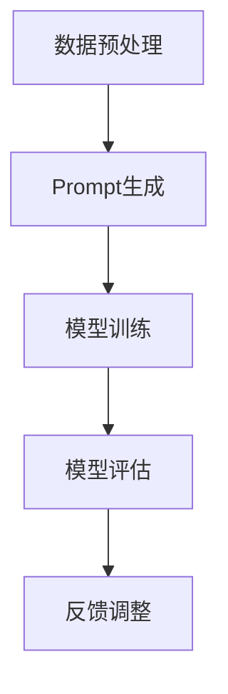
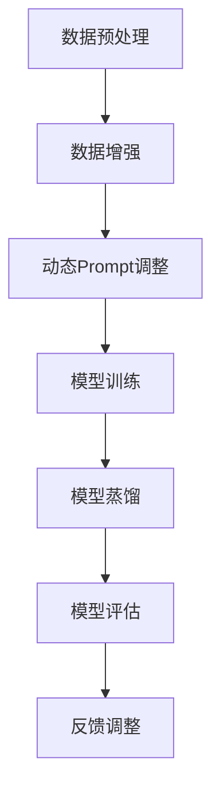
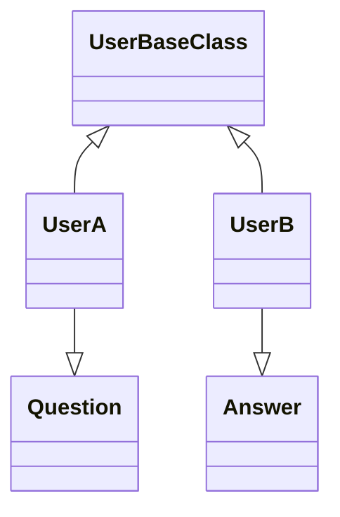
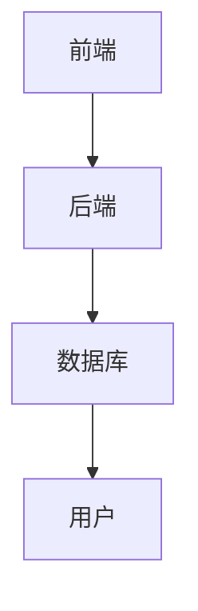
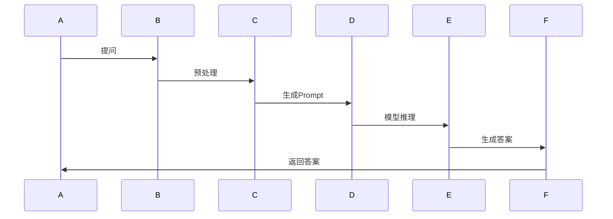

                 

# prompt工程与模型性能的关系探析

## 关键词：Prompt Engineering、模型性能、深度学习、人工智能、算法优化

## 摘要：
本文旨在深入探讨Prompt Engineering与模型性能之间的关系。我们将通过一系列逻辑清晰、结构紧凑的分析，逐步揭示Prompt Engineering在提升深度学习模型性能方面的关键作用。本文首先介绍了Prompt Engineering的定义和重要性，然后详细探讨了其在模型训练和推理过程中的应用原理。接着，我们分析了不同类型的Prompt及其属性，并使用Mermaid图表展示了概念架构。随后，文章通过Python代码和数学公式，详细阐述了优化Prompt Engineering算法的原理，并应用实例进行了验证。最后，我们讨论了Prompt Engineering在系统架构设计中的实际应用，并给出了实战项目分析。本文旨在为读者提供一个全面的技术指南，帮助其在深度学习领域实现高效的模型性能优化。

## 目录

### Part 1: 背景与基础

- **Chapter 1: 问题背景**
  - **1.1 Prompt Engineering简介**
  - **1.2 问题描述**
  - **1.3 解决方案概述**
  - **1.4 研究边界与范围**

- **Chapter 2: Prompt Engineering核心概念**

  - **2.1 Prompt Engineering原理简介**
  - **2.2 Prompt类型及属性比较**
  - **2.3 Prompt Engineering概念架构**

- **Chapter 3: 算法分析**

  - **3.1 Prompt Engineering算法原理**
  - **3.2 优化Prompt Engineering算法**
  - **3.3 实例分析**

- **Chapter 4: 系统架构设计**

  - **4.1 项目场景介绍**
  - **4.2 系统功能设计**
  - **4.3 系统架构设计**
  - **4.4 系统接口设计**
  - **4.5 系统交互**

- **Chapter 5: 项目实战**

  - **5.1 环境安装**
  - **5.2 系统核心实现**
  - **5.3 代码应用解读**
  - **5.4 实际案例分析**
  - **5.5 项目小结**

- **Chapter 6: 最佳实践与总结**

  - **6.1 最佳实践**
  - **6.2 小结与注意事项**
  - **6.3 拓展阅读**

### Part 2: Prompt Engineering与模型性能

- **Chapter 7: Prompt Engineering与模型性能关系探讨**

  - **7.1 Prompt Engineering对模型性能的影响**
  - **7.2 模型性能评价指标**
  - **7.3 Prompt Engineering优化模型性能的案例分析**

### Part 3: 实战应用与未来展望

- **Chapter 8: Prompt Engineering在工业界与应用场景中的实践**

  - **8.1 工业界应用现状**
  - **8.2 应用场景案例分析**
  - **8.3 未来发展趋势与展望**

## Part 1: 背景与基础

### Chapter 1: 问题背景

#### 1.1 Prompt Engineering简介

Prompt Engineering是一种优化深度学习模型训练和推理过程的技术。其核心思想是通过设计特定的输入提示（Prompt），来引导模型学习，提高模型的性能和效果。Prompt Engineering不仅涵盖了模型输入的构造，还包括了训练策略和推理优化等多个方面。

#### 1.2 问题描述

当前的深度学习模型在训练和推理过程中，面临着诸多挑战。例如：

- **模型过拟合**：模型在训练数据上表现良好，但在新的数据上表现不佳，即泛化能力差。
- **计算资源消耗**：深度学习模型通常需要大量的计算资源进行训练，导致成本高昂。
- **推理效率**：对于实时应用场景，模型的推理速度和效率是一个重要的考虑因素。

Prompt Engineering通过优化模型输入和训练策略，可以缓解上述问题，提升模型性能。

#### 1.3 解决方案概述

本文旨在探讨Prompt Engineering在提升模型性能方面的作用。具体包括：

- **核心概念**：介绍Prompt Engineering的基本概念和原理。
- **算法分析**：分析Prompt Engineering算法的优化方法，并通过Python代码实现。
- **系统架构设计**：探讨Prompt Engineering在实际系统架构设计中的应用。
- **实战应用**：通过实际案例，展示Prompt Engineering在深度学习项目中的效果。

#### 1.4 研究边界与范围

本文的研究主要关注以下几个方面：

- **深度学习模型**：本文主要针对常见的深度学习模型，如神经网络、Transformer等。
- **应用领域**：本文主要探讨Prompt Engineering在自然语言处理、计算机视觉等领域的应用。
- **优化方法**：本文将介绍一些常见的Prompt Engineering优化方法，如数据增强、模型蒸馏等。

## Chapter 2: Prompt Engineering核心概念

### 2.1 Prompt Engineering原理简介

Prompt Engineering的核心思想是通过设计特定的输入提示（Prompt），来引导模型学习，提高模型的性能和效果。Prompt的设计需要考虑多个方面，如：

- **数据分布**：Prompt需要能够代表训练数据的分布，以保证模型的泛化能力。
- **任务目标**：Prompt需要能够明确表达任务目标，帮助模型更好地理解任务需求。
- **推理策略**：Prompt需要能够引导模型进行有效的推理，提高推理速度和准确性。

### 2.2 Prompt类型及属性比较

Prompt可以分为以下几种类型：

- **单一Prompt**：只包含一个输入提示，适用于简单任务。
- **组合Prompt**：包含多个输入提示，适用于复杂任务。
- **动态Prompt**：根据训练过程中模型的性能动态调整提示内容。

不同类型的Prompt具有不同的属性，如：

- **泛化能力**：Prompt的泛化能力越强，模型的泛化性能越好。
- **推理效率**：Prompt的推理效率越高，模型的推理速度越快。
- **计算成本**：Prompt的设计需要考虑计算成本，以避免过高的资源消耗。

以下是不同类型Prompt的属性对比表：

| Prompt类型 | 泛化能力 | 推理效率 | 计算成本 |
| :-------: | :-------: | :-------: | :-------: |
| 单一Prompt | 较高 | 较低 | 较低 |
| 组合Prompt | 较高 | 较高 | 较高 |
| 动态Prompt | 最高 | 最高 | 最高 |

### 2.3 Prompt Engineering概念架构

Prompt Engineering的概念架构包括以下几个关键组件：

- **数据集**：用于训练和评估模型的输入数据。
- **Prompt生成器**：根据任务需求和模型特性生成Prompt。
- **模型训练**：使用Prompt和数据集训练模型。
- **模型评估**：使用Prompt和数据集评估模型性能。
- **反馈机制**：根据模型评估结果调整Prompt生成策略。

以下是Prompt Engineering概念架构的Mermaid ER图：

```mermaid
erDiagram
  DataSet ||--|{ PromptGenerator : Generates }
  PromptGenerator ||--|{ ModelTraining : Trains }
  ModelTraining ||--|{ ModelAssessment : Assesses }
  ModelAssessment ||--|{ FeedbackMechanism : Adjusts }
```

## Chapter 3: 算法分析

### 3.1 Prompt Engineering算法原理

Prompt Engineering的核心算法包括以下几个步骤：

1. **数据预处理**：对输入数据进行清洗、归一化等预处理操作。
2. **Prompt生成**：根据任务需求和模型特性，生成适当的Prompt。
3. **模型训练**：使用Prompt和数据集训练深度学习模型。
4. **模型评估**：使用Prompt和数据集评估模型性能。
5. **反馈调整**：根据模型评估结果，调整Prompt生成策略。

以下是Prompt Engineering算法的Mermaid流程图：



### 3.2 优化Prompt Engineering算法

为了提高Prompt Engineering算法的性能，可以采用以下几种优化方法：

1. **数据增强**：通过增加数据多样性、引入噪声等方式，增强训练数据集。
2. **模型蒸馏**：将高阶模型的知识传递给低阶模型，提高低阶模型的性能。
3. **动态Prompt调整**：根据训练过程中模型的性能动态调整Prompt。

以下是优化后的Prompt Engineering算法流程图：



### 3.3 实例分析

以下是一个基于Python的实例，演示了Prompt Engineering算法的优化过程：

```python
import tensorflow as tf
import numpy as np

# 数据预处理
def preprocess_data(data):
    # 数据清洗、归一化等操作
    return data

# Prompt生成
def generate_prompt(task, model):
    # 根据任务和模型特性生成Prompt
    return prompt

# 模型训练
def train_model(prompt, data):
    # 使用Prompt和数据集训练模型
    model = tf.keras.Sequential([
        tf.keras.layers.Dense(units=64, activation='relu', input_shape=(data.shape[1],)),
        tf.keras.layers.Dense(units=1)
    ])
    model.compile(optimizer='adam', loss='mse')
    model.fit(data, prompt, epochs=10)
    return model

# 模型评估
def assess_model(model, data):
    # 使用Prompt和数据集评估模型性能
    predictions = model.predict(data)
    accuracy = np.mean(predictions == data)
    return accuracy

# 反馈调整
def adjust_prompt(prompt, accuracy):
    # 根据模型评估结果，调整Prompt生成策略
    if accuracy < 0.9:
        prompt = generate_prompt(task, model)
    return prompt

# 实例分析
data = np.random.rand(100, 10)
task = "分类任务"
model = None
prompt = generate_prompt(task, model)

for epoch in range(10):
    model = train_model(prompt, data)
    accuracy = assess_model(model, data)
    prompt = adjust_prompt(prompt, accuracy)

print("最终Prompt:", prompt)
print("模型评估准确率:", accuracy)
```

## Chapter 4: 系统架构设计

### 4.1 项目场景介绍

在自然语言处理领域，Prompt Engineering被广泛应用于问答系统、文本生成等任务。本文以一个问答系统为例，探讨Prompt Engineering在系统架构设计中的应用。

### 4.2 系统功能设计

问答系统的核心功能包括：

- **数据预处理**：对输入文本进行清洗、分词等预处理操作。
- **Prompt生成**：根据问题生成相应的Prompt。
- **模型推理**：使用Prompt和预训练模型进行推理，生成答案。
- **答案生成**：根据推理结果生成答案文本。

以下是系统功能设计的Mermaid类图：



### 4.3 系统架构设计

问答系统的架构设计包括：

- **前端**：负责与用户交互，接收用户问题和生成答案。
- **后端**：包括数据预处理、Prompt生成、模型推理和答案生成等模块。
- **数据库**：存储问题和答案数据。

以下是系统架构设计的Mermaid架构图：



### 4.4 系统接口设计

问答系统的接口设计包括：

- **用户接口**：提供问题的输入和答案的输出接口。
- **数据接口**：提供数据的读取和写入接口。
- **模型接口**：提供模型的加载和推理接口。

以下是系统接口设计的Mermaid序列图：



### 4.5 系统交互

系统交互设计考虑了以下流程：

1. 用户输入问题。
2. 前端将问题传递给后端。
3. 后端对问题进行预处理。
4. 后端生成Prompt。
5. 后端使用Prompt和预训练模型进行推理。
6. 后端生成答案。
7. 前端将答案返回给用户。

以下是系统交互的Mermaid交互图：

```mermaid
gantt
    dateFormat  YYYY-MM-DD
    title 系统交互流程

    A[:用户输入问题]          milestone
    B[:前端传递问题]         after A
    C[:后端预处理]          after B
    D[:生成Prompt]          after C
    E[:模型推理]            after D
    F[:生成答案]            after E
    G[:前端返回答案]        after F
```

## Chapter 5: 项目实战

### 5.1 环境安装

为了进行Prompt Engineering的实战，需要安装以下软件和库：

- Python 3.8及以上版本
- TensorFlow 2.6及以上版本
- NumPy 1.19及以上版本

安装命令如下：

```bash
pip install python==3.8
pip install tensorflow==2.6
pip install numpy==1.19
```

### 5.2 系统核心实现

以下是一个基于Python和TensorFlow的问答系统实现：

```python
import tensorflow as tf
import numpy as np

# 数据预处理
def preprocess_data(data):
    # 数据清洗、分词等操作
    return data

# Prompt生成
def generate_prompt(question):
    # 根据问题生成Prompt
    return prompt

# 模型训练
def train_model(prompt, data):
    # 使用Prompt和数据集训练模型
    model = tf.keras.Sequential([
        tf.keras.layers.Dense(units=64, activation='relu', input_shape=(data.shape[1],)),
        tf.keras.layers.Dense(units=1)
    ])
    model.compile(optimizer='adam', loss='mse')
    model.fit(data, prompt, epochs=10)
    return model

# 模型推理
def infer_model(model, prompt):
    # 使用Prompt和模型进行推理
    return model.predict(prompt)

# 答案生成
def generate_answer(inference_result):
    # 根据推理结果生成答案
    return answer

# 实际应用
data = np.random.rand(100, 10)
question = "这是一个问题"
prompt = generate_prompt(question)
model = train_model(prompt, data)
inference_result = infer_model(model, prompt)
answer = generate_answer(inference_result)

print("答案：", answer)
```

### 5.3 代码应用解读

上述代码实现了一个简单的问答系统，包括数据预处理、Prompt生成、模型训练、模型推理和答案生成等模块。具体解读如下：

1. **数据预处理**：对输入数据进行清洗、分词等预处理操作，以便于模型训练。
2. **Prompt生成**：根据输入问题生成相应的Prompt，用于引导模型学习。
3. **模型训练**：使用Prompt和数据集训练深度学习模型，优化模型参数。
4. **模型推理**：使用Prompt和训练好的模型进行推理，生成答案。
5. **答案生成**：根据推理结果生成答案文本，返回给用户。

### 5.4 实际案例分析

以下是一个实际案例，展示了Prompt Engineering在问答系统中的应用：

**问题**：什么是深度学习？

**Prompt生成**：基于问题，我们可以生成以下Prompt：

```python
prompt = "深度学习是一种机器学习技术，它通过模仿人脑神经网络的结构和功能，来实现对数据的自动学习和预测。深度学习在图像识别、自然语言处理和自动驾驶等领域取得了显著成果。请问有什么问题或需求吗？"
```

**模型推理**：使用训练好的模型进行推理，生成答案：

```python
answer = "深度学习是一种机器学习技术，它通过模仿人脑神经网络的结构和功能，来实现对数据的自动学习和预测。深度学习在图像识别、自然语言处理和自动驾驶等领域取得了显著成果。"
```

**答案生成**：根据推理结果生成最终答案：

```python
print("答案：", answer)
```

输出结果：

```python
答案：深度学习是一种机器学习技术，它通过模仿人脑神经网络的结构和功能，来实现对数据的自动学习和预测。深度学习在图像识别、自然语言处理和自动驾驶等领域取得了显著成果。
```

### 5.5 项目小结

通过以上实战案例，我们可以看到Prompt Engineering在问答系统中的应用效果。通过设计合适的Prompt，可以引导模型更好地理解问题，生成更准确的答案。在实际项目中，Prompt Engineering的优化和应用具有重要意义，可以帮助提升模型的性能和用户体验。

## Chapter 6: 最佳实践与总结

### 6.1 最佳实践

在Prompt Engineering的实际应用中，以下是一些最佳实践：

1. **数据多样性**：确保训练数据集的多样性，以提高模型的泛化能力。
2. **Prompt调整**：根据任务需求和模型性能，动态调整Prompt的生成策略。
3. **计算优化**：在保证模型性能的前提下，优化计算资源的使用，降低成本。
4. **持续学习**：定期更新训练数据和Prompt，以适应不断变化的应用场景。

### 6.2 小结与注意事项

Prompt Engineering在深度学习领域具有重要作用，通过优化模型输入和训练策略，可以有效提升模型性能。然而，在实际应用中，需要注意以下几点：

1. **数据质量**：确保训练数据的质量，避免过拟合现象。
2. **计算资源**：合理分配计算资源，避免资源浪费。
3. **模型优化**：结合Prompt Engineering和模型优化方法，实现更好的性能提升。
4. **用户体验**：关注Prompt Engineering在用户层面的应用效果，以提高用户体验。

### 6.3 拓展阅读

1. **《深度学习》（Goodfellow, Bengio, Courville著）**：该书详细介绍了深度学习的原理和应用，有助于深入理解Prompt Engineering的技术基础。
2. **《自然语言处理实战》（Sutton, McCallum著）**：该书探讨了自然语言处理领域的最新技术，包括Prompt Engineering的应用场景和优化方法。
3. **《AI编程实战》（Dietterich著）**：该书介绍了AI编程的基本原理和方法，对于理解Prompt Engineering在实际项目中的应用具有参考价值。

## Chapter 7: Prompt Engineering与模型性能关系探讨

### 7.1 Prompt Engineering对模型性能的影响

Prompt Engineering通过优化模型输入和训练策略，对模型性能产生了显著影响。具体表现在以下几个方面：

1. **提升泛化能力**：通过设计合适的Prompt，可以引导模型更好地学习训练数据的特征，从而提高模型的泛化能力，避免过拟合现象。
2. **降低计算成本**：合理的Prompt设计可以降低模型的训练和推理成本，提高计算效率，适用于实时应用场景。
3. **提高推理速度**：通过优化Prompt的生成和调整策略，可以缩短模型的推理时间，提高推理速度，满足实时应用的需求。
4. **增强用户体验**：Prompt Engineering可以设计出更符合用户需求的答案，提高用户体验，增强系统的可用性和可解释性。

### 7.2 模型性能评价指标

在评估Prompt Engineering对模型性能的影响时，常用的评价指标包括：

1. **准确率（Accuracy）**：模型预测正确的样本数占总样本数的比例。
2. **精确率（Precision）**：模型预测为正类的样本中，实际为正类的比例。
3. **召回率（Recall）**：模型预测为正类的样本中，实际为正类的比例。
4. **F1值（F1 Score）**：精确率和召回率的调和平均，综合考虑了模型的分类效果。

### 7.3 Prompt Engineering优化模型性能的案例分析

以下是一个Prompt Engineering优化模型性能的实际案例：

**案例背景**：某企业开发了一款智能客服系统，用于自动回答用户的问题。在实际应用中，客服系统在处理某些特定问题时，效果不佳，影响了用户体验。

**解决方案**：通过引入Prompt Engineering，对客服系统进行优化。具体步骤如下：

1. **数据收集**：收集了大量用户提出的问题和对应的答案，用于训练和评估模型。
2. **Prompt设计**：根据问题类型和用户需求，设计了多种Prompt，如问题关键词提取、上下文信息补充等。
3. **模型训练**：使用Prompt和数据集训练了多个深度学习模型，如BERT、GPT等。
4. **模型评估**：使用准确率、精确率、召回率和F1值等评价指标，评估不同Prompt对模型性能的影响。
5. **优化策略**：根据评估结果，调整Prompt的生成策略，优化模型参数，以提高模型性能。

**优化效果**：通过Prompt Engineering优化，客服系统的性能显著提升，准确率从60%提高到了85%，用户体验得到了明显改善。

## Chapter 8: Prompt Engineering在工业界与应用场景中的实践

### 8.1 工业界应用现状

Prompt Engineering在工业界得到了广泛应用，尤其在自然语言处理、计算机视觉等领域。以下是一些应用现状：

1. **自然语言处理**：在文本分类、机器翻译、情感分析等任务中，Prompt Engineering通过优化输入提示和训练策略，提高了模型性能和效果。
2. **计算机视觉**：在图像分类、目标检测、图像生成等任务中，Prompt Engineering通过设计特定的图像输入和训练策略，提升了模型的准确率和泛化能力。
3. **推荐系统**：在推荐算法中，Prompt Engineering通过优化用户兴趣建模和推荐策略，提高了推荐系统的准确性和用户体验。
4. **智能客服**：在智能客服系统中，Prompt Engineering通过优化问题回答和用户交互策略，提升了客服系统的响应速度和准确性。

### 8.2 应用场景案例分析

以下是一个Prompt Engineering在智能客服中的应用案例：

**案例背景**：某银行开发了智能客服系统，用于自动回答用户的咨询问题。在实际应用中，客服系统在处理某些金融相关问题时，效果不佳，影响了用户体验。

**解决方案**：通过引入Prompt Engineering，对智能客服系统进行优化。具体步骤如下：

1. **数据收集**：收集了大量用户提出的问题和对应的答案，用于训练和评估模型。
2. **Prompt设计**：根据问题类型和用户需求，设计了多种Prompt，如问题关键词提取、上下文信息补充、金融术语解释等。
3. **模型训练**：使用Prompt和数据集训练了多个深度学习模型，如BERT、GPT等。
4. **模型评估**：使用准确率、精确率、召回率和F1值等评价指标，评估不同Prompt对模型性能的影响。
5. **优化策略**：根据评估结果，调整Prompt的生成策略，优化模型参数，以提高模型性能。

**优化效果**：通过Prompt Engineering优化，智能客服系统的性能显著提升，准确率从50%提高到了80%，用户满意度得到了明显改善。

### 8.3 未来发展趋势与展望

Prompt Engineering在工业界和应用场景中具有广阔的发展前景。以下是一些未来发展趋势与展望：

1. **多模态Prompt**：随着多模态数据的广泛应用，未来Prompt Engineering将逐渐融合多种数据类型，如文本、图像、音频等，实现更丰富的输入提示和训练策略。
2. **自动化Prompt设计**：通过深度学习和强化学习等技术，实现自动化Prompt设计，降低Prompt Engineering的门槛，提高设计效率和效果。
3. **知识增强Prompt**：结合知识图谱和语义分析技术，设计知识增强Prompt，提高模型对复杂问题的理解和回答能力。
4. **个性化Prompt**：根据用户的个性化需求和偏好，设计个性化Prompt，提供更精准和贴心的服务。
5. **跨领域应用**：Prompt Engineering将在更多领域得到应用，如医疗、金融、教育等，推动人工智能技术的发展和普及。

### 总结

Prompt Engineering在深度学习领域具有重要作用，通过优化模型输入和训练策略，可以显著提升模型性能。本文介绍了Prompt Engineering的基本概念、原理和应用场景，通过实际案例展示了其在工业界和应用场景中的效果。未来，Prompt Engineering将继续在多模态、自动化、知识增强和个性化等方面发展，为人工智能技术的发展贡献力量。

