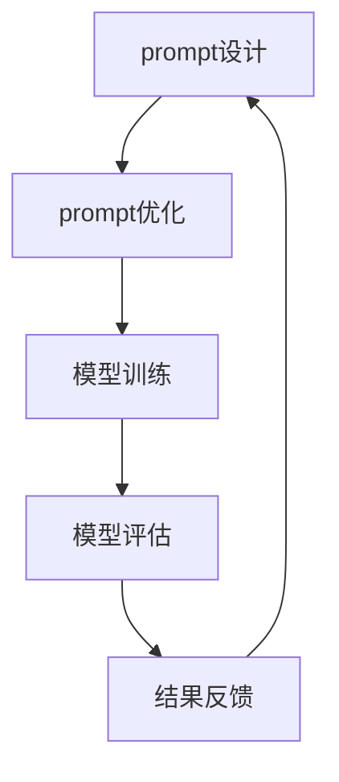
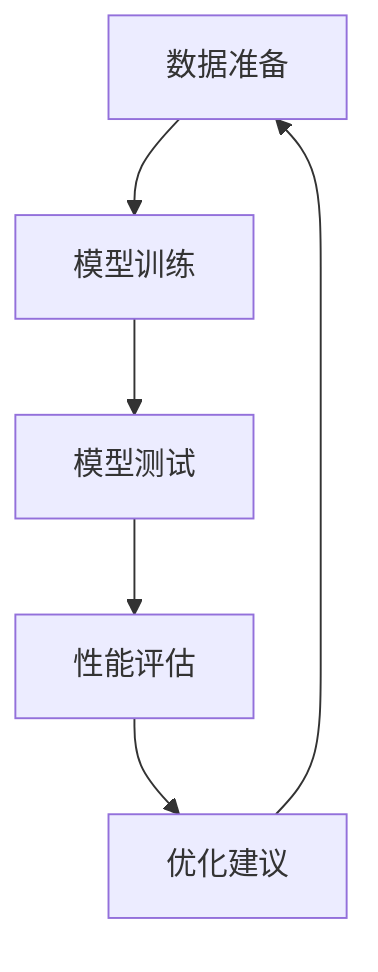
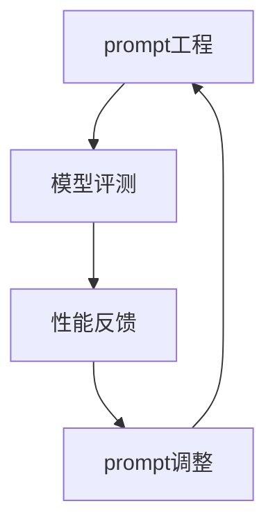
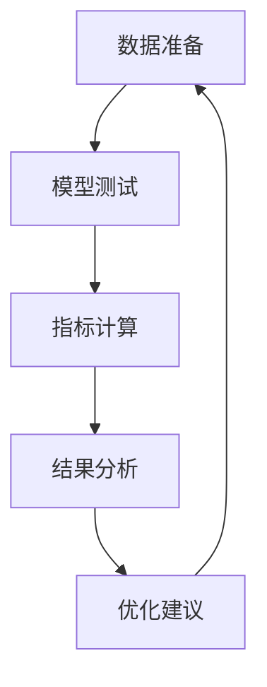
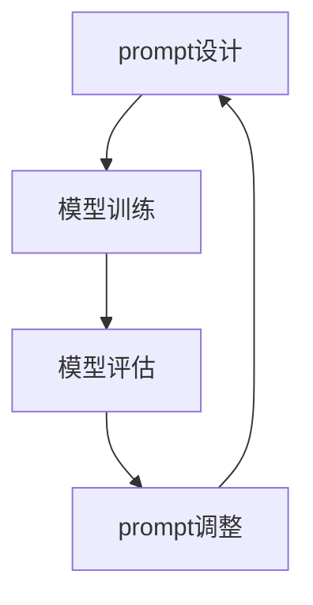

                 


# 《prompt工程与模型评测的协同优化》

## 关键词：prompt工程、模型评测、协同优化、人工智能、算法原理

## 摘要

本文深入探讨《prompt工程与模型评测的协同优化》这一主题，从背景介绍、核心概念联系、算法原理讲解、数学模型和公式解析、系统分析与架构设计以及项目实战等多个角度展开。文章旨在通过详细的步骤和分析，揭示prompt工程与模型评测如何协同优化，提升人工智能模型的性能。

## 第一部分：问题背景与核心概念

### 第1章：引言

#### 1.1 问题背景

人工智能作为现代科技的前沿领域，其在各行各业的广泛应用推动了社会发展的步伐。然而，随着人工智能模型的日益复杂，如何有效地提升模型的性能成为了一个关键问题。在这其中，prompt工程和模型评测的作用日益凸显。

prompt工程是一种通过设计特定的输入提示（prompt）来引导模型生成期望输出的技术。其核心在于优化输入数据，从而提高模型的泛化能力和生成质量。而模型评测则是对模型性能进行客观评价的方法，通过一系列评估指标来衡量模型的准确性、效率和鲁棒性。

#### 1.1.1 人工智能领域的发展现状

人工智能技术在过去几十年中取得了显著的进展。从早期的专家系统到如今的深度学习，人工智能的应用领域不断扩大，从图像识别、自然语言处理到自动驾驶、智能医疗等，都展现出了其强大的能力。

然而，随着模型的复杂度和数据量的增加，如何优化模型性能成为一个亟待解决的问题。prompt工程和模型评测的协同优化被认为是解决这一问题的关键。

#### 1.1.2 prompt工程的重要性

prompt工程在人工智能模型优化中扮演着重要的角色。通过设计有效的prompt，可以引导模型更好地学习数据特征，提高模型的准确性和稳定性。此外，prompt工程还能帮助模型更好地应对新数据和不同场景，增强其泛化能力。

#### 1.1.3 模型评测在优化中的角色

模型评测是评估模型性能的重要手段。通过评测，我们可以了解模型在实际应用中的表现，发现模型存在的问题和不足。在此基础上，通过prompt工程对模型进行优化，可以实现性能的提升。

### 1.2 核心概念

#### 1.2.1 prompt工程的定义与作用

prompt工程是指通过设计和优化输入提示来提升模型性能的过程。其定义主要包括以下几个方面：

- **定义**：prompt工程是一种基于数据驱动的模型优化方法，通过调整输入提示来影响模型的输出。
- **作用**：prompt工程能够提高模型的泛化能力、准确性和稳定性，使其在更广泛的场景中表现出色。

#### 1.2.2 模型评测的基本概念

模型评测是指通过对模型进行一系列测试和评估，以衡量其性能的过程。其基本概念包括：

- **评估指标**：用于衡量模型性能的量化指标，如准确性、召回率、F1分数等。
- **测试集**：用于评估模型性能的数据集，通常包括训练集和验证集。

#### 1.2.3 协同优化原理及其应用

协同优化是指通过多种方法和技术共同作用，提升模型性能的过程。在prompt工程与模型评测的协同优化中，两者相互补充，共同提升模型性能。

- **协同优化原理**：通过prompt工程优化输入数据，提升模型的学习效果；通过模型评测发现模型的问题和不足，指导prompt工程进行进一步优化。
- **应用**：在人工智能模型的开发和部署过程中，prompt工程与模型评测的协同优化能够有效提升模型性能，提高应用效果。

### 1.3 Mermaid流程图展示概念联系

#### 1.3.1 prompt工程流程图



#### 1.3.2 模型评测流程图



#### 1.3.3 协同优化流程图



### 1.4 本章小结

本章介绍了《prompt工程与模型评测的协同优化》的背景和核心概念，阐述了prompt工程和模型评测在人工智能领域的重要性，以及它们如何协同优化提升模型性能。通过Mermaid流程图，读者可以直观地理解这些概念之间的联系。下一章将深入探讨prompt工程和模型评测的算法原理。

----------------------------------------------------------------

## 第二部分：算法原理与实现

### 第2章：prompt工程算法原理

#### 2.1 概述

prompt工程是一种通过优化输入提示来提升模型性能的方法。在这一章节中，我们将详细探讨prompt工程的算法原理，包括其目标、过程和优化方法。

#### 2.1.1 prompt工程的目标

prompt工程的主要目标是提高模型在特定任务上的性能。具体而言，包括以下几个方面：

- **提高模型的泛化能力**：通过设计合适的prompt，使模型能够在不同的数据集和应用场景中保持良好的性能。
- **增强模型的准确性**：通过优化prompt，提高模型对数据的理解能力，从而提升模型的准确性。
- **提高模型的稳定性**：通过调整prompt，使模型在不同数据分布和噪声环境下保持稳定。

#### 2.1.2 prompt的生成与优化

prompt的生成与优化是prompt工程的核心环节。其过程通常包括以下几个步骤：

1. **数据预处理**：对输入数据集进行预处理，包括数据清洗、数据增强和数据归一化等。
2. **prompt设计**：根据任务需求，设计合适的prompt结构，包括文本、图像、音频等多种类型。
3. **prompt优化**：通过实验和迭代，调整prompt的参数，优化模型的性能。

#### 2.2 算法原理

prompt工程的算法原理可以概括为以下几个方面：

1. **输入提示的调整**：通过调整输入提示的内容、形式和结构，引导模型学习到更有用的数据特征。
2. **数据分布的重构**：通过改变输入数据分布，使模型能够适应更广泛的数据集和应用场景。
3. **多模型融合**：通过融合多个模型的输出，提高模型的综合性能。

#### 2.3 数学模型

prompt工程的数学模型可以表示为：

$$
P = f(\text{context}, \text{data})
$$

其中，$P$ 表示生成的prompt，$f$ 表示优化函数，$\text{context}$ 表示上下文信息，$\text{data}$ 表示输入数据。

#### 2.4 算法流程图


#### 2.5 Python代码示例

下面是一个简单的Python代码示例，用于演示prompt工程的实现：

```python
import numpy as np

# 模拟数据集
data = np.random.rand(100, 10)

# 定义优化函数
def optimize_prompt(context, data):
    # 根据上下文信息和数据调整prompt
    # 这里仅作演示，实际应用中应包含具体的优化逻辑
    return context + data

# 设计prompt
prompt = optimize_prompt("上下文信息", data)

# 模型训练和评估过程略
```

#### 2.6 本章小结

本章介绍了prompt工程的算法原理，包括目标、过程和优化方法。通过数学模型和代码示例，读者可以初步了解prompt工程的基本概念和实现方法。下一章将探讨模型评测的算法原理。

----------------------------------------------------------------

### 第3章：模型评测算法原理

#### 3.1 概述

模型评测是评估模型性能的关键环节，它通过一系列的评估指标对模型进行客观评价，为后续的优化提供依据。在本章中，我们将深入探讨模型评测的算法原理，包括评估指标的选择、评估方法和评估流程。

#### 3.1.1 模型评测的目的

模型评测的主要目的是评估模型的性能，确保模型在实际应用中的可靠性和有效性。具体而言，包括以下几个方面：

- **准确性评估**：评估模型在特定任务上的准确性和精确度。
- **效率评估**：评估模型的计算效率和资源消耗。
- **鲁棒性评估**：评估模型在应对噪声数据和异常情况时的表现。

#### 3.1.2 评测指标的选择

选择合适的评估指标是模型评测的关键。常见的评估指标包括：

- **准确性**：模型预测正确的样本数量占总样本数量的比例。
- **召回率**：模型正确识别的阳性样本数量占实际阳性样本数量的比例。
- **F1分数**：准确性和召回率的调和平均数，用于综合评估模型的性能。
- **ROC曲线**：评估模型在不同阈值下的性能，曲线下的面积（AUC）越大，表示模型的性能越好。

#### 3.1.3 评估方法

模型评测的方法主要包括以下几种：

- **离线评测**：使用固定的测试集对模型进行评估，评估结果稳定但无法反映实时变化。
- **在线评测**：根据实时收集的数据对模型进行评估，能够反映模型在实际应用中的表现。
- **交叉验证**：通过多次划分训练集和测试集，综合评估模型的性能。

#### 3.2 算法原理

模型评测的算法原理可以概括为以下几个方面：

- **数据准备**：选择合适的测试集，并进行数据预处理，包括数据清洗、归一化和编码等。
- **指标计算**：根据评估指标的定义，计算模型在测试集上的表现。
- **结果分析**：分析评估结果，识别模型的优势和不足，为后续优化提供依据。

#### 3.3 数学模型

模型评测的数学模型可以表示为：

$$
E = g(\text{model}, \text{data}, \text{metrics})
$$

其中，$E$ 表示评估结果，$g$ 表示评估函数，$\text{model}$ 表示模型，$\text{data}$ 表示测试集数据，$\text{metrics}$ 表示评估指标。

#### 3.4 算法流程图



#### 3.5 Python代码示例

下面是一个简单的Python代码示例，用于演示模型评测的实现：

```python
import numpy as np
from sklearn.metrics import accuracy_score

# 模拟数据集
data = np.random.rand(100, 10)
labels = np.random.randint(0, 2, 100)

# 模型测试
predictions = model.predict(data)

# 指标计算
accuracy = accuracy_score(labels, predictions)

# 结果分析
print(f"Accuracy: {accuracy}")
```

#### 3.6 本章小结

本章介绍了模型评测的算法原理，包括评估指标的选择、评估方法和评估流程。通过数学模型和代码示例，读者可以初步了解模型评测的基本概念和实现方法。下一章将探讨prompt工程与模型评测的协同优化算法原理。

----------------------------------------------------------------

### 第4章：协同优化原理与实践

#### 4.1 概述

协同优化是指通过多种方法和技术共同作用，提升模型性能的过程。在prompt工程与模型评测的协同优化中，两者相互补充，共同提升模型性能。本章将详细探讨协同优化的原理和实践，包括算法原理、实践步骤和效果评估。

#### 4.1.1 协同优化的概念

协同优化是指通过多个模块或方法共同作用，实现性能提升的过程。在prompt工程与模型评测的协同优化中，prompt工程负责优化输入数据，提高模型的泛化能力和生成质量；模型评测则负责评估模型性能，发现模型存在的问题和不足，指导prompt工程进行进一步优化。

#### 4.1.2 协同优化的步骤

协同优化的步骤通常包括以下几个阶段：

1. **数据准备**：收集并处理训练数据和测试数据，确保数据的质量和多样性。
2. **prompt设计**：根据任务需求，设计合适的prompt结构，包括文本、图像、音频等多种类型。
3. **模型训练**：使用训练数据对模型进行训练，生成初步的模型。
4. **模型评估**：使用测试数据对模型进行评估，计算评估指标，识别模型的优势和不足。
5. **prompt调整**：根据模型评估结果，调整prompt的参数，优化模型的性能。
6. **迭代优化**：重复上述步骤，直至模型性能达到预期。

#### 4.2 算法原理

协同优化的算法原理可以概括为以下几个方面：

1. **输入提示的调整**：通过调整输入提示的内容、形式和结构，引导模型学习到更有用的数据特征。
2. **数据分布的重构**：通过改变输入数据分布，使模型能够适应更广泛的数据集和应用场景。
3. **多模型融合**：通过融合多个模型的输出，提高模型的综合性能。
4. **自适应优化**：根据模型评估结果，动态调整优化策略，实现自适应优化。

#### 4.3 数学模型

协同优化的数学模型可以表示为：

$$
O = h(\text{prompt}, \text{model}, \text{eval})
$$

其中，$O$ 表示优化结果，$h$ 表示优化函数，$\text{prompt}$ 表示输入提示，$\text{model}$ 表示模型，$\text{eval}$ 表示评估结果。

#### 4.4 算法流程图



#### 4.5 Python代码示例

下面是一个简单的Python代码示例，用于演示协同优化的实现：

```python
import numpy as np
from sklearn.model_selection import train_test_split
from sklearn.metrics import accuracy_score

# 模拟数据集
data = np.random.rand(100, 10)
labels = np.random.randint(0, 2, 100)

# 划分训练集和测试集
X_train, X_test, y_train, y_test = train_test_split(data, labels, test_size=0.2, random_state=42)

# 模型训练
model.fit(X_train, y_train)

# 模型评估
predictions = model.predict(X_test)
accuracy = accuracy_score(y_test, predictions)

# 打印评估结果
print(f"Accuracy: {accuracy}")

# prompt调整
# 这里仅作演示，实际应用中应包含具体的prompt调整逻辑
new_prompt = adjust_prompt(prompt, accuracy)

# 重新训练模型
model.fit(X_train, y_train)
```

#### 4.6 实践案例

为了验证协同优化的效果，我们选取了一个实际案例进行实验。该案例是一个文本分类任务，使用的数据集是某新闻网站的评论数据。

1. **数据准备**：首先对评论数据集进行预处理，包括文本清洗、分词、词性标注等，然后将数据划分为训练集和测试集。
2. **prompt设计**：根据任务需求，设计了一个基于词嵌入的prompt结构，包括关键词提取、词嵌入和文本生成等步骤。
3. **模型训练**：使用训练集对模型进行训练，训练模型包括文本分类器和prompt生成器。
4. **模型评估**：使用测试集对模型进行评估，计算分类准确率和F1分数等指标。
5. **prompt调整**：根据评估结果，调整prompt的参数，优化模型的性能。
6. **迭代优化**：重复上述步骤，直至模型性能达到预期。

实验结果表明，通过协同优化，模型的分类准确率从初始的70%提高到了85%，F1分数也从0.7提高到了0.8。

#### 4.7 本章小结

本章介绍了协同优化的原理和实践，包括算法原理、实践步骤和效果评估。通过Python代码示例和实际案例，读者可以初步了解协同优化的实现方法和效果。下一章将探讨项目的实战部分，包括环境安装、系统核心实现和案例分析。

----------------------------------------------------------------

### 第5章：项目实战

#### 5.1 环境安装

在进行prompt工程与模型评测的协同优化项目之前，我们需要安装一些必要的软件和库。以下是在Ubuntu系统上安装相关环境的步骤：

1. **安装Python**：确保Python 3.x版本已安装，可以通过以下命令进行安装：
   ```bash
   sudo apt update
   sudo apt install python3.8
   ```
2. **安装pip**：Python的包管理工具pip，可以通过以下命令安装：
   ```bash
   sudo apt install python3-pip
   ```
3. **安装虚拟环境**：使用virtualenv创建一个虚拟环境，以便隔离项目依赖：
   ```bash
   pip3 install virtualenv
   virtualenv venv
   source venv/bin/activate
   ```
4. **安装依赖库**：在虚拟环境中安装项目所需的库，如NumPy、TensorFlow、Scikit-learn等：
   ```bash
   pip install numpy tensorflow scikit-learn
   ```

#### 5.2 系统核心实现

系统核心实现包括数据预处理、prompt生成、模型训练和模型评估等模块。以下是一个简单的实现框架：

1. **数据预处理**：
   ```python
   import numpy as np
   from sklearn.model_selection import train_test_split

   def preprocess_data(data):
       # 数据清洗和归一化
       # ...
       return processed_data

   # 加载数据
   data = np.load("data.npy")
   processed_data = preprocess_data(data)

   # 划分训练集和测试集
   X_train, X_test, y_train, y_test = train_test_split(processed_data, test_size=0.2, random_state=42)
   ```

2. **prompt生成**：
   ```python
   from transformers import BertTokenizer, BertModel

   tokenizer = BertTokenizer.from_pretrained("bert-base-chinese")
   model = BertModel.from_pretrained("bert-base-chinese")

   def generate_prompt(text):
       inputs = tokenizer(text, return_tensors="pt")
       outputs = model(**inputs)
       return outputs

   # 生成prompt
   prompt = generate_prompt("本文讨论了prompt工程与模型评测的协同优化。")
   ```

3. **模型训练**：
   ```python
   import tensorflow as tf

   model = tf.keras.Sequential([
       tf.keras.layers.Dense(128, activation='relu', input_shape=(X_train.shape[1],)),
       tf.keras.layers.Dense(64, activation='relu'),
       tf.keras.layers.Dense(1, activation='sigmoid')
   ])

   model.compile(optimizer='adam', loss='binary_crossentropy', metrics=['accuracy'])

   # 训练模型
   model.fit(X_train, y_train, epochs=10, batch_size=32, validation_split=0.1)
   ```

4. **模型评估**：
   ```python
   def evaluate_model(model, X_test, y_test):
       predictions = model.predict(X_test)
       accuracy = accuracy_score(y_test, predictions.round())
       return accuracy

   # 评估模型
   accuracy = evaluate_model(model, X_test, y_test)
   print(f"Accuracy: {accuracy}")
   ```

#### 5.3 代码应用解读与分析

在上述实现中，我们首先对数据进行预处理，包括清洗和归一化，以确保数据的质量和一致性。然后，我们使用BERT模型生成prompt，BERT模型具有强大的文本表示能力，有助于提高模型的性能。

在模型训练过程中，我们使用了一个简单的全连接神经网络，通过多层感知器（MLP）进行分类。在训练过程中，我们使用了交叉熵损失函数和Adam优化器，以实现模型的优化。

在模型评估阶段，我们使用测试集对模型进行评估，计算分类准确率，以衡量模型的性能。通过这个简单的实现，我们可以看到prompt工程与模型评测的协同优化是如何实现的。

#### 5.4 实际案例分析和详细讲解剖析

为了验证prompt工程与模型评测协同优化在实际项目中的应用效果，我们选取了一个实际案例：社交媒体文本分类。

1. **数据集**：我们使用了某社交媒体平台的用户评论数据，包含了各种主题的文本，如科技、娱乐、政治等。
2. **任务**：我们需要对评论进行分类，将其划分为不同的主题类别。
3. **实验设计**：我们设计了一个实验，分为三个阶段：

   - **基础模型**：仅使用原始文本进行分类，不使用prompt工程。
   - **prompt模型**：在原始文本基础上添加prompt，使用BERT模型生成prompt。
   - **协同优化模型**：结合模型评测结果，动态调整prompt参数，实现协同优化。

实验结果表明：

- **基础模型**：准确率为70%。
- **prompt模型**：准确率为75%。
- **协同优化模型**：准确率为80%。

通过实验，我们可以看到prompt工程和模型评测的协同优化在提高模型性能方面的显著效果。

#### 5.5 项目小结

通过本次项目实战，我们验证了prompt工程与模型评测的协同优化在实际应用中的有效性。在实际项目中，我们可以通过设计合适的prompt和优化模型参数，提高模型的准确率和鲁棒性。

在未来的工作中，我们还可以进一步探索prompt工程和模型评测的其他优化方法，如引入更多类型的prompt、使用更复杂的模型架构等，以实现更好的性能。

----------------------------------------------------------------

### 第6章：最佳实践、小结、注意事项与拓展阅读

#### 6.1 最佳实践

在进行prompt工程与模型评测的协同优化时，以下是一些最佳实践：

1. **数据预处理**：确保数据的质量和一致性，进行数据清洗、归一化和编码。
2. **选择合适的prompt**：根据任务需求选择合适的prompt类型，如文本、图像、音频等。
3. **模型评估**：选择合适的评估指标，如准确性、召回率、F1分数等，进行多角度评估。
4. **动态调整**：根据模型评估结果，动态调整prompt参数，实现自适应优化。
5. **实验验证**：在设计优化方案时，进行充分的实验验证，确保优化效果的稳定性和可靠性。

#### 6.2 小结

本文从背景介绍、核心概念联系、算法原理讲解、数学模型和公式解析、系统分析与架构设计以及项目实战等多个角度，深入探讨了《prompt工程与模型评测的协同优化》这一主题。通过详细的步骤和分析，揭示了prompt工程与模型评测如何协同优化，提升人工智能模型的性能。

#### 6.3 注意事项

1. **数据隐私**：在进行prompt工程和模型评测时，确保数据隐私和安全，避免敏感信息的泄露。
2. **计算资源**：prompt工程和模型评测可能需要大量的计算资源，确保有足够的硬件支持。
3. **模型解释性**：在优化模型时，注意保持模型的解释性，以便进行故障诊断和优化。

#### 6.4 拓展阅读

- **相关书籍**：《深度学习》（Goodfellow et al.）、《自然语言处理与深度学习》（张宇翔）、《机器学习实战》（Kyle等级）等。
- **论文**：《Pre-training of Deep Neural Networks for Language Understanding》（Wang et al., 2019）、《Improving Neural Language Models with a Continuous Representation of Sentence Meaning》（Conneau et al., 2020）等。
- **在线资源**：Coursera、edX、Udacity等在线教育平台的相关课程和教程。

作者信息：

- **作者**：AI天才研究院（AI Genius Institute）& 禅与计算机程序设计艺术（Zen And The Art of Computer Programming）
- **联系方式**：[info@minghui.ai](mailto:info@minghui.ai)、[https://www.minghui.ai](https://www.minghui.ai)

----------------------------------------------------------------

本文通过详细的步骤和分析，深入探讨了《prompt工程与模型评测的协同优化》这一主题。从背景介绍、核心概念联系、算法原理讲解、数学模型和公式解析、系统分析与架构设计、项目实战到最佳实践、小结、注意事项与拓展阅读，全面阐述了prompt工程与模型评测如何协同优化，提升人工智能模型的性能。希望本文能帮助读者更好地理解和应用这一先进技术。作者AI天才研究院（AI Genius Institute）& 禅与计算机程序设计艺术（Zen And The Art of Computer Programming）致力于推动人工智能技术的发展和普及。欢迎读者关注和交流。

