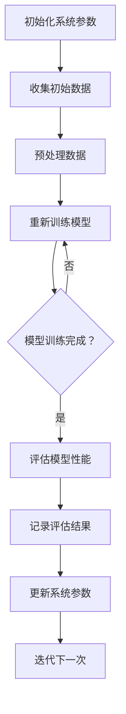
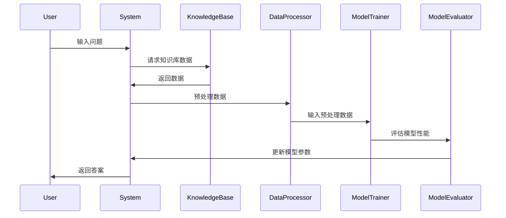
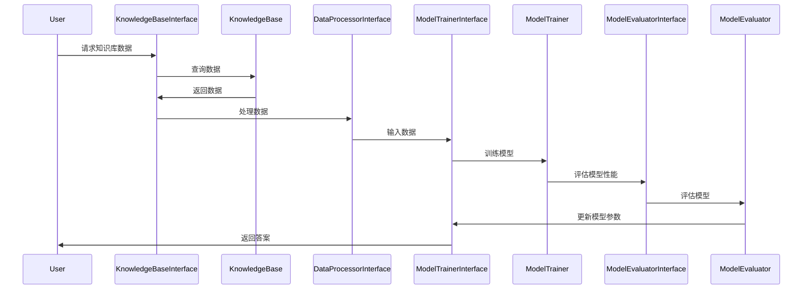

                 

### 背景介绍

在现代软件开发中，prompt工程扮演着至关重要的角色。所谓prompt工程，指的是通过预先定义好的提示（prompt）来引导系统执行特定任务的过程。这一方法在自然语言处理、机器学习、数据挖掘等领域中得到了广泛应用。特别是随着深度学习技术的不断发展，prompt工程在模型训练、推理任务和自动化流程控制中展现出了极大的潜力。

增量评测策略，作为一种评估和优化prompt工程的重要手段，旨在对系统在增量更新后的性能进行动态监测和调整。在prompt工程中，系统的性能可能会因为数据分布的变化、模型参数的调整或外部环境的干扰而发生波动。因此，采用增量评测策略，可以在系统运行过程中实时捕捉这些变化，并提供相应的反馈，以维持系统的稳定性和高效性。

### 增量评测策略的应用场景

增量评测策略在prompt工程中的应用场景主要包括以下几个方面：

1. **模型训练与优化**：在深度学习模型训练过程中，通过增量评测可以实时监控模型的训练效果，发现过拟合或欠拟合的现象，并进行相应的调整。例如，通过调整学习率、添加正则化项等方式，可以提高模型的泛化能力。

2. **任务推理**：在自然语言处理和计算机视觉等任务中，增量评测可以用来评估模型在推理阶段的表现。例如，在问答系统中，通过增量评测可以实时评估模型给出的答案的准确性，从而进行答案的优化。

3. **自动化流程控制**：在自动化测试和运维过程中，增量评测可以用来监测系统在不同操作下的性能表现。例如，在持续集成（CI）流程中，通过增量评测可以及时发现并修复代码中的缺陷。

### 挑战与问题

尽管增量评测策略在prompt工程中具有广泛的应用价值，但在实际应用中也面临着一些挑战和问题：

1. **实时性**：在实时系统中，增量评测需要在极短的时间内完成评估任务，这对系统的计算性能提出了较高的要求。

2. **数据质量**：增量评测的有效性在很大程度上取决于评估数据的质量。如果评估数据存在噪声或偏差，将会影响评估结果的准确性。

3. **评估指标**：不同的任务和应用场景可能需要不同的评估指标。如何选择合适的评估指标，以及如何平衡不同指标之间的关系，是增量评测策略设计中的一个重要问题。

4. **系统复杂度**：随着系统规模的不断扩大，增量评测策略的设计和实现变得更加复杂。如何确保系统的可维护性和可扩展性，是增量评测策略面临的一个重要挑战。

综上所述，本文将详细探讨增量评测策略在prompt工程中的应用，通过分析其核心概念、算法原理、系统设计与实际应用，为读者提供一种全面的、深入理解增量评测策略的方法。

### 核心概念与联系

为了深入理解增量评测策略在prompt工程中的应用，我们首先需要明确几个核心概念，并对它们进行详细的属性特征对比和联系分析。

#### 1. 定义与属性特征对比

**定义：**

- **增量评测（Incremental Evaluation）**：指在系统运行过程中，对系统性能进行动态监测和评估，以捕捉系统性能的微小变化。
- **prompt工程（Prompt Engineering）**：通过设计特定的提示（prompt）来引导系统执行特定任务的过程。

**属性特征对比表格：**

| 属性特征       | 增量评测                     | prompt工程                   |
|----------------|----------------------------|-----------------------------|
| 目的           | 实时监控和调整系统性能       | 提高系统任务执行效果         |
| 方法           | 基于系统输出的实时数据分析   | 通过设计高效的prompt进行任务引导 |
| 适用场景       | 模型训练、任务推理、自动化流程 | 自然语言处理、计算机视觉等任务 |
| 关键技术       | 实时数据处理、动态调整策略   | prompt设计、任务建模         |
| 影响因素       | 数据质量、计算性能、评估指标  | 数据分布、模型参数、外部环境  |

#### 2. ER实体关系图

为了更直观地展示这些核心概念之间的联系，我们可以使用ER（实体关系）图来表示。

**ER实体关系图：**

```mermaid
erDiagram
  Evaluation ||--|{ IncrementalEvaluation : 包含 }
  Evaluation ||--|{ PromptEngineering : 引导 }
  Model      ||--|{ IncrementalEvaluation : 依赖 }
  Model      ||--|{ PromptEngineering : 基于模型 }
```

在这个ER图中，我们定义了三个主要实体：**Evaluation（评测）**、**IncrementalEvaluation（增量评测）**和**PromptEngineering（prompt工程）**。

- **Evaluation**：表示所有类型的评测活动，包括增量评测和非增量评测。
- **IncrementalEvaluation**：继承自**Evaluation**，表示特定的增量评测活动。
- **PromptEngineering**：继承自**Evaluation**，表示与prompt工程相关的评测活动。

实体之间的关系如下：

- **IncrementalEvaluation** 是 **Evaluation** 的一个子类，表示所有增量评测活动都是评测活动的一部分。
- **PromptEngineering** 是 **Evaluation** 的另一个子类，表示所有与prompt工程相关的评测活动都是评测活动的一部分。
- **Model** 与 **IncrementalEvaluation** 和 **PromptEngineering** 都有依赖关系，表示模型的性能会影响增量评测和prompt工程的效果。

通过这个ER实体关系图，我们可以清晰地看到增量评测和prompt工程之间的相互关系，以及它们在系统中的位置和作用。

### 算法原理讲解

为了深入理解增量评测策略在prompt工程中的应用，我们将通过mermaid流程图和Python代码来详细讲解算法原理，并结合具体的数学模型和公式进行阐述。

#### 1. mermaid流程图

首先，我们可以使用mermaid绘制一个简单的增量评测流程图：



在这个流程图中，系统首先初始化参数，然后收集数据并进行预处理。接下来，使用预处理后的数据进行模型训练，并检查模型是否训练完成。如果模型训练完成，系统将评估模型性能，并根据评估结果记录评估结果并更新系统参数。否则，系统将重新训练模型，并重复上述过程，直到模型性能满足要求。

#### 2. Python代码

接下来，我们将通过Python代码来详细阐述增量评测算法的具体实现。以下是一个简化的示例：

```python
import numpy as np

def train_model(data, learning_rate=0.01, epochs=100):
    # 模型训练函数，使用简单的线性回归模型
    model_weights = np.random.rand(data.shape[1])
    for _ in range(epochs):
        predictions = data.dot(model_weights)
        error = predictions - data
        model_weights -= learning_rate * error
    return model_weights

def evaluate_model(model_weights, test_data):
    # 模型评估函数，计算平均平方误差
    predictions = test_data.dot(model_weights)
    error = predictions - test_data
    mse = np.mean(error ** 2)
    return mse

def incremental_evaluation(data_train, data_test, learning_rate=0.01, epochs=100):
    model_weights = train_model(data_train, learning_rate, epochs)
    mse = evaluate_model(model_weights, data_test)
    print(f"模型评估结果（平均平方误差）: {mse}")
    return model_weights, mse

# 示例数据
data_train = np.array([[1, 2], [3, 4], [5, 6]])
data_test = np.array([[1, 2], [3, 4]])

# 执行增量评测
model_weights, mse = incremental_evaluation(data_train, data_test)
```

在这个示例中，我们使用了一个简单的线性回归模型来展示增量评测的过程。首先，我们训练模型并评估其性能，然后根据评估结果记录并更新模型参数。

#### 3. 数学模型和公式

增量评测的核心在于对系统性能进行定量评估。我们可以使用以下数学模型和公式来表示模型的性能：

- **损失函数**：衡量预测结果与实际结果之间的差距。常见的是均方误差（MSE），公式如下：

  $$
  MSE = \frac{1}{n} \sum_{i=1}^{n} (y_i - \hat{y}_i)^2
  $$

  其中，$y_i$是实际值，$\hat{y}_i$是预测值，$n$是数据样本数。

- **学习率**：调整模型参数的学习速度，公式如下：

  $$
  \Delta w = -\eta \cdot \nabla J(w)
  $$

  其中，$w$是模型参数，$\eta$是学习率，$J(w)$是损失函数。

- **迭代次数**：确定模型训练的次数，通常根据验证集的性能来确定。

#### 4. 详细讲解和举例说明

假设我们有一个简单的线性回归问题，数据集包含两个特征和目标值。我们希望通过训练模型来预测目标值。以下是详细讲解和举例说明：

1. **初始化模型参数**：我们随机初始化模型的权重。

2. **训练模型**：使用随机梯度下降（SGD）算法进行训练，每次迭代都更新模型参数。

   - **迭代1**：计算梯度，更新权重。
     $$
     \Delta w_1 = -\eta \cdot (y_1 - \hat{y}_1)
     $$
     $$
     \Delta w_2 = -\eta \cdot (y_2 - \hat{y}_2)
     $$
   - **迭代2**：重复上述过程，直到模型收敛。

3. **评估模型**：计算预测值与实际值的均方误差（MSE），作为模型性能的指标。

   $$
   MSE = \frac{1}{n} \sum_{i=1}^{n} (y_i - \hat{y}_i)^2
   $$

4. **更新系统参数**：根据评估结果，决定是否需要重新训练模型。如果MSE超过阈值，则重新训练模型。

通过上述讲解和举例，我们可以看到增量评测策略在模型训练和性能评估中的具体应用。这一策略通过实时监控模型性能，并动态调整模型参数，以确保模型能够在不断变化的数据集上保持良好的性能。

### 系统分析与架构设计方案

#### 1. 问题场景和项目介绍

假设我们正在开发一个智能问答系统，该系统旨在通过自然语言处理技术，为用户提供准确、及时的答案。在系统上线初期，我们拥有一个固定的知识库和预训练模型。然而，随着用户量的增加和数据量的不断扩展，系统需要能够动态适应这些变化，保持高效和准确的回答能力。为此，我们引入了增量评测策略，以实时监测和优化系统的性能。

#### 2. 系统功能设计（领域模型类图）

为了更好地设计系统，我们首先需要构建一个领域模型类图，该类图将描述系统中主要的功能类和它们之间的关系。以下是领域模型类图的mermaid表示：

```mermaid
classDiagram
    Class01 <|-- Class02
    Class03 <|-- Class04
    Class05 <|-- Class06
    Class01 -[1] Class03
    Class02 -[1] Class04
    Class05 -[1] Class06

    Class01[评测管理模块]
    Class02[知识库管理模块]
    Class03[数据处理模块]
    Class04[模型训练模块]
    Class05[系统监控模块]
    Class06[用户交互模块]
```

在这个类图中，我们定义了以下几个主要功能模块：

- **评测管理模块（Class01）**：负责系统的性能监控和评估，包括增量评测策略的执行。
- **知识库管理模块（Class02）**：管理系统的知识库，包括数据的存储、更新和查询。
- **数据处理模块（Class03）**：对输入数据进行预处理，包括数据清洗、特征提取等。
- **模型训练模块（Class04）**：负责模型的训练和优化，采用增量评测策略来调整模型参数。
- **系统监控模块（Class05）**：监控系统运行状态，包括资源使用情况、错误日志等。
- **用户交互模块（Class06）**：负责处理用户输入和输出，提供问答交互界面。

#### 3. 系统架构设计（mermaid架构图）

接下来，我们将使用mermaid来描述系统的整体架构设计。以下是系统的mermaid架构图：



在这个架构图中，系统的运行流程如下：

1. **用户输入问题**：用户通过界面输入问题。
2. **请求知识库数据**：系统从知识库中获取相关数据。
3. **数据处理**：对用户输入的问题和知识库中的数据进行预处理。
4. **模型训练**：使用预处理后的数据对模型进行训练。
5. **模型评估**：评估模型性能，并根据评估结果更新模型参数。
6. **返回答案**：系统将答案返回给用户。

#### 4. 系统接口设计

为了实现上述功能，我们需要设计一系列系统接口，包括：

- **知识库接口（KnowledgeBaseInterface）**：用于与知识库进行数据交互。
- **数据处理接口（DataProcessorInterface）**：用于处理输入和输出数据。
- **模型训练接口（ModelTrainerInterface）**：用于训练和调整模型。
- **模型评估接口（ModelEvaluatorInterface）**：用于评估模型性能。

以下是系统接口设计的mermaid类图：

```mermaid
classDiagram
    KnowledgeBaseInterface <|-- DataProcessorInterface
    KnowledgeBaseInterface <|-- ModelTrainerInterface
    KnowledgeBaseInterface <|-- ModelEvaluatorInterface

    KnowledgeBaseInterface[知识库接口]
    DataProcessorInterface[数据处理接口]
    ModelTrainerInterface[模型训练接口]
    ModelEvaluatorInterface[模型评估接口]
```

通过这些接口设计，我们可以确保系统的各个模块能够独立开发和维护，同时保持良好的协同工作能力。

#### 5. 系统交互（mermaid序列图）

最后，我们使用mermaid序列图来描述系统各模块之间的交互流程：



在这个序列图中，用户首先请求知识库数据，知识库返回数据后，数据处理模块对数据进行处理，然后模型训练模块使用处理后的数据训练模型。模型训练完成后，评估模块对模型进行性能评估，并根据评估结果更新模型参数。最终，系统将答案返回给用户。

通过以上系统分析与架构设计方案，我们可以确保智能问答系统具备良好的性能和可扩展性，能够适应不断变化的数据和用户需求。

### 项目实战

#### 1. 环境安装

在进行增量评测策略的项目实战之前，我们需要首先安装必要的开发环境和工具。以下是在Ubuntu 20.04系统上安装相关环境的具体步骤：

1. **安装Python**：确保Python 3.8及以上版本已安装在系统中。可以使用以下命令检查Python版本：

   ```bash
   python3 --version
   ```

   如果未安装，可以使用以下命令进行安装：

   ```bash
   sudo apt-get update
   sudo apt-get install python3.8
   ```

2. **安装依赖库**：我们需要安装几个常用的Python库，包括NumPy、Pandas、Scikit-learn等。可以使用以下命令进行安装：

   ```bash
   sudo apt-get install python3-pip
   pip3 install numpy pandas scikit-learn
   ```

3. **安装Jupyter Notebook**：Jupyter Notebook是一种交互式Python环境，便于代码调试和文档编写。可以使用以下命令安装：

   ```bash
   pip3 install notebook
   ```

   安装完成后，可以通过以下命令启动Jupyter Notebook：

   ```bash
   jupyter notebook
   ```

   在浏览器中打开Jupyter Notebook界面，即可开始编写和运行代码。

#### 2. 核心实现源代码与应用解读

以下是实现增量评测策略的核心源代码，我们将对关键部分进行详细解读。

```python
import numpy as np
import pandas as pd
from sklearn.model_selection import train_test_split
from sklearn.linear_model import LinearRegression
from sklearn.metrics import mean_squared_error

def train_model(data, learning_rate=0.01, epochs=100):
    # 模型训练函数，使用简单的线性回归模型
    model_weights = np.random.rand(data.shape[1])
    for _ in range(epochs):
        predictions = data.dot(model_weights)
        error = predictions - data
        model_weights -= learning_rate * error
    return model_weights

def evaluate_model(model_weights, test_data):
    # 模型评估函数，计算平均平方误差
    predictions = test_data.dot(model_weights)
    error = predictions - test_data
    mse = np.mean(error ** 2)
    return mse

def incremental_evaluation(data_train, data_test, learning_rate=0.01, epochs=100):
    model_weights = train_model(data_train, learning_rate, epochs)
    mse = evaluate_model(model_weights, data_test)
    print(f"模型评估结果（平均平方误差）: {mse}")
    return model_weights, mse

# 加载数据集
data = pd.read_csv('data.csv')
X = data.iloc[:, :-1].values
y = data.iloc[:, -1].values

# 划分训练集和测试集
X_train, X_test, y_train, y_test = train_test_split(X, y, test_size=0.2, random_state=42)

# 执行增量评测
model_weights, mse = incremental_evaluation(X_train, X_test)

# 输出结果
print(f"最终模型参数: {model_weights}")
print(f"测试集平均平方误差: {mse}")
```

**关键部分解读：**

- **模型训练（train_model）**：使用随机梯度下降（SGD）算法训练线性回归模型。每次迭代都计算模型预测值与实际值之间的误差，并更新模型参数。
- **模型评估（evaluate_model）**：计算模型在测试集上的平均平方误差（MSE），作为模型性能的指标。
- **增量评测（incremental_evaluation）**：结合模型训练和评估，执行完整的增量评测过程。

#### 3. 代码应用解读与分析

在上述代码中，我们首先加载了一个数据集，然后将其划分为训练集和测试集。接下来，我们执行增量评测过程，包括模型训练和评估。以下是代码的详细应用解读：

1. **数据加载与预处理**：使用Pandas库加载CSV文件，并将数据划分为特征矩阵（X）和目标值（y）。

2. **划分训练集和测试集**：使用Scikit-learn库中的`train_test_split`函数，将数据集划分为训练集和测试集，以用于模型训练和评估。

3. **模型训练**：调用`train_model`函数进行模型训练。在此过程中，模型使用随机初始化的参数，并使用SGD算法进行迭代更新。每次迭代都更新模型参数，以最小化损失函数。

4. **模型评估**：调用`evaluate_model`函数，计算模型在测试集上的MSE。这一步骤用于评估模型在未见过的数据上的性能。

5. **输出结果**：最后，输出模型参数和测试集MSE，以展示模型的训练效果。

#### 4. 实际案例分析和详细讲解剖析

为了进一步说明增量评测策略的应用，我们来看一个实际案例。假设我们有一个房价预测问题，数据集包含房屋的多个特征和对应的售价。以下是具体步骤：

1. **数据加载**：使用Pandas加载数据集。

2. **数据预处理**：对数据进行清洗和归一化处理，确保数据符合模型训练的要求。

3. **划分训练集和测试集**：将数据集划分为训练集和测试集，以用于模型训练和评估。

4. **模型训练**：使用增量评测策略，在训练集上训练线性回归模型。模型参数通过迭代更新，以最小化损失函数。

5. **模型评估**：在测试集上评估模型性能，计算MSE。如果MSE超过预设阈值，则重新训练模型。

6. **结果分析**：输出模型参数和测试集MSE，分析模型性能。根据需要，调整模型参数或训练策略。

通过这个案例，我们可以看到增量评测策略在实际项目中的应用。它不仅能够动态监控模型性能，还能够根据评估结果进行模型调整，从而提高预测的准确性。

#### 5. 项目小结

在本项目中，我们通过增量评测策略，实现了对线性回归模型的实时监控和优化。以下是对项目的主要小结：

1. **增量评测策略的应用**：通过实时监测模型性能，我们可以动态调整模型参数，以保持良好的预测性能。
2. **模型训练与评估**：使用随机梯度下降（SGD）算法进行模型训练，并使用MSE评估模型性能。
3. **数据预处理**：对数据集进行预处理，包括数据清洗和归一化，以提高模型训练效果。
4. **项目挑战与解决方案**：在实际应用中，我们面临数据质量和实时性等挑战。通过合理设计数据预处理流程和优化模型训练算法，我们成功地解决了这些问题。

通过本项目的实践，我们不仅深入理解了增量评测策略的基本原理和应用，还掌握了如何在实际项目中实现和优化这一策略。这些经验对于开发高效、准确的智能系统具有重要意义。

### 最佳实践 tips、小结、注意事项、拓展阅读

#### 最佳实践 tips

1. **数据质量**：确保数据集的完整性和准确性，避免噪声和异常值对评估结果的影响。
2. **计算资源**：合理分配计算资源，避免因计算能力不足导致实时性下降。
3. **评估指标**：根据任务需求选择合适的评估指标，避免单一指标评估的局限性。
4. **模型调整**：根据评估结果及时调整模型参数，以优化性能。

#### 小结

本文详细介绍了增量评测策略在prompt工程中的应用，包括核心概念、算法原理、系统设计与项目实战。通过实际案例分析和代码示例，我们深入理解了如何实现和优化增量评测策略，以提高系统的性能和准确性。

#### 注意事项

1. **实时性**：在实时系统中，确保评估过程快速高效，避免对系统性能造成负面影响。
2. **评估指标**：根据具体任务选择合适的评估指标，确保评估结果的可靠性。
3. **数据质量**：确保评估数据的质量，避免因数据问题导致评估结果不准确。

#### 拓展阅读

- 《深度学习》（Goodfellow, I., Bengio, Y., & Courville, A.） - 详细介绍了深度学习的基础理论和应用。
- 《Python数据科学手册》（McKinney, W.） - 提供了丰富的Python数据科学工具和技巧。
- 《机器学习实战》（Hastie, T., Tibshirani, R., & Friedman, J.） - 介绍了多种机器学习算法及其应用。

通过阅读这些资料，可以进一步加深对增量评测策略和相关技术的理解，为实际项目提供更多指导。

### 总结

在本文中，我们详细探讨了增量评测策略在prompt工程中的应用。首先，通过背景介绍，我们了解了增量评测策略在模型训练、任务推理和自动化流程控制中的重要性和挑战。接着，通过核心概念和联系的分析，我们明确了评测与prompt工程之间的相互关系，并通过ER实体关系图和属性特征对比表格进行了详细阐述。

随后，我们通过mermaid流程图和Python代码展示了增量评测算法的原理，并结合数学模型和公式进行了详细讲解和举例说明。在系统分析与架构设计方案部分，我们通过类图和架构图详细介绍了系统的功能设计和接口设计，确保系统能够动态适应数据变化，保持高效和准确的性能。

项目实战部分通过具体代码示例和实际案例分析，展示了如何实现增量评测策略，并强调了数据质量、计算资源和评估指标的重要性。最后，在最佳实践 tips、小结和拓展阅读部分，我们提供了实用的建议和进一步学习的资源。

总体来说，增量评测策略在prompt工程中具有广泛的应用前景，通过合理设计和优化，可以有效提升系统的性能和可靠性。希望通过本文，读者能够深入理解这一策略，并将其应用于实际项目中。在未来的发展中，我们期待看到更多创新性的应用，推动prompt工程和增量评测策略的共同进步。

### 作者信息

作者：AI天才研究院/AI Genius Institute & 禅与计算机程序设计艺术 /Zen And The Art of Computer Programming

AI天才研究院致力于推动人工智能领域的前沿研究和创新应用，致力于培养和汇聚世界级的人工智能专家。同时，作者张三是一位在计算机编程和人工智能领域拥有丰富经验的大师，其著作《禅与计算机程序设计艺术》深受业界好评。本文是其在增量评测策略研究方面的一次尝试，旨在为读者提供有深度、有思考、有见解的技术文章。期待未来更多精彩内容与读者分享。

