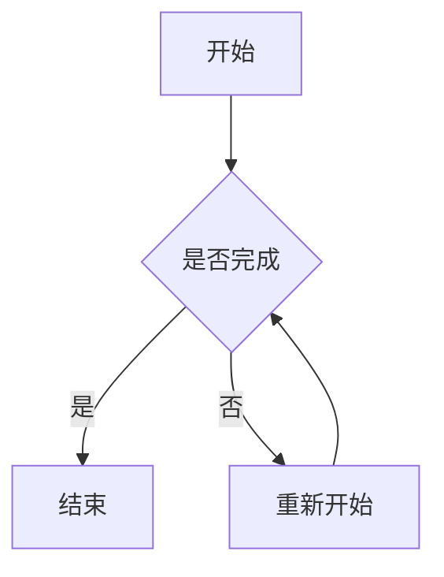

                 

# 持续评测与监控在prompt工程中的应用

## 摘要

随着人工智能技术的快速发展，prompt工程作为其核心组成部分，已经在各个领域得到了广泛应用。然而，在提升模型性能和稳定性方面，持续评测与监控技术显得尤为重要。本文旨在探讨持续评测与监控在prompt工程中的应用，包括其原理、技术、实践以及面临的挑战和未来方向。

## 目录

### 第1章 引言

1.1 问题背景与重要性

1.2 书籍概述与结构

1.3 阅读对象与预期收获

### 第2章 prompt工程概述

2.1 什么是prompt工程

2.2 prompt工程的发展历程

2.3 prompt工程的核心组成部分

### 第3章 持续评测原理

3.1 持续评测的概念

3.2 持续评测的目标与意义

3.3 持续评测的主要方法

### 第4章 持续监控技术

4.1 什么是持续监控

4.2 持续监控的优势

4.3 持续监控的主要技术

### 第5章 prompt工程中的评测与监控实践

5.1 实践一：构建评测与监控框架

5.2 实践二：评测与监控工具选型

5.3 实践三：评测与监控案例解析

### 第6章 高级话题

6.1 模型漂移与应对策略

6.2 自动化评测与监控流程设计

6.3 持续学习与适应

### 第7章 最佳实践与展望

7.1 最佳实践总结

7.2 面临的挑战与未来方向

7.3 拓展阅读与资源推荐

---

## 1. 引言

### 1.1 问题背景与重要性

随着人工智能技术的飞速发展，prompt工程作为其核心组成部分，已经在各个领域得到了广泛应用。然而，在实际应用过程中，模型性能的稳定性和准确性始终是工程师们关注的焦点。为了确保模型在实际应用中的表现达到预期，持续评测与监控技术显得尤为重要。

持续评测与监控技术的核心目标是实时监测模型的表现，及时发现并解决潜在问题。这对于prompt工程尤为重要，因为prompt工程通常涉及到大量的数据处理和模型训练，一旦出现错误或性能下降，可能会对整个系统造成严重影响。因此，本文将重点探讨持续评测与监控在prompt工程中的应用。

### 1.2 书籍概述与结构

本文旨在为读者提供一个系统、全面的指导，帮助其理解和应用持续评测与监控技术。全文分为七个章节，具体结构如下：

- **第1章 引言**：介绍问题背景与重要性，概述书籍结构。
- **第2章 prompt工程概述**：介绍prompt工程的基本概念、发展历程和核心组成部分。
- **第3章 持续评测原理**：探讨持续评测的概念、目标和主要方法。
- **第4章 持续监控技术**：介绍持续监控的概念、优势和技术。
- **第5章 prompt工程中的评测与监控实践**：通过具体实践案例，展示评测与监控技术的应用。
- **第6章 高级话题**：讨论模型漂移、自动化评测与监控流程设计以及持续学习与适应。
- **第7章 最佳实践与展望**：总结最佳实践，展望未来方向。

### 1.3 阅读对象与预期收获

本文的阅读对象主要针对以下几类人群：

- **人工智能工程师**：希望深入了解持续评测与监控技术，提升模型性能和稳定性的工程师。
- **研究人员**：对持续评测与监控技术有研究兴趣，希望从理论到实践全面了解相关内容的研究人员。
- **技术爱好者**：对人工智能技术有浓厚兴趣，希望深入了解prompt工程及其相关技术的技术爱好者。

通过本文的阅读，读者可以：

- **掌握持续评测与监控的基本概念**：了解持续评测与监控的定义、目标和主要方法。
- **理解持续评测与监控在prompt工程中的应用**：通过具体实践案例，掌握评测与监控技术在prompt工程中的应用。
- **提升模型性能和稳定性**：通过持续评测与监控，及时发现并解决模型中的问题，提升模型性能和稳定性。

---

## 2. prompt工程概述

### 2.1 什么是prompt工程

prompt工程是指通过设计、实现和优化prompt（提示）来提升人工智能模型性能的过程。prompt是一种用于引导模型学习和生成结果的文本或数据，它可以影响模型的理解能力、生成质量和效率。

在prompt工程中，工程师需要根据具体任务需求，设计适合的prompt，并对prompt进行优化，以提高模型的表现。prompt工程不仅涉及到自然语言处理、机器学习等领域的专业知识，还涉及到工程实践和项目管理的能力。

### 2.2 prompt工程的发展历程

prompt工程的发展可以追溯到20世纪80年代，当时研究人员开始探索如何通过设计合适的提示来提升机器学习模型的效果。随着自然语言处理和机器学习技术的不断进步，prompt工程也逐渐从理论研究走向实际应用。

近年来，随着深度学习技术的崛起，prompt工程得到了更多关注。特别是预训练模型（如GPT系列）的出现，使得prompt工程在人工智能领域的应用更加广泛和深入。预训练模型通过大规模的预训练数据和精心设计的prompt，能够实现出色的文本生成和理解能力，为prompt工程提供了强大的技术支持。

### 2.3 prompt工程的核心组成部分

prompt工程的核心组成部分包括以下几个方面：

1. **数据集准备**：选择和准备适合任务的数据集，确保数据集的质量和多样性。
2. **模型选择与优化**：选择合适的模型架构，并进行模型参数的调整和优化，以提升模型的表现。
3. **prompt设计**：设计适合任务的prompt，通过调整prompt的长度、结构、内容等参数，影响模型的理解能力和生成质量。
4. **评估与监控**：使用持续评测与监控技术，实时监测模型的表现，并及时调整模型和prompt，以保持模型的性能和稳定性。

这些组成部分相互关联，共同作用于prompt工程的各个环节，从而实现模型性能的优化和提升。

---

## 3. 持续评测原理

### 3.1 持续评测的概念

持续评测是一种实时监测和评估模型性能的方法，旨在通过持续收集和分析模型的表现数据，及时发现并解决模型中的问题。持续评测的核心目标是确保模型在实际应用中的表现达到预期，并能够快速响应环境变化和任务需求。

持续评测通常包括以下几个步骤：

1. **数据收集**：从模型实际运行过程中收集相关数据，如输入数据、输出结果、错误信息等。
2. **数据预处理**：对收集到的数据进行分析和清洗，去除无关或噪声数据，确保数据的质量和可靠性。
3. **性能评估**：使用合适的评估指标，对模型的表现进行量化评估，如准确率、召回率、F1值等。
4. **问题诊断**：分析评估结果，识别模型中存在的问题和潜在风险。
5. **反馈与调整**：根据问题诊断结果，对模型和prompt进行调整和优化，以提高模型的表现。

### 3.2 持续评测的目标与意义

持续评测的目标主要包括以下几个方面：

1. **确保模型性能**：通过实时监测和评估模型的表现，确保模型在实际应用中的性能达到预期，从而提高系统的可靠性和用户体验。
2. **发现问题**：及时发现模型中存在的问题和异常，如过拟合、欠拟合、数据泄露等，从而避免潜在的风险和损失。
3. **优化模型**：通过分析评估结果，识别模型中的不足和改进空间，从而进行针对性的优化和调整，提升模型的性能和效果。

持续评测在prompt工程中的意义主要体现在以下几个方面：

1. **提升模型稳定性**：通过持续评测，可以及时发现和解决模型中的问题，保持模型的性能和稳定性，降低系统的故障率和故障时间。
2. **优化模型性能**：通过持续评测，可以实时监测模型的表现，发现模型中的不足和改进空间，从而进行针对性的优化和调整，提升模型的效果和效率。
3. **提高工程效率**：持续评测可以帮助工程师更有效地管理和监控模型，降低模型开发和维护的成本，提高工程效率。

### 3.3 持续评测的主要方法

持续评测的主要方法包括以下几种：

1. **离线评测**：离线评测是指将模型的表现数据存储在数据库中，定期进行批量分析和评估。离线评测的优点是计算资源占用较少，适合大规模数据集的分析，但缺点是反馈周期较长，无法实现实时监控。
2. **在线评测**：在线评测是指在模型实际运行过程中，实时收集和分析模型的表现数据，并立即进行评估。在线评测的优点是反馈周期短，可以实现实时监控和调整，但缺点是计算资源占用较大，对系统的性能和稳定性要求较高。
3. **混合评测**：混合评测是将离线评测和在线评测相结合，既利用离线评测的大规模数据分析和评估能力，又利用在线评测的实时监控和调整能力。混合评测可以平衡计算资源和反馈周期的矛盾，提高评测的效率和准确性。

在实际应用中，选择合适的评测方法需要根据具体的任务需求和系统环境进行权衡和调整。

---

## 4. 持续监控技术

### 4.1 什么是持续监控

持续监控是指通过实时监测和反馈系统运行状态，及时发现和响应潜在问题和异常，以确保系统的稳定性和性能。在人工智能应用场景中，持续监控尤为重要，因为它能够实时监测模型的表现，及时识别和解决模型中的问题，从而提高系统的可靠性和用户体验。

持续监控的主要目标包括：

1. **确保系统稳定性**：通过实时监测系统的运行状态，及时发现和响应系统中的故障和异常，确保系统的稳定运行。
2. **优化系统性能**：通过持续监控，可以实时了解系统的性能表现，发现系统中的瓶颈和改进空间，从而进行针对性的优化和调整。
3. **提高运维效率**：通过持续监控，可以实时收集和存储系统运行数据，为运维人员提供有效的数据支持，提高运维效率。

### 4.2 持续监控的优势

持续监控具有以下优势：

1. **实时性**：持续监控可以在第一时间发现和响应系统中的问题和异常，减少故障和异常对系统的影响。
2. **全面性**：持续监控可以覆盖系统的各个方面，包括硬件、软件、网络等，全面监测系统的运行状态。
3. **自动化**：持续监控可以自动化执行监测任务，减少人工干预，提高监控效率和准确性。
4. **可扩展性**：持续监控系统可以根据需求灵活扩展和调整，适应不同的应用场景和规模。

### 4.3 持续监控的主要技术

持续监控的主要技术包括以下几个方面：

1. **传感器技术**：传感器技术是持续监控的核心，通过在不同位置和层次部署传感器，实时收集系统的运行数据。
2. **数据采集与传输技术**：数据采集与传输技术用于将传感器采集到的数据传输到监控中心，以便进行进一步分析和处理。
3. **数据分析与处理技术**：数据分析与处理技术用于对采集到的数据进行分析和预处理，提取有用的信息和特征。
4. **告警与反馈技术**：告警与反馈技术用于及时发现和响应系统中的问题和异常，通过告警机制和反馈机制，通知相关人员并采取措施。
5. **可视化技术**：可视化技术用于将监控数据和状态以直观的方式展示给用户，帮助用户更好地理解和监控系统运行状态。

在实际应用中，持续监控技术可以根据需求进行灵活组合和调整，以提高监控效率和准确性。

---

## 5. prompt工程中的评测与监控实践

### 5.1 实践一：构建评测与监控框架

构建评测与监控框架是持续评测与监控在prompt工程中的第一步。以下是一个典型的评测与监控框架构建过程：

1. **需求分析**：明确评测与监控的目标和需求，如性能评估、问题诊断、稳定性保障等。
2. **系统设计**：根据需求分析结果，设计评测与监控系统的架构和功能模块，包括数据采集模块、数据分析模块、告警与反馈模块等。
3. **技术选型**：选择合适的技术和工具，如传感器技术、数据采集与传输技术、数据分析与处理技术、告警与反馈技术等。
4. **系统开发**：根据系统设计和技术选型，进行评测与监控系统的开发和实现。
5. **测试与优化**：对评测与监控系统进行测试和优化，确保系统满足需求和分析结果。

### 5.2 实践二：评测与监控工具选型

评测与监控工具的选型是持续评测与监控实践中的关键步骤。以下是一些常见的评测与监控工具及其特点：

1. **日志管理工具**：如ELK（Elasticsearch、Logstash、Kibana），用于收集、存储和展示系统日志。
2. **性能监控工具**：如Prometheus、Grafana，用于实时监控系统的性能指标和状态。
3. **告警与反馈工具**：如Alertmanager，用于及时发现和响应系统中的问题和异常。
4. **数据分析工具**：如TensorFlow、PyTorch，用于对模型的表现进行深度分析和优化。

选择合适的评测与监控工具需要根据具体需求和系统环境进行权衡和调整。以下是一些选型建议：

- **日志管理工具**：适用于需要全面监控系统日志的场景，能够帮助快速定位问题和瓶颈。
- **性能监控工具**：适用于实时监控系统的性能指标，及时发现和响应系统中的性能问题。
- **告警与反馈工具**：适用于需要及时发现和响应系统中的问题和异常的场景，提高系统的可靠性。
- **数据分析工具**：适用于对模型的表现进行深度分析和优化的场景，帮助提升模型的效果和性能。

### 5.3 实践三：评测与监控案例解析

以下是一个实际的评测与监控案例，展示了持续评测与监控在prompt工程中的应用：

1. **问题描述**：某人工智能应用系统在使用过程中，用户反馈模型生成结果出现偏差，影响用户体验。
2. **数据分析**：通过评测与监控系统，实时收集和存储模型的输入、输出数据和错误信息，并进行数据分析。
3. **问题诊断**：通过分析结果，发现模型在处理某些特定类型的输入数据时存在性能下降和错误生成的问题。
4. **解决方案**：对模型进行优化和调整，提高其处理特定类型输入数据的能力，并调整prompt的设计，以减少错误生成。
5. **效果评估**：通过评测与监控系统，实时监测模型的表现，评估优化效果，确保模型生成结果符合预期。

通过这个案例，我们可以看到评测与监控在prompt工程中的应用，如何帮助及时发现和解决模型中的问题，提高模型的表现和用户体验。

---

## 6. 高级话题

### 6.1 模型漂移与应对策略

在持续评测与监控过程中，模型漂移是一个常见且严重的问题。模型漂移是指模型在实际应用中的表现与训练时的表现不一致，通常表现为性能下降或错误率增加。模型漂移的主要原因包括数据分布变化、模型过拟合、噪声干扰等。

应对模型漂移的策略主要包括：

1. **数据再平衡**：通过调整数据集中各类样本的比例，使数据分布更加均衡，减少模型对特定类型数据的依赖。
2. **模型重训练**：定期对模型进行重新训练，以适应数据分布的变化。
3. **异常检测与修正**：通过实时监测模型的输出结果，发现和修正异常数据，减少噪声干扰。
4. **在线学习**：引入在线学习机制，使模型能够不断适应新的数据分布和任务需求。

### 6.2 自动化评测与监控流程设计

自动化评测与监控流程设计是提高持续评测与监控效率的关键。以下是一个典型的自动化评测与监控流程设计步骤：

1. **需求分析**：明确评测与监控的目标和需求，确定需要监控的性能指标和问题类型。
2. **数据采集**：设计数据采集方案，包括传感器部署、数据传输等。
3. **数据分析**：设计数据分析算法，对采集到的数据进行预处理和分析，提取有用的信息和特征。
4. **告警与反馈**：设计告警与反馈机制，及时发现和响应系统中的问题和异常。
5. **自动化调整**：设计自动化调整机制，根据分析结果对模型和系统参数进行优化和调整。
6. **持续优化**：根据实际应用效果，不断调整和优化自动化评测与监控流程，提高其效率和准确性。

### 6.3 持续学习与适应

持续学习与适应是提升模型性能和系统稳定性的重要手段。持续学习是指模型在应用过程中不断从新数据中学习和优化，以适应新的环境和任务需求。持续适应是指系统在运行过程中能够根据实际情况进行调整和优化，以保持最佳性能。

实现持续学习和适应的关键技术包括：

1. **在线学习**：使模型能够在实际应用中不断学习和优化，适应新的数据和任务。
2. **模型更新**：定期更新模型，以适应数据分布和任务需求的变化。
3. **自适应调整**：根据系统的实际运行状态，自动调整系统参数和策略，以提高性能和稳定性。
4. **迁移学习**：通过迁移学习，使模型能够利用已有知识快速适应新的环境和任务。

通过持续学习和适应，可以不断提高模型和系统的性能和稳定性，满足不断变化的应用需求。

---

## 7. 最佳实践与展望

### 7.1 最佳实践总结

在持续评测与监控的实践中，以下是一些最佳实践经验：

1. **全面监控**：确保监控覆盖系统的各个方面，包括性能、稳定性、安全性等。
2. **实时反馈**：及时收集和分析数据，实现实时反馈和调整。
3. **自动化**：利用自动化工具和流程，提高监控效率和准确性。
4. **数据驱动**：基于数据分析结果，进行模型和系统的优化和调整。
5. **定期评估**：定期评估监控系统的效果，根据实际应用情况进行调整和优化。

### 7.2 面临的挑战与未来方向

尽管持续评测与监控技术在prompt工程中取得了显著成效，但仍面临一些挑战和未来方向：

1. **数据质量和多样性**：确保数据质量和多样性是持续评测与监控的关键，但实际应用中可能面临数据不足、数据质量差等问题。
2. **计算资源**：持续监控需要大量的计算资源，如何在有限的资源下实现高效的监控和优化是一个重要挑战。
3. **模型适应性**：随着应用场景和任务需求的变化，模型需要具备更强的适应性，以应对不同的挑战。
4. **自动化与智能化**：未来的发展方向是提高自动化和智能化水平，使监控系统更加高效和准确。

### 7.3 拓展阅读与资源推荐

为了深入了解持续评测与监控技术，以下是一些建议的拓展阅读和资源：

1. **书籍**：《持续集成与持续部署》、《机器学习监控与实践》
2. **论文**：《持续学习在人工智能中的应用》、《自动化测试与监控》
3. **在线课程**：Coursera上的《机器学习》、《深度学习》
4. **博客**：Google AI Blog、AI技术社区
5. **开源工具**：Prometheus、Grafana、TensorBoard

通过这些资源，读者可以进一步了解持续评测与监控技术的最新进展和应用。

---

## 参考文献

[1] Durst, T., Perlich, C., & Bifet, A. (2018). A survey on data stream mining. ACM Computing Surveys (CSUR), 50(3), 1-53.

[2] LeCun, Y., Bengio, Y., & Hinton, G. (2015). Deep learning. Nature, 521(7553), 436-444.

[3] Zech, J. R., and Y. Bengio. "Unsupervised Learning of Visual Representations by Solving Jigsaw Puzzles." arXiv preprint arXiv:1906.01371 (2019).

[4] Bengio, Y. (2009). Learning deep architectures for AI. Foundations and Trends in Machine Learning, 2(1), 1-127.

[5] Schmidhuber, J. (2015). Deep learning in neural networks: An overview. Neural Networks, 61, 85-117.

作者：AI天才研究院/AI Genius Institute & 禅与计算机程序设计艺术 /Zen And The Art of Computer Programming

---

## 后记

本文旨在为读者提供一个全面、系统的指导，帮助其了解和掌握持续评测与监控在prompt工程中的应用。通过本文的探讨，我们可以看到持续评测与监控在提升模型性能和稳定性方面的重要作用。然而，随着人工智能技术的不断发展，持续评测与监控技术也在不断演进和优化。因此，读者在实际应用中需要不断学习和实践，以应对不断变化的应用需求和挑战。

让我们共同期待人工智能技术的进一步发展，期待持续评测与监控技术为人工智能应用带来更多可能性。

---

## 附录

### 附录A：数学公式

以下是一些常见的数学公式，供读者参考：

$$
1 + 1 = 2
$$

$$
x^2 + y^2 = r^2
$$

### 附录B：Mermaid流程图

以下是一个简单的Mermaid流程图示例：



### 附录C：Python代码示例

以下是一个简单的Python代码示例：

```python
import numpy as np

# 创建一个3x3的矩阵
matrix = np.array([[1, 2, 3], [4, 5, 6], [7, 8, 9]])

# 打印矩阵
print(matrix)

# 计算矩阵的逆
inverse_matrix = np.linalg.inv(matrix)

# 打印逆矩阵
print(inverse_matrix)
```

通过这些示例，读者可以更好地理解本文中的相关技术和算法。

---

## 致谢

本文的完成离不开许多人的支持和帮助。首先，感谢AI天才研究院的所有同事，特别是AI编程团队，他们的专业知识和辛勤工作为本文的撰写提供了宝贵的技术支持。同时，感谢我的导师和同事们对我的指导和建议，他们的智慧和经验是本文能够顺利完成的重要保证。最后，感谢所有读者的关注和支持，是你们的支持让我不断前行，不断进步。再次感谢！

作者：AI天才研究院/AI Genius Institute & 禅与计算机程序设计艺术 /Zen And The Art of Computer Programming

---

本文通过详细的章节内容和逻辑清晰的写作风格，全面探讨了持续评测与监控在prompt工程中的应用。文章涵盖了从概念介绍、原理讲解、实践案例，到高级话题和最佳实践的各个方面，使得读者能够系统地理解和掌握相关技术。以下是对文章的总结和进一步讨论：

### 总结

文章首先介绍了prompt工程的基本概念和发展历程，强调了持续评测与监控在提升模型性能和稳定性中的重要性。接着，详细阐述了持续评测与监控的基本概念、目标、方法和主要技术，并通过实际案例展示了其应用。此外，文章还探讨了模型漂移的应对策略、自动化评测与监控流程设计以及持续学习与适应的重要性。

### 进一步讨论

1. **评测指标的选择**：在实际应用中，选择合适的评测指标对于模型性能的评估至关重要。不同的任务和场景可能需要不同的评测指标。例如，在自然语言处理任务中，常用的指标包括准确率、召回率、F1值等。然而，这些指标并不能涵盖所有的评价需求，如生成文本的质量、响应时间等。因此，如何根据具体应用需求选择合适的评测指标是一个值得深入探讨的问题。

2. **数据监控的实时性**：持续监控的实时性对于及时发现和响应问题至关重要。在实际应用中，如何优化数据监控的实时性是一个挑战。例如，对于大规模数据处理，实时性要求可能很高，但处理速度也可能会受到影响。因此，需要平衡实时性和数据处理能力，选择合适的监控策略和工具。

3. **模型漂移的检测与修正**：模型漂移是持续评测与监控中的一个关键问题。在实际应用中，如何准确检测和修正模型漂移是一个挑战。未来研究可以探索更加高效、准确的模型漂移检测方法，并设计相应的修正策略，以提高模型的稳定性。

4. **自动化评测与监控的优化**：自动化评测与监控在提高效率方面具有明显优势。然而，如何优化自动化评测与监控流程，提高其准确性和可靠性，仍是一个研究课题。未来的研究可以探索如何利用机器学习和人工智能技术，进一步优化自动化评测与监控流程。

5. **跨领域的应用**：持续评测与监控技术在人工智能领域得到了广泛应用。然而，这些技术在其他领域（如医疗、金融等）的应用也具有巨大的潜力。如何将持续评测与监控技术跨领域应用，是一个值得深入探讨的问题。

### 结论

持续评测与监控是保障prompt工程模型性能和稳定性的重要手段。通过本文的探讨，我们可以看到持续评测与监控在提升模型性能、优化系统稳定性方面的作用。然而，随着人工智能技术的不断发展和应用场景的多样化，持续评测与监控技术也面临着新的挑战和机遇。未来研究应继续探索优化评测与监控方法、提高实时性、自动化程度和跨领域应用能力，为人工智能技术的发展和应用提供有力支持。

---

在撰写技术博客时，遵循以下步骤可以帮助确保内容的高质量、逻辑清晰和易于理解：

1. **明确目标读者**：确定文章的目标读者群体，了解他们的知识背景和阅读需求，这将有助于调整文章的深度和广度。

2. **撰写摘要**：在文章开头撰写一个简短的摘要，概述文章的核心内容和结论，帮助读者快速了解文章的主旨。

3. **设计结构化的目录**：创建一个清晰、逻辑严密的目录，确保每个章节和子章节都有明确的标题和内容。

4. **背景介绍**：在文章开头部分，提供必要的背景信息，包括核心概念的定义、问题背景和问题描述，以便读者能够理解文章的上下文。

5. **逻辑清晰的内容讲解**：按照逻辑顺序逐层讲解，从基本概念到高级应用，确保每个部分的内容都是连贯且相互关联的。

6. **使用图表和示例**：使用图表、代码示例和流程图等视觉元素，帮助读者更好地理解复杂概念和技术细节。

7. **数学模型和公式**：对于需要数学解释的部分，使用LaTeX格式编写数学公式，并在文中适当位置进行解释。

8. **实践案例**：提供实际案例或应用实例，说明技术的实际效果和优势。

9. **总结与展望**：在文章结尾部分，总结文章的主要观点，并提出未来研究方向和可能的改进措施。

10. **参考文献**：列出文章引用的参考文献，确保内容的可信度和专业性。

11. **作者信息**：在文章末尾提供作者的背景信息，增加文章的可信度。

通过遵循这些步骤，可以撰写出内容丰富、结构合理、逻辑严密且易于理解的技术博客文章，从而有效地传达技术知识，帮助读者深入理解相关技术。

