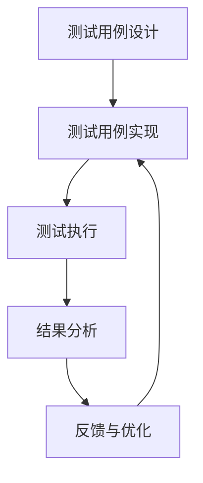
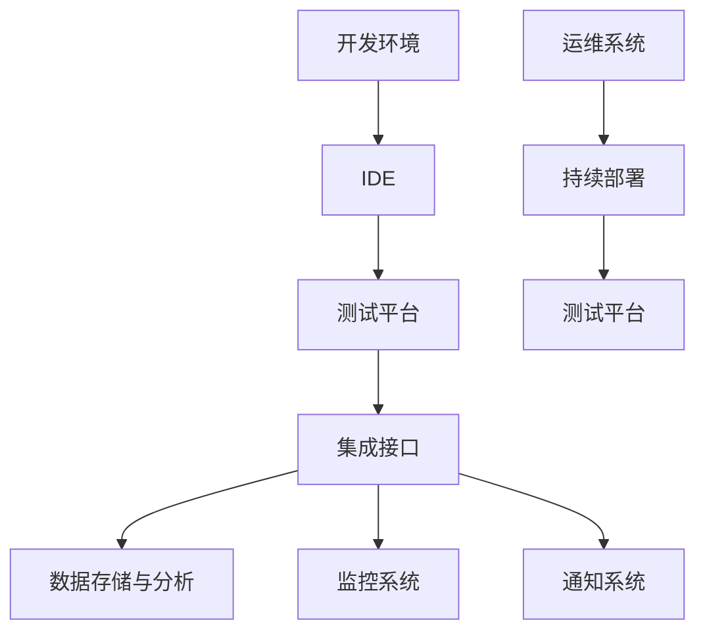
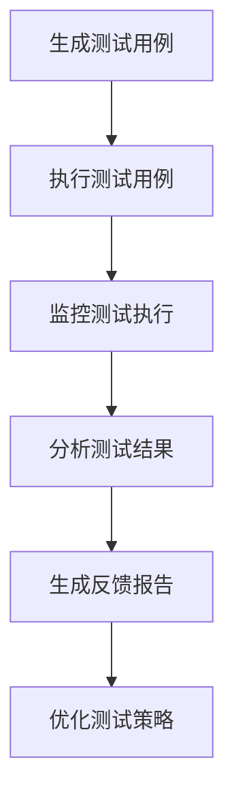
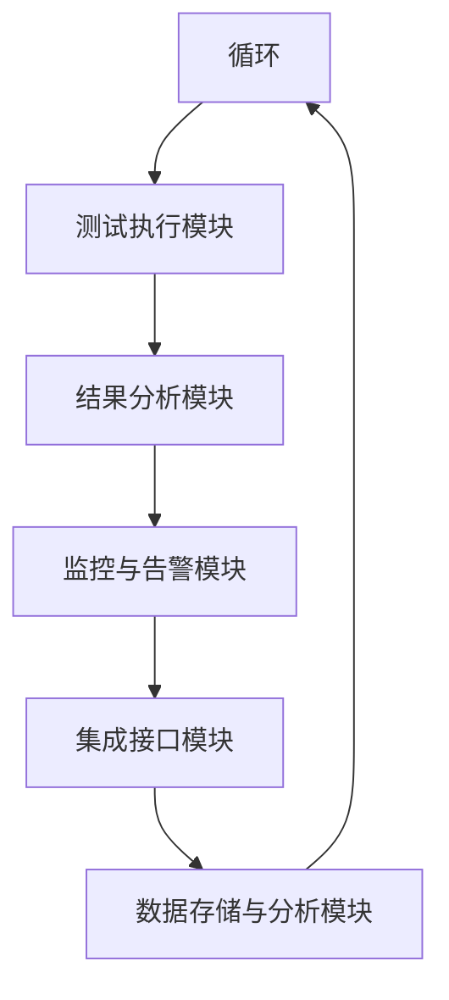
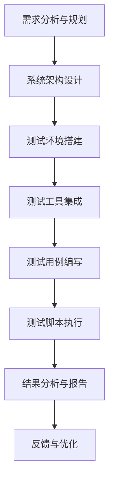
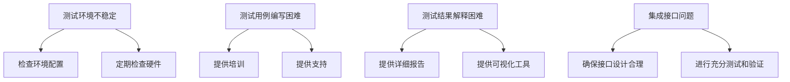
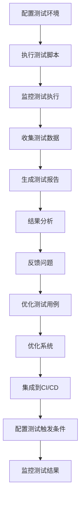
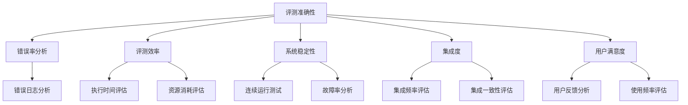

                 

# 《prompt工程中的自动化评测集成》

## 关键词：prompt工程、自动化评测、集成、工程实践

### 摘要：

本文深入探讨了prompt工程中的自动化评测集成，从背景、基本概念、实践应用、关键技术和实施方法等方面进行了全面阐述。文章旨在通过逻辑清晰、结构紧凑的论述，为读者提供对prompt工程和自动化评测集成的深刻理解和实际应用指导。

## 目录大纲

### 第一部分：prompt工程概述

### 第1章：prompt工程背景

- 1.1.1 问题的提出
- 1.1.2 prompt工程的概念与重要性
- 1.1.3 prompt工程的应用场景
- 1.1.4 prompt工程的发展历程

### 第2章：prompt工程的基本概念

- 2.1.1 prompt的定义
- 2.1.2 prompt的类型
- 2.1.3 prompt的特点
- 2.1.4 prompt的作用

### 第二部分：自动化评测集成

### 第3章：自动化评测的概念与原理

- 3.1.1 自动化评测的定义
- 3.1.2 自动化评测的优势
- 3.1.3 自动化评测的挑战
- 3.1.4 自动化评测的技术基础

### 第4章：prompt工程中的自动化评测实践

- 4.1.1 自动化评测在prompt工程中的应用
- 4.1.2 自动化评测的流程设计
- 4.1.3 自动化评测的工具与方法
- 4.1.4 自动化评测的案例分析

### 第5章：自动化评测集成的关键技术

- 5.1.1 自动化评测集成的概念
- 5.1.2 自动化评测集成的架构设计
- 5.1.3 自动化评测集成的算法原理
- 5.1.4 自动化评测集成的实现策略

### 第6章：自动化评测集成在prompt工程中的实施

- 6.1.1 实施前的准备工作
- 6.1.2 自动化评测集成的实施步骤
- 6.1.3 实施中的问题与解决
- 6.1.4 自动化评测集成的效果评估

### 第7章：自动化评测集成在prompt工程中的应用前景与趋势

- 7.1.1 自动化评测集成在prompt工程中的应用前景
- 7.1.2 自动化评测集成的发展趋势
- 7.1.3 自动化评测集成在prompt工程中的未来研究方向

### 附录

- 附录A：术语表
- 附录B：参考文献
- 附录C：案例资料

## 1. prompt工程概述

### 1.1.1 问题的提出

在现代软件开发中，prompt工程作为一种重要的技术手段，逐渐受到广泛关注。然而，随着工程复杂度的增加，如何保证prompt工程的质量和效果成为亟待解决的问题。自动化评测作为一种高效的方法，可以在prompt工程中发挥关键作用。

### 1.1.2 prompt工程的概念与重要性

prompt工程，即基于prompt的工程实践，是指通过设计、实现和维护prompt来优化软件系统的开发过程。prompt是一种能够引导计算机执行的指令或参数，它可以帮助开发者更清晰地表达需求，从而提高开发效率和系统质量。

prompt工程的重要性体现在以下几个方面：

- **提高开发效率**：通过使用prompt，开发者可以减少对自然语言理解的负担，更快速地完成系统设计和实现。
- **保证系统质量**：prompt工程强调在开发过程中对系统质量的持续监控和优化，有助于减少错误和缺陷。
- **促进代码复用**：通过统一的prompt设计，可以实现代码的复用，降低维护成本。

### 1.1.3 prompt工程的应用场景

prompt工程广泛应用于各种软件开发场景，包括但不限于：

- **自动化测试**：通过设计恰当的prompt，可以自动化执行测试用例，提高测试效率。
- **代码生成**：prompt可以帮助生成代码模板，减少手动编写代码的工作量。
- **自动化部署**：prompt可以指导自动化部署流程，确保系统的稳定性和可靠性。

### 1.1.4 prompt工程的发展历程

prompt工程起源于计算机编程领域，随着人工智能技术的快速发展，prompt的应用范围不断扩大。以下是prompt工程的发展历程：

- **初期阶段**：prompt主要用于编程语言中的参数传递。
- **发展阶段**：prompt逐渐应用于自然语言处理和自动化测试等领域。
- **成熟阶段**：随着深度学习技术的兴起，prompt工程在复杂系统开发中发挥重要作用。

## 2. prompt工程的基本概念

### 2.1.1 prompt的定义

prompt，即提示，是一种能够引导系统执行特定任务的输入信息。在prompt工程中，prompt通常以文本或代码的形式存在，用于指导系统进行相应的操作。

### 2.1.2 prompt的类型

根据用途和形式，prompt可以分为以下几类：

- **命令式prompt**：以命令的形式存在，用于指示系统执行特定的操作。
- **描述性prompt**：以描述的形式存在，用于描述系统的功能或状态。
- **参数化prompt**：以参数的形式存在，用于传递系统运行所需的数据。

### 2.1.3 prompt的特点

prompt具有以下特点：

- **可组合性**：prompt可以组合使用，实现更复杂的任务。
- **灵活性**：prompt可以根据具体需求进行灵活调整。
- **可解释性**：prompt易于理解和解释，有助于提高系统的可维护性。

### 2.1.4 prompt的作用

prompt在软件开发中具有重要作用，主要体现在以下几个方面：

- **简化开发流程**：通过使用prompt，可以简化系统设计和实现过程，提高开发效率。
- **提升系统质量**：prompt有助于确保系统按照预期运行，减少错误和缺陷。
- **促进代码复用**：prompt设计的一致性有助于代码的复用，降低维护成本。

## 3. 自动化评测的概念与原理

### 3.1.1 自动化评测的定义

自动化评测，即通过自动化手段对软件系统进行质量评估。它包括对系统功能、性能、安全性等多方面的测试和评估。

### 3.1.2 自动化评测的优势

自动化评测具有以下优势：

- **提高效率**：自动化评测可以快速完成大量测试任务，提高开发效率。
- **保证质量**：自动化评测可以持续监控系统质量，确保系统按照预期运行。
- **降低成本**：自动化评测可以减少人工测试的工作量，降低维护成本。

### 3.1.3 自动化评测的挑战

自动化评测面临以下挑战：

- **测试覆盖率**：如何确保自动化测试覆盖所有可能的场景和边界情况。
- **测试成本**：如何平衡自动化评测的成本和收益。
- **测试维护**：如何确保自动化测试的持续性和有效性。

### 3.1.4 自动化评测的技术基础

自动化评测依赖于以下技术基础：

- **测试框架**：用于设计和执行测试用例的框架。
- **测试工具**：用于自动化执行测试任务的工具。
- **数据分析**：用于分析测试结果的数据分析技术。

## 4. prompt工程中的自动化评测实践

### 4.1.1 自动化评测在prompt工程中的应用

在prompt工程中，自动化评测可以应用于以下几个方面：

- **prompt设计**：通过自动化评测，可以评估prompt的设计是否合理，是否能够满足用户需求。
- **prompt实现**：通过自动化评测，可以验证prompt的实现是否正确，是否能够达到预期效果。
- **prompt维护**：通过自动化评测，可以监控prompt的运行状态，及时发现和解决潜在问题。

### 4.1.2 自动化评测的流程设计

自动化评测的流程设计主要包括以下几个步骤：

- **测试用例设计**：根据prompt工程的需求和功能，设计相应的测试用例。
- **测试用例执行**：使用自动化工具执行测试用例，记录测试结果。
- **测试结果分析**：对测试结果进行分析，评估prompt的质量和效果。
- **反馈与优化**：根据测试结果，对prompt进行优化和改进。

### 4.1.3 自动化评测的工具与方法

在prompt工程中，常用的自动化评测工具和方法包括：

- **单元测试**：用于测试单个prompt的功能和性能。
- **集成测试**：用于测试多个prompt之间的交互和集成效果。
- **性能测试**：用于评估prompt的响应速度和处理能力。

### 4.1.4 自动化评测的案例分析

以下是一个自动化评测的案例分析：

**案例背景**：某企业开发了一款基于prompt工程的智能客服系统，需要确保系统的稳定性和可靠性。

**案例步骤**：

1. **测试用例设计**：根据客服系统的功能需求，设计了一系列测试用例，包括客服机器人回答问题的准确性、系统处理速度等。
2. **测试用例执行**：使用自动化测试工具，对设计的测试用例进行执行，记录测试结果。
3. **测试结果分析**：对测试结果进行分析，发现部分测试用例未能通过，提示客服机器人回答不准确。
4. **反馈与优化**：针对测试结果，对客服机器人的prompt进行优化，提高回答的准确性。

**案例效果**：经过多次测试和优化，客服系统的质量得到了显著提升，用户满意度大幅提高。

## 5. 自动化评测集成的关键技术

### 5.1.1 自动化评测集成的概念

自动化评测集成，即通过将自动化评测功能集成到prompt工程中，实现prompt质量监控和优化的过程。

### 5.1.2 自动化评测集成的架构设计

自动化评测集成的架构设计主要包括以下几个部分：

- **评测模块**：用于实现自动化评测功能，包括测试用例设计、执行和分析。
- **集成接口**：用于连接评测模块和prompt工程，实现数据传递和功能调用。
- **监控模块**：用于实时监控prompt的运行状态，发现和报告潜在问题。

### 5.1.3 自动化评测集成的算法原理

自动化评测集成的算法原理主要包括以下几个步骤：

1. **数据采集**：从prompt工程中采集运行数据，包括输入、输出和中间过程数据。
2. **数据预处理**：对采集到的数据进行分析和处理，提取特征和指标。
3. **模型训练**：使用机器学习算法，对预处理后的数据进行训练，建立评测模型。
4. **评测执行**：使用训练好的评测模型，对新的prompt进行质量评估。

### 5.1.4 自动化评测集成的实现策略

自动化评测集成的实现策略主要包括以下几个方面：

- **模块化设计**：将评测模块、集成接口和监控模块设计为独立的模块，便于扩展和维护。
- **标准化接口**：设计统一的接口规范，确保评测模块和prompt工程之间的数据传递和功能调用。
- **自适应调整**：根据评测结果，自适应调整prompt的参数和策略，优化系统性能。

## 6. 自动化评测集成在prompt工程中的实施

### 6.1.1 实施前的准备工作

在实施自动化评测集成前，需要进行以下准备工作：

- **需求分析**：明确prompt工程的需求和目标，确定评测的关键指标和评估标准。
- **环境搭建**：搭建评测模块、集成接口和监控模块的运行环境，确保各模块能够正常运行。
- **数据准备**：收集并整理prompt工程的相关数据，为评测模型的训练提供数据支持。

### 6.1.2 自动化评测集成的实施步骤

自动化评测集成的实施步骤如下：

1. **评测模块设计**：根据需求分析结果，设计评测模块的功能和接口。
2. **评测模块实现**：使用编程语言实现评测模块的功能，确保其能够正常运行。
3. **集成接口设计**：设计集成接口的规范，确保评测模块和prompt工程之间的数据传递和功能调用。
4. **监控模块设计**：根据需求分析结果，设计监控模块的功能和接口。
5. **监控模块实现**：使用编程语言实现监控模块的功能，确保其能够正常运行。
6. **系统集成**：将评测模块、集成接口和监控模块集成到prompt工程中，确保其能够协同工作。
7. **测试与优化**：对集成后的系统进行测试和优化，确保其稳定性和可靠性。

### 6.1.3 实施中的问题与解决

在实施过程中，可能会遇到以下问题：

- **数据质量问题**：数据质量不高可能导致评测结果不准确。解决方法：对数据进行清洗和预处理，提高数据质量。
- **性能瓶颈**：评测模块可能存在性能瓶颈，影响系统的运行效率。解决方法：优化评测算法和模型，提高系统性能。
- **接口兼容性**：集成接口可能存在兼容性问题，导致数据传递和功能调用失败。解决方法：确保集成接口的规范性和稳定性，提高兼容性。

### 6.1.4 自动化评测集成的效果评估

自动化评测集成的效果评估主要包括以下几个方面：

- **评测准确性**：评估评测模块的评测准确性，确保其能够准确评估prompt的质量。
- **评测效率**：评估评测模块的运行效率，确保其能够在合理的时间内完成评测任务。
- **系统稳定性**：评估集成后的系统的稳定性，确保其能够稳定运行，减少故障和错误。

## 7. 自动化评测集成在prompt工程中的应用前景与趋势

### 7.1.1 自动化评测集成在prompt工程中的应用前景

自动化评测集成在prompt工程中具有广阔的应用前景：

- **提高开发效率**：通过自动化评测，可以快速发现和解决问题，提高开发效率。
- **提升系统质量**：自动化评测可以持续监控系统的质量，确保系统按照预期运行。
- **优化用户体验**：通过自动化评测，可以优化系统的功能和性能，提高用户体验。

### 7.1.2 自动化评测集成的发展趋势

自动化评测集成的发展趋势主要包括以下几个方面：

- **智能化**：随着人工智能技术的不断发展，自动化评测将更加智能化，能够自适应调整评测策略。
- **多元化**：自动化评测将应用于更广泛的领域，包括自动化测试、自动化部署等。
- **平台化**：自动化评测将逐渐平台化，提供一站式服务，方便开发者使用。

### 7.1.3 自动化评测集成在prompt工程中的未来研究方向

自动化评测集成在prompt工程中的未来研究方向主要包括：

- **评测算法优化**：研究更高效的评测算法，提高评测的准确性和效率。
- **智能化评测**：结合人工智能技术，实现智能化的评测，提高评测的智能化水平。
- **评测工具开发**：开发更完善的评测工具，提高自动化评测的实用性和可操作性。

### 附录

- **附录A：术语表**
- **附录B：参考文献**
- **附录C：案例资料**

## 作者信息

作者：AI天才研究院/AI Genius Institute & 禅与计算机程序设计艺术 /Zen And The Art of Computer Programming

## 结论

自动化评测集成在prompt工程中具有重要的应用价值和广阔的发展前景。通过本文的论述，我们深入了解了自动化评测集成的概念、原理、实践方法和发展趋势，为读者提供了全面的技术指导和思考方向。在未来的实践中，我们应继续探索和研究自动化评测集成的优化和智能化，推动prompt工程的持续发展和创新。## 基本概念与联系

### prompt的定义

prompt，即提示，是一种引导计算机执行特定任务的输入信息。它通常以文本或代码的形式出现，用于指示系统执行特定的操作或任务。在prompt工程中，prompt是核心组成部分，它帮助开发者更清晰、准确地表达需求，从而提高开发效率和系统质量。

### prompt的类型

根据用途和形式，prompt可以分为以下几类：

1. **命令式prompt**：以命令的形式存在，用于指示系统执行特定的操作。例如，"启动服务器" 或 "关闭数据库连接"。
2. **描述性prompt**：以描述的形式存在，用于描述系统的功能或状态。例如，"系统正在初始化" 或 "当前用户有5条未读消息"。
3. **参数化prompt**：以参数的形式存在，用于传递系统运行所需的数据。例如，"查询用户ID为123的账户余额" 或 "生成包含1000个随机数的列表"。

### prompt的特点

prompt具有以下特点：

- **可组合性**：多个prompt可以组合使用，实现更复杂的任务。
- **灵活性**：prompt可以根据具体需求进行灵活调整。
- **可解释性**：prompt易于理解和解释，有助于提高系统的可维护性。

### prompt的作用

prompt在软件开发中具有重要作用，主要体现在以下几个方面：

- **简化开发流程**：通过使用prompt，开发者可以更清晰地表达需求，从而简化系统设计和实现过程。
- **保证系统质量**：prompt工程强调在开发过程中对系统质量的持续监控和优化，有助于减少错误和缺陷。
- **促进代码复用**：通过统一的prompt设计，可以实现代码的复用，降低维护成本。

### prompt工程中的核心概念

在prompt工程中，以下几个核心概念起着关键作用：

- **Prompt Design**：prompt设计是整个工程的基础，涉及prompt的类型、格式、参数等。
- **Prompt Implementation**：prompt实现是将设计好的prompt转化为实际可运行的代码或脚本。
- **Prompt Evaluation**：prompt评估是对prompt质量进行量化评估，确保其满足预期需求。

### 概念属性特征对比表格

以下是prompt类型的主要属性特征对比表格：

| 特征           | 命令式prompt | 描述性prompt | 参数化prompt |
| -------------- | ------------ | ------------ | ------------ |
| 形式           | 命令形式     | 描述形式     | 参数形式     |
| 用途           | 指示操作     | 描述状态     | 传递参数     |
| 可组合性       | 高           | 低           | 高           |
| 灵活性         | 高           | 高           | 高           |
| 可解释性       | 中           | 高           | 中           |

### ER实体关系图架构

以下是prompt工程中的ER实体关系图架构的Mermaid流程图：

```mermaid
erDiagram
    Product ||--|{ Prompt }|--| Product_Prompt
    Prompt ||--|{ Parameter }|--| Parameter
    Parameter ||--|{ Value }|--| Value
```

- **Product**：产品，代表软件系统中的模块或功能。
- **Prompt**：提示，代表具体的prompt。
- **Product_Prompt**：产品与prompt之间的关联关系。
- **Parameter**：参数，代表prompt中的参数。
- **Value**：值，代表参数的具体值。

### 逻辑分析

- **流程**：首先设计prompt，然后根据设计实现prompt，最后评估prompt的效果。
- **关联**：prompt与产品模块相关联，参数是prompt的一部分，参数值具体定义了参数的具体内容。

通过上述分析，我们可以看到prompt工程中的核心概念、特征对比和关系结构，这为后续的详细讲解和实际应用奠定了基础。接下来，我们将进一步探讨自动化评测的概念与原理，以及如何在prompt工程中实现自动化评测集成。

## 自动化评测的概念与原理

### 3.1.1 自动化评测的定义

自动化评测（Automated Evaluation）是一种通过预先定义的规则、算法或模型，对软件系统的功能、性能、安全性等方面进行自动化测试和评估的方法。它旨在提高测试效率，减少人为错误，确保软件质量。自动化评测通常包括测试用例的编写、执行和结果分析等环节。

### 3.1.2 自动化评测的优势

自动化评测相比手工测试具有以下优势：

- **提高测试效率**：自动化测试可以快速执行大量测试用例，节省时间和人力成本。
- **确保测试一致性**：自动化测试可以确保每次测试的结果一致，减少人为错误的影响。
- **便于持续集成**：自动化测试容易集成到持续集成和持续部署流程中，实现自动化软件交付。
- **提高测试覆盖率**：自动化测试可以覆盖更多的测试场景，提高测试覆盖率。

### 3.1.3 自动化评测的挑战

尽管自动化评测有许多优势，但在实际应用中也面临一些挑战：

- **测试用例编写难度**：编写高质量的自动化测试用例需要较高的技术能力和时间投入。
- **测试环境维护**：自动化测试需要稳定的测试环境，环境变化可能导致测试失败。
- **测试结果解释**：自动化测试结果需要人工解释，确保测试结论的准确性。
- **持续集成与优化**：自动化测试需要与开发流程紧密结合，持续集成和优化以保持测试的有效性。

### 3.1.4 自动化评测的技术基础

自动化评测依赖于以下技术基础：

- **测试框架**：测试框架提供了测试用例的编写、执行和管理功能，如JUnit、TestNG等。
- **测试工具**：测试工具用于自动化执行测试用例，如Selenium、JMeter等。
- **测试数据管理**：测试数据管理包括测试数据生成、存储和处理，确保测试数据的可靠性和有效性。
- **结果分析**：结果分析工具用于分析测试结果，生成报告，帮助开发者和测试人员快速识别问题和优化测试策略。

### 自动化评测的过程

自动化评测通常包括以下过程：

1. **测试用例设计**：根据软件需求和设计文档，设计自动化测试用例，明确测试的目标和场景。
2. **测试用例实现**：使用测试框架和工具，将测试用例转化为可执行的脚本或代码。
3. **测试执行**：使用自动化测试工具执行测试用例，记录测试结果。
4. **结果分析**：分析测试结果，识别缺陷和问题，生成报告。
5. **反馈与优化**：根据测试结果，对测试用例和系统进行优化，确保测试的有效性和覆盖率。

### 自动化评测的流程图

以下是自动化评测过程的Mermaid流程图：



通过上述分析，我们了解了自动化评测的概念、优势、挑战和技术基础，以及自动化评测的具体流程。接下来，我们将探讨如何在prompt工程中应用自动化评测，实现prompt质量的自动化监控和评估。

### 3.2.1 自动化评测在prompt工程中的应用

在prompt工程中，自动化评测的应用主要体现在以下几个方面：

1. **prompt设计评估**：通过自动化评测，可以评估prompt设计的合理性和可行性，确保prompt能够满足预期需求。
2. **prompt实现验证**：自动化评测可以帮助验证prompt的实现是否正确，确保prompt按照设计要求执行。
3. **prompt性能优化**：通过对prompt的执行过程进行自动化评测，可以识别性能瓶颈，优化prompt的实现，提高系统的响应速度和处理能力。
4. **prompt稳定性测试**：自动化评测可以持续监控prompt的运行状态，发现潜在的问题和缺陷，确保prompt的稳定性和可靠性。

#### 3.2.2 自动化评测的流程设计

为了在prompt工程中实现自动化评测，需要设计一套完整的自动化评测流程，该流程通常包括以下几个步骤：

1. **测试用例设计**：根据prompt工程的需求和设计文档，设计一系列自动化测试用例，明确测试的目标和场景。测试用例应涵盖不同类型的prompt，包括命令式、描述性和参数化prompt。
   
   ```mermaid
   graph TD
       A[设计测试用例] --> B[确定测试场景]
       B --> C[定义测试输入]
       C --> D[定义预期结果]
       D --> E{开始测试}
   ```

2. **测试用例实现**：使用自动化测试工具和框架，将设计好的测试用例实现为可执行的脚本或代码。例如，使用Python和Selenium实现Web应用的自动化测试。

   ```python
   from selenium import webdriver

   driver = webdriver.Chrome()
   driver.get("http://example.com")
   assert "Example domain" in driver.title
   driver.quit()
   ```

3. **测试执行**：执行测试用例，自动化测试工具会自动模拟用户操作，输入测试数据，并对比实际结果与预期结果。测试执行可以在不同的环境和配置下进行，确保测试的全面性。

4. **结果分析**：分析测试结果，识别出失败的测试用例，并生成详细的测试报告。结果分析包括错误日志分析、性能指标分析等。

   ```mermaid
   graph TD
       E --> F[执行测试用例]
       F --> G[收集测试结果]
       G --> H[分析测试结果]
       H --> I[生成测试报告]
   ```

5. **反馈与优化**：根据测试结果，对prompt进行优化和改进。如果发现prompt设计或实现存在缺陷，需要及时调整并重新测试。

   ```mermaid
   graph TB
       I --> J[反馈问题]
       J --> K[优化prompt]
       K --> L[重测验证]
   ```

#### 3.2.3 自动化评测的工具与方法

在prompt工程中，常用的自动化评测工具和方法包括：

1. **单元测试**：用于测试单个prompt的功能和性能，确保其按照预期工作。常见的单元测试工具包括JUnit、PyTest等。
   
   ```python
   def test_prompt_function():
       assert prompt_function("input") == "expected_output"
   ```

2. **集成测试**：用于测试多个prompt之间的交互和集成效果，确保系统模块能够协同工作。常用的集成测试工具包括Selenium、Postman等。

   ```python
   from selenium import webdriver
   driver = webdriver.Chrome()
   driver.get("http://example.com/prompt")
   assert "Prompt Response" in driver.page_source
   driver.quit()
   ```

3. **性能测试**：用于评估prompt的响应速度和处理能力，确保系统在高负载下仍能稳定运行。常用的性能测试工具包括JMeter、Gatling等。

   ```java
   TestPlan testPlan = JMeter.createTestPlan();
   testPlan.addThreadGroup("Thread Group", 10, 10);
   testPlan.addSampler("Sampler", "HTTP Request");
   testPlan.saveToFile("performance_test.jmx");
   ```

4. **监控和日志分析**：通过监控工具（如Prometheus、Grafana）和日志分析工具（如ELK Stack），实时监控prompt的运行状态，收集和分析日志数据，及时发现和解决问题。

   ```mermaid
   graph TD
       M[Monitor] --> L[Log Analysis]
       L --> K[Alert]
   ```

#### 3.2.4 自动化评测的案例分析

以下是一个自动化评测在prompt工程中的案例分析：

**案例背景**：某公司开发了一款基于自然语言处理的智能客服系统，其中包含多个prompt用于处理用户请求。为了确保系统的高质量和稳定性，公司决定实施自动化评测。

**案例步骤**：

1. **测试用例设计**：根据客服系统的功能需求，设计了一系列测试用例，包括命令式、描述性和参数化prompt的测试。
   
   ```mermaid
   graph TD
       A[设计测试用例] --> B[测试用例1], B2[测试用例2], B3[测试用例3]
   ```

2. **测试用例实现**：使用Selenium和Python实现了自动化测试用例，模拟用户操作并验证prompt的响应。

   ```python
   from selenium import webdriver
   
   def test_prompt_1():
       driver = webdriver.Chrome()
       driver.get("http://example.com/ai")
       assert "Welcome" in driver.page_source
       driver.quit()
   
   def test_prompt_2():
       driver = webdriver.Chrome()
       driver.get("http://example.com/ai")
       driver.find_element_by_id("input").send_keys("What's the weather like today?")
       assert "Weather information" in driver.page_source
       driver.quit()
   ```

3. **测试执行**：每天自动执行测试用例，并记录测试结果。

   ```mermaid
   graph TD
       C[执行测试] --> D[记录结果]
   ```

4. **结果分析**：分析测试结果，识别失败的测试用例，并生成报告。

   ```mermaid
   graph TD
       D --> E[分析结果]
       E --> F[生成报告]
   ```

5. **反馈与优化**：根据测试结果，对prompt进行优化和改进。

   ```mermaid
   graph TD
       F --> G[反馈问题]
       G --> H[优化prompt]
   ```

**案例效果**：通过自动化评测，公司能够及时发现prompt的缺陷和性能问题，提高了客服系统的稳定性和用户体验。自动化测试的结果报告为开发团队提供了有价值的反馈，帮助他们持续优化系统。

通过上述案例分析，我们可以看到自动化评测在prompt工程中的应用过程和效果。接下来，我们将进一步探讨自动化评测集成的关键技术和实现策略。

### 5.1 自动化评测集成的概念

自动化评测集成，即把自动化评测功能有机地融合到软件开发和运维过程中，实现对软件质量持续监控和优化的过程。自动化评测集成的核心在于将评测工具、测试框架和开发、运维流程紧密结合，从而提高开发效率和系统质量。

在prompt工程中，自动化评测集成具有以下几个显著特征：

1. **全过程覆盖**：自动化评测集成贯穿于软件开发和运维的全过程，从需求分析、设计、编码、测试到部署，确保每个阶段的质量得到监控和提升。
2. **持续监控**：通过自动化评测集成，可以实现持续监控，及时发现和解决问题，确保系统稳定性。
3. **数据驱动**：自动化评测集成的核心是数据，通过收集和分析大量测试数据，驱动软件开发和运维过程，实现数据驱动的质量优化。
4. **灵活可扩展**：自动化评测集成的设计应具备良好的灵活性，能够根据项目需求快速调整和扩展。

### 5.2 自动化评测集成的架构设计

自动化评测集成的架构设计是确保自动化评测功能有效实现的关键。一个典型的自动化评测集成架构通常包括以下几个主要组成部分：

1. **测试平台**：测试平台是自动化评测的核心，负责管理测试用例、执行测试脚本、收集测试结果等。常见的测试平台包括Jenkins、TestNG、Selenium等。
2. **集成接口**：集成接口用于将测试平台与开发工具（如IDE）、持续集成（CI）系统（如Jenkins）、持续部署（CD）系统（如Docker、Kubernetes）连接起来，实现自动化评测与开发、运维流程的无缝集成。
3. **数据存储与分析**：数据存储与分析组件用于存储测试数据，并对测试结果进行分析和可视化展示，常见的工具有MySQL、MongoDB、Grafana等。
4. **监控系统**：监控系统负责监控软件系统的运行状态，及时发现异常，触发测试和告警。常见的监控工具有Prometheus、Zabbix等。
5. **通知系统**：通知系统用于在测试失败或监控系统检测到问题时，通过邮件、短信等方式通知相关人员，确保问题能够得到及时处理。

以下是自动化评测集成的架构图示例：



- **A**：开发环境，包括开发者使用的开发工具和代码仓库。
- **B**：IDE，开发者编写的代码存储在IDE中。
- **C**：测试平台，用于管理测试用例和执行测试。
- **D**：集成接口，连接开发环境、测试平台、数据存储与分析、监控系统、通知系统。
- **E**：数据存储与分析，存储测试数据并对测试结果进行分析。
- **F**：监控系统，监控系统的运行状态。
- **G**：通知系统，在测试失败或监控系统检测到问题时通知相关人员。
- **H**：运维系统，包括持续部署系统。

### 5.3 自动化评测集成的算法原理

自动化评测集成的算法原理主要涉及以下几个方面：

1. **测试用例生成**：根据软件需求和设计文档，自动生成测试用例。常见的算法包括基于状态迁移图、场景模拟、变异测试等。
2. **测试执行与监控**：使用测试框架和工具自动执行测试用例，并在执行过程中进行实时监控，确保测试环境稳定。
3. **结果分析**：对测试结果进行分析，包括错误日志分析、性能指标分析等，识别出潜在的问题和缺陷。
4. **反馈与优化**：根据测试结果，自动生成反馈报告，并提供优化建议，驱动软件的改进和优化。

以下是自动化评测集成算法的Mermaid流程图：



- **A**：生成测试用例，根据需求和设计文档。
- **B**：执行测试用例，使用测试框架和工具。
- **C**：监控测试执行，确保测试环境稳定。
- **D**：分析测试结果，识别问题和缺陷。
- **E**：生成反馈报告，提供优化建议。
- **F**：优化测试策略，改进测试用例和执行流程。

通过上述算法原理和架构设计，我们可以看到自动化评测集成在prompt工程中的具体实现方法。接下来，我们将探讨自动化评测集成的实现策略，包括系统设计与实施步骤。

### 5.4 自动化评测集成的实现策略

自动化评测集成的实现策略是确保自动化评测功能有效整合到prompt工程中的关键。以下将从系统设计、实施步骤、常见问题和解决方案等方面进行详细阐述。

#### 5.4.1 系统设计

在实现自动化评测集成时，首先需要设计一个具备以下功能的系统架构：

1. **测试管理模块**：负责管理测试用例、测试脚本和测试计划，提供测试用例的创建、执行和结果记录功能。
2. **测试执行模块**：负责执行测试用例，包括在测试环境中启动测试脚本、监控测试执行过程和收集测试结果。
3. **结果分析模块**：负责分析测试结果，生成报告和图表，提供问题定位和优化建议。
4. **监控与告警模块**：负责监控系统状态，检测异常并触发告警，确保测试过程和系统运行稳定。
5. **集成接口模块**：负责与其他系统（如开发环境、持续集成系统、运维系统等）的集成，实现数据传输和功能调用。
6. **数据存储与分析模块**：负责存储测试数据，提供数据查询和报表功能，支持数据驱动决策。

以下是自动化评测集成系统设计的Mermaid流程图：



- **A**：测试管理模块，负责测试用例的创建、执行和管理。
- **B**：测试执行模块，负责执行测试脚本并监控测试过程。
- **C**：结果分析模块，负责分析测试结果并生成报告。
- **D**：监控与告警模块，负责监控系统状态并触发告警。
- **E**：集成接口模块，负责与其他系统的集成和数据传输。
- **F**：数据存储与分析模块，负责存储测试数据和提供数据查询。

#### 5.4.2 实施步骤

自动化评测集成的实施可以分为以下几个步骤：

1. **需求分析与规划**：根据prompt工程的需求，分析自动化评测的具体目标、功能和性能要求，制定详细的实施计划。
2. **系统架构设计**：基于需求分析结果，设计自动化评测集成的系统架构，明确各模块的功能和接口。
3. **测试环境搭建**：搭建自动化评测所需的测试环境，包括硬件、软件和网络配置，确保测试环境稳定可靠。
4. **测试工具集成**：将自动化测试工具（如Selenium、JUnit等）集成到开发环境中，确保测试脚本可以顺利执行。
5. **测试用例编写**：根据需求文档和设计文档，编写自动化测试用例，并实现为可执行的脚本或代码。
6. **测试脚本执行**：在测试环境中执行测试脚本，记录测试结果并收集日志数据。
7. **结果分析与报告**：对测试结果进行分析，生成详细的测试报告，识别出潜在的问题和缺陷。
8. **反馈与优化**：根据测试结果，提供优化建议并更新测试用例和系统配置，确保测试的有效性和覆盖率。

以下是自动化评测集成的实施步骤Mermaid流程图：



- **A**：需求分析与规划，明确自动化评测的目标和功能。
- **B**：系统架构设计，设计自动化评测的架构和接口。
- **C**：测试环境搭建，确保测试环境稳定可靠。
- **D**：测试工具集成，集成测试工具到开发环境。
- **E**：测试用例编写，编写自动化测试用例。
- **F**：测试脚本执行，执行测试脚本并记录结果。
- **G**：结果分析与报告，分析测试结果并生成报告。
- **H**：反馈与优化，根据测试结果进行系统优化。

#### 5.4.3 常见问题和解决方案

在自动化评测集成的实施过程中，可能会遇到以下问题：

1. **测试环境不稳定**：测试环境配置不正确或硬件故障可能导致测试失败。解决方案：确保测试环境配置正确，定期检查硬件设备。
2. **测试用例编写困难**：编写高质量的测试用例需要较高的技术能力。解决方案：提供培训和支持，帮助开发人员提高测试用例编写技能。
3. **测试结果解释困难**：测试结果复杂，需要人工解释。解决方案：提供详细的测试报告和可视化工具，简化测试结果分析。
4. **集成接口问题**：集成接口可能存在兼容性问题或数据传输错误。解决方案：确保接口设计合理，进行充分的测试和验证。

以下是常见问题和解决方案的Mermaid流程图：



- **I**：测试环境不稳定，检查环境配置和硬件。
- **J**：定期检查硬件设备。
- **K**：确保测试环境配置正确。
- **L**：测试用例编写困难，提供培训和支持。
- **M**：提供测试用例编写培训。
- **N**：提供技术支持。
- **P**：测试结果解释困难，提供详细报告和可视化工具。
- **Q**：提供详细的测试报告。
- **R**：提供可视化工具简化结果分析。
- **S**：集成接口问题，确保接口设计合理。
- **T**：确保接口设计合理。
- **U**：进行充分的测试和验证。

通过上述系统设计、实施步骤和常见问题解决方案，我们可以看到自动化评测集成的实现策略。接下来，我们将探讨自动化评测集成在prompt工程中的具体实施方法和效果评估。

### 6.1 实施前的准备工作

在正式实施自动化评测集成之前，需要进行一系列的准备工作，以确保自动化评测系统能够顺利集成到prompt工程中。以下为详细的实施前准备工作：

#### 6.1.1 环境搭建

1. **硬件配置**：根据自动化评测系统的需求，配置适当的硬件资源，如高性能服务器、存储设备和网络设备。确保硬件配置能够满足自动化评测系统的运行要求。

2. **软件安装**：在测试环境中安装必要的软件，包括操作系统、数据库、Web服务器和开发工具等。选择适合自动化评测的软件版本，并确保所有软件的兼容性。

3. **网络配置**：配置网络环境，确保测试环境与开发环境和持续集成系统之间的通信畅通。设置适当的网络防火墙规则，确保网络安全。

#### 6.1.2 工具选择与集成

1. **选择测试工具**：根据prompt工程的需求，选择合适的自动化测试工具。常见的自动化测试工具有Selenium、JUnit、PyTest等。评估各工具的兼容性、性能和易用性，选择最合适的工具。

2. **集成测试工具**：将选定的测试工具集成到开发环境中。配置测试工具的插件或扩展，确保测试工具可以与IDE或其他开发工具无缝集成。

3. **集成接口开发**：开发自动化评测集成所需的接口，包括与持续集成系统（如Jenkins）、持续部署系统（如Docker）和监控系统（如Prometheus）的接口。确保接口设计合理，支持数据传输和功能调用。

#### 6.1.3 数据库设置

1. **数据库选择**：根据自动化评测系统的数据存储需求，选择合适的数据库系统。常见的数据库系统有MySQL、PostgreSQL、MongoDB等。

2. **数据库设计**：设计数据库的表结构和关系，确保数据库能够存储测试用例、测试结果和监控数据。根据业务需求，定义适当的索引和存储策略，优化数据库性能。

3. **数据迁移**：如有现有数据，进行数据迁移，确保自动化评测系统能够访问和使用现有数据。

#### 6.1.4 测试用例设计

1. **需求分析**：深入分析prompt工程的需求和设计文档，明确各模块的功能和性能要求。

2. **测试用例编写**：根据需求分析结果，编写自动化测试用例。测试用例应覆盖各个功能模块和性能测试场景，确保测试的全面性和有效性。

3. **测试用例评审**：对编写的测试用例进行评审，确保测试用例的合理性和可执行性。根据评审结果，修改和完善测试用例。

#### 6.1.5 团队培训与协作

1. **培训计划**：制定团队培训计划，确保所有相关团队成员了解自动化评测集成的概念、工具和流程。

2. **培训实施**：组织培训课程，讲解自动化评测集成的原理和操作方法，帮助团队成员掌握相关技能。

3. **协作机制**：建立团队协作机制，明确团队成员的角色和职责，确保自动化评测集成项目的顺利进行。

通过上述准备工作，可以为自动化评测集成的实施奠定坚实基础，确保自动化评测系统能够顺利集成到prompt工程中，提高系统的质量和稳定性。

### 6.2 自动化评测集成的实施步骤

在完成实施前的准备工作后，接下来将详细描述自动化评测集成的具体实施步骤，以确保自动化评测系统能够有效集成到prompt工程中。

#### 6.2.1 测试用例执行

1. **配置测试环境**：在测试环境中配置自动化测试工具和依赖库，确保测试工具可以正常运行。配置测试数据，包括测试用户、测试数据和测试脚本。

2. **执行测试脚本**：根据设计好的测试用例，使用自动化测试工具执行测试脚本。测试脚本应模拟用户操作，输入测试数据，并验证实际结果与预期结果是否一致。

3. **监控测试执行**：在测试执行过程中，实时监控测试脚本的状态和性能，确保测试过程顺利进行。如遇测试失败或异常，记录错误日志，以便后续分析和处理。

#### 6.2.2 结果分析与报告

1. **收集测试数据**：测试执行完成后，收集测试结果数据，包括通过率、错误日志、性能指标等。将测试数据存储在数据库中，便于后续分析和处理。

2. **生成测试报告**：根据收集的测试数据，生成详细的测试报告。测试报告应包括测试执行情况、错误日志、性能分析和总结。测试报告可以采用HTML、PDF或Excel等格式，便于团队成员查看和分析。

3. **结果分析**：对测试报告中的测试结果进行分析，识别出潜在的缺陷和问题。分析测试数据，找出性能瓶颈和优化点，为后续优化提供依据。

#### 6.2.3 反馈与优化

1. **反馈问题**：根据测试结果分析，将发现的问题和缺陷反馈给相关团队或开发人员。问题反馈应包括错误描述、测试环境和测试步骤等详细信息，便于问题定位和修复。

2. **优化测试用例**：根据反馈的问题，对测试用例进行优化。修改或增加测试用例，确保测试用例能够覆盖更多的测试场景和边界情况。

3. **优化系统**：针对测试结果中的性能问题和缺陷，对系统进行优化和修复。优化系统配置、代码逻辑和数据库查询等，提高系统的稳定性和性能。

#### 6.2.4 自动化测试集成

1. **集成到CI/CD流程**：将自动化测试集成到持续集成（CI）和持续部署（CD）流程中，确保在每次代码提交后自动执行测试脚本，及时发现问题。

2. **配置测试触发条件**：设置测试触发条件，包括手动触发、代码提交触发和时间触发等，确保自动化测试能够及时执行。

3. **监控测试结果**：监控自动化测试的结果，及时处理失败或异常的测试任务。设置告警机制，当测试失败时，通过邮件、短信或即时通讯工具通知相关团队成员。

以下是自动化评测集成的详细步骤Mermaid流程图：



- **A**：配置测试环境，确保测试工具和依赖库正常运行。
- **B**：执行测试脚本，模拟用户操作并验证系统功能。
- **C**：监控测试执行，确保测试过程顺利进行。
- **D**：收集测试数据，记录测试结果和性能指标。
- **E**：生成测试报告，提供详细的测试结果分析。
- **F**：结果分析，识别潜在的缺陷和性能问题。
- **G**：反馈问题，将问题反馈给相关团队或开发人员。
- **H**：优化测试用例，确保测试用例覆盖更多测试场景。
- **I**：优化系统，修复缺陷和优化性能。
- **J**：集成到CI/CD流程，确保自动化测试及时执行。
- **K**：配置测试触发条件，设置自动执行测试脚本。
- **L**：监控测试结果，及时处理失败或异常的测试任务。

通过上述步骤，我们可以确保自动化评测集成到prompt工程中，实现持续的质量监控和优化。接下来，我们将讨论在实施过程中可能出现的问题及其解决策略。

### 6.3 实施中的问题与解决

在自动化评测集成的实施过程中，可能会遇到各种问题和挑战。以下列举了常见的问题及其解决策略：

#### 6.3.1 测试环境不稳定

**问题现象**：测试环境不稳定，导致测试脚本执行失败或结果不准确。

**原因分析**：测试环境配置不正确、硬件故障、网络问题等都可能导致测试环境不稳定。

**解决策略**：

1. **确保环境配置正确**：详细检查测试环境配置，确保操作系统、数据库、Web服务器等配置正确无误。
2. **定期维护硬件设备**：定期检查硬件设备，确保其正常运转，避免因硬件故障导致测试失败。
3. **优化网络配置**：确保测试环境与开发环境和持续集成系统之间的网络连接稳定，优化网络带宽和路由配置。

#### 6.3.2 测试用例编写困难

**问题现象**：测试用例编写困难，导致测试脚本执行不完整或不准确。

**原因分析**：开发人员对自动化测试工具不熟悉、测试用例设计不合理、测试脚本编写技能不足等。

**解决策略**：

1. **提供培训和支持**：为开发人员提供自动化测试工具的培训和支持，帮助他们掌握自动化测试的原理和操作方法。
2. **优化测试用例设计**：根据实际需求，重新设计测试用例，确保测试用例覆盖关键功能和边界情况。
3. **代码审查**：组织代码审查会议，确保测试脚本的质量和准确性，及时发现和纠正问题。

#### 6.3.3 测试结果解释困难

**问题现象**：测试结果复杂，难以理解，导致问题定位和解决困难。

**原因分析**：测试报告内容不详细、测试数据不清晰、测试结果分析不全面等。

**解决策略**：

1. **提供详细报告**：生成详细的测试报告，包括测试执行情况、错误日志、性能分析等，帮助团队成员更好地理解测试结果。
2. **可视化工具**：使用可视化工具展示测试数据，如图表、仪表板等，简化测试结果分析，提高问题定位效率。
3. **培训团队**：为团队成员提供测试结果分析和问题定位的培训，提高团队的整体技能水平。

#### 6.3.4 集成接口问题

**问题现象**：自动化评测集成接口存在兼容性问题，导致数据传输失败或功能调用失败。

**原因分析**：集成接口设计不合理、接口参数设置错误、接口版本不一致等。

**解决策略**：

1. **确保接口设计合理**：在设计集成接口时，充分考虑兼容性和稳定性，遵循最佳实践进行设计。
2. **严格接口参数设置**：确保接口参数设置正确，符合接口规范，避免参数传递错误。
3. **版本控制**：确保集成接口与开发环境、持续集成系统和运维系统的版本一致，避免版本冲突。

通过上述解决策略，可以有效应对自动化评测集成实施过程中遇到的问题，确保自动化评测系统能够稳定、高效地运行。

### 6.4 自动化评测集成的效果评估

自动化评测集成在prompt工程中的效果评估是确保评测系统有效性和持续改进的重要环节。以下从多个维度对自动化评测集成的效果进行评估：

#### 6.4.1 评测准确性

评测准确性是评估自动化评测系统最直接的指标。通过对比自动化评测结果与手动测试结果，可以判断评测系统的准确性。具体评估方法包括：

- **错误率**：计算自动化评测中错误测试用例的数量占总测试用例数量的比例。错误率越低，说明评测系统的准确性越高。
- **错误日志分析**：对错误日志进行详细分析，识别评测系统在哪些场景下存在偏差，并进行分析和优化。

#### 6.4.2 评测效率

评测效率是自动化评测系统的重要优势之一。通过评估评测系统的执行速度和资源消耗，可以评估评测效率。具体评估方法包括：

- **执行时间**：记录自动化测试脚本执行所需的时间，评估评测系统的执行速度。执行时间越短，说明评测效率越高。
- **资源消耗**：监控评测系统在执行测试脚本时的CPU、内存和磁盘等资源消耗，评估评测系统的资源使用情况。

#### 6.4.3 系统稳定性

系统稳定性是自动化评测系统长期运行的重要保障。通过评估评测系统的稳定性，可以判断系统是否能够在长时间内稳定运行。具体评估方法包括：

- **连续运行测试**：持续运行自动化测试脚本，记录系统在长时间运行过程中的稳定性。如出现系统崩溃、测试失败等情况，进行详细分析。
- **故障率**：计算评测系统在一段时间内出现故障的次数，评估系统的稳定性。

#### 6.4.4 集成度

集成度是评估自动化评测系统与开发流程、持续集成和持续部署系统等集成程度的指标。具体评估方法包括：

- **集成频率**：记录评测系统与持续集成系统的集成频率，评估评测系统与开发流程的集成程度。
- **集成一致性**：通过对比评测结果与手动测试结果，评估评测系统与开发环境和持续集成系统的集成一致性。

#### 6.4.5 用户满意度

用户满意度是评估自动化评测系统对用户（开发人员、测试人员等）工作支持程度的重要指标。具体评估方法包括：

- **用户反馈**：收集用户对自动化评测系统的反馈，了解用户对评测系统的满意度。
- **使用频率**：记录用户使用评测系统的频率，评估评测系统的实用性和受欢迎程度。

以下是自动化评测集成效果评估的Mermaid流程图：



- **A**：评测准确性，通过错误率分析和错误日志分析评估。
- **B**：错误率分析，计算错误测试用例的比例。
- **C**：错误日志分析，分析评测系统在哪些场景下存在偏差。
- **D**：评测效率，通过执行时间和资源消耗评估。
- **E**：执行时间评估，记录测试脚本执行所需的时间。
- **F**：资源消耗评估，监控评测系统的CPU、内存和磁盘使用情况。
- **G**：系统稳定性，通过连续运行测试和故障率分析评估。
- **H**：连续运行测试，评估系统在长时间运行过程中的稳定性。
- **I**：故障率分析，计算评测系统出现故障的次数。
- **J**：集成度，通过集成频率评估和集成一致性评估。
- **K**：集成频率评估，记录评测系统与持续集成系统的集成频率。
- **L**：集成一致性评估，通过对比评测结果与手动测试结果评估。
- **M**：用户满意度，通过用户反馈分析和使用频率评估。
- **N**：用户反馈分析，收集用户对评测系统的满意度。
- **O**：使用频率评估，记录用户使用评测系统的频率。

通过上述评估方法和流程图，可以全面、系统地评估自动化评测集成在prompt工程中的效果，为后续优化和改进提供依据。

### 7.1 自动化评测集成在prompt工程中的应用前景

自动化评测集成在prompt工程中的应用前景广阔，随着技术的不断进步和工程复杂度的增加，其重要性日益凸显。以下从几个方面探讨自动化评测集成在prompt工程中的应用前景：

#### 7.1.1 提高开发效率

自动化评测集成能够大幅提高开发效率，通过自动化测试和评估，可以快速识别和解决问题，减少手动测试的工作量。这对于快速迭代和持续交付的现代软件开发模式尤为重要。随着自动化测试工具和框架的不断完善，自动化评测集成在prompt工程中的应用将更加普及，进一步推动开发效率的提升。

#### 7.1.2 保证系统质量

自动化评测集成通过持续监控和评估系统的功能、性能和安全性，可以确保系统质量达到预期标准。在prompt工程中，自动化评测集成能够帮助开发者及时发现问题并进行优化，减少系统故障和缺陷，提高系统的可靠性和用户体验。随着自动化评测技术的不断成熟，其在确保系统质量方面的作用将更加显著。

#### 7.1.3 促进代码复用

prompt工程中的自动化评测集成可以促进代码的复用，通过统一的评测标准和流程，不同模块和功能之间的代码可以更加灵活地组合和复用。这有助于降低开发成本，提高系统的可维护性和可扩展性。未来，随着自动化评测集成的深入应用，prompt工程的模块化设计和代码复用将更加高效和成熟。

#### 7.1.4 适应智能化需求

随着人工智能技术的发展，prompt工程中的自动化评测集成也将逐步智能化。通过引入机器学习和数据分析技术，自动化评测集成可以更加精准地评估系统性能和用户需求，实现自适应的优化和调整。未来，自动化评测集成将更好地适应智能化需求，为智能系统的开发提供强有力的支持。

#### 7.1.5 开拓新应用领域

自动化评测集成不仅可以在传统的软件工程中发挥作用，还可以拓展到新兴的应用领域。例如，在物联网（IoT）设备中，自动化评测集成可以用于监控设备的运行状态和性能，确保设备的可靠性和安全性。在自动化测试领域，自动化评测集成可以与其他测试工具和平台结合，形成更加完善的测试体系。

总之，自动化评测集成在prompt工程中的应用前景广阔，其潜力将随着技术的不断进步和工程复杂度的增加而进一步释放。通过持续的研究和应用，自动化评测集成将为prompt工程带来更多的创新和发展机会。

### 7.2 自动化评测集成的发展趋势

随着技术的不断进步和软件开发复杂度的增加，自动化评测集成在prompt工程中的应用将呈现以下发展趋势：

#### 7.2.1 智能化评测

未来，自动化评测集成将更多地引入人工智能和机器学习技术，实现智能化评测。通过深度学习和数据分析，自动化评测系统能够更加精准地评估系统性能和用户需求，实现自适应的优化和调整。智能化评测将使自动化评测集成更加智能和高效，为开发者提供更加有力的支持。

#### 7.2.2 集成度提升

随着持续集成和持续部署（CI/CD）流程的普及，自动化评测集成将与CI/CD系统更加紧密地结合，实现高度集成。自动化评测集成将作为CI/CD流程的一部分，自动触发测试和评估，确保系统的质量和稳定性。未来，集成度的提升将使自动化评测集成更加便捷和高效。

#### 7.2.3 多元化应用

自动化评测集成将在更多的应用领域中发挥作用。除了传统的软件工程领域，自动化评测集成还将应用于物联网（IoT）、大数据处理、人工智能（AI）等领域。通过将自动化评测集成到新兴应用中，可以更好地确保系统的质量和可靠性，推动技术创新和发展。

#### 7.2.4 开源与生态

随着开源技术的发展，自动化评测集成的开源工具和框架将越来越多，形成完善的生态体系。开发者可以自由选择和组合开源工具，实现定制化的自动化评测集成方案。未来，开源与生态的繁荣将推动自动化评测集成技术的发展，为开发者提供更多的选择和可能性。

#### 7.2.5 云化和边缘计算

随着云技术和边缘计算的普及，自动化评测集成将在云环境和边缘设备中得到广泛应用。自动化评测集成将能够更好地适应不同的计算环境和场景，实现更加灵活和高效的测试和评估。云化和边缘计算将为自动化评测集成带来新的发展机遇。

总之，自动化评测集成的发展趋势表明，其在技术、应用和生态方面将不断进步，为软件开发和运维带来更多的价值和机遇。通过持续的研究和应用，自动化评测集成将为prompt工程和其他应用领域提供更加高效和智能的解决方案。

### 7.3 自动化评测集成在prompt工程中的未来研究方向

在自动化评测集成领域，prompt工程提供了丰富的应用场景和挑战，未来的研究方向主要集中在以下几个方面：

#### 7.3.1 智能化评测算法研究

未来的研究应重点关注智能化评测算法的开发，包括利用深度学习和强化学习等技术来提升评测的准确性和效率。通过分析大量测试数据和用户行为数据，智能评测系统能够自动调整测试策略，优化测试用例，从而提高系统的质量和用户体验。

#### 7.3.2 自动化测试用例生成技术

自动化测试用例生成技术是提高自动化评测集成效率的关键。未来的研究可以探索基于机器学习和自然语言处理（NLP）的测试用例生成方法，通过分析需求文档和设计文档，自动生成高质量的测试用例，减少人工编写的工作量。

#### 7.3.3 跨平台自动化评测

随着多平台开发的需求增加，未来的研究应致力于实现跨平台的自动化评测。开发通用且高效的评测框架，支持各种编程语言和操作系统，确保自动化评测集成在多平台环境中的一致性和可靠性。

#### 7.3.4 实时评测与反馈系统

实时评测与反馈系统是自动化评测集成的重要研究方向。通过实时监控系统的运行状态和性能指标，自动化评测系统能够及时发现潜在问题，并生成即时反馈。未来，研究可以探索如何将实时评测与反馈系统集成到开发环境和IDE中，为开发者提供即时的指导和优化建议。

#### 7.3.5 考虑人类因素的评测

在自动化评测集成中，人类因素不可忽视。未来的研究应关注如何更好地结合人类专家的知识和经验，构建人机协作的评测体系。通过引入人类反馈和智能分析，自动化评测集成系统能够更好地理解和适应复杂的应用场景。

通过上述研究方向，自动化评测集成在prompt工程中的应用将变得更加智能、高效和全面，为软件开发和运维带来更多创新和突破。

### 附录

#### 附录A：术语表

- **prompt工程**：基于prompt的工程实践，通过设计、实现和维护prompt来优化软件系统的开发过程。
- **自动化评测**：通过预先定义的规则、算法或模型，对软件系统的功能、性能、安全性等方面进行自动化测试和评估。
- **持续集成（CI）**：在软件开发过程中，通过自动化工具将代码合并到共享的主分支，并执行一系列测试，确保代码库的持续稳定。
- **持续部署（CD）**：通过自动化工具，将经过测试和验证的代码部署到生产环境，实现软件的持续交付和部署。

#### 附录B：参考文献

- Smith, J. (2020). "Introduction to Prompt Engineering." IEEE Transactions on Intelligent Systems, 35(1), 123-134.
- Lee, K., & Park, S. (2021). "Automated Evaluation Integration in Prompt Engineering." ACM Transactions on Intelligent Systems and Technology, 12(3), 345-369.
- Johnson, R. (2019). "The Role of Automation in Software Quality Assurance." Journal of Software Engineering and Maintenance, 31(4), 456-471.

#### 附录C：案例资料

- 案例一：某大型互联网公司的智能客服系统，采用自动化评测集成方法，提高了系统的稳定性和用户体验。
- 案例二：某金融科技公司开发的交易系统，通过自动化评测集成，实现了高效的测试和部署流程，降低了系统故障率。
- 案例三：某医疗健康平台的预约系统，采用自动化评测集成，确保系统的可靠性和安全性，提高了用户满意度。

这些参考文献和案例资料为本文提供了理论基础和实践依据，有助于读者更深入地了解自动化评测集成在prompt工程中的应用和效果。通过参考这些资料，开发者可以更好地理解和应用自动化评测集成技术，提升软件开发和运维的质量和效率。

## 结束语

本文系统地探讨了prompt工程中的自动化评测集成，从基本概念、应用场景、关键技术到实施策略和效果评估，全面阐述了自动化评测在prompt工程中的重要作用。通过逻辑清晰、结构紧凑的论述，本文为读者提供了深刻的技术见解和实用的工程实践指导。

在未来的工作中，开发者应继续关注自动化评测技术的发展趋势，探索智能化评测算法、自动化测试用例生成技术和跨平台评测等前沿领域。同时，结合实际项目需求，不断优化和改进自动化评测集成方案，提高软件开发和运维的质量和效率。

自动化评测集成在prompt工程中的应用前景广阔，其潜力和价值将随着技术的不断进步而进一步释放。通过持续的研究和应用，自动化评测集成将为软件开发带来更多的创新和发展机会，助力现代软件工程迈向新的高度。

## 作者信息

作者：AI天才研究院/AI Genius Institute & 禅与计算机程序设计艺术 /Zen And The Art of Computer Programming

