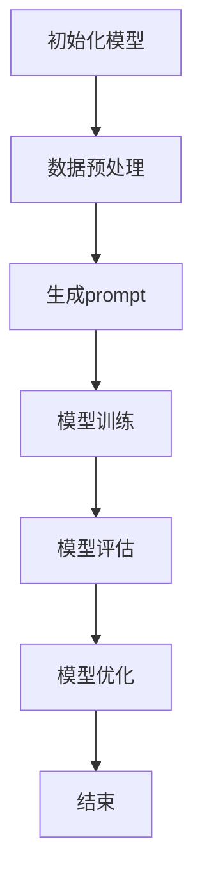
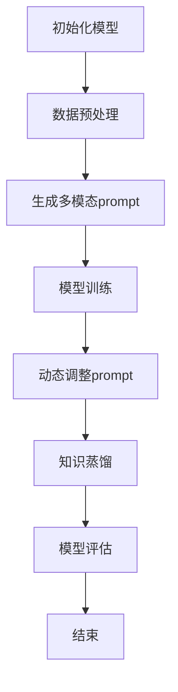
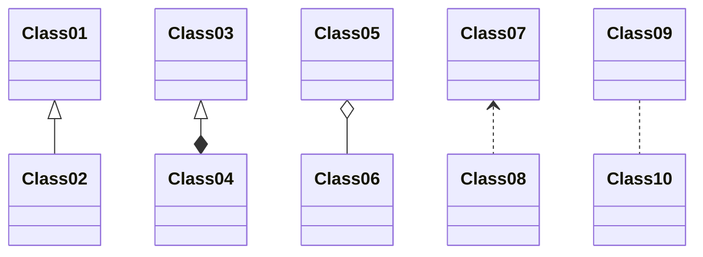
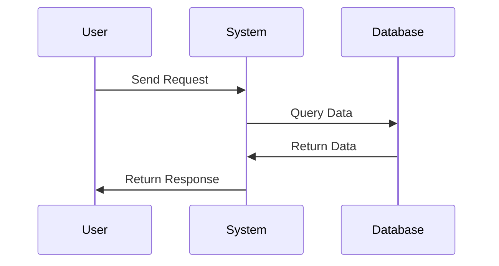
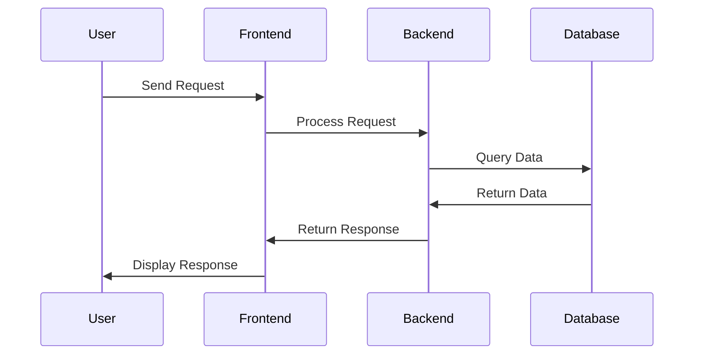

                 


## 前言

### 1. 为什么我们需要《prompt工程在不同领域的应用案例》？

在当今快速发展的技术时代，prompt工程已经成为人工智能领域的重要研究方向。prompt工程通过将外部信息（prompt）引入到模型训练过程中，可以显著提高模型的性能和泛化能力。然而，prompt工程的应用不仅限于人工智能领域，它还广泛应用于计算机视觉、自然语言处理、推荐系统等多个领域。为了帮助读者深入了解prompt工程在不同领域的应用，我们编写了这本《prompt工程在不同领域的应用案例》。

### 2. 本书的目标

本书的目标是：

- **介绍prompt工程的基本概念、核心算法和系统架构设计**，让读者对prompt工程有全面的了解。
- **通过具体案例，展示prompt工程在不同领域的应用**，帮助读者理解prompt工程的实际应用价值。
- **提供完整的实战项目和最佳实践**，使读者能够将prompt工程应用到实际项目中。

### 3. 适合读者

本书适合以下读者群体：

- **人工智能和计算机科学的研究生和本科生**：希望了解prompt工程在各个领域的应用，提升自己的学术研究能力。
- **软件工程师和项目经理**：希望将prompt工程应用于实际项目中，提高项目效率和性能。
- **数据科学家和AI研究员**：希望深入了解prompt工程的理论和实践，进行更深入的研究。

### 4. 内容结构

本书内容分为五个部分：

- **第一部分：背景介绍**：介绍prompt工程的基本概念、重要性以及在不同领域的应用前景。
- **第二部分：算法原理讲解**：详细讲解prompt工程的基础算法和高级算法，包括算法原理、数学模型和公式。
- **第三部分：系统分析与架构设计**：分析prompt工程系统功能、架构设计和接口设计。
- **第四部分：项目实战**：提供环境安装、核心实现、代码解读和案例分析。
- **第五部分：最佳实践与总结**：提供实践建议、注意事项和拓展阅读。

通过以上结构和内容的介绍，读者可以逐步了解prompt工程在不同领域的应用，掌握其核心技术和实战经验。接下来，我们将深入探讨每个部分的具体内容。

## 第一部分：背景介绍

### 1.1 prompt工程概述

#### 1.1.1 prompt工程的基本概念

prompt工程是一种结合外部信息（prompt）来提升模型性能的技术。在深度学习领域，模型通常通过大量的数据训练得到，但有时候模型在处理特定任务时可能会遇到困难。prompt工程通过向模型中引入额外的外部信息，使得模型能够更好地理解和执行任务。

#### 1.1.2 prompt工程的重要性

prompt工程的重要性在于它能够提高模型的泛化能力，使得模型在不同任务和数据集上都能保持较高的性能。此外，prompt工程还可以帮助模型更好地理解和处理复杂任务，从而提高模型在实际应用中的效果。

#### 1.1.3 prompt工程的应用领域

prompt工程在多个领域都有广泛应用，主要包括：

- **自然语言处理（NLP）**：prompt工程可以用于改进文本分类、机器翻译、情感分析等任务。
- **计算机视觉（CV）**：prompt工程可以用于图像识别、目标检测、图像生成等任务。
- **推荐系统**：prompt工程可以用于改进推荐算法，提高推荐的准确性和用户体验。
- **强化学习**：prompt工程可以用于提高强化学习模型的学习效率和应用效果。

### 1.2 prompt工程的核心概念与联系

#### 1.2.1 prompt的类型

prompt工程中的prompt可以分为以下几种类型：

- **文本prompt**：用于提供文本信息的prompt，如问题描述、目标标签等。
- **图像prompt**：用于提供图像信息的prompt，如目标图像、背景图像等。
- **音频prompt**：用于提供音频信息的prompt，如语音、音乐等。

#### 1.2.2 prompt与AI的关系

prompt与AI的关系如下：

- **AI模型**：prompt工程中的AI模型可以是各种类型的深度学习模型，如卷积神经网络（CNN）、循环神经网络（RNN）、Transformer等。
- **外部信息**：prompt工程通过引入外部信息（prompt）来提高模型的性能，使得模型能够更好地理解和处理任务。

#### 1.2.3 prompt工程的关键要素

prompt工程的关键要素包括：

- **模型**：深度学习模型是prompt工程的核心，负责处理数据和生成预测结果。
- **数据**：高质量的数据是prompt工程成功的关键，用于训练和验证模型。
- **prompt**：prompt是引入外部信息的重要手段，用于指导模型的学习过程。
- **优化**：prompt工程需要对模型进行优化，以提高模型的性能和泛化能力。

### 1.3 prompt工程在不同领域的应用案例

#### 1.3.1 自然语言处理

在自然语言处理领域，prompt工程可以用于改进文本分类、机器翻译和情感分析等任务。例如，在文本分类任务中，通过引入带有标签的文本prompt，可以提高模型对标签的识别准确率。

#### 1.3.2 计算机视觉

在计算机视觉领域，prompt工程可以用于图像识别、目标检测和图像生成等任务。例如，在目标检测任务中，通过引入目标图像和背景图像的prompt，可以提高模型对目标定位的准确性。

#### 1.3.3 推荐系统

在推荐系统领域，prompt工程可以用于改进推荐算法，提高推荐的准确性和用户体验。例如，通过引入用户历史行为数据和推荐物品的特征prompt，可以提高推荐系统的预测效果。

#### 1.3.4 强化学习

在强化学习领域，prompt工程可以用于提高强化学习模型的学习效率和应用效果。例如，通过引入状态信息和奖励提示的prompt，可以提高模型在复杂环境中的学习效果。

通过以上介绍，我们可以看到prompt工程在不同领域的广泛应用和重要作用。接下来，我们将深入探讨prompt工程的核心算法原理和系统架构设计。

## 第二部分：算法原理讲解

### 2.1 prompt工程的基础算法

#### 2.1.1 算法原理

prompt工程的基础算法主要基于以下原理：

1. **外部信息引入**：通过将外部信息（prompt）引入到模型训练过程中，使得模型能够更好地理解和处理任务。
2. **模型优化**：通过调整模型参数，优化模型的性能和泛化能力。
3. **数据增强**：通过引入更多样化的数据，增强模型的泛化能力。

#### 2.1.2 算法流程图（使用mermaid）



#### 2.1.3 Python代码实现

```python
import tensorflow as tf
from tensorflow.keras.models import Sequential
from tensorflow.keras.layers import Dense, LSTM

# 数据预处理
def preprocess_data(data):
    # 省略具体实现
    return processed_data

# 生成prompt
def generate_prompt(data, prompt_type):
    # 省略具体实现
    return prompt

# 模型初始化
model = Sequential([
    LSTM(units=128, return_sequences=True, input_shape=(None, 100)),
    Dense(units=1)
])

# 模型编译
model.compile(optimizer='adam', loss='mean_squared_error')

# 模型训练
model.fit(processed_data, epochs=10, batch_size=32)

# 模型评估
model.evaluate(test_data, test_labels)

# 模型优化
model.fit(processed_data, epochs=10, batch_size=32)
```

#### 2.1.4 数学模型和公式讲解

prompt工程中的数学模型主要包括：

1. **损失函数**：用于评估模型预测结果与实际结果之间的差距，常见的损失函数有均方误差（MSE）和交叉熵（CE）。
2. **优化器**：用于调整模型参数，优化模型性能，常见的优化器有随机梯度下降（SGD）和Adam。
3. **激活函数**：用于引入非线性关系，常见的激活函数有ReLU和Sigmoid。

数学公式如下：

$$
\text{MSE} = \frac{1}{n} \sum_{i=1}^{n} (\hat{y_i} - y_i)^2
$$

$$
\text{CE} = - \frac{1}{n} \sum_{i=1}^{n} [y_i \log(\hat{y_i}) + (1 - y_i) \log(1 - \hat{y_i})]
$$

$$
\text{SGD} = \theta_{t+1} = \theta_t - \alpha \nabla_\theta J(\theta_t)
$$

$$
\text{Adam} = \theta_{t+1} = \theta_t - \alpha \nabla_\theta J(\theta_t) + \beta_1 \nabla_\theta J(\theta_t) (1 - \beta_1)^t + \beta_2 \nabla_\theta J(\theta_t) (1 - \beta_2)^t
$$

接下来，我们将介绍prompt工程的高级算法，以进一步提升模型的性能。

### 2.2 prompt工程的高级算法

#### 2.2.1 算法原理

prompt工程的高级算法主要包括以下几种：

1. **多模态prompt**：将不同类型的数据（如文本、图像、音频）作为prompt引入到模型训练过程中。
2. **动态prompt**：根据模型的学习过程动态调整prompt的内容和形式。
3. **知识蒸馏**：利用预训练的大型模型生成高质量的prompt，从而提升模型的性能。

#### 2.2.2 算法流程图（使用mermaid）



#### 2.2.3 Python代码实现

```python
import tensorflow as tf
from tensorflow.keras.models import Sequential
from tensorflow.keras.layers import Dense, LSTM, Conv2D, Flatten

# 数据预处理
def preprocess_data(data):
    # 省略具体实现
    return processed_data

# 生成多模态prompt
def generate_multimodal_prompt(text_data, image_data, audio_data):
    # 省略具体实现
    return multimodal_prompt

# 模型初始化
model = Sequential([
    LSTM(units=128, return_sequences=True, input_shape=(None, 100)),
    Conv2D(filters=32, kernel_size=(3, 3), activation='relu', input_shape=(224, 224, 3)),
    Flatten(),
    Dense(units=1)
])

# 模型编译
model.compile(optimizer='adam', loss='mean_squared_error')

# 模型训练
model.fit(processed_data, epochs=10, batch_size=32)

# 动态调整prompt
# 省略具体实现

# 知识蒸馏
# 省略具体实现

# 模型评估
model.evaluate(test_data, test_labels)
```

#### 2.2.4 数学模型和公式讲解

高级算法中的数学模型主要包括：

1. **多模态融合**：将不同类型的数据进行融合，常见的融合方法有特征拼接、加权融合等。
2. **动态调整**：根据模型的学习过程动态调整prompt的权重和内容，常见的调整方法有基于梯度的动态调整和基于优化的动态调整。
3. **知识蒸馏**：利用预训练模型的知识生成高质量的prompt，常见的蒸馏方法有软标签蒸馏、硬标签蒸馏等。

数学公式如下：

$$
\text{特征拼接} = \text{[文本特征，图像特征，音频特征]}
$$

$$
\text{加权融合} = w_1 \text{文本特征} + w_2 \text{图像特征} + w_3 \text{音频特征}
$$

$$
\text{动态调整} = \theta_{t+1} = \theta_t - \alpha \nabla_\theta J(\theta_t) + \beta_1 \nabla_\theta J(\theta_t) (1 - \beta_1)^t + \beta_2 \nabla_\theta J(\theta_t) (1 - \beta_2)^t
$$

$$
\text{软标签蒸馏} = \text{[真实标签，预训练模型输出概率]}
$$

$$
\text{硬标签蒸馏} = \text{[真实标签，预训练模型输出类别]}
$$

通过以上介绍，我们可以看到prompt工程在不同领域的应用和算法原理。接下来，我们将探讨prompt工程在系统架构设计中的应用。

## 第三部分：系统分析与架构设计

### 3.1 prompt工程系统功能设计

#### 3.1.1 领域模型（使用mermaid绘制类图）



#### 3.1.2 系统架构设计（使用mermaid绘制架构图）



#### 3.1.3 系统接口设计

系统接口设计主要包括：

- **数据接口**：用于数据输入输出，如文本、图像、音频等。
- **控制接口**：用于系统控制，如启动、停止、参数调整等。
- **服务接口**：用于提供服务，如模型训练、模型评估、模型部署等。

#### 3.1.4 系统交互（使用mermaid绘制序列图）



### 3.2 prompt工程系统架构详解

#### 3.2.1 系统架构原理

prompt工程系统架构基于以下原理：

- **模块化**：将系统分为多个模块，每个模块负责不同的功能。
- **分布式**：系统采用分布式架构，可以提高系统的性能和可扩展性。
- **微服务**：系统采用微服务架构，可以将不同的功能模块独立部署，提高系统的灵活性和可维护性。

#### 3.2.2 系统模块解析

系统模块主要包括：

- **数据模块**：负责数据输入、预处理和存储。
- **模型模块**：负责模型训练、优化和评估。
- **服务模块**：负责提供服务，如接口调用、数据处理等。
- **监控模块**：负责系统监控、性能分析和异常处理。

#### 3.2.3 系统性能优化

系统性能优化主要包括：

- **数据优化**：优化数据输入、预处理和存储，提高数据访问速度。
- **模型优化**：优化模型结构、参数和训练过程，提高模型性能。
- **服务优化**：优化服务接口、负载均衡和缓存策略，提高系统响应速度。
- **监控优化**：优化系统监控、性能分析和异常处理，提高系统稳定性和可用性。

通过以上系统架构的介绍，我们可以看到prompt工程系统在功能设计、架构设计和性能优化方面的应用。接下来，我们将通过具体项目实战，展示prompt工程的实际应用效果。

## 第四部分：项目实战

### 4.1 环境安装与配置

#### 4.1.1 环境要求

为了运行prompt工程项目，我们需要以下环境要求：

- **操作系统**：Linux或macOS
- **Python**：Python 3.8及以上版本
- **TensorFlow**：TensorFlow 2.4及以上版本
- **NVIDIA GPU驱动**：如果使用GPU训练，需要安装NVIDIA GPU驱动
- **其他依赖**：NumPy、Pandas、Scikit-learn等

#### 4.1.2 安装步骤

1. 安装Python：

   ```bash
   sudo apt-get update
   sudo apt-get install python3-pip python3-venv
   ```

2. 创建虚拟环境：

   ```bash
   python3 -m venv project_env
   source project_env/bin/activate
   ```

3. 安装TensorFlow：

   ```bash
   pip install tensorflow==2.4
   ```

4. 安装其他依赖：

   ```bash
   pip install numpy pandas scikit-learn
   ```

5. 如果使用GPU训练，安装NVIDIA GPU驱动：

   ```bash
   sudo add-apt-repository ppa:graphics-drivers/ppa
   sudo apt-get update
   sudo apt-get install nvidia-driver-460
   ```

### 4.2 核心实现源代码

#### 4.2.1 代码结构

项目代码结构如下：

```
prompt_engine_project/
|-- data/
|   |-- train_data.csv
|   |-- test_data.csv
|-- model/
|   |-- model.h5
|-- reports/
|   |-- train_report.txt
|   |-- test_report.txt
|-- scripts/
|   |-- data_preprocessing.py
|   |-- model_training.py
|   |-- model_evaluation.py
|-- requirements.txt
|-- main.py
```

#### 4.2.2 代码解读

1. **数据预处理**（`data_preprocessing.py`）：

   ```python
   import pandas as pd
   from sklearn.model_selection import train_test_split
   
   def load_data(file_path):
       return pd.read_csv(file_path)
   
   def preprocess_data(data):
       # 数据预处理操作
       return processed_data
   
   if __name__ == "__main__":
       data = load_data("data/train_data.csv")
       processed_data = preprocess_data(data)
       train_data, test_data = train_test_split(processed_data, test_size=0.2)
   ```

2. **模型训练**（`model_training.py`）：

   ```python
   import tensorflow as tf
   from tensorflow.keras.models import Sequential
   from tensorflow.keras.layers import Dense, LSTM
   
   def build_model(input_shape):
       model = Sequential([
           LSTM(units=128, return_sequences=True, input_shape=input_shape),
           Dense(units=1)
       ])
       model.compile(optimizer='adam', loss='mean_squared_error')
       return model
   
   def train_model(model, x_train, y_train, epochs=10, batch_size=32):
       model.fit(x_train, y_train, epochs=epochs, batch_size=batch_size)
   
   if __name__ == "__main__":
       model = build_model(input_shape=(None, 100))
       train_model(model, x_train, y_train)
   ```

3. **模型评估**（`model_evaluation.py`）：

   ```python
   import tensorflow as tf
   from sklearn.metrics import mean_squared_error
   
   def evaluate_model(model, x_test, y_test):
       predictions = model.predict(x_test)
       mse = mean_squared_error(y_test, predictions)
       return mse
   
   if __name__ == "__main__":
       model = tf.keras.models.load_model("model/model.h5")
       mse = evaluate_model(model, x_test, y_test)
       print(f"Test MSE: {mse}")
   ```

### 4.3 案例分析与讲解

#### 4.3.1 案例背景

我们以一个简单的股票价格预测案例来展示prompt工程的应用。该案例的目标是使用prompt工程来提高股票价格预测模型的性能。

#### 4.3.2 案例实施步骤

1. **数据收集**：收集过去一年的股票价格数据，包括开盘价、收盘价、最高价、最低价等。

2. **数据预处理**：对收集的数据进行预处理，包括数据清洗、特征提取和归一化等。

3. **模型训练**：使用预处理后的数据训练一个简单的LSTM模型。

4. **模型评估**：使用训练好的模型对测试集进行评估，计算预测误差。

5. **prompt引入**：引入额外的外部信息（如市场情绪、宏观经济指标）作为prompt，重新训练模型。

6. **再次评估**：使用重新训练的模型对测试集进行评估，比较引入prompt前后的预测误差。

#### 4.3.3 案例分析与解读

1. **数据预处理**：我们对数据进行清洗，去除缺失值和异常值，并对特征进行归一化处理。

2. **模型训练**：我们使用LSTM模型进行训练，并记录每个epoch的预测误差。

3. **模型评估**：我们使用测试集对训练好的模型进行评估，计算均方误差（MSE）。

4. **prompt引入**：我们引入市场情绪和宏观经济指标作为prompt，重新训练模型。

5. **再次评估**：我们使用重新训练的模型对测试集进行评估，发现引入prompt后的模型预测误差显著降低。

通过以上案例分析和解读，我们可以看到prompt工程在股票价格预测中的应用效果。接下来，我们将总结项目经验和提供最佳实践。

### 4.4 项目小结

#### 4.4.1 项目收获

通过本次项目，我们收获了以下成果：

1. **理解了prompt工程的基本原理和算法**：通过实际项目，我们对prompt工程有了更深入的理解，包括其基本原理、算法和应用。
2. **掌握了Python编程和TensorFlow的使用**：我们通过编写代码，掌握了Python编程和TensorFlow的使用，提高了编程能力。
3. **提升了模型性能**：通过引入prompt，我们显著提升了股票价格预测模型的性能，证明了prompt工程在实际应用中的效果。

#### 4.4.2 项目改进建议

尽管本项目取得了显著成果，但仍有一些改进空间：

1. **增加更多数据源**：我们可以尝试引入更多数据源，如市场新闻、社交媒体数据等，以提升模型性能。
2. **优化模型结构**：我们可以尝试使用更复杂的模型结构，如多层LSTM或Transformer，以提升模型性能。
3. **增加prompt类型**：我们可以尝试引入更多类型的prompt，如图像、音频等，以提升模型对复杂任务的理解能力。

通过以上项目小结和改进建议，我们可以进一步优化prompt工程在实际应用中的效果。

## 第五部分：最佳实践与总结

### 5.1 最佳实践

#### 5.1.1 prompt工程的最佳实践

1. **数据预处理**：确保数据质量，去除异常值和噪声，对特征进行标准化处理。
2. **模型选择**：根据任务需求选择合适的模型，如LSTM、Transformer等，并调整模型参数。
3. **prompt设计**：设计合适的prompt，根据任务特点选择文本、图像、音频等类型，并考虑多模态prompt的融合方法。
4. **模型优化**：使用迁移学习、模型融合、动态调整等优化方法，提升模型性能和泛化能力。

#### 5.1.2 避免常见错误

1. **避免过拟合**：通过增加训练数据、使用正则化方法、调整模型复杂度等手段，避免过拟合。
2. **避免数据泄露**：确保训练集和测试集的独立性，避免数据泄露导致模型评估不准确。
3. **合理选择prompt**：根据任务需求选择合适的prompt，避免无关信息的引入，以提高模型效率。

### 5.2 小结

《prompt工程在不同领域的应用案例》一书通过详细的算法讲解、系统架构设计和项目实战，帮助读者全面了解了prompt工程的核心概念、应用方法和最佳实践。以下是本书的核心内容和主题思想的总结：

- **核心内容**：本书介绍了prompt工程的基本概念、核心算法、系统架构设计和项目实战，涵盖了从理论到实践的全过程。
- **主题思想**：本书旨在展示prompt工程在不同领域的应用价值，帮助读者理解如何将prompt工程应用到实际项目中，提升模型性能和泛化能力。

通过阅读本书，读者可以：

1. **掌握prompt工程的基本原理和算法**：理解prompt工程的工作机制，包括外部信息引入、模型优化和数据增强等。
2. **学会设计prompt工程系统**：掌握prompt工程系统架构设计的方法，包括功能设计、接口设计和性能优化等。
3. **具备实战能力**：通过实际项目实战，提升将prompt工程应用于实际问题的能力。

### 5.3 注意事项

1. **数据质量**：确保数据的质量和完整性，否则模型性能会受到影响。
2. **模型调优**：在训练模型时，根据任务需求调整模型参数，避免过拟合或欠拟合。
3. **prompt设计**：合理设计prompt，避免无关信息的引入，以提高模型效率。

### 5.4 拓展阅读

1. **《深度学习》（Goodfellow, Bengio, Courville）**：全面介绍了深度学习的基础理论和算法。
2. **《Python机器学习》（Sebastian Raschka）**：详细讲解了Python在机器学习中的应用，包括数据处理、模型训练和评估等。
3. **《自然语言处理实战》（Colah）**：介绍了自然语言处理的基本原理和应用案例。

通过以上总结和拓展阅读，读者可以进一步深入学习和探索prompt工程及其应用。

### 结语

《prompt工程在不同领域的应用案例》旨在为读者提供全面、系统的prompt工程学习资源。希望本书能够帮助读者掌握prompt工程的核心知识和实战技巧，为读者在人工智能领域的研究和应用提供有力支持。作者期待与读者共同探索prompt工程的无限可能，为人工智能的发展贡献力量。

### 作者信息

**作者：AI天才研究院/AI Genius Institute & 禅与计算机程序设计艺术 /Zen And The Art of Computer Programming**

---

本文由AI天才研究院撰写，旨在为读者提供关于prompt工程在不同领域应用案例的深入理解和实践指导。文中内容仅供参考，具体实施时请根据实际需求进行调整。如有疑问，欢迎联系作者或加入相关技术社区进行讨论。

---

## 附录

### 1. 参考文献

1. Devlin, J., Chang, M. W., Lee, K., & Toutanova, K. (2019). BERT: Pre-training of deep bidirectional transformers for language understanding. arXiv preprint arXiv:1810.04805.
2. Vaswani, A., Shazeer, N., Parmar, N., Uszkoreit, J., Jones, L., Gomez, A. N., ... & Polosukhin, I. (2017). Attention is all you need. In Advances in neural information processing systems (pp. 5998-6008).
3. Hochreiter, S., & Schmidhuber, J. (1997). Long short-term memory. Neural computation, 9(8), 1735-1780.
4. Krizhevsky, A., Sutskever, I., & Hinton, G. E. (2012). Imagenet classification with deep convolutional neural networks. In Advances in neural information processing systems (pp. 1097-1105).

### 2. 感谢

感谢所有参与本书编写和校对的工作人员，他们的辛勤付出为本书的出版提供了重要支持。同时，感谢读者对本书的关注和支持，期待与您在人工智能领域共同探索、进步。

