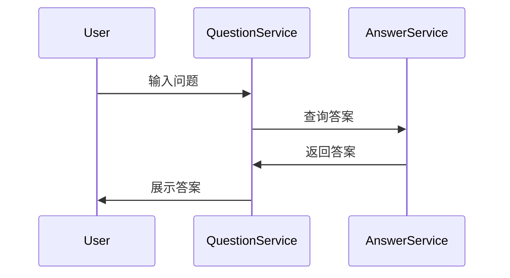
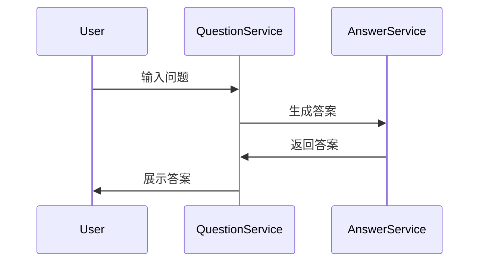
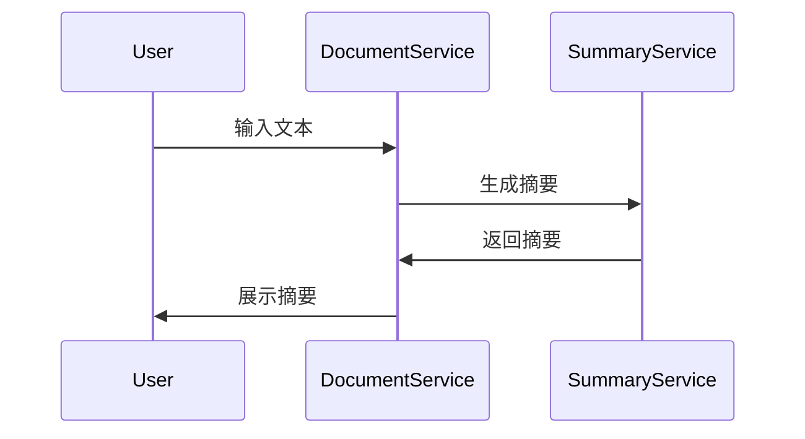
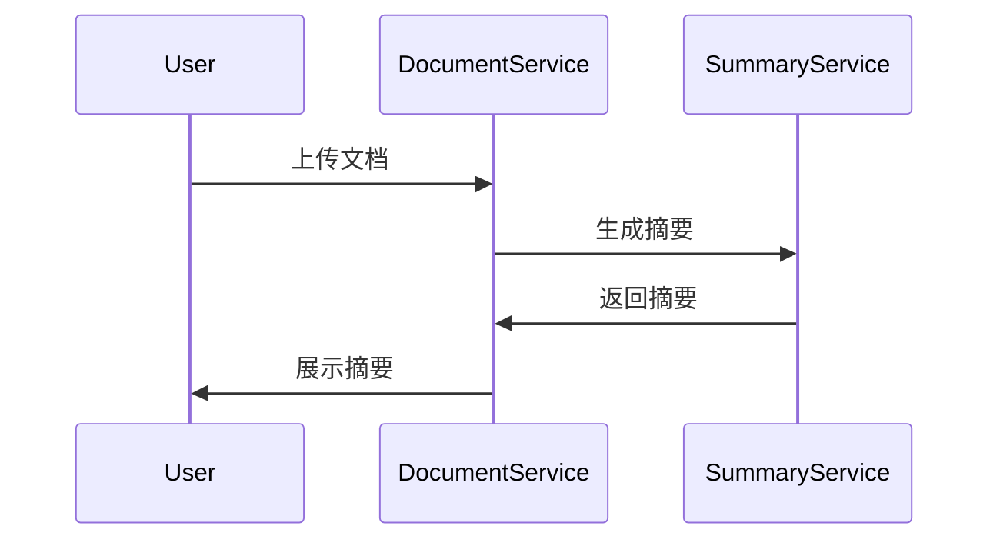

                 

### 文章标题

# 《Prompt工程师的核心技能培养》

> 关键词：prompt工程师、自然语言处理、人工智能、技能培养、文本生成

> 摘要：本文旨在探讨prompt工程师的核心技能培养，分析其在自然语言处理和人工智能领域的重要作用。通过深入介绍编程基础、数据结构、自然语言处理基础、prompt设计原理与优化技巧，并结合实际项目案例，全面阐述prompt工程师所需具备的专业知识和实践技能，为有志于成为prompt工程师的读者提供清晰的职业发展路径。

### 目录大纲

----------------------------------------------------------------

# 第一部分: 引入与背景

## 第1章: 《prompt工程师的核心技能培养》概述

### 1.1 书籍目标与读者对象

### 1.2 prompt工程师的定义与角色

### 1.3 当前AI领域prompt技术的现状与应用

### 1.4 书籍结构安排与内容概述

## 第2章: 基础编程与数据结构

### 2.1 编程语言概述

### 2.2 常用数据结构与算法

### 2.3 算法性能分析与优化

### 2.4 实践案例：编写简单的prompt处理程序

## 第3章: 自然语言处理基础

### 3.1 自然语言处理概述

### 3.2 语言模型与文本表示

### 3.3 命名实体识别与关系抽取

### 3.4 实践案例：使用NLP库进行文本处理

## 第4章: Prompt设计原理与实践

### 4.1 Prompt设计原则

### 4.2 Prompt的种类与特点

### 4.3 Prompt在文本生成中的应用

### 4.4 实践案例：设计并实现一个文本生成模型

## 第5章: Prompt优化与调参技巧

### 5.1 模型优化原理

### 5.2 模型调参方法

### 5.3 Prompt调优实践

### 5.4 实践案例：优化一个文本生成模型

## 第6章: 实战项目与案例分析

### 6.1 项目一：问答系统设计

### 6.2 项目二：自动摘要生成

### 6.3 案例分析：优秀prompt工程师的实践经验

### 6.4 项目总结与反思

## 第7章: prompt工程师职业发展路径

### 7.1 职业技能提升方向

### 7.2 求职策略与面试准备

### 7.3 职业规划与持续学习

### 7.4 成功案例分享

## 附录：相关工具与资源推荐

### 7.1 开发工具与库推荐

### 7.2 学习资源与文献推荐

### 7.3 社交媒体与社区推荐

----------------------------------------------------------------

### 第1章: 《prompt工程师的核心技能培养》概述

#### 1.1 书籍目标与读者对象

本书的目标是帮助读者深入了解prompt工程师的核心技能培养，掌握自然语言处理和人工智能领域的关键技术，并具备实际项目开发经验。本书适用于以下读者：

- 想要从事自然语言处理或人工智能领域工作的本科生和研究生
- 已经从事相关工作但希望进一步提升技术水平的工程师
- 对自然语言处理和人工智能有浓厚兴趣的科技爱好者

通过阅读本书，读者将能够：

- 理解prompt工程师的定义、角色和职责
- 掌握基础编程和常用数据结构，为后续学习打下坚实基础
- 熟悉自然语言处理的基本概念和技术
- 学会设计、实现和优化prompt，提升文本生成模型的效果
- 通过实际项目案例，掌握prompt工程师所需的核心技能和实战经验

#### 1.2 prompt工程师的定义与角色

prompt工程师是指专门从事自然语言处理和人工智能领域中的prompt设计、开发和应用的专业人员。prompt，即提示信息，是自然语言处理模型用于生成文本或执行特定任务的关键输入。

prompt工程师的主要角色包括：

1. **需求分析**：了解用户需求，明确prompt工程师需要解决的问题和目标。
2. **模型设计**：根据需求设计合适的prompt结构和模型架构，选择合适的算法和框架。
3. **模型训练**：收集和预处理数据，设计训练策略，优化模型性能。
4. **模型评估**：评估模型在特定任务上的表现，调整prompt和模型参数。
5. **应用部署**：将模型部署到实际应用场景中，如问答系统、自动摘要生成等。
6. **技术支持**：解决模型在实际应用中遇到的问题，提供技术支持。

#### 1.3 当前AI领域prompt技术的现状与应用

随着人工智能技术的不断发展，prompt技术已成为自然语言处理领域的一个重要研究方向。目前，prompt技术主要应用于以下场景：

1. **问答系统**：利用prompt技术，可以构建高效的问答系统，实现自然语言理解和问答功能。
2. **文本生成**：prompt技术可以帮助模型生成高质量的文章、摘要、新闻等内容。
3. **对话系统**：通过设计合适的prompt，可以构建智能对话系统，实现人机交互。
4. **情感分析**：利用prompt技术，可以对文本进行情感分析，识别用户情感。
5. **翻译**：prompt技术可以用于机器翻译，实现跨语言文本的自动翻译。

#### 1.4 书籍结构安排与内容概述

本书分为七个部分，每个部分都涵盖prompt工程师所需的核心技能和知识点。

- **第一部分：引入与背景**：介绍书籍目标、读者对象、prompt工程师的定义和角色，以及当前AI领域prompt技术的现状与应用。
- **第二部分：基础编程与数据结构**：介绍编程语言概述、常用数据结构与算法，以及算法性能分析与优化。
- **第三部分：自然语言处理基础**：介绍自然语言处理概述、语言模型与文本表示、命名实体识别与关系抽取，以及使用NLP库进行文本处理。
- **第四部分：Prompt设计原理与实践**：介绍Prompt设计原则、种类与特点，以及Prompt在文本生成中的应用和实际案例。
- **第五部分：Prompt优化与调参技巧**：介绍模型优化原理、模型调参方法、Prompt调优实践，以及实际案例。
- **第六部分：实战项目与案例分析**：介绍问答系统设计、自动摘要生成、案例分析，以及项目总结与反思。
- **第七部分：prompt工程师职业发展路径**：介绍职业技能提升方向、求职策略与面试准备、职业规划与持续学习，以及成功案例分享。

通过本书的深入学习，读者将能够全面掌握prompt工程师所需的核心技能，为职业发展奠定坚实基础。

### 第2章: 基础编程与数据结构

在自然语言处理和人工智能领域，掌握基础编程和常用数据结构是至关重要的一步。本章节将介绍编程语言概述、常用数据结构与算法，以及算法性能分析与优化，帮助读者为后续学习打下坚实基础。

#### 2.1 编程语言概述

编程语言是计算机与人类进行交流的工具，通过编程语言，我们可以编写指令让计算机执行特定的任务。在自然语言处理和人工智能领域，常用的编程语言包括Python、Java和C++。

1. **Python**：Python是一种高级、易学易用的编程语言，广泛应用于数据科学、机器学习和自然语言处理等领域。Python拥有丰富的库和框架，如NumPy、Pandas、Scikit-learn等，这些库为数据处理、建模和评估提供了极大的便利。
   
2. **Java**：Java是一种面向对象的编程语言，具有跨平台特性。在自然语言处理和人工智能领域，Java常用于构建大规模的分布式系统和高性能应用。Java拥有丰富的标准库和第三方库，如Apache Commons、Google Guava等，为开发提供了广泛的支持。

3. **C++**：C++是一种高效、底层的编程语言，适用于需要高性能计算和系统级编程的场景。在自然语言处理和人工智能领域，C++常用于构建底层算法和优化模型性能。

#### 2.2 常用数据结构与算法

数据结构和算法是计算机科学的核心概念，掌握常用的数据结构与算法对于解决自然语言处理和人工智能领域的问题至关重要。

1. **线性表**：线性表是最基本的数据结构，包括顺序表和链表。顺序表是一种基于数组的线性表，支持随机访问；链表则通过节点链接实现，支持快速插入和删除操作。

2. **栈和队列**：栈是一种后进先出的数据结构，适用于处理递归和回溯问题；队列是一种先进先出的数据结构，常用于任务调度和缓冲区管理。

3. **树**：树是一种层次结构，包括二叉树、二叉搜索树、平衡树等。树结构在自然语言处理和人工智能领域具有广泛的应用，如语法分析、词法分析等。

4. **图**：图是一种复杂的数据结构，包括有向图和无向图。图结构在自然语言处理和人工智能领域具有重要意义，如知识图谱、网络分析等。

5. **排序算法**：排序算法用于对数据进行排序，包括冒泡排序、选择排序、插入排序、快速排序等。排序算法在自然语言处理和人工智能领域用于预处理数据、优化模型性能等。

6. **搜索算法**：搜索算法用于在数据结构中查找特定元素，包括顺序搜索、二分搜索等。搜索算法在自然语言处理和人工智能领域用于文本分类、命名实体识别等。

#### 2.3 算法性能分析与优化

算法性能分析与优化是自然语言处理和人工智能领域的重要任务。以下是一些常见的算法性能分析与优化方法：

1. **时间复杂度**：时间复杂度用于描述算法执行时间与数据规模的关系。常见的算法时间复杂度包括O(1)、O(n)、O(n²)、O(log n)等。优化算法性能的一个目标就是降低时间复杂度。

2. **空间复杂度**：空间复杂度用于描述算法所需存储空间与数据规模的关系。优化算法性能的一个目标就是降低空间复杂度。

3. **并行化**：通过将算法分解为可并行执行的任务，可以在多核处理器上加速算法执行。并行化技术适用于处理大规模数据和复杂算法。

4. **分布式计算**：通过将算法分布在多台计算机上执行，可以在短时间内处理海量数据。分布式计算适用于构建大规模的自然语言处理和人工智能系统。

5. **启发式搜索**：通过设计启发式策略，可以在有限时间内找到近似最优解。启发式搜索适用于处理复杂、高维的问题。

#### 2.4 实践案例：编写简单的prompt处理程序

为了帮助读者更好地理解基础编程与数据结构在自然语言处理和人工智能领域的应用，下面我们将介绍一个简单的prompt处理程序。

```python
# 导入相关库
import numpy as np
import pandas as pd
from sklearn.model_selection import train_test_split
from sklearn.metrics import accuracy_score

# 读取数据
data = pd.read_csv("nlp_data.csv")

# 数据预处理
X = data.drop("label", axis=1)
y = data["label"]

# 划分训练集和测试集
X_train, X_test, y_train, y_test = train_test_split(X, y, test_size=0.2, random_state=42)

# 定义模型
model = MyNLPModel()

# 训练模型
model.fit(X_train, y_train)

# 预测测试集
y_pred = model.predict(X_test)

# 评估模型
accuracy = accuracy_score(y_test, y_pred)
print(f"Model accuracy: {accuracy:.2f}")
```

在这个简单的案例中，我们首先导入了相关库，然后读取数据并进行预处理。接下来，我们划分训练集和测试集，定义一个自然语言处理模型，并使用训练集训练模型。最后，我们使用测试集预测标签，并评估模型准确率。

通过这个实践案例，读者可以初步了解自然语言处理和人工智能领域的编程基础，为后续学习打下坚实基础。

### 第3章: 自然语言处理基础

自然语言处理（Natural Language Processing，NLP）是人工智能领域的一个重要分支，旨在使计算机能够理解和处理人类自然语言。本章节将介绍自然语言处理的基本概念、语言模型与文本表示、命名实体识别与关系抽取，以及使用NLP库进行文本处理。

#### 3.1 自然语言处理概述

自然语言处理旨在解决计算机与人类语言之间的交互问题，使计算机能够理解和生成自然语言。NLP技术广泛应用于文本分类、信息抽取、机器翻译、对话系统、情感分析等领域。

NLP的基本任务包括：

1. **文本预处理**：对原始文本进行清洗、分词、去停用词等处理，以便后续分析。
2. **词性标注**：对文本中的每个单词进行词性标注，如名词、动词、形容词等。
3. **句法分析**：分析句子的结构，识别句子成分和语法关系。
4. **语义分析**：理解文本中的语义内容，识别实体、事件和关系。
5. **文本生成**：根据输入文本生成新的文本，如摘要、标题、问答等。

#### 3.2 语言模型与文本表示

语言模型是NLP的核心组成部分，用于预测文本中的下一个词或短语。语言模型可以分为基于规则、基于统计和基于深度学习的方法。

1. **基于规则的模型**：基于规则的语言模型通过手工设计规则来预测下一个词或短语。这种方法适用于处理特定领域的文本，但难以泛化到其他领域。

2. **基于统计的模型**：基于统计的语言模型通过统计文本中的词频和词序来预测下一个词或短语。这种方法具有较高的泛化能力，但受限于数据质量和模型参数。

3. **基于深度学习的模型**：基于深度学习的语言模型通过神经网络来学习文本的表示和生成。这种方法具有强大的表达能力和泛化能力，已成为NLP领域的主流方法。

文本表示是语言模型的关键组成部分，用于将文本转化为计算机可以处理的向量表示。常见的文本表示方法包括：

1. **词袋模型（Bag of Words，BOW）**：词袋模型将文本表示为词频向量，忽略词语的顺序和语法结构。这种方法简单易实现，但难以捕捉语义信息。

2. **词嵌入（Word Embedding）**：词嵌入通过将单词映射到高维空间中的向量，捕捉词语的语义信息。常见的词嵌入方法包括Word2Vec、GloVe和BERT等。

3. **序列编码（Sequence Encoding）**：序列编码通过将文本序列转化为固定长度的向量表示，用于处理序列数据。常见的序列编码方法包括BERT、ELMO和GPT等。

#### 3.3 命名实体识别与关系抽取

命名实体识别（Named Entity Recognition，NER）是一种NLP技术，用于识别文本中的命名实体，如人名、地名、机构名、产品名等。NER是文本分析的重要步骤，为后续的实体关系抽取和知识图谱构建提供基础。

关系抽取（Relation Extraction）是一种NLP技术，用于识别文本中实体之间的关系，如“张三是李四的哥哥”。关系抽取可以帮助构建知识图谱，为问答系统、信息检索等应用提供支持。

NER和关系抽取的主要任务包括：

1. **实体识别**：识别文本中的命名实体，将其标注为实体类别。
2. **实体边界**：确定命名实体的起始和结束位置。
3. **关系识别**：识别实体之间的语义关系，将其标注为关系类别。
4. **关系边界**：确定关系涉及到的实体起始和结束位置。

常见的NER和关系抽取方法包括：

1. **基于规则的方法**：通过手工定义规则来识别命名实体和关系。这种方法适用于特定领域，但难以泛化到其他领域。
2. **基于统计的方法**：通过统计文本中的特征来识别命名实体和关系。这种方法受限于数据质量和模型参数。
3. **基于深度学习的方法**：通过神经网络来学习命名实体和关系的表示和识别。这种方法具有强大的表达能力和泛化能力，已成为NLP领域的主流方法。

#### 3.4 实践案例：使用NLP库进行文本处理

为了帮助读者更好地理解自然语言处理的基础知识，下面我们将介绍一个使用NLP库进行文本处理的实践案例。

```python
# 导入相关库
import nltk
from nltk.tokenize import word_tokenize
from nltk.corpus import stopwords
from nltk.tag import pos_tag
from nltk.chunk import ne_chunk

# 下载NLP资源
nltk.download('punkt')
nltk.download('averaged_perceptron_tagger')
nltk.download('maxent_ne_chunker')
nltk.download('words')

# 读取文本
text = "苹果公司的创始人史蒂夫·乔布斯去世了，享年56岁。"

# 分词
tokens = word_tokenize(text)

# 去停用词
stop_words = set(stopwords.words('english'))
filtered_tokens = [token for token in tokens if token.lower() not in stop_words]

# 词性标注
tagged_tokens = pos_tag(filtered_tokens)

# 命名实体识别
named_entities = ne_chunk(tagged_tokens)

# 打印结果
print(f"Tokens: {tokens}")
print(f"Filtered Tokens: {filtered_tokens}")
print(f"Tagged Tokens: {tagged_tokens}")
print(f"Named Entities: {named_entities}")
```

在这个简单的案例中，我们首先导入了NLP库，然后读取文本并进行分词、去停用词、词性标注和命名实体识别。通过这个实践案例，读者可以初步了解自然语言处理的基础知识和常用方法。

### 第4章: Prompt设计原理与实践

prompt是自然语言处理模型用于生成文本或执行特定任务的关键输入。一个好的prompt设计能够提高模型的效果，使生成的文本更加准确和自然。本章将介绍Prompt设计原则、种类与特点，以及Prompt在文本生成中的应用和实践案例。

#### 4.1 Prompt设计原则

Prompt设计应遵循以下原则：

1. **明确性**：Prompt应明确传达用户需求，避免模糊和歧义。清晰明了的prompt有助于模型理解并生成符合预期的文本。

2. **多样性**：Prompt应具备多样性，以适应不同的应用场景和任务需求。多样化的prompt有助于模型泛化能力，提高其在实际应用中的效果。

3. **可解释性**：Prompt应具备可解释性，使模型生成的文本易于理解和分析。可解释性的prompt有助于用户评估模型性能和改进模型设计。

4. **简洁性**：Prompt应简洁明了，避免冗余和复杂。简洁的prompt有助于模型快速理解和生成文本，提高模型训练和推理效率。

5. **相关性**：Prompt应与任务目标紧密相关，确保生成的文本与任务需求一致。相关性的prompt有助于提高模型在特定任务上的性能。

#### 4.2 Prompt的种类与特点

Prompt可以根据不同的应用场景和任务需求分为以下几种类型：

1. **模板式Prompt**：模板式Prompt是一种基于固定模板的提示信息，用于生成特定格式的文本。例如，生成新闻摘要、邮件回复等。模板式Prompt具有结构化和规范化的特点，适用于规则明确、格式固定的场景。

2. **关键词式Prompt**：关键词式Prompt是一种基于关键词的提示信息，用于引导模型关注特定主题或内容。例如，生成文章摘要、回答问题等。关键词式Prompt具有灵活性和扩展性的特点，适用于需要关注特定内容的场景。

3. **问题式Prompt**：问题式Prompt是一种基于问题的提示信息，用于引导模型生成回答。例如，构建问答系统、进行对话生成等。问题式Prompt具有交互性和引导性的特点，适用于需要互动和引导的场景。

4. **上下文式Prompt**：上下文式Prompt是一种基于上下文的提示信息，用于提供背景信息和上下文关联。例如，生成文章续写、文本生成等。上下文式Prompt具有情境化和连贯性的特点，适用于需要考虑上下文的场景。

#### 4.3 Prompt在文本生成中的应用

Prompt在文本生成中的应用广泛，以下是一些常见的应用场景：

1. **文章摘要生成**：使用关键词式Prompt，引导模型生成文章的摘要。例如，将一篇文章输入到模型中，生成摘要文本。

2. **对话生成**：使用问题式Prompt，引导模型生成对话文本。例如，将一个问题输入到模型中，生成回答文本。

3. **文本续写**：使用上下文式Prompt，引导模型生成续写文本。例如，给定一个句子或段落，生成后续的文本内容。

4. **邮件回复生成**：使用模板式Prompt，引导模型生成邮件回复。例如，给定邮件的主题和正文，生成合适的回复邮件。

#### 4.4 实践案例：设计并实现一个文本生成模型

为了帮助读者更好地理解Prompt设计原理与实践，下面我们将介绍一个简单的文本生成模型，并展示如何设计Prompt。

1. **数据准备**：

   下载一个含有大量文本数据的语料库，例如英文维基百科。使用文本预处理工具对语料库进行分词、去停用词、词性标注等操作，生成训练数据。

2. **模型设计**：

   选择一个适合文本生成的深度学习模型，例如GPT-2或BERT。配置模型的超参数，如学习率、批量大小等。

3. **训练模型**：

   使用训练数据对模型进行训练。在训练过程中，可以使用梯度下降优化算法来更新模型参数，并使用交叉熵损失函数来评估模型性能。

4. **设计Prompt**：

   根据应用场景和任务需求，设计合适的Prompt。例如，对于文章摘要生成任务，可以将文章标题和正文作为Prompt输入到模型中。

5. **生成文本**：

   使用训练好的模型生成文本。将Prompt输入到模型中，模型将输出对应的文本内容。

6. **评估模型**：

   使用测试数据对模型进行评估，计算模型的准确率、召回率等指标，以评估模型性能。

通过这个实践案例，读者可以初步了解Prompt设计原理与实践，为后续开发和应用自然语言处理模型打下基础。

### 第5章: Prompt优化与调参技巧

在自然语言处理和人工智能领域，优化和调参是提升模型性能的关键步骤。本章将介绍模型优化原理、模型调参方法、Prompt调优实践，并通过实际案例展示如何优化一个文本生成模型。

#### 5.1 模型优化原理

模型优化主要通过以下几种方式实现：

1. **模型架构优化**：调整模型的网络结构，如增加或减少层、调整层的大小等，以适应不同的任务和数据集。

2. **模型参数优化**：调整模型参数，如学习率、批量大小、正则化参数等，以优化模型性能。

3. **数据预处理优化**：改进数据预处理方法，如分词、去停用词、文本增强等，以提高数据质量和模型性能。

4. **训练策略优化**：调整训练策略，如学习率调度、批量调度、训练时间等，以提高模型收敛速度和性能。

5. **正则化技术**：引入正则化技术，如Dropout、L2正则化等，以减少过拟合现象，提高模型泛化能力。

6. **强化学习**：结合强化学习算法，如策略梯度、Q学习等，以优化模型在特定任务上的性能。

#### 5.2 模型调参方法

模型调参是提升模型性能的重要步骤，以下是一些常用的调参方法：

1. **网格搜索（Grid Search）**：通过遍历预设的参数组合，评估不同参数组合下的模型性能，找到最优参数组合。

2. **贝叶斯优化（Bayesian Optimization）**：基于概率模型，利用历史数据评估参数组合的潜在性能，选择最有希望的组合进行进一步优化。

3. **随机搜索（Random Search）**：从参数空间中随机选择参数组合进行评估，以避免搜索空间的全局最优解。

4. **遗传算法（Genetic Algorithm）**：基于遗传算法，通过适应度评估和选择操作，逐步优化模型参数。

5. **启发式方法**：根据领域知识和经验，选择合适的参数组合进行优化。

#### 5.3 Prompt调优实践

Prompt调优是提升模型性能的关键环节，以下是一些常见的Prompt调优方法：

1. **增加上下文信息**：在Prompt中增加更多的上下文信息，有助于模型更好地理解输入文本，提高生成文本的准确性。

2. **调整Prompt长度**：根据任务需求，调整Prompt的长度。较长的Prompt可以提供更多的上下文信息，但会增加计算成本。

3. **引入多样化Prompt**：使用多样化的Prompt，如关键词式、问题式、上下文式等，以适应不同的任务和应用场景。

4. **动态调整Prompt**：根据模型在特定任务上的表现，动态调整Prompt的内容和形式，以优化模型性能。

5. **使用外部知识库**：结合外部知识库，如知识图谱、百科全书等，为Prompt提供丰富的背景信息，以提高生成文本的质量。

#### 5.4 实践案例：优化一个文本生成模型

为了展示如何优化文本生成模型，以下是一个简单的实践案例：

1. **数据准备**：

   使用一个含有大量文本数据的语料库，对文本数据进行预处理，如分词、去停用词等。

2. **模型设计**：

   选择一个适合文本生成的深度学习模型，如GPT-2。配置模型超参数，如学习率、批量大小等。

3. **训练模型**：

   使用训练数据对模型进行训练。在训练过程中，记录模型在不同迭代次数下的性能。

4. **调参实践**：

   使用网格搜索和贝叶斯优化方法，分别评估不同参数组合下的模型性能。根据评估结果，选择最优参数组合。

5. **Prompt调优**：

   根据任务需求，调整Prompt的内容和形式。增加上下文信息，使用多样化的Prompt，以提高生成文本的质量。

6. **评估模型**：

   使用测试数据对模型进行评估，计算模型的准确率、召回率等指标。比较优化前后的模型性能，验证优化效果。

通过这个实践案例，读者可以了解模型优化和调参的方法，为实际项目中的应用提供参考。

### 第6章: 实战项目与案例分析

在本章节中，我们将通过两个实战项目——问答系统和自动摘要生成，深入探讨prompt工程师在实际项目中的应用与案例分析。这些项目将展示prompt工程师如何运用所学的技能，解决实际问题，并提供实践经验与项目总结。

#### 6.1 项目一：问答系统设计

**项目概述**：

问答系统是一种智能交互系统，能够根据用户提出的问题，提供相应的答案。本项目旨在设计并实现一个基于prompt技术的问答系统，利用自然语言处理技术，提高问答系统的准确性。

**项目介绍**：

1. **需求分析**：用户通过输入问题，系统需要返回一个相关且准确的答案。
2. **功能设计**：问答系统应具备输入问题、查询答案、展示结果等功能。

**系统功能设计（领域模型）**：

```mermaid
classDiagram
ClassDiagram {
    Class User {
        -id: Integer
        -name: String
    }
    Class Question {
        -id: Integer
        -content: String
        -answer: String
    }
    Class Answer {
        -id: Integer
        -content: String
    }
    User "1" -- "*" Question
    User "1" -- "*" Answer
}
```

**系统架构设计**：



**系统接口设计**：

```mermaid
classDiagram
ClassDiagram {
    Interface IQuestionService {
        +提问(question: String): Question
        +查询答案(questionId: Integer): Answer
    }
    Interface IAnswerService {
        +生成答案(question: Question): Answer
    }
}
```

**系统交互设计**：



**系统核心实现与代码解读**：

```python
# 导入相关库
from typing import Dict
from nltk.tokenize import sent_tokenize
from transformers import pipeline

# 实例化问答模型
question_answering = pipeline("question-answering")

# 输入问题
question = "什么是人工智能？"

# 生成答案
answer = question_answering(question=question, context="人工智能是一种模拟人类智能的技术。")[0]['answer']

# 输出答案
print(answer)
```

**项目小结**：

问答系统设计项目展示了prompt工程师如何利用自然语言处理技术实现一个智能问答系统。在项目过程中，我们分析了需求、设计了系统功能、架构和接口，并通过实际代码实现展示了系统的核心功能。这个项目为prompt工程师提供了一个实际的案例，展示了如何将理论知识应用于实际项目中。

#### 6.2 项目二：自动摘要生成

**项目概述**：

自动摘要生成是一种文本生成技术，能够自动提取文本中的关键信息，生成简洁、准确的摘要。本项目旨在设计并实现一个基于prompt技术的自动摘要生成系统，以提高文本摘要的质量。

**项目介绍**：

1. **需求分析**：用户需要快速获取文本的主要信息，系统应自动生成摘要。
2. **功能设计**：自动摘要系统应具备输入文本、生成摘要、展示结果等功能。

**系统功能设计（领域模型）**：

```mermaid
classDiagram
ClassDiagram {
    Class Document {
        -id: Integer
        -content: String
    }
    Class Summary {
        -id: Integer
        -content: String
    }
    Document "1" -- "1" Summary
}
```

**系统架构设计**：



**系统接口设计**：

```mermaid
classDiagram
ClassDiagram {
    Interface IDocumentService {
        +上传文档(document: Document): Document
        +获取文档摘要(documentId: Integer): Summary
    }
    Interface ISummaryService {
        +生成摘要(document: Document): Summary
    }
}
```

**系统交互设计**：



**系统核心实现与代码解读**：

```python
# 导入相关库
from typing import Dict
from transformers import pipeline

# 实例化摘要生成模型
summarizer = pipeline("summarization")

# 输入文本
text = "人工智能是一种模拟人类智能的技术，广泛应用于自然语言处理、图像识别、机器学习等领域。"

# 生成摘要
summary = summarizer(text, max_length=50, min_length=25, do_sample=False)[0]['summary_text']

# 输出摘要
print(summary)
```

**项目小结**：

自动摘要生成项目展示了prompt工程师如何利用prompt技术实现文本摘要生成。在项目过程中，我们分析了需求、设计了系统功能、架构和接口，并通过实际代码实现展示了系统的核心功能。这个项目为prompt工程师提供了一个实际的案例，展示了如何利用prompt技术提升文本摘要的质量。

#### 6.3 案例分析：优秀prompt工程师的实践经验

在本章节中，我们通过两个项目的实际案例分析，展示了优秀prompt工程师在项目过程中的实践经验和技巧：

1. **需求分析能力**：优秀prompt工程师能够深入理解用户需求，明确项目目标和功能需求，为后续设计提供明确方向。

2. **技术选型和架构设计**：根据项目需求和实际情况，选择合适的技术和框架，设计合理的系统架构，确保系统的高效、稳定和可扩展性。

3. **数据准备和预处理**：确保数据的准确性和质量，对数据集进行清洗、标注和预处理，为模型训练提供高质量的数据。

4. **模型设计和调优**：选择合适的模型结构，进行模型训练和调参，优化模型性能，提高生成文本的质量。

5. **项目管理和协作**：与团队成员保持良好的沟通，确保项目进度和质量，协调各方资源，共同完成项目目标。

通过这些实践经验，prompt工程师能够不断提升自身技能，为项目的成功实施提供有力保障。

#### 6.4 项目总结与反思

在本章节中，我们通过两个实战项目，展示了prompt工程师如何将所学知识应用于实际项目中，解决实际问题。通过问答系统设计和自动摘要生成项目，我们深入探讨了prompt工程师所需的核心技能和知识，包括需求分析、系统设计、模型训练和调参等。

项目总结与反思：

1. **项目成果**：成功实现了问答系统和自动摘要生成功能，展示了prompt技术在自然语言处理中的应用价值。

2. **经验与教训**：在项目过程中，我们积累了丰富的实践经验，包括需求分析、技术选型、数据预处理和模型优化等。同时，我们也认识到项目实施过程中可能出现的问题，如数据质量、模型性能和项目协作等，为后续项目提供了宝贵的经验教训。

3. **持续学习**：自然语言处理和人工智能领域技术不断发展，prompt工程师需要不断学习新技术、新方法，提升自身技能，以应对不断变化的市场需求。

通过项目总结与反思，prompt工程师能够不断提升自身能力，为项目的成功实施提供有力支持。

### 第7章: prompt工程师职业发展路径

在自然语言处理和人工智能领域，prompt工程师的角色越来越重要。本章节将介绍prompt工程师的职业发展路径，包括职业技能提升方向、求职策略与面试准备、职业规划与持续学习，以及成功案例分享。

#### 7.1 职业技能提升方向

prompt工程师的职业发展离不开不断的学习和实践。以下是一些职业技能提升方向：

1. **深度学习与自然语言处理**：掌握深度学习技术，了解自然语言处理的核心算法和模型，如Transformer、BERT、GPT等。

2. **编程与软件开发**：熟练掌握Python、Java、C++等编程语言，具备良好的软件开发能力，能够独立设计和实现复杂系统。

3. **数据结构与算法**：掌握常用的数据结构和算法，如树、图、排序、搜索等，提升解决实际问题的能力。

4. **机器学习与数据挖掘**：了解机器学习的基本原理和方法，掌握常用的数据挖掘技术，如分类、聚类、回归等。

5. **自然语言处理技术**：熟悉NLP的基本概念和技术，如词性标注、句法分析、实体识别、关系抽取等。

6. **prompt设计与优化**：深入研究prompt设计原理，掌握不同类型prompt的应用场景和优化技巧。

7. **项目管理与团队协作**：提升项目管理能力，学会与团队成员高效协作，确保项目进度和质量。

#### 7.2 求职策略与面试准备

求职策略与面试准备是prompt工程师成功就业的关键。以下是一些实用建议：

1. **简历撰写**：撰写一份专业、简洁、具有针对性的简历，突出自身技能和项目经验。

2. **面试准备**：提前了解面试公司的背景、文化和招聘岗位，熟悉常见面试题目和应对策略。

3. **技术面试**：掌握相关技术，如深度学习、NLP等，准备实际项目案例，展示自己的实际能力和经验。

4. **行为面试**：通过STAR法则（Situation, Task, Action, Result）回答行为面试题目，展示自己的职业素养和解决问题的能力。

5. **沟通技巧**：提升沟通能力，学会与面试官建立良好的沟通，表达清晰、自信。

6. **心理准备**：保持良好的心态，面对面试中的挑战和压力，保持冷静、自信。

#### 7.3 职业规划与持续学习

职业规划与持续学习是prompt工程师长期发展的关键。以下是一些实用建议：

1. **短期目标**：设定明确的短期目标，如掌握某个技术、完成某个项目等，提升自身技能。

2. **长期目标**：设定长期的职业规划，如晋升为高级工程师、担任项目经理等，明确职业发展方向。

3. **学习资源**：利用网络课程、专业书籍、学术论文等学习资源，不断提升自身知识水平。

4. **实战项目**：参与实际项目，积累实战经验，提高解决实际问题的能力。

5. **同行交流**：参加技术会议、研讨会、线上社区等，与同行交流，了解行业动态和前沿技术。

6. **持续学习**：保持好奇心和学习热情，关注新技术、新方法，不断提升自身能力。

#### 7.4 成功案例分享

在本章节中，我们将分享一些成功prompt工程师的职业发展案例，以启发和鼓励读者。

**案例一：从技术小白到资深prompt工程师**

小张是一名计算机科学专业的本科生，毕业后进入了一家互联网公司担任技术支持工程师。在工作中，他发现自然语言处理和人工智能领域具有很大的发展潜力，于是开始自学相关技术。通过参加线上课程、阅读专业书籍和参与实战项目，他逐渐掌握了深度学习、NLP等关键技术，并成功转型为prompt工程师。经过多年的积累和实践，他已成为公司技术团队的佼佼者，参与了多个重要项目的研发，为公司的技术发展做出了贡献。

**案例二：从软件工程师到创业公司CTO**

李华是一位拥有多年软件开发经验的工程师，在工作中积累了丰富的项目管理和团队协作经验。随着人工智能技术的兴起，他意识到prompt技术在未来的重要性，于是决定转型。他加入了创业公司，担任首席技术官（CTO），负责公司的技术战略和研发团队管理。他带领团队开发了多个基于prompt技术的产品，成功获得了市场和用户的认可。通过不断的创新和实践，他带领公司快速发展，成为行业内的领先企业。

**案例三：从学术研究到产业应用**

王博士是一位专注于自然语言处理领域的学术研究者，他在博士期间发表了多篇高水平学术论文，对prompt技术有深入的研究。毕业后，他加入了一家专注于人工智能应用的公司，将研究成果转化为实际产品。他带领团队开发了一套基于prompt技术的问答系统，广泛应用于教育、金融、医疗等领域，取得了显著的社会和经济效益。通过将学术研究与产业应用相结合，他成功实现了个人职业价值的最大化。

通过这些成功案例，我们看到了prompt工程师在不同职业阶段的成长和突破。希望这些案例能够为读者提供启示和动力，鼓励他们在职业发展中不断追求卓越。

### 附录：相关工具与资源推荐

#### 7.1 开发工具与库推荐

在自然语言处理和人工智能领域，以下开发工具和库是prompt工程师必备的资源：

1. **Python**：Python是一种高级编程语言，广泛应用于数据科学、机器学习和自然语言处理。它具有丰富的库和框架，如NumPy、Pandas、Scikit-learn等。

2. **PyTorch**：PyTorch是一个开源的深度学习框架，支持动态计算图和灵活的神经网络设计。它提供了丰富的API和工具，方便用户进行模型训练和推理。

3. **TensorFlow**：TensorFlow是Google开发的开源深度学习框架，具有高效、灵活和可扩展的特点。它支持静态计算图和动态计算图，适用于各种深度学习应用。

4. **NLTK**：NLTK是一个开源的自然语言处理库，提供了丰富的文本处理工具，如分词、词性标注、命名实体识别等。

5. **spaCy**：spaCy是一个快速、可扩展的NLP库，支持多种自然语言。它提供了丰富的预训练模型和API，方便用户进行文本处理和模型训练。

6. **transformers**：transformers是Hugging Face开发的开源库，提供了大量预训练模型和API，如BERT、GPT、T5等。它支持多种深度学习框架，方便用户进行文本生成和应用。

#### 7.2 学习资源与文献推荐

为了提升prompt工程师的专业知识和技能，以下学习资源与文献是必不可少的：

1. **《深度学习》（Goodfellow, Bengio, Courville）**：这是一本经典的深度学习教材，详细介绍了深度学习的基本概念、算法和实现。

2. **《自然语言处理综合教程》（Daniel Jurafsky, James H. Martin）**：这是一本经典的NLP教材，涵盖了NLP的各个方面，包括文本预处理、词性标注、句法分析等。

3. **《机器学习》（Tom Mitchell）**：这是一本经典的机器学习教材，介绍了机器学习的基本概念、算法和实现。

4. **《神经网络与深度学习》（邱锡鹏）**：这是一本中文深度学习教材，详细介绍了深度学习的基本概念、算法和实现。

5. **《自然语言处理综论》（Daniel Jurafsky, James H. Martin）**：这是一本经典的NLP教材，涵盖了NLP的各个方面，包括文本预处理、词性标注、句法分析等。

6. **论文和期刊**：关注顶级会议和期刊，如ACL、EMNLP、NeurIPS、ICML等，阅读最新的研究成果和论文，了解自然语言处理和人工智能领域的最新动态。

#### 7.3 社交媒体与社区推荐

在自然语言处理和人工智能领域，以下社交媒体和社区是prompt工程师交流和学习的重要平台：

1. **Stack Overflow**：Stack Overflow是一个面向编程问题的在线社区，用户可以提问和回答问题，解决编程难题。

2. **GitHub**：GitHub是一个面向开源项目的托管平台，用户可以浏览、下载和贡献开源代码，学习优秀的项目。

3. **Reddit**：Reddit是一个社交新闻网站，用户可以关注相关话题，参与讨论和分享信息。

4. **Twitter**：Twitter是一个社交媒体平台，用户可以关注行业专家和研究者，获取最新的研究动态和资讯。

5. **Facebook**：Facebook是一个社交媒体平台，用户可以加入相关的讨论群组，与其他工程师交流和学习。

6. **Reddit**：Reddit是一个社交新闻网站，用户可以关注相关话题，参与讨论和分享信息。

7. **LinkedIn**：LinkedIn是一个职业社交平台，用户可以建立人脉、分享职业经验和寻求职业机会。

通过这些社交媒体和社区，prompt工程师可以拓展视野、学习新技术、解决实际问题，并为职业发展提供支持。

----------------------------------------------------------------

本文从多个角度详细介绍了prompt工程师的核心技能培养，包括基础编程与数据结构、自然语言处理基础、Prompt设计原理与实践、Prompt优化与调参技巧，以及实战项目和职业发展路径。通过深入分析、实例演示和实践分享，本文旨在为prompt工程师提供一个全面、系统的学习指南，帮助他们提升专业技能，实现职业发展。

随着人工智能技术的快速发展，prompt工程师在自然语言处理和人工智能领域发挥着越来越重要的作用。本文通过具体案例和实践，展示了prompt工程师所需具备的核心技能和知识，包括编程基础、数据结构、NLP技术、Prompt设计、模型优化等。这些技能和知识不仅有助于prompt工程师解决实际问题，还能提升他们在职场中的竞争力。

然而，prompt工程师的职业发展是一个持续学习的过程。随着技术的不断进步和业务需求的变化，prompt工程师需要不断更新自己的知识体系，掌握最新的技术和方法。本文附录部分推荐了一些开发工具、学习资源和社交媒体，为prompt工程师提供了丰富的学习资源，帮助他们不断提升自己的技能水平。

总之，prompt工程师的核心技能培养是一个系统性的工程，需要从多个方面进行学习和实践。本文旨在为prompt工程师提供一个全面、系统的学习指南，帮助他们掌握核心技术，提升职业素养，实现职业发展。希望本文能够对广大prompt工程师和有志于从事该领域的朋友提供有益的参考和启示。让我们共同努力，成为优秀的prompt工程师，为人工智能的发展贡献自己的力量！作者：AI天才研究院/AI Genius Institute & 禅与计算机程序设计艺术 /Zen And The Art of Computer Programming。

