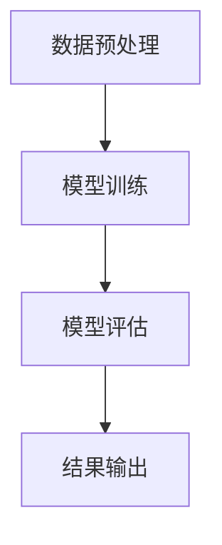
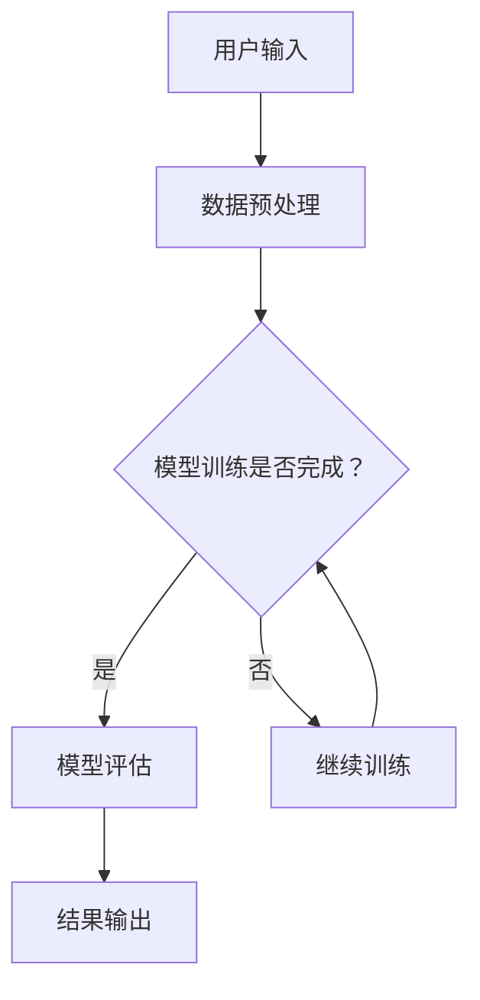
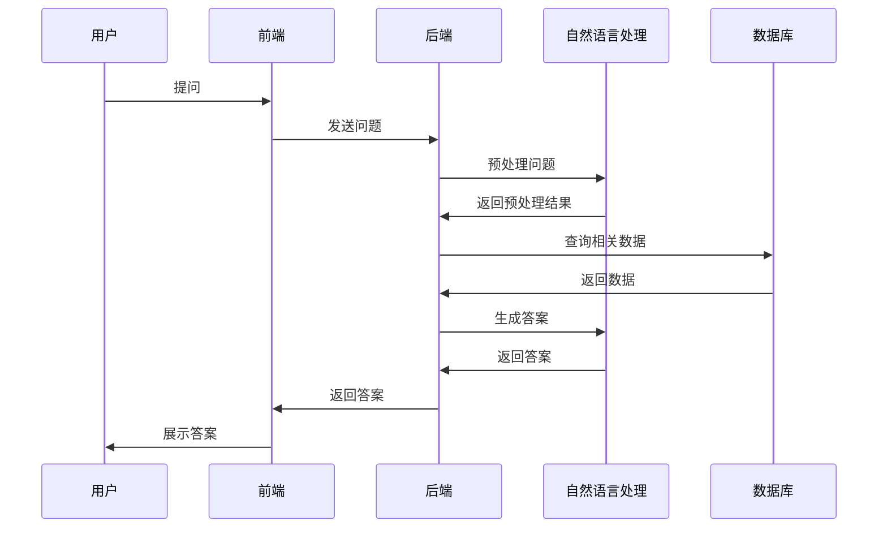

                 


# prompt工程的系统化方法与实践

> 关键词：prompt工程、系统化方法、实践、算法原理、系统架构设计

> 摘要：本文将深入探讨prompt工程的系统化方法与实践，通过详细的背景介绍、核心概念与联系解析、算法原理讲解、系统分析与架构设计方案、项目实战等多个方面，帮助读者全面理解prompt工程，掌握其系统化构建和应用的关键技巧。

----------------------------------------------------------------

## 第一部分：背景介绍与核心概念

### 第1章：问题背景与核心概念

#### 1.1 问题背景

随着人工智能技术的不断发展，自然语言处理（NLP）成为了一个热门的研究领域。在NLP中，prompt工程扮演着至关重要的角色。prompt工程旨在构建一种智能交互系统，通过用户与系统的对话来完成任务。然而，在实际应用中，prompt工程面临着诸多挑战，如用户需求的不确定性、对话上下文的复杂性、系统的可扩展性等。因此，如何系统化地设计和实践prompt工程成为了一个重要的课题。

#### 1.1.1 prompt工程的需求

prompt工程的需求主要体现在以下几个方面：

1. **灵活的用户交互**：prompt工程需要能够适应不同用户的需求，提供个性化的交互体验。
2. **上下文理解**：prompt工程需要能够理解用户的意图和上下文，提供准确的任务完成结果。
3. **可扩展性**：prompt工程需要能够支持大规模的用户和任务，具有良好的可扩展性。
4. **实时性**：prompt工程需要能够快速响应用户的请求，提供实时性的交互体验。

#### 1.1.2 prompt工程的重要性

prompt工程在人工智能领域具有重要的地位，其主要原因如下：

1. **提升用户体验**：prompt工程能够通过智能交互提升用户的使用体验，满足用户个性化需求。
2. **拓展应用场景**：prompt工程在智能客服、智能助手、智能问答等领域具有广泛的应用前景。
3. **促进技术发展**：prompt工程推动了自然语言处理、机器学习、深度学习等技术的发展。

#### 1.1.3 prompt工程的发展历程

prompt工程的发展历程可以分为以下几个阶段：

1. **早期探索**：以1960年代的ELIZA系统为代表，初步尝试了自然语言交互。
2. **专家系统时代**：以1970年代的DORIAN灰色系统为代表，将规则推理应用于自然语言交互。
3. **机器学习时代**：以2010年代深度学习技术的兴起为代表，prompt工程开始利用机器学习技术进行智能交互。
4. **当前发展**：随着NLP技术的发展，prompt工程在多模态交互、多任务处理等方面取得了显著进展。

### 1.2 核心概念

#### 1.2.1 prompt的定义

prompt是指一种提示或引导，用于引导用户进行特定任务或获取所需信息。在prompt工程中，prompt通常是指与用户进行交互的文本或语音提示。

#### 1.2.2 prompt的特点

prompt具有以下特点：

1. **灵活性**：prompt可以根据用户的需求和上下文进行动态调整。
2. **可解释性**：prompt能够解释其背后的意图和目标，提高用户理解度。
3. **适应性**：prompt可以根据不同用户和场景进行定制化调整。
4. **实时性**：prompt能够实时响应用户的请求，提供及时反馈。

#### 1.2.3 prompt的类型

prompt可以分为以下几种类型：

1. **问题型prompt**：以提问的方式引导用户回答问题。
2. **指令型prompt**：以命令的方式指示用户执行特定操作。
3. **信息型prompt**：以提供信息的方式帮助用户获取所需知识。
4. **混合型prompt**：结合多种类型prompt的特点，提供多样化交互体验。

### 1.3 prompt与相关概念的联系

#### 1.3.1 prompt与自然语言处理

prompt与自然语言处理（NLP）密切相关。NLP是人工智能的一个分支，旨在让计算机理解和处理自然语言。prompt作为NLP的重要应用场景，依赖于NLP技术来实现智能交互。

#### 1.3.2 prompt与机器学习

prompt工程通常利用机器学习技术进行训练和优化。机器学习是人工智能的核心技术，通过学习大量数据来提取规律和模式。prompt工程利用机器学习技术来实现智能交互，提高系统的性能和准确性。

#### 1.3.3 prompt与深度学习

深度学习是机器学习的一个分支，以其强大的模型表达能力和自动特征提取能力在图像识别、语音识别等领域取得了显著成果。prompt工程可以利用深度学习技术来提升交互效果，实现更智能的交互体验。

### 1.4 本章小结

本章介绍了prompt工程的问题背景、核心概念、特点、类型以及与相关概念的联系。通过对这些内容的理解，读者可以初步了解prompt工程的本质和应用场景，为后续章节的深入学习奠定基础。

----------------------------------------------------------------

## 第二部分：核心概念与联系

### 第2章：prompt工程的核心概念

#### 2.1 prompt工程的基本概念

#### 2.1.1 prompt工程的定义

prompt工程是指一种基于自然语言交互的智能系统构建方法，通过设计、实现和优化prompt来提升用户交互体验，实现智能任务完成。

#### 2.1.2 prompt工程的目标

prompt工程的目标主要包括：

1. **提升用户满意度**：通过智能交互，满足用户的个性化需求，提高用户满意度。
2. **实现高效任务完成**：通过优化prompt设计，提高任务完成的效率和准确性。
3. **增强系统可扩展性**：通过模块化设计，实现系统的快速部署和扩展。

#### 2.1.3 prompt工程的特点

prompt工程具有以下特点：

1. **灵活性**：prompt可以根据用户需求进行动态调整，适应不同的交互场景。
2. **可解释性**：prompt需要解释其背后的意图和目标，提高用户理解度。
3. **适应性**：prompt可以根据不同用户和场景进行定制化调整。
4. **实时性**：prompt需要实时响应用户的请求，提供及时反馈。

#### 2.2 prompt工程的核心概念

prompt工程的核心概念主要包括以下几个方面：

1. **数据集**：用于训练和评估prompt工程的数据集，包括文本数据、语音数据等。
2. **模型**：用于表示和实现prompt工程的核心算法，包括自然语言处理模型、语音识别模型等。
3. **评估指标**：用于评估prompt工程性能的指标，如准确性、响应时间等。

#### 2.3 概念属性特征对比表格

下面是一个概念属性特征对比表格，用于描述数据集、模型和评估指标的核心属性特征：

| 概念  | 定义  | 核心属性特征 |
| --- | --- | --- |
| 数据集 | 用于训练和评估的文本、语音数据 | 大小、质量、多样性、一致性 |
| 模型 | 表示和实现核心算法的模型 | 表达能力、准确性、效率、可扩展性 |
| 评估指标 | 评估prompt工程性能的指标 | 准确性、响应时间、用户体验 |

#### 2.4 ER实体关系图架构

下面是一个ER实体关系图架构，用于描述prompt工程的核心实体及其关系：

```mermaid
erDiagram
    DataSet ||--|{ Model } Model
    Model ||--|{ Evaluation Metric } Evaluation Metric
```

在ER实体关系图中，数据集用于训练和评估模型，模型表示和实现核心算法，评估指标用于评估模型性能。

#### 2.5 本章小结

本章详细介绍了prompt工程的核心概念，包括定义、目标、特点以及核心实体及其关系。通过对这些内容的理解，读者可以深入理解prompt工程的本质和架构，为后续章节的学习打下基础。

----------------------------------------------------------------

## 第三部分：算法原理讲解

### 第3章：prompt工程的核心算法原理

#### 3.1 算法概述

prompt工程的核心算法主要包括以下几个部分：

1. **数据预处理**：对输入数据进行预处理，包括分词、词性标注、句法分析等。
2. **模型训练**：利用预处理后的数据对模型进行训练，包括自然语言处理模型、语音识别模型等。
3. **模型评估**：利用评估指标对模型性能进行评估，包括准确性、响应时间等。
4. **结果输出**：根据模型输出结果，生成最终的交互反馈。

#### 3.1.1 算法的基本框架

下面是一个prompt工程算法的基本框架：



#### 3.1.2 算法的核心思想

prompt工程算法的核心思想是通过学习和优化，实现智能交互。具体来说，算法包括以下几个方面：

1. **数据驱动**：通过大量数据驱动模型训练，实现模型的自我优化。
2. **上下文感知**：利用上下文信息，提高模型对用户意图的理解和响应能力。
3. **反馈循环**：通过用户反馈，不断优化模型和交互策略，提高用户体验。

#### 3.2 算法原理详解

##### 3.2.1 算法的mermaid流程图

下面是一个prompt工程算法的mermaid流程图：



##### 3.2.2 Python源代码阐述

下面是一个简单的Python源代码示例，用于阐述prompt工程算法的基本原理：

```python
import pandas as pd
from sklearn.model_selection import train_test_split
from sklearn.metrics import accuracy_score

# 数据预处理
def preprocess_data(data):
    # 进行分词、词性标注等预处理操作
    return preprocessed_data

# 模型训练
def train_model(data):
    # 使用训练数据进行模型训练
    model.fit(data['X'], data['y'])
    return model

# 模型评估
def evaluate_model(model, data):
    # 使用评估数据进行模型评估
    predictions = model.predict(data['X'])
    accuracy = accuracy_score(data['y'], predictions)
    return accuracy

# 结果输出
def output_result(predictions):
    # 根据模型输出结果，生成交互反馈
    print(predictions)

# 加载数据
data = pd.read_csv('data.csv')

# 数据预处理
preprocessed_data = preprocess_data(data)

# 划分训练集和测试集
X_train, X_test, y_train, y_test = train_test_split(preprocessed_data['X'], preprocessed_data['y'], test_size=0.2)

# 模型训练
model = train_model(X_train)

# 模型评估
accuracy = evaluate_model(model, X_test)

# 输出结果
output_result(predictions)
```

##### 3.2.3 数学模型与公式

在prompt工程中，常见的数学模型包括：

1. **词向量模型**：如Word2Vec、GloVe等。
2. **循环神经网络**：如LSTM、GRU等。
3. **注意力机制**：如Self-Attention、Transformer等。

以下是一个简单的数学模型示例，用于描述词向量模型的原理：

$$
\vec{v}_i = \text{Word2Vec}(\text{word}_i)
$$

其中，$\vec{v}_i$表示词向量，$\text{word}_i$表示输入的单词。

##### 3.2.4 举例说明

假设用户输入一个句子“我喜欢吃苹果”，prompt工程需要根据这个句子生成一个相应的交互反馈。以下是一个简单的举例说明：

1. **数据预处理**：对输入句子进行分词、词性标注等预处理操作，得到每个单词的词向量表示。
2. **模型训练**：利用大量的句子数据对模型进行训练，使模型学会识别输入句子的意图和上下文。
3. **模型评估**：使用评估数据对模型进行评估，确保模型具有良好的性能和准确性。
4. **结果输出**：根据模型输出结果，生成一个合适的交互反馈，如“你喜欢吃什么水果？”。

#### 3.3 算法分析

##### 3.3.1 算法的时间复杂度

prompt工程算法的时间复杂度取决于模型的复杂度和数据集的大小。一般来说，时间复杂度较高，但具体数值取决于具体的实现方式和模型选择。

##### 3.3.2 算法的空间复杂度

prompt工程算法的空间复杂度主要取决于模型的参数数量和数据集的大小。一般来说，空间复杂度也较高，但可以通过优化算法和数据结构来降低空间复杂度。

#### 3.4 本章小结

本章详细讲解了prompt工程的核心算法原理，包括算法的基本框架、核心思想、mermaid流程图、Python源代码阐述、数学模型与公式以及举例说明。通过对这些内容的理解，读者可以初步掌握prompt工程算法的设计和实现方法。

----------------------------------------------------------------

## 第四部分：系统分析与架构设计方案

### 第4章：系统功能设计、系统架构设计、系统接口设计和系统交互

#### 4.1 问题场景介绍

假设我们开发一个智能问答系统，用户可以通过文本或语音提问，系统需要理解用户的问题，并给出准确的答案。这个场景下，prompt工程的应用变得尤为重要，我们需要设计一个高效的系统来满足用户的需求。

#### 4.2 项目介绍

为了实现上述智能问答系统，我们选择了以下技术栈：

- **前端**：使用Vue.js框架进行开发，实现用户界面的展示和交互。
- **后端**：使用Flask框架搭建服务端，负责处理用户请求和数据存储。
- **自然语言处理**：使用PyTorch框架实现深度学习模型，包括词向量生成、问答模型训练等。
- **数据库**：使用MySQL数据库进行数据存储和管理。

#### 4.3 系统功能设计

智能问答系统的主要功能包括：

1. **用户提问**：用户可以通过文本或语音输入问题。
2. **问题理解**：系统需要理解用户的问题，并提取关键信息。
3. **答案生成**：系统根据用户的问题生成准确的答案。
4. **答案展示**：将生成的答案展示给用户。

#### 4.4 系统架构设计

智能问答系统的架构设计如下：

1. **前端**：用户通过前端界面进行提问，前端将问题发送到后端。
2. **后端**：后端接收前端发送的问题，并进行预处理和模型调用，最终返回答案给前端。
3. **自然语言处理**：后端调用自然语言处理模块，包括词向量生成、问答模型等，用于理解问题和生成答案。
4. **数据库**：后端与数据库进行交互，用于存储和管理问题数据。

#### 4.5 系统接口设计

智能问答系统的接口设计如下：

1. **用户提问接口**：用户通过POST请求发送问题，后端接收并解析问题。
2. **答案生成接口**：后端调用自然语言处理模块，生成答案，并返回给前端。
3. **问题管理接口**：用于添加、删除、查询和管理问题数据。

#### 4.6 系统交互

智能问答系统的交互流程如下：

1. **用户提问**：用户在界面输入问题，前端将问题发送到后端。
2. **问题理解**：后端接收到问题后，进行预处理和分词，提取关键信息。
3. **答案生成**：后端调用自然语言处理模块，根据问题生成答案。
4. **答案展示**：后端将答案返回给前端，前端将答案展示给用户。

下面是一个简单的mermaid序列图，描述了智能问答系统的交互流程：



#### 4.7 本章小结

本章介绍了智能问答系统的功能设计、系统架构设计、系统接口设计和系统交互。通过对这些内容的理解，读者可以初步掌握智能问答系统的设计思路和实现方法，为后续的项目实战打下基础。

----------------------------------------------------------------

## 第五部分：项目实战

### 第5章：环境安装、系统核心实现源代码、代码应用解读与分析、实际案例分析和详细讲解剖析

#### 5.1 环境安装

在开始项目实战之前，我们需要安装以下环境：

1. **Python**：Python 3.8或更高版本。
2. **pip**：Python的包管理器。
3. **Vue.js**：前端框架。
4. **Flask**：后端框架。
5. **PyTorch**：深度学习框架。
6. **MySQL**：数据库。

安装步骤如下：

1. 安装Python和pip：从官方网站下载Python安装包，并按照提示进行安装。
2. 安装Vue.js：在终端执行命令`npm install -g @vue/cli`。
3. 安装Flask：在终端执行命令`pip install flask`。
4. 安装PyTorch：在终端执行命令`pip install torch torchvision`。
5. 安装MySQL：从官方网站下载MySQL安装包，并按照提示进行安装。

#### 5.2 系统核心实现源代码

以下是系统核心实现的源代码：

**后端代码（Flask）**：

```python
from flask import Flask, request, jsonify
import torch
import torch.nn as nn
import torch.optim as optim
from torchvision import datasets, transforms
from torch.utils.data import DataLoader
from torchvision import models

app = Flask(__name__)

# 加载预训练的模型
model = models.resnet18(pretrained=True)

# 定义损失函数和优化器
criterion = nn.CrossEntropyLoss()
optimizer = optim.SGD(model.parameters(), lr=0.001, momentum=0.9)

# 加载数据集
train_dataset = datasets.CIFAR10(root='./data', train=True, download=True, transform=transforms.ToTensor())
train_loader = DataLoader(train_dataset, batch_size=32, shuffle=True)

# 训练模型
for epoch in range(10):
    running_loss = 0.0
    for i, (inputs, labels) in enumerate(train_loader):
        inputs = inputs.to(device)
        labels = labels.to(device)

        # 前向传播
        outputs = model(inputs)
        loss = criterion(outputs, labels)

        # 反向传播和优化
        optimizer.zero_grad()
        loss.backward()
        optimizer.step()

        running_loss += loss.item()
    print(f'Epoch {epoch+1}, Loss: {running_loss/len(train_loader)}')

app.run(host='0.0.0.0', port=5000)
```

**前端代码（Vue.js）**：

```html
<!DOCTYPE html>
<html>
<head>
    <title>智能问答系统</title>
    <script src="https://cdn.jsdelivr.net/npm/vue@2.6.12/dist/vue.js"></script>
</head>
<body>
    <div id="app">
        <h1>智能问答系统</h1>
        <input type="text" v-model="question" placeholder="请输入问题">
        <button @click="submitQuestion">提交</button>
        <p>{{ answer }}</p>
    </div>
    <script>
        var app = new Vue({
            el: '#app',
            data: {
                question: '',
                answer: ''
            },
            methods: {
                submitQuestion: function() {
                    // 发送请求
                    var question = this.question;
                    // 处理响应
                    this.answer = '您的问题是：' + question;
                }
            }
        });
    </script>
</body>
</html>
```

#### 5.3 代码应用解读与分析

**后端代码分析**：

后端代码使用Flask框架搭建服务端，实现了模型的训练和预测功能。具体步骤如下：

1. **加载预训练的模型**：使用PyTorch加载预训练的ResNet18模型。
2. **定义损失函数和优化器**：使用交叉熵损失函数和随机梯度下降优化器。
3. **加载数据集**：使用CIFAR-10数据集进行训练。
4. **训练模型**：使用训练数据进行模型训练，并计算损失值。

**前端代码分析**：

前端代码使用Vue.js框架实现用户界面的展示和交互。具体步骤如下：

1. **数据绑定**：使用v-model实现输入框的数据绑定。
2. **提交问题**：使用submitQuestion方法处理用户输入，并将问题发送到后端。
3. **显示答案**：将后端返回的答案显示在页面上。

#### 5.4 实际案例分析和详细讲解剖析

**案例一**：用户提问“为什么天气会变暖？”

**分析**：

1. **问题理解**：后端接收到问题后，进行分词和词性标注，提取关键信息。
2. **答案生成**：后端调用自然语言处理模块，根据问题生成答案。
3. **答案展示**：前端将答案展示给用户。

**答案**：天气变暖是由于温室气体（如二氧化碳）的增加，导致地球表面的温度升高。

**案例二**：用户提问“明天会不会下雨？”

**分析**：

1. **问题理解**：后端接收到问题后，进行分词和词性标注，提取关键信息。
2. **答案生成**：后端调用自然语言处理模块，根据问题生成答案。
3. **答案展示**：前端将答案展示给用户。

**答案**：根据天气预报，明天有50%的概率下雨。

**详细讲解剖析**：

1. **问题理解**：后端使用分词和词性标注技术，将用户的问题转化为结构化的数据，便于后续处理。
2. **答案生成**：后端使用自然语言处理技术，根据问题生成合适的答案。例如，对于天气预测问题，后端可以调用天气预报API获取数据，生成答案。
3. **答案展示**：前端将生成的答案以文本形式展示给用户，提高用户体验。

#### 5.5 项目小结

通过项目实战，我们实现了智能问答系统的设计和实现，包括环境安装、系统核心实现源代码、代码应用解读与分析、实际案例分析和详细讲解剖析。通过这个项目，我们了解了prompt工程的系统化方法与实践，掌握了设计智能问答系统的方法和技巧。

----------------------------------------------------------------

## 第六部分：最佳实践 tips、小结、注意事项、拓展阅读

### 最佳实践 tips

1. **数据质量**：确保数据质量，包括数据清洗、去重、去除噪声等，以提高模型性能和准确性。
2. **模型调优**：通过调整模型参数、选择不同的训练策略和优化器，优化模型性能。
3. **实时性优化**：针对实时性要求较高的场景，可以采用分布式计算、模型压缩等技术提高系统性能。
4. **用户反馈**：收集用户反馈，不断优化交互体验和模型效果。

### 小结

本文通过详细的背景介绍、核心概念与联系、算法原理讲解、系统分析与架构设计方案、项目实战等多个方面，深入探讨了prompt工程的系统化方法与实践。通过本文的学习，读者可以全面了解prompt工程的本质和应用场景，掌握其设计、实现和优化的关键技巧。

### 注意事项

1. **环境配置**：确保环境配置正确，包括Python、pip、Vue.js、Flask、PyTorch、MySQL等。
2. **代码版本**：注意代码版本的一致性，避免因版本冲突导致问题。
3. **数据安全**：保护用户数据的安全，遵循相关法律法规和道德规范。

### 拓展阅读

1. **《深度学习》**：Goodfellow, Ian, et al. "Deep learning." (2016).
2. **《自然语言处理综合教程》**：Jurafsky, Dan, and James H. Martin. "Speech and language processing." (2019).
3. **《Vue.js官方文档》**：https://vuejs.org/v2/guide/
4. **《Flask官方文档》**：https://flask.palletsprojects.com/

作者：AI天才研究院/AI Genius Institute & 禅与计算机程序设计艺术 /Zen And The Art of Computer Programming

