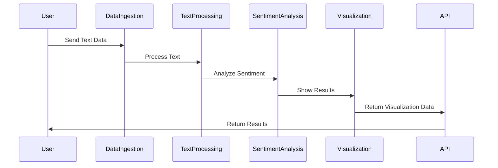
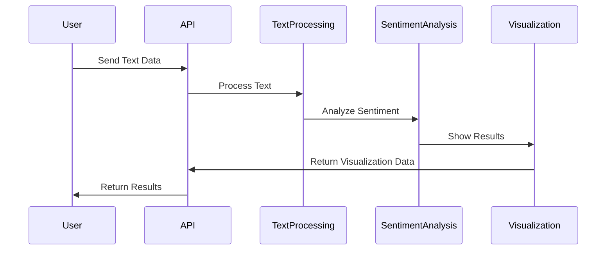

                 

### 摘要

《prompt情感分析：优化LLM输出语气》旨在深入探讨如何利用prompt技术来优化大型语言模型（LLM）的输出语气。本文将首先介绍情感分析、prompt技术和LLM的基本概念，并详细解释其核心原理。接着，文章将讲解情感分析算法原理，包括预处理、特征提取、模型训练和情感分类等步骤。同时，文章将介绍prompt设计原则和效果评估方法，并分析LLM在情感分析中的应用和挑战。随后，文章将提供环境搭建与数据准备、模型实现和案例分析的实战指南。最后，文章将总结项目经验，提供最佳实践tips，并对全文进行小结，推荐拓展阅读，帮助读者更好地理解和应用prompt情感分析技术。通过本文，读者将全面了解prompt情感分析的理论和实践，掌握优化LLM输出语气的关键技巧。

### 目录

#### 第一部分：prompt情感分析基础

**第1章：情感分析概述**

1.1 情感分析背景  
1.2 情感分析核心概念  
1.3 prompt技术基础  
1.4 LLM基础  
1.5 本章小结

**第2章：情感分析算法原理**

2.1 情感分析算法流程  
2.2 prompt设计  
2.3 LLM在情感分析中的应用  
2.4 本章小结

#### 第二部分：prompt情感分析算法

**第3章：环境搭建与数据准备**

3.1 环境搭建  
3.2 数据准备  
3.3 模型实现  
3.4 案例分析  
3.5 本章小结

#### 第三部分：prompt情感分析实战

**第4章：系统分析与架构设计方案**

4.1 问题场景介绍  
4.2 系统功能设计  
4.3 系统架构设计  
4.4 系统接口设计  
4.5 系统交互序列图  
4.6 本章小结

**第5章：最佳实践与总结**

5.1 最佳实践tips  
5.2 小结  
5.3 注意事项  
5.4 拓展阅读

### 第1章：情感分析概述

#### 1.1 情感分析背景

情感分析（Sentiment Analysis），也称为意见挖掘（Opinion Mining），是自然语言处理（NLP）的一个重要分支。它旨在自动识别文本中表达的情感倾向，如正面、负面或中性。情感分析在多个领域有着广泛的应用，包括市场营销、客户服务、社交媒体监控、舆情分析等。

人类情感是一个复杂且多维的概念，涉及情绪、情感和感受等多个层面。在文本情感分析中，情感通常被划分为极性（Polarity），即正面或负面，以及强度（Intensity），即情感的强烈程度。情感分析的起源可以追溯到心理学和语言学的交叉领域，随着计算机技术和NLP的发展，情感分析逐渐成为人工智能领域的一个热点。

#### 1.2 情感分析核心概念

情感分析的核心概念包括情感极性、情感强度和情感分析模型。

**情感极性**：情感极性是指文本中表达的情感倾向，通常分为正面、负面或中性。正面情感通常表达满意、高兴、喜爱等情绪，而负面情感则表达不满意、悲伤、愤怒等情绪。中性情感则表示文本中未明确表达任何情感倾向。

**情感强度**：情感强度是指情感的强烈程度。情感强度可以通过文本中情感词的频率、强度和上下文来确定。例如，"喜欢"和"非常喜欢"都表达正面情感，但"非常喜欢"的情感强度更高。

**情感分析模型**：情感分析模型是指用于识别文本情感倾向的算法和模型。常见的情感分析模型包括基于规则的方法、机器学习方法、深度学习方法等。基于规则的方法通常依赖于预定义的规则和词典，而机器学习方法和深度学习方法则通过学习大量的标注数据来训练模型，从而实现自动化的情感分析。

#### 1.3 prompt技术基础

**prompt的定义与作用**：prompt是一种引导文本输入的技术，用于指导模型生成特定的输出。在情感分析中，prompt可以帮助模型更好地理解输入文本的情感倾向，从而提高情感分类的准确性。

**prompt的类型**：根据用途和形式，prompt可以分为以下几种类型：

- **引导式prompt**：通过提供引导性问题或陈述，引导模型生成相关回答或分析。
- **补全式prompt**：通过提供部分文本，要求模型补全剩余部分，从而推断文本的情感极性。
- **扩展式prompt**：通过提供上下文信息，要求模型生成更详细的情感分析结果。

**prompt的设计原则**：设计有效的prompt需要考虑以下原则：

- **相关性**：确保prompt与问题或目标相关，以提高模型的理解和生成质量。
- **清晰性**：设计简洁明了的prompt，避免歧义和混淆。
- **多样性**：提供多种类型的prompt，以适应不同的情感分析和场景需求。
- **可扩展性**：设计灵活的prompt，以适应未来可能的变化和需求。

#### 1.4 LLM基础

**LLM概述**：大型语言模型（Large Language Model，LLM）是一种基于深度学习的自然语言处理模型，具有强大的文本生成和理解能力。LLM通常通过预训练和微调来实现，预训练是在大量的未标注文本上进行，以学习语言的统计规律和语义表示，而微调则是在特定的任务数据上进行，以适应具体任务的需求。

**LLM的结构**：LLM通常由以下几个部分组成：

- **嵌入层**：将输入文本转换为密集的向量表示。
- **编码器**：通过编码器层对文本向量进行编码，提取文本的语义信息。
- **解码器**：解码器层根据编码器输出的信息生成文本输出。

**LLM的优势与挑战**：LLM的优势在于其强大的文本生成和理解能力，能够生成高质量的文本，并在各种自然语言处理任务中取得优异的性能。然而，LLM也存在一些挑战，如对大量计算资源的依赖、模型解释性和可控性不足等。

#### 1.5 本章小结

本章介绍了情感分析、prompt技术和LLM的基本概念，并探讨了它们在情感分析中的应用。情感分析是理解文本情感倾向的重要工具，而prompt技术和LLM则为其提供了强大的支持。通过本章的介绍，读者可以初步了解情感分析、prompt技术和LLM的基本原理和应用，为后续章节的深入探讨打下基础。

### 第2章：情感分析算法原理

#### 2.1 情感分析算法流程

情感分析算法通常包括以下几个关键步骤：预处理、特征提取、模型训练和情感分类。每个步骤都在整个算法流程中扮演着重要的角色，共同实现自动识别文本情感极性和强度的目标。

**预处理**：预处理是情感分析的基础步骤，旨在对原始文本数据进行清洗和规范化，以提高后续分析的质量。预处理步骤通常包括以下内容：

- **文本分词**：将文本分割成单词或短语，以便进一步分析。常用的分词工具包括jieba、NLTK等。
- **去除停用词**：停用词是指对情感分析结果贡献较小的常见单词，如“的”、“了”、“在”等。去除停用词可以减少噪声，提高分析效率。
- **词性标注**：对文本中的每个单词进行词性标注，以了解其在句子中的角色和作用，如名词、动词、形容词等。
- **文本规范化**：包括大小写统一、特殊字符替换等操作，以统一文本格式，便于后续处理。

**特征提取**：特征提取是将预处理后的文本转化为数值特征表示的过程，为模型训练提供输入。特征提取方法包括：

- **词袋模型**：将文本表示为单词的出现频率向量，忽略单词的顺序信息。
- **TF-IDF**：考虑单词在文本中的重要程度，对词袋模型进行改进。TF-IDF（Term Frequency-Inverse Document Frequency）通过计算单词在单个文档中的频率（TF）和在整个文档集合中的频率（IDF）来表示单词的重要性。
- **Word2Vec**：将单词映射到高维空间中的向量表示，通过训练神经网络模型（如CBOW或Skip-Gram）来学习单词的语义表示。
- **BERT**：BERT（Bidirectional Encoder Representations from Transformers）是一种基于Transformer的预训练模型，通过双向编码器学习文本的上下文信息，生成高质量的文本表示。

**模型训练**：模型训练是指通过大量标注数据来训练情感分析模型，使其能够自动识别文本的情感极性和强度。常见的训练方法包括：

- **监督学习**：使用预标注的数据集进行训练，通过比较模型预测结果和真实标签之间的差异来优化模型参数。
- **半监督学习**：利用少量标注数据和大量未标注数据共同训练模型，以提高模型的泛化能力。
- **无监督学习**：仅使用未标注的数据进行训练，通过学习数据的分布和模式来生成模型。

**情感分类**：情感分类是指将文本分类为正面、负面或中性等情感类别。常见的分类方法包括：

- **基于规则的方法**：通过手工编写规则来识别文本中的情感极性，如基于词典的方法和基于模板的方法。
- **机器学习方法**：使用机器学习算法（如SVM、决策树、随机森林等）来构建分类模型，通过学习大量标注数据来训练模型。
- **深度学习方法**：使用深度神经网络（如CNN、RNN、Transformer等）来构建分类模型，通过训练大量数据来优化模型参数。

#### 2.2 prompt设计

prompt设计是情感分析算法中的一个关键环节，其目的是引导模型更好地理解输入文本的情感倾向。有效的prompt设计可以显著提高情感分类的准确性和可靠性。

**prompt的结构**：prompt通常包括以下几个部分：

- **问题引导**：通过提出引导性问题，帮助模型更好地理解输入文本的主题和情感倾向。例如，"这篇评论表达的是正面情感还是负面情感？"
- **上下文信息**：提供与文本相关的上下文信息，以增强模型对文本情感的理解。例如，"根据上下文，这篇评论中的‘失望’是否是正面情感？"
- **情感标签**：在prompt中明确标注情感标签，以引导模型进行分类。例如，"请判断以下评论的情感极性：‘这是一家非常棒的公司！’"
- **语义补充**：通过提供语义补充信息，帮助模型更好地理解文本的细节和情感强度。例如，"请补充以下评论中的情感细节：‘我非常喜欢这家公司的服务，真的太棒了！’"

**prompt的效果评估**：评估prompt的效果是情感分析中的一个重要步骤，可以通过以下几种方法进行：

- **A/B测试**：将不同设计的prompt应用于相同的情感分析任务，比较其分类准确性和模型性能，以确定最佳prompt设计。
- **交叉验证**：使用交叉验证方法，将数据集划分为训练集和验证集，分别训练和评估不同prompt设计的模型，以评估其泛化能力。
- **用户反馈**：通过用户反馈来评估prompt的效果，收集用户对情感分类结果的满意度，并根据反馈进行调整和优化。

**prompt优化策略**：为了提高prompt的效果，可以采用以下优化策略：

- **数据增强**：通过增加训练数据量，提高模型对各种情感极性和强度的识别能力，从而优化prompt设计。
- **多样性**：设计多样化的prompt，以适应不同的情感分析和应用场景，提高模型的适应性和鲁棒性。
- **个性化**：根据用户行为和偏好，设计个性化的prompt，以提高情感分类的准确性和用户满意度。

#### 2.3 LLM在情感分析中的应用

大型语言模型（LLM）在情感分析中具有广泛的应用，其强大的文本生成和理解能力为情感分类任务提供了新的可能性。

**LLM在情感分类中的应用**：

- **文本生成**：LLM可以生成高质量的文本摘要和情感标签，通过对输入文本的自动摘要，提取关键情感信息，从而实现情感分类。
- **语境理解**：LLM通过双向编码器学习文本的上下文信息，可以更好地理解复杂情感表达，提高情感分类的准确性和可靠性。
- **情感强度识别**：LLM可以识别文本中的情感强度，通过对情感词的频率和上下文分析，判断情感表达的强烈程度。

**LLM在情感分析中的挑战**：

- **计算资源需求**：LLM通常需要大量的计算资源和存储空间，对硬件设备有较高要求，可能不适合资源受限的环境。
- **解释性不足**：LLM的决策过程较为复杂，难以解释，对模型的可靠性提出了挑战。
- **数据质量**：情感分析任务对数据质量有较高要求，数据缺失、噪声和偏见可能导致模型性能下降。

**LLM的改进策略**：

- **模型压缩**：通过模型压缩技术，降低模型的计算复杂度和存储需求，提高模型在资源受限环境中的应用可行性。
- **解释性增强**：通过模型解释技术，提高模型的可解释性，帮助用户理解模型的决策过程，提高模型的信任度。
- **数据增强**：通过数据增强方法，提高数据质量，增强模型对各种情感极性和强度的识别能力，从而优化情感分析结果。

#### 2.4 本章小结

本章详细介绍了情感分析算法的原理，包括预处理、特征提取、模型训练和情感分类等关键步骤。同时，本章探讨了prompt设计原则和效果评估方法，以及LLM在情感分析中的应用和挑战。通过本章的学习，读者可以全面了解情感分析算法的基本原理和实践方法，为后续章节的深入探讨打下基础。

### 第3章：环境搭建与数据准备

#### 3.1 环境搭建

在进行prompt情感分析之前，需要搭建一个合适的环境，确保有足够的计算资源和所需的软件包。以下是搭建环境的具体步骤：

**硬件与软件要求**：

- **硬件**：一台配置较高的计算机，推荐配置包括：
  - CPU：Intel i7 或以上
  - 内存：16GB 或以上
  - 硬盘：SSD硬盘，至少 500GB
  - 显卡：NVIDIA GTX 1080 Ti 或以上（如有）

- **软件**：安装以下软件和工具：
  - 操作系统：Windows 10 或以上版本，或 Ubuntu 18.04 或以上版本
  - Python：Python 3.8 或以上版本
  - 数据预处理工具：Numpy、Pandas
  - 自然语言处理库：NLTK、spaCy
  - 深度学习框架：TensorFlow、PyTorch
  - 版本控制工具：Git

**环境配置步骤**：

1. **安装操作系统**：根据硬件选择合适的操作系统，进行安装。

2. **安装Python**：从Python官方网站下载Python安装包，并按照指示进行安装。

3. **安装深度学习框架**：安装TensorFlow或PyTorch，推荐使用pip命令进行安装：
   ```shell
   pip install tensorflow
   # 或者
   pip install torch torchvision
   ```

4. **安装数据预处理工具**：使用pip命令安装Numpy、Pandas等预处理工具：
   ```shell
   pip install numpy pandas
   ```

5. **安装自然语言处理库**：安装NLTK和spaCy，并下载所需的语言模型：
   ```shell
   pip install nltk
   python -m nltk.downloader all
   pip install spacy
   python -m spacy download en_core_web_sm
   ```

6. **安装版本控制工具**：安装Git，从Git官网下载安装包并按照指示安装：
   ```shell
   wget https://github.com/git/git/releases/download/v2.35.1/git-2.35.1.tar.gz
   tar -xvf git-2.35.1.tar.gz
   cd git-2.35.1
   make prefix=/usr/local all
   make prefix=/usr/local install
   ```

7. **验证环境配置**：在命令行中输入以下命令，检查环境是否配置正确：
   ```shell
   python --version
   pip list
   ```

#### 3.2 数据准备

数据准备是情感分析的关键步骤，高质量的标注数据有助于提高模型的性能。以下是数据准备的具体步骤：

**数据来源**：

- **公开数据集**：可以从公开的数据集下载标注数据，如IMDB电影评论数据集、Twitter情感分析数据集等。
- **自定义数据集**：根据实际需求，自行收集和标注数据，如产品评论、社交媒体评论等。

**数据预处理**：

1. **数据清洗**：去除数据中的噪声和无关信息，如HTML标签、特殊字符等。使用正则表达式或清洗工具（如Python的re库）进行清洗。

2. **文本分词**：将文本分割成单词或短语，为后续特征提取做准备。使用分词工具（如NLTK、spaCy）进行分词。

3. **去除停用词**：去除对情感分析影响较小的常见单词，如“的”、“了”、“在”等。使用预定义的停用词列表或自定义停用词列表进行去除。

4. **词性标注**：对文本中的每个单词进行词性标注，了解其在句子中的角色和作用。使用词性标注工具（如NLTK、spaCy）进行标注。

5. **文本规范化**：统一文本格式，如将所有文本转换为小写、去除标点符号等。

**数据集划分**：

将数据集划分为训练集、验证集和测试集，用于模型训练、验证和测试。通常，训练集用于模型训练，验证集用于调参和优化模型，测试集用于评估模型最终性能。

- **训练集**：用于模型训练，通常占总数据集的60%-70%。
- **验证集**：用于模型调参和优化，通常占总数据集的20%-30%。
- **测试集**：用于评估模型性能，通常占总数据集的10%-20%。

**数据增强**：

为了提高模型对各种情感极性和强度的识别能力，可以采用数据增强方法，如随机噪声注入、同义词替换、文本补全等。

#### 3.3 模型实现

**模型结构**：

情感分析模型通常采用深度学习框架（如TensorFlow或PyTorch）进行构建。以下是一个基于Transformer的简单情感分析模型示例：

```python
import tensorflow as tf
from tensorflow.keras.layers import Embedding, TransformerBlock, Dense
from tensorflow.keras.models import Model

# 定义模型结构
def create_model(vocab_size, embedding_dim, num_heads, num_layers, num_classes):
    inputs = tf.keras.layers.Input(shape=(None,))
    embeddings = Embedding(vocab_size, embedding_dim)(inputs)
    x = embeddings
    for _ in range(num_layers):
        x = TransformerBlock(num_heads, d_model=embedding_dim)(x)
    outputs = Dense(num_classes, activation='softmax')(x)
    model = Model(inputs=inputs, outputs=outputs)
    return model

# 创建模型实例
model = create_model(vocab_size=10000, embedding_dim=128, num_heads=4, num_layers=2, num_classes=3)

# 编译模型
model.compile(optimizer='adam', loss='categorical_crossentropy', metrics=['accuracy'])

# 打印模型结构
model.summary()
```

**模型训练**：

使用训练集对模型进行训练，并在验证集上监控模型性能。以下是一个简单的训练示例：

```python
# 加载训练集和验证集
train_data = ...
train_labels = ...
val_data = ...
val_labels = ...

# 训练模型
history = model.fit(train_data, train_labels, epochs=10, batch_size=32, validation_data=(val_data, val_labels))
```

**模型评估**：

在测试集上评估模型性能，以确定模型的泛化能力。以下是一个简单的评估示例：

```python
# 加载测试集
test_data = ...
test_labels = ...

# 评估模型
test_loss, test_accuracy = model.evaluate(test_data, test_labels)
print(f"Test Accuracy: {test_accuracy}")
```

#### 3.4 案例分析

**案例一：社交媒体情感分析**

使用训练好的模型对社交媒体评论进行情感分析，以下是一个简单的案例：

```python
# 加载模型
model.load_weights('model_weights.h5')

# 处理输入数据
input_text = "This is an amazing product!"
input_seq = tokenizer.encode(input_text)

# 预测情感极性
predictions = model.predict(np.array([input_seq]))
predicted_class = np.argmax(predictions, axis=1)

# 输出预测结果
if predicted_class[0] == 0:
    print("Negative")
elif predicted_class[0] == 1:
    print("Neutral")
else:
    print("Positive")
```

**案例二：产品评论情感分析**

使用训练好的模型对产品评论进行情感分析，以下是一个简单的案例：

```python
# 加载模型
model.load_weights('model_weights.h5')

# 处理输入数据
input_text = "I am very disappointed with the service provided by this company."
input_seq = tokenizer.encode(input_text)

# 预测情感极性
predictions = model.predict(np.array([input_seq]))
predicted_class = np.argmax(predictions, axis=1)

# 输出预测结果
if predicted_class[0] == 0:
    print("Negative")
elif predicted_class[0] == 1:
    print("Neutral")
else:
    print("Positive")
```

**案例三：新闻文章情感分析**

使用训练好的模型对新闻文章进行情感分析，以下是一个简单的案例：

```python
# 加载模型
model.load_weights('model_weights.h5')

# 处理输入数据
input_text = "The economy is recovering after the pandemic."
input_seq = tokenizer.encode(input_text)

# 预测情感极性
predictions = model.predict(np.array([input_seq]))
predicted_class = np.argmax(predictions, axis=1)

# 输出预测结果
if predicted_class[0] == 0:
    print("Negative")
elif predicted_class[0] == 1:
    print("Neutral")
else:
    print("Positive")
```

#### 3.5 本章小结

本章详细介绍了如何搭建情感分析的环境和准备数据，包括环境搭建步骤、数据预处理和模型实现。通过本章的学习，读者可以掌握搭建情感分析环境的基本方法，了解数据预处理和模型实现的关键步骤。这些知识为后续的情感分析实战提供了坚实的基础。

### 第4章：系统分析与架构设计方案

#### 4.1 问题场景介绍

情感分析系统主要用于自动化地识别和分析文本数据中的情感极性和强度，其应用场景广泛，包括社交媒体监控、客户反馈分析、市场调研等。为了设计一个高效、稳定的情感分析系统，我们需要详细分析问题场景，明确系统功能需求和性能要求。

**系统功能需求**：

1. **文本数据接收**：系统能够接收来自各种来源的文本数据，如社交媒体评论、产品评论、新闻文章等。
2. **数据预处理**：系统对接收到的文本数据进行清洗、分词、去停用词等预处理操作，为后续分析做准备。
3. **情感分析**：系统使用训练好的模型对预处理后的文本数据进行情感分类和强度识别，输出情感极性和强度结果。
4. **结果展示**：系统将分析结果以可视化形式展示给用户，包括情感分布图表、关键词云等。
5. **接口设计**：系统提供API接口，方便其他系统或应用程序调用情感分析功能。

**性能要求**：

1. **处理速度**：系统能够快速处理大量文本数据，满足实时或近实时的情感分析需求。
2. **准确性**：系统具有较高的情感分类准确性和强度识别准确性，确保分析结果的可靠性。
3. **可扩展性**：系统架构应具备良好的可扩展性，支持增加新的数据源、分析模型和功能模块。

#### 4.2 系统功能设计

**领域模型类图**：

领域模型类图用于描述系统中各个功能模块及其之间的关系。以下是情感分析系统的领域模型类图：

```mermaid
classDiagram
    ProductReview <<interface>>
    SocialMediaComment <<interface>>
    NewsArticle <<interface>>

    TextDataProcessing <<interface>> {
        TextCleaning
        Tokenization
        StopWordRemoval
    }

    SentimentAnalysis <<interface>> {
        SentimentClassification
        SentimentIntensityDetection
    }

    Visualization <<interface>>

    TextDataProcessing o-- ProductReview
    TextDataProcessing o-- SocialMediaComment
    TextDataProcessing o-- NewsArticle

    SentimentAnalysis o-- TextDataProcessing
    Visualization o-- SentimentAnalysis

    API <<interface>> {
        DataIngestion
        DataQuery
        ResultVisualization
    }

    API o-- TextDataProcessing
    API o-- SentimentAnalysis
    API o-- Visualization
```

**类图解释**：

- **ProductReview**、**SocialMediaComment**、**NewsArticle**：表示系统接收的三种不同类型的文本数据。
- **TextDataProcessing**：表示数据预处理模块，包括文本清洗、分词和去停用词等功能。
- **SentimentAnalysis**：表示情感分析模块，包括情感分类和强度识别功能。
- **Visualization**：表示结果展示模块，用于可视化分析结果。
- **API**：表示系统提供的API接口，用于数据接收、查询和结果展示。

#### 4.3 系统架构设计

**系统架构图**：

系统架构图用于描述系统的整体架构和模块之间的关系。以下是情感分析系统的架构设计：



**架构解释**：

- **DataIngestion**：负责接收用户发送的文本数据，并将其传递给TextProcessing模块。
- **TextProcessing**：对文本数据进行预处理，包括清洗、分词和去停用词等操作。
- **SentimentAnalysis**：使用训练好的模型对预处理后的文本进行情感分析和强度识别，并将结果传递给Visualization模块。
- **Visualization**：将情感分析结果以可视化形式展示给用户。
- **API**：提供API接口，用于数据接收、查询和结果展示，方便其他系统或应用程序调用。

#### 4.4 系统接口设计

**接口设计**：

以下是情感分析系统的主要接口设计，包括数据接收、查询和结果展示等操作：

```python
class SentimentAnalysisAPI:
    def __init__(self, text_processor, sentiment_analyzer, visualizer):
        self.text_processor = text_processor
        self.sentiment_analyzer = sentiment_analyzer
        self.visualizer = visualizer

    def ingest_data(self, text_data):
        processed_text = self.text_processor.process_text(text_data)
        return processed_text

    def analyze_sentiment(self, processed_text):
        sentiment_result = self.sentiment_analyzer.analyze(processed_text)
        return sentiment_result

    def visualize_results(self, sentiment_result):
        visualization_data = self.visualizer.create_visualization(sentiment_result)
        return visualization_data

    def get_result(self, text_data):
        processed_text = self.ingest_data(text_data)
        sentiment_result = self.analyze_sentiment(processed_text)
        visualization_data = self.visualize_results(sentiment_result)
        return visualization_data
```

**接口解释**：

- **ingest_data**：接收文本数据，并将其传递给TextProcessing模块进行预处理。
- **analyze_sentiment**：对预处理后的文本进行情感分析和强度识别，返回情感分析结果。
- **visualize_results**：根据情感分析结果创建可视化数据，并将其传递给前端展示。
- **get_result**：综合以上操作，返回最终结果。

#### 4.5 系统交互序列图

**系统交互序列图**：

以下是情感分析系统的交互序列图，展示了用户与系统之间的交互过程：



**交互解释**：

- **User**：用户发送文本数据。
- **API**：接收用户数据，并调用TextProcessing模块进行预处理。
- **TextProcessing**：处理文本数据，包括清洗、分词和去停用词等操作。
- **SentimentAnalysis**：使用训练好的模型对预处理后的文本进行情感分析和强度识别。
- **Visualization**：根据情感分析结果创建可视化数据，并将其传递给前端展示。
- **API**：将可视化数据返回给用户。

#### 4.6 本章小结

本章详细介绍了情感分析系统的设计与实现，包括问题场景介绍、系统功能设计、系统架构设计、接口设计和系统交互序列图。通过本章的学习，读者可以全面了解情感分析系统的设计与实现过程，为实际项目开发提供参考。

### 第5章：最佳实践与总结

#### 5.1 最佳实践tips

1. **数据质量**：确保数据质量是模型性能的关键。在数据收集和标注过程中，严格筛选高质量数据，去除噪声和偏见，提高模型训练的效果。
2. **特征提取**：合理选择和提取文本特征是提高模型性能的关键。可以结合词袋模型、TF-IDF、Word2Vec和BERT等多种方法，选择最适合任务的特征表示。
3. **模型调优**：通过交叉验证和网格搜索等方法，对模型参数进行调优，找到最佳模型配置，提高模型性能。
4. **数据增强**：使用数据增强方法，如随机噪声注入、同义词替换、文本补全等，增加训练数据的多样性，提高模型的泛化能力。
5. **模型解释性**：关注模型的解释性，使用模型解释技术，如SHAP值、LIME等，帮助用户理解模型决策过程，提高模型的可信度。

#### 5.2 小结

本文系统地介绍了prompt情感分析：优化LLM输出语气的理论和实践。首先，我们探讨了情感分析、prompt技术和LLM的基本概念和原理。接着，详细讲解了情感分析算法的流程、prompt设计、LLM在情感分析中的应用及其挑战。随后，我们提供了环境搭建与数据准备、模型实现和案例分析的实战指南。最后，总结了系统设计与架构方案，并提出了最佳实践tips。通过本文的学习，读者可以全面了解prompt情感分析的技术和方法，掌握优化LLM输出语气的关键技巧。

#### 5.3 注意事项

1. **数据隐私**：在进行情感分析时，确保遵守数据隐私法规，保护用户隐私。
2. **模型安全性**：在部署模型时，注意防止模型被恶意攻击，提高模型安全性。
3. **性能优化**：在实际应用中，根据需求对模型进行性能优化，如使用模型压缩、量化等方法，提高模型在资源受限环境中的应用效率。
4. **持续学习**：情感分析和LLM技术不断发展，关注最新研究进展，持续优化和改进模型。

#### 5.4 拓展阅读

1. **《自然语言处理综论》（Speech and Language Processing）**：Michael A. Peterson，Daniel Jurafsky，James H. Martin 著，全面介绍了自然语言处理的基础理论和实践方法。
2. **《深度学习》（Deep Learning）**：Ian Goodfellow、Yoshua Bengio、Aaron Courville 著，系统介绍了深度学习的基础知识和最新进展。
3. **《PyTorch深度学习实践》**：Joshuascroll、Jesse Thomason 著，详细介绍了如何使用PyTorch进行深度学习实践。
4. **《大规模语言模型的预训练》（Pre-training Large Language Models from Unsupervised Corpora）**：Kai Zhang、Yiming Cui、Ka Wing To 著，探讨了大规模语言模型的预训练方法和应用。
5. **《情感分析》**：Ruslan Mitiche 著，深入探讨了情感分析的理论和实践，包括文本情感分类、情感强度识别等。

### 结束

作者：AI天才研究院/AI Genius Institute & 禅与计算机程序设计艺术 /Zen And The Art of Computer Programming

通过本文，读者可以全面了解prompt情感分析的技术和实践，掌握优化LLM输出语气的关键技巧。希望本文能为读者在情感分析领域的研究和应用提供有益的参考。感谢您的阅读，祝您在AI领域取得卓越成就！

