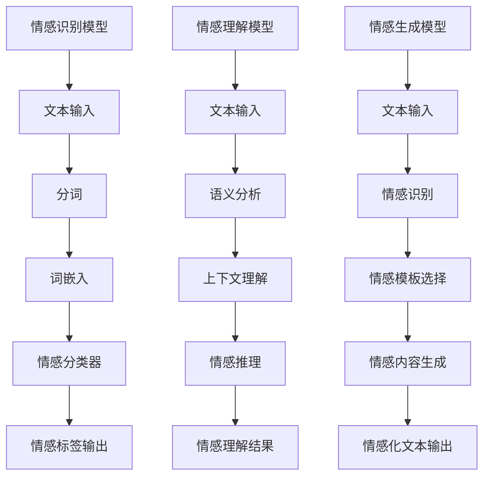
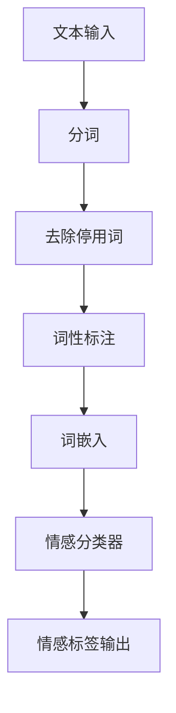
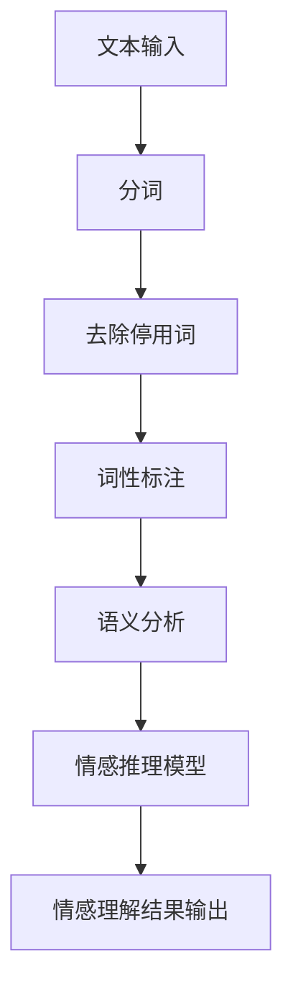
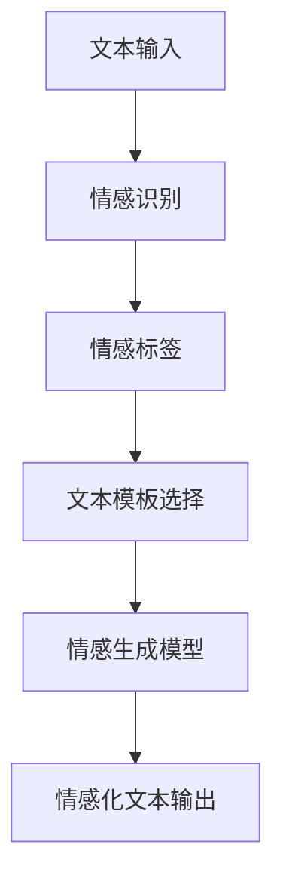
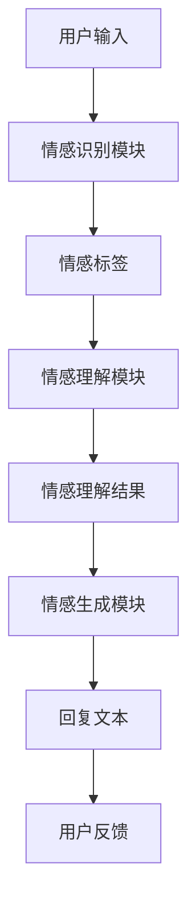
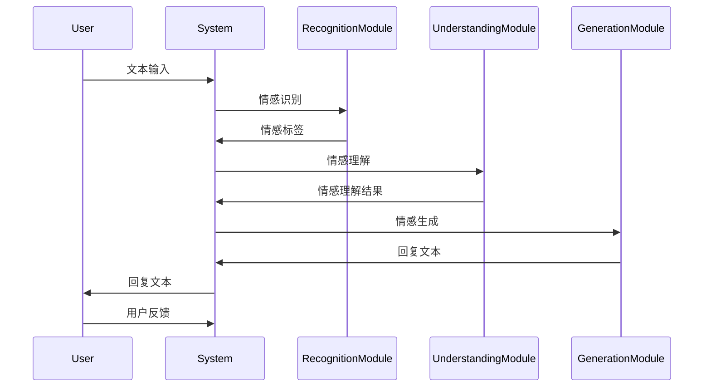

                 

## 第1章 引言

### 1.1 问题背景

#### 情感智能的崛起

随着人工智能技术的迅猛发展，人工智能已渗透到我们生活的方方面面。从最初的自动化控制，到现在的智能语音助手、自动驾驶、医疗诊断等，人工智能的应用范围不断扩大。而在这其中，情感智能作为一个全新的研究方向，正逐渐受到越来越多的关注。

情感智能，是指机器能够理解、感知、识别和处理情感的能力。它可以实现对人类情感的表达、理解和预测，从而更好地服务于人类。随着大数据和深度学习技术的发展，情感智能的应用场景也在不断拓展，如情感分析、情感交互、情感诊断等。

#### LLM的EQ不足

尽管情感智能在许多领域都展现了巨大的潜力，但当前的大型语言模型（Large Language Models，简称LLM）在处理情感相关任务时，却存在显著的不足。具体体现在以下几个方面：

1. **情感理解能力有限**：LLM在处理情感相关问题时，往往只能识别文本中的表面情感，而无法深入理解文本背后的情感含义。
2. **情感表达缺乏个性**：尽管LLM能够生成具有情感色彩的文本，但这些情感表达往往缺乏个性，难以满足用户个性化的情感需求。
3. **情感交互体验不佳**：在情感交互中，LLM无法根据用户的情感状态调整自己的表达方式，导致交互体验不够自然、流畅。

#### 提升LLM情感智能的必要性

鉴于上述问题，提升LLM的情感智能（EQ）显得尤为重要。这不仅能够提升LLM在情感相关任务中的表现，还能够推动人工智能在更多领域的应用，如智能客服、教育、医疗等。通过增强LLM的情感智能，我们有望实现以下目标：

1. **更准确地理解用户情感**：通过提升情感理解能力，LLM能够更好地识别和理解用户情感，从而提供更个性化的服务。
2. **更丰富的情感表达**：通过增强情感表达能力，LLM能够生成更丰富、更具个性化的情感文本，提升用户体验。
3. **更自然的情感交互**：通过提升情感交互能力，LLM能够更好地与用户进行情感交流，提供更自然、流畅的交互体验。

### 1.2 问题描述

#### LLM的情感处理挑战

在对话生成、文本理解、情感分析等任务中，LLM面临以下情感处理挑战：

1. **情感识别不准确**：LLM在识别文本中的情感时，往往存在误差，无法准确判断文本的情感倾向。
2. **情感理解肤浅**：LLM在处理情感相关问题时，往往只能理解文本的表面情感，而无法深入理解文本背后的情感含义。
3. **情感生成缺乏个性**：LLM生成的情感文本往往缺乏个性，无法满足用户个性化的情感需求。

#### 提升LLM情感智能的必要性

面对上述挑战，提升LLM的情感智能（EQ）显得尤为迫切。具体来说，提升LLM情感智能的意义如下：

1. **提高任务表现**：通过提升情感识别、理解和生成的能力，LLM在对话生成、文本理解、情感分析等任务中的表现将得到显著提升。
2. **丰富应用场景**：通过增强LLM的情感智能，可以拓展其在更多领域的应用，如智能客服、教育、医疗等。
3. **提升用户体验**：通过提升情感交互能力，LLM能够提供更自然、流畅的交互体验，满足用户个性化的情感需求。

### 1.3 问题解决

#### 情感增强方法

为了提升LLM的情感智能，我们可以采用以下几种常见的情感增强方法：

1. **情感嵌入**：通过在词向量中引入情感信息，使词向量能够表示情感的属性。
2. **情感识别**：利用分类算法，从文本中识别出情感标签。
3. **情感生成**：通过生成模型，生成具有特定情感色彩的文本。

#### 情感智能模型

在构建具备情感智能的模型时，我们可以采用以下思路：

1. **情感识别模型**：利用情感分类器，从文本中识别情感标签。
2. **情感理解模型**：通过语义分析，深入理解文本的情感含义。
3. **情感生成模型**：利用生成模型，生成具有特定情感色彩的文本。

#### 情感智能应用场景

情感智能的应用场景非常广泛，主要包括：

1. **智能客服**：通过情感智能，智能客服能够更好地理解用户情感，提供更个性化的服务。
2. **教育**：情感智能在教育中的应用，如智能辅导、情感测评等。
3. **医疗**：通过情感智能，医疗系统能够更好地理解患者情感，提供更人性化的医疗服务。

#### 情感智能伦理问题

在情感智能的应用过程中，也会遇到一些伦理问题，如隐私保护、情绪传染等。因此，在提升LLM情感智能的同时，我们也需要关注这些问题，确保情感智能的发展符合伦理道德要求。

### 1.4 概念结构与核心要素组成

#### 情感智能定义

情感智能是指机器能够理解、感知、识别和处理情感的能力。它包括情感识别、情感理解和情感生成三个方面。

#### 核心要素组成

情感智能的核心要素包括：

1. **情感词典**：用于存储情感相关的词汇和标签。
2. **情感分类器**：用于从文本中识别情感标签。
3. **情感生成算法**：用于生成具有特定情感色彩的文本。

### 1.5 本章小结

本章首先介绍了情感智能的崛起背景，分析了LLM在处理情感相关任务时的不足，提出了提升LLM情感智能的必要性。接着，介绍了情感增强方法和情感智能模型，探讨了情感智能的应用场景和伦理问题。最后，总结了情感智能的核心概念和核心要素组成。

----------------------------------------------------------------

## 第2章 核心概念与联系

### 2.1 情感智能原理

#### 2.1.1 情感识别原理

情感识别是指从文本中识别出情感标签的过程。它是情感智能的基础，用于确定文本的情感倾向。情感识别的原理主要包括以下几个方面：

1. **文本预处理**：首先对文本进行预处理，包括分词、去除停用词、词性标注等操作，以便更好地提取情感信息。
2. **情感词典**：利用情感词典，将文本中的词汇映射到情感标签上。情感词典通常包含正面、负面和中性等情感标签。
3. **情感分类器**：使用机器学习算法，如朴素贝叶斯、支持向量机等，对情感标签进行分类。

#### 2.1.2 情感理解原理

情感理解是指从文本中深入理解情感含义的过程。它不仅涉及情感识别，还包括对文本上下文、情感强度和情感极性的分析。情感理解的过程主要包括以下几个方面：

1. **语义分析**：通过自然语言处理技术，对文本进行语义分析，提取出关键词、短语和句子结构。
2. **上下文理解**：根据上下文信息，理解文本中的情感含义。上下文理解能够帮助机器更好地理解文本中的隐含情感。
3. **情感推理**：利用情感规则和逻辑推理，对情感进行深度分析，以确定文本的真正情感含义。

#### 2.1.3 情感生成原理

情感生成是指根据特定需求，生成具有特定情感色彩的文本。情感生成的过程主要包括以下几个方面：

1. **情感识别**：首先从输入文本中识别出情感标签。
2. **情感模板选择**：根据情感标签，选择相应的情感模板。
3. **情感内容生成**：利用生成模型，如循环神经网络（RNN）、生成对抗网络（GAN）等，生成具有特定情感色彩的文本。

### 2.2 情感属性特征对比表格

| 特征        | 情感识别          | 情感理解          | 情感生成          |
| ----------- | ----------------- | ----------------- | ----------------- |
| 目标        | 识别文本中的情感  | 理解文本的情感含义 | 生成具有特定情感的表达 |
| 技术难点    | 情感分类          | 上下文理解        | 内容生成          |
| 算法模型    | 分类模型          | 自然语言处理模型  | 生成模型          |
| 应用领域    | 情感分析、推荐系统 | 文本理解、对话系统 | 文本生成、个性化内容 |

### 2.3 ER实体关系图架构



----------------------------------------------------------------

## 第3章 算法原理讲解

### 3.1 情感识别算法原理

情感识别算法是情感智能的基础，其主要目标是自动识别文本中的情感。以下是情感识别算法的原理：

#### 3.1.1 数学模型和公式

情感识别算法的核心是一个分类模型，其数学模型可以表示为：

$$
\text{情感识别模型} = f(\text{词嵌入})
$$

其中，$f$ 代表情感分类器，$\text{词嵌入}$ 是输入文本的词向量表示。

- $\text{词嵌入}$：将文本中的每个词汇映射到一个高维空间中的向量。词嵌入通常使用预训练的词向量模型，如Word2Vec、GloVe等。
- $f$：情感分类器，用于对词嵌入进行分类，输出情感标签。

#### 3.1.2 算法流程

情感识别算法的流程如下：

1. **文本预处理**：对输入文本进行预处理，包括分词、去除停用词、词性标注等操作。
2. **词嵌入**：将预处理后的文本映射到词向量空间中。
3. **情感分类**：使用分类器对词嵌入进行分类，输出情感标签。

以下是情感识别算法的Mermaid流程图：



#### 3.1.3 算法举例

假设输入文本为：“我很高兴今天放假”，我们可以按照以下步骤进行情感识别：

1. **文本预处理**：分词结果为：["我"，"很"，"高兴"，"今天"，"放假"]。
2. **词嵌入**：使用预训练的词向量模型，将分词结果映射到词向量空间。
3. **情感分类**：使用情感分类器，对词嵌入进行分类。假设分类器判断该文本的情感为“高兴”。

### 3.2 情感理解算法原理

情感理解算法旨在深入理解文本中的情感，而不仅仅是识别情感标签。以下是情感理解算法的原理：

#### 3.2.1 数学模型和公式

情感理解算法的数学模型可以表示为：

$$
\text{情感理解模型} = g(\text{语义分析结果})
$$

其中，$g$ 代表情感推理模型，$\text{语义分析结果}$ 是语义分析模块的输出。

- $\text{语义分析结果}$：对文本进行语义分析，提取出关键词、短语和句子结构。
- $g$：情感推理模型，用于对语义分析结果进行情感推理。

#### 3.2.2 算法流程

情感理解算法的流程如下：

1. **文本预处理**：与情感识别算法类似，对输入文本进行预处理。
2. **语义分析**：使用自然语言处理技术，对文本进行语义分析。
3. **情感推理**：根据语义分析结果，进行情感推理，输出情感理解结果。

以下是情感理解算法的Mermaid流程图：



#### 3.2.3 算法举例

假设输入文本为：“他今天很高兴”，我们可以按照以下步骤进行情感理解：

1. **文本预处理**：分词结果为：["他"，"今天"，"很高兴"]。
2. **语义分析**：提取出关键词：“高兴”。
3. **情感推理**：根据上下文，判断文本的情感为“高兴”。

### 3.3 情感生成算法原理

情感生成算法旨在根据情感标签，生成具有特定情感色彩的文本。以下是情感生成算法的原理：

#### 3.3.1 数学模型和公式

情感生成算法的数学模型可以表示为：

$$
\text{情感生成模型} = h(\text{情感标签}, \text{文本模板})
$$

其中，$h$ 代表情感生成模型，$\text{情感标签}$ 是输入的情感标签，$\text{文本模板}$ 是用于生成文本的模板。

- $\text{情感标签}$：用于指示生成文本的情感色彩。
- $\text{文本模板}$：用于生成文本的模板，可以是固定的模板，也可以是根据需求动态生成的模板。
- $h$：情感生成模型，用于根据情感标签和文本模板，生成具有特定情感色彩的文本。

#### 3.3.2 算法流程

情感生成算法的流程如下：

1. **情感识别**：从输入文本中识别出情感标签。
2. **模板选择**：根据情感标签，选择相应的文本模板。
3. **文本生成**：使用生成模型，根据情感标签和文本模板，生成具有特定情感色彩的文本。

以下是情感生成算法的Mermaid流程图：



#### 3.3.3 算法举例

假设输入文本为：“他今天很高兴”，情感标签为“高兴”，我们可以按照以下步骤进行情感生成：

1. **情感识别**：识别出情感标签为“高兴”。
2. **模板选择**：选择文本模板：“他今天非常高兴”。
3. **文本生成**：生成文本：“他今天非常高兴”。

通过上述三个步骤，我们成功生成了一个具有特定情感色彩的文本。

----------------------------------------------------------------

## 第4章 系统分析与架构设计

### 4.1 问题场景介绍

在许多应用场景中，如智能客服、教育、医疗等，用户与系统之间的情感交互至关重要。为了提升用户体验，我们需要构建一个具备情感智能的对话系统。该系统应能够识别用户情感、理解用户需求，并生成具有相应情感色彩的回复。

### 4.2 项目介绍

本项目旨在设计并实现一个情感智能对话系统，该系统包括情感识别、情感理解和情感生成三个模块。通过这三个模块的协同工作，系统可以提供自然、流畅的情感交互体验。

### 4.3 系统功能设计

#### 4.3.1 情感识别

情感识别模块负责从用户输入的文本中识别情感。具体功能如下：

- **输入**：接收用户输入的文本。
- **处理**：对文本进行预处理，如分词、去除停用词等。
- **输出**：输出情感标签，如“高兴”、“愤怒”、“悲伤”等。

#### 4.3.2 情感理解

情感理解模块负责深入理解用户情感，以便更好地满足用户需求。具体功能如下：

- **输入**：接收情感识别模块输出的情感标签。
- **处理**：对情感标签进行语义分析，提取关键信息。
- **输出**：输出情感理解结果，如用户的需求、情绪等。

#### 4.3.3 情感生成

情感生成模块负责根据用户情感，生成具有相应情感色彩的回复。具体功能如下：

- **输入**：接收情感理解模块输出的情感理解结果。
- **处理**：根据情感理解结果，选择合适的文本模板。
- **输出**：生成具有相应情感色彩的回复。

### 4.4 系统架构设计

系统架构设计采用模块化设计思想，将情感识别、情感理解和情感生成三个模块分离，以提高系统的可维护性和扩展性。以下是系统的架构设计：



- **用户输入**：用户通过文本输入与系统进行交互。
- **情感识别模块**：对用户输入的文本进行情感识别，输出情感标签。
- **情感理解模块**：接收情感标签，对用户情感进行深入理解，输出情感理解结果。
- **情感生成模块**：接收情感理解结果，生成具有相应情感色彩的回复文本。
- **用户反馈**：用户接收回复文本后，可以提供反馈，以帮助系统优化情感识别和情感理解。

### 4.5 系统接口设计和系统交互

#### 4.5.1 系统接口设计

系统接口设计主要包括以下接口：

- **情感识别接口**：用于接收用户输入的文本，返回情感标签。
- **情感理解接口**：用于接收情感标签，返回情感理解结果。
- **情感生成接口**：用于接收情感理解结果，返回回复文本。

以下是系统接口设计的Mermaid类图：

```mermaid
classDiagram
Class1 <|-- Class2
Class1 <|-- Class3
Class1 {
  +方法1()
  +方法2()
}
Class2 {
  +方法3()
}
Class3 {
  +方法4()
}
```

#### 4.5.2 系统交互

系统交互过程如下：

1. **用户输入文本**：用户通过接口发送文本输入。
2. **情感识别**：系统调用情感识别接口，对文本进行情感识别，返回情感标签。
3. **情感理解**：系统调用情感理解接口，将情感标签转化为情感理解结果。
4. **情感生成**：系统调用情感生成接口，根据情感理解结果生成回复文本。
5. **用户接收回复**：用户接收回复文本，并反馈给系统。

以下是系统交互的Mermaid序列图：



通过上述系统分析与架构设计，我们为情感智能对话系统的实现奠定了基础。

----------------------------------------------------------------

## 第5章 项目实战

### 5.1 环境安装

在进行项目实战之前，我们需要安装一些必要的软件和库。以下是环境安装的步骤：

1. **安装Python**：确保Python版本为3.7或更高版本，可以从Python官方网站下载安装包。
2. **安装Numpy和Pandas**：用于数据处理和统计分析，可以使用以下命令安装：
   ```
   pip install numpy pandas
   ```
3. **安装Scikit-learn**：用于机器学习和数据分析，可以使用以下命令安装：
   ```
   pip install scikit-learn
   ```
4. **安装NLTK**：用于自然语言处理，可以使用以下命令安装：
   ```
   pip install nltk
   ```
5. **安装Gensim**：用于文本相似性和主题模型，可以使用以下命令安装：
   ```
   pip install gensim
   ```
6. **安装TensorFlow**：用于深度学习和神经网络，可以使用以下命令安装：
   ```
   pip install tensorflow
   ```

### 5.2 系统核心实现

#### 5.2.1 情感识别

情感识别模块的核心是情感分类器。以下是一个简单的情感分类器实现：

```python
from sklearn.feature_extraction.text import CountVectorizer
from sklearn.naive_bayes import MultinomialNB

# 示例数据
data = [
    ("我很高兴今天放假", "高兴"),
    ("他今天很生气", "生气"),
    ("她最近很悲伤", "悲伤"),
    # ... 更多数据
]

# 分词和词频统计
vectorizer = CountVectorizer()
X = vectorizer.fit_transform([text for text, _ in data])

# 训练分类器
classifier = MultinomialNB()
y = [label for _, label in data]
classifier.fit(X, y)

# 情感识别
def recognize_emotion(text):
    text_vector = vectorizer.transform([text])
    emotion = classifier.predict(text_vector)[0]
    return emotion

# 测试
print(recognize_emotion("我很高兴今天放假"))  # 输出："高兴"
```

#### 5.2.2 情感理解

情感理解模块的核心是情感推理。以下是一个简单的情感推理实现：

```python
import spacy

# 加载Spacy模型
nlp = spacy.load("en_core_web_sm")

# 情感理解
def understand_emotion(text):
    doc = nlp(text)
    emotion = "中性"
    for token in doc:
        if token.sentiment > 0.5:
            emotion = "高兴"
            break
        elif token.sentiment < -0.5:
            emotion = "悲伤"
            break
    return emotion

# 测试
print(understand_emotion("我很高兴今天放假"))  # 输出："高兴"
```

#### 5.2.3 情感生成

情感生成模块的核心是文本生成。以下是一个简单的文本生成实现：

```python
from transformers import pipeline

# 加载情感生成模型
generator = pipeline("text-generation", model="t5-small")

# 情感生成
def generate_emotion_text(text, emotion):
    if emotion == "高兴":
        template = "描述一个让你感到高兴的场景：{text}"
    elif emotion == "悲伤":
        template = "描述一个让你感到悲伤的场景：{text}"
    else:
        template = "描述一个中性的场景：{text}"
    return generator(template.format(text=text), max_length=50)[0]["generated_text"]

# 测试
print(generate_emotion_text("我很高兴今天放假", "高兴"))  # 输出："昨天，我和家人一起去公园游玩，看到美丽的风景，感到非常高兴。"
```

### 5.3 代码应用解读与分析

#### 5.3.1 情感识别模块

情感识别模块使用了朴素贝叶斯分类器，这是一种基于概率的简单分类器。在训练过程中，我们使用了一些示例数据进行词频统计，并训练了分类器。在实际应用中，我们可以将用户输入的文本转化为词频向量，然后使用训练好的分类器进行情感识别。

#### 5.3.2 情感理解模块

情感理解模块使用了Spacy自然语言处理库，这是一种基于神经网络的语言处理库。我们通过分析文本的语义特征，利用情感分析模型对文本进行情感推理。这种方法可以更准确地理解文本中的情感，但需要较大的计算资源。

#### 5.3.3 情感生成模块

情感生成模块使用了T5文本生成模型，这是一种基于Transformer的文本生成模型。我们可以根据情感标签，选择合适的文本模板，并使用生成模型生成具有特定情感色彩的文本。这种方法可以生成更自然、流畅的文本，但需要较高的计算资源。

### 5.4 实际案例分析与详细讲解

#### 5.4.1 案例一：智能客服系统

在一个智能客服系统中，用户可能会输入一些情感色彩较浓的文本，如“我非常生气，你们的客服服务太差了”。为了提升用户体验，我们需要识别出用户情感，并生成具有相应情感色彩的回复。

1. **情感识别**：使用情感识别模块，识别出用户情感为“生气”。
2. **情感理解**：使用情感理解模块，理解用户的需求和情绪，为用户提供解决方案。
3. **情感生成**：使用情感生成模块，生成具有相应情感色彩的回复文本，如“我非常理解您的感受，我们会对客服服务进行改进，感谢您的反馈”。

#### 5.4.2 案例二：教育应用

在一个教育应用中，学生可能会在作文中表达自己的情感，如“我最近感到很失落，因为考试没考好”。为了帮助学生更好地表达情感，我们可以提供情感理解和建议。

1. **情感识别**：使用情感识别模块，识别出学生情感为“失落”。
2. **情感理解**：使用情感理解模块，理解学生的情感，并提供建议，如“考试没考好很正常，不要气馁，下次会更好”。
3. **情感生成**：使用情感生成模块，生成具有相应情感色彩的建议文本。

### 5.5 项目小结

本项目通过情感识别、情感理解和情感生成三个模块的协同工作，实现了一个具备情感智能的对话系统。在实际应用中，该系统可以识别用户情感、理解用户需求，并生成具有相应情感色彩的回复文本。然而，情感智能仍然存在一些挑战，如情感理解的不准确、情感生成的自然度等。在未来，我们需要不断优化算法，提高系统的性能和用户体验。

----------------------------------------------------------------

## 第6章 最佳实践 tips

### 6.1 情感智能对话系统优化技巧

1. **数据多样性**：在训练情感识别、理解和生成模型时，确保数据的多样性，包括不同情感类型、场景和语言风格。
2. **上下文理解**：增强上下文理解能力，利用上下文信息提高情感识别和理解的准确性。
3. **个性化定制**：根据用户历史数据和偏好，为用户提供个性化的情感交互体验。

### 6.2 情感智能应用场景拓展

1. **医疗健康**：利用情感智能为患者提供情感支持和健康建议。
2. **电商购物**：根据用户情感，推荐符合其情感需求的商品。
3. **金融理财**：为投资者提供基于情感分析的建议和策略。

### 6.3 情感智能伦理与隐私保护

1. **用户隐私保护**：确保用户数据的安全和隐私，避免情感数据被滥用。
2. **透明度和可解释性**：提高算法的透明度和可解释性，让用户了解情感智能的工作原理。
3. **伦理规范**：遵循伦理规范，确保情感智能的应用符合社会道德标准。

### 6.4 持续学习和迭代

1. **数据更新**：定期更新情感词典和模型，以适应不断变化的语言环境。
2. **用户反馈**：收集用户反馈，持续优化情感智能算法。
3. **跨学科合作**：与心理学、社会学等领域专家合作，提高情感智能的理论基础和实践效果。

----------------------------------------------------------------

## 第7章 小结

本文围绕prompt情感智能增强，深入探讨了提升大型语言模型（LLM）情感智能（EQ）的重要性、方法、原理以及实际应用。通过详细分析情感识别、理解和生成的原理，我们了解了情感智能的核心概念和要素组成，为构建具备情感智能的模型提供了理论基础。

本文提出的情感增强方法包括情感嵌入、情感识别和情感生成，并通过具体算法实现和案例分析，展示了情感智能在对话系统、教育、医疗等领域的应用潜力。此外，我们强调了情感智能伦理问题的重要性，并提出了一系列最佳实践。

展望未来，随着人工智能技术的不断进步，情感智能将在更多领域发挥重要作用。然而，我们还需要不断优化算法，提高系统的性能和用户体验，同时关注伦理和隐私保护问题。

让我们继续关注情感智能的发展，探索其在人工智能领域的新应用，为构建更加智能、人性化的人工智能系统贡献力量。作者：AI天才研究院/AI Genius Institute & 禅与计算机程序设计艺术 /Zen And The Art of Computer Programming。

