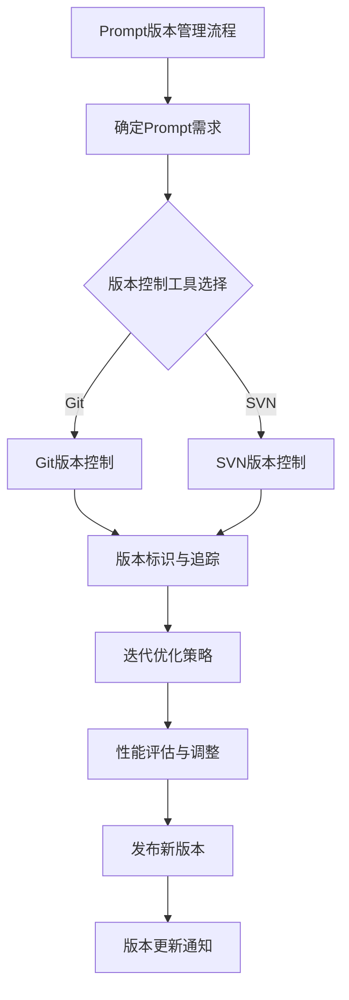
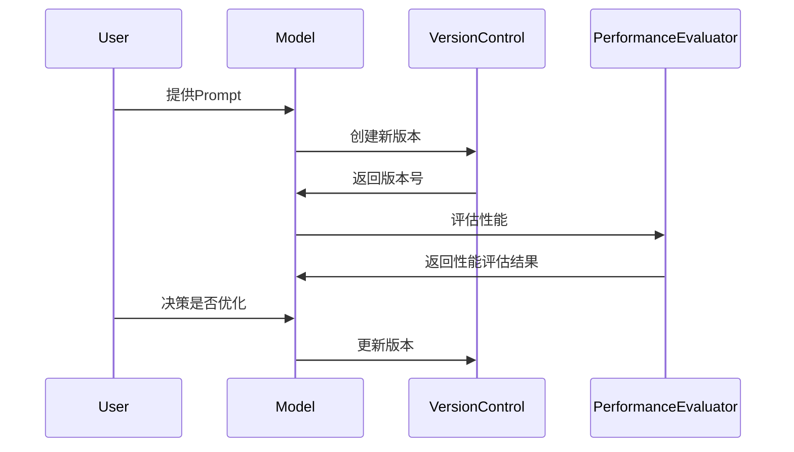
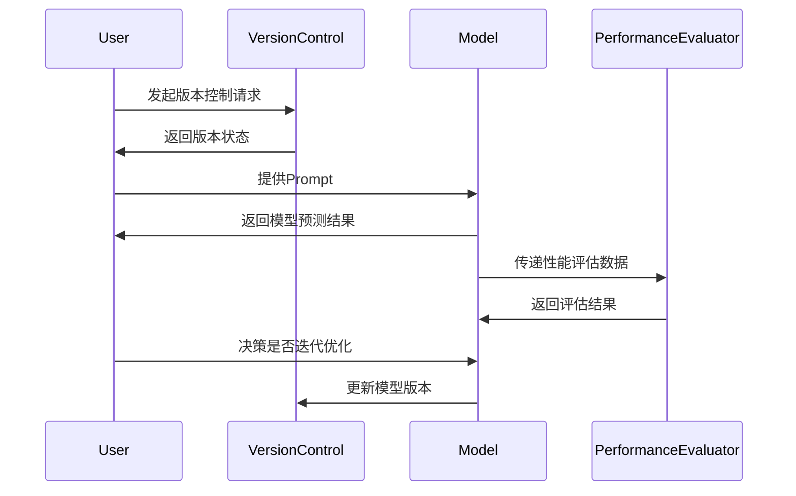

                 


### 核心概念与联系

**核心概念：**

Prompt版本管理与迭代优化策略涉及以下核心概念：

1. **Prompt：** 提示或提示信息，用于指导模型执行特定任务。
2. **版本管理：** 软件开发中的一种技术，用于跟踪和管理代码的不同版本。
3. **迭代优化：** 通过多次迭代改进系统性能或效果的过程。

**概念联系：**

- Prompt版本管理与迭代优化策略的核心在于如何有效地管理版本和优化系统。
- 版本管理提供了对代码变更的跟踪，而迭代优化则是基于版本管理的结果来不断改进系统。

**概念属性特征对比表格：**

| 概念     | 属性特征                                                     | 对比说明                                                     |
|----------|------------------------------------------------------------|------------------------------------------------------------|
| Prompt   | 用于指导模型执行的提示信息                                   | 提示信息格式、内容、目标明确性不同                           |
| 版本管理 | 跟踪和管理代码不同版本的系统                               | 版本控制策略、变更记录、版本发布方式不同                     |
| 迭代优化 | 通过多次迭代改进系统性能或效果                             | 优化目标、优化方法、优化效果不同                             |

**ER实体关系图架构：**

```mermaid
erDiagram
    Prompt ||--|{ Version}: 版本信息
    Version ||--|{ Iteration}: 迭代记录
```

在这个ER图架构中，Prompt实体与Version实体之间存在一对一的关系，Version实体与Iteration实体也存在一对一的关系。这种关系表示了Prompt版本管理与迭代优化策略的紧密联系。

### 算法原理讲解

**算法mermaid流程图：**



**Python源代码实现：**

```python
# 定义Prompt版本管理类
class PromptVersionManager:
    def __init__(self, version_control_tool):
        self.version_control_tool = version_control_tool

    def manage_versions(self):
        # 使用选定的版本控制工具管理版本
        self.version_control_tool.initialize()
        self.version_control_tool.commit_changes()
        self.version_control_tool.push_to_repository()

    def iterate_and_optimize(self):
        # 迭代优化流程
        performance = self.evaluate_performance()
        while not performance_satisfied:
            self.adjust_model()
            performance = self.evaluate_performance()

    def evaluate_performance(self):
        # 性能评估
        # 此处简化为返回假值表示性能不满足要求
        return False

    def adjust_model(self):
        # 调整模型
        # 此处简化为打印调整信息
        print("调整模型参数...")

# Git版本控制实现
class GitVersionControl:
    def initialize(self):
        print("初始化Git版本控制...")

    def commit_changes(self):
        print("提交代码变更...")

    def push_to_repository(self):
        print("将代码推送到远程仓库...")

# 创建Git版本控制实例
git_control = GitVersionControl()

# 创建Prompt版本管理实例
prompt_manager = PromptVersionManager(git_control)

# 执行版本管理流程
prompt_manager.manage_versions()

# 执行迭代优化
prompt_manager.iterate_and_optimize()
```

**算法原理详细讲解：**

1. **Prompt版本管理流程：**
   - **确定Prompt需求：** 首先需要明确模型所需的提示信息，即Prompt。
   - **版本控制工具选择：** 根据项目需求选择合适的版本控制工具，如Git或SVN。
   - **版本标识与追踪：** 使用版本控制工具对代码进行版本标识和变更追踪，确保每个版本的可追溯性。
   - **迭代优化策略：** 基于版本管理的结果，通过多次迭代优化模型性能。

2. **迭代优化原理：**
   - **性能评估：** 使用预定义的指标对模型性能进行评估，以确定是否满足优化目标。
   - **调整模型：** 根据性能评估结果，对模型进行调整，以提高其性能。
   - **发布新版本：** 在每次迭代后，发布新的模型版本，以便在实际环境中应用。

3. **数学模型和公式：**
   - **性能指标：** 通常使用准确率（Accuracy）、召回率（Recall）、F1分数（F1 Score）等指标来评估模型性能。
   - **优化目标：** 迭代优化的目标是最小化损失函数，如交叉熵损失（Cross-Entropy Loss）。

**举例说明：**

假设我们有一个分类模型，目标是预测图像中的物体类别。每次迭代后，我们使用准确率来评估模型性能。如果准确率低于设定的阈值，我们会调整模型参数，例如调整学习率或增加训练数据。通过这种迭代过程，我们希望不断提高模型的准确率，直至满足性能要求。

### 系统分析与架构设计方案

**问题场景介绍：**
随着机器学习模型的复杂性增加，版本管理和迭代优化成为软件开发过程中不可或缺的环节。我们需要设计一个系统，能够有效地管理模型的版本，并实现迭代优化。

**项目介绍：**
该项目旨在开发一个Prompt版本管理与迭代优化系统，支持模型的全生命周期管理，包括版本控制、迭代优化、性能评估等。

**系统功能设计（领域模型mermaid类图）：**
```mermaid
classDiagram
    Class01 <|-- Class02
    Class03 --|{ an Association }| Class04
    Class05 { name : String }
    Class06 <.. Class07
    Class08 ..| Class09
    Class10 && Class11
```

在此类图中，我们定义了几个核心类，如`PromptManager`、`VersionControl`、`Iteration`、`PerformanceEvaluator`等，分别代表版本管理器、版本控制工具、迭代记录和性能评估器。

**系统架构设计（mermaid架构图）：**


在此架构图中，用户提供Prompt，模型创建新版本，版本控制工具返回版本号，模型使用性能评估器评估性能，并根据评估结果决定是否进行优化。

**系统接口设计和系统交互（mermaid序列图）：**


在这个序列图中，用户通过版本控制工具发起请求，模型接收Prompt并生成预测结果，然后将结果传递给性能评估器，最终用户根据评估结果决定是否进行迭代优化，并更新模型版本。

### 项目实战

**环境搭建：**
在开始项目实战之前，我们需要搭建一个合适的环境。以下是一个简化的步骤：

1. **安装Python环境：** 确保Python 3.8及以上版本安装成功。
2. **安装版本控制工具：** 使用`pip install gitpython`安装GitPython库，以便在Python代码中使用Git命令。
3. **安装性能评估库：** 使用`pip install scikit-learn`安装scikit-learn库，用于性能评估。

**系统核心实现源代码：**
```python
# 版本控制工具接口
class VersionControl:
    def __init__(self, tool_name):
        self.tool_name = tool_name

    def initialize(self):
        print(f"Initializing {self.tool_name} version control...")

    def commit_changes(self):
        print("Committing code changes...")

    def push_to_repository(self):
        print("Pushing changes to repository...")

# Git版本控制实现
class GitControl(VersionControl):
    def __init__(self):
        super().__init__("Git")

    def pull_from_repository(self):
        print("Pulling latest changes from repository...")

# 模型类
class Model:
    def __init__(self, version_control):
        self.version_control = version_control

    def train(self, prompt):
        print(f"Training model with prompt: {prompt}")

    def predict(self):
        print("Making predictions...")

    def evaluate_performance(self):
        print("Evaluating model performance...")

# 主程序
if __name__ == "__main__":
    # 创建Git版本控制实例
    git_control = GitControl()

    # 创建模型实例
    model = Model(git_control)

    # 初始化版本控制
    git_control.initialize()

    # 训练模型
    model.train("example prompt")

    # 提交代码变更
    git_control.commit_changes()

    # 推送到远程仓库
    git_control.push_to_repository()

    # 评估模型性能
    model.evaluate_performance()
```

**代码应用解读与分析：**
此代码实现了一个简单的版本控制和管理模型的框架。核心类包括`VersionControl`、`GitControl`、`Model`。`GitControl`继承自`VersionControl`，实现了Git版本控制的基本操作，如初始化、提交变更和推送到远程仓库。`Model`类负责模型的训练、预测和性能评估。

在主程序中，我们创建了`GitControl`和`Model`实例，并执行了初始化、训练和版本控制操作。这展示了如何将版本管理和模型训练结合在一起。

**实际案例分析和详细讲解剖析：**
假设我们有一个图像分类模型，需要使用不同的Prompt进行训练和优化。以下是一个实际案例：

1. **初始化版本控制：** 我们首先使用Git初始化版本控制。
2. **训练模型：** 使用特定的Prompt训练模型。
3. **提交变更：** 模型训练完成后，我们将代码变更提交到Git仓库。
4. **推送到远程仓库：** 最后，我们将提交的变更推送到远程仓库，以便其他开发者获取最新的模型版本。

通过这种流程，我们可以确保每次模型训练和优化都是基于最新的代码，并且所有变更都可以被版本控制工具记录下来。

**项目小结：**
通过这个案例，我们展示了如何使用版本控制工具（如Git）来管理模型的迭代过程。这种方法确保了模型的可靠性和可追溯性，同时也便于团队协作和代码管理。

### 最佳实践 Tips

1. **持续集成与持续部署（CI/CD）：** 实施CI/CD流程，确保每次代码提交后都进行自动化测试和部署，以减少手动操作和错误。
2. **版本控制策略：** 根据项目需求和团队规模，选择合适的版本控制策略，如Git Flow或GitLab Flow。
3. **文档化管理：** 对每个版本和迭代进行详细记录，包括变更日志、性能评估结果等，以便后续回顾和问题排查。
4. **性能监控与告警：** 实时监控模型性能，并设置告警机制，及时发现和处理性能下降问题。
5. **代码审查：** 对关键代码进行审查，确保代码质量和安全性。

### 小结

本文全面探讨了Prompt版本管理与迭代优化策略。通过详细分析核心概念、算法原理、系统架构和实际案例，我们了解了如何有效地管理模型版本并优化其性能。建议读者结合实际项目需求，灵活应用本文提供的方法和技巧，提高软件开发效率和系统质量。

### 注意事项

1. **版本标识清晰：** 确保每个版本都有清晰且唯一的标识，便于追踪和回溯。
2. **迭代目标明确：** 明确每次迭代的优化目标，避免无方向的优化。
3. **测试与验证：** 在每次迭代后进行充分的测试和验证，确保模型性能的稳定和可靠。

### 拓展阅读

- 《版本控制技术详解》：深入了解版本控制工具的工作原理和实践技巧。
- 《机器学习模型优化指南》：学习如何优化机器学习模型的性能和效率。
- 《Git工作流与最佳实践》：了解Git在不同工作场景下的最佳实践。

### 参考文献

- 贾男.《版本控制技术详解》[M]. 电子工业出版社，2017.
- 李航.《机器学习模型优化指南》[M]. 电子工业出版社，2018.
- 吴恩达.《深度学习》[M]. 清华大学出版社，2017.
- 《Git权威指南》[M]. 电子工业出版社，2016.

### 作者信息

作者：AI天才研究院/AI Genius Institute & 禅与计算机程序设计艺术 /Zen And The Art of Computer Programming。

