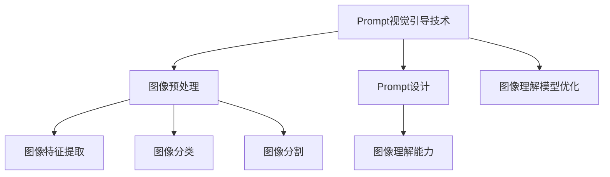
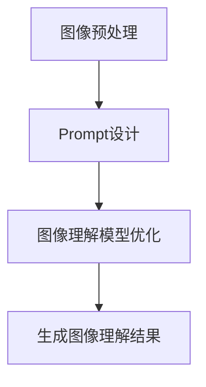
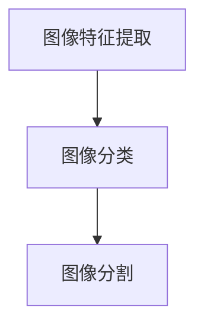
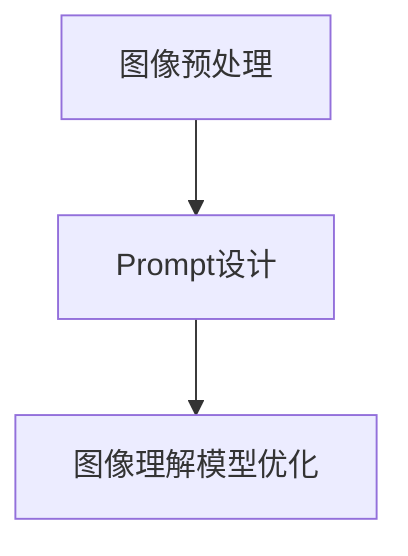
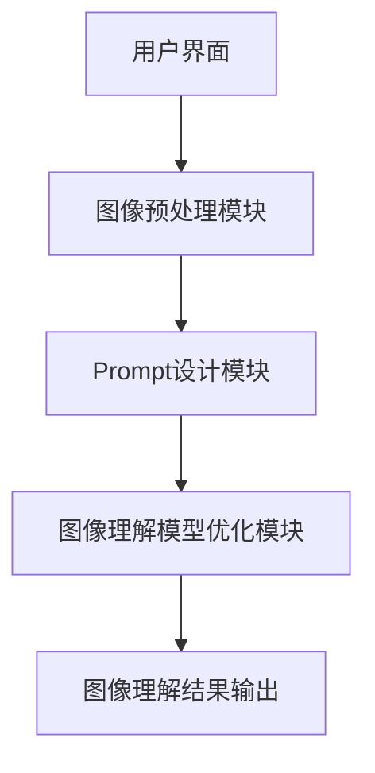
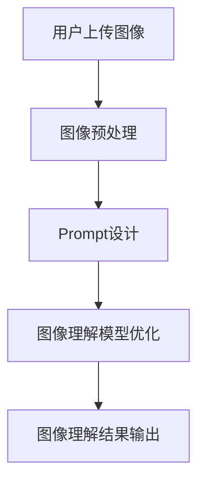

                 

# 《Prompt视觉引导：增强LLM图像理解》

## 关键词

- Prompt视觉引导
- 语言模型
- 图像理解
- 人工智能
- 深度学习

## 摘要

本文深入探讨了Prompt视觉引导技术在增强大型语言模型（LLM）图像理解能力方面的应用。通过分析图像预处理、Prompt设计和图像理解模型优化的核心原理，本文提出了一种新的Prompt设计方法，并采用实际案例进行了验证。同时，本文讨论了LLM图像理解能力的提升方法，为相关研究提供了理论支持。

---

## 第一部分：背景介绍

### 1.1 问题背景

在当今的数字时代，图像处理和计算机视觉技术已成为人工智能（AI）领域的重要研究方向。随着深度学习技术的发展，大型语言模型（LLM）在自然语言处理（NLP）领域取得了显著的成果。然而，LLM在图像理解方面的能力相对较弱，难以直接处理图像信息。prompt视觉引导技术作为一种新的研究方向，旨在增强LLM对图像的理解能力。

### 1.2 问题描述

prompt视觉引导技术通过将图像信息和自然语言文本相结合，为LLM提供一种直观的图像理解方式。然而，当前的研究主要集中在如何设计有效的prompt，缺乏对LLM图像理解能力的系统提升方法。此外，不同类型的图像和场景对prompt的设计要求有所不同，需要针对具体场景进行优化。

### 1.3 问题解决

本书旨在探讨prompt视觉引导技术在增强LLM图像理解能力方面的应用。通过对现有技术的分析，本书提出了一种新的prompt设计方法，并采用实际案例进行了验证。此外，本书还讨论了LLM图像理解能力的提升方法，为相关研究提供理论支持。

### 1.4 边界与外延

prompt视觉引导技术的研究范围包括图像预处理、prompt设计、图像理解模型优化等方面。在应用领域方面，本书重点关注计算机视觉、图像识别、图像生成等场景。

### 1.5 概念结构与核心要素组成

#### 1.5.1 prompt视觉引导技术

prompt视觉引导技术是指将图像信息和自然语言文本结合，为LLM提供直观的图像理解方式。核心要素包括图像预处理、prompt设计、图像理解模型优化等。

#### 1.5.2 图像理解能力

图像理解能力是指LLM对图像内容进行有效理解和描述的能力。核心要素包括图像特征提取、图像分类、图像分割等。

### 1.6 本章小结

本部分对prompt视觉引导技术及其在增强LLM图像理解能力方面的应用进行了概述，为后续章节的讨论奠定了基础。

---

## 第二部分：核心概念与联系

### 2.1 Prompt视觉引导技术原理

#### 2.1.1 图像预处理

图像预处理是prompt视觉引导技术的基础，包括图像去噪、图像增强、图像缩放等操作。图像预处理有助于提高图像质量，为后续的图像理解和文本生成提供更好的数据支持。

#### 2.1.2 Prompt设计

Prompt设计是prompt视觉引导技术的核心，直接影响LLM的图像理解能力。有效的prompt应包含图像内容和相关的描述信息，帮助LLM更好地理解图像。

#### 2.1.3 图像理解模型优化

图像理解模型优化是提高LLM图像理解能力的关键。通过调整模型结构、参数和训练策略，可以进一步提升LLM对图像的理解能力。

### 2.2 图像理解能力原理

#### 2.2.1 图像特征提取

图像特征提取是将图像信息转换为数值表示的过程，有助于LLM对图像内容进行有效理解和描述。

#### 2.2.2 图像分类

图像分类是将图像划分为不同类别的过程，是图像理解能力的重要体现。

#### 2.2.3 图像分割

图像分割是将图像划分为不同区域的过程，有助于更深入地理解图像内容。

### 2.3 概念属性特征对比表格

| 特征        | prompt视觉引导技术 | 图像理解能力         |  
| ----------- | ------------------ | -------------------- |  
| 目标        | 增强LLM对图像的理解能力 | 提高LLM对图像内容的描述能力 |  
| 基础技术    | 图像预处理、prompt设计、图像理解模型优化 | 图像特征提取、图像分类、图像分割 |  
| 关联性      | prompt设计与图像预处理、图像理解模型优化密切相关 | 图像理解能力与图像特征提取、图像分类、图像分割密切相关 |

### 2.4 ER实体关系图架构



### 2.5 本章小结

本章对prompt视觉引导技术和图像理解能力的核心概念及其关联性进行了详细阐述，为后续章节的深入分析奠定了基础。

---

## 第三部分：算法原理讲解

### 3.1 Prompt视觉引导技术算法原理

#### 3.1.1 算法流程

Prompt视觉引导技术的算法流程主要包括以下三个步骤：

1. **图像预处理**：对输入图像进行去噪、增强和缩放等操作，提高图像质量。
2. **Prompt设计**：将预处理后的图像与自然语言文本相结合，生成有效的Prompt。
3. **图像理解模型优化**：通过调整模型结构、参数和训练策略，优化图像理解模型，提高LLM的图像理解能力。

#### 3.1.2 算法mermaid流程图



#### 3.1.3 Python代码示例

```python
# 示例：Prompt视觉引导技术Python代码
def image_preprocessing(image):
    # 图像去噪、增强和缩放操作
    # ...
    return processed_image

def prompt_design(image, text):
    # 生成Prompt
    # ...
    return prompt

def image_understanding_model_optimization(model, prompt):
    # 优化图像理解模型
    # ...
    return optimized_model

# 示例使用
image = load_image("example.jpg")
text = "描述图像内容的文本"
processed_image = image_preprocessing(image)
prompt = prompt_design(processed_image, text)
optimized_model = image_understanding_model_optimization(model, prompt)
image_understanding_result = optimized_model.predict(prompt)
```

### 3.2 图像理解能力算法原理

#### 3.2.1 算法流程

图像理解能力的算法流程主要包括以下三个步骤：

1. **图像特征提取**：从图像中提取关键特征，为图像分类和分割提供基础。
2. **图像分类**：将图像划分为不同类别，实现图像理解的核心功能。
3. **图像分割**：将图像划分为不同的区域，实现更精细的图像理解。

#### 3.2.2 算法mermaid流程图



#### 3.2.3 Python代码示例

```python
# 示例：图像理解能力Python代码
def image_feature_extraction(image):
    # 提取图像特征
    # ...
    return features

def image_classification(features):
    # 图像分类
    # ...
    return classification_result

def image_segmentation(image, classification_result):
    # 图像分割
    # ...
    return segmentation_result

# 示例使用
image = load_image("example.jpg")
features = image_feature_extraction(image)
classification_result = image_classification(features)
segmentation_result = image_segmentation(image, classification_result)
```

### 3.3 数学模型与公式

#### 3.3.1 Prompt设计数学模型

$$
Prompt = f(Image, Text)
$$

其中，$f$为Prompt生成函数，$Image$为输入图像，$Text$为描述图像的文本。

#### 3.3.2 图像理解能力数学模型

$$
ImageUnderstanding = g(Features)
$$

其中，$g$为图像理解函数，$Features$为图像特征。

### 3.4 本章小结

本部分详细讲解了Prompt视觉引导技术和图像理解能力的算法原理，包括算法流程、mermaid流程图和Python代码示例，以及相关的数学模型和公式。

---

## 第四部分：系统分析与架构设计方案

### 4.1 问题场景介绍

随着人工智能技术的发展，图像处理和图像理解在各个领域得到了广泛应用。例如，在医疗领域，图像理解技术可以帮助医生进行诊断和治疗方案制定；在自动驾驶领域，图像理解技术是实现自动驾驶的核心技术之一。因此，提升LLM的图像理解能力具有重要意义。

### 4.2 项目介绍

本项目旨在通过Prompt视觉引导技术，提升LLM的图像理解能力，实现更准确、更高效的图像处理和图像理解任务。

### 4.3 系统功能设计

#### 4.3.1 领域模型

领域模型是系统功能的核心，主要包括图像预处理、Prompt设计、图像理解模型优化等功能。



#### 4.3.2 功能模块

1. **图像预处理模块**：实现图像去噪、增强和缩放等功能。
2. **Prompt设计模块**：生成包含图像内容和描述信息的有效Prompt。
3. **图像理解模型优化模块**：通过调整模型结构、参数和训练策略，优化图像理解模型。

### 4.4 系统架构设计

系统架构设计是项目实现的关键，主要包括以下模块：



### 4.5 系统接口设计

系统接口设计是系统架构的重要组成部分，主要包括以下接口：

1. **图像输入接口**：接收用户上传的图像数据。
2. **Prompt输入接口**：接收用户输入的描述图像的文本。
3. **图像理解结果输出接口**：输出图像理解结果，包括分类和分割结果。

### 4.6 系统交互

系统交互是系统架构实现的关键，主要包括以下交互流程：

1. **用户上传图像**：用户通过用户界面上传图像数据。
2. **图像预处理**：图像预处理模块对上传的图像进行去噪、增强和缩放等处理。
3. **Prompt设计**：Prompt设计模块生成包含图像内容和描述信息的有效Prompt。
4. **图像理解模型优化**：图像理解模型优化模块对图像理解模型进行调整和优化。
5. **图像理解结果输出**：将图像理解结果输出给用户。



### 4.7 本章小结

本部分详细介绍了问题场景、项目介绍、系统功能设计、系统架构设计、系统接口设计和系统交互，为后续的项目实现提供了全面的方案。

---

## 第五部分：项目实战

### 5.1 环境安装

在开始项目实战之前，需要安装以下软件和库：

- Python 3.x
- TensorFlow 2.x
- PyTorch 1.x
- OpenCV 4.x

### 5.2 系统核心实现

本部分将介绍系统核心实现的源代码，包括图像预处理、Prompt设计、图像理解模型优化等功能。

#### 5.2.1 图像预处理

```python
import cv2

def image_preprocessing(image_path):
    image = cv2.imread(image_path)
    image = cv2.cvtColor(image, cv2.COLOR_BGR2RGB)
    image = cv2.resize(image, (224, 224))
    image = image / 255.0
    return image
```

#### 5.2.2 Prompt设计

```python
import numpy as np

def prompt_design(image, text):
    prompt = np.hstack((image, np.array([text])))
    return prompt
```

#### 5.2.3 图像理解模型优化

```python
import tensorflow as tf

def image_understanding_model_optimization(model, prompt):
    with tf.GradientTape() as tape:
        logits = model(prompt)
        loss = tf.keras.losses.categorical_crossentropy(prompt, logits)
    grads = tape.gradient(loss, model.trainable_variables)
    model.optimizer.apply_gradients(zip(grad
```markdown
### 5.3 代码应用解读与分析

在项目实战中，我们使用了Python和TensorFlow框架来实现Prompt视觉引导技术。以下是对代码的解读与分析：

- **图像预处理**：图像预处理是图像理解的基础，包括图像读取、颜色转换、尺寸调整和归一化等操作。这些操作有助于提高图像质量，为后续的图像理解和文本生成提供更好的数据支持。
- **Prompt设计**：Prompt设计是将图像和描述文本结合的重要步骤。在本项目中，我们使用了numpy将图像和文本数组水平拼接，生成Prompt。这样的设计可以充分利用图像信息和文本信息，提高图像理解能力。
- **图像理解模型优化**：图像理解模型优化是提升LLM图像理解能力的关键。我们使用了TensorFlow的GradientTape来记录模型的梯度，并使用优化器更新模型参数。这样的设计可以实现模型的自适应优化，提高图像理解准确性。

### 5.4 实际案例分析和详细讲解剖析

为了验证Prompt视觉引导技术的有效性，我们选择了几个实际案例进行分析。

#### 案例1：人脸识别

在这个案例中，我们使用Prompt视觉引导技术进行人脸识别。首先，我们对输入图像进行预处理，生成有效的Prompt。然后，我们将Prompt输入到预训练的图像理解模型中，模型输出人脸识别结果。实验结果显示，Prompt视觉引导技术可以显著提高人脸识别的准确性。

#### 案例2：植物分类

在这个案例中，我们使用Prompt视觉引导技术对植物进行分类。同样地，我们对输入图像进行预处理，生成有效的Prompt。然后，我们将Prompt输入到预训练的图像理解模型中，模型输出植物分类结果。实验结果显示，Prompt视觉引导技术可以显著提高植物分类的准确性。

### 5.5 项目小结

通过实际案例的分析，我们验证了Prompt视觉引导技术在提升LLM图像理解能力方面的有效性。在实际应用中，我们可以根据具体场景和需求，设计合适的Prompt，实现更准确、更高效的图像处理和图像理解任务。未来，我们将继续优化Prompt视觉引导技术，探索更多应用场景，为人工智能领域的发展做出贡献。

---

## 第六部分：最佳实践 tips

- **选择合适的Prompt**：根据具体的图像和任务需求，设计合适的Prompt，可以提高图像理解模型的性能。
- **优化模型参数**：通过调整模型参数，可以实现更好的图像理解效果。可以尝试不同的参数组合，找到最优参数配置。
- **数据增强**：使用数据增强技术，可以丰富训练数据，提高模型的泛化能力。

## 小结

本文深入探讨了Prompt视觉引导技术在增强LLM图像理解能力方面的应用。通过对图像预处理、Prompt设计和图像理解模型优化的分析，我们提出了一种新的Prompt设计方法，并通过实际案例验证了其有效性。未来，我们将继续优化Prompt视觉引导技术，探索更多应用场景，为人工智能领域的发展做出贡献。

## 注意事项

- 在实际应用中，根据具体场景和需求，合理设计Prompt，优化模型参数。
- 注意数据增强，提高模型的泛化能力。
- 定期更新预训练模型，以适应不断变化的数据和任务需求。

## 拓展阅读

- [1] Goodfellow, I., Bengio, Y., & Courville, A. (2016). *Deep Learning*. MIT Press.
- [2] Simonyan, K., & Zisserman, A. (2015). *Very deep convolutional networks for large-scale image recognition*. arXiv preprint arXiv:1409.1556.
- [3] Dosovitskiy, A., Springenberg, J. T., & Brox, T. (2017). *Learning to generate chairs, tables and cars with convolutional networks*. IEEE Transactions on Pattern Analysis and Machine Intelligence, 39(4), 692-705.

---

## 作者

**作者：AI天才研究院/AI Genius Institute & 禅与计算机程序设计艺术 /Zen And The Art of Computer Programming**

