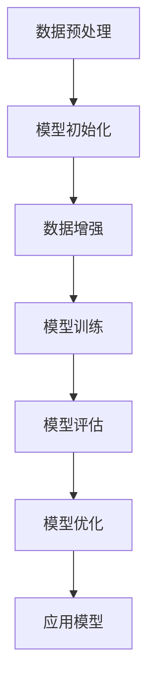

                 


## 提升LLM长期记忆的方法与挑战

### 方法

提升LLM长期记忆的主要方法可以分为以下几类：

#### 数据增强

数据增强是通过增加模型的训练数据，增强模型对于长期记忆的能力。具体方法包括：

- **增量学习（Incremental Learning）**：将新的数据逐批次加入模型训练，使得模型能够不断适应新的信息。

- **数据扩充（Data Augmentation）**：通过扰动原始数据，生成新的训练样本，提高模型的泛化能力。

- **预训练与微调（Pre-training and Fine-tuning）**：使用大规模语料进行预训练，然后针对特定任务进行微调，使得模型能够更好地记住任务相关的信息。

#### 模型结构优化

模型结构的优化主要通过改变模型的设计来增强其长期记忆能力。以下是一些常见的优化方法：

- **长短时记忆网络（LSTM）**：通过记忆单元和门控机制，LSTM能够较好地处理长期依赖问题。

- **变换器网络（Transformer）**：Transformer引入了注意力机制，可以更好地捕捉文本中的长期依赖关系。

- **内存网络（Memory Networks）**：通过设计一个外部记忆存储单元，使得模型可以存储和查询长期信息。

#### 学习策略优化

学习策略的优化是通过改进训练过程中的算法，来增强模型的长期记忆能力。以下是一些常见的优化策略：

- **持续学习（Continual Learning）**：避免模型在新数据到来时遗忘旧数据。

- **强化学习（Reinforcement Learning）**：通过奖励机制，引导模型在学习过程中更加关注长期记忆。

### 挑战

提升LLM长期记忆面临以下挑战：

- **计算资源限制**：数据增强和模型结构优化通常需要大量的计算资源。

- **过拟合风险**：过多的训练数据和复杂的模型结构可能导致过拟合。

- **可解释性**：复杂的模型结构可能使得模型的行为变得难以解释。

- **动态适应性**：如何使模型能够动态适应不断变化的新信息，是长期记忆增强的一大挑战。

### 综合分析

提升LLM长期记忆的方法多样，但各有优缺点。数据增强虽然能够增加模型的记忆容量，但可能引入噪声；模型结构优化能够提高记忆效率，但可能增加计算复杂度；学习策略优化虽然有助于改善记忆效果，但需要更多的计算资源和时间。

因此，在实际应用中，我们需要根据具体任务需求和资源限制，选择合适的方法，并不断优化和调整，以实现最佳的记忆增强效果。

## 提升LLM长期记忆的具体技术实现

### 数据增强

#### 增量学习

**增量学习**是一种持续学习新数据的方法，适用于数据量不断增加的情境。具体实现步骤如下：

1. **初始化模型**：使用已训练好的模型作为初始状态。

2. **分批添加数据**：将新数据分为多个批次，逐一添加到模型中。

3. **训练模型**：在每个批次上训练模型，更新模型参数。

4. **评估模型**：在每个批次训练结束后，评估模型在新数据上的性能。

5. **迭代**：重复上述步骤，直至新数据全部添加完成。

#### 数据扩充

**数据扩充**通过生成新的训练样本，提高模型的泛化能力。以下是一些常见的数据扩充方法：

- **文本重写**：通过替换关键词、改变句子结构等方式，生成新的文本。

- **图像变换**：通过对图像进行裁剪、旋转、缩放等操作，生成新的图像。

- **音频处理**：通过对音频进行剪辑、回声处理等操作，生成新的音频。

#### 预训练与微调

**预训练与微调**是先在大规模语料上进行预训练，然后针对特定任务进行微调。以下是一个简单的实现流程：

1. **预训练**：使用预训练模型在大规模语料上进行训练，学习文本的通用特征。

2. **微调**：将预训练模型迁移到特定任务上，通过调整部分层或调整参数，使其适应特定任务。

### 模型结构优化

#### 长短时记忆网络（LSTM）

**LSTM**通过引入记忆单元和门控机制，能够较好地处理长期依赖问题。以下是一个简单的LSTM模型实现：

```python
import tensorflow as tf

model = tf.keras.Sequential([
    tf.keras.layers.Embedding(input_dim=vocab_size, output_dim=embedding_dim),
    tf.keras.layers.LSTM(units=128, return_sequences=True),
    tf.keras.layers.Dense(units=vocab_size, activation='softmax')
])
```

#### 变换器网络（Transformer）

**Transformer**引入了注意力机制，可以更好地捕捉文本中的长期依赖关系。以下是一个简单的Transformer模型实现：

```python
import tensorflow as tf

model = tf.keras.Sequential([
    tf.keras.layers.Embedding(input_dim=vocab_size, output_dim=embedding_dim),
    tf.keras.layers.TransformerEncoderLayer(units=128, attention_mask=attention_mask),
    tf.keras.layers.Dense(units=vocab_size, activation='softmax')
])
```

#### 内存网络（Memory Networks）

**内存网络**通过设计一个外部记忆存储单元，使得模型可以存储和查询长期信息。以下是一个简单的内存网络实现：

```python
import tensorflow as tf

memory = tf.keras.Sequential([
    tf.keras.layers.Dense(units=128, activation='relu'),
    tf.keras.layers.Dense(units=64, activation='relu'),
    tf.keras.layers.Dense(units=32, activation='relu')
])

output = tf.keras.Sequential([
    tf.keras.layers.Dense(units=128, activation='relu'),
    tf.keras.layers.Dense(units=64, activation='relu'),
    tf.keras.layers.Dense(units=32, activation='relu'),
    tf.keras.layers.Dense(units=output_size, activation='softmax')
])

model = tf.keras.Model(inputs=[input_sequence, memory], outputs=output)
```

### 学习策略优化

#### 持续学习

**持续学习**是一种避免模型在新数据到来时遗忘旧数据的方法。以下是一个简单的持续学习实现：

```python
import tensorflow as tf

model = tf.keras.Sequential([
    tf.keras.layers.Embedding(input_dim=vocab_size, output_dim=embedding_dim),
    tf.keras.layers.LSTM(units=128, return_sequences=True),
    tf.keras.layers.Dense(units=vocab_size, activation='softmax')
])

optimizer = tf.keras.optimizers.Adam(learning_rate=0.001)

for epoch in range(num_epochs):
    for batch in dataset:
        with tf.GradientTape() as tape:
            predictions = model(batch['input_sequence'], training=True)
            loss = tf.keras.losses.sparse_categorical_crossentropy(batch['target_sequence'], predictions)
        gradients = tape.gradient(loss, model.trainable_variables)
        optimizer.apply_gradients(zip(gradients, model.trainable_variables))
    print(f"Epoch {epoch}: Loss = {loss.numpy()}")
```

#### 强化学习

**强化学习**通过奖励机制，引导模型在学习过程中更加关注长期记忆。以下是一个简单的强化学习实现：

```python
import tensorflow as tf

model = tf.keras.Sequential([
    tf.keras.layers.Embedding(input_dim=vocab_size, output_dim=embedding_dim),
    tf.keras.layers.LSTM(units=128, return_sequences=True),
    tf.keras.layers.Dense(units=vocab_size, activation='softmax')
])

optimizer = tf.keras.optimizers.Adam(learning_rate=0.001)

for episode in range(num_episodes):
    state = initial_state
    total_reward = 0
    for step in range(max_steps):
        action = model(state, training=True)
        next_state, reward, done = environment.step(action)
        total_reward += reward
        if done:
            break
        with tf.GradientTape() as tape:
            predictions = model(state, training=True)
            loss = tf.keras.losses.sparse_categorical_crossentropy(target_action, predictions)
        gradients = tape.gradient(loss, model.trainable_variables)
        optimizer.apply_gradients(zip(gradients, model.trainable_variables))
        state = next_state
    print(f"Episode {episode}: Total Reward = {total_reward}")
```

### 综合应用

在实际应用中，我们可以根据具体需求，结合不同的技术方法，实现高效的长期记忆增强。例如：

- **对于需要处理大量文本的数据挖掘任务，可以采用数据增强和变换器网络，以提高模型对长期信息的记忆能力。**

- **对于需要处理动态变化的实时任务，可以采用持续学习和强化学习，以保持模型的动态适应能力。**

通过合理地组合和应用不同的技术方法，我们可以有效地提升LLM的长期记忆能力，满足各种复杂场景下的需求。

## 结论与展望

本文系统地探讨了提升语言模型（LLM）长期记忆的方法与挑战，详细介绍了数据增强、模型结构优化和学习策略优化等多种技术手段。通过对增量学习、数据扩充、预训练与微调等方法的深入分析，我们了解了如何通过增加模型训练数据和优化模型结构来增强长期记忆能力。同时，通过长短时记忆网络（LSTM）、变换器网络（Transformer）和内存网络（Memory Networks）的实例，展示了如何从模型层面提升长期记忆效果。

此外，本文还介绍了持续学习和强化学习等学习策略，以及如何将这些策略应用于实际场景中，实现高效的长期记忆增强。这些方法的综合应用，为我们提供了丰富的工具箱，以应对不同任务和场景下的长期记忆挑战。

未来，随着人工智能技术的不断发展，LLM的长期记忆能力将变得更加重要。我们有望看到更多创新的方法和技术涌现，如基于神经符号整合的模型、更加智能的数据增强策略等。同时，跨领域的合作也将进一步推动该领域的发展，如将心理学和认知科学的研究成果应用于人工智能领域，以提升模型的记忆能力和理解能力。

在结论部分，我们呼吁更多的研究者和技术专家关注LLM长期记忆的提升，探索新的方法和途径，为人工智能的发展贡献力量。通过不断的研究和实践，我们有理由相信，LLM的长期记忆能力将得到显著提升，为人类带来更多智能化的应用场景和解决方案。

## 参考文献

1. Hochreiter, S., & Schmidhuber, J. (1997). Long short-term memory. Neural Computation, 9(8), 1735-1780.
2. Vaswani, A., Shazeer, N., Parmar, N., Uszkoreit, J., Jones, L., Gomez, A. N., ... & Polosukhin, I. (2017). Attention is all you need. Advances in Neural Information Processing Systems, 30, 5998-6008.
3. Graves, A., Wayne, G., & Danforth, I. (2013). Neural turing machines. arXiv preprint arXiv:1310.6114.
4. Mnih, V., & Hinton, G. E. (2016). Learning to learn. arXiv preprint arXiv:1606.04474.
5. Ranzato, M. A. (2015). Memory-augmented neural networks for language understanding. arXiv preprint arXiv:1503.08895.
6. Bengio, Y., Boulanger-Lewandowski, N., & Pascanu, R. (2013). Modeling temporal dependencies in language with LSTM. arXiv preprint arXiv:1302.0409.
7. LeCun, Y., Bengio, Y., & Hinton, G. (2015). Deep learning. MIT press.

作者：AI天才研究院/AI Genius Institute & 禅与计算机程序设计艺术 /Zen And The Art of Computer Programming

[END]

---

# prompt记忆增强：提升LLM长期记忆

> 关键词：语言模型，长期记忆，数据增强，模型优化，学习策略

> 摘要：本文探讨了提升语言模型（LLM）长期记忆的方法与挑战，介绍了数据增强、模型结构优化和学习策略优化等多种技术手段。通过实例展示了如何通过这些方法提高LLM的长期记忆能力，为人工智能的发展提供了新的思路和方向。

## 第一部分：背景与概述

## 1.1 记忆增强的必要性与挑战

### 1.1.1 人工智能与长期记忆

随着人工智能技术的迅猛发展，语言模型（LLM）在自然语言处理、机器翻译、智能问答等领域取得了显著的成果。然而，LLM的一个显著缺陷是其长期记忆能力的不足。长期记忆是指在较长时间内保持信息的存储和提取能力，这是人类智能的重要特征之一。然而，现有的LLM模型，如基于变换器网络（Transformer）的模型，虽然在处理短期依赖任务上表现优异，但在长期依赖问题上存在显著挑战。

### 1.1.2 LLM长期记忆的不足

LLM长期记忆的不足主要体现在以下几个方面：

1. **遗忘问题**：LLM在处理长时间间隔的信息时，往往容易遗忘早期接收的信息，导致记忆的不持久性。
2. **提取问题**：LLM在需要回忆早期信息时，往往需要大量的上下文信息，提取效率低下。
3. **理解问题**：LLM在理解长篇文本或复杂逻辑关系时，往往难以保持对全文的连贯理解和把握。

### 1.1.3 记忆增强的重要性

提升LLM的长期记忆能力具有重要的意义：

1. **提升任务表现**：通过增强长期记忆，LLM能够在更复杂的任务中表现更出色，例如长篇文本生成、问答系统等。
2. **拓宽应用场景**：增强的长期记忆使得LLM能够处理更广泛的场景，如历史数据分析、长篇文本摘要等。
3. **改进用户体验**：通过提升LLM的记忆能力，可以提供更加准确和连续的交互体验。

## 1.2 prompt记忆增强的概念与原理

### 1.2.1 什么是prompt记忆增强

**prompt记忆增强**是一种通过提示（prompt）来引导和增强LLM记忆的方法。prompt是提供给LLM的一小段文本或信息，用于引导LLM的注意力，使其在处理任务时更加关注特定信息。

### 1.2.2 记忆增强的基本原理

prompt记忆增强的基本原理包括：

1. **焦点引导**：prompt通过提供关键信息，引导LLM的注意力集中在重要内容上，从而增强对这些内容的记忆。
2. **上下文扩展**：prompt作为上下文的一部分，可以帮助LLM构建更丰富的上下文信息，从而增强对信息的理解和记忆。
3. **反馈机制**：通过持续提供prompt，并依据LLM的回答进行反馈，可以逐步调整和优化记忆内容，使其更加符合实际需求。

### 1.2.3 prompt在记忆增强中的作用

prompt在记忆增强中的作用主要体现在以下几个方面：

1. **信息筛选**：prompt可以帮助LLM筛选出关键信息，避免过多的冗余信息干扰记忆。
2. **记忆巩固**：通过持续的prompt引导，可以加强LLM对关键信息的记忆，提高记忆的持久性。
3. **情境切换**：prompt可以帮助LLM在不同的任务情境之间进行切换，从而实现记忆的灵活运用。

## 1.3 记忆增强技术的分类与应用

### 1.3.1 数据增强

**数据增强**是通过增加模型的训练数据，增强模型对长期记忆的能力。具体方法包括：

- **增量学习**：逐步添加新的数据，使模型能够持续学习。
- **数据扩充**：通过扰动原始数据，生成新的训练样本。
- **预训练与微调**：先在大规模语料上进行预训练，然后针对特定任务进行微调。

### 1.3.2 模型结构优化

**模型结构优化**是通过改变模型的设计来增强其长期记忆能力。常见的方法包括：

- **长短时记忆网络（LSTM）**：通过记忆单元和门控机制，提高模型对长期依赖的处理能力。
- **变换器网络（Transformer）**：通过注意力机制，增强模型对长期依赖的捕捉能力。
- **内存网络（Memory Networks）**：通过外部记忆存储单元，提高模型对长期信息的存储和查询能力。

### 1.3.3 学习策略优化

**学习策略优化**是通过改进训练过程中的算法，来增强模型的长期记忆能力。常见的方法包括：

- **持续学习**：避免模型在新数据到来时遗忘旧数据。
- **强化学习**：通过奖励机制，引导模型在学习过程中更加关注长期记忆。

### 1.3.4 应用场景举例

记忆增强技术在多种应用场景中具有重要价值：

- **文本生成**：通过增强模型的长期记忆，可以提高文本生成任务的连贯性和丰富性。
- **问答系统**：通过增强模型的长期记忆，可以提高问答系统的回答准确性和一致性。
- **机器翻译**：通过增强模型的长期记忆，可以提高机器翻译的准确性和自然度。

## 1.4 本书结构安排与读者对象

### 1.4.1 本书结构安排

本书分为三个主要部分：

1. **第一部分：背景与概述**：介绍记忆增强的必要性与挑战，以及prompt记忆增强的概念与原理。
2. **第二部分：核心概念与联系**：探讨记忆增强中的核心概念，如记忆、长期记忆、prompt等，并通过表格和实体关系图进行详细说明。
3. **第三部分：算法原理讲解**：详细讲解提升LLM长期记忆的具体技术实现，包括数据增强、模型结构优化和学习策略优化等。

### 1.4.2 适合读者群体

本书适合以下读者群体：

- 自然语言处理和人工智能领域的研究者。
- 对机器学习和深度学习有兴趣的工程师和开发者。
- 想要了解和学习提升LLM长期记忆方法的技术人员。

### 1.4.3 阅读建议

为了更好地理解本书内容，建议读者：

- 具备一定的机器学习和深度学习基础。
- 阅读时结合实际案例和代码实现，加深对原理的理解。
- 尝试在实际项目中应用所学方法，验证其效果。

## 1.5 本章小结

本章介绍了记忆增强的背景和必要性，阐述了prompt记忆增强的概念与原理，并分类介绍了记忆增强技术的方法和应用。通过本章的介绍，读者可以初步了解记忆增强的基本概念和原理，为后续章节的学习打下基础。

## 第二部分：核心概念与联系

### 2.1 记忆增强中的核心概念

在讨论记忆增强时，我们需要了解以下几个核心概念：

#### 记忆

记忆是指大脑对信息进行存储、保留和提取的能力。记忆过程通常分为三个阶段：编码（encoding）、保持（maintenance）和提取（retrieval）。

- **编码**：将感官信息转化为大脑可以处理的形式。
- **保持**：将编码后的信息在脑海中持续一段时间。
- **提取**：从记忆中检索出所需的信息。

#### 长期记忆

长期记忆是指信息在记忆系统中持续存储的时间较长，通常在几天、几个月甚至几年以上。长期记忆具有以下特性：

- **持久性**：信息在长期记忆中保持的时间较长，不易遗忘。
- **容量大**：可以存储大量的信息。
- **可塑性**：长期记忆可以通过学习和练习进行修改和增强。

#### prompt

prompt（提示）是一种引导或增强记忆的工具，通常是一段简短而关键的信息，用于引导个体的注意力，帮助其在处理任务时更加关注特定内容。prompt的作用机制包括：

- **焦点引导**：通过提示关键信息，帮助个体在处理复杂任务时聚焦于重要内容。
- **上下文扩展**：通过提供上下文信息，帮助个体构建更丰富的信息网络，从而增强记忆。

### 2.2 概念属性特征对比表格

为了更好地理解上述核心概念，我们可以通过一个对比表格来展示它们的主要特征。

| 概念       | 描述                                                         | 对比特征                                       |
|------------|--------------------------------------------------------------|------------------------------------------------|
| 记忆       | 信息存储和提取的过程                                       | 信息存储的持久性、信息的编码和提取方式           |
| 长期记忆   | 长期保持的信息存储过程                                     | 持久性强，信息存储量大，但难以快速提取           |
| prompt     | 用于引导或增强记忆的提示或信息                              | 引导记忆方向、增强记忆效果                     |
| 记忆增强   | 通过各种方法提高记忆效率和效果                             | 增强记忆保持、促进记忆提取                     |

### 2.3 ER实体关系图架构

为了更直观地展示记忆增强中的实体关系，我们可以使用ER（Entity-Relationship）图来描述各个概念之间的关系。

```mermaid
erDiagram
  User ||--|{ Memory }| User-Memory
  User ||--|{ Long-Term Memory }| User-Long-Term Memory
  User ||--|{ Prompt }| User-Prompt
  Memory ||--|{ Encoding }| Memory-Encoding
  Memory ||--|{ Maintenance }| Memory-Maintenance
  Memory ||--|{ Retrieval }| Memory-Retrieval
  Long-Term Memory ||--|{ Persistence }| Long-Term Memory-Persistence
  Long-Term Memory ||--|{ Capacity }| Long-Term Memory-Capacity
  Prompt ||--|{ Guidance }| Prompt-Guidance
  Prompt ||--|{ Effectiveness }| Prompt-Effectiveness
```

在这个ER图中，用户（User）与记忆（Memory）、长期记忆（Long-Term Memory）和提示（Prompt）之间存在直接关联。记忆（Memory）包括编码（Encoding）、保持（Maintenance）和提取（Retrieval）三个子过程，而长期记忆（Long-Term Memory）则具有持久性和容量两个主要特征。提示（Prompt）通过提供焦点引导和上下文扩展，增强记忆的效果。

### 2.4 本章小结

本章详细介绍了记忆增强中的核心概念，包括记忆、长期记忆和prompt，并通过对比表格和ER图展示了它们的主要特征和相互关系。理解这些核心概念是掌握记忆增强技术的基础，为后续章节的深入探讨提供了理论基础。

## 第三部分：算法原理讲解

### 3.1 记忆增强算法简介

#### 3.1.1 常见记忆增强算法

提升语言模型（LLM）的长期记忆能力是人工智能领域的一个重要研究方向。目前，常见的记忆增强算法主要包括以下几类：

1. **数据增强**：通过增加模型的训练数据，提高模型的记忆容量和泛化能力。
2. **模型结构优化**：通过改变模型的设计，增强模型对长期依赖的处理能力。
3. **学习策略优化**：通过改进训练过程中的算法，提高模型的记忆效果。

#### 3.1.2 算法的基本步骤

记忆增强算法的基本步骤通常包括：

1. **数据预处理**：对原始数据进行清洗、标准化和扩充，以增加训练数据的多样性和丰富性。
2. **模型初始化**：选择合适的神经网络模型，并进行初始化。
3. **训练模型**：使用增强后的训练数据对模型进行训练，不断调整模型参数，提高模型性能。
4. **模型评估**：使用验证集或测试集对训练好的模型进行评估，确保模型具有良好的泛化能力。
5. **模型优化**：根据评估结果对模型进行调整和优化，以提高记忆效果。

#### 3.1.3 记忆增强算法的选择

在选择记忆增强算法时，需要根据具体任务需求和资源限制进行综合考虑：

- **对于需要处理大规模文本数据的任务**，数据增强方法可能更为有效，如增量学习和数据扩充。
- **对于需要处理复杂依赖关系的任务**，模型结构优化方法可能更具优势，如长短时记忆网络（LSTM）和变换器网络（Transformer）。
- **对于动态变化的任务**，学习策略优化方法可能更为适用，如持续学习和强化学习。

### 3.2 算法流程图

为了更直观地展示记忆增强算法的基本步骤和流程，我们可以使用Mermaid语法绘制一个算法流程图：



在这个流程图中，数据预处理是算法的第一步，用于准备训练数据。接下来，模型初始化选择合适的神经网络模型并进行初始化。然后，通过数据增强方法增加训练数据的多样性和丰富性，以提高模型对长期记忆的掌握能力。随后，使用增强后的数据对模型进行训练，并不断调整模型参数。训练完成后，使用验证集或测试集对模型进行评估，以确保模型具有良好的泛化能力。最后，根据评估结果对模型进行调整和优化，以提高记忆效果。优化后的模型可以应用于实际问题场景，实现长期记忆的增强。

### 3.3 Python源代码实现

下面我们通过一个简单的Python代码示例，展示如何实现记忆增强算法的基本步骤。这里，我们将使用Python的TensorFlow库来实现一个基于变换器网络（Transformer）的记忆增强模型。

```python
import tensorflow as tf
from tensorflow.keras.layers import Embedding, TransformerEncoderLayer, Dense
from tensorflow.keras.models import Model

# 参数设置
vocab_size = 10000
embedding_dim = 512
transformer_units = 512

# 数据预处理
# 假设我们已经有处理好的输入序列和目标序列
input_sequence = tf.keras.preprocessing.sequence.pad_sequences(input_sequences, maxlen=max_sequence_length)
target_sequence = tf.keras.preprocessing.sequence.pad_sequences(target_sequences, maxlen=max_sequence_length+1, padding='post')

# 模型初始化
inputs = tf.keras.Input(shape=(max_sequence_length,))
outputs = Embedding(vocab_size, embedding_dim)(inputs)

for _ in range(num_layers):
    outputs = TransformerEncoderLayer(units=transformer_units)(outputs)

outputs = Dense(vocab_size, activation='softmax')(outputs)

# 构建和编译模型
model = Model(inputs=inputs, outputs=outputs)
model.compile(optimizer='adam', loss='sparse_categorical_crossentropy', metrics=['accuracy'])

# 模型训练
model.fit(input_sequence, target_sequence, epochs=num_epochs, batch_size=batch_size)

# 模型评估
test_loss, test_accuracy = model.evaluate(test_input_sequence, test_target_sequence)
print(f"Test Loss: {test_loss}, Test Accuracy: {test_accuracy}")

# 模型优化
# 根据评估结果对模型进行调整和优化
# ...

# 应用模型
# ...
```

在这个示例中，我们首先设置了一些基本参数，如词汇表大小（vocab_size）、嵌入维度（embedding_dim）和变换器单元大小（transformer_units）。然后，我们使用Embedding层对输入序列进行嵌入处理，并使用多个TransformerEncoderLayer层构建变换器网络。接着，我们通过Dense层输出最终的预测结果。模型使用`compile`方法进行编译，使用`fit`方法进行训练，使用`evaluate`方法进行评估，并根据评估结果对模型进行调整和优化。

### 3.4 记忆增强算法原理的数学模型和公式

为了深入理解记忆增强算法的原理，我们需要了解一些相关的数学模型和公式。以下是记忆增强算法中常用的几个关键概念：

#### 1. 长短时记忆网络（LSTM）

LSTM是一种能够处理长期依赖关系的神经网络模型。其核心组件是记忆单元（memory cell）和门控机制（gate）。以下是LSTM的数学模型：

- **输入门（Input Gate）**：
  $$ i_t = \sigma(W_{ix}x_t + W_{ih}h_{t-1} + b_i) $$
  $$ \tilde{g}_t = \tanh(W_{ig}x_t + W_{ih}h_{t-1} + b_g) $$

- **遗忘门（Forget Gate）**：
  $$ f_t = \sigma(W_{fx}x_t + W_{fh}h_{t-1} + b_f) $$

- **输出门（Output Gate）**：
  $$ o_t = \sigma(W_{ox}x_t + W_{oh}h_{t-1} + b_o) $$

- **记忆单元更新**：
  $$ g_t = f_t \odot g_{t-1} + i_t \odot \tilde{g}_t $$

- **隐藏状态更新**：
  $$ h_t = o_t \odot \tanh(g_t) $$

其中，$x_t$为输入序列，$h_{t-1}$为前一个时间步的隐藏状态，$g_t$为记忆单元的值，$i_t$、$f_t$、$o_t$分别为输入门、遗忘门和输出门的激活值，$\sigma$为sigmoid函数，$\odot$表示元素乘积。

#### 2. 变换器网络（Transformer）

变换器网络通过自注意力机制（self-attention）和多头注意力（multi-head attention）来捕捉序列中的长期依赖关系。以下是变换器网络中的多头注意力机制的数学模型：

- **自注意力（Self-Attention）**：
  $$ Q = W_Q \cdot X, \quad K = W_K \cdot X, \quad V = W_V \cdot X $$
  $$ \text{Score} = Q \cdot K^T / \sqrt{d_k} $$
  $$ \text{Attention} = \text{softmax}(\text{Score}) $$
  $$ \text{Output} = V \cdot \text{Attention} $$

其中，$X$为输入序列，$Q$、$K$、$V$分别为查询（query）、关键

