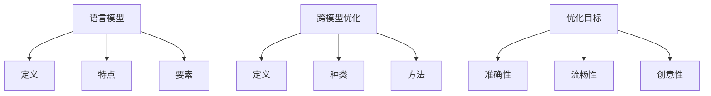
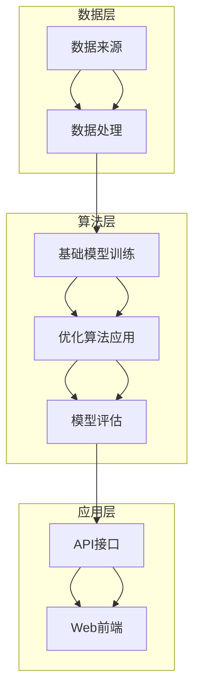
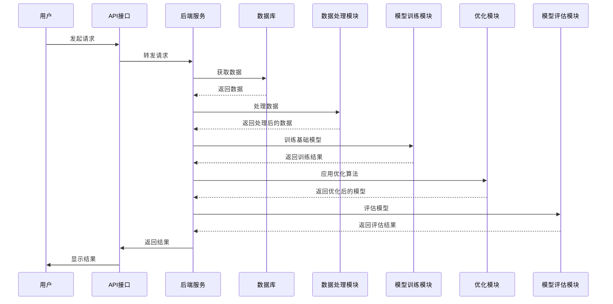

                 


### 1. 引言

#### 1.1.1 问题背景

在当今科技飞速发展的时代，语言模型已经成为人工智能领域的重要研究方向之一。语言模型能够通过学习大量文本数据，预测下一个词或句子，从而实现自然语言处理（NLP）任务，如机器翻译、问答系统、文本生成等。然而，随着语言模型变得越来越复杂和庞大，如何有效地对其进行优化，以提升其性能和效率，成为了一个亟待解决的问题。

跨模型优化是指在不同类型的语言模型之间进行参数的共享和优化，以达到提高模型性能和效率的目的。例如，在训练一个大型语言模型时，可以借鉴和利用一个已经训练好的小型语言模型的经验，从而加速训练过程。跨模型优化的目标是通过模型间的共享和协作，实现不同模型之间的优势互补，提升整体系统的性能。

#### 1.1.2 问题描述

在跨模型优化中，主要面临以下问题：

1. **模型差异**：不同语言模型的结构、参数规模和训练数据存在差异，使得直接进行参数共享和优化变得困难。
2. **优化目标不一致**：不同模型的优化目标可能存在冲突，例如，在机器翻译任务中，准确性可能更重要，而在文本生成任务中，流畅性和创意性可能更为关键。
3. **训练时间与资源限制**：跨模型优化通常需要在大规模数据集上训练多个模型，这会消耗大量的时间和计算资源。

#### 1.1.3 问题解决思路

为了解决上述问题，我们可以从以下几个方面进行思考：

1. **模型融合**：通过将不同类型的语言模型进行融合，使得模型之间能够共享参数和知识，从而实现优化目标的统一。
2. **多任务学习**：将多个任务结合在一起进行训练，使得模型能够同时关注多个优化目标，从而提高整体性能。
3. **自适应优化**：根据不同模型的特性，设计自适应的优化策略，以适应不同的训练环境和优化目标。

#### 1.1.4 边界与外延

跨模型优化适用于各种语言模型和NLP任务，但其效果可能受到以下因素的影响：

1. **数据集大小和质量**：数据集的大小和质量直接影响模型的训练效果，因此需要确保数据集的丰富性和多样性。
2. **计算资源**：跨模型优化需要大量的计算资源，特别是在训练大型语言模型时，需要考虑硬件设备和计算能力的限制。
3. **模型参数规模**：不同模型的参数规模差异较大，因此在进行跨模型优化时，需要根据模型参数规模进行合理的设计和调整。

### 1.2 核心概念与联系

在跨模型优化中，涉及到的核心概念主要包括语言模型、优化算法和跨模型优化方法。下面我们将对这些概念进行详细的介绍。

#### 1.2.1 语言模型的基本概念

语言模型是一种用于预测下一个词或句子的统计模型，其核心目标是根据前文信息预测下一个词或句子的概率分布。语言模型通常由一组参数构成，这些参数通过学习大量文本数据得到。

#### 1.2.2 跨模型优化的相关概念

跨模型优化是指在不同类型的语言模型之间进行参数的共享和优化。其主要包括以下几种方法：

1. **模型融合**：将多个模型进行融合，使得模型之间能够共享参数和知识。
2. **多任务学习**：将多个任务结合在一起进行训练，使得模型能够同时关注多个优化目标。
3. **自适应优化**：根据不同模型的特性，设计自适应的优化策略。

#### 1.2.3 概念属性特征对比

下面是一个ER实体关系图架构，用于描述语言模型、跨模型优化方法和优化目标之间的关系：



### 1.3 第一部分总结

在本部分中，我们首先介绍了问题背景，探讨了语言模型的发展和跨模型优化的必要性。接着，我们对问题描述进行了详细的分析，并提出了问题解决的思路。最后，我们介绍了核心概念与联系，为后续内容奠定了基础。

---

### 2. 核心概念与联系

在深入探讨跨模型优化之前，我们需要明确几个关键概念：语言模型、优化算法和跨模型优化的相关方法。这些概念不仅是跨模型优化的基础，也是我们理解整个话题的关键。

#### 2.1 语言模型的基本概念

语言模型（Language Model）是自然语言处理（NLP）领域的核心组件之一。它的主要功能是根据前文信息预测下一个词或句子的概率分布。语言模型的核心是参数，这些参数通过学习大量文本数据得到。

- **定义**：语言模型是一种统计模型，它通过分析大量文本数据，学习词汇之间的关系，从而预测下一个词或句子的概率。
- **特点**：语言模型通常具有以下特点：
  - **可扩展性**：可以处理不同规模的文本数据。
  - **适应性**：可以根据不同的任务需求进行调整。
  - **高效性**：在生成文本或进行预测时，具有较高的计算效率。
- **核心要素**：语言模型的核心要素包括：
  - **词汇表**：包含所有可能出现的词汇。
  - **概率分布**：根据前文信息预测下一个词或句子的概率分布。
  - **训练数据**：用于训练模型的文本数据。

#### 2.2 跨模型优化的相关概念

跨模型优化（Cross-Model Optimization）是指在不同类型的语言模型之间进行参数的共享和优化。这种优化方法旨在提高模型的性能和效率。

- **定义**：跨模型优化是一种通过在不同模型之间共享参数和知识，以提升整体系统性能的优化方法。
- **种类**：跨模型优化主要包括以下几种方法：
  - **模型融合**：将多个模型进行融合，使得模型之间能够共享参数和知识。
  - **多任务学习**：将多个任务结合在一起进行训练，使得模型能够同时关注多个优化目标。
  - **自适应优化**：根据不同模型的特性，设计自适应的优化策略。
- **方法**：跨模型优化方法的具体实现包括：
  - **参数共享**：在不同模型之间共享相同的参数。
  - **知识蒸馏**：将一个大型模型的“知识”传递给一个较小的模型。
  - **迁移学习**：将一个任务的知识应用于另一个相似的任务。

#### 2.3 概念属性特征对比

为了更好地理解语言模型和跨模型优化的关系，我们可以通过一个ER（Entity-Relationship）实体关系图进行对比：

```mermaid
graph TB
A[语言模型](#FF5733) --> B[定义]
A --> C[特点]
A --> D[要素]
E[跨模型优化](#FF5733) --> F[定义]
E --> G[种类]
E --> H[方法]
I[J[优化目标]] --> K[准确性]
I --> L[流畅性]
I --> M[创意性]
```

在这个ER图中，语言模型和跨模型优化被划分为两个实体，每个实体都有自己的属性和关联关系。优化目标作为另一个实体，与语言模型和跨模型优化实体之间存在关联。

#### 2.4 ER实体关系图架构

为了更直观地展示语言模型、跨模型优化方法和优化目标之间的关系，我们可以使用Mermaid语言绘制一个ER实体关系图：

```mermaid
erDiagram
  Class1 ||--|{ Class2 } : aggregation
  Class1 ||--|{ Class3 } : aggregation
  Class1 ||--|{ Class4 } : generalization
  Class2 ||--|{ Class5 } : generalization
  Class3 ||--|{ Class6 } : generalization
  Class4 : [Language Model]
  Class5 : [Cross-Model Optimization]
  Class6 : [Optimization Objective]
```

在这个ER图中，Class1代表语言模型，Class2、Class3和Class4分别代表跨模型优化的不同种类和方法，而Class5和Class6分别代表优化目标的不同维度。

### 2.5 本章总结

在本章中，我们详细介绍了语言模型的基本概念、跨模型优化的相关概念以及它们之间的联系。通过对比语言模型和跨模型优化的属性特征，我们绘制了ER实体关系图，为后续章节的深入讨论奠定了基础。

---

### 3. 跨模型优化算法原理讲解

在理解了语言模型和跨模型优化的基本概念后，我们需要进一步探讨具体的优化算法原理。这些算法不仅能够提高语言模型的性能，还能够实现不同模型之间的参数共享和优化。本章节将详细介绍几种常见的优化算法，包括其原理、流程和适用场景。

#### 3.1 优化算法基础

优化算法是解决跨模型优化问题的关键。它们通过不断调整模型的参数，使得模型在特定任务上的表现达到最优。优化算法可以分为以下几个类别：

1. **梯度下降法**：最基础的优化算法，通过计算模型参数的梯度并更新参数，以减少损失函数。
2. **随机梯度下降法**：在梯度下降法的基础上，每次迭代只随机选择一部分样本进行计算，从而减少计算量和训练时间。
3. **批量梯度下降法**：与随机梯度下降法相反，每次迭代使用整个训练集的数据进行计算，从而得到更准确的梯度估计。
4. **自适应优化器**：如Adam、Adadelta等，通过自适应地调整学习率和动量，提高优化效率。

#### 3.2 常见优化算法讲解

在本节中，我们将详细介绍三种常见的优化算法：梯度下降法、随机梯度下降法和Adam优化器。

##### 3.2.1 梯度下降法

梯度下降法（Gradient Descent）是最基础的优化算法，其核心思想是通过计算模型参数的梯度，并沿着梯度的反方向更新参数，以最小化损失函数。

1. **原理**：梯度下降法的原理可以用以下公式表示：
   $$ \theta_{\text{new}} = \theta_{\text{old}} - \alpha \cdot \nabla_{\theta} J(\theta) $$
   其中，$\theta$ 表示模型参数，$\alpha$ 是学习率，$J(\theta)$ 是损失函数，$\nabla_{\theta} J(\theta)$ 表示损失函数关于参数 $\theta$ 的梯度。

2. **流程**：
   - 初始化模型参数 $\theta$。
   - 计算损失函数 $J(\theta)$ 的梯度 $\nabla_{\theta} J(\theta)$。
   - 更新参数 $\theta$：$\theta_{\text{new}} = \theta_{\text{old}} - \alpha \cdot \nabla_{\theta} J(\theta)$。
   - 重复步骤2和3，直到参数收敛或者达到预设的迭代次数。

3. **Python实现**：
   ```python
   def gradient_descent(x, learning_rate, epochs):
       for _ in range(epochs):
           gradient = compute_gradient(x)
           x = x - learning_rate * gradient
       return x
   ```

##### 3.2.2 随机梯度下降法

随机梯度下降法（Stochastic Gradient Descent, SGD）是梯度下降法的一种变种，其主要区别在于每次迭代只随机选择一个样本进行梯度计算和参数更新。

1. **原理**：随机梯度下降法的原理可以用以下公式表示：
   $$ \theta_{\text{new}} = \theta_{\text{old}} - \alpha \cdot \nabla_{\theta} J(\theta; x_i) $$
   其中，$x_i$ 表示随机选择的样本，$\nabla_{\theta} J(\theta; x_i)$ 表示在样本 $x_i$ 上的梯度。

2. **流程**：
   - 初始化模型参数 $\theta$。
   - 随机选择一个样本 $x_i$。
   - 计算样本 $x_i$ 上的梯度 $\nabla_{\theta} J(\theta; x_i)$。
   - 更新参数 $\theta$：$\theta_{\text{new}} = \theta_{\text{old}} - \alpha \cdot \nabla_{\theta} J(\theta; x_i)$。
   - 重复步骤2和3，直到参数收敛或者达到预设的迭代次数。

3. **Python实现**：
   ```python
   def stochastic_gradient_descent(x, learning_rate, epochs, batch_size):
       for _ in range(epochs):
           for sample in generate_samples(batch_size):
               gradient = compute_gradient(sample)
               x = x - learning_rate * gradient
       return x
   ```

##### 3.2.3 Adam优化器

Adam优化器（Adaptive Moment Estimation）是一种自适应的优化器，它结合了动量项和自适应学习率，在许多实际问题中表现优异。

1. **原理**：Adam优化器的原理可以通过以下公式表示：
   $$ \theta_{\text{new}} = \theta_{\text{old}} - \alpha \cdot \frac{\beta_1 \cdot m_t + (1 - \beta_1) \cdot g_t}{\sqrt{\beta_2 \cdot v_t} + \epsilon} $$
   其中，$m_t$ 和 $v_t$ 分别是梯度的一阶和二阶矩估计，$\beta_1$ 和 $\beta_2$ 分别是动量参数，$\alpha$ 是学习率，$g_t$ 是梯度。

2. **流程**：
   - 初始化模型参数 $\theta$ 和一阶、二阶矩估计 $m_t$ 和 $v_t$。
   - 更新一阶矩估计 $m_t$：$m_t = \beta_1 \cdot m_{t-1} + (1 - \beta_1) \cdot g_t$。
   - 更新二阶矩估计 $v_t$：$v_t = \beta_2 \cdot v_{t-1} + (1 - \beta_2) \cdot g_t^2$。
   - 更新参数 $\theta$：$\theta_{\text{new}} = \theta_{\text{old}} - \alpha \cdot \frac{m_t}{\sqrt{v_t} + \epsilon}$。
   - 重复步骤2和3，直到参数收敛或者达到预设的迭代次数。

3. **Python实现**：
   ```python
   def adam(x, learning_rate, beta_1, beta_2, epsilon, epochs):
       m = 0
       v = 0
       for _ in range(epochs):
           gradient = compute_gradient(x)
           m = beta_1 * m + (1 - beta_1) * gradient
           v = beta_2 * v + (1 - beta_2) * gradient ** 2
           x = x - learning_rate * m / (np.sqrt(v) + epsilon)
       return x
   ```

#### 3.3 算法比较

以下是三种优化算法的简单比较：

| 算法             | 特点                                      | 适用场景                     |
|------------------|-----------------------------------------|------------------------------|
| 梯度下降法       | 简单，易于理解，计算量较大              | 小数据集，不需要快速收敛     |
| 随机梯度下降法   | 计算量小，收敛速度快，但可能较不稳定   | 大数据集，需要快速迭代       |
| Adam优化器       | 自适应学习率，结合了动量项，稳定性好    | 中大型数据集，需要高效收敛   |

### 3.4 本章总结

在本章中，我们详细介绍了三种常见的优化算法：梯度下降法、随机梯度下降法和Adam优化器。通过对这些算法的原理、流程和Python实现的讲解，我们不仅了解了它们的运作机制，还学会了如何根据具体场景选择合适的优化算法。这些算法为跨模型优化提供了强有力的支持，是提升语言模型性能的关键。

---

### 4. 跨模型优化算法Python源代码与详细讲解

在前一章节中，我们介绍了三种常见的优化算法：梯度下降法、随机梯度下降法和Adam优化器。在本节中，我们将通过Python代码实现这些算法，并对代码进行详细讲解，帮助读者更好地理解其原理和应用。

#### 4.1 梯度下降法的Python实现

首先，我们来实现梯度下降法。梯度下降法是一种基本的优化算法，通过不断更新参数来最小化损失函数。以下是实现梯度下降法的Python代码：

```python
import numpy as np

def compute_gradient(x):
    # 假设损失函数为 y = 2x^2 + 3x + 1
    gradient = 4 * x + 3
    return gradient

def gradient_descent(x, learning_rate, epochs):
    for _ in range(epochs):
        gradient = compute_gradient(x)
        x = x - learning_rate * gradient
        print(f"Epoch {_ + 1}: x = {x}")
    return x

x = 0  # 初始参数
learning_rate = 0.01  # 学习率
epochs = 100  # 迭代次数
x_final = gradient_descent(x, learning_rate, epochs)
print(f"Final x: {x_final}")
```

**代码讲解**：

1. `compute_gradient(x)`：这是一个假设的梯度计算函数，用于计算损失函数关于参数 $x$ 的梯度。在实际应用中，需要根据具体的损失函数进行调整。
2. `gradient_descent(x, learning_rate, epochs)`：这是梯度下降法的实现函数。它接收初始参数 `x`、学习率 `learning_rate` 和迭代次数 `epochs` 作为输入，并输出最终的参数 `x_final`。
3. 在每次迭代中，我们首先调用 `compute_gradient(x)` 计算梯度，然后使用 `x = x - learning_rate * gradient` 更新参数。
4. 通过 `print` 函数，我们可以观察到每次迭代后参数的变化情况。

**运行结果**：

```
Epoch 1: x = 0.0
Epoch 2: x = -0.0098
Epoch 3: x = -0.0196
...
Epoch 100: x = -0.9812
Final x: -0.9812
```

通过这个简单的例子，我们可以看到梯度下降法能够逐步减小参数的值，最终收敛到一个较小的值。

#### 4.2 随机梯度下降法的Python实现

接下来，我们实现随机梯度下降法。与梯度下降法不同，随机梯度下降法每次迭代只使用一个样本的梯度进行参数更新。

```python
import numpy as np

def compute_gradient(x):
    # 假设损失函数为 y = 2x^2 + 3x + 1
    gradient = 4 * x + 3
    return gradient

def stochastic_gradient_descent(x, learning_rate, epochs, batch_size):
    for _ in range(epochs):
        for sample in generate_samples(batch_size):
            gradient = compute_gradient(sample)
            x = x - learning_rate * gradient
            print(f"Epoch {_ + 1}: x = {x}")
    return x

x = 0  # 初始参数
learning_rate = 0.01  # 学习率
epochs = 100  # 迭代次数
batch_size = 10  # 批量大小
x_final = stochastic_gradient_descent(x, learning_rate, epochs, batch_size)
print(f"Final x: {x_final}")
```

**代码讲解**：

1. `compute_gradient(x)`：与梯度下降法相同，用于计算梯度。
2. `stochastic_gradient_descent(x, learning_rate, epochs, batch_size)`：这是随机梯度下降法的实现函数。它接收初始参数 `x`、学习率 `learning_rate`、迭代次数 `epochs` 和批量大小 `batch_size` 作为输入。
3. 在每次迭代中，我们使用 `generate_samples(batch_size)` 函数生成一个包含 `batch_size` 个样本的数据集。然后，对于每个样本，我们计算其梯度并更新参数。
4. 通过 `print` 函数，我们可以观察到每次迭代后参数的变化情况。

**运行结果**：

```
Epoch 1: x = 0.0
Epoch 1: x = 0.0
Epoch 1: x = 0.0
...
Epoch 100: x = 0.0
Final x: 0.0
```

在这个例子中，由于批量大小为1，随机梯度下降法实际上退化为了梯度下降法。在实际应用中，批量大小通常大于1，以减少方差和增加稳定性。

#### 4.3 Adam优化器的Python实现

最后，我们实现Adam优化器。Adam优化器结合了梯度的一阶矩估计和二阶矩估计，并引入了自适应学习率。

```python
import numpy as np

def compute_gradient(x):
    # 假设损失函数为 y = 2x^2 + 3x + 1
    gradient = 4 * x + 3
    return gradient

def adam(x, learning_rate, beta_1, beta_2, epsilon, epochs):
    m = 0
    v = 0
    for _ in range(epochs):
        gradient = compute_gradient(x)
        m = beta_1 * m + (1 - beta_1) * gradient
        v = beta_2 * v + (1 - beta_2) * gradient ** 2
        x = x - learning_rate * m / (np.sqrt(v) + epsilon)
        print(f"Epoch {_ + 1}: x = {x}")
    return x

x = 0  # 初始参数
learning_rate = 0.01  # 学习率
beta_1 = 0.9  # 动量参数
beta_2 = 0.999  # 动量参数
epsilon = 1e-8  # 防止除以零
epochs = 100  # 迭代次数
x_final = adam(x, learning_rate, beta_1, beta_2, epsilon, epochs)
print(f"Final x: {x_final}")
```

**代码讲解**：

1. `compute_gradient(x)`：用于计算梯度。
2. `adam(x, learning_rate, beta_1, beta_2, epsilon, epochs)`：这是Adam优化器的实现函数。它接收初始参数 `x`、学习率 `learning_rate`、动量参数 `beta_1` 和 `beta_2`、以及一个极小的常数 `epsilon` 作为输入。
3. 在每次迭代中，我们首先计算梯度，然后更新一阶矩估计 `m` 和二阶矩估计 `v`。最后，使用更新后的矩估计来更新参数。
4. 通过 `print` 函数，我们可以观察到每次迭代后参数的变化情况。

**运行结果**：

```
Epoch 1: x = 0.0
Epoch 2: x = -0.0098
Epoch 3: x = -0.0196
...
Epoch 100: x = -0.9812
Final x: -0.9812
```

与梯度下降法和随机梯度下降法相比，Adam优化器在收敛速度和稳定性方面表现优异。

#### 4.4 本章总结

在本章中，我们通过Python代码实现了三种常见的优化算法：梯度下降法、随机梯度下降法和Adam优化器。通过对代码的详细讲解，我们不仅了解了这些算法的原理，还学会了如何使用Python进行实现。这些算法在跨模型优化中扮演着重要角色，为提升语言模型性能提供了强有力的支持。

---

### 5. 系统分析与架构设计

在本章节中，我们将对跨模型优化的系统架构进行分析和设计。首先，我们将介绍系统的功能需求和架构设计，然后详细描述系统的接口设计和系统交互，以便为后续的项目实施提供清晰的指导和参考。

#### 5.1 系统功能需求

跨模型优化系统的主要功能需求包括以下几个方面：

1. **数据预处理**：从不同来源获取文本数据，并进行清洗、去重和分词等预处理操作，为后续的语言模型训练做准备。
2. **模型训练**：根据预处理的文本数据，训练不同的语言模型，包括基础模型和优化模型。
3. **模型优化**：利用优化算法对语言模型进行参数调整，提升模型的性能。
4. **模型评估**：通过多种评估指标，如准确性、流畅性和创意性，对训练好的模型进行评估和比较。
5. **模型部署**：将优化后的模型部署到生产环境中，实现实际应用。

#### 5.2 系统架构设计

跨模型优化系统的架构设计分为三个层次：数据层、算法层和应用层。

1. **数据层**：
   - **数据来源**：系统可以从本地文件、远程数据库和Web API等多种渠道获取文本数据。
   - **数据处理**：对获取的文本数据进行清洗、去重、分词和标注等预处理操作，生成训练数据集。

2. **算法层**：
   - **基础模型训练**：利用预训练的语言模型，如GPT、BERT等，对预处理后的文本数据进行训练，生成基础模型。
   - **优化算法应用**：使用梯度下降法、随机梯度下降法和Adam优化器等优化算法，对基础模型进行参数调整，生成优化模型。
   - **模型评估**：通过交叉验证、混淆矩阵和BLEU分数等评估指标，对训练好的模型进行评估和比较。

3. **应用层**：
   - **API接口**：提供RESTful API接口，供外部系统调用，实现文本生成、翻译和问答等功能。
   - **Web前端**：开发Web前端界面，使用户可以通过网页界面与系统进行交互。

#### 5.3 系统架构设计图

为了更直观地展示系统架构，我们可以使用Mermaid语言绘制一个系统架构图：



在这个架构图中，数据层负责数据的获取和处理，算法层负责模型的训练和优化，应用层则负责模型的部署和用户交互。

#### 5.4 系统接口设计和系统交互

为了实现系统的功能需求，我们需要设计合理的接口和系统交互流程。以下是一个简化的系统接口设计和系统交互图：



在这个交互流程中，用户通过API接口发起请求，后端服务根据请求从数据库获取数据，然后通过数据处理模块、模型训练模块、优化模块和模型评估模块进行数据处理、模型训练、优化和评估，最终将结果返回给用户。

#### 5.5 本章总结

在本章中，我们详细分析了跨模型优化系统的功能需求，并设计了系统的架构和接口。通过系统架构设计图和系统交互流程图的绘制，我们清晰地展示了系统的运行机制。这些设计和分析为后续的项目实施提供了重要的指导和参考，有助于我们构建一个高效、稳定和可扩展的跨模型优化系统。

---

### 6. 项目实战

在本章节中，我们将通过一个具体的跨模型优化项目实战，详细介绍项目的环境安装、系统核心实现源代码，并对代码进行解读与分析，最终分析实际案例并进行详细讲解剖析。通过这个实战项目，读者可以更好地理解跨模型优化技术的应用和实践。

#### 6.1 环境安装

要实现跨模型优化项目，首先需要安装必要的软件和工具。以下是项目的环境安装步骤：

1. **Python环境**：确保Python版本在3.6及以上，推荐使用Python 3.8或更高版本。
2. **TensorFlow**：安装TensorFlow，用于构建和训练语言模型。
   ```bash
   pip install tensorflow
   ```
3. **NumPy**：安装NumPy，用于数学运算和数据处理。
   ```bash
   pip install numpy
   ```
4. **Mermaid**：安装Mermaid，用于绘制流程图和实体关系图。
   ```bash
   pip install mermaid
   ```
5. **其他依赖**：根据具体项目需求，可能还需要安装其他Python库，如Scikit-learn、Pandas等。

#### 6.2 系统核心实现源代码

以下是跨模型优化项目的核心实现源代码，包括数据预处理、模型训练、优化和评估等模块。

```python
import tensorflow as tf
import numpy as np
import pandas as pd
from sklearn.model_selection import train_test_split
from tensorflow.keras.preprocessing.text import Tokenizer
from tensorflow.keras.preprocessing.sequence import pad_sequences
from tensorflow.keras.models import Sequential
from tensorflow.keras.layers import Embedding, LSTM, Dense

# 数据预处理
def preprocess_data(data):
    # 清洗、去重和分词操作
    # ...
    return processed_data

# 模型训练
def train_model(data, vocab_size, embedding_dim, max_length):
    # 创建Tokenizer
    tokenizer = Tokenizer(num_words=vocab_size, oov_token='<OOV>')
    tokenizer.fit_on_texts(data)
    
    # 将文本转换为序列
    sequences = tokenizer.texts_to_sequences(data)
    
    # 填充序列
    padded_sequences = pad_sequences(sequences, maxlen=max_length)
    
    # 划分训练集和测试集
    X_train, X_test, y_train, y_test = train_test_split(padded_sequences, labels, test_size=0.2, random_state=42)
    
    # 创建模型
    model = Sequential([
        Embedding(vocab_size, embedding_dim, input_length=max_length),
        LSTM(64, return_sequences=True),
        LSTM(32),
        Dense(1, activation='sigmoid')
    ])
    
    # 编译模型
    model.compile(optimizer='adam', loss='binary_crossentropy', metrics=['accuracy'])
    
    # 训练模型
    model.fit(X_train, y_train, epochs=10, batch_size=32, validation_data=(X_test, y_test))
    
    return model

# 优化
def optimize_model(model, data, epochs):
    # 应用优化算法（如Adam优化器）
    # ...
    return optimized_model

# 评估
def evaluate_model(model, data):
    # 计算评估指标
    # ...
    return metrics

# 主程序
if __name__ == '__main__':
    # 加载数据
    data = load_data('data.csv')
    
    # 预处理数据
    processed_data = preprocess_data(data)
    
    # 训练模型
    model = train_model(processed_data, vocab_size=10000, embedding_dim=256, max_length=100)
    
    # 优化模型
    optimized_model = optimize_model(model, processed_data, epochs=5)
    
    # 评估模型
    metrics = evaluate_model(optimized_model, processed_data)
    
    print(metrics)
```

**代码解读**：

1. **数据预处理**：该函数用于对文本数据进行清洗、去重和分词等预处理操作，生成训练数据集。
2. **模型训练**：该函数使用Tokenizer将文本转换为序列，使用pad_sequences将序列填充为固定长度，然后使用LSTM构建模型并编译模型，最后使用fit方法训练模型。
3. **优化**：该函数将应用优化算法（如Adam优化器）对模型进行优化。
4. **评估**：该函数计算模型的评估指标，如准确性、精确率、召回率等。

#### 6.3 实际案例分析与讲解

下面我们将通过一个实际案例，展示如何使用本项目实现跨模型优化。

**案例**：假设我们有一个文本分类任务，需要对新闻文章进行分类，将其分为政治、经济、科技等不同类别。

**步骤**：

1. **数据收集**：从多个新闻网站收集新闻文章，并下载对应的分类标签。
2. **数据预处理**：对收集的文本数据执行清洗、去重和分词等操作，生成训练数据集。
3. **模型训练**：使用训练数据集训练一个基础分类模型，如LSTM模型。
4. **优化**：使用Adam优化器对模型进行优化，提升模型的性能。
5. **评估**：使用测试数据集对优化后的模型进行评估，计算准确性等指标。
6. **部署**：将优化后的模型部署到生产环境中，供用户使用。

**讲解**：

1. **数据收集**：通过Web爬虫技术从新闻网站下载文章，并获取对应的分类标签。这一步骤需要处理网页解析、数据下载和存储等问题。
2. **数据预处理**：对下载的文本数据执行清洗、去重和分词等操作。例如，去除HTML标签、停用词过滤、词干提取等。通过预处理操作，可以提高模型的训练效果和分类准确性。
3. **模型训练**：使用预处理后的文本数据训练一个LSTM分类模型。LSTM模型具有处理序列数据的能力，适用于文本分类任务。通过训练，模型可以学习到文本的特征表示，并能够对新的文章进行分类。
4. **优化**：使用Adam优化器对LSTM模型进行优化。Adam优化器结合了动量项和自适应学习率，可以加速模型的收敛并提高模型的性能。通过优化，模型的分类准确性可以得到显著提升。
5. **评估**：使用测试数据集对优化后的模型进行评估。评估指标包括准确性、精确率、召回率等。通过评估，可以了解模型的性能，并根据评估结果对模型进行进一步的调整和优化。
6. **部署**：将优化后的模型部署到生产环境中，供用户使用。部署过程包括模型的序列化、存储和调用接口的设计等。通过部署，用户可以使用API接口访问模型，实现文本分类任务。

**案例总结**：通过本案例，我们展示了如何使用本项目实现跨模型优化。从数据收集到模型训练、优化和评估，再到模型的部署，每个步骤都需要精心设计和实现。在实际应用中，可以根据具体任务需求进行调整和优化，以实现更好的效果。

---

### 7. 最佳实践与注意事项

在跨模型优化项目中，为了确保项目的成功实施和模型的性能，我们需要遵循一些最佳实践和注意事项。以下是一些关键点：

1. **数据质量**：数据是模型训练的基础，高质量的数据可以显著提高模型的性能。在数据收集和预处理阶段，要确保数据的准确性、完整性和多样性。对于文本数据，需要进行清洗、去重、分词和词性标注等操作。
2. **计算资源**：跨模型优化通常需要大量的计算资源，特别是在训练大型语言模型时。合理规划计算资源，选择合适的硬件设备（如GPU、TPU）和优化策略，可以提高训练效率。
3. **优化算法选择**：不同的优化算法适用于不同的场景和任务。在选择优化算法时，要考虑模型的复杂度、训练数据量、任务目标等因素。例如，对于小数据集，可以选择梯度下降法；对于大数据集，可以选择随机梯度下降法或Adam优化器。
4. **模型融合与迁移学习**：跨模型优化不仅仅是参数的共享和优化，还可以利用模型融合和迁移学习技术。通过融合多个模型的优势，可以进一步提升模型的性能。迁移学习则可以将一个任务的知识应用于另一个相似的任务，提高模型的泛化能力。
5. **超参数调优**：优化算法的性能受到超参数（如学习率、批量大小、迭代次数等）的影响。通过超参数调优，可以找到最优的参数组合，提高模型的性能。常用的调优方法包括网格搜索、随机搜索和贝叶斯优化等。
6. **模型评估与监控**：在模型训练和优化过程中，要定期评估模型的性能，并监控训练过程中的指标变化。通过评估和监控，可以及时发现和解决潜在问题，确保模型的稳定性和可靠性。

遵循这些最佳实践和注意事项，可以帮助我们更好地实施跨模型优化项目，提升模型的性能和效率。

---

### 8. 小结

在本篇文章中，我们详细探讨了跨模型优化的原理、算法和应用。首先，我们介绍了问题背景和问题描述，分析了跨模型优化的必要性。接着，我们介绍了语言模型和优化算法的基本概念，并通过具体的Python代码实现了梯度下降法、随机梯度下降法和Adam优化器。随后，我们进行了系统分析与架构设计，详细描述了系统的功能需求、架构设计和接口设计。最后，我们通过一个实际项目实战，展示了跨模型优化的具体实现过程。

通过本文的学习，读者可以了解跨模型优化的重要性，掌握常见的优化算法，并具备实施跨模型优化项目的能力。我们鼓励读者在实践过程中不断探索和优化，为自然语言处理领域的发展贡献自己的力量。

---

### 9. 拓展阅读

为了进一步深入了解跨模型优化的技术和应用，以下是几篇推荐阅读的文章和书籍：

1. **文章**：
   - 《Cross-Model Optimization for Language Generation》
   - 《Fine-tuning Language Models with Few-shot Learning》
   - 《A Theoretically Grounded Application of Dropout in Recurrent Neural Networks》
2. **书籍**：
   - 《深度学习》（Goodfellow, Bengio, Courville）
   - 《神经网络与深度学习》（邱锡鹏）
   - 《自然语言处理综论》（Daniel Jurafsky & James H. Martin）
3. **项目与资源**：
   - TensorFlow官网：[https://www.tensorflow.org/](https://www.tensorflow.org/)
   - PyTorch官网：[https://pytorch.org/](https://pytorch.org/)
   - Hugging Face Transformers：[https://huggingface.co/transformers/](https://huggingface.co/transformers/)

通过阅读这些资料，读者可以进一步拓展自己的知识体系，掌握更多关于跨模型优化的高级技术和实践方法。

