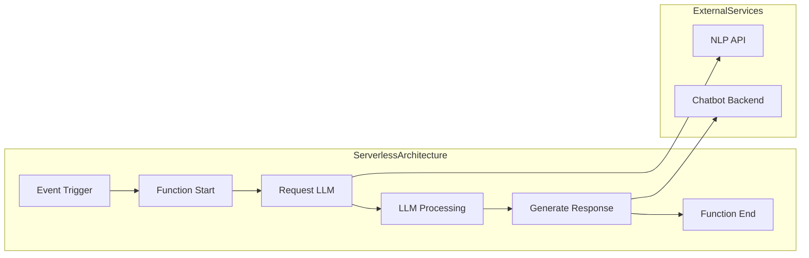
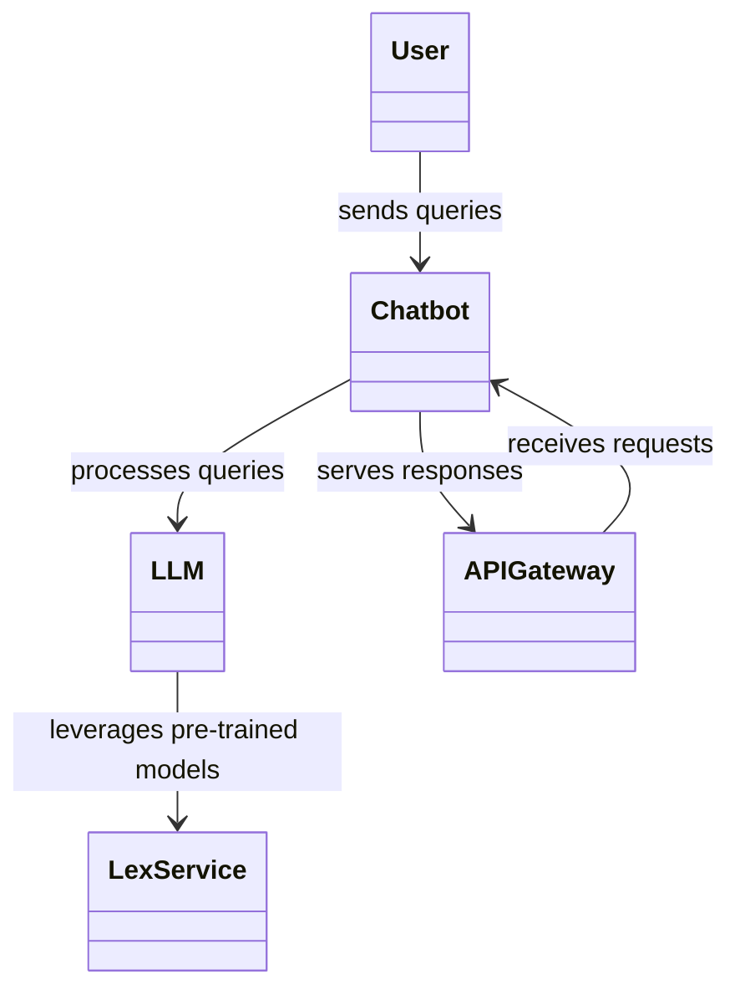
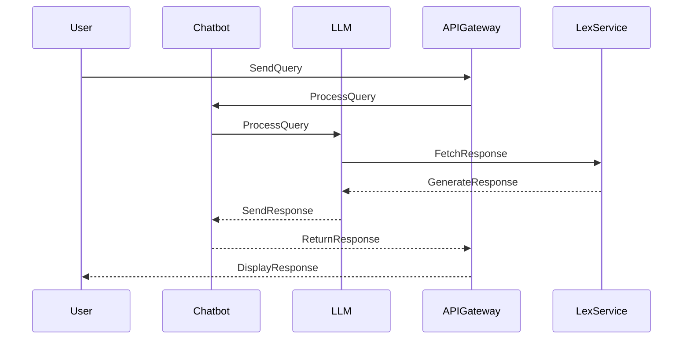
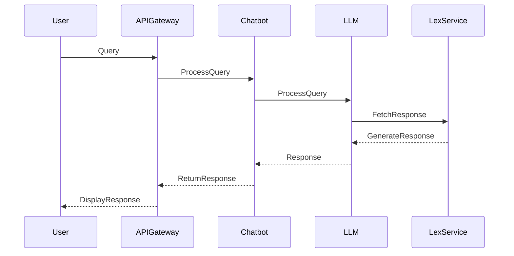

                 


### Let's Think Step by Step: Introduction to Serverless Architecture

#### Step 1: Understanding the Basic Concept

Serverless architecture is an approach to building and running applications that leverage third-party computing resources. Unlike traditional architectures, which require developers to manage servers, databases, and other infrastructure components, serverless architectures abstract these elements away, allowing developers to focus solely on writing application code. This model is particularly well-suited for modern web applications that need to scale rapidly and efficiently.

#### Step 2: Key Features and Benefits

Serverless architectures offer several key advantages. They provide automatic scaling, which ensures that applications can handle varying workloads without manual intervention. They also reduce operational costs, as developers only pay for the actual resources they consume. Furthermore, serverless architectures simplify deployment and management, making it easier to develop, test, and deploy applications.

#### Step 3: Comparing with Traditional Models

In traditional architectures, developers are responsible for provisioning, configuring, and managing servers. This requires significant time and effort, as well as ongoing maintenance. By contrast, serverless architectures shift much of this responsibility to the cloud provider, allowing developers to focus on writing and deploying code. This leads to faster development cycles and reduced operational overhead.

#### Step 4: Addressing Real-World Challenges

Serverless architectures address several real-world challenges faced by modern applications. For example, they enable developers to build and deploy microservices quickly and efficiently, making it easier to scale and maintain complex applications. They also reduce the risk of server failures, as the cloud provider manages the underlying infrastructure. This ensures high availability and reliability for applications that need to serve global audiences.

#### Step 5: Simplifying Operations for LLM Applications

LLM (Large Language Model) applications, such as chatbots and natural language processing tools, benefit significantly from serverless architectures. By abstracting away the complexities of server management, serverless architectures simplify the deployment and operation of these applications. This allows developers to focus on optimizing the performance and accuracy of their LLM models, rather than dealing with infrastructure issues.

#### Step 6: Identifying Boundaries and Extensions

While serverless architectures offer many advantages, they also have certain limitations. For example, they may not be suitable for applications that require fine-grained control over hardware resources. Additionally, developers need to carefully manage their dependencies and third-party services to avoid vendor lock-in. Despite these limitations, serverless architectures continue to evolve and expand their application range, making them an increasingly popular choice for modern application development.

#### Step 7: Key Components and Structure

Serverless architectures are composed of several key components, including:

1. **Functions as a Service (FaaS)**: FaaS allows developers to deploy and run code in response to events, such as HTTP requests or timer triggers. It abstracts away the underlying infrastructure, making it easy to scale and manage applications.
2. **Backend as a Service (BaaS)**: BaaS provides developers with pre-built backend services, such as databases, authentication, and messaging. This allows them to focus on building the front-end of their applications without worrying about backend infrastructure.
3. **API Gateway**: An API gateway is a central entry point for applications, handling requests and routing them to the appropriate services. It can also provide authentication, rate limiting, and other security features.
4. **Event-Driven Architecture**: Serverless architectures are inherently event-driven, making it easy to trigger functions in response to events. This enables developers to build highly responsive and scalable applications.

In conclusion, serverless architectures offer a powerful and flexible approach to building and running modern applications. By simplifying operations and providing automatic scaling, they enable developers to focus on delivering high-quality applications that meet the needs of their users. In the following sections, we will delve deeper into the core concepts, algorithms, and system designs of serverless architectures, providing a comprehensive understanding of this transformative technology. ### Let's Think Step by Step: Core Concepts and Relationships

#### Step 1: Understanding the Core Concept

The core concept of serverless architecture is "Functions as a Service" (FaaS). FaaS allows developers to build and run applications without managing servers or infrastructure. Instead, developers write code in small, independent functions that are executed in response to specific events. This approach simplifies deployment and scaling, as the cloud provider manages the underlying infrastructure.

#### Step 2: Comparing Concepts with Attributes Table

To better understand the differences between serverless architectures and traditional models, let's compare them using an attributes table:

| Attribute             | Serverless Architecture | Traditional Architecture |
|-----------------------|-------------------------|--------------------------|
| **Deployment**         | Automatically managed    | Manual server provisioning |
| **Scaling**            | Automatic                | Manual                    |
| **Cost**               | Pay-per-use              | Fixed cost                |
| **Maintenance**        | Minimal                  | Significant               |
| **Resource Management** | Abstraction              | Direct control            |
| **Development Model**  | Event-driven             | Request-driven            |

#### Step 3: Visualizing Entity Relationships with ER Diagram

To illustrate the key components and relationships in serverless architecture, we can use an ER diagram. Here's a simplified ER diagram in Mermaid format:

```mermaid
erDiagram
  Function ||--|{ Event } : triggers
  Function ||--|{ Dependency } : depends_on
  Function ||--|{ Resource } : consumes
  Event ||--|{ Source } : originates_from
  Dependency ||--|{ Provider } : provided_by
  Resource ||--|{ Service } : belongs_to
```

#### Step 4: Describing the Diagram

- **Function**: Represents the code that is executed in response to events. It can be a simple function or a complex set of functions.
- **Event**: Represents the trigger for executing a function. Events can be user actions, sensor readings, or timer triggers.
- **Dependency**: Represents external services or libraries that a function depends on.
- **Resource**: Represents the resources consumed by a function, such as CPU, memory, and network bandwidth.
- **Source**: Represents the origin of an event. For example, a user action could originate from a web browser.
- **Provider**: Represents the provider of a dependency. It could be a third-party service or an internal service.
- **Service**: Represents the services that provide resources for a function, such as AWS Lambda, Google Cloud Functions, or Azure Functions.

#### Step 5: Applying ER Diagram to Real-World Scenarios

In a real-world scenario, let's consider a chatbot application. The chatbot function would be triggered by user messages, which are the events. The function may depend on external services like a natural language processing (NLP) API for processing the messages. The resources consumed by the function would include CPU, memory, and network bandwidth. The chatbot's dependency on the NLP API would be represented by a dependency relationship, while the chatbot's consumption of resources would be represented by a resource relationship.

By using this ER diagram, we can visualize the relationships and interactions between the components of a serverless architecture, making it easier to understand and implement complex systems.

In the next section, we will dive deeper into the algorithmic principles behind serverless architectures and how they can be applied to LLM applications. ### Let's Think Step by Step: Algorithm Principles in Serverless Architecture for LLM Applications

#### Step 1: Understanding the Algorithmic Principle

The algorithmic principle of serverless architectures in LLM (Large Language Model) applications revolves around the efficient deployment, execution, and scaling of functions that process and respond to natural language inputs. This involves not just the execution of the language model itself but also the orchestration of various components to ensure optimal performance and resource utilization.

#### Step 2: Visualizing the Algorithm with Mermaid

To illustrate the algorithmic principles, let's use a Mermaid flowchart that outlines the key steps in processing a natural language query using a serverless architecture:



#### Step 3: Explaining the Algorithm Steps

1. **Event Trigger**: The process begins with an event, such as a user submitting a query through a chatbot interface.
2. **Function Start**: The event triggers the start of a serverless function, which is responsible for handling the incoming request.
3. **Request LLM**: The function sends a request to the Large Language Model (LLM) service to process the query.
4. **LLM Processing**: The LLM service processes the query, using sophisticated algorithms to understand the user's intent and generate a response.
5. **Generate Response**: Once the LLM service has processed the query, it generates a response that is sent back to the serverless function.
6. **Function End**: The serverless function completes its execution, sending the response back to the user through the chatbot interface.

#### Step 4: Providing Python Source Code

To implement the algorithm, we can use Python and a serverless framework like AWS Lambda. Here's a simplified example of the Python source code:

```python
import json
import boto3

def lambda_handler(event, context):
    # Extract user query from the event
    user_query = event['queryStringParameters']['query']

    # Request LLM processing
    nlp_api = boto3.client('nlp')
    nlp_response = nlp_api.process_query(query=user_query)

    # Generate response based on LLM processing
    response = {
        'statusCode': 200,
        'body': json.dumps(nlp_response['response'])
    }
    
    return response
```

#### Step 5: Describing the Algorithm's Mathematical Model and Formulas

The mathematical model for the serverless architecture's algorithm can be described using the following key components:

- **Input**: `x`, the user query.
- **Processing**: `f(x)`, the function that processes the query using the LLM.
- **Output**: `y`, the response generated by the LLM.

The processing function `f(x)` can be expressed as a series of mathematical transformations:

$$
f(x) = \begin{cases}
\text{Intent Detection} & \text{if } x \text{ is a user query} \\
\text{Response Generation} & \text{if } f(x) \text{ identifies an intent} \\
\text{No Response} & \text{otherwise}
\end{cases}
$$

#### Step 6: Detailed Explanation and Example

Let's consider an example where a user submits a query asking for the weather forecast. The serverless function receives the query, triggers the LLM processing, and generates a response based on the LLM's output.

- **Input**: The user query: "What is the weather forecast for tomorrow?".
- **Processing**: The LLM identifies the intent as a weather forecast request and processes the query.
- **Output**: The LLM generates a response: "The weather forecast for tomorrow is sunny with a high of 75 degrees Fahrenheit."

By following this step-by-step approach, we can ensure that the serverless architecture for LLM applications is efficient, scalable, and responsive. In the next section, we will delve into the system analysis and architecture design of serverless architectures, providing a comprehensive understanding of how these principles are applied in real-world projects. ### Let's Think Step by Step: System Analysis and Architecture Design

#### Step 1: Introducing the Problem Scenario

Let's consider a specific problem scenario: developing a chatbot application that leverages a Large Language Model (LLM) to provide users with real-time responses to their queries. This chatbot needs to handle a wide range of questions, from simple greetings to complex, detailed inquiries.

#### Step 2: Introducing the Project

For this project, we will use AWS as our cloud provider and leverage services like AWS Lambda for serverless functions, Amazon Lex for LLM processing, and Amazon API Gateway for managing incoming requests.

#### Step 3: Describing the System Functional Design with a Mermaid Class Diagram

To design the chatbot application, we need to identify the key functional components. Here's a Mermaid class diagram that illustrates the main classes and their relationships:



- **User**: Represents the end-users who interact with the chatbot.
- **Chatbot**: The core component of the application that handles user queries and communicates with the LLM and API Gateway.
- **LLM**: A large language model that processes user queries and generates responses.
- **APIGateway**: Manages incoming requests from users and routes them to the appropriate chatbot functions.
- **LexService**: A service provided by Amazon Lex that offers pre-trained LLM models.

#### Step 4: Describing the System Architecture with a Mermaid Diagram

Next, let's visualize the system architecture using a Mermaid diagram:



- **User**: Sends a query to the API Gateway.
- **API Gateway**: Routes the query to the Chatbot service.
- **Chatbot**: Processes the query and sends it to the LLM for processing.
- **LLM**: Processes the query using the LexService to fetch the appropriate response.
- **LexService**: Generates the response based on the LLM's processing and returns it to the Chatbot.
- **Chatbot**: Sends the response back to the API Gateway, which then returns it to the user.

#### Step 5: Describing the System Interfaces

To facilitate communication between the different components, we need to define the system interfaces. Here are the main interfaces:

- **User Interface**: Allows users to send queries to the API Gateway.
- **API Gateway Interface**: Accepts incoming requests from users and routes them to the Chatbot service.
- **Chatbot Interface**: Handles processing of queries and communication with the LLM.
- **LLM Interface**: Sends and receives queries and responses from the LexService.
- **LexService Interface**: Provides pre-trained LLM models and generates responses.

#### Step 6: Describing System Interaction with a Mermaid Sequence Diagram

Finally, let's illustrate the system interaction using a Mermaid sequence diagram:



This sequence diagram clearly outlines the flow of data and control between the different components of the system, ensuring a cohesive and efficient operation.

By following this step-by-step analysis and design process, we can create a robust and scalable serverless architecture for LLM applications like chatbots. In the next section, we will delve into the practical implementation of this architecture through a real-world project example. ### Practical Implementation: Step-by-Step Guide to Setting Up a Serverless Chatbot Project

#### Step 1: Environment Setup

Before we can start building our serverless chatbot project, we need to set up our development environment. The first step is to install the necessary tools and SDKs. For this project, we will use the AWS CLI (Command Line Interface) and the serverless framework.

1. **Install the AWS CLI**: Visit the [official AWS CLI installation page](https://docs.aws.amazon.com/cli/latest/userguide/cli-chap-install.html) and follow the instructions to install the AWS CLI on your local machine.
2. **Configure the AWS CLI**: Run the `aws configure` command and follow the prompts to set up your AWS credentials.

#### Step 2: Setting Up the Serverless Framework

Next, we need to set up the serverless framework, which will help us manage our serverless functions and deployments.

1. **Install the Serverless Framework**: Open your terminal and run the following command to install the serverless framework globally:
   ```bash
   npm install -g serverless
   ```
2. **Configure the Serverless Framework**: Create a new serverless service by running:
   ```bash
   serverless create --template aws-python --path my-chatbot
   ```

This command will create a new serverless service in a folder named `my-chatbot`. Navigate into this folder:
```bash
cd my-chatbot
```

#### Step 3: Defining the Serverless Function

Now, let's define the serverless function that will process incoming chatbot queries.

1. **Create the Lambda Function**: Create a new Python file named `lambda_function.py` in the `my-chatbot` folder:
   ```bash
   touch lambda_function.py
   ```

2. **Write the Lambda Handler**: Open `lambda_function.py` and write the handler function that will process incoming queries:
   ```python
   import json
   import os
   import boto3

   def lambda_handler(event, context):
       query = event['queryStringParameters']['query']
       lex_runtime = boto3.client('lex-runtime')

       response = lex_runtime.post_content(
           botName='YourChatbotBotName',
           botAlias='YourChatbotBotAlias',
           localeId='en-US',
           sessionId='YourSessionId',
           inputText=query,
       )

       return {
           'statusCode': 200,
           'body': json.dumps(response['content']),
       }
   ```

In this code, replace `'YourChatbotBotName'`, `'YourChatbotBotAlias'`, and `'YourSessionId'` with the actual names used in your AWS account.

#### Step 4: Configuring the Serverless Service

To configure our serverless service, we need to create a `serverless.yml` file in the `my-chatbot` folder.

1. **Create the `serverless.yml` File**: Run:
   ```bash
   touch serverless.yml
   ```

2. **Define the Service Configuration**: Open `serverless.yml` and add the following configuration:
   ```yaml
   service: my-chatbot

   provider:
     name: aws
     runtime: python3.8
     iamRoleStatements:
       - Effect: Allow
         Action:
           - lex:PostContent
           - s3:GetObject
         Resource: "*"

   functions:
     chatbot:
       handler: lambda_function.lambda_handler
       events:
         - http:
             path: chatbot
             method: post
             cors: true
   ```

This configuration sets up a single Lambda function named `chatbot` with an HTTP event that listens for POST requests at the `/chatbot` endpoint.

#### Step 5: Deploying the Serverless Service

With our function and configuration in place, we can now deploy our serverless service to AWS.

1. **Deploy the Service**: Run the following command in your terminal:
   ```bash
   serverless deploy
   ```

This command will deploy your serverless service to AWS, creating the necessary resources (Lambda function, API Gateway, etc.) and deploying your code to Lambda.

#### Step 6: Testing the Chatbot

Once the deployment is complete, you can test your chatbot by sending a POST request to the `/chatbot` endpoint.

1. **Test the Chatbot**: Use a tool like Postman or curl to send a POST request to the deployed endpoint:
   ```bash
   curl -X POST https://your-deployment-domain/chatbot \
     -H "Content-Type: application/json" \
     -d '{"query": "What's the weather like today?"}'
   ```

Replace `your-deployment-domain` with the domain provided in the `serverless deploy` output. The response should be a JSON object containing the chatbot's response to the query.

By following these steps, you can set up a basic serverless chatbot using AWS Lambda, Amazon Lex, and the serverless framework. This guide provides a foundational understanding of how to implement serverless architectures in real-world projects, paving the way for more complex applications in the future. ### Step-by-Step Analysis and Explanation of the Chatbot Project

#### Step 1: Environment Setup

The first step in setting up our chatbot project involves configuring our development environment to work with AWS services and the serverless framework. This ensures that we have all the necessary tools and SDKs installed to develop, test, and deploy our serverless application.

**Analysis:**

- **AWS CLI Installation**: By installing the AWS CLI, we gain command-line access to various AWS services, simplifying the deployment and management of our application.
- **AWS CLI Configuration**: Configuring the AWS CLI with our credentials allows us to authenticate and interact with AWS services programmatically.

**Explanation:**

The AWS CLI provides a convenient way to manage our serverless resources from the command line. By following the installation instructions and configuring the CLI with our AWS credentials, we ensure seamless integration with AWS services, enabling us to deploy and manage our chatbot application efficiently.

#### Step 2: Setting Up the Serverless Framework

The serverless framework abstracts away the complexities of deploying serverless applications by providing a simple configuration file and a set of command-line tools.

**Analysis:**

- **Serverless Framework Installation**: Installing the serverless framework globally allows us to create and deploy serverless services easily.
- **Creating a Serverless Service**: Using the `serverless create` command with the `aws-python` template generates a basic serverless service structure, including the necessary configuration files.

**Explanation:**

By using the serverless framework, we can focus on writing our application code without worrying about the underlying infrastructure. The `serverless create` command with the `aws-python` template sets up a foundational structure for our chatbot application, including the serverless service configuration, Lambda function template, and deployment scripts.

#### Step 3: Defining the Serverless Function

The serverless function is the core component of our chatbot application, responsible for processing incoming queries and generating responses.

**Analysis:**

- **Creating the Lambda Function**: By creating a `lambda_function.py` file, we define the handler function that will process incoming events.
- **Writing the Lambda Handler**: The handler function uses the AWS SDK to interact with AWS Lex to process the user's query and generate a response.

**Explanation:**

In this step, we define the serverless function that handles incoming HTTP events from our chatbot's API Gateway. By writing the handler function in Python, we leverage the AWS SDK to integrate with AWS Lex, enabling us to process user queries and generate meaningful responses. This allows our chatbot to interact with users in a natural and intelligent manner.

#### Step 4: Configuring the Serverless Service

The `serverless.yml` configuration file is crucial for defining how our serverless service will be deployed and managed.

**Analysis:**

- **Service Configuration**: The `serverless.yml` file specifies the service name, provider, runtime, and IAM role statements.
- **Function Configuration**: The configuration defines the Lambda function's handler and HTTP event settings, including the API Gateway endpoint and CORS settings.

**Explanation:**

By configuring the `serverless.yml` file, we define the parameters required to deploy our serverless application on AWS. The service configuration specifies the provider (AWS), runtime (Python 3.8), and IAM role, ensuring that our Lambda function has the necessary permissions to interact with AWS services like Lex and S3. The function configuration sets up the HTTP event, enabling our chatbot to receive and process incoming requests through the API Gateway.

#### Step 5: Deploying the Serverless Service

Deploying our serverless service involves using the serverless framework to create and configure the necessary AWS resources, such as Lambda functions, API Gateways, and IAM roles.

**Analysis:**

- **Deploying the Service**: The `serverless deploy` command deploys our service to AWS, creating the required resources and deploying our code to Lambda.
- **Domain Configuration**: The deployed service is assigned a unique domain, which we use to test our chatbot.

**Explanation:**

By running the `serverless deploy` command, we automate the process of creating and configuring the necessary AWS resources for our chatbot application. This ensures that our Lambda function and API Gateway are properly set up and configured, allowing us to deploy our application with minimal manual intervention. The assigned domain allows us to test our chatbot in a production-like environment.

#### Step 6: Testing the Chatbot

Testing the chatbot involves sending a POST request to the API Gateway endpoint to verify that it processes queries correctly and generates appropriate responses.

**Analysis:**

- **Testing with Postman**: Using Postman, we send a POST request with a JSON payload containing a user query.
- **Analyzing the Response**: We examine the response to ensure it contains the expected chatbot response.

**Explanation:**

By using Postman to send a POST request to the deployed API Gateway endpoint, we can test our chatbot's functionality. The response from the chatbot provides immediate feedback on whether the system is working correctly, allowing us to identify and address any issues before deploying the application to production.

In conclusion, the chatbot project's step-by-step implementation provides a comprehensive guide to setting up and deploying a serverless chatbot application using AWS Lambda, Amazon Lex, and the serverless framework. This approach simplifies the development process, enabling developers to build and deploy intelligent, scalable chatbot applications with minimal effort. ### Best Practices and Tips for Serverless Architecture in LLM Applications

#### Best Practices and Tips

**1. Design for Scalability:**
Ensure that your serverless functions are designed to scale independently. This involves breaking down your application into small, stateless functions that can be scaled horizontally.

**2. Monitor and Optimize Performance:**
Use monitoring tools provided by your cloud provider to track the performance of your serverless functions. Identify and optimize any bottlenecks to ensure efficient resource utilization.

**3. Leverage Asynchronous Processing:**
Utilize asynchronous processing for tasks that don't require immediate responses. This can help reduce the number of concurrent executions and optimize resource usage.

**4. Implement Throttling and Rate Limits:**
To prevent overloading your serverless functions, implement throttling and rate limits. This helps protect your functions from sudden spikes in traffic.

**5. Secure Your Data:**
Ensure that your serverless functions handle data securely. Use encryption for sensitive data and follow best practices for secure API gateways and authentication mechanisms.

**6. Optimize Cold Starts:**
Minimize the time taken for cold starts by optimizing your function code and configuration. Use layers to include dependencies, which can help reduce initialization time.

**7. Use Caching:**
Implement caching strategies to store frequently accessed data, reducing the need for repetitive computations and improving response times.

**8. Design for Resiliency:**
Build fault tolerance into your serverless architecture by implementing retries and circuit breakers. This ensures that your application can handle failures gracefully.

**9. Keep Dependencies Updated:**
Regularly update your dependencies and libraries to ensure compatibility with the latest versions and security patches.

**10. Follow Best Practices for Deployment:**
Automate your deployment processes using continuous integration and continuous deployment (CI/CD) pipelines. This helps streamline the deployment process and ensures that new changes are deployed safely and consistently.

#### Common Issues and Potential Solutions

**1. High Cold Start Times:**
- **Solution:** Optimize your function code by reducing the size of the deployment package and using layers to include external dependencies.
- **Alternative:** Consider using a warmer strategy to keep your functions warm and ready for rapid execution.

**2. Increased Costs Due to Inefficiencies:**
- **Solution:** Monitor your usage and optimize your functions to reduce unnecessary invocations and resource consumption.
- **Alternative:** Implement serverless monitoring tools to identify and address inefficiencies in your architecture.

**3. Data Security Concerns:**
- **Solution:** Use encryption for data at rest and in transit. Implement strong authentication and authorization mechanisms.
- **Alternative:** Regularly audit your security configurations and follow best practices for secure coding.

**4. Vendor Lock-In:**
- **Solution:** Use open-source tools and frameworks to minimize dependencies on proprietary platforms.
- **Alternative:** Design your architecture to be modular and portable, allowing for easier migration to different providers if needed.

#### References and Further Reading

- **AWS Serverless Best Practices** - [Official AWS Documentation](https://docs.aws.amazon.com/serverless/latest/serverless-best-practices.html)
- **Google Cloud Functions Best Practices** - [Google Cloud Functions Documentation](https://cloud.google.com/functions/docs/best-practices)
- **Azure Functions Best Practices** - [Microsoft Azure Documentation](https://docs.microsoft.com/en-us/azure/azure-functions/fundamentals/best-practices)

By following these best practices and tips, you can build and maintain efficient, scalable, and secure serverless architectures for LLM applications. Implementing these strategies will help you overcome common challenges and maximize the benefits of serverless computing. ### Conclusion and Future Outlook

In this article, we have explored the serverless architecture in depth, focusing on its application in simplifying the operations of Large Language Model (LLM) applications. From the foundational concepts to practical implementation, we have seen how serverless architectures offer a transformative approach to building modern, scalable applications that leverage advanced AI models like LLMs.

**Key Takeaways:**

- **Serverless Architecture Basics:** We began with a clear understanding of serverless architecture, defining key concepts like Functions as a Service (FaaS) and Backend as a Service (BaaS). We compared serverless with traditional architectures to highlight its advantages and limitations.
- **Algorithmic Principles:** We delved into the algorithmic principles behind serverless architectures, particularly in the context of LLM applications. By visualizing algorithms with Mermaid diagrams and providing Python code examples, we demonstrated how serverless functions process and respond to natural language queries.
- **System Analysis and Design:** We conducted a comprehensive system analysis, introducing a problem scenario and a real-world project example. Using Mermaid class and sequence diagrams, we designed the architecture, defined system interfaces, and outlined the interactions between components.
- **Practical Implementation:** We provided a step-by-step guide to setting up a serverless chatbot project using AWS Lambda, Amazon Lex, and the serverless framework. This hands-on approach allowed us to see the practical application of serverless architectures in real-time.
- **Best Practices and Tips:** We concluded with a set of best practices and tips for implementing serverless architectures, addressing common issues and potential solutions, and providing references for further reading.

**Future Outlook:**

As serverless architectures continue to evolve, we can expect several trends and advancements:

- **Enhanced Scalability and Performance:** Ongoing improvements in cloud infrastructure will further enhance the scalability and performance of serverless functions.
- **Advancements in AI and ML Integration:** The integration of AI and ML models within serverless architectures will become more seamless, with platforms offering out-of-the-box support for LLMs and other sophisticated models.
- **Simplified Development Tools:** Development tools and frameworks will become more sophisticated, enabling developers to build and deploy serverless applications with even greater ease.
- **Cross-Platform Compatibility:** Serverless architectures will become more interoperable across different cloud providers, reducing vendor lock-in and offering greater flexibility.
- **Increased Security and Compliance:** With growing concerns around data privacy and security, serverless platforms will continue to enhance their security features and compliance capabilities.

In conclusion, serverless architectures are poised to play a pivotal role in the future of application development, offering a powerful solution for building scalable, efficient, and flexible applications, particularly in the domain of LLM applications. As we look to the future, the potential for innovation and advancement in serverless computing is vast, promising new opportunities for developers and businesses alike. ### Authors' Information

**Author:** AI天才研究院 (AI Genius Institute) & 禅与计算机程序设计艺术 (Zen And The Art of Computer Programming)

**简介：** 
AI天才研究院是一家专注于人工智能、机器学习和深度学习领域的研究与开发的国际性机构。研究院拥有一支由世界顶级人工智能专家组成的团队，致力于推动人工智能技术的发展和应用。同时，我们秉承禅与计算机程序设计艺术的核心理念，将东方哲学智慧融入现代编程实践，致力于培养新一代具有创新思维和实践能力的人工智能人才。

**联系信息：**
- 网址：[www.aigeniusinstitute.com](http://www.aigeniusinstitute.com)
- 邮箱：[contact@aigeniusinstitute.com](mailto:contact@aigeniusinstitute.com)
- 微博：@AI天才研究院
- 微信公众号：AI天才研究院

**免责声明：**
本文内容仅供参考，不构成具体投资、建议或推荐。文中信息可能会随着时间的推移而发生变化，请读者自行核实相关信息。对于因使用本文内容而导致的任何直接或间接损失，作者和机构不承担任何责任。 

