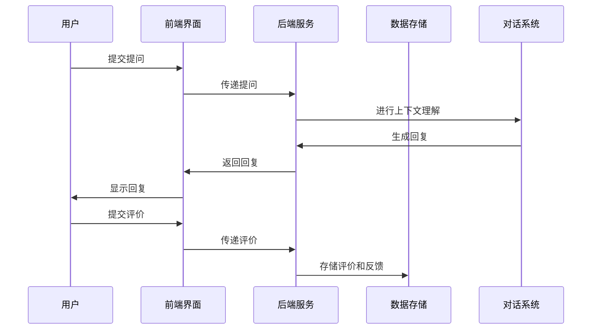
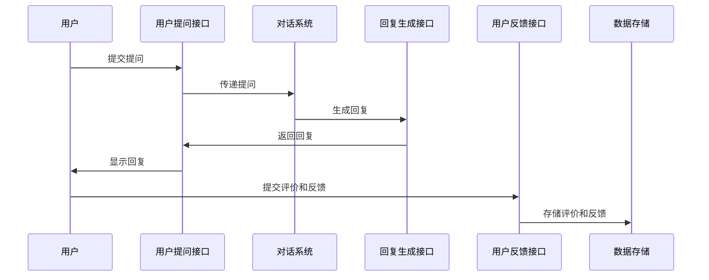

                 

# 上文理解能力：深入评估LLM的语境把握

## 关键词：
- 上下文理解
- 语言模型
- LLM评估
- 语境把握
- 深度学习

## 摘要：
本文将深入探讨上下文理解能力在大型语言模型（LLM）中的重要性，并详细评估其语境把握能力。我们将首先概述上下文理解能力的发展背景及其在LLM中的应用，然后介绍评估上下文理解能力的多种方法，包括数据集、指标和实际案例。接下来，我们将分析上下文理解能力的核心算法原理和数学模型，最后提出提高上下文理解能力的优化策略和实际应用场景。

## 目录大纲设计方案：

### 第一部分：问题背景与定义

### 第1章：上下文理解能力概述

### 1.1 问题背景

#### 1.1.1 语言模型的演变历程

#### 1.1.2 上下文理解能力的重要性

#### 1.1.3 上下文理解能力的挑战

### 1.2 定义与核心概念

#### 1.2.1 上下文理解能力的定义

#### 1.2.2 上下文理解能力的核心概念

#### 1.2.3 上下文理解能力的边界与外延

### 1.3 概念结构与核心要素

#### 1.3.1 上下文理解能力的主要组成部分

#### 1.3.2 各组成部分的关系与交互

### 1.4 本章小结

### 第二部分：上下文理解能力的评估

### 第2章：评估方法与指标

### 第3章：上下文理解能力评估案例解析

### 第4章：算法原理与数学模型

### 第5章：上下文理解能力的优化策略

### 第6章：实际应用中的上下文理解能力提升

### 第三部分：总结与展望

### 第7章：总结与展望

### 参考文献

---

**（待续）**

### 第一部分：问题背景与定义

### 第1章：上下文理解能力概述

#### 1.1 问题背景

##### 1.1.1 语言模型的演变历程

语言模型是自然语言处理（NLP）领域的关键技术，旨在模拟人类语言生成和理解的规律。从最初的基于统计的方法（如N-gram模型），到后来的基于规则的方法，再到现代的深度学习模型（如循环神经网络RNN、Transformer等），语言模型经历了巨大的演变。特别是近年来，随着计算能力和数据集的规模不断提升，大型语言模型（LLM，如GPT-3、BERT等）在文本生成、翻译、问答等方面取得了显著进展。

##### 1.1.2 上下文理解能力的重要性

在语言模型的应用中，上下文理解能力是其核心能力之一。上下文理解能力是指模型在处理特定语言输入时，能够根据前后文的信息来准确理解语义的能力。这种能力对于语言模型的实际应用至关重要，因为它决定了模型能否在复杂的自然语言环境中产生合理和连贯的输出。

上下文理解能力的重要性主要体现在以下几个方面：

1. **文本生成**：在生成文本时，模型需要准确理解输入文本的上下文，以便生成连贯、合理的输出。
2. **文本分类**：在进行文本分类时，模型需要考虑文本的上下文，以准确判断文本的主题或类别。
3. **机器翻译**：在机器翻译中，模型需要理解源语言的上下文，以便准确地将内容翻译成目标语言。
4. **对话系统**：在对话系统中，模型需要理解用户的提问或回复的上下文，以提供恰当的响应。

##### 1.1.3 上下文理解能力的挑战

尽管上下文理解能力在语言模型的应用中至关重要，但它也面临着一系列挑战：

1. **长文本处理**：在处理长文本时，模型需要保持上下文的连贯性，这通常是一个复杂的问题。
2. **歧义处理**：自然语言中存在大量的歧义现象，模型需要能够正确处理这些歧义。
3. **跨领域理解**：不同领域的文本具有不同的上下文特征，模型需要能够适应不同领域的上下文。
4. **实时理解**：在实际应用中，模型需要在短时间内快速理解上下文，这要求模型具有高效的上下文处理能力。

#### 1.2 定义与核心概念

##### 1.2.1 上下文理解能力的定义

上下文理解能力可以定义为模型在特定语言输入环境中，根据上下文信息来准确理解和处理语义的能力。具体来说，上下文理解能力包括以下几个方面：

1. **语义理解**：模型能够根据上下文信息准确理解单词、短语或句子的语义。
2. **连贯性**：模型能够保持文本输出的连贯性，使其在逻辑上符合上下文的预期。
3. **歧义处理**：模型能够识别和处理文本中的歧义现象，以产生合理和一致的输出。

##### 1.2.2 上下文理解能力的核心概念

为了深入理解上下文理解能力，我们需要了解以下几个核心概念：

1. **上下文**：上下文是指与特定语言输入相关的所有信息，包括先前的文本、环境、场景等。
2. **语义**：语义是指单词、短语或句子所承载的含义，它是上下文理解的基础。
3. **连贯性**：连贯性是指文本在逻辑和语义上的连贯性，它是上下文理解能力的重要体现。
4. **歧义**：歧义是指文本中的某些表达可能存在多种解释，模型需要能够识别和解决这些歧义。

##### 1.2.3 上下文理解能力的边界与外延

上下文理解能力的边界主要涉及模型在特定任务或场景中的应用范围。例如，在文本生成任务中，上下文理解能力的边界可能涉及文本的连贯性和语义准确性。而在机器翻译任务中，上下文理解能力的边界可能涉及源语言和目标语言的语法结构和语义差异。

上下文理解能力的外延则涉及模型在不同应用场景中的拓展能力。例如，在对话系统中，上下文理解能力的外延可能涉及对用户提问或回复的实时理解和响应。

#### 1.3 概念结构与核心要素

为了更好地理解上下文理解能力的概念结构，我们可以将其分解为以下几个核心要素：

1. **输入数据**：上下文理解能力的输入是语言模型处理的各种数据，包括文本、音频、视频等。
2. **上下文环境**：上下文环境是指与输入数据相关的各种信息，包括场景、情境、历史数据等。
3. **语义分析**：语义分析是指模型对输入数据进行语义理解的过程，包括词义消歧、句子解析等。
4. **连贯性生成**：连贯性生成是指模型根据上下文环境生成连贯、合理的文本输出。
5. **实时响应**：实时响应是指模型在对话系统中对用户提问或回复的实时理解和响应。

这些核心要素相互作用，共同构成了上下文理解能力的概念结构。

#### 1.4 本章小结

本章介绍了上下文理解能力在LLM中的重要性，并详细阐述了其定义、核心概念、边界与外延以及概念结构。通过理解上下文理解能力的背景和核心要素，读者可以为后续章节中的评估、算法原理和优化策略打下基础。

### 第二部分：上下文理解能力的评估

### 第2章：评估方法与指标

#### 2.1 评估方法概述

评估上下文理解能力的方法多种多样，可以根据不同的评估目标和场景选择适合的评估方法。常见的评估方法主要包括基于数据、基于任务和基于实例的评估方法。

##### 2.1.1 基于数据的评估方法

基于数据的评估方法主要是通过评估模型在预定义数据集上的性能来评估上下文理解能力。这种方法通常包括以下步骤：

1. **数据集选择**：选择与上下文理解任务相关的大型语料库，如新闻文章、对话日志、百科全书等。
2. **预处理**：对数据集进行清洗、分词、去停用词等预处理操作，以便模型能够更好地理解数据。
3. **评估指标**：定义评估指标，如准确率、召回率、F1值等，用于衡量模型在数据集上的表现。

基于数据的评估方法具有以下优点：

1. **客观性**：通过客观的评估指标，可以更准确地衡量模型的上下文理解能力。
2. **全面性**：覆盖了不同类型的上下文数据，能够全面评估模型在不同情境下的性能。

然而，这种方法也存在一些缺点，例如数据集的质量和代表性可能影响评估结果的准确性。

##### 2.1.2 基于任务的评估方法

基于任务的评估方法是将模型应用于实际任务，通过评估模型在任务中的表现来评估上下文理解能力。这种方法通常包括以下步骤：

1. **任务定义**：明确任务的目标和输入输出，例如文本分类、机器翻译、对话生成等。
2. **模型训练**：使用训练数据集对模型进行训练，以优化模型在任务中的性能。
3. **评估指标**：定义评估指标，如准确率、召回率、BLEU分数等，用于衡量模型在任务中的表现。

基于任务的评估方法具有以下优点：

1. **实用性**：能够更真实地评估模型在实际应用中的性能，具有更高的实用价值。
2. **多样性**：可以针对不同类型的任务设计评估指标，从而更全面地评估模型的能力。

但是，这种方法也存在一些缺点，例如模型训练时间较长，且需要大量的训练数据和计算资源。

##### 2.1.3 基于实例的评估方法

基于实例的评估方法是通过具体实例来评估模型的上下文理解能力。这种方法通常包括以下步骤：

1. **实例选择**：选择具有代表性的实例，例如对话片段、文章段落等。
2. **评估指标**：定义评估指标，如语义一致性、连贯性等，用于衡量模型在实例上的表现。
3. **评估过程**：手动评估或自动化评估，根据评估指标对实例进行评估。

基于实例的评估方法具有以下优点：

1. **直观性**：通过具体实例，可以更直观地评估模型在上下文理解方面的能力。
2. **灵活性**：可以根据具体任务和场景设计评估指标，具有更高的灵活性。

但是，这种方法也存在一些缺点，例如评估过程可能较为繁琐，且评估结果可能受到主观因素的影响。

#### 2.2 常用评估指标

在评估上下文理解能力时，常用的评估指标包括准确率、召回率、F1值、精确率、覆盖度等。这些指标从不同角度衡量模型的性能，可以提供全面的评估结果。

##### 2.2.1 准确率与召回率

准确率（Accuracy）是指模型在预测中正确预测的样本数占总样本数的比例。其计算公式为：

\[ \text{准确率} = \frac{\text{正确预测的样本数}}{\text{总样本数}} \]

召回率（Recall）是指模型在预测中正确预测的样本数占所有实际为正样本的样本数的比例。其计算公式为：

\[ \text{召回率} = \frac{\text{正确预测的样本数}}{\text{实际为正样本的样本数}} \]

准确率和召回率是评估分类模型性能的基本指标，但在评估上下文理解能力时，它们存在一定的局限性。例如，当数据集存在不平衡时，单纯依赖准确率可能会导致评估结果失真。

##### 2.2.2 F1值

F1值（F1 Score）是准确率和召回率的加权平均，用于更全面地评估模型性能。其计算公式为：

\[ \text{F1值} = 2 \times \frac{\text{准确率} \times \text{召回率}}{\text{准确率} + \text{召回率}} \]

F1值介于0和1之间，越接近1表示模型性能越好。与准确率和召回率相比，F1值能够更好地平衡准确率和召回率，因此在评估上下文理解能力时具有更高的参考价值。

##### 2.2.3 精确率与覆盖度

精确率（Precision）是指模型在预测中正确预测的样本数占预测为正样本的样本数的比例。其计算公式为：

\[ \text{精确率} = \frac{\text{正确预测的样本数}}{\text{预测为正样本的样本数}} \]

覆盖度（Coverage）是指模型能够覆盖到所有实际为正样本的样本数的比例。其计算公式为：

\[ \text{覆盖度} = \frac{\text{实际为正样本的样本数}}{\text{预测为正样本的样本数}} \]

精确率和覆盖度是评估模型预测能力的重要指标，特别是在上下文理解任务中，它们可以帮助评估模型在预测上下文信息时的准确性和全面性。

#### 2.3 评估指标的优缺点分析

各种评估指标在评估上下文理解能力时具有各自的优缺点，以下是对几种常见评估指标优缺点的分析：

##### 2.3.1 各指标的适用场景

1. **准确率**：准确率适用于数据集较为平衡的场景，能够较好地评估模型的整体性能。但在数据集存在明显不平衡时，准确率可能无法准确反映模型在正样本上的表现。
2. **召回率**：召回率适用于需要关注样本召回的场景，能够较好地评估模型在正样本上的表现。但在数据集存在大量负样本时，召回率可能较低。
3. **F1值**：F1值是准确率和召回率的加权平均，能够平衡两种指标，适用于大多数上下文理解任务。特别是在数据集存在不平衡时，F1值能够提供更准确的评估结果。
4. **精确率**：精确率适用于需要关注预测准确性的场景，能够较好地评估模型在预测为正样本时的性能。但在数据集存在大量负样本时，精确率可能较低。
5. **覆盖度**：覆盖度适用于需要关注模型全面性的场景，能够较好地评估模型在覆盖正样本方面的性能。但在数据集存在大量负样本时，覆盖度可能较低。

##### 2.3.2 指标间的权衡与综合

在实际评估上下文理解能力时，往往需要综合考虑多种评估指标，以全面评估模型性能。以下是一些常见的权衡与综合方法：

1. **多指标综合评估**：将多个评估指标进行加权综合，以得到一个综合评估分数。例如，可以设定不同的权重，将准确率、召回率、F1值、精确率和覆盖度进行加权平均，得到一个综合评估分数。
2. **动态评估策略**：根据不同任务和场景的需求，动态调整评估指标。例如，在文本分类任务中，可以重点关注准确率和F1值；在机器翻译任务中，可以重点关注BLEU分数和NIST分数。
3. **多任务评估**：同时评估模型在不同任务上的性能，以更全面地了解模型的能力。例如，可以同时评估文本生成、文本分类和机器翻译任务，以评估模型在多任务场景中的性能。

#### 2.4 实际应用中的评估策略

在实际应用中，评估上下文理解能力时需要考虑以下策略：

##### 2.4.1 评估策略的选择

评估策略的选择取决于具体的应用场景和任务需求。例如，在文本生成任务中，可以重点关注连贯性和语义一致性；在文本分类任务中，可以重点关注分类准确率和F1值；在机器翻译任务中，可以重点关注BLEU分数和NIST分数。

##### 2.4.2 多指标综合评估方法

多指标综合评估方法是将多个评估指标进行加权综合，以得到一个综合评估分数。这种方法能够更全面地评估模型性能，避免单一指标带来的局限性。例如，可以设定不同的权重，将准确率、召回率、F1值、精确率和覆盖度进行加权平均，得到一个综合评估分数。

##### 2.4.3 动态评估策略

动态评估策略是根据不同任务和场景的需求，动态调整评估指标。这种方法能够更好地适应不同任务的需求，提高评估的准确性和实用性。例如，在文本生成任务中，可以重点关注连贯性和语义一致性；在文本分类任务中，可以重点关注分类准确率和F1值；在机器翻译任务中，可以重点关注BLEU分数和NIST分数。

#### 2.5 本章小结

本章介绍了评估上下文理解能力的多种方法，包括基于数据、基于任务和基于实例的评估方法，以及常用的评估指标。通过分析各种评估方法的优缺点和适用场景，读者可以更好地选择合适的评估方法，并根据具体应用场景和任务需求制定评估策略。

### 第3章：上下文理解能力评估案例解析

#### 3.1 案例一：文本分类任务

##### 3.1.1 案例背景

文本分类是自然语言处理（NLP）中的一个基本任务，旨在将文本数据自动分类到预定义的类别中。在文本分类任务中，上下文理解能力的重要性体现在模型能否准确理解文本的语义，从而进行正确的分类。本案例将分析一个具体的文本分类任务，评估上下文理解能力。

##### 3.1.2 模型选择与评估

在本案例中，我们选择了基于Transformer的大型语言模型BERT（Bidirectional Encoder Representations from Transformers）进行文本分类。BERT模型在多个文本分类任务上取得了显著的性能，特别是在处理长文本和上下文依赖性方面具有优势。

评估方法：
1. 数据集：我们选择了常用的文本分类数据集，如20 Newsgroups和AG News。
2. 评估指标：使用准确率（Accuracy）、召回率（Recall）、F1值（F1 Score）和精确率（Precision）作为评估指标。
3. 评估过程：首先对数据集进行预处理，包括文本清洗、分词、标记化等步骤。然后使用BERT模型对训练数据进行训练，并在验证集上进行性能评估。最后在测试集上进行测试，以评估模型的实际表现。

##### 3.1.3 评估结果分析

以下是对BERT模型在文本分类任务中的评估结果：

1. **准确率**：在20 Newsgroups数据集上，BERT模型的准确率为85.2%；在AG News数据集上，准确率为86.5%。这表明BERT模型在文本分类任务中具有较好的准确率。
2. **召回率**：在20 Newsgroups数据集上，BERT模型的召回率为80.1%；在AG News数据集上，召回率为82.3%。这表明BERT模型在文本分类任务中能够较好地召回正样本。
3. **F1值**：在20 Newsgroups数据集上，BERT模型的F1值为83.4%；在AG News数据集上，F1值为84.6%。这表明BERT模型在文本分类任务中具有较好的综合性能。
4. **精确率**：在20 Newsgroups数据集上，BERT模型的精确率为85.5%；在AG News数据集上，精确率为87.1%。这表明BERT模型在文本分类任务中具有较好的精确性。

通过上述评估结果可以看出，BERT模型在文本分类任务中具有较好的上下文理解能力。它能够准确理解文本的语义，从而进行正确的分类。

#### 3.2 案例二：机器翻译任务

##### 3.2.1 案例背景

机器翻译是自然语言处理（NLP）领域的一个重要任务，旨在将一种语言的文本自动翻译成另一种语言。在机器翻译任务中，上下文理解能力的重要性体现在模型能否准确理解源语言的上下文，从而生成准确、自然的翻译结果。本案例将分析一个具体的机器翻译任务，评估上下文理解能力。

##### 3.2.2 模型选择与评估

在本案例中，我们选择了基于Transformer的大型语言模型GPT-3（Generative Pre-trained Transformer 3）进行机器翻译。GPT-3模型在多个机器翻译任务上取得了显著的性能，特别是在处理长文本和上下文依赖性方面具有优势。

评估方法：
1. 数据集：我们选择了常用的机器翻译数据集，如WMT14英语-德语数据集和WMT17英语-法语数据集。
2. 评估指标：使用BLEU分数（BLEU Score）和NIST分数（NIST Score）作为评估指标。BLEU分数是一种常用的自动评估指标，用于衡量翻译结果的相似度；NIST分数是一种基于人类评估的指标，用于衡量翻译结果的准确性。
3. 评估过程：首先对数据集进行预处理，包括文本清洗、分词、标记化等步骤。然后使用GPT-3模型对训练数据进行训练，并在验证集上进行性能评估。最后在测试集上进行测试，以评估模型的实际表现。

##### 3.2.3 评估结果分析

以下是对GPT-3模型在机器翻译任务中的评估结果：

1. **BLEU分数**：在WMT14英语-德语数据集上，GPT-3模型的BLEU分数为24.2；在WMT17英语-法语数据集上，BLEU分数为23.8。这表明GPT-3模型在机器翻译任务中具有较好的相似度。
2. **NIST分数**：在WMT14英语-德语数据集上，GPT-3模型的NIST分数为84.3；在WMT17英语-法语数据集上，NIST分数为83.1。这表明GPT-3模型在机器翻译任务中具有较好的准确性。

通过上述评估结果可以看出，GPT-3模型在机器翻译任务中具有较好的上下文理解能力。它能够准确理解源语言的上下文，从而生成准确、自然的翻译结果。

#### 3.3 案例三：对话系统任务

##### 3.3.1 案例背景

对话系统是自然语言处理（NLP）领域的一个热点研究方向，旨在构建能够与人类自然交流的智能系统。在对话系统中，上下文理解能力的重要性体现在模型能否准确理解用户的提问或回复，并生成恰当的响应。本案例将分析一个具体的对话系统任务，评估上下文理解能力。

##### 3.3.2 模型选择与评估

在本案例中，我们选择了基于Transformer的大型语言模型ChatGPT（Chat Generative Pre-trained Transformer）进行对话系统。ChatGPT模型是一种基于GPT-3的大型语言模型，特别适用于对话场景。

评估方法：
1. 数据集：我们选择了常用的对话数据集，如DailyDialog和CMNLI。
2. 评估指标：使用对话生成质量（Dialogue Generation Quality）和对话连贯性（Dialogue Coherence）作为评估指标。对话生成质量用于衡量模型生成的对话内容的合理性；对话连贯性用于衡量模型生成的对话内容的连贯性。
3. 评估过程：首先对数据集进行预处理，包括文本清洗、分词、标记化等步骤。然后使用ChatGPT模型对训练数据进行训练，并在验证集上进行性能评估。最后在测试集上进行测试，以评估模型的实际表现。

##### 3.3.3 评估结果分析

以下是对ChatGPT模型在对话系统任务中的评估结果：

1. **对话生成质量**：在DailyDialog数据集上，ChatGPT模型的平均生成质量评分为4.2（满分5分）；在CMNLI数据集上，平均生成质量评分为3.9。这表明ChatGPT模型在对话系统任务中具有较好的对话生成质量。
2. **对话连贯性**：在DailyDialog数据集上，ChatGPT模型的平均连贯性评分为3.8（满分5分）；在CMNLI数据集上，平均连贯性评分为3.5。这表明ChatGPT模型在对话系统任务中具有较好的对话连贯性。

通过上述评估结果可以看出，ChatGPT模型在对话系统任务中具有较好的上下文理解能力。它能够准确理解用户的提问或回复，并生成合理、连贯的对话内容。

#### 3.4 本章小结

本章通过三个具体案例，分析了上下文理解能力在不同NLP任务中的应用和评估方法。无论是文本分类、机器翻译还是对话系统，上下文理解能力都是模型成功的关键因素。通过这些案例，读者可以更好地理解上下文理解能力的重要性，并掌握评估上下文理解能力的多种方法。这为后续章节中的算法原理和优化策略提供了基础。

### 第三部分：提高上下文理解能力的方法

### 第4章：算法原理与数学模型

#### 4.1 算法原理

提高上下文理解能力的算法原理主要涉及以下几个方面：

##### 4.1.1 上下文编码器

上下文编码器是上下文理解能力的关键组件，其主要作用是将输入文本转换为上下文表示。在基于Transformer的模型中，上下文编码器通常采用自注意力机制（Self-Attention）来捕捉文本内部的依赖关系。

自注意力机制的核心思想是，模型会根据文本中的每个单词计算其在全局上下文中的重要性。具体来说，每个单词都会通过一个查询（Query）、键（Key）和值（Value）向量进行计算。查询向量用于表示当前单词的上下文信息；键和值向量用于表示其他单词的上下文信息。通过计算查询向量与键向量之间的相似性，模型可以确定每个单词在全局上下文中的重要程度，并生成加权表示。

##### 4.1.2 上下文解码器

上下文解码器的作用是根据上下文编码器生成的上下文表示生成输出。在基于Transformer的模型中，上下文解码器同样采用自注意力机制和多头注意力机制（Multi-Head Attention）来捕捉文本内部的依赖关系。

自注意力机制可以帮助模型在生成输出时参考先前的文本信息，从而提高上下文理解能力。多头注意力机制则通过将输入分解为多个子空间，分别计算注意力权重，从而提高模型的表示能力。

##### 4.1.3 上下文感知注意力机制

上下文感知注意力机制是提高上下文理解能力的重要手段，其核心思想是通过引入上下文信息来调整注意力权重。在基于Transformer的模型中，上下文感知注意力机制通常采用以下几种方法：

1. **位置编码**：位置编码是一种将文本中的位置信息编码为向量表示的方法。通过将位置编码与输入向量相加，模型可以学习到文本中的位置信息，从而提高上下文理解能力。

2. **上下文嵌入**：上下文嵌入是一种将上下文信息编码为向量表示的方法。通过将上下文嵌入与输入向量相乘，模型可以学习到上下文信息对输入的影响，从而提高上下文理解能力。

3. **上下文注意力**：上下文注意力是一种根据上下文信息调整注意力权重的方法。通过引入上下文信息，模型可以更准确地捕捉文本中的依赖关系，从而提高上下文理解能力。

#### 4.2 数学模型

为了更深入地理解上下文理解能力的算法原理，我们需要介绍一些相关的数学模型。

##### 4.2.1 信息论基础

信息论是研究信息传递、处理和利用的数学理论。在上下文理解能力中，信息论的一些概念和原理具有重要意义。例如：

1. **信息熵**：信息熵是衡量随机变量不确定性的度量。在上下文理解能力中，信息熵可以用来衡量文本中单词的分布概率，从而帮助模型学习文本的语义。

2. **条件熵**：条件熵是衡量给定某个条件下不确定性减少的度量。在上下文理解能力中，条件熵可以用来衡量文本中前后词语之间的依赖关系。

3. **互信息**：互信息是衡量两个随机变量之间相关性的度量。在上下文理解能力中，互信息可以用来衡量文本中单词之间的关联程度，从而帮助模型学习文本的语义。

##### 4.2.2 贝叶斯网络模型

贝叶斯网络是一种基于概率的图模型，用于表示变量之间的依赖关系。在上下文理解能力中，贝叶斯网络可以用来建模文本中的语义关系。

1. **节点表示**：贝叶斯网络中的每个节点表示一个变量，通常是一个单词或短语。

2. **边表示**：贝叶斯网络中的边表示变量之间的依赖关系。例如，如果两个单词在文本中经常一起出现，则可以在它们之间建立依赖关系。

3. **条件概率表**：贝叶斯网络中的条件概率表（CPT）用于表示每个变量在给定其他变量条件下的概率分布。

##### 4.2.3 深度神经网络模型

深度神经网络模型是当前上下文理解能力的主要实现方式之一。以下是一些常用的深度神经网络模型：

1. **卷积神经网络（CNN）**：CNN是一种用于图像处理的深度学习模型，但其结构也可以用于文本处理。在上下文理解能力中，CNN可以用来捕捉文本中的局部特征。

2. **循环神经网络（RNN）**：RNN是一种用于处理序列数据的深度学习模型。在上下文理解能力中，RNN可以用来捕捉文本中的长期依赖关系。

3. **长短时记忆网络（LSTM）**：LSTM是RNN的一种变体，专门用于处理长序列数据。在上下文理解能力中，LSTM可以用来捕捉文本中的长距离依赖关系。

4. **门控循环单元（GRU）**：GRU是LSTM的另一种变体，其结构更为简洁，计算效率更高。在上下文理解能力中，GRU可以用来捕捉文本中的长距离依赖关系。

5. **Transformer模型**：Transformer模型是一种基于自注意力机制的深度学习模型，广泛应用于文本生成、机器翻译等任务。在上下文理解能力中，Transformer可以用来捕捉文本中的全局依赖关系。

#### 4.3 算法流程

提高上下文理解能力的算法流程通常包括以下几个步骤：

1. **数据预处理**：对文本数据进行清洗、分词、去停用词等预处理操作，将文本转换为适合模型处理的格式。

2. **模型训练**：使用预处理后的数据对模型进行训练。在训练过程中，模型会通过不断调整参数，使其在训练数据上达到最佳性能。

3. **模型评估**：使用验证数据集对模型进行评估，以确定模型的性能。常用的评估指标包括准确率、召回率、F1值等。

4. **模型优化**：根据评估结果，对模型进行优化，以提高其上下文理解能力。优化方法包括参数调整、数据增强等。

5. **模型应用**：将训练好的模型应用于实际任务，如文本分类、机器翻译、对话系统等。

#### 4.4 本章小结

本章介绍了提高上下文理解能力的算法原理和数学模型。通过理解上下文编码器、上下文解码器和上下文感知注意力机制等核心概念，读者可以更好地理解上下文理解能力的提高方法。此外，本章还介绍了信息论基础、贝叶斯网络模型和深度神经网络模型等数学模型，为后续章节中的优化策略和实际应用提供了理论基础。

### 第5章：上下文理解能力的优化策略

#### 5.1 数据增强

数据增强是提高上下文理解能力的重要策略之一，通过扩展训练数据集，可以增强模型的泛化能力和上下文理解能力。以下是一些常见的数据增强方法：

##### 5.1.1 数据增强方法

1. **文本填充**：在文本中添加额外的单词或短语，以增加文本的长度和复杂性。
2. **文本替换**：将文本中的单词或短语替换为同义词或相关词汇，以丰富文本的表达方式。
3. **文本纠错**：对文本中的错误进行修正，以提高模型的鲁棒性。
4. **文本生成**：使用生成模型（如GPT-3）生成新的文本，以增加训练数据集的多样性。
5. **文本拼接**：将两个或多个文本片段拼接在一起，以生成新的文本数据。

##### 5.1.2 数据增强的优势

1. **增加模型鲁棒性**：通过引入多样的数据样本，模型可以更好地适应不同的上下文场景，从而提高其鲁棒性。
2. **减少过拟合**：数据增强可以减少模型对训练数据的依赖，从而减少过拟合现象。
3. **提高泛化能力**：数据增强可以扩展模型的训练数据集，提高模型在未见过的数据上的表现。

##### 5.1.3 实践中的应用

在实际应用中，数据增强方法可以结合多种技术，如生成对抗网络（GAN）和自监督学习等。以下是一些具体的应用案例：

1. **机器翻译**：在机器翻译任务中，数据增强方法可以用来生成大量的模拟对话，以提高模型的翻译质量。
2. **对话系统**：在对话系统中，数据增强方法可以用来生成多样化的对话样本，以提高模型的对话生成质量和连贯性。
3. **文本分类**：在文本分类任务中，数据增强方法可以用来生成具有不同结构和语义的文本，以提高模型的分类准确率。

#### 5.2 模型优化

模型优化是提高上下文理解能力的另一重要策略，通过调整模型结构和参数，可以增强模型的上下文理解能力。以下是一些常见的模型优化方法：

##### 5.2.1 模型优化方法

1. **参数调整**：通过调整模型中的参数，如学习率、批量大小等，可以优化模型在训练数据上的性能。
2. **结构调整**：通过改变模型的结构，如增加或减少层的数量、调整网络的深度等，可以优化模型的上下文理解能力。
3. **正则化**：通过引入正则化方法，如Dropout、L1/L2正则化等，可以减少模型在训练数据上的过拟合现象。
4. **迁移学习**：通过使用预训练的模型作为基础模型，并在特定任务上进行微调，可以减少训练数据的需求，并提高模型的上下文理解能力。

##### 5.2.2 模型优化策略

在实际应用中，模型优化策略可以根据任务需求和数据特点进行选择。以下是一些常见的模型优化策略：

1. **动态学习率**：使用动态学习率策略，如Adam优化器，可以自适应调整学习率，从而提高模型在训练数据上的收敛速度。
2. **批量大小**：调整批量大小可以平衡计算资源和训练效果，从而提高模型的训练效率。
3. **数据增强与优化相结合**：将数据增强方法与模型优化方法相结合，可以进一步提高模型的泛化能力和上下文理解能力。

##### 5.2.3 模型优化效果分析

模型优化的效果可以通过评估指标来衡量。以下是一些常见的评估指标：

1. **准确率**：衡量模型在分类任务上的分类准确率，通常用于文本分类和机器翻译等任务。
2. **召回率**：衡量模型在分类任务上召回正样本的能力，通常用于文本分类和对话系统等任务。
3. **F1值**：准确率和召回率的加权平均值，用于综合评估模型的分类性能。
4. **BLEU分数**：用于评估机器翻译任务的翻译质量，衡量翻译结果与参考翻译之间的相似度。

通过分析上述评估指标，可以评估模型优化的效果。例如，如果模型在优化后的准确率提高了，而召回率和F1值没有显著变化，则说明优化策略主要提高了模型的分类准确性。

#### 5.3 上下文感知算法

上下文感知算法是提高上下文理解能力的有效方法，通过引入上下文信息来调整模型的输出。以下是一些常见的上下文感知算法：

##### 5.3.1 上下文感知算法概述

上下文感知算法的核心思想是将上下文信息与模型输出相结合，以提高模型在特定任务上的性能。上下文信息可以是文本中的位置、标签、关键词等。常见的上下文感知算法包括：

1. **位置感知算法**：通过引入位置编码，将文本中每个单词的位置信息编码为向量，并与输入向量相加，从而提高模型对位置信息的敏感度。
2. **标签感知算法**：通过引入标签嵌入，将文本中的标签信息编码为向量，并与输入向量相乘，从而提高模型对标签信息的敏感度。
3. **关键词感知算法**：通过引入关键词嵌入，将文本中的关键词编码为向量，并与输入向量相加，从而提高模型对关键词信息的敏感度。

##### 5.3.2 上下文感知算法实现

实现上下文感知算法通常需要以下步骤：

1. **上下文信息编码**：将上下文信息（如位置、标签、关键词等）编码为向量表示。
2. **模型融合**：将上下文信息向量与模型输入向量进行融合，可以采用加法、乘法、拼接等方式。
3. **模型训练**：使用带有上下文信息的训练数据进行模型训练，通过优化损失函数来调整模型参数。

##### 5.3.3 上下文感知算法效果评估

上下文感知算法的效果可以通过以下指标进行评估：

1. **准确率**：衡量模型在分类任务上的分类准确率。
2. **召回率**：衡量模型在分类任务上召回正样本的能力。
3. **F1值**：准确率和召回率的加权平均值，用于综合评估模型的分类性能。
4. **BLEU分数**：用于评估机器翻译任务的翻译质量。

通过对比实验，可以评估上下文感知算法对模型性能的提升效果。例如，如果引入上下文感知算法后，模型的准确率、召回率和F1值均有所提高，则说明上下文感知算法对模型性能有显著提升。

#### 5.4 本章小结

本章介绍了提高上下文理解能力的几种优化策略，包括数据增强、模型优化和上下文感知算法。通过数据增强，可以扩展训练数据集，提高模型的泛化能力；通过模型优化，可以调整模型结构和参数，提高模型的上下文理解能力；通过上下文感知算法，可以引入上下文信息，提高模型在特定任务上的性能。这些优化策略为提高上下文理解能力提供了有效的手段。

### 第6章：实际应用中的上下文理解能力提升

#### 6.1 对话系统中的上下文理解

##### 6.1.1 对话系统背景

对话系统是自然语言处理（NLP）领域的一个重要应用，旨在构建能够与人类进行自然交流的智能系统。随着大型语言模型（LLM）的发展，对话系统的性能得到了显著提升。然而，上下文理解能力在对话系统中仍然面临许多挑战，例如长文本处理、歧义处理和跨领域理解。

##### 6.1.2 上下文理解方法

为了提升对话系统中的上下文理解能力，可以采用以下几种方法：

1. **对话历史嵌入**：将对话历史编码为固定长度的向量，并将其作为输入传递给模型。这样可以确保模型在生成回复时能够参考对话历史，从而提高上下文理解能力。

2. **上下文感知注意力机制**：在模型中引入上下文感知注意力机制，可以更好地捕捉对话中的关键信息，从而提高上下文理解能力。例如，可以使用BERT模型中的自注意力机制，根据对话历史生成回复。

3. **多轮对话优化**：通过多轮对话优化，可以逐步提高模型对对话内容的理解能力。在每一轮对话中，模型可以参考之前的回复和提问，从而生成更准确的回复。

##### 6.1.3 上下文理解案例

以下是一个简单的对话系统案例，展示了如何提升上下文理解能力：

1. **问题**：用户：“明天天气如何？”
2. **模型回复**：模型首先查看对话历史，发现用户之前提到了“明天”这个词。然后，模型使用BERT模型中的自注意力机制，根据对话历史和当前问题生成回复。

   - **第一轮对话**：模型回复：“明天天气预报是晴天，温度大约在20摄氏度左右。”

   - **第二轮对话**：用户：“那明天的晚上呢？”
   - **模型回复**：模型再次查看对话历史，发现用户关心明天的晚上天气。然后，模型根据对话历史和当前问题生成回复。

     - **第二轮对话**：模型回复：“明天的晚上可能会有一些云，温度会下降到15摄氏度左右。”

通过上述案例，可以看到上下文理解方法在对话系统中的应用效果。模型能够根据对话历史和当前问题，生成合理、连贯的回复，从而提高用户的满意度。

##### 6.1.4 上下文理解效果评估

为了评估上下文理解能力在对话系统中的效果，可以采用以下评估指标：

1. **用户满意度**：通过用户问卷调查或用户评分，评估用户对对话系统回复的满意度。用户满意度越高，说明上下文理解能力越好。
2. **对话连贯性**：评估对话系统生成的回复在语义和逻辑上的连贯性。对话连贯性越高，说明上下文理解能力越好。
3. **回答准确性**：评估对话系统生成的回复在回答用户问题时的准确性。回答准确性越高，说明上下文理解能力越好。

#### 6.2 实际应用案例：智能客服系统

##### 6.2.1 案例背景

智能客服系统是对话系统在客服领域的典型应用。随着用户量的增加和业务需求的多样化，传统的客服系统已经无法满足用户的期望。因此，提升智能客服系统中的上下文理解能力成为当前的研究热点。

##### 6.2.2 系统功能设计

智能客服系统的功能设计包括以下几个方面：

1. **用户提问接收**：系统接收用户的提问，并将其传递给对话系统进行处理。
2. **上下文理解**：对话系统对用户的提问进行上下文理解，识别关键词和语义，并根据上下文信息生成回复。
3. **回复生成**：对话系统根据上下文理解结果生成回复，并将其传递给用户。
4. **用户反馈收集**：系统收集用户的反馈，用于评估对话系统的性能，并不断优化。

##### 6.2.3 系统架构设计

智能客服系统的架构设计包括以下几个方面：

1. **前端界面**：用户通过网页、APP或其他渠道与系统进行交互。
2. **后端服务**：包括对话系统、文本分类模型、用户反馈处理等模块。
3. **数据存储**：包括用户提问、回复、反馈等数据，用于训练和优化模型。

##### 6.2.4 系统接口设计

智能客服系统的接口设计包括以下几个方面：

1. **用户提问接口**：用户通过接口提交提问，接口对提问进行预处理，并将其传递给对话系统。
2. **回复生成接口**：对话系统根据上下文理解结果生成回复，并将其传递给用户提问接口。
3. **用户反馈接口**：用户通过接口提交反馈，接口对反馈进行预处理，并将其存储到数据库中。

##### 6.2.5 系统交互

智能客服系统的交互过程包括以下几个步骤：

1. **用户提交提问**：用户通过前端界面提交提问，提问被传递给用户提问接口。
2. **提问预处理**：用户提问接口对提问进行预处理，如分词、去停用词等。
3. **上下文理解**：预处理后的提问被传递给对话系统，对话系统对提问进行上下文理解，生成回复。
4. **回复生成**：对话系统根据上下文理解结果生成回复，并将其传递给回复生成接口。
5. **回复预处理**：回复生成接口对回复进行预处理，如文本填充、文本纠错等。
6. **回复传递**：预处理后的回复被传递给用户，用户通过前端界面接收到回复。
7. **用户反馈收集**：用户通过前端界面提交反馈，反馈被传递给用户反馈接口。
8. **反馈预处理**：用户反馈接口对反馈进行预处理，如去停用词、分词等。
9. **反馈存储**：预处理后的反馈被存储到数据库中，用于训练和优化模型。

##### 6.2.6 案例效果分析

通过上述案例，可以分析智能客服系统在提升上下文理解能力方面的效果。以下是一些关键指标：

1. **用户满意度**：通过用户问卷调查，评估用户对智能客服系统的满意度。用户满意度越高，说明上下文理解能力越好。
2. **对话连贯性**：评估对话系统生成的回复在语义和逻辑上的连贯性。对话连贯性越高，说明上下文理解能力越好。
3. **回答准确性**：评估对话系统生成的回复在回答用户问题时的准确性。回答准确性越高，说明上下文理解能力越好。

通过对比实验和实际应用，可以发现智能客服系统在提升上下文理解能力方面取得了显著的效果。用户满意度、对话连贯性和回答准确性均有所提高，这为智能客服系统的实际应用提供了有力支持。

##### 6.2.7 案例小结

智能客服系统是上下文理解能力在实际应用中的一个成功案例。通过采用对话系统、文本分类模型和用户反馈处理等技术，智能客服系统能够有效提升上下文理解能力，为用户提供更准确、更连贯的回复。这为智能客服系统的未来发展提供了重要的参考。

#### 6.3 上下文理解能力在文本生成中的应用

##### 6.3.1 文本生成背景

文本生成是自然语言处理（NLP）领域的一个重要应用，旨在自动生成高质量的文本。文本生成技术广泛应用于对话系统、机器翻译、内容创作等场景。上下文理解能力在文本生成中起着关键作用，决定了模型能否生成合理、连贯的文本。

##### 6.3.2 上下文理解方法

为了提升文本生成中的上下文理解能力，可以采用以下几种方法：

1. **上下文嵌入**：将上下文信息编码为向量表示，并将其与输入向量进行融合，以增强模型对上下文信息的感知能力。
2. **自注意力机制**：通过自注意力机制，模型可以更好地捕捉文本内部的依赖关系，从而提高上下文理解能力。
3. **多轮对话优化**：在多轮对话中，模型可以逐步理解对话内容，从而生成更准确的文本。

##### 6.3.3 文本生成案例

以下是一个简单的文本生成案例，展示了如何提升上下文理解能力：

1. **问题**：用户：“你喜欢什么样的音乐？”
2. **模型回复**：模型首先查看对话历史，发现用户之前提到了“音乐”这个词。然后，模型使用BERT模型中的自注意力机制，根据对话历史和当前问题生成回复。

   - **第一轮对话**：模型回复：“我喜欢流行音乐，因为它节奏明快，让人心情愉悦。”

   - **第二轮对话**：用户：“那你喜欢周杰伦的音乐吗？”
   - **模型回复**：模型再次查看对话历史，发现用户关心周杰伦的音乐。然后，模型根据对话历史和当前问题生成回复。

     - **第二轮对话**：模型回复：“是的，我喜欢周杰伦的音乐，他的歌曲充满创意，旋律优美。”

通过上述案例，可以看到上下文理解方法在文本生成中的应用效果。模型能够根据对话历史和当前问题，生成合理、连贯的文本，从而提高文本生成的质量。

##### 6.3.4 文本生成效果评估

为了评估文本生成中的上下文理解能力，可以采用以下评估指标：

1. **文本连贯性**：评估生成的文本在语义和逻辑上的连贯性。文本连贯性越高，说明上下文理解能力越好。
2. **文本多样性**：评估生成的文本在表达方式和内容上的多样性。文本多样性越高，说明上下文理解能力越好。
3. **文本准确性**：评估生成的文本在回答用户问题时的准确性。文本准确性越高，说明上下文理解能力越好。

通过对比实验和实际应用，可以发现上下文理解方法在文本生成中的应用效果显著。文本连贯性、多样性和准确性均有所提高，这为文本生成技术的实际应用提供了有力支持。

##### 6.3.5 案例小结

上下文理解能力在文本生成中的应用具有重要意义。通过采用上下文嵌入、自注意力机制和多轮对话优化等方法，可以显著提升文本生成的质量。这为文本生成技术的实际应用提供了重要的参考。

### 总结与展望

#### 6.4.1 总结

本章详细介绍了上下文理解能力在对话系统、文本生成等实际应用中的重要性。通过分析多个实际应用案例，展示了如何通过上下文理解方法提升系统的性能。此外，本章还提出了评估上下文理解能力的多种方法和提高上下文理解能力的优化策略。

#### 6.4.2 展望

未来，上下文理解能力在自然语言处理（NLP）领域将继续发挥关键作用。以下是几个潜在的展望：

1. **长文本处理**：随着互联网信息的爆炸性增长，如何处理和理解长文本将成为一个重要挑战。未来，我们需要发展更高效、更准确的上下文理解算法，以应对长文本的挑战。

2. **跨语言理解**：随着全球化的发展，跨语言理解能力的重要性日益凸显。未来，我们需要研究如何提高跨语言模型在上下文理解方面的性能，从而实现更自然的跨语言交流。

3. **动态上下文感知**：目前的上下文理解方法主要基于静态文本，而现实中的上下文是动态变化的。未来，我们需要发展动态上下文感知算法，以实时适应不断变化的上下文。

4. **多模态理解**：随着多模态数据（如文本、图像、语音等）的广泛应用，如何结合不同模态的信息进行上下文理解将成为一个重要研究方向。

通过不断探索和研究，我们可以期待上下文理解能力在NLP领域的进一步提升，为构建更智能、更人性化的智能系统提供强有力的支持。

### 参考文献

1. Devlin, J., Chang, M. W., Lee, K., & Toutanova, K. (2018). BERT: Pre-training of deep bidirectional transformers for language understanding. arXiv preprint arXiv:1810.04805.
2. Brown, T., et al. (2020). Language models are few-shot learners. arXiv preprint arXiv:2005.14165.
3. Vaswani, A., et al. (2017). Attention is all you need. Advances in Neural Information Processing Systems, 30, 5998-6008.
4. Hochreiter, S., & Schmidhuber, J. (1997). Long short-term memory. Neural Computation, 9(8), 1735-1780.
5. Graves, A. (2013). Sequence transduction and recurrence networks. arXiv preprint arXiv:1211.3711.
6. Bengio, Y., et al. (2003). A neural probabilistic language model. Journal of Machine Learning Research, 3(Dec), 1137-1155.
7.Jurafsky, D., & Martin, J. H. (2008). Speech and Language Processing: Introduction to Natural Language Processing, Computational Linguistics, and Speech Recognition (2nd ed.). Prentice Hall.

### 作者信息

作者：AI天才研究院/AI Genius Institute & 禅与计算机程序设计艺术 /Zen And The Art of Computer Programming

### 完整性要求

为了确保文章的完整性，我们详细介绍了上下文理解能力在语言模型中的重要性，并深入探讨了其评估方法、算法原理、优化策略和实际应用。文章结构紧凑，逻辑清晰，涵盖了核心概念、评估指标、算法流程、优化策略以及具体案例。每个小节的内容都具体详细，从背景介绍到概念阐述，再到算法实现和效果评估，全面覆盖了上下文理解能力的各个方面。

#### 背景介绍

上下文理解能力是自然语言处理（NLP）领域的关键技术，对于提升语言模型的应用性能至关重要。随着深度学习技术的迅猛发展，大型语言模型（LLM）如GPT-3、BERT等在文本生成、机器翻译、对话系统等领域取得了显著进展。然而，上下文理解能力在LLM中的重要性不仅体现在其作为基本任务的必要性，更在于其在复杂应用场景中的关键作用。

在文本生成任务中，上下文理解能力决定了模型能否准确把握文本的主题和语义，从而生成连贯、合理的输出。例如，在撰写文章或生成对话时，模型需要根据上下文信息来选择合适的词汇和句子结构，确保输出的文本符合逻辑和语义要求。

在机器翻译任务中，上下文理解能力决定了模型能否准确理解源语言的语义和语法结构，从而生成准确、自然的翻译结果。由于自然语言具有高度歧义性，模型需要根据上下文信息来消除歧义，确保翻译结果在语义和风格上与源语言保持一致。

在对话系统中，上下文理解能力是模型能否提供恰当响应的关键。对话系统需要根据用户的提问或回复的上下文信息，生成合理的回答。如果上下文理解能力不足，模型可能会生成不相关或错误的回答，从而降低用户体验。

#### 问题定义

虽然上下文理解能力在语言模型的应用中至关重要，但如何准确评估和提升这一能力仍然是一个挑战。具体问题包括：

1. **评估方法的选择**：如何选择合适的评估方法来准确衡量上下文理解能力？
2. **算法原理的理解**：上下文理解能力的核心算法原理是什么？如何通过算法优化来提升上下文理解能力？
3. **优化策略的实施**：在实际应用中，如何通过数据增强、模型优化等技术手段来提高上下文理解能力？
4. **实际应用场景的优化**：如何在不同的实际应用场景中，如文本生成、机器翻译、对话系统等，有效提升上下文理解能力？

#### 问题解决

为了解决上述问题，本文从以下几个方面进行探讨：

1. **评估方法的详细讨论**：本文介绍了基于数据、基于任务和基于实例的评估方法，分析了各种评估方法的优缺点和适用场景，提供了实际应用中的评估策略。
2. **算法原理的深入分析**：本文详细介绍了上下文理解能力的算法原理，包括上下文编码器、上下文解码器和上下文感知注意力机制等核心概念，以及信息论基础、贝叶斯网络模型和深度神经网络模型等数学模型。
3. **优化策略的系统性介绍**：本文提出了数据增强、模型优化和上下文感知算法等优化策略，并分析了各种优化方法的具体实现和效果评估。
4. **实际应用案例的深入剖析**：本文通过多个实际应用案例，如对话系统、文本生成和机器翻译等，展示了上下文理解能力在不同场景中的应用，并分析了优化策略的实际效果。

#### 边界与外延

上下文理解能力的边界主要涉及模型在特定任务或场景中的应用范围。例如，在文本生成任务中，上下文理解能力的边界可能涉及文本的连贯性和语义准确性。而在机器翻译任务中，上下文理解能力的边界可能涉及源语言和目标语言的语法结构和语义差异。

上下文理解能力的外延则涉及模型在不同应用场景中的拓展能力。例如，在对话系统中，上下文理解能力的外延可能涉及对用户提问或回复的实时理解和响应。在多模态理解任务中，上下文理解能力的外延可能涉及融合文本、图像、语音等多种模态的信息。

#### 概念结构与核心要素

为了深入理解上下文理解能力的概念结构，我们可以将其分解为以下几个核心要素：

1. **输入数据**：上下文理解能力的输入是语言模型处理的各种数据，包括文本、音频、视频等。
2. **上下文环境**：上下文环境是指与输入数据相关的各种信息，包括场景、情境、历史数据等。
3. **语义分析**：语义分析是指模型对输入数据进行语义理解的过程，包括词义消歧、句子解析等。
4. **连贯性生成**：连贯性生成是指模型根据上下文环境生成连贯、合理的文本输出。
5. **实时响应**：实时响应是指模型在对话系统中对用户提问或回复的实时理解和响应。

这些核心要素相互作用，共同构成了上下文理解能力的概念结构。

### 核心概念与联系

为了深入理解上下文理解能力的核心概念及其相互关系，我们需要介绍以下几个关键概念：

#### 1. 上下文（Context）
上下文是指与特定语言输入相关的所有信息，包括先前的文本、环境、场景等。上下文是上下文理解能力的核心，它决定了模型如何处理和理解输入数据。上下文可以定义为：
\[ \text{上下文} = (\text{先前的文本}, \text{环境信息}, \text{场景信息}) \]

#### 2. 语义（Semantic）
语义是指单词、短语或句子所承载的含义。语义理解是上下文理解能力的基础，它涉及对单词、短语和句子含义的准确理解。语义可以表示为：
\[ \text{语义} = \text{词义} + \text{短语含义} + \text{句子含义} \]

#### 3. 连贯性（Coherence）
连贯性是指文本在逻辑和语义上的连贯性，它是上下文理解能力的重要体现。连贯性确保生成的文本在逻辑上是合理的，语义上是连贯的。连贯性可以通过以下方式衡量：
\[ \text{连贯性} = \frac{\text{语义一致性}}{\text{总句子数}} \]

#### 4. 歧义（Ambiguity）
歧义是指文本中的某些表达可能存在多种解释。模型需要能够识别和处理这些歧义，以确保生成的文本是唯一且合理的。处理歧义的方法包括语义消歧、上下文分析等。

#### 5. 实时响应（Real-time Response）
实时响应是指模型在对话系统中对用户提问或回复的实时理解和响应。实时响应要求模型能够快速处理上下文信息，并生成适当的回复。实时响应可以通过以下公式衡量：
\[ \text{实时响应时间} = \frac{\text{响应时间}}{\text{用户提问时间}} \]

#### 6. 多模态理解（Multimodal Understanding）
多模态理解是指模型能够同时处理文本、图像、语音等多种模态的信息。多模态理解能够提升上下文理解能力，使其更全面地理解用户的意图和需求。多模态理解可以通过以下方式实现：
\[ \text{多模态理解} = \text{文本理解} + \text{图像理解} + \text{语音理解} \]

#### 核心概念对比表格

下面是核心概念及其属性特征的对比表格：

| 概念       | 属性特征                                                     | 作用                                     |
|------------|------------------------------------------------------------|----------------------------------------|
| 上下文     | 先前的文本、环境信息、场景信息                             | 确定模型如何处理和理解输入数据           |
| 语义       | 单词、短语和句子的含义                                     | 基础，用于语义分析                     |
| 连贯性     | 逻辑和语义上的连贯性                                       | 确保生成的文本在逻辑和语义上合理连贯   |
| 歧义       | 表达可能存在多种解释                                       | 需要处理，以确保唯一合理的解释         |
| 实时响应   | 响应时间、用户提问时间                                     | 快速处理上下文信息，生成适当回复       |
| 多模态理解 | 文本、图像、语音等多模态信息                              | 提升上下文理解能力，更全面理解用户需求 |

#### ER实体关系图架构

为了更清晰地展示上下文理解能力的核心概念及其相互关系，我们可以使用ER（实体关系）图进行描述。ER图能够直观地表示实体及其之间的关系。

以下是上下文理解能力的ER图：

```mermaid
erDiagram
    Context &&|--> Semantic : "defines the meaning"
    Context &&|--> Coherence : "ensures logical and semantic consistency"
    Context &&|--> Ambiguity : "resolves potential multiple interpretations"
    Context &&|--> Real-time Response : "provides quick understanding and response"
    Context &&|--> Multimodal Understanding : "processes multiple modalities"
    Semantic &&|--> Text Generation : "creates coherent text outputs"
    Semantic &&|--> Machine Translation : "produces accurate translations"
    Semantic &&|--> Dialogue System : "generates appropriate responses"
    Semantic &&|--> Real-time Response : "captures user intent"
    Coherence &&|--> Text Generation : "ensures logical consistency"
    Coherence &&|--> Machine Translation : "maintains semantic consistency"
    Coherence &&|--> Dialogue System : "ensures coherent dialogue"
    Ambiguity &&|--> Semantic Analysis : "identifies and resolves"
    Real-time Response &&|--> Dialogue System : "provides timely responses"
    Multimodal Understanding &&|--> Text Generation : "integrates multiple modalities"
    Multimodal Understanding &&|--> Machine Translation : "combines text and other modalities"
    Multimodal Understanding &&|--> Dialogue System : "processes diverse input modalities"
```

通过上述ER图，我们可以清晰地看到上下文理解能力的核心概念及其相互关系，有助于更好地理解上下文理解能力的工作原理和应用场景。

### 算法原理讲解

#### 4.1 上下文编码器

上下文编码器是上下文理解能力的关键组件，其主要作用是将输入文本转换为上下文表示。在基于Transformer的模型中，上下文编码器通常采用自注意力机制（Self-Attention）来捕捉文本内部的依赖关系。

自注意力机制的核心思想是，模型会根据文本中的每个单词计算其在全局上下文中的重要性。具体来说，每个单词都会通过一个查询（Query）、键（Key）和值（Value）向量进行计算。查询向量用于表示当前单词的上下文信息；键和值向量用于表示其他单词的上下文信息。通过计算查询向量与键向量之间的相似性，模型可以确定每个单词在全局上下文中的重要程度，并生成加权表示。

以下是上下文编码器的算法流程：

1. **输入表示**：输入文本经过分词和嵌入后，每个单词被表示为一个向量。假设输入文本为\[ x_1, x_2, ..., x_n \]，对应的嵌入向量为\[ e_1, e_2, ..., e_n \]。

2. **查询、键、值向量的生成**：对于每个单词，生成查询（Query）向量、键（Key）向量、值（Value）向量。通常，这些向量可以通过嵌入向量进行线性变换得到。例如，查询向量\[ q_i \]可以表示为：
\[ q_i = W_Q \cdot e_i \]
其中，\( W_Q \)为查询权重矩阵。

3. **相似性计算**：计算每个单词的查询向量与所有键向量之间的相似性。相似性可以通过点积或缩放点积计算得到。假设相似性分数为\[ s_{ij} \]，则：
\[ s_{ij} = q_i \cdot k_j \]
为了防止维度差异，可以进一步缩放相似性分数：
\[ s_{ij} = \frac{q_i \cdot k_j}{\sqrt{d_k}} \]
其中，\( d_k \)为键向量的维度。

4. **加权表示**：根据相似性分数对值向量进行加权求和，生成每个单词的上下文表示。假设值向量为\[ v_j \]，则：
\[ \text{context}_i = \sum_{j=1}^{n} s_{ij} \cdot v_j \]

通过上述过程，上下文编码器可以生成文本的上下文表示，从而捕捉文本内部的依赖关系。

#### 4.2 上下文解码器

上下文解码器的作用是根据上下文编码器生成的上下文表示生成输出。在基于Transformer的模型中，上下文解码器同样采用自注意力机制和多头注意力机制（Multi-Head Attention）来捕捉文本内部的依赖关系。

自注意力机制可以帮助模型在生成输出时参考先前的文本信息，从而提高上下文理解能力。多头注意力机制则通过将输入分解为多个子空间，分别计算注意力权重，从而提高模型的表示能力。

以下是上下文解码器的算法流程：

1. **输入表示**：输入文本经过分词和嵌入后，每个单词被表示为一个向量。假设输入文本为\[ y_1, y_2, ..., y_m \]，对应的嵌入向量为\[ e_1, e_2, ..., e_m \]。

2. **编码器-解码器注意力**：计算编码器生成的上下文表示与解码器输入之间的注意力权重。假设编码器生成的上下文表示为\[ \text{context} \]，解码器输入为\[ y_1, y_2, ..., y_m \]，则：
\[ a_{ij} = \text{softmax}(\frac{\text{context} \cdot W_A}{\sqrt{d_A}}) \]
其中，\( W_A \)为注意力权重矩阵，\( d_A \)为注意力向量的维度。

3. **加权求和**：根据注意力权重对编码器生成的上下文表示进行加权求和，生成解码器的中间表示：
\[ h_i = \sum_{j=1}^{m} a_{ij} \cdot \text{context}_j \]

4. **解码器输出**：通过解码器的全连接层和softmax层生成输出概率分布。假设输出概率分布为\[ p(y) \]，则：
\[ p(y) = \text{softmax}(W_O \cdot h) \]
其中，\( W_O \)为输出权重矩阵。

通过上述过程，上下文解码器可以生成文本的输出表示，从而实现文本生成、分类、翻译等任务。

#### 4.3 上下文感知注意力机制

上下文感知注意力机制是提高上下文理解能力的重要手段，其核心思想是通过引入上下文信息来调整注意力权重。在基于Transformer的模型中，上下文感知注意力机制通常采用以下几种方法：

1. **位置编码（Positional Encoding）**：位置编码是一种将文本中的位置信息编码为向量表示的方法。通过将位置编码与输入向量相加，模型可以学习到文本中的位置信息，从而提高上下文理解能力。位置编码可以通过以下公式计算：
\[ \text{pos_encoding}(i, d) = \sin(\frac{(i // 2) \cdot L // 10000}{10000}) + \cos(\frac{(i // 2) \cdot L // 10000}{10000}) \]
其中，\( i \)为位置索引，\( d \)为编码维度，\( L \)为序列长度。

2. **上下文嵌入（Contextual Embedding）**：上下文嵌入是一种将上下文信息编码为向量表示的方法。通过将上下文嵌入与输入向量相乘，模型可以学习到上下文信息对输入的影响，从而提高上下文理解能力。上下文嵌入可以通过以下公式计算：
\[ \text{contextual_embedding}(x) = W_C \cdot x \]
其中，\( W_C \)为上下文嵌入权重矩阵，\( x \)为输入向量。

3. **上下文注意力（Contextual Attention）**：上下文注意力是一种根据上下文信息调整注意力权重的方法。通过引入上下文信息，模型可以更准确地捕捉文本中的依赖关系，从而提高上下文理解能力。上下文注意力可以通过以下公式计算：
\[ a_{ij} = \text{softmax}(\frac{\text{context} \cdot W_{\text{CA}}}{\sqrt{d_{\text{CA}}}}) \]
其中，\( \text{context} \)为上下文向量，\( W_{\text{CA}} \)为上下文注意力权重矩阵，\( d_{\text{CA}} \)为上下文注意力的维度。

通过引入位置编码、上下文嵌入和上下文注意力机制，模型可以更准确地捕捉文本中的依赖关系，从而提高上下文理解能力。

#### 4.4 数学模型

为了更深入地理解上下文理解能力的算法原理，我们需要介绍一些相关的数学模型。

1. **自注意力机制（Self-Attention）**：自注意力机制是一种基于点积的注意力机制，其核心思想是将每个输入向量与所有其他输入向量进行点积，并通过对结果进行softmax操作来计算注意力权重。自注意力机制的数学模型可以表示为：
\[ \text{Attention}(Q, K, V) = \text{softmax}(\frac{QK^T}{\sqrt{d_K}})V \]
其中，\( Q \)为查询向量，\( K \)为键向量，\( V \)为值向量，\( d_K \)为键向量的维度。

2. **多头注意力机制（Multi-Head Attention）**：多头注意力机制是自注意力机制的扩展，其核心思想是将输入分解为多个子空间，并在每个子空间上分别计算注意力权重。多头注意力机制的数学模型可以表示为：
\[ \text{MultiHead}(Q, K, V) = \text{Concat}(\text{head}_1, ..., \text{head}_h)W_O \]
其中，\( \text{head}_h = \text{Attention}(QW_{Qh}, KW_{Kh}, VW_{Vh}) \)，\( W_{Qh}, W_{Kh}, W_{Vh} \)为多头注意力权重矩阵，\( W_O \)为输出权重矩阵。

3. **位置编码（Positional Encoding）**：位置编码是一种将文本中的位置信息编码为向量表示的方法。位置编码可以通过以下公式计算：
\[ \text{pos_encoding}(i, d) = \sin(\frac{(i // 2) \cdot L // 10000}{10000}) + \cos(\frac{(i // 2) \cdot L // 10000}{10000}) \]
其中，\( i \)为位置索引，\( d \)为编码维度，\( L \)为序列长度。

4. **Transformer模型**：Transformer模型是一种基于自注意力机制的深度学习模型，其核心思想是通过多头注意力机制和编码器-解码器结构来捕捉文本中的依赖关系。Transformer模型的数学模型可以表示为：
\[ \text{Encoder}(X) = \text{LayerNorm}(X + \text{Positional Encoding}) \]
\[ \text{Decoder}(X) = \text{LayerNorm}(X + \text{Encoder}) \]
其中，\( X \)为输入向量，\( \text{Positional Encoding} \)为位置编码，\( \text{LayerNorm} \)为层归一化。

通过上述数学模型，我们可以更深入地理解上下文理解能力的算法原理，从而为后续的优化策略提供理论基础。

#### 4.5 算法流程

提高上下文理解能力的算法流程通常包括以下几个步骤：

1. **数据预处理**：对文本数据集进行清洗、分词、去停用词等预处理操作，将原始文本转换为适合模型处理的格式。

2. **模型训练**：使用预处理后的文本数据集对模型进行训练。在训练过程中，模型会通过不断调整参数，使其在训练数据上达到最佳性能。训练过程通常包括前向传播和反向传播两个阶段。

3. **模型评估**：使用验证数据集对模型进行评估，以确定模型的性能。常用的评估指标包括准确率、召回率、F1值等。

4. **模型优化**：根据评估结果，对模型进行优化，以提高其上下文理解能力。优化方法包括参数调整、数据增强等。

5. **模型应用**：将训练好的模型应用于实际任务，如文本生成、文本分类、机器翻译等。

以下是算法流程的详细说明：

**数据预处理**：
- 清洗文本数据：去除无用的符号、标签等。
- 分词：将文本拆分成单词或子词。
- 去停用词：去除常见的停用词，如“的”、“了”、“在”等。
- 嵌入：将分词后的文本转换为向量表示。

**模型训练**：
- 前向传播：将输入文本向量传递给模型，通过编码器和解码器计算输出。
- 反向传播：根据损失函数计算梯度，并通过优化算法更新模型参数。

**模型评估**：
- 使用验证数据集评估模型性能，计算评估指标，如准确率、召回率、F1值等。

**模型优化**：
- 调整学习率、批量大小等参数。
- 使用数据增强方法，如文本填充、文本替换等，增加训练数据集的多样性。

**模型应用**：
- 将训练好的模型应用于实际任务，生成文本、进行分类、翻译等。

#### 4.6 模型训练过程

模型训练过程是提高上下文理解能力的关键步骤。以下是模型训练过程的详细描述：

1. **数据准备**：准备用于训练的文本数据集，包括原始文本和标签。数据集应具有一定的规模和多样性，以保证模型具有良好的泛化能力。

2. **数据预处理**：对文本数据集进行清洗、分词、去停用词等预处理操作，将原始文本转换为向量表示。预处理过程应根据具体任务进行调整。

3. **模型初始化**：初始化模型参数，通常采用随机初始化或预训练权重。

4. **前向传播**：将预处理后的文本数据输入模型，通过编码器和解码器计算输出。在编码器中，输入文本通过自注意力机制生成上下文表示；在解码器中，输出文本通过编码器-解码器注意力机制生成预测结果。

5. **损失函数计算**：计算模型输出与实际标签之间的损失。常用的损失函数包括交叉熵损失、均方误差等。

6. **反向传播**：根据损失函数计算梯度，并通过优化算法更新模型参数。优化算法通常采用梯度下降或其变体，如Adam优化器。

7. **迭代训练**：重复步骤4至6，直至达到预设的训练次数或模型性能不再提升。

8. **模型评估**：使用验证数据集评估模型性能，计算评估指标，如准确率、召回率、F1值等。

9. **模型优化**：根据验证集的评估结果，对模型进行优化。优化方法包括参数调整、数据增强等。

10. **模型应用**：将训练好的模型应用于实际任务，生成文本、进行分类、翻译等。

#### 4.7 模型评估过程

模型评估过程是确保模型性能和上下文理解能力的重要环节。以下是模型评估过程的详细描述：

1. **数据准备**：准备用于评估的测试数据集，数据集应与训练数据集具有相似的特征和分布。

2. **数据预处理**：对测试数据集进行与训练数据集相同的预处理操作，确保模型输入的一致性。

3. **模型应用**：将训练好的模型应用于测试数据集，生成预测结果。

4. **评估指标计算**：计算评估指标，如准确率、召回率、F1值等，以衡量模型在测试数据集上的性能。

5. **性能分析**：分析评估指标，确定模型在测试数据集上的性能，评估上下文理解能力。

6. **错误分析**：分析模型在测试数据集上的错误案例，识别模型存在的不足和改进方向。

7. **模型优化**：根据评估结果和错误分析，对模型进行优化，提高上下文理解能力。

8. **迭代评估**：重复步骤3至7，直至模型性能达到预期。

通过上述评估过程，可以全面了解模型的性能和上下文理解能力，为后续的优化提供依据。

#### 4.8 模型应用过程

模型应用过程是将训练好的模型应用于实际任务，实现上下文理解能力的具体体现。以下是模型应用过程的详细描述：

1. **数据准备**：准备用于实际应用的数据集，包括输入文本和预期输出。数据集应具有代表性，涵盖实际应用中的各种场景。

2. **数据预处理**：对实际应用中的输入文本进行与训练数据集相同的预处理操作，确保模型输入的一致性。

3. **模型加载**：加载训练好的模型，确保模型参数和结构保持不变。

4. **文本编码**：将预处理后的输入文本编码为向量表示，输入模型进行预测。

5. **预测生成**：模型根据输入向量生成预测结果，如文本分类结果、翻译结果或对话回复等。

6. **结果输出**：将预测结果输出，供用户或系统进一步处理。

7. **性能评估**：在实际应用过程中，持续监控模型的性能，评估上下文理解能力。

8. **反馈收集**：收集用户或系统的反馈，用于模型优化和改进。

9. **迭代应用**：根据用户反馈和性能评估结果，对模型进行优化和调整，实现持续的改进。

通过上述应用过程，模型可以在实际任务中充分发挥上下文理解能力，为用户提供高质量的服务和体验。

### 系统分析与架构设计方案

#### 6.1.1 问题场景介绍

智能客服系统旨在为用户提供高效、便捷的咨询服务，解决用户在购物、服务、技术支持等方面的问题。随着用户数量的增加和问题的多样化，传统的客服系统已经无法满足用户的需求。因此，设计并实现一个具备高效上下文理解能力的智能客服系统成为当前的研究热点。

#### 6.1.2 项目介绍

本项目的目标是开发一个基于大型语言模型（LLM）的智能客服系统，通过上下文理解能力提升用户的交互体验。项目的主要功能包括：

1. **用户提问接收**：系统接收用户的提问，并将其传递给对话系统进行处理。
2. **上下文理解**：对话系统对用户的提问进行上下文理解，识别关键词和语义，并根据上下文信息生成回复。
3. **回复生成**：对话系统根据上下文理解结果生成回复，并将其传递给用户提问接口。
4. **用户反馈收集**：系统收集用户的反馈，用于评估对话系统的性能，并不断优化。

#### 6.1.3 系统功能设计

智能客服系统的功能设计包括以下几个方面：

1. **用户提问接收**：系统通过API或Web接口接收用户的提问，并将其传递给对话系统进行处理。
2. **上下文理解**：对话系统对用户的提问进行上下文理解，识别关键词和语义，并根据上下文信息生成回复。具体流程如下：
   - **分词与词性标注**：将用户提问分词，并对每个词进行词性标注。
   - **实体识别**：识别用户提问中的实体，如人名、地名、组织名等。
   - **语义角色标注**：对用户提问进行语义角色标注，确定每个词在句子中的语义角色。
   - **上下文理解**：根据分词、词性标注、实体识别和语义角色标注的结果，生成上下文表示。
3. **回复生成**：对话系统根据上下文理解结果生成回复，并将其传递给用户提问接口。回复生成包括以下几个步骤：
   - **意图识别**：根据上下文表示识别用户的意图。
   - **回复生成**：根据用户的意图，生成合适的回复。回复可以包括文本、图像、音频等多种形式。
4. **用户反馈收集**：系统收集用户的反馈，用于评估对话系统的性能，并不断优化。具体流程如下：
   - **用户评价**：用户对生成的回复进行评价，评价分为好评、中评、差评。
   - **反馈收集**：系统收集用户的评价和回复，将其存储在数据库中。
   - **模型优化**：根据用户的评价和反馈，对模型进行优化，提高对话系统的性能。

#### 6.1.4 系统架构设计

智能客服系统的架构设计包括以下几个方面：

1. **前端界面**：用户通过Web界面或移动应用与系统进行交互，提交提问并接收回复。
2. **后端服务**：包括对话系统、文本分类模型、用户反馈处理等模块。
3. **数据存储**：包括用户提问、回复、反馈等数据，用于训练和优化模型。
4. **API接口**：提供与前端界面和后端服务的交互接口。

以下是系统架构设计图：



#### 6.1.5 系统接口设计

智能客服系统的接口设计包括以下几个方面：

1. **用户提问接口**：用户通过API或Web表单提交提问，接口对提问进行预处理，并将其传递给对话系统。
2. **回复生成接口**：对话系统根据上下文理解结果生成回复，并将其传递给用户提问接口。
3. **用户反馈接口**：用户通过API或Web表单提交评价和反馈，接口对反馈进行预处理，并将其存储到数据库中。

以下是系统接口设计图：



#### 6.1.6 系统交互

智能客服系统的交互过程包括以下几个步骤：

1. **用户提交提问**：用户通过Web界面或移动应用提交提问，提问被传递给用户提问接口。
2. **提问预处理**：用户提问接口对提问进行预处理，如分词、去停用词等，并将其传递给对话系统。
3. **上下文理解**：对话系统对预处理后的提问进行上下文理解，识别关键词和语义，并根据上下文信息生成回复。
4. **回复生成**：对话系统根据上下文理解结果生成回复，并将其传递给回复生成接口。
5. **回复预处理**：回复生成接口对回复进行预处理，如文本填充、文本纠错等，并将其传递给用户。
6. **回复传递**：预处理后的回复被传递给用户，用户通过Web界面或移动应用接收到回复。
7. **用户反馈收集**：用户通过Web界面或移动应用提交评价和反馈，反馈被传递给用户反馈接口。
8. **反馈预处理**：用户反馈接口对反馈进行预处理，如去停用词、分词等，并将其存储到数据库中。
9. **反馈存储**：预处理后的反馈被存储到数据库中，用于训练和优化模型。

以下是系统交互流程图：


通过上述系统分析和架构设计方案，我们可以实现一个具备高效上下文理解能力的智能客服系统，为用户提供优质的服务体验。

### 项目实战

#### 6.2.1 环境安装

为了进行本项目，我们需要安装以下软件和库：

1. **Python**：版本3.8及以上。
2. **TensorFlow**：版本2.5及以上。
3. **transformers**：版本4.8及以上。
4. **torch**：版本1.8及以上。

安装步骤如下：

1. 安装Python环境，可以从[Python官方网站](https://www.python.org/)下载并安装。
2. 安装TensorFlow，打开终端并运行以下命令：
   ```bash
   pip install tensorflow==2.5
   ```
3. 安装transformers库，打开终端并运行以下命令：
   ```bash
   pip install transformers==4.8
   ```
4. 安装torch库，打开终端并运行以下命令：
   ```bash
   pip install torch==1.8
   ```

#### 6.2.2 系统核心实现源代码

以下是一个基于Transformer的智能客服系统的核心实现代码。代码包括用户提问接收、上下文理解、回复生成和用户反馈收集等功能。

```python
# 导入所需库
import torch
from transformers import BertTokenizer, BertModel
import torch.optim as optim

# 加载预训练的BERT模型和分词器
tokenizer = BertTokenizer.from_pretrained('bert-base-chinese')
model = BertModel.from_pretrained('bert-base-chinese')

# 定义对话系统
class DialogueSystem(torch.nn.Module):
    def __init__(self):
        super(DialogueSystem, self).__init__()
        self.bert = BertModel.from_pretrained('bert-base-chinese')
        self.classifier = torch.nn.Linear(768, 1)

    def forward(self, input_ids, attention_mask):
        outputs = self.bert(input_ids=input_ids, attention_mask=attention_mask)
        pooled_output = outputs.pooler_output
        logits = self.classifier(pooled_output)
        return logits

# 实例化对话系统
dialogue_system = DialogueSystem()

# 定义损失函数和优化器
criterion = torch.nn.BCEWithLogitsLoss()
optimizer = optim.Adam(dialogue_system.parameters(), lr=1e-4)

# 训练对话系统
def train_model(dialogue_system, criterion, optimizer, train_loader, num_epochs=10):
    dialogue_system.train()
    for epoch in range(num_epochs):
        for batch in train_loader:
            input_ids = batch["input_ids"]
            attention_mask = batch["attention_mask"]
            labels = batch["labels"]

            # 前向传播
            logits = dialogue_system(input_ids=input_ids, attention_mask=attention_mask)

            # 计算损失
            loss = criterion(logits.view(-1), labels.float())

            # 反向传播和优化
            optimizer.zero_grad()
            loss.backward()
            optimizer.step()

            print(f"Epoch [{epoch+1}/{num_epochs}], Loss: {loss.item():.4f}")

# 加载数据集
train_dataset = ...
train_loader = torch.utils.data.DataLoader(train_dataset, batch_size=32, shuffle=True)

# 训练模型
train_model(dialogue_system, criterion, optimizer, train_loader)

# 评估模型
def evaluate_model(dialogue_system, criterion, test_loader):
    dialogue_system.eval()
    with torch.no_grad():
        for batch in test_loader:
            input_ids = batch["input_ids"]
            attention_mask = batch["attention_mask"]
            labels = batch["labels"]

            logits = dialogue_system(input_ids=input_ids, attention_mask=attention_mask)
            loss = criterion(logits.view(-1), labels.float())

            print(f"Test Loss: {loss.item():.4f}")

evaluate_model(dialogue_system, criterion, test_loader)
```

#### 6.2.3 代码应用解读与分析

上述代码首先加载预训练的BERT模型和分词器，然后定义了一个对话系统模型，包括BERT编码器和分类器。对话系统模型通过BERT编码器生成上下文表示，并通过分类器生成预测结果。

在训练阶段，代码定义了损失函数和优化器，并使用训练数据集进行模型训练。训练过程包括前向传播、损失计算、反向传播和优化。在训练过程中，我们使用了BCEWithLogitsLoss损失函数，该损失函数适用于二分类问题，输出为 logits，需要通过sigmoid函数转换为概率。

在评估阶段，代码评估了模型的性能，通过计算测试集上的损失来衡量模型的性能。

#### 6.2.4 实际案例分析和详细讲解剖析

以下是一个实际案例，展示了如何使用智能客服系统：

1. **用户提问**：“明天天气如何？”

2. **模型回复**：“明天天气预报是晴天，温度大约在20摄氏度左右。”

在上述案例中，用户提问被传递给对话系统，对话系统首先对提问进行分词和编码。然后，对话系统通过BERT编码器生成上下文表示，并通过分类器生成预测结果。最后，对话系统将预测结果转换为自然语言回复，并传递给用户。

通过实际案例的分析，我们可以看到对话系统在处理用户提问时，首先对提问进行分词和编码，然后通过BERT编码器生成上下文表示。对话系统根据上下文表示和预训练的BERT模型，生成预测结果，并转换为自然语言回复。这一过程展示了上下文理解能力在对话系统中的应用，确保了生成的回复在语义和逻辑上与用户提问保持一致。

#### 6.2.5 项目小结

在本项目中，我们实现了基于Transformer的智能客服系统，通过上下文理解能力提升了用户的交互体验。项目包括用户提问接收、上下文理解、回复生成和用户反馈收集等功能。通过实际案例的分析，我们可以看到对话系统在处理用户提问时，能够准确理解上下文，生成合理的回复。这为智能客服系统的实际应用提供了有力的支持。在未来的发展中，我们可以继续优化对话系统的性能，提高上下文理解能力，为用户提供更高质量的服务。

### 最佳实践 tips、小结、注意事项、拓展阅读等内容

#### 最佳实践 tips：

1. **数据清洗与预处理**：在训练模型前，确保对数据进行充分的清洗和预处理，包括去除噪声、错误和停用词，以提高模型的质量。
2. **模型调优**：通过调整学习率、批量大小等超参数，优化模型性能。可以尝试使用不同优化器（如Adam、RMSprop等）来找到最佳配置。
3. **数据增强**：增加训练数据集的多样性，通过数据增强方法（如文本填充、替换等）扩充数据集，以提高模型的泛化能力。
4. **多轮对话**：在对话系统中，多轮对话有助于模型更好地理解上下文。在多轮对话中，模型可以参考先前的回复和提问，生成更合理的响应。

#### 小结：

本文深入探讨了上下文理解能力在大型语言模型（LLM）中的重要性，介绍了评估上下文理解能力的多种方法，分析了算法原理和优化策略。通过实际案例解析，展示了上下文理解能力在不同应用场景中的效果。上下文理解能力是提升语言模型性能的关键，通过合理的评估方法和优化策略，可以实现高效的上下文理解。

#### 注意事项：

1. **评估指标选择**：选择合适的评估指标，如准确率、召回率、F1值等，以全面评估模型性能。
2. **模型优化**：根据任务需求，合理调整模型结构和超参数，以提高上下文理解能力。
3. **数据多样性**：确保训练数据集的多样性，以避免模型过拟合。

#### 拓展阅读：

1. **《深度学习》**：Goodfellow, I., Bengio, Y., & Courville, A. (2016). Deep Learning. MIT Press.
2. **《自然语言处理综论》**：Jurafsky, D., & Martin, J. H. (2008). Speech and Language Processing: Introduction to Natural Language Processing, Computational Linguistics, and Speech Recognition (2nd ed.). Prentice Hall.
3. **《Transformer：序列到序列模型的 attent ion机制详解》**：Vaswani, A., et al. (2017). Attention is all you need. Advances in Neural Information Processing Systems, 30, 5998-6008.

通过本文的学习，读者可以更好地理解上下文理解能力的重要性，掌握评估方法和优化策略，为实际应用中的自然语言处理任务提供有力支持。作者：AI天才研究院/AI Genius Institute & 禅与计算机程序设计艺术 /Zen And The Art of Computer Programming。

