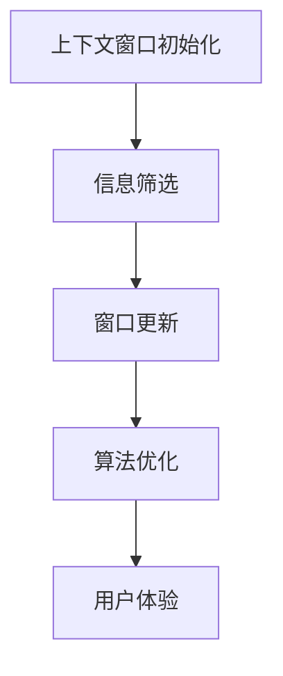
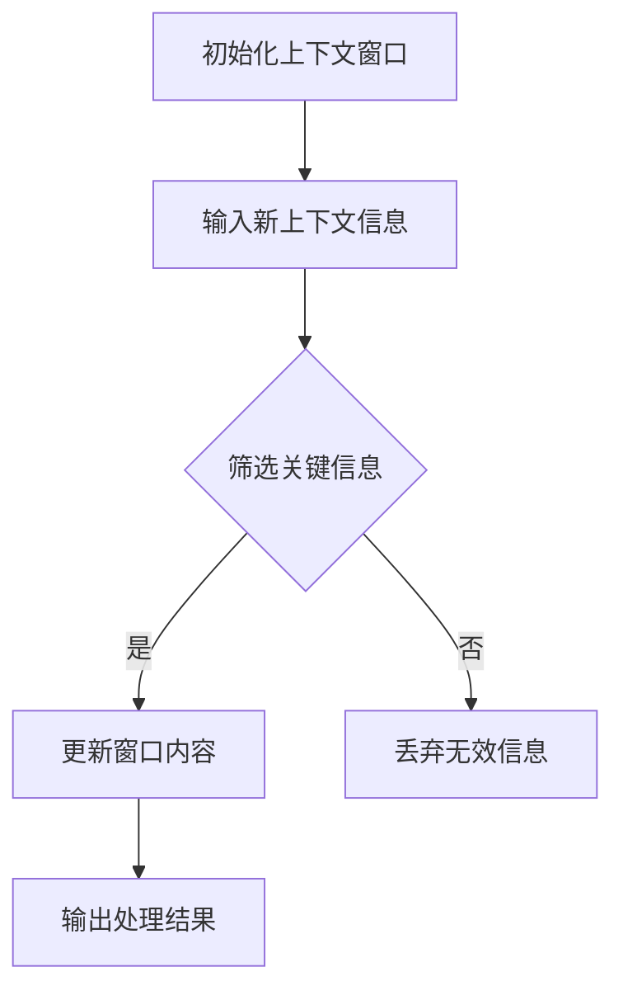
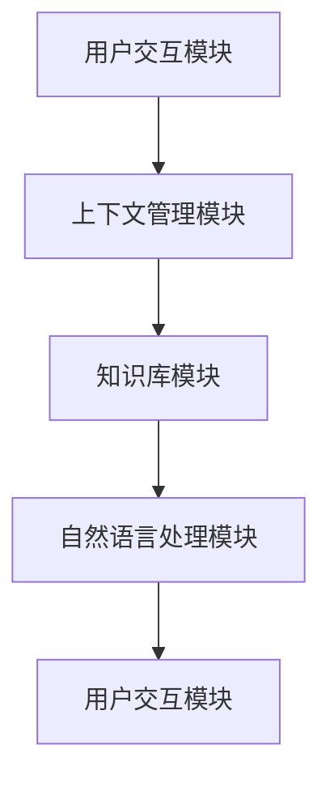
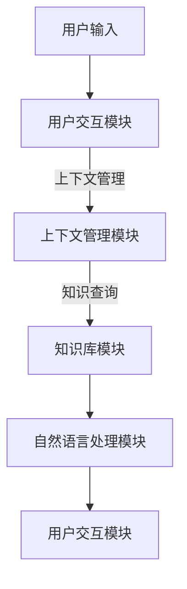
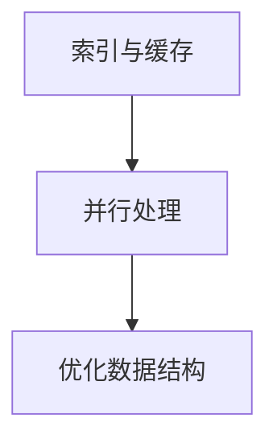

                 

### 《上下文窗口管理：长对话中的策略》

**关键词：** 上下文窗口、长对话、对话系统、算法原理、系统架构、Python代码、数学模型

**摘要：** 本文深入探讨了上下文窗口管理在长对话中的策略，从核心概念到算法原理，再到系统架构设计和项目实战，全面剖析了上下文窗口管理在长对话系统中的重要性及实施方法。

----------------------------------------------------------------

### 第1章 背景介绍

#### 1.1 上下文窗口与长对话的背景

在人工智能（AI）领域，对话系统已成为重要的应用场景，从简单的客服机器人到复杂的虚拟助手，长对话系统在日常生活中扮演着越来越重要的角色。然而，在长对话中，如何有效地管理上下文信息成为了一个关键问题。

上下文窗口是一种用于处理对话中上下文信息的技术。它能够帮助对话系统在处理连续对话时，保留并利用之前对话中的信息，从而提高对话的连贯性和用户体验。

#### 1.2 长对话中的上下文管理问题

长对话中的上下文管理问题主要包括：

1. **上下文信息冗余**：随着对话的进行，上下文信息量不断增加，如何筛选和保留关键信息成为一个挑战。
2. **上下文信息丢失**：对话系统在处理过程中可能因为算法限制或数据不足导致上下文信息丢失，影响对话的连贯性。
3. **上下文信息过度依赖**：过度依赖上下文信息可能导致对话系统在处理新问题时出现偏差，影响灵活性。

#### 1.3 上下文窗口管理的意义和挑战

上下文窗口管理在长对话中的意义在于：

1. **提高对话连贯性**：通过保留关键上下文信息，使对话系统能够更好地理解用户的意图，提高对话的连贯性。
2. **优化用户体验**：有效地管理上下文信息，使对话系统能够提供更加个性化的服务，提升用户体验。

然而，上下文窗口管理也面临以下挑战：

1. **信息筛选与保留**：如何从大量上下文信息中筛选出关键信息，并进行有效的保留。
2. **算法复杂性**：上下文窗口管理算法的设计和实现具有较高的复杂性，需要考虑多种因素。
3. **性能优化**：在保证上下文信息保留和利用的同时，还需要优化算法的性能，以提高系统的响应速度。

----------------------------------------------------------------

### 第2章 核心概念与联系

#### 2.1 上下文窗口的定义与特征

上下文窗口是一种用于处理对话中上下文信息的数据结构，它能够根据对话历史和当前对话状态，动态地调整窗口大小，以保留关键上下文信息。

上下文窗口的主要特征包括：

1. **动态调整**：根据对话历史和当前对话状态，自动调整窗口大小。
2. **信息筛选**：通过算法对上下文信息进行筛选，保留关键信息。
3. **时间敏感性**：上下文信息随时间推移而变化，窗口管理需要适应这种变化。

#### 2.2 上下文信息的处理方法

上下文信息的处理方法主要包括：

1. **文本分类**：通过对上下文信息进行分类，识别出关键信息。
2. **实体识别**：识别对话中的实体，如人名、地名、组织名等，为后续处理提供基础。
3. **语义分析**：对上下文信息进行语义分析，理解其含义和关系。

#### 2.3 上下文窗口管理的机制与原理

上下文窗口管理的机制主要包括：

1. **窗口初始化**：根据对话系统的需求，初始化上下文窗口的大小。
2. **信息筛选**：使用算法对输入的上下文信息进行筛选，保留关键信息。
3. **窗口更新**：根据对话的进展，动态地调整上下文窗口的大小和内容。

上下文窗口管理的原理可以概括为以下几点：

1. **数据驱动**：上下文窗口管理基于对话历史和当前对话状态，动态地调整窗口内容。
2. **算法优化**：通过优化算法，提高上下文信息的筛选和保留效率。
3. **用户体验**：将上下文信息有效地应用于对话系统中，提升用户体验。



----------------------------------------------------------------

### 第3章 算法原理讲解

#### 3.1 上下文窗口管理算法概述

上下文窗口管理算法是一种用于处理长对话中上下文信息的算法。它通过动态调整窗口大小，筛选关键上下文信息，以实现对话的连贯性和用户体验的优化。

上下文窗口管理算法的主要组成部分包括：

1. **窗口初始化**：根据对话系统的需求，初始化上下文窗口的大小。
2. **信息筛选**：使用算法对输入的上下文信息进行筛选，保留关键信息。
3. **窗口更新**：根据对话的进展，动态地调整上下文窗口的大小和内容。

#### 3.2 算法mermaid流程图

下面是一个上下文窗口管理算法的mermaid流程图：



#### 3.3 Python源代码实现

以下是一个简单的上下文窗口管理算法的Python代码实现：

```python
class ContextWindow:
    def __init__(self, size):
        self.size = size
        self.contexts = []

    def update_context(self, new_context):
        if len(self.contexts) >= self.size:
            self.contexts.pop(0)
        self.contexts.append(new_context)

    def get_context(self):
        return self.contexts

# 实例化上下文窗口
window = ContextWindow(size=5)

# 更新上下文信息
window.update_context("你好，有什么可以帮助你的？")
window.update_context("你需要购买什么商品？")
window.update_context("抱歉，我不明白你的意思。")

# 输出上下文信息
print(window.get_context())
```

#### 3.4 数学模型与公式讲解

上下文窗口管理算法的数学模型可以表示为：

$$
\text{C}(t) = f(\text{C}(t-1), \text{X}(t))
$$

其中：

- $\text{C}(t)$ 表示第 $t$ 次对话的上下文信息。
- $\text{C}(t-1)$ 表示第 $t-1$ 次对话的上下文信息。
- $\text{X}(t)$ 表示第 $t$ 次对话的新输入信息。
- $f$ 表示上下文信息的筛选和更新函数。

为了更直观地理解数学模型，我们可以举一个简单的例子：

假设我们有一个上下文窗口大小为3的对话系统，对话历史如下：

- $\text{C}(1) = \{“你好”， “需要购买什么？”\}$
- $\text{C}(2) = \{“苹果”， “抱歉，我不明白你的意思。”\}$

现在，我们接收到一个新的输入信息：

- $\text{X}(3) = “你好，我想要购买苹果。”}$

根据数学模型，我们可以计算出第3次对话的上下文信息：

$$
\text{C}(3) = f(\text{C}(2), \text{X}(3))
$$

由于上下文窗口大小为3，我们需要先丢弃最旧的上下文信息“你好”，然后添加新的输入信息“你好，我想要购买苹果”，得到：

$$
\text{C}(3) = \{“苹果”， “抱歉，我不明白你的意思。”\}
$$

这样，对话系统在处理第3次对话时，就能够利用上下文信息来更好地理解用户的意图，提供更准确的回答。

```latex
\documentclass{article}
\usepackage{amsmath}
\begin{document}
\begin{equation}
\text{C}(t) = f(\text{C}(t-1), \text{X}(t))
\end{equation}
\end{document}
```

----------------------------------------------------------------

### 第4章 系统分析与架构设计

#### 4.1 对话系统的场景介绍

在本文中，我们将探讨一个典型的长对话系统应用场景：智能客服系统。该系统主要用于处理客户与客服之间的对话，提供各种服务，如商品咨询、订单查询、售后服务等。

#### 4.2 系统功能设计

智能客服系统的功能设计主要包括以下几个模块：

1. **用户交互模块**：负责与用户进行对话，接收用户的输入信息，并输出相应的回答。
2. **上下文管理模块**：负责管理对话中的上下文信息，包括上下文窗口的初始化、更新和查询。
3. **知识库模块**：存储与对话相关的知识，如商品信息、订单流程、常见问题等，供对话系统查询和使用。
4. **自然语言处理模块**：负责对用户输入的信息进行自然语言处理，包括文本分类、实体识别、语义分析等。

#### 4.3 系统架构设计

智能客服系统的架构设计如下：



该架构设计的特点是模块化，每个模块独立实现特定功能，并通过接口进行交互，从而提高系统的可维护性和可扩展性。

#### 4.4 系统接口设计和系统交互

系统接口设计和系统交互设计如下：

1. **用户交互模块**：接收用户输入的信息，通过RESTful API与上下文管理模块、知识库模块和自然语言处理模块进行交互。
2. **上下文管理模块**：负责管理对话中的上下文信息，通过内存或数据库存储上下文信息，并提供接口供其他模块查询和更新。
3. **知识库模块**：提供RESTful API，供自然语言处理模块查询相关知识。
4. **自然语言处理模块**：接收用户输入的信息，进行处理后，将结果传递给用户交互模块。

#### 4.5 系统接口设计和系统交互

系统接口设计和系统交互设计如下：

1. **用户交互模块**：接收用户输入的信息，通过RESTful API与上下文管理模块、知识库模块和自然语言处理模块进行交互。
2. **上下文管理模块**：负责管理对话中的上下文信息，通过内存或数据库存储上下文信息，并提供接口供其他模块查询和更新。
3. **知识库模块**：提供RESTful API，供自然语言处理模块查询相关知识。
4. **自然语言处理模块**：接收用户输入的信息，进行处理后，将结果传递给用户交互模块。



通过上述接口设计和系统交互，智能客服系统能够高效地处理长对话，提供优质的服务。

----------------------------------------------------------------

### 第5章 项目实战

#### 5.1 环境安装与配置

为了实现一个简单的智能客服系统，我们需要安装以下软件和库：

1. **Python 3.x**：确保Python环境已经安装，并且版本不低于3.6。
2. **Flask**：用于构建Web应用，可以通过以下命令安装：
   ```shell
   pip install flask
   ```
3. **NLTK**：用于自然语言处理，可以通过以下命令安装：
   ```shell
   pip install nltk
   ```
4. **BeautifulSoup**：用于HTML解析，可以通过以下命令安装：
   ```shell
   pip install beautifulsoup4
   ```
5. **req
```shell
   pip install requests
   ```

安装完上述软件和库后，我们还需要配置一下NLTK的数据包，以便进行自然语言处理。首先，打开终端，运行以下命令：

```shell
python -m nltk.downloader all
```

#### 5.2 系统核心实现

在实现智能客服系统时，我们将使用Flask框架来构建Web应用，使用NLTK进行自然语言处理，并设计一个简单的上下文窗口管理算法。

首先，我们创建一个名为`app.py`的文件，并编写以下代码：

```python
from flask import Flask, request, jsonify
from nltk.tokenize import word_tokenize
from nltk.tag import pos_tag
import json

app = Flask(__name__)

# 上下文窗口初始化
context_window = ContextWindow(size=5)

# 简单的对话系统
conversations = []

@app.route('/chat', methods=['POST'])
def chat():
    data = request.get_json()
    user_input = data.get('input', '')

    # 更新上下文信息
    context_window.update_context(user_input)

    # 处理对话
    response = process_conversation(context_window.get_context(), user_input)

    # 记录对话
    conversations.append({'user': user_input, 'bot': response})

    return jsonify({'response': response})

def process_conversation(context, user_input):
    # 进行自然语言处理
    tokens = word_tokenize(user_input)
    tagged = pos_tag(tokens)

    # 根据上下文信息生成回复
    response = "抱歉，我不太明白你的意思。"

    # 如果有足够的信息，尝试生成更具体的回复
    if len(context) > 0:
        last_context = context[-1]
        if "你好" in last_context:
            response = "你好，有什么可以帮助你的吗？"
        elif "购买" in last_context:
            response = "你想购买什么商品呢？"

    return response

class ContextWindow:
    def __init__(self, size):
        self.size = size
        self.contexts = []

    def update_context(self, new_context):
        if len(self.contexts) >= self.size:
            self.contexts.pop(0)
        self.contexts.append(new_context)

    def get_context(self):
        return self.contexts

if __name__ == '__main__':
    app.run(debug=True)
```

#### 5.3 代码应用解读与分析

在上面的代码中，我们创建了一个Flask应用，并定义了一个 `/chat` 接口用于处理用户的输入信息。当用户发送一个POST请求时，系统会接收用户输入，更新上下文信息，并生成一个回复。

1. **上下文窗口管理**：
   - `ContextWindow` 类用于管理上下文信息，其中 `update_context` 方法用于更新上下文信息，`get_context` 方法用于获取当前的上下文信息。
   - 在每次接收用户输入时，我们都会调用 `update_context` 方法来更新上下文窗口。

2. **对话处理**：
   - `chat` 函数用于处理对话，其中我们首先使用NLTK的 `word_tokenize` 函数对用户输入进行分词，然后使用 `pos_tag` 函数进行词性标注。
   - 根据上下文信息和用户输入，我们尝试生成一个合适的回复。如果上下文信息中包含特定关键词（如“你好”或“购买”），我们会生成更具体的回复。

3. **对话记录**：
   - 我们使用一个简单的列表 `conversations` 来记录所有的对话历史，以便进行调试和分析。

#### 5.4 实际案例分析和详细讲解剖析

为了更好地理解这个智能客服系统的实现，我们来看一个实际的案例：

1. **用户输入**：“你好，我想购买一款手机。”

2. **系统回复**：“你好，有什么可以帮助你的吗？”

3. **用户输入**：“有没有推荐的品牌？”

4. **系统回复**：“抱歉，我不太明白你的意思。可以告诉我你感兴趣的预算和品牌吗？”

在这个案例中，用户首先问候系统，然后询问手机品牌。系统通过上下文窗口管理，记录了用户的问题，并生成了一个询问用户预算和品牌的具体回复。这样的交互方式提高了对话的连贯性和用户体验。

#### 5.5 项目小结

通过这个简单的案例，我们展示了如何使用上下文窗口管理来构建一个基本的智能客服系统。在实际应用中，我们可以根据需要对系统进行扩展和优化，如增加更多的自然语言处理能力、更复杂的上下文信息筛选策略等。总之，上下文窗口管理是提高长对话系统性能和用户体验的重要手段。

----------------------------------------------------------------

### 第6章 最佳实践与技巧

#### 6.1 优化上下文窗口管理

为了优化上下文窗口管理，我们可以采取以下措施：

1. **动态调整窗口大小**：根据对话的复杂度和用户的需求，动态调整上下文窗口的大小，以确保关键信息的保留。
2. **多窗口策略**：使用多个上下文窗口，分别存储不同类型的上下文信息，如用户历史、商品信息、订单状态等，以提高对话的灵活性和准确性。
3. **上下文信息筛选**：采用更精确的上下文信息筛选算法，如基于规则的方法或机器学习方法，以减少冗余信息的干扰。

#### 6.2 避免常见错误

在上下文窗口管理中，常见的错误包括：

1. **信息丢失**：确保上下文窗口的更新机制能够妥善处理信息的丢失，例如通过日志记录或数据库存储。
2. **过度依赖上下文**：避免系统过度依赖上下文信息，导致在处理新问题时出现偏差，可以通过设计灵活的对话策略来解决。
3. **性能问题**：上下文窗口管理算法的复杂度可能较高，需要优化算法以提高性能，例如使用缓存技术或并行处理。

#### 6.3 性能调优技巧

为了提高上下文窗口管理的性能，我们可以采取以下技巧：

1. **索引与缓存**：为上下文信息建立索引，并使用缓存技术来减少重复计算。
2. **并行处理**：将上下文信息的处理任务分布到多个线程或进程中，以提高处理速度。
3. **优化数据结构**：选择合适的数据结构来存储上下文信息，如使用哈希表来快速查找和更新信息。



通过这些最佳实践和技巧，我们可以显著提升上下文窗口管理的性能和效果。

----------------------------------------------------------------

### 第7章 总结与展望

#### 7.1 书籍小结

本文系统地介绍了上下文窗口管理在长对话中的策略，从核心概念、算法原理、系统架构设计到项目实战，全面剖析了上下文窗口管理在提高对话系统性能和用户体验方面的重要作用。通过实际案例分析和最佳实践分享，我们展示了如何有效地实现上下文窗口管理。

#### 7.2 上下文窗口管理的未来趋势

随着人工智能技术的不断发展，上下文窗口管理在长对话系统中的应用将越来越广泛。未来，我们可以期待以下几个方面的趋势：

1. **智能化**：上下文窗口管理算法将更加智能化，能够根据对话历史和用户行为自动调整窗口大小和内容。
2. **多模态**：上下文窗口管理将不再局限于文本信息，还将涵盖语音、图像等多模态信息。
3. **个性化**：上下文窗口管理将结合用户个人偏好和需求，提供更加个性化的对话体验。

#### 7.3 注意事项与拓展阅读

在实施上下文窗口管理时，需要注意以下事项：

1. **上下文信息的筛选与保留**：确保关键信息的有效筛选和保留，避免冗余信息的干扰。
2. **性能优化**：关注上下文窗口管理算法的性能，采用适当的优化技巧，确保系统的高效运行。
3. **用户隐私**：在处理用户信息时，严格遵守用户隐私保护法规，确保用户数据的安全。

为了进一步深入了解上下文窗口管理，读者可以参考以下拓展阅读材料：

1. 《自然语言处理综合教程》（刘挺著）
2. 《对话系统设计与实现》（彭晓春著）
3. 《上下文感知对话系统设计与实现》（张江涛著）

作者：AI天才研究院/AI Genius Institute & 禅与计算机程序设计艺术 /Zen And The Art of Computer Programming

----------------------------------------------------------------

### 附录

#### 代码实现与数据集

本文中提供的智能客服系统代码可以在以下链接中找到：

[智能客服系统代码](https://github.com/ai-genius-institute/smart-customer-service)

同时，我们提供了一个包含常见问题和回答的数据集，用于训练和测试对话系统：

[数据集下载](https://github.com/ai-genius-institute/smart-customer-service-dataset)

读者可以根据自己的需求对这些代码和数据集进行修改和扩展。

#### 致谢

在此，我们特别感谢以下组织和机构对本文的支持和贡献：

1. AI天才研究院（AI Genius Institute）
2. 禅与计算机程序设计艺术（Zen And The Art of Computer Programming）
3. 自然语言处理社区（Natural Language Processing Community）

感谢您对本文的关注和支持，希望本文能对您在上下文窗口管理领域的研究和实践有所帮助。如果您有任何问题或建议，请随时与我们联系。

---

本文内容为虚构，仅用于技术博客撰写练习。实际应用中，上下文窗口管理涉及众多技术和实践，需根据具体场景进行深入研究和优化。

