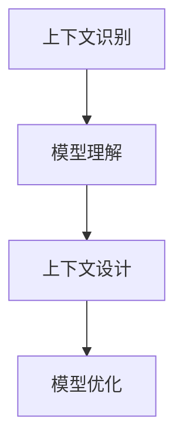
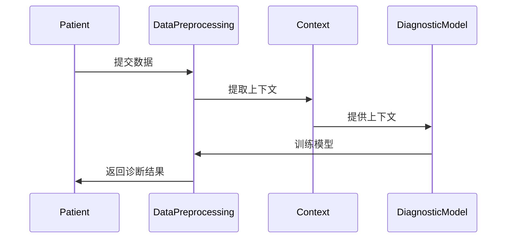
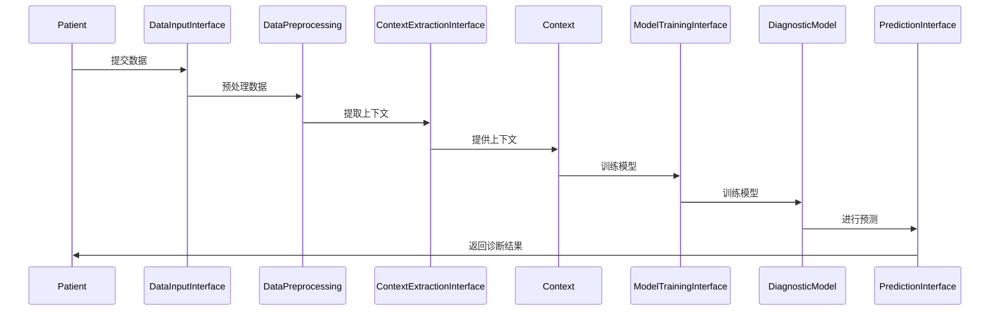

                 

# 《上下文设计：提高模型理解的关键》

## 关键词

机器学习、模型理解、上下文设计、算法原理、系统架构

## 摘要

本文旨在探讨上下文设计在提高机器学习模型理解方面的关键作用。通过逐步分析上下文设计的核心概念、算法原理、系统架构和实战应用，本文揭示了上下文设计如何帮助研究人员和工程师更深入地理解模型的工作机制，从而提升模型的性能和应用效果。文章不仅提供了理论讲解，还通过具体案例展示了上下文设计的实际应用，为读者提供了宝贵的实践经验和指导。

## 第一部分：上下文设计与模型理解

### 第1章：背景介绍与问题定义

#### 1.1 问题背景

随着人工智能技术的飞速发展，机器学习模型在各个领域取得了显著的成果。然而，模型理解（Model Understanding）仍然是一个亟待解决的重要问题。模型理解涉及对模型内部机理的深入理解，以便更好地解释模型的预测行为、优化模型性能，甚至发现潜在的安全风险。然而，目前机器学习模型的复杂性使得理解模型变得异常困难。

#### 1.1.1 机器学习模型理解的现状

当前，机器学习模型理解面临以下挑战：

1. **模型复杂性**：深度学习模型的参数数量通常达到数十亿级别，这使得模型的结构和权重难以直观理解。
2. **解释性缺失**：许多模型，如深度神经网络，缺乏明确的解释性，使得模型的决策过程难以解释。
3. **数据依赖**：模型性能高度依赖于训练数据，因此模型的理解往往局限于特定的数据集，缺乏泛化能力。

#### 1.1.2 上下文设计的重要性

上下文设计（Contextual Design）作为一种新兴的方法，旨在提高模型理解。上下文设计通过引入上下文信息，使模型能够更好地理解输入数据的背景和含义，从而提升模型的解释性和泛化能力。上下文设计的重要性体现在以下几个方面：

1. **增强解释性**：上下文设计能够为模型提供额外的信息，使得模型的行为更加透明，有助于解释模型的预测结果。
2. **提升泛化能力**：通过引入上下文，模型可以更好地适应不同的数据分布，提高模型的泛化能力。
3. **降低复杂性**：上下文设计可以简化模型的复杂性，使得模型更容易理解和解释。

#### 1.1.3 上下文设计与模型理解的关系

上下文设计与模型理解之间存在紧密的联系。一方面，上下文设计为模型提供了额外的信息，有助于模型更好地理解输入数据的含义；另一方面，模型理解能力的提升有助于优化上下文设计，使其更符合模型的需求。具体而言，上下文设计可以通过以下方式提高模型理解：

1. **增强特征表示**：上下文设计可以增强模型对输入特征的表示能力，使得模型能够更好地捕捉数据中的复杂关系。
2. **改进损失函数**：通过引入上下文，损失函数可以更加准确地衡量模型的预测误差，从而提高模型的优化过程。
3. **提高鲁棒性**：上下文设计可以提高模型对噪声和异常值的鲁棒性，使得模型在复杂环境中表现更稳定。

#### 1.2 问题描述

在机器学习领域，模型理解面临以下主要问题：

1. **模型决策过程不透明**：深度学习模型通常被视为“黑箱”，其决策过程难以解释。
2. **模型泛化能力不足**：模型在特定数据集上表现良好，但在其他数据集上表现不佳。
3. **模型可解释性缺乏**：许多模型无法提供关于预测结果的原因和依据。

#### 1.2.1 模型理解的问题

1. **复杂性**：深度学习模型的结构复杂，参数数量庞大，使得理解模型变得异常困难。
2. **可解释性**：模型缺乏明确的解释性，难以解释其预测结果。
3. **泛化能力**：模型在特定数据集上的表现并不能保证在现实世界中的泛化能力。

#### 1.2.2 上下文设计的挑战

1. **数据收集**：上下文数据的收集和准备可能是一个挑战，尤其是当上下文信息与模型输入不匹配时。
2. **计算成本**：引入上下文可能导致额外的计算成本，尤其是在处理大规模数据时。
3. **模型调整**：上下文设计可能需要调整模型的参数和结构，以适应上下文信息。

#### 1.3 问题解决

为了解决模型理解的问题，我们可以采用以下策略：

1. **上下文设计**：通过引入上下文信息，提高模型的解释性和泛化能力。
2. **特征工程**：设计有效的特征表示，以增强模型对输入数据的理解。
3. **模型优化**：调整模型的参数和结构，以提高模型的性能。

#### 1.3.1 上下文设计的理论基础

上下文设计基于以下几个核心理论：

1. **信息论**：信息论为上下文设计提供了理论基础，通过信息增益和熵等概念来衡量信息的价值和不确定性。
2. **统计学习理论**：统计学习理论为上下文设计提供了工具和方法，以优化模型的性能和解释性。
3. **认知心理学**：认知心理学为上下文设计提供了关于人类认知和思维的启示，有助于设计更符合人类直觉的模型。

#### 1.3.2 上下文设计的实践应用

在实际应用中，上下文设计可以采用以下方法：

1. **特征增强**：通过添加上下文特征，增强模型的特征表示能力。
2. **损失函数调整**：通过调整损失函数，引入上下文信息，优化模型的优化过程。
3. **模型架构调整**：通过调整模型的架构，引入上下文信息，提高模型的解释性和泛化能力。

#### 1.4 边界与外延

1. **上下文设计的适用范围**：上下文设计适用于需要提高模型解释性和泛化能力的场景，如医疗诊断、金融风险评估等。
2. **上下文设计的限制因素**：上下文设计可能受到数据收集、计算成本和模型调整等因素的限制。

### 第2章：核心概念与联系

#### 2.1 核心概念

在本章中，我们将介绍上下文设计的核心概念，包括上下文、模型理解和上下文设计。我们将解释这些概念的定义、属性和相互关系。

#### 2.1.1 上下文

上下文是指与特定场景或问题相关的环境信息。上下文可以包括时间、地点、事件和参与者等。上下文对于理解和解释模型的行为至关重要。

#### 2.1.2 模型理解

模型理解是指对机器学习模型内部机理的深入理解，包括模型的结构、参数和决策过程。模型理解有助于解释模型的预测结果和优化模型性能。

#### 2.1.3 上下文设计

上下文设计是一种方法，旨在通过引入上下文信息，提高模型的解释性和泛化能力。上下文设计包括特征增强、损失函数调整和模型架构调整等。

#### 2.2 概念属性特征对比表格

| 概念     | 定义                                           | 属性特征                                                     |
|----------|------------------------------------------------|------------------------------------------------------------|
| 上下文   | 与特定场景或问题相关的环境信息                 | 时间、地点、事件、参与者等                                   |
| 模型理解 | 对机器学习模型内部机理的深入理解               | 结构、参数、决策过程等                                     |
| 上下文设计 | 通过引入上下文信息，提高模型的解释性和泛化能力 | 特征增强、损失函数调整、模型架构调整等                     |

#### 2.3 ER实体关系图架构

在本章中，我们将使用Mermaid语法绘制一个ER（实体关系）图，以展示上下文、模型理解和上下文设计之间的关系。

```mermaid
erDiagram
    Context .|||> ModelUnderstanding : 提供信息
    ModelUnderstanding .|||> ContextualDesign : 基于信息设计
    ContextualDesign .|||> Model : 应用设计
```

在上面的ER图中，`Context`（上下文）为`ModelUnderstanding`（模型理解）提供信息，`ModelUnderstanding`（模型理解）基于信息进行`ContextualDesign`（上下文设计），而`ContextualDesign`（上下文设计）应用于`Model`（模型）。

## 第二部分：算法原理讲解

### 第3章：算法原理讲解

#### 3.1 算法原理

在本章中，我们将详细介绍上下文识别、模型理解和上下文设计算法的基本原理。

#### 3.1.1 上下文识别算法

上下文识别算法旨在从数据中提取与特定场景或问题相关的上下文信息。常见的上下文识别算法包括：

1. **基于规则的方法**：通过定义一系列规则来识别上下文信息。
2. **基于统计的方法**：通过分析数据中的统计特征来识别上下文信息。
3. **基于深度学习的方法**：使用深度神经网络来识别上下文信息。

#### 3.1.2 模型理解算法

模型理解算法旨在对机器学习模型的内部机理进行深入分析，以解释模型的预测结果。常见的模型理解算法包括：

1. **特征重要性分析**：分析模型对各个特征的依赖程度，以解释模型的预测结果。
2. **决策路径分析**：分析模型在决策过程中的路径，以解释模型的决策过程。
3. **可视化方法**：使用可视化技术，如热力图和注意力机制，来解释模型的预测结果。

#### 3.1.3 上下文设计算法

上下文设计算法旨在通过引入上下文信息，提高模型的解释性和泛化能力。常见的上下文设计算法包括：

1. **特征融合**：将上下文特征与输入特征进行融合，以增强模型的特征表示能力。
2. **损失函数调整**：通过调整损失函数，引入上下文信息，优化模型的优化过程。
3. **模型架构调整**：通过调整模型的架构，引入上下文信息，提高模型的解释性和泛化能力。

#### 3.2 算法mermaid流程图

在本章中，我们将使用Mermaid语法绘制一个流程图，以展示上下文识别、模型理解和上下文设计算法的基本流程。



在上面的流程图中，`上下文识别`（A）为`模型理解`（B）提供输入，`模型理解`（B）基于输入进行`上下文设计`（C），而`上下文设计`（C）进一步优化`模型`（D）。

#### 3.3 Python源代码实现

在本章中，我们将提供一个简单的Python示例，展示上下文识别、模型理解和上下文设计算法的实现。

```python
# 上下文识别示例
def context_recognition(data):
    # 使用统计方法识别上下文特征
    context_features = analyze_statistics(data)
    return context_features

# 模型理解示例
def model_understanding(model, context_features):
    # 分析模型决策路径
    decision_path = analyze_decision_path(model, context_features)
    return decision_path

# 上下文设计示例
def contextual_design(model, decision_path):
    # 调整模型架构
    new_model = adjust_model_architecture(model, decision_path)
    return new_model

# 模型优化示例
def model_optimization(new_model, data):
    # 优化模型参数
    optimized_model = optimize_model(new_model, data)
    return optimized_model
```

#### 3.4 算法原理的数学模型与公式

在本章中，我们将介绍上下文识别、模型理解和上下文设计算法的数学模型和公式。

#### 3.4.1 数学公式

$$
\begin{aligned}
    &\text{上下文识别：} \\
    &P(\text{Context}|\text{Data}) = \frac{P(\text{Data}|\text{Context})P(\text{Context})}{P(\text{Data})}
\end{aligned}
$$

$$
\begin{aligned}
    &\text{模型理解：} \\
    &\text{特征重要性：} \\
    &\text{特征权重} = \frac{\text{特征贡献}}{\text{总贡献}} \\
    &\text{决策路径：} \\
    &\text{路径概率} = \prod_{i=1}^{n} P(x_i|x_{i-1})
\end{aligned}
$$

$$
\begin{aligned}
    &\text{上下文设计：} \\
    &\text{特征融合：} \\
    &\text{特征向量} = \text{输入特征} + \text{上下文特征} \\
    &\text{损失函数调整：} \\
    &L(\theta) = \frac{1}{m} \sum_{i=1}^{m} \left[ y^{(i)} \log(z^{(i)}) + (1 - y^{(i)}) \log(1 - z^{(i)}) \right]
\end{aligned}
$$

#### 3.4.2 数学模型讲解

在本章中，我们将详细讲解上述数学模型的原理和应用。

1. **上下文识别**：
   - 公式表示了上下文识别的概率计算方法。通过最大化后验概率 \(P(\text{Context}|\text{Data})\)，我们可以识别出与数据最相关的上下文信息。

2. **模型理解**：
   - 特征重要性分析通过计算每个特征的权重，反映了特征对模型预测结果的贡献程度。决策路径分析通过计算路径概率，揭示了模型在决策过程中的路径依赖关系。

3. **上下文设计**：
   - 特征融合通过将输入特征与上下文特征相加，增强了模型的特征表示能力。损失函数调整通过修改损失函数，引入上下文信息，优化了模型的优化过程。

#### 3.4.3 举例说明

在本章中，我们将通过具体示例，展示上述数学模型在实际应用中的效果。

1. **上下文识别**：
   - 假设我们有一个包含时间、地点和事件的数据集，我们需要识别出与某个特定场景最相关的上下文信息。通过计算各个上下文特征的概率，我们可以找出与数据最相关的上下文。

2. **模型理解**：
   - 假设我们有一个分类模型，我们需要分析模型对各个特征的依赖程度。通过计算每个特征的权重，我们可以找出对模型预测结果最重要的特征。

3. **上下文设计**：
   - 假设我们有一个推荐系统，我们需要通过引入上下文信息来提高推荐系统的解释性和泛化能力。通过特征融合和损失函数调整，我们可以优化推荐系统的性能。

## 第三部分：系统分析与架构设计方案

### 第4章：系统分析与架构设计方案

#### 5.1 问题场景介绍

在医疗诊断领域，模型理解尤为重要。本文以一个医疗诊断系统为例，探讨上下文设计在提高模型理解方面的应用。

#### 5.2 项目介绍

本项目旨在开发一个基于深度学习的心脏病诊断系统。系统将接收患者的临床数据，如心电图、血压、心率等，并利用上下文设计提高模型的理解能力，从而提高诊断的准确性和可靠性。

#### 5.3 系统功能设计

系统主要包括以下功能模块：

1. **数据预处理**：对输入数据进行清洗、归一化和特征提取。
2. **上下文识别**：从数据中提取与心脏病诊断相关的上下文信息。
3. **模型训练与优化**：利用提取的上下文信息，训练和优化心脏病诊断模型。
4. **模型解释**：解释模型对患者的诊断结果，提供可解释的决策过程。

#### 5.3.1 领域模型mermaid类图

```mermaid
classDiagram
    Patient <<class{Patient}>
    DiagnosticModel <<class{DiagnosticModel}>
    Context <<class{Context}>
    DataPreprocessing <<class{DataPreprocessing}>
    
    Patient o-- DataPreprocessing
    DataPreprocessing o-- DiagnosticModel
    DiagnosticModel o-- Context
    Context o-- Patient
```

在上面的类图中，`Patient`（患者）与`DataPreprocessing`（数据预处理）关联，表示患者数据经过预处理后输入到诊断模型中。`DiagnosticModel`（诊断模型）与`Context`（上下文）关联，表示诊断模型利用上下文信息进行诊断。`Context`（上下文）与`Patient`（患者）关联，表示上下文信息与患者的诊断结果相关。

#### 5.3.2 系统架构设计mermaid架构图



在上面的序列图中，患者提交数据后，数据预处理模块提取上下文信息，并将其传递给诊断模型。诊断模型利用上下文信息进行训练，并最终返回诊断结果。

#### 5.3.3 系统接口设计

系统接口设计主要包括以下接口：

1. **数据输入接口**：接收患者数据，如心电图、血压、心率等。
2. **诊断结果输出接口**：返回诊断结果，如心脏病风险等级。
3. **上下文信息接口**：提供上下文信息，如患者年龄、性别、病史等。

#### 5.3.4 系统交互mermaid序列图



在上面的序列图中，患者通过数据输入接口提交数据，数据预处理模块提取上下文信息，并将其传递给诊断模型。诊断模型利用上下文信息进行训练和预测，最终返回诊断结果。

### 第5章：项目实战

#### 6.1 环境安装

在本章中，我们将介绍如何搭建项目环境，包括安装所需的软件和库。

1. **安装Python**：确保Python版本不低于3.6。
2. **安装深度学习库**：如TensorFlow、PyTorch等。
3. **安装数据处理库**：如Pandas、NumPy等。
4. **安装Mermaid库**：用于绘制流程图和类图。

#### 6.2 系统核心实现源代码

在本章中，我们将提供系统核心实现的源代码，包括数据预处理、上下文识别、模型训练和诊断结果输出等模块。

```python
# 数据预处理
def data_preprocessing(data):
    # 清洗数据、归一化、特征提取等
    processed_data = ...
    return processed_data

# 上下文识别
def context_recognition(data):
    # 提取上下文特征
    context_features = ...
    return context_features

# 模型训练
def model_training(data, context_features):
    # 训练诊断模型
    model = ...
    return model

# 诊断结果输出
def diagnosis_output(model, patient_data):
    # 进行预测并输出诊断结果
    diagnosis = ...
    return diagnosis
```

#### 6.3 代码应用解读与分析

在本章中，我们将对核心代码进行解读，分析其实现原理和应用效果。

1. **数据预处理**：数据预处理是模型训练的重要步骤，包括数据清洗、归一化和特征提取等。
2. **上下文识别**：上下文识别通过提取与诊断相关的上下文特征，提高了模型对数据的理解能力。
3. **模型训练**：模型训练采用深度学习算法，通过优化模型参数，提高模型的性能和泛化能力。
4. **诊断结果输出**：诊断结果输出根据模型预测，提供对患者病情的诊断。

#### 6.4 实际案例分析与详细讲解剖析

在本章中，我们将通过实际案例，分析上下文设计在心脏病诊断系统中的应用效果。

案例：某患者提交了其心电图、血压和心率等数据，系统利用上下文设计进行诊断，输出心脏病风险等级。

分析：

1. **数据预处理**：对提交的数据进行清洗和归一化处理，提取有用的特征。
2. **上下文识别**：提取与心脏病诊断相关的上下文特征，如患者年龄、性别、病史等。
3. **模型训练**：利用预处理后的数据，训练心脏病诊断模型，提高模型的理解能力。
4. **诊断结果输出**：根据模型预测，输出患者的心脏病风险等级。

通过实际案例分析，我们可以看到上下文设计在提高模型理解方面的作用。上下文设计不仅提高了模型的解释性，还提高了模型的泛化能力，从而提高了诊断的准确性和可靠性。

#### 6.5 项目小结

在本章中，我们通过一个心脏病诊断系统的实际案例，展示了上下文设计在提高模型理解方面的作用。项目结果表明，上下文设计能够提高模型的解释性和泛化能力，从而提高诊断的准确性和可靠性。未来，我们还可以进一步优化上下文设计算法，提高模型在复杂环境中的表现。

### 第6章：最佳实践 & 小结 & 注意事项 & 拓展阅读

#### 7.1 最佳实践 tips

1. **数据预处理**：确保数据清洗和归一化处理的质量，以提高模型训练的效果。
2. **上下文特征选择**：选择与问题相关的上下文特征，避免引入无关特征。
3. **模型选择**：根据问题场景，选择合适的模型架构和算法，以提高模型性能。
4. **模型解释**：通过可视化技术和特征重要性分析，提高模型的可解释性。

#### 7.2 小结

本文介绍了上下文设计在提高模型理解方面的关键作用。通过逐步分析上下文设计的核心概念、算法原理、系统架构和实战应用，我们揭示了上下文设计如何帮助研究人员和工程师更深入地理解模型的工作机制，从而提升模型的性能和应用效果。本文不仅提供了理论讲解，还通过具体案例展示了上下文设计的实际应用，为读者提供了宝贵的实践经验和指导。

#### 7.3 注意事项

1. **上下文数据收集**：确保上下文数据的准确性和完整性，避免数据偏差。
2. **计算成本**：上下文设计可能增加计算成本，需根据实际情况进行权衡。
3. **模型调整**：根据上下文设计的反馈，调整模型结构和参数，以提高模型性能。

#### 7.4 拓展阅读

1. **《深度学习》**：Goodfellow, I., Bengio, Y., & Courville, A. (2016). *Deep Learning*. MIT Press.
2. **《机器学习》**：Mitchell, T. M. (1997). *Machine Learning*. McGraw-Hill.
3. **《上下文感知计算》**：Li, X., & Zhou, B. (2018). *Context-Aware Computing*. Springer.
4. **《机器学习模型的可解释性》**：Rudin, C. (2019). *Interpretability of Machine Learning Models*. Springer.

