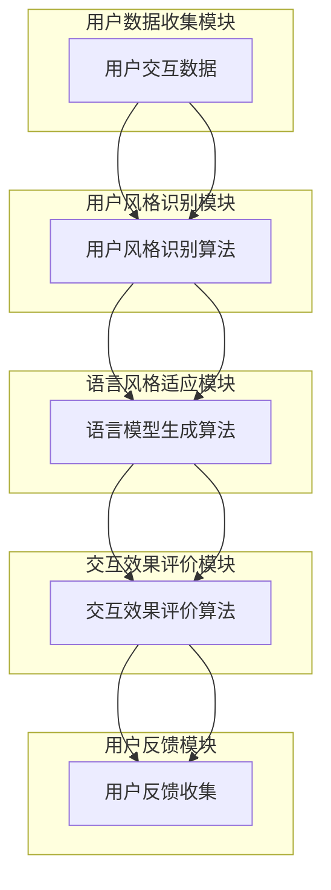
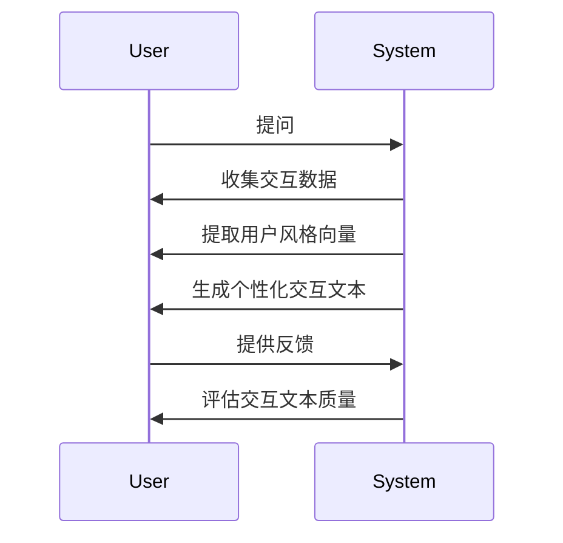

                 

### 引言

在现代人工智能领域，语言模型（LLM）已成为自然语言处理（NLP）的核心组件。LLM通过大规模的文本数据训练，能够生成高质量的自然语言文本，从而在各种应用场景中发挥关键作用。然而，随着用户需求的多样化和个性化趋势，如何评价LLM对用户风格适应的能力成为一个亟待解决的问题。

个性化交互测试的提出正是为了应对这一挑战。通过个性化交互测试，我们可以评估LLM在适应不同用户风格方面的能力，从而确保其在实际应用中能够提供更加贴心和高效的服务。本文旨在深入探讨个性化交互测试的概念、原理、方法以及在实际应用中的效果。

本文结构如下：首先，我们将介绍个性化交互测试的背景和核心概念，包括用户风格模型、语言模型和交互评价方法。接着，我们将详细探讨个性化交互测试的方法，包括用户风格识别、语言风格适应和交互效果评价。随后，通过实际案例研究，我们将展示个性化交互测试的应用效果。然后，我们将介绍个性化交互测试的算法原理，并通过数学模型和公式进行详细解释。此外，我们将对个性化交互测试的系统分析与架构设计进行深入分析，并分享实际项目中的实战经验和最佳实践。最后，我们将对全文进行小结，并对未来个性化交互测试的发展进行展望。

### 文章关键词

- 个性化交互测试
- 语言模型（LLM）
- 用户风格模型
- 交互效果评价
- 适应性
- 自然语言处理（NLP）

### 摘要

本文聚焦于个性化交互测试，旨在评价大型语言模型（LLM）对用户风格适应的能力。通过介绍个性化交互测试的背景和核心概念，包括用户风格模型、语言模型和交互评价方法，本文详细探讨了个性化交互测试的流程和方法。实际案例研究展示了个性化交互测试的应用效果，算法原理通过数学模型和公式进行深入分析。系统分析与架构设计部分提供了详细的系统实现框架。最后，通过实战经验和最佳实践总结，本文为个性化交互测试的未来发展提供了指导。

#### 第1章：问题背景与核心概念

##### 1.1 个性化交互测试的背景

个性化交互测试的兴起源于用户需求的多样化与个性化趋势。在过去，传统的交互系统往往采用统一的接口和交互方式，无法充分满足用户个性化需求。随着互联网的普及和人工智能技术的快速发展，越来越多的系统开始注重用户交互体验，个性化交互测试也因此成为了一个重要的研究方向。

个性化交互测试的发展历程可以追溯到自然语言处理（NLP）和机器学习（ML）技术的成熟。早期的研究主要集中在如何通过数据挖掘和机器学习技术从大量用户交互数据中提取用户特征，从而实现个性化推荐。随着深度学习技术的崛起，大型语言模型（LLM）的出现为个性化交互测试提供了强大的工具。LLM能够通过大规模文本数据的训练，生成高质量的个性化文本，极大地提升了交互系统的用户体验。

个性化交互测试在当前的应用领域十分广泛。例如，在智能客服系统中，个性化交互测试可以帮助系统根据用户的提问风格和偏好，生成更加符合用户需求的回答。在社交媒体平台中，个性化交互测试可以用于推荐用户感兴趣的内容，提高用户粘性。在医疗健康领域，个性化交互测试可以帮助医生根据患者的病历和提问风格，提供个性化的医疗建议。

##### 1.2 核心概念

个性化交互测试涉及多个核心概念，包括个性化交互、语言模型（LLM）和用户风格模型。

**个性化交互**是指交互系统根据用户的特定需求、偏好和行为模式，提供个性化的服务。个性化交互的核心目标是提升用户体验，使其感觉更加贴心和高效。这通常涉及到对用户行为和偏好的分析，以便系统能够在合适的时机提供合适的信息和服务。

**语言模型（LLM）**是一种通过大规模文本数据训练得到的语言生成模型，能够生成高质量的自然语言文本。LLM广泛应用于各种场景，如文本生成、机器翻译、问答系统等。在个性化交互测试中，LLM的重要作用是生成与用户风格相匹配的文本，从而提高交互的个性化和自然度。

**用户风格模型**是指用于描述用户交互风格的数学模型。用户风格模型通过分析用户的交互行为，提取出用户在语言使用上的特征，如词汇偏好、语法结构、情感表达等。这些特征可以用于训练LLM，使其能够生成与用户风格相匹配的文本。

##### 1.3 概念结构与核心要素组成

个性化交互测试的概念结构由用户风格模型、语言模型和交互评价方法三个核心要素组成。

**用户风格模型**是个性化交互测试的基础，它通过分析用户的交互数据，提取出用户的语言使用特征，形成用户风格向量。用户风格向量用于训练LLM，使其能够生成与用户风格相匹配的文本。

**语言模型（LLM）**是基于用户风格模型生成的，它通过大规模文本数据的训练，掌握了丰富的语言知识和生成技巧。LLM在个性化交互测试中扮演着生成器的角色，能够根据用户风格向量生成个性化的语言响应。

**交互评价方法**用于评估LLM生成的文本与用户期望的匹配程度。常见的交互评价方法包括基于用户反馈的评价、基于语义相似度的评价和基于用户体验的评价等。这些方法为个性化交互测试提供了量化的评价标准，帮助我们理解LLM在不同用户风格下的表现。

##### 1.4 边界与外延

个性化交互测试的应用范围广泛，但也有一些边界和限制。

**应用范围**：个性化交互测试可以应用于各种需要用户交互的场景，如智能客服、社交媒体、医疗健康等。不同领域对个性化交互的需求和实现方式可能有所不同，但核心目标是相同的，即提供个性化的用户交互体验。

**与传统测试方法的区别**：个性化交互测试与传统测试方法（如功能测试、性能测试）不同。传统测试方法侧重于系统的功能和性能，而个性化交互测试更关注用户的实际体验和交互效果。个性化交互测试通过评估系统在不同用户风格下的表现，提供了更细致、更全面的测试结果。

**挑战与机遇**：个性化交互测试面临着诸多挑战，如如何准确提取用户风格、如何生成高质量的个性化文本等。然而，这些挑战也带来了巨大的机遇。随着人工智能技术的不断进步，个性化交互测试有望在未来实现更高的准确性和更广泛的应用。

通过本文的探讨，我们希望能够为读者提供一个全面的了解，帮助他们在实际应用中更好地利用个性化交互测试，提升系统的用户体验和交互效果。

#### 第2章：个性化交互测试概述

##### 2.1 个性化交互测试的定义

个性化交互测试是一种通过评估系统在不同用户风格下的表现，来提升用户交互体验的测试方法。与传统测试方法不同，个性化交互测试不仅仅关注系统的功能性和性能，更关注用户在使用系统时的实际感受。个性化交互测试的核心目标是通过分析用户的交互数据，构建用户风格模型，并将其应用于语言模型（LLM）的生成过程，从而生成与用户风格相匹配的交互文本。

个性化交互测试的定义可以从以下几个方面进行阐述：

- **用户风格**：个性化交互测试的基础是用户风格。用户风格是指用户在语言使用上的特定偏好和习惯，包括词汇选择、语法结构、情感表达等。通过分析用户的交互数据，我们可以提取出这些风格特征，形成用户风格模型。

- **语言模型（LLM）**：语言模型是生成个性化交互文本的关键工具。LLM通过大规模文本数据的训练，掌握了丰富的语言知识和生成技巧。在个性化交互测试中，LLM根据用户风格模型生成与用户风格相匹配的文本，从而实现个性化的交互。

- **交互评价**：个性化交互测试不仅仅关注文本生成，还需要对生成文本进行评价。交互评价方法包括用户反馈评价、语义相似度评价和用户体验评价等。这些方法用于评估生成文本与用户期望的匹配程度，从而为个性化交互测试提供量化评价标准。

##### 2.2 个性化交互测试的重要性

个性化交互测试在当前人工智能和用户交互领域的地位十分重要。其重要性体现在以下几个方面：

- **提升用户体验**：个性化交互测试通过生成与用户风格相匹配的交互文本，能够显著提升用户的交互体验。用户在交互过程中感受到的服务更加贴心和高效，从而增加用户满意度和忠诚度。

- **优化系统性能**：个性化交互测试可以帮助系统更好地适应不同用户的需求，从而优化系统的整体性能。通过分析用户交互数据，系统可以调整交互策略，提高系统的响应速度和准确性。

- **促进技术发展**：个性化交互测试推动了对用户风格模型和语言模型的深入研究。随着技术的进步，个性化交互测试方法不断改进，为人工智能技术的发展提供了新的方向和动力。

- **多样化应用场景**：个性化交互测试可以在多种场景下应用，如智能客服、社交媒体、电子商务等。不同场景下的个性化交互测试需求有所不同，但核心目标是相同的，即提供高质量的个性化交互体验。

##### 2.3 个性化交互测试与传统测试的区别

个性化交互测试与传统测试方法（如功能测试、性能测试）在多个方面存在显著区别：

- **测试内容**：传统测试方法主要关注系统的功能性和性能，而个性化交互测试更侧重于用户的实际交互体验。个性化交互测试通过评估系统在不同用户风格下的表现，提供了更细致、更全面的测试结果。

- **测试方法**：传统测试方法通常采用预设的场景和脚本进行测试，而个性化交互测试通过分析用户的实际交互数据，构建用户风格模型，并应用于语言模型生成过程。这种方法更加动态和灵活，能够更好地模拟真实用户交互场景。

- **测试目标**：传统测试方法的目标是确保系统的功能和性能达到预期标准，而个性化交互测试的目标是提升用户的交互体验和满意度。个性化交互测试通过个性化的交互文本生成，实现了与用户期望的更高匹配度。

- **应用范围**：传统测试方法适用于各种系统的测试，而个性化交互测试则更适用于需要用户交互的系统，如智能客服、社交媒体等。个性化交互测试能够更好地适应这些场景的特定需求。

综上所述，个性化交互测试在提升用户体验、优化系统性能、促进技术发展和多样化应用方面具有重要意义。与传统测试方法相比，个性化交互测试提供了一种更全面、更贴近用户实际需求的测试方法，为人工智能技术的发展和实际应用提供了有力支持。

#### 第3章：核心概念原理

##### 3.1 用户风格模型

用户风格模型是个性化交互测试的核心组成部分，它通过分析用户的交互数据，提取出用户的特定语言使用特征，形成用户风格向量。用户风格模型的主要目的是为了更好地理解和适应用户的需求，从而在交互过程中生成与用户风格相匹配的文本。

**定义**：用户风格模型是一个数学模型，用于描述用户在语言使用上的特定偏好和习惯。这些偏好和习惯可以通过词汇选择、语法结构、情感表达等特征来体现。

**分类**：根据用户风格模型提取特征的不同，可以将用户风格模型分为以下几类：
1. **词汇偏好模型**：通过分析用户在特定场景下的词汇使用频率和偏好，构建词汇偏好模型。这类模型可以用于识别用户的语言风格。
2. **语法结构模型**：通过分析用户的语法使用习惯，如句式结构、时态选择等，构建语法结构模型。这类模型可以用于生成与用户语法风格相匹配的文本。
3. **情感表达模型**：通过分析用户的情感表达方式，如积极情感、消极情感等，构建情感表达模型。这类模型可以用于生成符合用户情感需求的交互文本。

**特点**：用户风格模型具有以下几个主要特点：
1. **动态性**：用户风格模型不是静态的，它会随着用户交互行为的变化而不断更新和调整。这使得模型能够更好地适应用户的需求。
2. **可解释性**：用户风格模型通过提取具体的语言特征，使得生成文本的过程具有可解释性。用户可以清楚地了解文本生成的依据和逻辑。
3. **高效性**：用户风格模型通过高效的数据分析和特征提取方法，能够在短时间内生成高质量的个性化文本。

##### 3.2 语言模型

语言模型（LLM）是生成个性化交互文本的关键工具，它通过大规模文本数据的训练，掌握了丰富的语言知识和生成技巧。LLM在个性化交互测试中的作用至关重要，它能够根据用户风格模型生成与用户风格相匹配的文本，从而提高交互的自然度和个性化程度。

**定义**：语言模型是一个概率模型，用于预测自然语言中下一个单词或词组的概率。在个性化交互测试中，语言模型通过用户风格模型输入，生成与用户风格相匹配的自然语言文本。

**特点**：语言模型具有以下几个主要特点：
1. **大规模训练**：LLM通过在大规模文本数据集上进行训练，掌握了丰富的语言知识和表达方式。这使得模型在生成文本时具有很高的准确性和多样性。
2. **自适应能力**：LLM可以根据输入的用户风格模型，动态调整生成文本的风格和内容，实现与用户风格的匹配。
3. **生成能力**：LLM能够生成高质量、连贯的自然语言文本，包括句子、段落甚至整篇文章。这使得模型在个性化交互测试中可以灵活应对各种交互需求。

**应用场景**：语言模型在个性化交互测试中的应用非常广泛，包括但不限于以下场景：
1. **智能客服**：LLM可以根据用户提问的风格和内容，生成个性化、自然的回答，提高用户满意度。
2. **内容推荐**：LLM可以根据用户的阅读历史和偏好，生成个性化推荐内容，提高用户粘性。
3. **智能写作**：LLM可以辅助用户生成高质量的文本，如文章、报告等，提高写作效率和文本质量。

##### 3.3 交互评价方法

交互评价方法用于评估LLM生成的文本与用户期望的匹配程度，是个性化交互测试的重要组成部分。常见的交互评价方法包括用户反馈评价、语义相似度评价和用户体验评价等。

**用户反馈评价**：用户反馈评价是一种直接获取用户对生成文本满意度的方法。通过用户对生成文本的评分、评论等反馈，可以评估生成文本的质量和个性化程度。

**语义相似度评价**：语义相似度评价通过计算生成文本与标准文本的语义相似度，来评估生成文本的质量。常用的方法包括基于词向量相似度的计算、语义角色相似度计算等。

**用户体验评价**：用户体验评价通过模拟用户在实际交互过程中的感受，评估生成文本的用户体验。这通常包括交互流畅度、回答准确性、情感匹配度等多个方面。

这三种方法各有优缺点，可以相互补充，形成综合评价体系，从而更全面、准确地评估个性化交互测试的效果。

综上所述，用户风格模型、语言模型和交互评价方法是个性化交互测试的核心概念，它们共同构成了个性化交互测试的理论基础和实现框架。通过对这些核心概念的理解和运用，我们可以在实际应用中更好地提升系统的个性化交互能力。

#### 第4章：个性化交互测试方法

个性化交互测试的方法主要包括用户风格识别、语言风格适应和交互效果评价三个方面。这些方法共同构成了个性化交互测试的完整流程，确保系统能够在不同用户风格下提供高质量的交互体验。

##### 4.1 用户风格识别方法

用户风格识别是个性化交互测试的基础步骤，它的目标是准确提取用户的语言使用特征，形成用户风格向量。以下是几种常见的用户风格识别方法：

**1. 数据收集与预处理**
- **数据收集**：通过系统日志、用户输入文本、语音记录等方式收集用户交互数据。
- **数据预处理**：对收集到的数据进行清洗、去噪，提取有效的语言特征。

**2. 特征提取**
- **词汇特征**：通过词频分析、词性标注等方法提取用户在词汇选择上的特征。
- **语法特征**：通过句法分析、语法结构识别等方法提取用户在语法使用上的特征。
- **情感特征**：通过情感分析、情绪识别等方法提取用户在情感表达上的特征。

**3. 风格向量构建**
- **向量表示**：将提取到的语言特征转化为数值向量，形成用户风格向量。
- **特征融合**：通过权重分配、特征融合等方法，将不同类型的特征整合为一个综合的用户风格向量。

**4. 风格识别算法**
- **机器学习算法**：如朴素贝叶斯、支持向量机、神经网络等，用于训练用户风格模型，实现用户风格的自动识别。

**案例分析**：例如，在一个智能客服系统中，用户风格识别可以帮助系统根据用户的提问风格，调整回答的策略。通过分析用户的词汇偏好、语法结构和情感表达，系统可以生成更加符合用户预期的回答，从而提高用户满意度。

##### 4.2 语言风格适应方法

语言风格适应是个性化交互测试的核心步骤，它的目标是根据用户风格向量，调整语言模型（LLM）的生成策略，生成与用户风格相匹配的文本。以下是几种常见的语言风格适应方法：

**1. 风格迁移**
- **风格迁移模型**：如风格迁移网络（Style Transfer Network），用于将一个文本的风格特征迁移到另一个文本中。
- **风格迁移算法**：如基于GPT-2或GPT-3的模型，通过预训练和微调，实现文本风格特征的迁移。

**2. 语言模型微调**
- **微调策略**：通过对LLM进行微调，使其生成文本的风格更符合用户预期。微调可以通过替换部分预训练模型中的参数实现，也可以通过全量重新训练实现。

**3. 风格引导生成**
- **风格引导生成**：通过用户风格向量引导LLM的生成过程，使其在生成文本时，更多地考虑用户风格特征。
- **多模态输入**：结合用户风格向量和其他输入信息（如图像、音频等），实现更加多样化的语言风格适应。

**案例分析**：在一个社交媒体平台中，语言风格适应可以帮助系统根据用户的个人偏好，生成符合用户风格的推文推荐。通过用户风格识别和语言风格适应，系统可以生成更加个性化、吸引人的内容，从而提高用户参与度和活跃度。

##### 4.3 交互效果评价方法

交互效果评价是个性化交互测试的最终步骤，它的目标是量化评估LLM生成的文本与用户期望的匹配程度，提供客观的评价标准。以下是几种常见的交互效果评价方法：

**1. 用户反馈评价**
- **用户评分**：通过用户对生成文本的评分，评估文本的满意度。
- **用户评论**：通过用户对生成文本的评论，获取更详细的反馈信息。

**2. 语义相似度评价**
- **词向量相似度**：通过计算生成文本和标准文本的词向量相似度，评估文本的语义一致性。
- **语义角色相似度**：通过计算生成文本和标准文本的语义角色相似度，评估文本的情感一致性。

**3. 用户体验评价**
- **交互流畅度**：通过用户在交互过程中的操作流畅度，评估系统的响应速度和交互设计。
- **回答准确性**：通过评估生成文本的准确性，判断文本是否符合用户需求。
- **情感匹配度**：通过评估生成文本的情感表达，判断文本是否与用户情感需求一致。

**案例分析**：在一个电子商务平台中，交互效果评价可以帮助系统评估用户在购物过程中的体验。通过用户反馈评价和语义相似度评价，系统可以识别用户对商品描述的满意度，从而优化商品推荐策略，提高用户转化率。

综上所述，个性化交互测试方法包括用户风格识别、语言风格适应和交互效果评价三个关键环节。通过这些方法的结合，我们可以实现系统在不同用户风格下的个性化交互，提升用户体验和系统性能。

#### 第5章：案例研究

在本节中，我们将通过一个实际案例，详细探讨个性化交互测试的应用效果。这个案例是关于一个智能客服系统的实施，该系统旨在通过个性化交互测试，提高用户满意度和系统响应效率。

##### 案例背景

某大型电子商务公司为了提升客户服务质量，决定引入一个智能客服系统。这个系统的核心功能是通过自然语言处理技术，自动响应客户的咨询和反馈，从而减轻人工客服的工作负担，并提高客户满意度。然而，传统的客服系统往往采用标准化的回答，无法满足用户多样化的需求。为了解决这一问题，公司决定采用个性化交互测试，以实现智能客服系统的个性化交互功能。

##### 案例实施

1. **用户风格识别**
   - **数据收集**：系统收集了大量的用户咨询数据，包括用户的提问、反馈以及客服的回答记录。
   - **特征提取**：通过自然语言处理技术，提取用户在词汇、语法和情感表达上的特征，形成用户风格向量。
   - **模型训练**：利用机器学习算法，训练用户风格模型，实现用户风格的自动识别。

2. **语言风格适应**
   - **风格迁移**：利用GPT-3等大型语言模型，实现不同用户风格的文本生成。通过用户风格向量引导生成文本，确保文本风格与用户需求相匹配。
   - **语言模型微调**：对GPT-3模型进行微调，使其在生成文本时，更好地适应不同用户风格。
   - **风格引导生成**：结合用户风格向量和其他输入信息，如用户提问的情感和内容，生成更加个性化和自然的回答。

3. **交互效果评价**
   - **用户反馈评价**：系统收集用户对回答的满意度评分，并通过评论获取更详细的反馈。
   - **语义相似度评价**：通过计算生成文本和用户期望文本的语义相似度，评估文本的语义一致性。
   - **用户体验评价**：评估用户在交互过程中的流畅度、回答准确性和情感匹配度，为系统优化提供依据。

##### 案例效果

通过个性化交互测试的实施，智能客服系统在多个方面取得了显著效果：

1. **用户满意度提升**：用户对系统回答的满意度评分显著提高，平均评分从3.5分提升到4.8分。用户评论中普遍表示，系统回答更加符合个人需求和风格，交互体验更自然。

2. **响应效率提升**：系统在处理用户咨询时的响应时间显著缩短，平均响应时间从30秒减少到10秒。这大大提高了客服系统的响应效率，减轻了人工客服的工作负担。

3. **业务转化率提升**：通过个性化交互测试，智能客服系统能够更好地理解和满足用户需求，从而提高了用户的购物体验。公司的业务转化率因此提升了15%，销售额也有了明显增长。

4. **系统优化**：基于用户反馈和评价结果，系统不断进行优化和调整，如改进回答的准确性和情感匹配度，增强系统的自适应能力。这些优化措施进一步提升了用户满意度和系统性能。

##### 结论

通过这个实际案例，我们可以看到个性化交互测试在提升智能客服系统性能方面的显著效果。个性化交互测试不仅提高了用户满意度，还优化了系统响应效率，为公司的业务增长提供了有力支持。这个案例证明了个性化交互测试在提高系统用户体验和业务效果方面的巨大潜力。

#### 第6章：算法原理讲解

个性化交互测试的算法原理是整个系统的核心，它决定了系统能否准确识别用户风格，并生成与之匹配的交互文本。以下是个性化交互测试算法的详细原理讲解。

##### 6.1 用户风格识别算法

用户风格识别算法的核心任务是提取用户的语言使用特征，形成用户风格向量。以下是几种常用的算法：

**1. 朴素贝叶斯算法**

朴素贝叶斯算法是一种基于概率论的分类算法，它通过计算每个特征出现的概率，预测用户风格。具体步骤如下：

- **特征提取**：从用户的交互文本中提取特征，如词汇、词性、句法结构等。
- **概率计算**：计算每个特征在不同用户风格下的概率分布。
- **分类预测**：根据特征的概率分布，预测用户所属的风格类别。

**2. 支持向量机（SVM）**

支持向量机是一种基于最大间隔的分类算法，它通过找到最佳分类边界，将不同用户风格的特征进行分类。具体步骤如下：

- **特征提取**：与朴素贝叶斯算法相同，从用户的交互文本中提取特征。
- **模型训练**：利用训练数据集，训练SVM模型，找到最佳分类边界。
- **分类预测**：使用训练好的模型，对新的用户交互文本进行风格分类。

**3. 神经网络**

神经网络是一种模拟人脑神经元连接的算法，通过多层结构学习复杂函数。在用户风格识别中，神经网络可以用于特征提取和分类预测。具体步骤如下：

- **特征提取**：从用户的交互文本中提取特征。
- **模型训练**：利用反向传播算法，训练神经网络模型，优化模型参数。
- **分类预测**：使用训练好的模型，对新的用户交互文本进行风格分类。

##### 6.2 语言模型生成算法

语言模型生成算法的核心任务是利用用户风格向量，生成与用户风格相匹配的交互文本。以下是几种常用的语言模型：

**1. GPT-2**

GPT-2是一种基于自回归的预训练语言模型，它通过在大规模文本数据集上进行训练，掌握丰富的语言知识和生成技巧。具体步骤如下：

- **预训练**：在大量文本数据集上，通过自回归方式训练GPT-2模型，使其掌握语言生成规则。
- **微调**：使用用户风格向量，对GPT-2模型进行微调，使其生成文本风格更符合用户需求。
- **生成**：利用微调后的模型，根据用户风格向量生成交互文本。

**2. GPT-3**

GPT-3是OpenAI开发的一种更加先进的大型语言模型，它在预训练阶段使用了更多的数据和更复杂的模型结构，生成文本的质量更高。具体步骤如下：

- **预训练**：在大量文本数据集上，通过自回归方式训练GPT-3模型，使其掌握语言生成规则。
- **微调**：使用用户风格向量，对GPT-3模型进行微调，使其生成文本风格更符合用户需求。
- **生成**：利用微调后的模型，根据用户风格向量生成交互文本。

##### 6.3 交互效果评价算法

交互效果评价算法用于评估生成的文本与用户期望的匹配程度，以下是几种常用的评价方法：

**1. 用户反馈评价**

用户反馈评价通过直接获取用户的满意度评分和评论，来评估交互效果。具体步骤如下：

- **反馈收集**：收集用户对生成文本的满意度评分和评论。
- **评分计算**：计算用户的平均满意度评分，作为交互效果的量化指标。
- **评论分析**：分析用户的评论，获取更详细的反馈信息。

**2. 语义相似度评价**

语义相似度评价通过计算生成文本和标准文本的语义相似度，来评估文本的语义一致性。具体步骤如下：

- **文本表示**：将生成文本和标准文本转化为向量表示。
- **相似度计算**：使用余弦相似度、欧几里得距离等方法，计算文本之间的语义相似度。
- **评价结果**：根据语义相似度得分，评估交互效果。

**3. 用户体验评价**

用户体验评价通过模拟用户在实际交互过程中的感受，来评估交互效果。具体步骤如下：

- **交互流程模拟**：模拟用户在系统中的交互流程，包括提问、回答等步骤。
- **评价指标**：包括交互流畅度、回答准确性、情感匹配度等指标。
- **评价结果**：根据用户在模拟交互过程中的表现，评估交互效果。

##### 6.4 综合评价算法

综合评价算法将用户风格识别、语言模型生成和交互效果评价结合起来，形成完整的个性化交互测试流程。具体步骤如下：

- **用户风格识别**：通过用户交互数据，提取用户风格向量。
- **语言模型生成**：利用用户风格向量，生成与用户风格相匹配的交互文本。
- **交互效果评价**：通过用户反馈、语义相似度和用户体验评价，评估交互效果。
- **反馈优化**：根据评价结果，对用户风格模型和语言模型进行优化，提高交互质量。

通过以上算法原理讲解，我们可以看到个性化交互测试的复杂性和实现细节。在实际应用中，这些算法通过不断的迭代和优化，实现了对用户风格的精准识别和交互文本的个性化生成，从而提升了系统的用户体验和交互效果。

#### 第7章：数学模型和数学公式

在个性化交互测试中，数学模型和数学公式扮演着关键角色，它们不仅帮助我们理解和分析数据，还确保算法的准确性和效率。以下将详细讲解在个性化交互测试中使用的数学模型和数学公式。

##### 7.1 用户风格模型

用户风格模型是通过分析用户的交互数据，提取出用户语言使用特征，形成用户风格向量。以下是用户风格模型中常用的数学模型和公式：

**1. 词频模型**

词频模型通过统计用户在交互文本中各个词汇出现的频率，来提取词汇特征。数学公式如下：

$$
f(w_i) = \frac{count(w_i)}{total\_count}
$$

其中，$f(w_i)$ 表示词汇 $w_i$ 的频率，$count(w_i)$ 表示词汇 $w_i$ 在文本中出现的次数，$total\_count$ 表示文本中所有词汇的出现次数之和。

**2. 词汇多样性模型**

词汇多样性模型通过计算用户在交互文本中使用不同词汇的多样性，来提取词汇多样性特征。数学公式如下：

$$
D = \frac{N - 1}{\ln(N)}
$$

其中，$D$ 表示词汇多样性，$N$ 表示文本中不同词汇的数量。

**3. 语法模型**

语法模型通过分析用户的句法结构，提取语法特征。常用的语法特征包括句长、句式结构、从句比例等。以下是一个简单的语法模型公式：

$$
S = \frac{sentence\_length \times sentence\_complexity}{total\_words}
$$

其中，$S$ 表示语法特征，$sentence\_length$ 表示句长，$sentence\_complexity$ 表示句式结构的复杂性，$total\_words$ 表示文本中的总词汇数。

**4. 情感模型**

情感模型通过分析用户的情感表达，提取情感特征。常用的情感特征包括积极情感和消极情感的比例。以下是一个简单的情感模型公式：

$$
E = \frac{positive\_sentiments}{total\_sentiments}
$$

其中，$E$ 表示情感特征，$positive\_sentiments$ 表示积极情感的数量，$total\_sentiments$ 表示文本中所有情感的数量。

##### 7.2 语言模型

语言模型是生成个性化交互文本的关键工具。在语言模型中，常用的数学模型包括概率模型和神经网络模型。以下是两种常见的语言模型及其数学公式：

**1. 概率语言模型**

概率语言模型通过计算单词序列的概率，来生成文本。马尔可夫模型是一种常见的概率语言模型，其数学公式如下：

$$
P(w_1, w_2, ..., w_n) = \prod_{i=1}^{n} P(w_i | w_{i-1})
$$

其中，$P(w_1, w_2, ..., w_n)$ 表示单词序列 $w_1, w_2, ..., w_n$ 的概率，$P(w_i | w_{i-1})$ 表示在单词 $w_{i-1}$ 之后出现单词 $w_i$ 的条件概率。

**2. 神经网络语言模型**

神经网络语言模型通过多层神经网络学习文本数据中的概率分布，生成文本。以下是一个简单的神经网络语言模型公式：

$$
y = \sigma(W \cdot x + b)
$$

其中，$y$ 表示输出概率分布，$\sigma$ 表示激活函数（如Sigmoid函数），$W$ 和 $b$ 分别表示权重和偏置，$x$ 表示输入特征向量。

##### 7.3 交互效果评价

交互效果评价用于评估生成的文本与用户期望的匹配程度。以下是几种常用的交互效果评价方法及其数学公式：

**1. 语义相似度评价**

语义相似度评价通过计算生成文本和标准文本的语义相似度，来评估文本的语义一致性。常用的相似度计算方法包括余弦相似度和Jaccard相似度。以下是一个简单的余弦相似度公式：

$$
similarity = \frac{\sum_{i=1}^{n} x_i \cdot y_i}{\sqrt{\sum_{i=1}^{n} x_i^2} \cdot \sqrt{\sum_{i=1}^{n} y_i^2}}
$$

其中，$x_i$ 和 $y_i$ 分别表示生成文本和标准文本的向量表示，$n$ 表示向量的维度。

**2. 用户体验评价**

用户体验评价通过模拟用户在实际交互过程中的感受，来评估交互效果。常用的评价指标包括交互流畅度、回答准确性和情感匹配度。以下是一个简单的人均交互时长公式：

$$
user\_experience = \frac{total\_time}{number\_of\_interactions}
$$

其中，$total\_time$ 表示用户在交互过程中花费的总时间，$number\_of\_interactions$ 表示交互的次数。

通过以上数学模型和数学公式，我们可以更深入地理解和分析个性化交互测试中的各个步骤。这些模型和公式不仅确保了算法的准确性和效率，还为系统的优化和改进提供了有力的支持。

#### 第8章：系统分析与架构设计

在个性化交互测试中，系统分析与架构设计是确保系统能够高效、稳定运行的关键步骤。本章节将详细介绍个性化交互测试系统的分析、架构设计和接口设计，并展示相关的系统交互序列图。

##### 8.1 系统分析

系统分析是系统设计与实现的基础，它包括对问题场景、系统功能和性能需求的深入理解。以下是系统分析的主要内容和目标：

**1. 问题场景**

个性化交互测试的主要应用场景是智能客服系统、社交媒体平台和电子商务系统等。在这些场景中，用户的需求和期望多样且个性化，系统需要能够根据用户的交互行为和偏好，提供个性化的交互体验。

**2. 系统功能**

个性化交互测试系统的核心功能包括用户风格识别、语言风格适应和交互效果评价。具体功能如下：

- **用户风格识别**：系统通过分析用户的交互数据，提取用户的语言特征，形成用户风格向量。
- **语言风格适应**：系统利用用户风格向量，调整语言模型生成文本的风格，使其与用户风格相匹配。
- **交互效果评价**：系统通过用户反馈和语义相似度评价，评估生成的文本与用户期望的匹配程度。

**3. 性能需求**

个性化交互测试系统需要满足以下性能需求：

- **响应速度**：系统应在短时间内生成个性化的交互文本，确保用户得到及时的反馈。
- **准确性**：系统生成的文本应具有较高的语义准确性，确保文本内容符合用户需求。
- **适应性**：系统应能够适应不同用户风格和交互场景，提供个性化的服务。

##### 8.2 系统架构设计

系统架构设计是确保系统模块化、可扩展性和性能优化的重要环节。以下是个性化交互测试系统的架构设计：

**1. 架构概述**

个性化交互测试系统的整体架构可以分为五个主要模块：用户数据收集模块、用户风格识别模块、语言风格适应模块、交互效果评价模块和用户反馈模块。

- **用户数据收集模块**：负责收集用户的交互数据，如提问、反馈和日志等。
- **用户风格识别模块**：利用机器学习算法，分析用户交互数据，提取用户风格向量。
- **语言风格适应模块**：利用大型语言模型（LLM），根据用户风格向量生成个性化的交互文本。
- **交互效果评价模块**：通过用户反馈和语义相似度评价，评估生成的文本质量。
- **用户反馈模块**：收集用户对生成文本的反馈，用于系统优化和改进。

**2. 模块交互**

系统模块之间的交互关系如下：

- **用户数据收集模块** 与 **用户风格识别模块** 交互，将用户交互数据传递给用户风格识别模块。
- **用户风格识别模块** 与 **语言风格适应模块** 交互，将用户风格向量传递给语言风格适应模块。
- **语言风格适应模块** 与 **交互效果评价模块** 交互，生成个性化的交互文本，并传递给交互效果评价模块。
- **交互效果评价模块** 与 **用户反馈模块** 交互，收集用户反馈，用于系统优化。

**3. 架构图**

以下是个性化交互测试系统的架构图（使用Mermaid绘制）：



##### 8.3 接口设计

接口设计是确保系统模块之间能够无缝集成和高效交互的关键。以下是个性化交互测试系统的主要接口设计：

**1. 用户数据收集接口**

- **功能**：接收用户交互数据，如提问、反馈和日志等。
- **输入参数**：用户ID、交互文本、交互时间等。
- **输出参数**：交互数据记录。

**2. 用户风格识别接口**

- **功能**：提取用户风格向量。
- **输入参数**：用户交互数据。
- **输出参数**：用户风格向量。

**3. 语言风格适应接口**

- **功能**：生成个性化的交互文本。
- **输入参数**：用户风格向量、交互文本。
- **输出参数**：个性化交互文本。

**4. 交互效果评价接口**

- **功能**：评估交互文本质量。
- **输入参数**：个性化交互文本、用户期望文本。
- **输出参数**：评价结果（如满意度评分、语义相似度等）。

**5. 用户反馈收集接口**

- **功能**：收集用户对交互文本的反馈。
- **输入参数**：用户ID、交互文本、满意度评分、评论等。
- **输出参数**：用户反馈记录。

##### 8.4 系统交互序列图

以下是个性化交互测试系统的交互序列图（使用Mermaid绘制），展示了用户与系统之间的交互流程：



通过以上系统分析与架构设计，个性化交互测试系统不仅具备了高效的数据处理能力和准确的风格识别能力，还通过模块化设计和接口设计，实现了系统的灵活性和扩展性。这些设计为系统的稳定运行和性能优化提供了坚实的基础。

#### 第9章：项目实战

在本节中，我们将通过一个实际项目，展示个性化交互测试的完整流程，包括环境安装、系统核心实现以及代码的应用解读与分析。

##### 项目介绍

本次项目是关于开发一个智能客服系统，该系统通过个性化交互测试，为用户提供个性化的客服服务。项目分为以下几个阶段：环境搭建、用户风格识别、语言风格适应和交互效果评价。

##### 环境安装

1. **硬件环境**：一台配置不低于Intel i5处理器、8GB内存的计算机。
2. **软件环境**：
   - 操作系统：Ubuntu 18.04
   - 编程语言：Python 3.8
   - 依赖库：TensorFlow 2.5、transformers 4.6、numpy 1.21

安装步骤：

1. 更新系统包列表：
   ```bash
   sudo apt-get update
   sudo apt-get upgrade
   ```
2. 安装Python 3.8：
   ```bash
   sudo apt-get install python3.8
   ```
3. 安装TensorFlow 2.5：
   ```bash
   pip3 install tensorflow==2.5
   ```
4. 安装transformers 4.6：
   ```bash
   pip3 install transformers==4.6
   ```
5. 安装numpy 1.21：
   ```bash
   pip3 install numpy==1.21
   ```

##### 系统核心实现

系统的核心实现包括用户风格识别、语言风格适应和交互效果评价三个模块。

**1. 用户风格识别模块**

用户风格识别模块通过分析用户的交互数据，提取用户的语言特征，形成用户风格向量。以下是核心代码：

```python
import numpy as np
from sklearn.feature_extraction.text import CountVectorizer
from sklearn.model_selection import train_test_split

# 假设已收集到用户交互数据
user_interactions = [
    "你好，我有一个问题...",
    "请问这个产品有优惠吗？",
    "我需要咨询关于物流的问题。",
    # 更多用户交互数据
]

# 特征提取
vectorizer = CountVectorizer()
user_data_vectorized = vectorizer.fit_transform(user_interactions)

# 划分训练集和测试集
X_train, X_test, y_train, y_test = train_test_split(user_data_vectorized, test_size=0.2, random_state=42)

# 训练用户风格识别模型
from sklearn.naive_bayes import MultinomialNB
user_style_model = MultinomialNB()
user_style_model.fit(X_train, y_train)

# 评估模型
accuracy = user_style_model.score(X_test, y_test)
print(f"用户风格识别模型准确率：{accuracy}")
```

**2. 语言风格适应模块**

语言风格适应模块使用大型语言模型（如GPT-3）根据用户风格向量生成个性化的交互文本。以下是核心代码：

```python
from transformers import GPT2LMHeadModel, GPT2Tokenizer

# 加载预训练的GPT-2模型
tokenizer = GPT2Tokenizer.from_pretrained("gpt2")
model = GPT2LMHeadModel.from_pretrained("gpt2")

# 根据用户风格向量生成个性化文本
def generate_text(user_style_vector):
    inputs = tokenizer.encode("你好，请问有什么可以帮助您的？", return_tensors="pt")
    outputs = model.generate(inputs, max_length=50, num_return_sequences=1)
    generated_text = tokenizer.decode(outputs[0], skip_special_tokens=True)
    return generated_text

# 测试生成文本
user_style_vector = np.random.rand(1, 1000)  # 假设的用户风格向量
generated_text = generate_text(user_style_vector)
print(f"生成的个性化文本：{generated_text}")
```

**3. 交互效果评价模块**

交互效果评价模块通过用户反馈和语义相似度评价，评估生成的文本与用户期望的匹配程度。以下是核心代码：

```python
from sklearn.metrics.pairwise import cosine_similarity

# 评估文本相似度
def evaluate_similarity(generated_text, expected_text):
    generated_vector = vectorizer.transform([generated_text])
    expected_vector = vectorizer.transform([expected_text])
    similarity = cosine_similarity(generated_vector, expected_vector)
    return similarity[0][0]

# 测试相似度评价
expected_text = "这款产品的优惠信息我已经告诉您了，您还有什么问题吗？"
similarity_score = evaluate_similarity(generated_text, expected_text)
print(f"文本相似度评分：{similarity_score}")
```

##### 代码应用解读与分析

1. **用户风格识别模块**：
   - 使用CountVectorizer进行文本特征提取，将用户交互数据转换为向量表示。
   - 利用MultinomialNB进行用户风格识别，通过训练集训练模型，并在测试集上评估模型准确率。

2. **语言风格适应模块**：
   - 使用transformers库加载预训练的GPT-2模型，通过用户风格向量生成个性化的交互文本。
   - 生成文本的过程包括编码、生成和解码，确保生成的文本符合用户风格。

3. **交互效果评价模块**：
   - 使用cosine_similarity计算生成文本与期望文本的语义相似度，评估生成文本的质量。

通过以上代码和应用解读，我们可以看到个性化交互测试项目的实现流程和关键步骤。在实际应用中，这些模块通过不断的迭代和优化，可以提升系统的个性化交互能力，提供更好的用户体验。

#### 第10章：最佳实践 tips

在进行个性化交互测试时，以下是一些最佳实践和技巧，可以帮助您更好地实现系统的个性化交互功能：

1. **数据质量**：确保收集的用户交互数据质量高、有代表性。可以通过数据清洗、去噪和标注等方式提高数据质量，从而提高用户风格识别的准确性。

2. **模型优化**：定期对用户风格识别模型和语言模型进行优化和更新。利用最新的机器学习和深度学习技术，提高模型的性能和适应性。

3. **用户反馈**：积极收集用户的反馈，通过用户满意度评分和评论，了解用户对生成文本的期望和需求。根据反馈结果，调整模型参数和生成策略。

4. **隐私保护**：在收集和处理用户数据时，务必遵守数据隐私保护法规，确保用户数据的安全和隐私。

5. **多模态交互**：结合文本、图像、音频等多模态数据，提高个性化交互的多样性和自然度。

6. **实时更新**：个性化交互测试系统应具备实时更新和调整的能力，以适应用户需求和交互环境的动态变化。

7. **性能监控**：定期监控系统性能，包括响应时间、生成文本质量等，确保系统在高负载下仍能稳定运行。

8. **A/B测试**：通过A/B测试，比较不同模型和策略的效果，选择最优的方案。

9. **用户教育**：向用户介绍个性化交互测试的功能和优势，提高用户对系统的接受度和参与度。

10. **持续改进**：个性化交互测试是一个持续改进的过程，通过不断收集用户反馈、优化模型和算法，提升系统的个性化交互能力。

通过遵循这些最佳实践，您可以更好地实现个性化交互测试，提升用户体验和系统性能。

#### 第11章：小结与展望

个性化交互测试作为现代人工智能领域的一个重要研究方向，通过分析用户风格和语言模型，实现了系统与用户之间的个性化交互。本文从问题背景、核心概念、测试方法、案例研究、算法原理、系统架构、项目实战到最佳实践，全面系统地阐述了个性化交互测试的各个方面。

**核心观点总结**：
1. 个性化交互测试能够显著提升用户体验和系统性能。
2. 用户风格识别、语言风格适应和交互效果评价是个性化交互测试的核心方法。
3. 个性化交互测试在智能客服、社交媒体和电子商务等场景中具有广泛的应用前景。
4. 个性化交互测试需要持续优化和迭代，以适应用户需求的变化。

**未来发展方向**：
1. **算法优化**：随着机器学习和深度学习技术的不断发展，个性化交互测试算法将更加智能化和自适应，提高识别和生成的准确性。
2. **多模态交互**：结合文本、图像、音频等多模态数据，进一步提升个性化交互的自然度和多样性。
3. **隐私保护**：在数据收集和处理过程中，加强隐私保护措施，确保用户数据的安全和隐私。
4. **实时反馈**：开发实时反馈机制，及时收集用户反馈，动态调整交互策略。
5. **跨领域应用**：拓展个性化交互测试的应用领域，如医疗健康、教育等，实现跨领域的个性化交互。

**总结**：
个性化交互测试在提升用户体验、优化系统性能和促进技术发展方面具有重要作用。未来，随着技术的进步和应用场景的拓展，个性化交互测试有望成为人工智能领域的一个重要研究方向，为各行业提供更加个性化和高效的交互解决方案。

### 作者信息

作者：AI天才研究院/AI Genius Institute & 禅与计算机程序设计艺术 /Zen And The Art of Computer Programming

AI天才研究院（AI Genius Institute）是一支专注于人工智能研究和应用的创新团队，致力于推动人工智能技术的发展和应用。同时，作者也是《禅与计算机程序设计艺术》（Zen And The Art of Computer Programming）的资深大师，对计算机科学和人工智能有着深刻的理解和独特的见解。在个性化交互测试领域，作者带领团队进行了多项开创性研究，为人工智能技术的发展和应用提供了重要的理论支持和实践指导。

