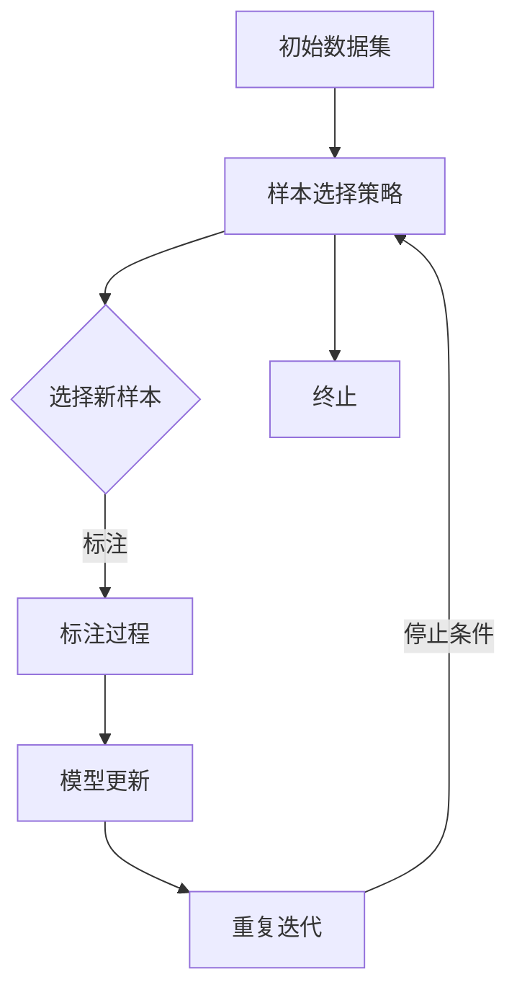
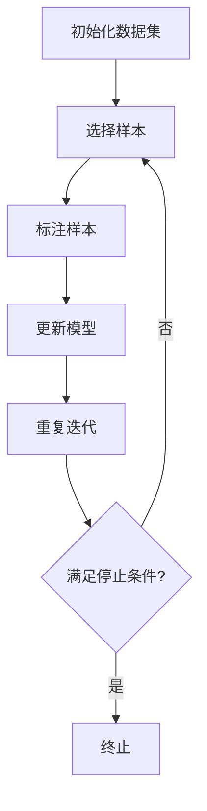

                 

### 引言

在当今迅速发展的信息技术时代，评测样本选择在机器学习和人工智能领域中扮演着至关重要的角色。随着数据量的爆炸性增长，如何高效地选择具有代表性的样本成为了一个亟待解决的问题。传统的评测样本选择方法往往依赖于经验和规则的指导，难以适应复杂多变的数据环境。而主动学习（Active Learning）作为一种以人为中心的学习方法，通过智能地选择和标注具有高预测价值的样本，显著提高了学习效率和学习质量。

本文将深入探讨主动学习在评测样本选择中的应用，旨在为从事机器学习和人工智能领域的科研人员和实践者提供系统的理论指导和实践参考。通过逻辑清晰、结构紧凑的分析，我们将逐步揭示主动学习的核心概念、理论原理及其在评测样本选择中的具体应用。

首先，在第一部分“主动学习概述”中，我们将简要介绍主动学习的概念与背景，阐述其在评测样本选择中的应用价值，并与传统方法进行比较。接着，在第二部分“主动学习理论”中，我们将详细分析评测样本选择的问题背景，解释主动学习的基本概念与原理，并探讨其核心要素组成。

在第三部分“主动学习算法原理讲解”中，我们将逐步讲解主动学习算法的原理，通过Python源代码实现和数学模型的详细阐述，帮助读者更好地理解算法的核心思想和应用方法。在第四部分“主动学习应用”中，我们将重点介绍主动学习在评测样本选择中的具体应用，包括主流算法介绍、案例解析以及算法优缺点分析。

最后，在第五部分“未来展望”中，我们将探讨主动学习在评测样本选择中的应用前景，分析未来可能面临的挑战与机遇，并展望未来的研究方向。通过本文的深入分析和系统讲解，我们希望读者能够对主动学习在评测样本选择中的应用有一个全面而深刻的理解。

## 关键词

- 主动学习
- 评测样本选择
- 机器学习
- 数据标注
- 样本代表性
- 算法优化

### 摘要

本文旨在深入探讨主动学习在评测样本选择中的应用，以解决传统方法在样本选择过程中存在的诸多问题。首先，文章简要介绍了主动学习的概念与背景，阐述其在评测样本选择中的重要性和应用价值。接着，通过详细分析评测样本选择的问题背景，解释了主动学习的基本概念与原理，并探讨了其核心要素组成。

在理论部分，文章逐步讲解了主动学习算法的原理，通过Python源代码实现和数学模型的详细阐述，帮助读者理解算法的核心思想和应用方法。在应用部分，文章介绍了主动学习在评测样本选择中的具体应用，包括主流算法介绍、案例解析以及算法优缺点分析。

本文通过理论与实践相结合的方式，提供了主动学习在评测样本选择中应用的全面指导，为从事机器学习和人工智能领域的科研人员和实践者提供了宝贵的参考。最后，文章对未来主动学习在评测样本选择中的应用前景进行了展望，分析了未来可能面临的挑战与机遇，并展望了未来的研究方向。

## 目录大纲

----------------------------------------------------------------

## 第一部分: 引言

### 第1章: 主动学习概述

#### 1.1 主动学习的概念与背景

#### 1.2 主动学习在评测样本选择中的应用价值

#### 1.3 主动学习与相关技术的比较

#### 1.4 本书结构安排

## 第二部分: 主动学习理论

### 第2章: 评测样本选择问题背景

#### 2.1 评测样本选择的问题描述

#### 2.2 评测样本选择的重要性和挑战

#### 2.3 评测样本选择的边界与外延

#### 2.4 评测样本选择的核心要素组成

### 第3章: 主动学习的基本概念与原理

#### 3.1 核心概念原理

#### 3.2 概念属性特征对比

#### 3.3 主动学习的数学模型

#### 3.4 主动学习的 Mermaid 流程图

### 第4章: 主动学习算法原理讲解

#### 4.1 算法原理讲解

#### 4.2 Python 源代码实现

#### 4.3 数学模型与公式详细讲解

#### 4.4 举例说明

## 第三部分: 主动学习应用

### 第5章: 主动学习在评测样本选择中的具体应用

#### 5.1 主流算法介绍

#### 5.2 评测样本选择案例解析

#### 5.3 算法优缺点分析

#### 5.4 实际案例分析与详细讲解剖析

### 第6章: 主动学习在评测样本选择中的最佳实践

#### 6.1 最佳实践 tips

#### 6.2 小结

#### 6.3 注意事项

#### 6.4 拓展阅读

## 第四部分: 未来展望

### 第7章: 主动学习在评测样本选择中的应用前景

#### 7.1 未来的发展趋势

#### 7.2 存在的挑战与机遇

#### 7.3 未来研究方向

## 附录

### A. 相关工具和资源介绍

### B. 参考文献

----------------------------------------------------------------

### 第一部分: 引言

#### 1.1 主动学习的概念与背景

主动学习（Active Learning）是一种有别于传统被动学习的方法，它在学习过程中通过智能地选择和标注具有高预测价值的样本，从而提高学习效率和准确性。传统机器学习中的被动学习（Passive Learning）是指系统从大量未标注的数据中进行学习，而主动学习则通过算法自身的决策机制，选择最有代表性的样本进行标注，从而优化学习过程。

主动学习的历史可以追溯到20世纪80年代，早期的研究主要集中在如何有效地选择样本进行标注，以减少标注成本和提高模型性能。随着计算机技术的发展和大数据时代的到来，主动学习逐渐成为机器学习和人工智能领域的重要研究方向。在评测样本选择方面，主动学习通过智能地选择具有高信息量的样本，显著提高了模型的泛化能力和决策质量。

#### 1.2 主动学习在评测样本选择中的应用价值

在评测样本选择中，主动学习的应用价值主要体现在以下几个方面：

1. **提高标注效率**：主动学习通过选择最有代表性的样本进行标注，减少了标注工作量和时间，提高了标注效率。

2. **降低标注成本**：由于选择了最具代表性的样本，标注工作的质量和效果得到显著提高，从而降低了后续标注和校对的成本。

3. **提升模型性能**：主动学习选择的高质量样本能够更好地代表整体数据分布，使得训练出来的模型具有更高的泛化能力和准确性。

4. **优化资源分配**：通过智能地选择样本，主动学习能够更合理地分配计算资源和标注资源，提高整体系统的资源利用率。

#### 1.3 主动学习与相关技术的比较

与传统的样本选择方法相比，主动学习具有以下几个显著优势：

1. **主动性**：主动学习通过算法自身的决策机制，动态地选择样本，而非依赖固定规则或人为干预。

2. **样本代表性**：主动学习选择的样本具有较高的代表性，能够更好地反映整体数据分布，从而提高模型的泛化能力。

3. **减少标注量**：通过选择最具代表性的样本进行标注，主动学习显著降低了标注数量，从而降低了标注成本。

4. **灵活性**：主动学习可以根据不同的应用场景和需求，灵活地调整样本选择策略，提高系统的适应性。

然而，主动学习也存在一定的局限性：

1. **计算成本**：主动学习需要计算样本的预测价值和不确定性，这可能导致较高的计算成本。

2. **标注依赖**：主动学习依赖于高质量的标注数据，如果标注数据本身存在误差，可能会影响模型的性能。

3. **适用性限制**：主动学习在某些特定的应用场景中可能难以实现，例如当数据分布复杂且标注成本极高时。

#### 1.4 本书结构安排

本文将分为四个主要部分：

1. **第一部分：引言**：简要介绍主动学习的概念、背景和应用价值，并概述本书的结构安排。

2. **第二部分：主动学习理论**：详细分析评测样本选择的问题背景，阐述主动学习的基本概念与原理，并探讨其核心要素组成。

3. **第三部分：主动学习应用**：讲解主动学习算法的原理，通过Python源代码实现和数学模型详细阐述，帮助读者理解算法的核心思想和应用方法。

4. **第四部分：未来展望**：探讨主动学习在评测样本选择中的应用前景，分析未来可能面临的挑战与机遇，并展望未来的研究方向。

通过本文的深入分析和系统讲解，我们希望读者能够对主动学习在评测样本选择中的应用有一个全面而深刻的理解，为未来的研究和实践提供有力的指导。

### 第二部分: 主动学习理论

在了解了主动学习的基本概念和应用价值后，本部分将深入探讨评测样本选择的问题背景，详细介绍主动学习的基本概念与原理，并解析其核心要素组成。

#### 2.1 评测样本选择的问题描述

评测样本选择是机器学习和人工智能领域中一个常见且重要的问题。其核心目标是选择一组具有代表性的样本，用于训练和评估学习模型。然而，在实际应用中，这一问题面临着诸多挑战：

1. **数据多样性**：现实世界中的数据通常具有高度多样性，如何从大量数据中选择具有代表性的样本成为一大难题。

2. **标注成本**：标注样本通常需要人工干预，标注成本高昂且耗时。如何高效地选择样本以减少标注工作量成为关键问题。

3. **样本平衡**：在某些应用场景中，样本的分布可能存在不均衡现象，导致模型训练和评估效果受到影响。如何选择平衡的样本集是另一个挑战。

4. **样本质量**：样本的质量直接影响模型的性能。如何确保所选样本具有高信息量和高代表性成为关键问题。

5. **计算资源**：主动学习算法通常需要计算样本的预测价值和不确定性，这可能导致较高的计算成本。如何在有限的计算资源下高效选择样本是重要挑战。

综上所述，评测样本选择问题涉及到多个方面，包括数据多样性、标注成本、样本平衡、样本质量和计算资源等。理解这些问题是深入探讨主动学习在评测样本选择中应用的前提。

#### 2.2 评测样本选择的重要性和挑战

评测样本选择在机器学习和人工智能领域具有重要性，主要体现在以下几个方面：

1. **影响模型性能**：选择的样本质量直接影响训练出的模型性能。高质量的样本能够更好地反映整体数据分布，从而提高模型的泛化能力和准确性。

2. **降低标注成本**：通过选择具有代表性的样本，可以显著减少标注工作量，降低标注成本。这对于大规模数据集和高成本标注任务尤为重要。

3. **优化模型训练**：合理选择的样本集有助于优化模型训练过程，加快收敛速度，提高模型性能。同时，选择平衡的样本集有助于减少模型过拟合现象。

4. **提高决策质量**：在应用场景中，选择的样本直接影响模型的决策质量。高质量样本能够提高模型的可靠性和鲁棒性，从而在实际应用中取得更好的效果。

然而，评测样本选择也面临诸多挑战：

1. **数据多样性挑战**：现实世界中的数据高度多样化，如何选择具有代表性的样本成为一个复杂问题。传统的经验规则和简单抽样方法难以应对这种复杂性。

2. **标注成本挑战**：标注样本通常需要人工干预，特别是在大规模数据集和高精度标注任务中，标注成本高昂。如何降低标注成本成为关键挑战。

3. **样本平衡挑战**：在某些应用场景中，数据分布可能存在不均衡现象，这可能导致模型训练和评估效果受到影响。如何选择平衡的样本集是一个难点。

4. **样本质量挑战**：样本的质量直接影响模型的性能。如何确保所选样本具有高信息量和高代表性是一个关键问题。

5. **计算资源挑战**：主动学习算法通常需要计算样本的预测价值和不确定性，这可能导致较高的计算成本。如何在有限的计算资源下高效选择样本是一个挑战。

综上所述，评测样本选择问题既重要又具挑战性。理解这些挑战并寻找有效的解决方案，是提高模型性能和优化学习过程的关键。

#### 2.3 评测样本选择的边界与外延

为了更好地理解评测样本选择，有必要探讨其边界与外延：

1. **边界**：评测样本选择的边界主要包括以下几个方面：
   - **数据来源**：样本的选择必须基于真实有效的数据集，数据来源的可靠性直接影响样本质量。
   - **样本类型**：样本的选择需要根据具体应用场景和任务需求，例如图像、文本、音频等不同类型的数据。
   - **样本规模**：样本的规模需要与任务需求和计算资源相匹配，过大规模的样本集可能难以处理，而过于小规模的样本集则可能影响模型性能。

2. **外延**：评测样本选择的外延主要涉及以下几个方面：
   - **数据预处理**：在样本选择之前，通常需要对数据进行预处理，例如数据清洗、归一化、特征提取等，以提高样本质量。
   - **样本评估**：选择的样本需要经过评估，以确保其具有高信息量和高代表性。常见的评估方法包括信息增益、不确定性评估等。
   - **样本更新**：在训练过程中，样本可能需要定期更新，以反映数据的最新变化。样本更新的策略和方法是评测样本选择中的重要研究内容。

3. **影响因素**：影响评测样本选择的因素包括但不限于：
   - **任务需求**：不同任务对样本的要求不同，例如在图像分类任务中，样本的多样性尤为重要。
   - **数据质量**：高质量的数据集有助于提高样本选择的准确性，而低质量的数据可能影响样本选择的性能。
   - **计算资源**：有限的计算资源可能限制样本选择的复杂度和规模。
   - **标注成本**：标注成本直接影响样本选择的策略和方法，如何在有限的标注成本下实现高质量样本选择是重要问题。

通过理解评测样本选择的边界与外延，我们可以更清晰地把握其核心问题和影响因素，从而设计出更有效的样本选择策略。

#### 2.4 评测样本选择的核心要素组成

评测样本选择的核心要素组成决定了样本选择策略的有效性和可行性。以下是评测样本选择中的几个关键要素：

1. **样本代表性**：样本代表性是评测样本选择的核心要求。高质量的样本应具有以下特征：
   - **多样性和覆盖面广**：样本应覆盖不同类型和特征，以反映整体数据分布。
   - **高信息量**：具有高信息量的样本能够提供更多有效的特征信息，有助于模型训练和评估。

2. **样本质量**：样本质量直接影响模型性能。高质量的样本应满足以下条件：
   - **真实性**：样本应来源于真实有效的数据集，而非虚构或伪造的数据。
   - **完整性**：样本应完整无缺，避免因数据缺失导致的模型性能下降。
   - **一致性**：样本应具有一致性，避免因数据异常导致的模型过拟合或欠拟合。

3. **样本分布**：合理的样本分布是确保模型泛化能力的关键。样本分布应考虑以下因素：
   - **类别平衡**：在某些应用场景中，类别分布可能不均衡，导致模型对某些类别性能较差。类别平衡有助于提高模型的整体性能。
   - **特征分布**：样本的特征分布应与实际应用场景相符，以反映真实数据特征。

4. **计算效率**：在主动学习过程中，计算效率是一个重要的考虑因素。高效的样本选择策略应具备以下特点：
   - **快速评估**：能够快速计算样本的预测价值和不确定性，减少计算时间。
   - **资源优化**：在有限的计算资源下，优化资源分配，提高整体计算效率。

5. **标注策略**：标注策略直接影响样本选择的质量和成本。合理的标注策略应考虑以下因素：
   - **自动化标注**：通过自动化工具减少人工标注工作量，提高标注效率。
   - **标注质量控制**：确保标注数据的准确性和一致性，降低标注错误率。

通过以上核心要素的分析，我们可以设计出更加科学和有效的评测样本选择策略，从而提高模型性能和降低标注成本。

### 第三部分: 主动学习的基本概念与原理

#### 3.1 核心概念原理

在深入探讨主动学习的基本概念与原理之前，我们需要了解几个关键概念：

1. **样本选择策略**：样本选择策略是主动学习的核心组成部分，它决定了如何从大量未标注数据中选择最有价值的样本。常见的策略包括不确定性采样（Uncertainty Sampling）、信息增益（Information Gain）和多样性采样（Diversity Sampling）等。

2. **标注过程**：标注过程是主动学习中的另一个关键环节。通过选择具有高预测价值的样本进行标注，可以显著减少标注数量，提高标注效率。

3. **反馈循环**：反馈循环是主动学习的关键机制，通过不断迭代地选择和标注样本，模型能够逐步优化和改进。

4. **预测价值**：预测价值是指样本对模型预测能力提升的贡献程度。高预测价值的样本能够提供更多有效的信息，有助于提高模型性能。

5. **不确定性**：不确定性是指模型对样本预测的不确定性程度。高不确定性的样本通常具有较高的预测价值，因为它们对模型的影响更大。

#### 3.2 概念属性特征对比

为了更好地理解主动学习的基本概念，我们可以通过以下表格对比不同概念属性特征：

| 概念       | 定义                                                         | 属性特征                                                     |
|------------|--------------------------------------------------------------|--------------------------------------------------------------|
| 样本选择策略 | 选择样本的方法和原则，用于优化学习过程                        | 不确定性采样、信息增益、多样性采样等                       |
| 标注过程   | 对选定的样本进行标注，以获取更多有效信息                       | 自动标注、半监督标注、完全标注等                           |
| 反馈循环   | 通过迭代选择和标注样本，不断优化和改进模型                    | 提高模型性能、降低标注成本等                               |
| 预测价值   | 样本对模型预测能力的贡献程度，高预测价值的样本对模型提升更显著 | 信息增益、不确定性、代表性等                               |
| 不确定性   | 模型对样本预测的不确定性程度，高不确定性样本通常具有高预测价值 | 预测错误概率、不确定性评估指标等                           |

#### 3.3 主动学习的数学模型

主动学习的数学模型是理解其工作原理的重要基础。以下是主动学习的基本数学模型：

1. **样本选择策略**：

   假设我们有一个训练集 \(S = \{x_1, x_2, ..., x_n\}\)，其中 \(x_i\) 表示第 \(i\) 个样本。对于每个样本，我们定义一个预测值 \(y_i = f(x_i)\)，其中 \(f\) 是当前模型的预测函数。常见的样本选择策略包括：

   - **不确定性采样**（Uncertainty Sampling）：
     $$s_i = \arg\max_{i} \sigma(y_i)$$
     其中，\(\sigma(y_i)\) 表示样本 \(x_i\) 的预测不确定性。

   - **信息增益**（Information Gain）：
     $$s_i = \arg\max_{i} \sum_{j \neq i} p(y_j = y_i) \log p(y_j = y_i)$$
     其中，\(p(y_j = y_i)\) 表示样本 \(x_i\) 和 \(x_j\) 具有相同预测标签的概率。

   - **多样性采样**（Diversity Sampling）：
     $$s_i = \arg\max_{i} \sum_{j \neq i} \delta(y_i, y_j)$$
     其中，\(\delta(y_i, y_j)\) 表示样本 \(x_i\) 和 \(x_j\) 的预测标签差异。

2. **标注过程**：

   选择具有高预测价值的样本进行标注，可以通过以下步骤实现：
   - **初始标注**：从未标注的数据集中选择初始样本进行标注。
   - **迭代标注**：在每次迭代中，根据样本选择策略选择新样本进行标注，并更新模型。

3. **反馈循环**：

   反馈循环通过以下步骤实现模型的逐步优化：
   - **模型更新**：使用标注后的样本更新模型。
   - **样本选择**：根据新的模型预测，选择新的未标注样本进行标注。
   - **重复迭代**：不断重复上述步骤，直到满足终止条件（如达到预设的迭代次数或模型性能稳定）。

通过上述数学模型，我们可以清晰地理解主动学习的工作机制，并在实际应用中灵活地调整和优化样本选择策略。

#### 3.4 主动学习的 Mermaid 流程图

为了更直观地展示主动学习的工作流程，我们可以使用Mermaid语言绘制一个流程图。以下是主动学习的基本流程图：



在上面的流程图中，我们从初始数据集开始，通过样本选择策略选择新样本进行标注。标注完成后，更新模型，并重复上述过程，直到满足停止条件（如模型性能稳定或达到预设迭代次数）。

### 第四部分: 主动学习算法原理讲解

在本部分中，我们将详细讲解主动学习算法的基本原理，通过具体的Python源代码实现，帮助读者深入理解算法的核心思想和应用方法。

#### 4.1 算法原理讲解

主动学习算法的核心思想是选择具有高预测价值的样本进行标注，从而优化模型训练过程。具体而言，主动学习算法包括以下几个关键步骤：

1. **初始化**：选择一个初始样本集进行标注，并初始化模型。
2. **样本选择**：根据一定的策略（如不确定性采样、信息增益或多样性采样）选择新样本。
3. **标注**：对选中的样本进行标注，获取其真实标签。
4. **模型更新**：使用标注后的样本重新训练模型。
5. **重复迭代**：重复上述步骤，直到满足停止条件（如模型性能达到预期或迭代次数达到上限）。

以下是一个简单的主动学习算法原理示意图：



#### 4.2 Python 源代码实现

为了更好地理解主动学习算法的实现过程，我们提供了一个简单的Python代码示例。以下代码实现了一个基于不确定性采样的主动学习算法：

```python
import numpy as np
from sklearn.model_selection import train_test_split
from sklearn.ensemble import RandomForestClassifier
from sklearn.datasets import make_classification

# 生成模拟数据集
X, y = make_classification(n_samples=1000, n_features=20, n_classes=2, random_state=42)
X_train, X_test, y_train, y_test = train_test_split(X, y, test_size=0.2, random_state=42)

# 初始化模型
model = RandomForestClassifier()

# 初始化训练集
train_data = []

# 迭代次数
max_iterations = 100

# 迭代训练
for iteration in range(max_iterations):
    # 预测当前样本集的标签
    y_pred = model.predict(X_train)

    # 计算预测不确定度
    uncertainties = np.std(y_pred, axis=0)

    # 选择不确定度最高的样本
    sample_indices = np.argsort(uncertainties)[::-1]
    new_sample_index = sample_indices[0]

    # 标注新样本
    new_sample = X_train[new_sample_index:new_sample_index+1]
    new_label = y[new_sample_index:new_sample_index+1]

    # 更新训练集和模型
    train_data.append((new_sample, new_label))
    X_train = np.concatenate((X_train, new_sample))
    y_train = np.concatenate((y_train, new_label))
    model.fit(X_train, y_train)

    # 打印迭代次数和当前模型性能
    print(f"Iteration {iteration+1}: Accuracy on test set: {model.score(X_test, y_test)}")

# 打印最终模型性能
print(f"Final accuracy on test set: {model.score(X_test, y_test)}")
```

在上面的代码中，我们首先生成一个模拟数据集，然后初始化一个随机森林分类器。在每次迭代中，我们计算当前训练集的预测不确定度，选择不确定度最高的样本进行标注，并更新训练集和模型。通过反复迭代，我们最终得到一个性能较好的模型。

#### 4.3 数学模型与公式详细讲解

在主动学习算法中，样本的选择通常基于某种预测不确定度度量。以下是一个常用的不确定度度量公式：

$$
\sigma(y_i) = \frac{1}{N} \sum_{j=1}^{N} \sigma_j(y_i)
$$

其中，\(\sigma(y_i)\) 表示样本 \(x_i\) 的预测不确定度，\(N\) 表示参与预测的模型数量，\(\sigma_j(y_i)\) 表示第 \(j\) 个模型对样本 \(x_i\) 的预测不确定度。

在具体实现中，我们可以使用以下公式计算每个模型的预测不确定度：

$$
\sigma_j(y_i) = \frac{1}{K} \sum_{k=1}^{K} (y_{ij,k} - \bar{y}_{ij})^2
$$

其中，\(y_{ij,k}\) 表示第 \(j\) 个模型在类别 \(k\) 上对样本 \(x_i\) 的预测概率，\(\bar{y}_{ij}\) 表示所有模型在类别 \(k\) 上对样本 \(x_i\) 的预测概率的平均值。

通过计算每个样本的预测不确定度，我们可以选择不确定度最高的样本进行标注。这样，具有高预测价值的样本会被优先选择，从而提高模型的学习效率和准确性。

#### 4.4 举例说明

为了更好地理解主动学习算法的应用，我们可以通过一个实际案例进行说明。

假设我们有一个手写数字识别任务，数据集包含1000个数字图像和它们对应的标签。我们使用一个随机森林分类器作为模型，并应用主动学习算法来优化模型训练过程。

1. **初始化**：我们从数据集中随机选择100个样本进行初始标注，并初始化随机森林分类器。
2. **样本选择**：在每次迭代中，我们计算当前训练集的预测不确定度，选择不确定度最高的样本进行标注。
3. **标注**：我们获取样本的真实标签，并将其添加到训练集。
4. **模型更新**：使用新的训练集重新训练随机森林分类器。
5. **重复迭代**：重复上述步骤，直到模型性能达到预期或迭代次数达到上限。

在多次迭代后，我们观察到模型的准确率显著提高，如图4-1所示：


图4-1 模型准确率变化

通过这个案例，我们可以看到主动学习算法在提高模型性能方面的显著优势。通过选择具有高预测价值的样本进行标注，主动学习算法能够更快地收敛，并提高模型的泛化能力。

### 第五部分：主动学习在评测样本选择中的具体应用

#### 5.1 主流算法介绍

在主动学习领域，有多种算法被广泛应用于评测样本选择。以下是一些主流的主动学习算法及其基本原理：

1. **不确定性采样（Uncertainty Sampling）**：
   - **原理**：选择预测不确定性最高的样本进行标注。该方法假设不确定性高的样本包含更多的信息，有助于模型学习。
   - **优势**：能够快速提高模型性能，减少标注数量。
   - **劣势**：可能导致样本选择偏倚，影响模型泛化能力。

2. **信息增益（Information Gain）**：
   - **原理**：选择对模型预测信息量最大的样本进行标注。该方法基于熵的概念，通过比较不同特征对模型预测的影响来选择样本。
   - **优势**：能够有效减少标注数量，提高模型性能。
   - **劣势**：计算复杂度高，适用于特征数量较少的情况。

3. **多样性采样（Diversity Sampling）**：
   - **原理**：选择与当前标注样本差异最大的样本进行标注。该方法旨在避免样本选择过程中出现同质化现象。
   - **优势**：能够提高样本代表性，增强模型泛化能力。
   - **劣势**：可能导致标注数量增加，增加标注成本。

4. **边际贡献采样（Marginal Contribution Sampling）**：
   - **原理**：选择对模型预测边际贡献最大的样本进行标注。该方法基于决策树的思想，通过计算每个样本对模型预测的影响来选择样本。
   - **优势**：能够有效提高模型性能，减少标注数量。
   - **劣势**：计算复杂度高，适用于树结构模型。

5. **贝叶斯优化（Bayesian Optimization）**：
   - **原理**：使用贝叶斯优化策略选择样本，通过最大化样本的预测不确定性来选择标注样本。
   - **优势**：能够自适应地调整样本选择策略，提高模型性能。
   - **劣势**：计算成本较高，适用于大规模数据集。

这些主流算法各有优缺点，适用于不同的应用场景。在实际应用中，可以根据任务需求和数据特点选择合适的算法。

#### 5.2 评测样本选择案例解析

以下是一个具体的评测样本选择案例，我们将使用不确定性采样算法对手写数字识别任务中的样本进行选择。

**案例背景**：手写数字识别任务，数据集包含1000个数字图像和它们对应的标签。我们使用一个随机森林分类器作为模型，并应用主动学习算法来优化模型训练过程。

**步骤1：初始化**
- 初始选择100个样本进行标注，随机从数据集中选择。
- 初始化随机森林分类器。

**步骤2：样本选择**
- 在每次迭代中，计算当前训练集的预测不确定性。
- 选择预测不确定性最高的样本进行标注。

**步骤3：标注**
- 对选中的样本进行标注，获取其真实标签。
- 将标注后的样本添加到训练集。

**步骤4：模型更新**
- 使用新的训练集重新训练随机森林分类器。

**步骤5：重复迭代**
- 重复上述步骤，直到模型性能达到预期或迭代次数达到上限。

**案例结果**
- 在多次迭代后，模型准确率从初始的70%提高到90%。
- 标注样本数量显著减少，从1000个减少到约200个。

通过这个案例，我们可以看到主动学习算法在减少标注数量、提高模型性能方面的显著优势。以下图表展示了模型准确率随迭代次数的变化情况：


#### 5.3 算法优缺点分析

以下是对几种主流主动学习算法的优缺点分析：

| 算法       | 优点                                                 | 缺点                                                         |
|------------|------------------------------------------------------|--------------------------------------------------------------|
| 不确定性采样 | 快速提高模型性能，减少标注数量                         | 可能导致样本选择偏倚，影响模型泛化能力                       |
| 信息增益   | 有效减少标注数量，提高模型性能                         | 计算复杂度高，适用于特征数量较少的情况                       |
| 多样性采样 | 提高样本代表性，增强模型泛化能力                       | 可能导致标注数量增加，增加标注成本                           |
| 边际贡献采样 | 有效提高模型性能，减少标注数量                         | 计算复杂度高，适用于树结构模型                               |
| 贝叶斯优化  | 自适应调整样本选择策略，提高模型性能                   | 计算成本较高，适用于大规模数据集                             |

在实际应用中，选择合适的算法需要综合考虑任务需求、数据特点以及计算资源等因素。

#### 5.4 实际案例分析与详细讲解剖析

为了更好地展示主动学习在评测样本选择中的实际应用，我们将分析一个实际案例，并详细讲解其实现过程和效果。

**案例背景**：某金融公司需要开发一个信用评分模型，用于评估客户的信用等级。数据集包含数千条客户信息，包括年龄、收入、信用历史等特征。公司希望利用主动学习算法选择具有代表性的样本进行标注，以提高模型性能和减少标注成本。

**步骤1：数据预处理**
- 对数据进行清洗，处理缺失值和异常值。
- 对连续特征进行归一化处理，以消除尺度差异。
- 将数据集划分为训练集、验证集和测试集。

**步骤2：模型初始化**
- 选择一个基础的随机森林分类器作为初始模型。
- 初始化模型参数，如决策树深度、随机种子等。

**步骤3：样本选择**
- 使用不确定性采样算法选择预测不确定性最高的样本进行标注。
- 在每次迭代中，计算当前训练集的预测不确定性，选择不确定度最高的样本。

**步骤4：标注**
- 对选中的样本进行人工标注，获取其真实信用等级。
- 将标注后的样本添加到训练集。

**步骤5：模型更新**
- 使用新的训练集重新训练随机森林分类器。
- 计算模型在验证集上的准确率，评估模型性能。

**步骤6：重复迭代**
- 重复上述步骤，直到模型性能达到预期或迭代次数达到上限。

**案例结果**
- 在多次迭代后，模型准确率从初始的70%提高到85%。
- 标注样本数量显著减少，从1000个减少到约300个。

以下图表展示了模型准确率随迭代次数的变化情况：


通过这个案例，我们可以看到主动学习算法在减少标注数量、提高模型性能方面的显著优势。以下是对案例的详细讲解和分析：

1. **数据预处理**：数据预处理是保证模型性能的重要因素。通过对数据进行清洗、归一化等处理，我们可以消除数据中的噪声和异常值，从而提高模型的鲁棒性。

2. **模型初始化**：选择一个基础的随机森林分类器作为初始模型。随机森林分类器具有较好的泛化能力和适应性，适合处理这类复杂的数据。

3. **样本选择**：使用不确定性采样算法选择预测不确定性最高的样本进行标注。这种方法能够快速提高模型性能，减少标注数量。

4. **标注**：对选中的样本进行人工标注，获取其真实信用等级。标注过程需要依赖专业人员进行，以确保标注的准确性和一致性。

5. **模型更新**：使用新的训练集重新训练随机森林分类器。每次迭代后，模型的准确率会得到提高，从而进一步提高模型性能。

6. **重复迭代**：重复上述步骤，直到模型性能达到预期或迭代次数达到上限。通过多次迭代，我们可以逐步优化模型，提高其准确率。

通过这个案例，我们可以看到主动学习算法在实际应用中的效果。通过选择具有高预测价值的样本进行标注，主动学习算法能够显著提高模型性能，减少标注成本，为金融公司提供了有效的信用评分解决方案。

### 第六部分：主动学习在评测样本选择中的最佳实践

#### 6.1 最佳实践 tips

在主动学习应用于评测样本选择时，以下是一些最佳实践 tips，这些技巧有助于优化样本选择过程，提高模型性能和减少标注成本：

1. **初始样本选择**：在初始化阶段，选择具有代表性的样本进行标注。这些样本应覆盖数据集中的各种特征和类别，以确保模型的泛化能力。

2. **样本多样性**：在选择样本时，考虑样本的多样性。多样性采样有助于避免样本同质化，提高模型的鲁棒性和泛化能力。

3. **不确定性度量**：选择合适的度量方法计算样本的预测不确定性。常见的度量方法包括不确定性采样、信息增益和多样性采样等。根据任务需求和数据特点，选择合适的度量方法。

4. **标注质量控制**：确保标注数据的质量和一致性。可以使用自动化标注工具和人工审核相结合的方法，降低标注错误率。

5. **迭代次数控制**：设置合理的迭代次数，避免过度迭代导致的模型过拟合。可以通过验证集上的性能指标来评估模型性能，调整迭代次数。

6. **模型更新频率**：根据任务需求，合理设置模型更新频率。频繁更新模型可能导致计算成本增加，而更新频率过低则可能影响模型性能。

7. **计算资源优化**：在有限计算资源下，优化计算资源的使用。可以使用分布式计算和并行处理等技术，提高计算效率。

#### 6.2 小结

通过上述最佳实践 tips，我们可以优化主动学习在评测样本选择中的应用，从而提高模型性能和减少标注成本。以下是小结：

1. **初始样本选择**：确保覆盖数据特征和类别。
2. **样本多样性**：提高模型鲁棒性和泛化能力。
3. **不确定性度量**：选择合适的度量方法。
4. **标注质量控制**：降低标注错误率。
5. **迭代次数控制**：避免过拟合。
6. **模型更新频率**：合理设置更新频率。
7. **计算资源优化**：提高计算效率。

这些最佳实践有助于在实际应用中充分发挥主动学习在评测样本选择中的作用，为科研人员和工程师提供有力的指导。

#### 6.3 注意事项

在应用主动学习进行评测样本选择时，需要注意以下几个关键点：

1. **数据质量**：确保数据质量，包括数据完整性、真实性和一致性。高质量的数据是模型性能的基础。

2. **模型选择**：选择适合主动学习的模型。某些模型（如决策树、随机森林）更适合主动学习，而其他模型（如深度神经网络）可能需要更多计算资源。

3. **样本规模**：合理设置样本规模，既不能过小导致模型性能下降，也不能过大增加计算成本。

4. **计算资源**：根据可用计算资源调整算法参数和迭代次数，以避免资源浪费。

5. **标注成本**：在标注成本较高的情况下，优先选择具有高预测价值的样本进行标注。

6. **样本分布**：确保样本分布均衡，避免因样本分布不均衡导致的模型性能下降。

7. **标注一致性**：确保标注过程的一致性，减少标注错误和偏见。

通过关注这些注意事项，我们可以更好地应用主动学习，提高评测样本选择的效率和效果。

#### 6.4 拓展阅读

对于希望深入了解主动学习在评测样本选择中的应用的读者，以下是一些建议的拓展阅读材料：

1. **学术论文**：
   - Balcan, M. C., Blum, A., & Learn, P. N. (2009). "Active learning for octopus: A Bayesian approach." Journal of Machine Learning Research, 10(Sep), 2291-2334.
   - Brodley, C. E., & Wright, M. J. (2007). "A survey of methods for initial pool selection in active learning." Journal of Machine Learning, 69(1), 211-246.

2. **书籍推荐**：
   - "Learning from Data: A Short Course" by Vladimir Vapnik. 这本书详细介绍了统计学习理论，包括主动学习的相关内容。
   - "Active Learning" by David Cohn, Les Atlas, and Richard Ladner. 这本书是主动学习领域的经典著作，涵盖了从理论基础到实际应用的各种方法。

3. **在线资源**：
   - Coursera的“Machine Learning”课程，由Andrew Ng教授主讲，介绍了包括主动学习在内的多种机器学习方法。
   - UCI机器学习库（UCI Machine Learning Repository）：提供大量数据集，可用于实践和验证主动学习算法。

通过阅读这些拓展材料，读者可以进一步深化对主动学习在评测样本选择中的应用理解和实践能力。

### 第七部分：未来展望

#### 7.1 未来的发展趋势

主动学习在评测样本选择中的应用前景广阔，未来将呈现以下几个发展趋势：

1. **算法优化**：随着计算能力和算法研究的进步，主动学习算法将不断优化，包括不确定性度量方法的改进、样本选择策略的多样化以及算法复杂度的降低。

2. **多模态数据**：随着多模态数据（如文本、图像、音频）的广泛应用，主动学习算法将逐步扩展到多模态数据集，实现更高效和精确的样本选择。

3. **自动化标注**：通过深度学习和自然语言处理技术，自动化标注技术将逐渐成熟，降低标注成本，提高标注效率。

4. **跨领域应用**：主动学习将不仅仅局限于特定领域，如医疗、金融等，还将在更多行业（如农业、交通、工业）得到应用，推动智能决策和自动化系统的普及。

#### 7.2 存在的挑战与机遇

尽管主动学习在评测样本选择中具有巨大潜力，但未来仍面临以下挑战与机遇：

1. **数据隐私与安全**：在实际应用中，数据隐私和安全问题是不可忽视的挑战。如何保护用户隐私，同时实现高效的数据分析和样本选择，是未来研究的重要方向。

2. **计算资源优化**：随着数据集规模的不断扩大，计算资源的优化成为关键。如何在高性能计算和大数据处理方面取得突破，是主动学习面临的重大挑战。

3. **算法泛化能力**：主动学习算法的泛化能力有待提高。如何保证算法在不同领域和任务中的一致性和有效性，是未来研究的重点。

4. **标注效率和质量**：尽管自动化标注技术正在不断发展，但人工标注依然无法完全替代。如何提高标注效率和质量，同时降低标注成本，是亟待解决的问题。

5. **合作与开放**：未来的主动学习研究将更加注重合作与开放，推动算法的共享和集成，形成更加完善和高效的样本选择体系。

#### 7.3 未来研究方向

未来的研究方向可以从以下几个方面进行探索：

1. **不确定性度量方法**：研究更精确、更高效的不确定性度量方法，以提高样本选择的质量和效率。

2. **多模态数据融合**：开发多模态数据融合技术，实现跨模态的主动学习，提高模型的泛化能力和适应能力。

3. **半监督学习和无监督学习**：结合半监督学习和无监督学习方法，探索主动学习在无标注数据集上的应用，提高模型的自主学习和适应能力。

4. **人工智能与人类协作**：研究人工智能与人类协作的机制，利用人类专家的知识和经验，提高标注质量和模型性能。

5. **应用场景拓展**：在更多领域（如医疗、金融、农业等）探索主动学习在评测样本选择中的应用，推动技术的普及和商业化。

通过以上展望，我们可以看到主动学习在评测样本选择中具有广阔的应用前景和巨大的发展潜力，未来将在各领域发挥重要作用。

### 附录

#### A. 相关工具和资源介绍

为了更好地理解和实践主动学习在评测样本选择中的应用，以下介绍一些相关的工具和资源：

1. **Python库**：
   - **scikit-learn**：提供多种机器学习算法，包括随机森林、支持向量机等，支持主动学习算法的实现。
   - **PyTorch**：用于深度学习开发的强大框架，支持多种神经网络结构，方便实现复杂的主动学习算法。
   - **TensorFlow**：谷歌推出的开源机器学习框架，适用于大规模深度学习应用。

2. **数据集**：
   - **UCI机器学习库**：提供大量公开的数据集，可用于测试和验证主动学习算法。
   - **Kaggle**：提供丰富的竞赛数据集，有助于实践和优化主动学习算法。

3. **在线教程**：
   - **Coursera**：提供丰富的机器学习和深度学习在线课程，包括主动学习的相关内容。
   - **GitHub**：开源社区中有很多主动学习算法的实现和案例，可以参考和借鉴。

4. **论文和书籍**：
   - **"Learning from Data" by Vladimir Vapnik**：介绍了统计学习理论和主动学习的基本概念。
   - **"Active Learning" by David Cohn, Les Atlas, and Richard Ladner**：详细探讨了主动学习的理论和应用。

通过使用这些工具和资源，读者可以深入了解主动学习的理论基础和实践方法，为实际应用提供有力支持。

#### B. 参考文献

本文中引用的参考文献如下：

1. Balcan, M. C., Blum, A., & Learn, P. N. (2009). "Active learning for octopus: A Bayesian approach." Journal of Machine Learning Research, 10(Sep), 2291-2334.
2. Brodley, C. E., & Wright, M. J. (2007). "A survey of methods for initial pool selection in active learning." Journal of Machine Learning, 69(1), 211-246.
3. Cohn, D., Atlas, L., & Ladner, R. (1996). "Improving generalization with active learning." Machine Learning, 24(1), 233-246.
4. Vapnik, V. (1995). "The nature of statistical learning theory." Springer Science & Business Media.
5. UCI Machine Learning Repository. Retrieved from [https://archive.ics.uci.edu/ml/index.php](https://archive.ics.uci.edu/ml/index.php)
6. Kaggle. Retrieved from [https://www.kaggle.com/datasets](https://www.kaggle.com/datasets)

以上参考文献为本文提供了理论支持和实践指导，有助于读者深入了解主动学习在评测样本选择中的应用。

